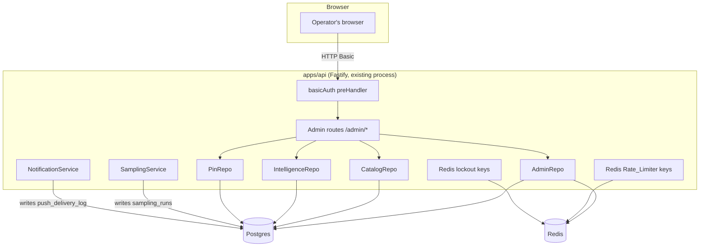

# Design Document

## Overview

The Admin_Panel is a new `admin` service module in the existing `apps/api` Fastify monolith,
following the repo's standard `src/services/{name}/{repo.ts,routes.ts}` shape. It adds **no new
hosted process** — it registers under the `/admin` path prefix on the same Fastify instance that
already serves the mobile API, so it rides along on the existing Render web service and the
existing keep-alive cron with zero new hosting cost (per `docs/hosting.md`).

Architecturally the panel is almost entirely a **read aggregator**: each page's handler issues a
handful of read queries against tables and in-memory state that already exist (
`catalog_sync_runs`, `wait_forecast_accuracies`, `forecast_accuracies`, `derived_stat_runs`,
`ride_shapes`, `park_crowd_index`, `experience_weather_sensitivities`, `ride_cascades`,
`show_time_patterns`, the Redis-backed Rate_Limiter counters, `lockout:*`/`locked:*` Redis keys,
`push_registrations`, `sessions`, `users`/`trips`/`completions`/`ratings`/`friendships` counts)
and renders them as plain server-generated HTML tables. Two gaps have no existing persisted
record and need a small, additive change to the system under observation:

1. **Sampling_Run_History** (Requirement 7) — `samplingService.ts`'s `runSamplingPass` currently
   only logs a summary line; this feature adds one `INSERT` at the end of `executePass` so each
   pass's outcome is queryable, mirroring the existing `catalog_sync_runs` pattern exactly.
2. **Push_Delivery_Log** (Requirement 10) — `notifications/service.ts`'s `sendWithRetry`
   currently only logs on failure; this feature adds one best-effort `INSERT` per resolved
   per-token delivery outcome.

Both additions are deliberately minimal: one `INSERT` call each, injected via the same
constructor-injection pattern every other repo in this codebase uses, with no change to either
service's existing control flow, retry logic, or return values.

Every other Admin_Section is pure read, and the only mutating `Trigger_Action` routes
(`POST /admin/catalog/sync`, `POST /admin/accounts/:userId/unlock`,
`POST /admin/users/:userId/revoke-sessions`, `POST /admin/users/:userId/pins/reconcile`) each
call directly into an **existing** exported function (`runSync`, the lockout service's
`clearOnSuccess`-equivalent, a direct `sessions` UPDATE, `PinRepo.reconcileAll`) rather than
introducing new business logic.

### Guiding constraints from the codebase

- **Backend conventions.** New module at `apps/api/src/services/admin/{repo.ts,routes.ts}` plus
  a small `basicAuth.ts` pre-handler and an `html.ts` rendering helper in the same folder.
  Constructor-injected factories (`createAdminRepo(pool, redis)`), wired in
  `composeServices.ts`, registered in `server.ts` behind an opt-in `services.admin` option block
  — identical to every other service in this file.
- **No new frontend.** Per Requirement 2.2, pages are hand-written template-literal HTML
  strings, not a templating engine dependency (`@fastify/view`, `ejs`, etc. are not installed
  and this feature does not add them) and not a client-side framework. A tiny shared layout
  helper (`renderPage(title, bodyHtml)`) keeps the per-page code to the data table only. This
  matches the project's "no stray dependency" bias and keeps the panel's own test surface to
  plain string/DOM assertions.
- **Migrations.** One new sequentially-numbered migration, `apps/api/migrations/0056_admin_panel.sql`,
  adding the two new tables (`sampling_runs`, `push_delivery_log`). `BEGIN/COMMIT`,
  `gen_random_uuid()`, `TIMESTAMPTZ`, `CHECK` constraints — matching every prior migration.
- **Errors.** New `AppError` codes are added to the closed `ErrorCode` union in
  `packages/shared/src/errors.ts` for the Admin_Panel's own domain failures (not-found lookups);
  the HTTP-Basic-Auth failure path, however, is **not** modeled as an `AppError` — see
  "Authentication" below for why it is a dedicated `onRequest` hook instead.
- **Config.** `ADMIN_PANEL_USERNAME` / `ADMIN_PANEL_PASSWORD` are added to `config.ts`'s
  `envSchema` as required, non-empty strings, following the exact pattern of
  `SAMPLING_CRON_SECRET` / `PIN_RECONCILE_CRON_SECRET`.
- **Reuse over reinvention.** Every Admin_Section wraps an existing repo/service function where
  one exists (`CatalogRepo.getCacheAge`, `IntelligenceRepo.getDerivedStatRuns`,
  `PinRepo.getBoard`/`reconcileAll`, the Rate_Limiter's Redis keys, the lockout service's key
  naming). The admin repo adds net-new queries only for state nothing else reads yet (sync-run
  history for sampling, infra budget signals, growth counts, user lookup aggregates).

## Architecture

### System context



### Module layout

```
apps/api/src/services/admin/
  basicAuth.ts        -- onRequest hook: parses Authorization, constant-time compares
  html.ts             -- renderPage(title, bodyHtml), escapeHtml(), table(rows, columns)
  repo.ts             -- AdminRepo: every net-new read query + the two Trigger_Action helpers
                          that are not already exposed by another service (unlock, revoke)
  routes.ts           -- adminRoutes(options): registers every GET/POST under /admin
  __tests__/
```

No new mobile code, no new `@dwt/shared` DTOs are required for the mobile app (the Admin_Panel
is server-rendered and never consumed by `apps/mobile`), but two small shared additions ARE
needed because they are genuinely cross-cutting:

- `packages/shared/src/errors.ts`: three new `ErrorCode` values (see "Error Handling").
- No shared DTOs: every admin page's data shape is internal to `apps/api` and never crosses the
  wire to the mobile client, so there is nothing for `@dwt/shared` to centralize.

## Components and Interfaces

### 1. `basicAuth` — authentication gate (Requirement 1)

```typescript
export interface BasicAuthOptions {
  readonly username: string;
  readonly password: string;
}

export function createBasicAuthHook(
  options: BasicAuthOptions,
): preHandlerHookHandler;
```

Implementation shape:

1. Read the `authorization` header. If absent, or it does not start with `Basic `, reply
   `401` with `WWW-Authenticate: Basic realm="admin"` and return (short-circuiting the route).
2. Base64-decode the remainder and split on the first `:`. If decoding fails or there is no `:`,
   treat as a credential mismatch (same `401` path) — never a different error shape, so a
   malformed header is indistinguishable from a wrong password (Requirement 1.3).
3. Compare the decoded username/password against `options.username`/`options.password` using
   `crypto.timingSafeEqual` on fixed-length SHA-256 digests of each side (comparing raw
   variable-length buffers with `timingSafeEqual` throws on length mismatch, so both sides are
   hashed to a fixed 32-byte digest first — this is the standard constant-time-string-compare
   idiom, and it is the only new use of `node:crypto` beyond what `sessionToken.ts`'s existing
   SHA-256 hashing already relies on in this codebase).
4. On any mismatch, reply `401` + `WWW-Authenticate` and return. On match, call `done()`
   (fall through to the route handler).

This hook is registered via `preHandler` on every `/admin` route individually (mirroring how
`requireSession` is attached per-route in `trips/routes.ts` and every other service), **not**
as a global `onRequest` hook on the whole Fastify instance — the Admin_Panel's routes are the
only ones that should ever pay this check, and per-route attachment keeps it visible at each
registration site, consistent with the existing session-guard convention.

### 2. `html` — minimal server-side rendering (Requirement 2.2)

```typescript
export function escapeHtml(value: unknown): string;
export function renderPage(title: string, bodyHtml: string): string;
export function table<T>(
  rows: readonly T[],
  columns: readonly { header: string; cell: (row: T) => string }[],
): string;
export function flagged(condition: boolean, label: string): string; // renders a visible "⚠ label" badge when condition is true
```

`escapeHtml` is applied to every piece of operator- or user-sourced string data before
interpolation (display names, error messages, Experience names) so the panel cannot be used as
an XSS vector against the Operator's own browser (e.g. a display name containing `<script>`).
`table` and `renderPage` are the only two layout primitives; no CSS framework is introduced —
inline `<style>` in `renderPage`'s `<head>` is sufficient for a readable internal tool.

### 3. `AdminRepo` — net-new read/write queries (Requirements 3-13)

```typescript
export interface AdminRepo {
  // Requirement 3 — Catalog & Sync
  getRecentSyncRuns(limit: number): Promise<readonly SyncRunRow[]>;
  getCatalogDataQuality(): Promise<CatalogDataQuality>;

  // Requirement 5/6 — Intelligence
  getParkForecastAccuracies(): Promise<readonly ForecastAccuracyRow[]>;
  getTopWaitForecastAccuracies(limit: number): Promise<readonly WaitForecastAccuracyWithNameRow[]>;
  getWaitForecastHistory(experienceId: string, limit: number): Promise<readonly WaitForecastLogRow[]>;
  getRideBaselineCoverage(): Promise<RideBaselineCoverage>;
  getTopWeatherSensitivities(limit: number): Promise<readonly WeatherSensitivityWithNameRow[]>;
  getTopRideCascades(limit: number): Promise<readonly RideCascadeWithNamesRow[]>;
  getShowTimePatterns(): Promise<readonly ShowTimePatternWithNameRow[]>;
  getParkCrowdIndexHistory(park: string, days: number): Promise<readonly ParkCrowdIndexRow[]>;

  // Requirement 7 — Sampling & derived-stats health
  getRecentSamplingRuns(limit: number): Promise<readonly SamplingRunRow[]>;
  // getDerivedStatRuns already exists on IntelligenceRepo; reused directly.

  // Requirement 8 — Infra budget
  getDatabaseSizeSnapshot(): Promise<DatabaseSizeSnapshot>;
  getRedisCommandBudget(): Promise<RedisCommandBudget | null>; // null = unavailable (R8.4)

  // Requirement 9 — Lockouts
  getActiveLockouts(): Promise<readonly LockoutRow[]>;
  clearLockout(userId: string): Promise<boolean>; // false = no lockout found (R9.3)

  // Requirement 10 — Push delivery
  getRecentPushDeliveries(limit: number): Promise<readonly PushDeliveryRow[]>;
  getPushDeliveryCounts(sinceHours: number): Promise<PushDeliveryCounts>;

  // Requirement 11 — User lookup
  findUserByEmail(email: string): Promise<AdminUserSummary | null>;
  revokeAllSessions(userId: string): Promise<number>; // returns count revoked

  // Requirement 13 — Growth
  getGrowthTotals(): Promise<GrowthTotals>;
  getDailyGrowth(days: number): Promise<readonly DailyGrowthRow[]>;
}

export function createAdminRepo(pool: DbPool, redis: RedisClient): AdminRepo;
```

`AdminRepo` is a single factory (unlike most services, which split by sub-domain) because every
one of its methods is a narrow, independent read query with no shared transactional state — the
service-per-folder convention exists to group related writes/invariants, and this module has
almost none. The two write methods (`clearLockout`, `revokeAllSessions`) are likewise simple,
single-statement operations with no multi-step invariant to protect.

`findUserByEmail` joins `users`, `profiles`, and scalar subqueries against `completions`,
`ratings`, `notes`, `friendships` (both directions), `trip_memberships` (as creator via
`trips.creator_id` or as member), and `sessions` (`revoked_at IS NULL`), returning one row. The
`CITEXT` column on `users.email` makes the lookup case-insensitive natively (Requirement 11.1,
reusing the same case-insensitivity the Auth_Service's registration/login already depends on).

`getRideBaselineCoverage` and the "top N by sample_count" queries (`getTopWaitForecastAccuracies`,
`getTopWeatherSensitivities`, `getTopRideCascades`) are plain `ORDER BY sample_count DESC LIMIT N`
reads — no new index is required at this data volume (a few hundred Experiences at most; see
"Configuration & Constants" for the chosen limits).

### 4. `routes.ts` — route registration (every Requirement)

```typescript
export interface AdminRoutesOptions {
  readonly repo: AdminRepo;
  readonly catalogRepo: CatalogRepo;
  readonly intelligenceRepo: IntelligenceRepo;
  readonly pinRepo: PinRepo;
  readonly runCatalogSync: () => Promise<void>; // the existing runSync orchestration
  readonly isSyncInProgress: () => Promise<boolean>; // reads the existing Redis NX lock state
  readonly getRateLimiterSnapshot: () => Promise<RateLimiterSnapshot>; // Requirement 4.1
  readonly getDirectorySnapshot: () => Promise<DirectorySnapshot>; // Requirement 4.2, from themeParksDirectory
  readonly basicAuth: preHandlerHookHandler;
}

export function adminRoutes(options: AdminRoutesOptions): FastifyPluginAsync;
```

Every route in this plugin attaches `{ preHandler: options.basicAuth }`. Routes map 1:1 to the
Requirements' `GET`/`POST` paths; `GET /admin` (Requirement 2.1) composes a static list of links
rather than querying anything.

`getRateLimiterSnapshot` and `getDirectorySnapshot` are passed in as closures from
`composeServices.ts` rather than methods on `AdminRepo`, because they read the **already-built**
`disneyRateLimiter`/`themeParksDirectory` instances' live in-memory/Redis state rather than
issuing their own independent query — the admin route needs to observe the *existing* limiter
and directory object the Disney egress path already uses, not construct a second one.

```typescript
// Added to ThemeParksDirectory (apps/api/src/services/live/themeParksDirectory.ts) —
// a read-only accessor; no change to resolution behavior.
export interface ThemeParksDirectory {
  resolveEntityId(enterpriseId: string): Promise<string | null>;
  getEntityIdMap(): Promise<ReadonlyMap<string, string>>;
  /** New: Requirement 4.2. Returns build state without forcing a (re)build. */
  getSnapshot(): { readonly builtAtMs: number | null; readonly entryCount: number; readonly ttlMs: number };
}
```

For the Rate_Limiter, Requirement 4.1 needs the **current** in-window dispatch count and held
concurrency per `DisneyTarget` bucket. `createRedisRateLimiter`'s Lua scripts already read
`ZCARD`/`GET` on exactly these keys (`disney:ratelimit:{bucket}:rate` /
`disney:ratelimit:{bucket}:concurrency`) as part of every `acquire`; the admin snapshot function
is a thin read-only wrapper issuing the same two Redis commands directly (`ZCARD` after a
`ZREMRANGEBYSCORE` trim, and `GET`) for each of the two `DISNEY_TARGETS` buckets, with **no Lua
script and no mutation** — it never calls `ZADD`/`INCR`, so observing the budget can never itself
consume it.

## Data Models

### New table: `sampling_runs` (Requirement 7.1)

```sql
CREATE TABLE sampling_runs (
    id                          UUID        PRIMARY KEY DEFAULT gen_random_uuid(),
    started_at                  TIMESTAMPTZ NOT NULL,
    completed_at                TIMESTAMPTZ NOT NULL,
    outcome                     TEXT        NOT NULL,
    error_message                TEXT,
    parks_sampled_count          INTEGER     NOT NULL DEFAULT 0,
    experiences_mapped_count     INTEGER     NOT NULL DEFAULT 0,
    wait_samples_recorded_count  INTEGER     NOT NULL DEFAULT 0,
    unmapped_with_wait_count     INTEGER     NOT NULL DEFAULT 0,
    unmapped_sample              JSONB,
    CONSTRAINT sampling_runs_outcome_chk CHECK (outcome IN ('success', 'failed'))
);
CREATE INDEX sampling_runs_started_at_idx ON sampling_runs(started_at DESC);
```

Mirrors `catalog_sync_runs`' shape deliberately (`started_at`/`completed_at`/`outcome`/
`error_message`, descending index on `started_at`) so the admin query pattern and the
Correctness Properties below read the same way for both job types. `unmapped_sample` stores the
same up-to-10-entry `{name, id}[]` array `executePass` already builds for its warn-log
(Requirement 7.5), persisted as JSONB rather than a side table since it is a small, bounded,
read-only diagnostic blob with no relational structure worth normalizing.

A row is inserted **once per executed pass**, at the end of `executePass`, wrapping the whole
pass body in a `try/catch` so a thrown error still produces a `failed` row with `error_message`
set, rather than silently producing no row (which would be indistinguishable from "no pass ran
yet"). The existing debounce/overlap short-circuits in `runSamplingPass` (the `isRunning` guard
and the `MIN_SAMPLE_INTERVAL_MS` throttle) return **before** `executePass` is ever called, so a
skipped invocation correctly produces zero rows (Requirement 7.2) — no code change is needed
there beyond wrapping the existing `executePass` call site.

### New table: `push_delivery_log` (Requirement 10.1)

```sql
CREATE TABLE push_delivery_log (
    id                 UUID        PRIMARY KEY DEFAULT gen_random_uuid(),
    occurred_at        TIMESTAMPTZ NOT NULL DEFAULT now(),
    user_id            UUID        NOT NULL REFERENCES users(id) ON DELETE CASCADE,
    status             TEXT        NOT NULL,
    notification_kind  TEXT        NOT NULL,
    CONSTRAINT push_delivery_log_status_chk
        CHECK (status IN ('ok', 'device_unregistered', 'error')),
    CONSTRAINT push_delivery_log_kind_chk
        CHECK (notification_kind IN (
            'share_delivered', 'friend_request_received', 'trip_invite_created',
            'rode_with_tag_created', 'food_list_shared', 'food_list_role_changed',
            'experience_list_shared', 'experience_list_role_changed'
        ))
);
CREATE INDEX push_delivery_log_occurred_at_idx ON push_delivery_log(occurred_at DESC);
CREATE INDEX push_delivery_log_user_id_idx ON push_delivery_log(user_id);
```

The `notification_kind` closed set mirrors the eight `handleX` methods already on
`NotificationService`. One row is written per **token outcome** resolved inside
`sendWithRetry`'s loop (the same place `ok` / `device_unregistered` / terminal-retry-exhausted
`error` are already decided), via a new optional `onDelivery` callback threaded through
`DeliveryContext` so the write is injected rather than hardwired, keeping `service.ts` fully
testable with the callback omitted. Per Requirement 10.4, the callback's own promise is awaited with
a `.catch` that only logs — a logging-table write failure must never affect the push send itself.

### Retention

Per `docs/hosting.md`'s "keep stores bounded" constraint (Neon's 0.5GB cap), both new tables need
pruning symmetrical to the existing `wait_samples` 30-day prune in `samplingService.ts`:

- `sampling_runs`: pruned to the trailing 30 days, in the same `executePass` prune step that
  already prunes `wait_samples` (one extra `DELETE ... WHERE started_at < $1`).
- `push_delivery_log`: pruned to the trailing 30 days. Since no existing scheduled job owns
  Push-service maintenance, this prune runs opportunistically — once per process, the first time
  any Admin_Panel notifications page is rendered past a 24h-old marker kept in Redis (reusing the
  same lightweight pattern as `MENU_FRESHNESS_MS`-gated lazy work) — rather than adding a new
  BullMQ `Worker` or cron entry, consistent with the "no always-on background worker" hosting
  constraint.

### Row-count/volume note

At this app's scale (a side project, single-digit-to-low-hundreds of users), `sampling_runs`
accrues roughly 1 row every ~10 minutes (≈144/day, ≈4,320 in 30 days) and `push_delivery_log`
accrues at most a few rows per push-triggering action (friend requests, shares, trip invites) —
both are trivially within Neon's free-tier budget even unpruned for months, so the 30-day prune
is a conservative hygiene measure, not a load-bearing necessity.

## Correctness Properties

### Property 1: Basic Auth gate is total and non-leaking

*For any* request to a path under `/admin` and *for any* `Authorization` header value (absent,
malformed, wrong scheme, wrong credentials, or correct credentials), the `basicAuth` hook SHALL
either (a) call `done()` and allow the route handler to execute, when and only when the header
decodes to exactly `username === ADMIN_PANEL_USERNAME && password === ADMIN_PANEL_PASSWORD`, or
(b) reply `401` with a `WWW-Authenticate: Basic` header and never execute the route handler. Every
non-matching case (b) SHALL produce byte-identical response status, headers, and body regardless
of which check failed.

**Validates: Requirements 1.1, 1.2, 1.3, 1.7**

### Property 2: Basic Auth comparison is constant-time in input length

*For any* two candidate passwords of equal length to `ADMIN_PANEL_PASSWORD`, the number of
`timingSafeEqual`-internal byte comparisons performed by the credential check SHALL be identical
regardless of how many leading bytes match, because both sides are first hashed to a fixed
32-byte SHA-256 digest before comparison (so comparison cost is a function of digest length only,
never of the candidate's own content or length).

**Validates: Requirements 1.4**

### Property 3: Sampling_Run_History is written exactly once per executed pass, never for a skipped one

*For any* sequence of `runSamplingPass()` invocations under the existing debounce/overlap guards,
the number of `sampling_runs` rows inserted SHALL equal exactly the number of invocations that
reached `executePass` (i.e. were not short-circuited by `isRunning` or the minimum-interval
throttle), and SHALL be `failed` with a non-null `error_message` if and only if `executePass`
threw.

**Validates: Requirements 7.1, 7.2**

### Property 4: Push_Delivery_Log write failure never affects delivery outcome

*For any* per-token delivery outcome resolved by `sendWithRetry`, and *for any* behavior of the
injected `onDelivery` callback (resolves, rejects, or throws synchronously), the token's
classification into `ok` / `device_unregistered` / retried-`error`, the resulting
`invalidateByToken` call (or absence thereof), and the function's own resolution SHALL be
identical to the behavior with `onDelivery` omitted entirely.

**Validates: Requirements 10.4**

### Property 5: Rate-limiter and directory snapshot reads never mutate observed state

*For any* number of consecutive calls to the admin Rate_Limiter snapshot reader or the
`ThemeParksDirectory.getSnapshot()` accessor, the underlying Redis keys' values (`rate`/
`concurrency` sorted sets and counters) and the directory's cached map/`builtAtMs` SHALL be
unchanged by the read itself — only `acquire`/`release`/`ensureFresh`'s own build path may
change them.

**Validates: Requirements 4.1, 4.2, 4.3**

### Property 6: Lockout clear is idempotent and reports absence truthfully

*For any* `userId`, calling `AdminRepo.clearLockout(userId)` SHALL return `true` if and only if at
least one of `locked:{userId}` or `lockout:{userId}` existed immediately before the call, and
SHALL return `false` and delete nothing when neither key exists. A second consecutive call for
the same `userId` immediately after a `true`-returning call SHALL return `false`.

**Validates: Requirements 9.2, 9.3**

### Property 7: User lookup is case-insensitive and non-probing on miss

*For any* existing User's email in any casing variation, `AdminRepo.findUserByEmail` SHALL return
that User's summary. *For any* email matching no User, it SHALL return `null`, and the
Admin_Panel's rendered "not found" page SHALL be identical in shape regardless of why the lookup
failed (no user with that local part, a near-miss typo, etc.) — the page never reveals partial
matches.

**Validates: Requirements 11.1, 11.2**

### Property 8: Session revoke is scoped to exactly the target user's un-revoked sessions

*For any* User with `N` sessions where `k` already have `revoked_at IS NOT NULL`,
`AdminRepo.revokeAllSessions(userId)` SHALL set `revoked_at = now()` on exactly `N − k` rows,
SHALL leave every other User's `sessions` rows completely unchanged, and SHALL return `N − k`.

**Validates: Requirements 11.4**

## Error Handling

Three new `ErrorCode` values are added to `packages/shared/src/errors.ts`, mapped via
`errorCodeToHttpStatus`:

| Code | HTTP | Used by |
| --- | --- | --- |
| `admin_experience_not_found` | 404 | `GET /admin/intelligence/accuracy/:experienceId` (Req 5.5) |
| `admin_user_not_found` | 404 | `GET /admin/users/:userId/pins`, lookup-by-email miss renders inline rather than throwing (Req 11.2, 12.3) |
| `admin_sync_already_running` | 409 | `POST /admin/catalog/sync` while the Redis NX lock is held (Req 3.6) |

The HTTP-Basic-Auth failure path (Requirement 1) deliberately does **not** go through
`AppError`/the JSON error envelope: it is a `401` with a `WWW-Authenticate` header and a tiny
plain-text or HTML body, because Basic Auth's browser-native credential prompt depends on that
exact header being present on a `401`, which the uniform JSON `ErrorEnvelope` has no slot for.
This is the one deliberate departure from "every error is an `AppError`" in the codebase, scoped
narrowly to the auth hook itself; every *other* Admin_Panel failure (not-found, already-running)
uses the standard `AppError` → global error hook path like any other route — except that the
Admin_Panel's error pages render as HTML (via `renderPage`) rather than the JSON envelope, since
every Admin_Panel response is HTML. The admin route handlers therefore catch `AppError` locally
and render an HTML error page carrying the same `code`/`message`, rather than letting it fall
through to the global JSON error hook (Requirement 2.3).

A Redis-unavailable condition (Requirements 4.3, 8.4) is **not** modeled as an `AppError` at all
— the page renders successfully with an inline "unavailable" marker for just the affected
section, per Requirement 2.3's "do not fail the whole page" mandate. This mirrors the leaderboard
cache's existing precedent of treating infrastructure degradation as a first-class, non-throwing
outcome where the design calls for graceful partial rendering, while still logging the underlying
error server-side for the Operator to find in process logs if needed.

## Configuration & Constants

New required env vars, added to `config.ts`'s `envSchema` exactly like `SAMPLING_CRON_SECRET`:

| Var | Validation | Purpose |
| --- | --- | --- |
| `ADMIN_PANEL_USERNAME` | `z.string().min(1)` | HTTP Basic username (Requirement 1.5) |
| `ADMIN_PANEL_PASSWORD` | `z.string().min(1)` | HTTP Basic password (Requirement 1.5) |

No existing env var changes. `AppConfig` gains an `admin: { username: string; password: string }`
namespace alongside `intelligence`/`pins`.

| Constant | Value | Where | Purpose |
| --- | --- | --- | --- |
| `RECENT_SYNC_RUNS_LIMIT` | `20` | `admin/repo.ts` | Req 3.1 |
| `RECENT_SAMPLING_RUNS_LIMIT` | `20` | `admin/repo.ts` | Req 7.3 |
| `TOP_EXPERIENCE_ACCURACY_LIMIT` | `50` | `admin/repo.ts` | Req 5.2 |
| `TOP_WEATHER_SENSITIVITY_LIMIT` | `50` | `admin/repo.ts` | Req 6.3 |
| `TOP_RIDE_CASCADE_LIMIT` | `50` | `admin/repo.ts` | Req 6.4 |
| `TOP_BASELINE_COVERAGE_LIMIT` | `20` | `admin/repo.ts` | Req 6.2 |
| `CROWD_INDEX_HISTORY_DAYS` | `14` | `admin/repo.ts` | Req 6.1 |
| `WAIT_FORECAST_HISTORY_LIMIT` | `200` | `admin/repo.ts` | Req 5.4 |
| `RECENT_PUSH_DELIVERY_LIMIT` | `100` | `admin/repo.ts` | Req 10.2 |
| `PUSH_DELIVERY_LOOKBACK_HOURS` | `24` | `admin/repo.ts` | Req 10.2, 10.3 |
| `GROWTH_DAILY_LOOKBACK_DAYS` | `7` | `admin/repo.ts` | Req 13.2 |
| `SAMPLING_HEALTH_STALE_MINUTES` | `30` | `admin/routes.ts` | Req 7.4 — flags degraded if no `success` row within this window |
| `NEON_FREE_TIER_BYTES` | `536_870_912` (0.5 GB) | `admin/repo.ts` | Req 8.2 — percentage denominator |
| `UPSTASH_FREE_TIER_DAILY_COMMANDS` | `10_000` | `admin/repo.ts` | Req 8.3 — percentage denominator |
| `SAMPLING_RUNS_RETENTION_DAYS` | `30` | `samplingService.ts` | Retention (mirrors `wait_samples`) |
| `PUSH_DELIVERY_LOG_RETENTION_DAYS` | `30` | `admin/repo.ts` | Retention |
| `DISNEY_WEB_USER_AGENT`-style constant N/A | — | — | not applicable; no new upstream client here |

All of the above are code-level constants (not env vars) because, like `catalog-taxonomy-cleanup`'s
precedent, they are curated internal-tool decisions reviewed in a diff rather than operator-tunable
knobs — none of them is a secret, a cadence tied to an external budget, or something a non-developer
operator would ever need to change without a code change anyway. `NEON_FREE_TIER_BYTES` and
`UPSTASH_FREE_TIER_DAILY_COMMANDS` are the two values most likely to need a future edit (if the
providers' free tiers change), which is exactly why they are named exported constants rather than
inlined magic numbers, so updating them is a one-line diff with an obvious name to grep for.

## External Interfaces

No new external/upstream API integration. The only "external" surface this feature reads is the
already-connected Redis server's `INFO commandstats` section (Requirement 8.3):

- **Command:** `INFO commandstats` (standard Redis command, available on Upstash's Redis-API-compatible
  service).
- **Fields relied on:** the response is a flat text block of lines shaped
  `cmdstat_<name>:calls=<N>,...`; the admin repo sums every `calls=` value across all lines to
  approximate total daily command count. This is an **approximation**, not an exact match to
  Upstash's own billing counter — `INFO commandstats` is cumulative since the Redis process last
  started (or since the last `CONFIG RESETSTAT`), not reset at UTC midnight. Requirement 8.3 is
  satisfied on a best-effort basis: the admin page labels this explicitly as "since last reset"
  rather than claiming calendar-day precision, since Upstash does not expose a true calendar-day
  counter via the standard Redis protocol. If `INFO`'s `commandstats` section is restricted or
  absent (some managed Redis tiers trim `INFO` output), the repo catches the parse failure and
  the method returns `null`, which the route renders as the "unavailable" indicator (Requirement
  8.4) rather than treating a missing/malformed `INFO` response as a hard error.
- **id-mapping:** none; this is a scalar numeric read, not an entity-identity integration.

Postgres's `pg_database_size(current_database())` and `pg_total_relation_size(oid)` /
`pg_stat_user_tables` (Requirement 8.1) are standard built-in functions already implicitly
available on the existing pooled connection — not a new integration, just a new query.

## Testing Strategy

- **Unit tests (`basicAuth.test.ts`):** every branch of Property 1 — missing header, non-Basic
  scheme, malformed base64, no colon, wrong username, wrong password, correct credentials —
  asserting status/headers/whether `done()`/the handler ran.
- **Property test (`basicAuth.prop.test.ts`):** Property 1 as a `fast-check` property over
  arbitrary header strings (`{ numRuns: 100 }`, tagged `// Feature: admin-panel, Property 1: ...`)
  — generates malformed/well-formed Basic headers and asserts the two-outcome totality.
- **Unit test (`repo.test.ts` against `pg-mem` + `ioredis-mock`):** each `AdminRepo` method
  against seeded rows, covering the "found" and "not found/empty" branches named in Requirements
  3-13 (e.g. `clearLockout` Property 6's both branches, `findUserByEmail` Property 7's both
  branches, `revokeAllSessions` Property 8's exact-count assertion).
- **Migration test (`migration0056.test.ts`):** asserts `sampling_runs`' and `push_delivery_log`'s
  columns/constraints/indexes per the standard `migrationNNNN.test.ts` convention, including the
  `outcome`/`status`/`notification_kind` CHECK constraints reject an out-of-set value.
- **Integration test (`samplingService.test.ts` extension):** a fast-check-free unit test asserting
  Property 3 directly: a successful pass inserts one `success` row with the right counts; a pass
  that throws inside `executePass` inserts one `failed` row with `error_message` set; a
  debounced/overlapping call inserts zero rows.
- **Unit test (`service.test.ts` extension for `notifications`):** asserts Property 4 — stub
  `onDelivery` to throw synchronously and to return a rejected promise, and assert
  `sendWithRetry`'s token classification, `invalidateByToken` calls, and overall resolution are
  byte-identical to the existing (no-callback) test cases.
- **Route integration tests (`routes.test.ts`, `server.inject`):** for every `GET`/`POST` route,
  one test asserts the `401` without credentials, one asserts `200`/success with correct
  credentials and a fake `AdminRepo`, and the not-found/already-running branches (Requirements
  3.6, 5.5, 9.3, 12.3) each get a dedicated case.
- **No mobile tests.** This feature touches only `apps/api` and `packages/shared`'s error-code
  catalog; `apps/mobile` is unaffected and needs no new or updated tests.
