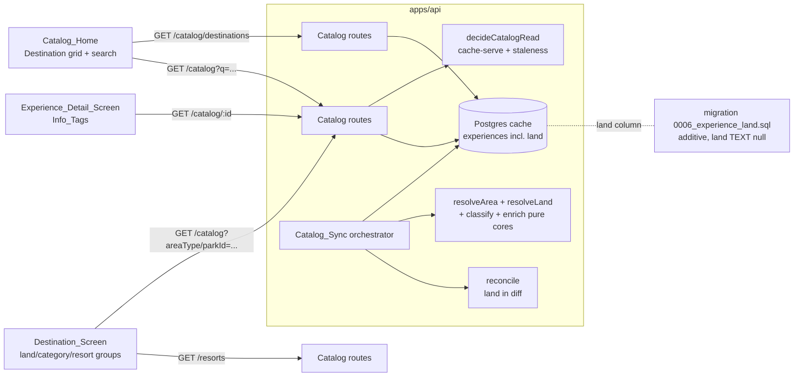
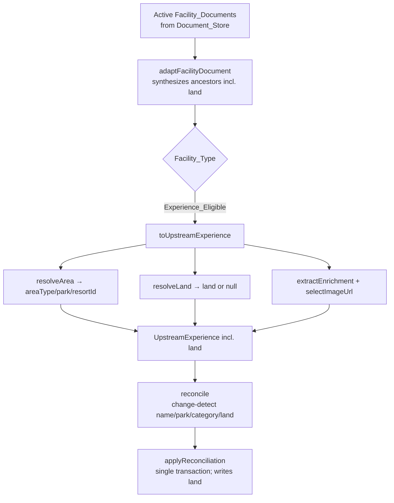
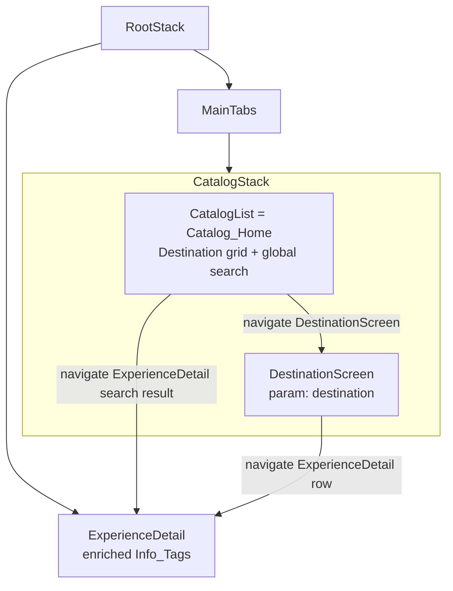

# Design Document

## Overview

This feature redesigns catalog navigation from one flat, filter-driven scroll into a two-level
drill-down anchored on how guests actually think about the parks — *where they are* — while keeping
always-available global search so locating a specific Experience never requires drilling in. It is a
full vertical slice built directly on the completed `disney-facilities-catalog-source` and
`disney-source-resilience` specs, and it reuses their vocabulary and machinery unchanged wherever
possible (Facility_Document, Ancestor_Chain, Enterprise_Id, `resolveArea`, `reconcile`,
`applyReconciliation`, Catalog_Sync, Catalog_Cache, the read-decision/staleness path, and the mobile
react-query + theme conventions).

The change spans four layers:

1. **New data — Land.** Each theme-park / water-park Facility_Document already carries a `land`-type
   ancestor in its Ancestor_Chain (the App-side adapter `adaptFacilityDocument` already synthesizes an
   `ancestorLand`/`ancestorLandId` entry with `type: 'land'`). This feature adds a pure `resolveLand`
   core that reads the nearest Land_Ancestor's name, persists Land via an additive migration
   (`0006_experience_land.sql`), and reconciles it with the same soft-delete/upsert discipline the
   catalog already uses. Land is meaningful only for `ThemePark` and `WaterPark` Area_Types; it is
   `null` everywhere else.

2. **API + shared DTO.** `ExperienceDTO` gains an optional `land` field, the `experiences` read query
   selects and maps it, `GET /catalog` accepts a case-sensitive `land` filter alongside the existing
   `parkId`/`category`/`areaType`/`q` parameters, and a new `GET /catalog/destinations` endpoint
   returns the eight Destination active-Experience counts (the Resorts Destination aggregating all
   `Resort`-area Experiences).

3. **Mobile drill-down.** The single `CatalogScreen` is replaced by a `Catalog_Home` destination grid
   (Level 1) with global search plus a family of Level-2 `Destination_Screen`s. Theme parks and water
   parks group by Land as collapsible sections with an Experience_Category filter on top; Disney
   Springs groups by Experience_Category; the Resorts Destination groups by specific Resort. The
   grouping/ordering/filtering logic is extracted into framework-free pure cores (mirroring the
   existing `grouping.ts` / `experienceFilter.ts` / `groupSectionState.ts` modules) so it is
   property-testable without rendering.

4. **Enriched detail.** The `Experience_Detail_Screen` surfaces the already-persisted enrichment
   (Land, price tier, accessibility, coordinates, meal periods, specific Resort) as compact
   `Info_Tag`s, rendered only when the underlying value is present, in a fixed order.

The redesign preserves existing user data (Completions, Ratings, Notes reference the stable
Experience Internal_Id, whose UUIDv5-of-Enterprise_Id derivation is unchanged) and must not regress
the catalog's resilience behaviors (stale-cache serving, `catalog_unavailable`), image placeholders,
tap-to-detail navigation, or react-query caching. Scope is limited to Walt Disney World.

### Research notes

Investigation of the existing codebase established the following facts that shape the design, so no
new upstream integration or data source is required:

- **The Land ancestor is already in the pipeline.** `apps/api/src/services/catalog/disney/facilityDoc.ts`
  → `ANCESTOR_FIELD_MAP` already maps the flat `ancestorLand`/`ancestorLandId` fields into a
  synthesized `ancestors` entry of `type: 'land'`, and `land` is already a member of
  `NON_EXPERIENCE_TYPES`. `resolveArea` walks that same chain today. Land resolution therefore reads
  an ancestor that is *already present* at reconcile time; no re-fetch and no client change is needed.
- **Enrichment is already persisted and exposed.** `price_tier`, `accessibility`, `latitude`/`longitude`,
  `meal_periods`, `area_type`, and `resort_id` are already columns on `experiences`, already carried
  through `reconcile`/`applyReconciliation`, and already surfaced on `ExperienceDTO` (each present only
  when persisted). The enriched detail view is purely additive presentation over data that already
  ships — R9 requires *no* new persistence.
- **Reconcile change-detection is field-scoped.** `hasExperienceMaterialChange` currently compares only
  `name`/`park`/`category`. Land must be added to that predicate (and to the upsert payload) so a Land
  drift triggers an upsert and Land survives idempotent re-syncs, exactly as the source spec's
  Property 13 established for the other fields.
- **The mobile app has a single catalog screen today.** `apps/mobile/src/navigation/CatalogStack.tsx`
  registers only `CatalogList`; `ExperienceDetail` lives on the root stack. The redesign adds
  `DestinationScreen` to the Catalog stack and rewrites `CatalogScreen` as the Destination grid.
- **Collapsible-section and grouping conventions already exist.** `screens/navigation/grouping.ts`,
  `experienceFilter.ts`, `groupSectionState.ts`, and `useGroupSections.ts` are the established
  framework-free grouping/filter/section-state pattern (already property-tested). The new
  Destination-screen grouping cores follow the same shape.

## Architecture

### System context



### Where Land enters the existing sync flow

The source spec's Catalog_Sync flow is unchanged except that the per-Experience transform additionally
resolves Land, and the reconcile diff additionally carries and change-detects it:



### Mobile navigation structure



The Destination_Screen is a single component parameterized by the selected Destination; it renders one
of three layouts by the Destination's kind (theme/water park → Land groups, Disney Springs → category
groups, Resorts → resort groups), all sharing the collapsible-section, stale-banner, and
`catalog_unavailable` conventions already in `CatalogScreen`.

### Module layout (new / changed)

```
apps/api/src/services/catalog/
  disney/land.ts            (new)     resolveLand(doc): string | null — pure Land resolution core
  disney/__tests__/land.prop.test.ts  (new) property tests for resolveLand
  reconcile.ts              (changed) land in the Experience upsert payload + change-detection
  types.ts                  (changed) land on UpstreamExperience / CatalogCacheRow / ReconcileUpsert
  repo.ts                   (changed) land in SELECT + rowToDto + CatalogListFilters + land filter;
                                      new listDestinationCounts()
  routes.ts                 (changed) land query param; detail response land; GET /catalog/destinations
  sync.ts                   (changed) toUpstreamExperience resolves + carries land
  __tests__/                (changed) reconcile/repo/routes property + example suites extended

apps/api/migrations/
  0006_experience_land.sql  (new)     ALTER TABLE experiences ADD COLUMN land TEXT (additive, null)

packages/shared/src/
  dto/Experience.ts         (changed) add readonly land?: string | null
  schemas/Experience.ts     (changed) add land: z.string().max(200).nullable().optional()

apps/mobile/src/
  navigation/CatalogStack.tsx           (changed) register DestinationScreen; add param list
  screens/catalog/CatalogScreen.tsx     (rewritten) Catalog_Home destination grid + global search
  screens/catalog/DestinationScreen.tsx (new)       Level-2 per-Destination screen (3 layouts)
  screens/catalog/destinations.ts       (new)       Destination model + ordering + destination→filter
  screens/catalog/catalogGrouping.ts    (new)       pure land/category/resort grouping + ordering cores
  screens/catalog/infoTags.ts           (new)       pure Info_Tag construction + ordering core
  screens/catalog/ExperienceDetailScreen.tsx (changed) render Info_Tags via infoTags.ts
  screens/catalog/__tests__/            (new)       component + property tests
```

## Components and Interfaces

### 1. `resolveLand` (`disney/land.ts`) — pure core (API)

The Land counterpart to `resolveArea`. Pure, total, deterministic; never throws; returns `null` for
every case where Land is not meaningful or not resolvable.

```ts
import type { AreaResolution } from './area.js';
import type { FacilityDocument } from './facilityDoc.js';

/**
 * Resolve an Experience's Land from its ancestor chain, given its already
 * resolved area. Land is meaningful only for ThemePark/WaterPark areas
 * (R1.1, R1.5). Returns the nearest Land_Ancestor's name, trimmed, with
 * original casing preserved (R1.2), truncated to at most 200 characters
 * (R1.7); or null when the area is not a park, when there is no Land_Ancestor,
 * or when the Land_Ancestor's name is absent/whitespace-only (R1.3, R1.4).
 */
export function resolveLand(doc: FacilityDocument, area: AreaResolution): string | null;
```

Design points:

- **Gated on area (R1.5).** When `area.areaType` is `DisneySprings` or `Resort`, `resolveLand` returns
  `null` immediately without inspecting ancestors.
- **Nearest Land_Ancestor (R1.1).** The chain is scanned for entries of `type === 'land'`. "Nearest to
  the Experience" is the *first* such entry in the ancestor ordering (the adapter synthesizes the chain
  in the fixed `ANCESTOR_FIELD_MAP` order, so this is deterministic). A theme/water-park document
  normally carries exactly one land ancestor; taking the first is well-defined regardless.
- **Normalization (R1.2, R1.4, R1.7).** The land ancestor's `name` is trimmed; if the trimmed value is
  empty the result is `null`; otherwise it is truncated to the first 200 characters (matching the
  existing name length constraint) with original casing preserved.
- **Purity.** `resolveLand` takes the pre-computed `AreaResolution` so it never re-walks area logic and
  cannot cause an Experience to be dropped. R1.6 (area/park/resort resolution unchanged) is satisfied
  structurally: `resolveArea` is not modified, and `resolveLand` is a strictly additive read.

`toUpstreamExperience` (in `sync.ts`) is extended by one line — `land: resolveLand(doc, area)` — placed
alongside the existing `areaType`/`park`/`resortId`/enrichment assignments.

### 2. Reconciliation (`reconcile.ts`, extended) — pure core (API)

Land joins the Experience upsert payload and the change-detection predicate, exactly mirroring how the
source spec added the other Disney fields:

- `toExperienceUpsert` carries `land: entity.land` through inserts, reactivations, and upserts.
- `hasExperienceMaterialChange` gains a `cached.land !== entity.land` clause so a Land drift on an
  otherwise-unchanged row triggers an upsert (R2.4), an equal Land is a no-op (R2.5), repeated syncs
  are idempotent (R2.6), and a soft-delete/reactivate preserves Land because the row is never deleted
  and the reactivation upsert re-writes the resolved Land (R2.7).

No structural change to the generic `diffRows` engine is required.

### 3. Repository (`repo.ts`, extended) — API

- **`listActiveExperiences` / `getExperience`** add `land` to the `SELECT` column list and to
  `rowToDto` (present only when non-null, matching the existing enrichment convention — R3.1, R3.2).
- **`CatalogListFilters`** gains an optional `land?: string`. When present, `listActiveExperiences`
  appends a **case-sensitive exact** predicate `land = $n` (R3.4). Because SQL `=` on `TEXT` is
  case-sensitive by default, this needs no `lower()` wrapping — contrast the `q` filter's `ILIKE`. It
  combines conjunctively with every other filter (R3.7); no match yields an empty list (R3.8).
- **`listDestinationCounts`** (new) returns the active-Experience count per Destination:

```ts
export interface DestinationCount {
  /** Destination identifier; a Park enum value for the 7 park destinations, or 'Resorts'. */
  readonly destination: DestinationId;
  /** Number of active Experiences belonging to that Destination (R3.6). */
  readonly count: number;
}

listDestinationCounts(): Promise<readonly DestinationCount[]>;
```

  It issues one grouped query. The seven park Destinations count active Experiences by `park`
  (`ThemePark`/`WaterPark`/`DisneySprings` areas whose `park` equals that Destination); the aggregate
  Resorts Destination counts every active `Resort`-area Experience (R3.6, R4.5). Destinations with zero
  active Experiences return a count of `0` (R4.6), so the endpoint always returns all eight entries.

### 4. Routes (`routes.ts`, extended) — API

- **`GET /catalog`** — `catalogQuerySchema` gains `land: z.string().min(1).max(200).optional()`;
  `parseListQuery` maps it onto `filters.land`. Existing parameters keep their behavior (R3.5).
- **`GET /catalog/:experienceId`** — `ExperienceDetailResponse` gains `land?: string | null`;
  `toDetailResponse` carries it through (R3.3).
- **`GET /catalog/destinations`** (new) — returns `{ destinations: DestinationCount[], staleCache,
  cacheAgeHours }`. Like `/catalog`, it calls `decideRead()` first so a `catalog_unavailable` with no
  prior cache propagates (R10.2) and a stale cache is flagged (R10.1). The endpoint is registered only
  when its repo port is wired, matching the existing optional-port pattern.

### 5. Catalog_Home (`CatalogScreen.tsx`, rewritten) — mobile

Level-1 screen. Two mutually-exclusive bodies:

- **Destination grid (default).** A grid of eight Destination cards in the fixed order *four theme
  parks → two water parks → Disney Springs → Resorts* (R4.1). Each card shows a representative image
  (bundled placeholder when none — R4.2, R4.3), the Destination name, and its active-Experience count
  from `GET /catalog/destinations` (R4.4, R4.5, R4.6). While the count data is first loading with no
  prior data, a loading state shows (R4.7). Tapping a card navigates to `DestinationScreen` for that
  Destination (R4.8).
- **Search results.** A single always-visible search control at the top (R5.1). The query is debounced
  ≥300 ms (R5.2, via the existing `useDebounce` hook / a 300 ms timer) and, when it has ≥1
  non-whitespace character, drives `GET /catalog?q=...` across the *entire* catalog (all Area_Types —
  the API `q` filter already spans every area). While a query is active the flat, tappable result list
  replaces the grid (R5.3), each row showing the Experience's Destination and, when present, its Land
  (R5.3). Selecting a result navigates to `ExperienceDetail` (R5.4). Clearing the query restores the
  grid (R5.5). No matches → empty-results state retaining the query (R5.6); a failed search →
  search-error state retaining the query (R5.7).

The Destination model and ordering live in `destinations.ts`:

```ts
export type DestinationId =
  | 'Magic Kingdom' | 'EPCOT' | 'Hollywood Studios' | 'Animal Kingdom'
  | 'Typhoon Lagoon' | 'Blizzard Beach' | 'Disney Springs' | 'Resorts';

export type DestinationKind = 'themeOrWaterPark' | 'disneySprings' | 'resorts';

export interface Destination {
  readonly id: DestinationId;
  readonly kind: DestinationKind;
  readonly title: string;
}

/** The eight Destinations in canonical grid order (R4.1). */
export const DESTINATIONS: readonly Destination[];

/** The catalog filter that fetches a Destination's Experiences (R6.1, R7.1, R8.1). */
export function destinationCatalogFilter(d: Destination): { parkId?: string; areaType?: 'Resort' };
```

### 6. Destination_Screen (`DestinationScreen.tsx`, new) — mobile

Level-2 screen, parameterized by `DestinationId`. It fetches the Destination's Experiences via
`GET /catalog` with the Destination's filter (a `parkId` for the seven park Destinations, `areaType=Resort`
for Resorts) and, for the Resorts Destination, also `GET /resorts`. It renders one of three layouts by
`DestinationKind`, all using `useGroupSections` for collapsible state (default expanded — see below)
and the shared stale-banner / `catalog_unavailable` / empty-state conventions.

All grouping/ordering/filtering is delegated to the pure `catalogGrouping.ts` cores so the screen is a
thin renderer:

```ts
import type { ExperienceDTO, ExperienceCategory, ResortDTO } from '@dwt/shared';

export interface Section<T> { readonly key: string; readonly title: string; readonly items: readonly T[]; }

/** The stable catch-all section key/title for park Experiences with no Land (R6.6). */
export const LAND_CATCHALL_KEY = '__land_catchall__';

/**
 * Group a park Destination's Experiences by Land (R6.2): named Land sections in
 * case-insensitive ascending alphabetical order, each section's Experiences in
 * case-insensitive ascending alphabetical order by name (R6.3), and a single
 * Land_Catchall section (no persisted Land) appended after all named sections
 * (R6.6). No Experience is omitted (total partition).
 */
export function groupByLand(experiences: readonly ExperienceDTO[]): readonly Section<ExperienceDTO>[];

/**
 * Apply an optional Experience_Category filter over the Land grouping (R6.8): keep
 * only Experiences of the selected category while preserving Land grouping and
 * section ordering, and omit any Land section left with no matching Experience (R6.9).
 * A null category returns the full grouping unchanged (R6.7).
 */
export function groupByLandFiltered(
  experiences: readonly ExperienceDTO[],
  category: ExperienceCategory | null,
): readonly Section<ExperienceDTO>[];

/**
 * Group Disney Springs Experiences by Experience_Category in the canonical
 * category order (R7.2), omitting categories with zero Experiences (R7.5).
 */
export function groupByCategory(experiences: readonly ExperienceDTO[]): readonly Section<ExperienceDTO>[];

/** A Resorts-Destination row: a resort anchor, or an Experience under it. */
export type ResortRow =
  | { readonly kind: 'resort'; readonly resort: ResortDTO }
  | { readonly kind: 'experience'; readonly experience: ExperienceDTO };

/**
 * Build the Resorts Destination rows (R8.2, R8.3, R8.4): every active Resort as a
 * browsable anchor ordered case-insensitively by name (including resorts with no
 * Experiences), each Resort followed by its resortId-matched Experiences, and a
 * single resort-wide catch-all group (Experiences with no/unmatched resortId)
 * appended after all specific Resort groups. No Experience is omitted.
 */
export function buildResortRows(
  experiences: readonly ExperienceDTO[],
  resorts: readonly ResortDTO[],
): readonly ResortRow[];
```

**Collapsible default state (R6.4).** R6.4 requires Land sections to open in the *expanded* state,
whereas the existing `groupSectionState` models the empty set as *all collapsed*. The Destination
screen therefore inverts the convention: it treats a key *absent* from the expanded-set as expanded by
seeding nothing and instead tracking *collapsed* keys, OR (simpler and preferred) it initializes the
section state by adding every current section key up front so the first render is fully expanded, and
`toggle` thereafter behaves identically. The chosen approach is a small `useDestinationSections(keys)`
wrapper over the existing pure `toggle`/`isExpanded` reducer that seeds the initial expanded set with
all provided keys; this keeps the proven pure reducer untouched and confines the default-expanded
policy to one hook.

**Category filter (R6.7, R6.8).** The park layout renders the existing `Chip` filter row (as
`CatalogScreen` does today) scoped to the Destination, defaulting to no active category (R6.7). It
drives `groupByLandFiltered` client-side over the already-fetched Experiences (no refetch), preserving
grouping and omitting emptied sections (R6.8, R6.9).

**Resorts anchors + scroll (R8.6).** Selecting a Resort anchor row scrolls the list to that Resort's
group and stays on the screen, using a `SectionList`/`FlatList` ref + `scrollToLocation`/index. Empty
Resort groups render an empty-group indication (R8.7).

### 7. Info_Tags (`infoTags.ts` + `ExperienceDetailScreen.tsx`) — mobile

A pure core builds the ordered Info_Tag list from an Experience; the screen renders each as a compact
labelled pill (a `Badge`, the existing themed pill component).

```ts
export type InfoTagKind =
  | 'land' | 'priceTier' | 'accessibility' | 'coordinates' | 'mealPeriod' | 'resort';

export interface InfoTag {
  readonly kind: InfoTagKind;
  /** Display value, already formatted (e.g. "28.35, -81.56" for coordinates). */
  readonly label: string;
  /** Screen-reader text alternative conveying the tag's meaning (R12.5). */
  readonly accessibilityLabel: string;
}

/**
 * Build the ordered Info_Tag list for an Experience detail view. Emits a tag only
 * when its underlying enrichment is present and non-empty (R9.8): Land (R9.2),
 * price tier (R9.3), one accessibility tag per persisted tag in persisted order
 * (R9.4), coordinates when both lat/long persisted (R9.5), one tag per meal period
 * (R9.6), and the specific Resort when the area is Resort and a resort is
 * referenced (R9.7). Tags are ordered Land → price tier → accessibility →
 * coordinates → meal period → resort, omitting absent ones while preserving the
 * relative order of those present (R9.11).
 */
export function buildInfoTags(
  experience: ExperienceDetailDTO,
  resortName: string | null,
): readonly InfoTag[];

/** The compact price-tier tag for a Restaurant list row — identical label/value to the detail tag (R9.9). */
export function priceTierListTag(priceTier: string): InfoTag;
```

The detail screen renders `buildInfoTags(...)` as a wrapping badge row beneath the existing Park/category
badges and continues to render the existing description, dining menus, live section, completion, rating,
and note sections unchanged (R9.1, R9.10). The list-row price tag (R9.9) reuses `priceTierListTag` so a
Restaurant row and the detail view present the price tier identically.

The resort name for R9.7 comes from the Resorts list (already fetched for the Resorts Destination) or a
small `GET /resorts` lookup on the detail screen; when unavailable the resort tag is simply omitted
(R9.8).

### 8. Accessibility (cross-cutting) — mobile

- **Destination card label (R12.1).** Each card exposes `accessibilityLabel` = `"{name}, {count}
  experiences"` with the count as a numeric value, built by a small pure `destinationCardLabel(name,
  count)` helper.
- **Section expanded/collapsed state (R12.2).** Each collapsible section header exposes
  `accessibilityState={{ expanded }}` reflecting its current visual state.
- **Category filter control (R12.3).** Each `Chip` exposes an accessible label including the category
  name and a selected / not-selected state.
- **Search control (R12.4).** The search `TextInput` keeps its `accessibilityLabel="Search
  experiences"` identifying it as the search input (already present in today's screen).
- **Info_Tag alternative (R12.5).** Each Info_Tag carries an `accessibilityLabel` (built by
  `buildInfoTags`) conveying its meaning (e.g. "Land: Fantasyland", "Price tier: $$").
- **Focus movement (R12.6, R12.7).** On navigating into a Destination_Screen, focus moves to its
  primary heading (`AccessibilityInfo.setAccessibilityFocus` on the heading ref). On navigating back,
  focus is restored to the activated Destination card (a ref map keyed by DestinationId + a
  `useFocusEffect` restore).
- **Result-count announcement (R12.8).** When the visible Experience set changes via filter or search,
  the updated count is announced with `AccessibilityInfo.announceForAccessibility` within 1 second (the
  announcement fires in the same effect that recomputes the visible sections).

## Data Models

### Shared domain model (`@dwt/shared`)

`ExperienceDTO` gains one optional, nullable field, following the existing enrichment convention (present
only when persisted):

```ts
export interface ExperienceDTO {
  // ...existing fields (id, name, park, category, description, active, imageUrl,
  //    areaType, resortId?, latitude?, longitude?, accessibility?, priceTier?,
  //    mealPeriods?, menus?) ...

  /**
   * Themed Land within a ThemePark/WaterPark, resolved from the Land_Ancestor
   * (R1). Present only for a park Experience that has a persisted Land; `null`
   * or absent for DisneySprings/Resort Experiences and for park Experiences with
   * no resolvable Land (R1.3-R1.5, R3.1, R3.2).
   */
  readonly land?: string | null;
}
```

The Zod schema (`schemas/Experience.ts`) adds `land: z.string().max(200).nullable().optional()`,
mirroring the 200-character persistence cap (R1.7).

### API-internal types (`services/catalog/types.ts`)

`land: string | null` is added to `UpstreamExperience` (produced by `toUpstreamExperience`),
`CatalogCacheRow` (so `reconcile` can change-detect it), and `ReconcileUpsert` (so the upsert carries
it). The `ExperienceRow` read shape in `repo.ts` adds `land: string | null`.

### Persistence (migration `0006_experience_land.sql`)

```sql
BEGIN;

-- R2.2: additive change — every existing experiences row (and its Internal_Id) is
-- preserved. R2.3: a nullable column with no default means every pre-existing row's
-- land is NULL until the first subsequent Catalog_Sync resolves it.
ALTER TABLE experiences ADD COLUMN land TEXT;

-- R1.7: Land is at most 200 characters, consistent with the name length constraint.
ALTER TABLE experiences
    ADD CONSTRAINT experiences_land_length_chk
        CHECK (land IS NULL OR char_length(land) BETWEEN 1 AND 200);

-- Land is a browse dimension for the theme/water-park Destination_Screen and the
-- case-sensitive land filter (R3.4, R6.2); index it alongside the active flag.
CREATE INDEX experiences_active_land_idx ON experiences(active, land);

COMMIT;
```

Notes:

- **Additive & non-destructive (R2.2, R11.2).** The migration only `ADD`s a nullable column, a CHECK,
  and an index. It touches no existing row, no Internal_Id, and none of the `completions` / `ratings` /
  `notes` tables or their foreign keys, so every Completion, Rating, and Note is retained with the same
  referenced Internal_Id. Wrapped in `BEGIN`/`COMMIT` so a failure rolls the whole thing back (R11.3);
  the migration runner surfaces the failure.
- **Pre-sync null (R2.3).** Because the column is nullable with no default value, every pre-existing
  row reads `land = NULL` until a subsequent Catalog_Sync upserts a resolved Land.
- **Durability (R2.1).** The column persists across restarts and across syncs that do not change it,
  exactly like the other `experiences` enrichment columns.

## Correctness Properties
