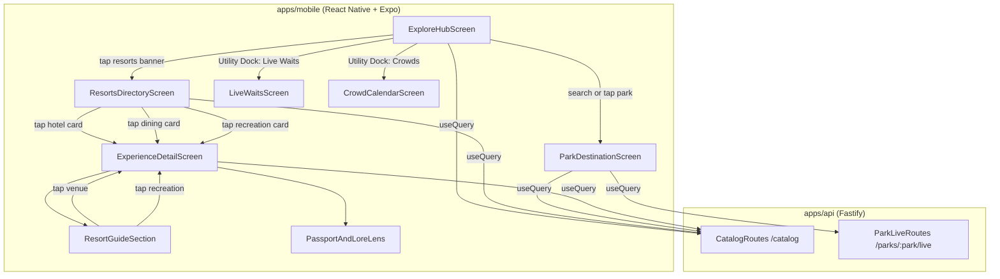

# Design Document

## Overview

This feature redesigns the Walt Disney World catalog browsing and exploration surfaces across three structured levels:
1. **Explore Hub (Level 1)**: The root screen of the Explore tab, featuring global search, a canonical 3-tile utility dock (`Live Waits`, `Crowd Calendar`, `Favorites`), a 2x2 theme parks landmark grid with real-time wait pulses, a full-width Disney Springs showcase banner, a 2-column water parks grid, and a full-width Resorts spotlight card.
2. **Resorts Directory (Level 2)**: A dedicated browsing screen for on-property Disney Resort Hotels, partitioned into 4 tabs (`Hotels`, `Dining`, `Recreation`, `Sub-Destinations`) with tier/transport filters and lightweight preview cards that navigate directly to each resort's existing detail screen.
3. **Theme Park Destination Screen (Level 2)**: Land-based exploration with top category tabs, an adjacent `♥ Favorites` quick toggle, dynamic quick chips, and collapsible land accordions.
4. **Resort Detail Page Enhancement (Level 3)**: Complete preservation of the existing production `ExperienceDetailScreen` (`ResortGuideSection` + `PassportAndLoreLens`), enriched with inline progressive disclosure ("Show all / Show fewer" limiting default display to 4 items), category filter chips, and interactive recreation cards that tap directly into individual `ExperienceDetailScreen`s for visit logging, ratings, and favorites.

### Migration from existing screens (Requirement 7)

`ExploreHubScreen` and `ParkDestinationScreen` are **replacements**, not additions, for `CatalogScreen.tsx` (route `CatalogList` in `ExploreStack.tsx`) and `DestinationScreen.tsx`'s `ThemeOrWaterParkLayout`. Both existing components already implement a substantial share of Requirements 1 and 3 — global search, the `catalog_unavailable`/stale-cache handling, category tabs, the adjacent Favorites toggle, Dynamic_Quick_Chips, and land accordions all exist and are tested today (`CatalogScreen.render.test.tsx`, `DestinationScreen.render.test.tsx`, `DestinationScreen.layouts.test.tsx`). The migration:

1. Keeps the `CatalogList` route name in `ExploreStack.tsx` but repoints its `component` from `CatalogScreen` to `ExploreHubScreen`, so `RootNavigator.tsx`'s existing tab-press handler (`navigation.navigate('Explore', { screen: 'CatalogList' })`) needs no change.
2. Keeps the `DestinationScreen` route name but repoints `ThemePark`/`WaterPark` destinations to `ParkDestinationScreen`'s layout. The `Resorts` destination no longer routes through `DestinationScreen` at all — the Explore_Hub's Resorts Spotlight Card navigates directly to the new `ResortsDirectoryScreen` instead, and `DestinationScreen.tsx`'s `ResortsLayout` (and the `groupByResort`/`RESORT_BOARDWALK_ID`/`RESORT_WWOS_ID` grouping it uses from `catalogGrouping.ts`) is retired.
3. Ports the specific pre-existing logic enumerated in Requirements 7.3-7.4 (debounced search, stale-cache banner, Filters modal, land/catch-all grouping) into the new components rather than re-deriving it, since it is already correct and tested.
4. Deletes `CatalogScreen.tsx`, `DestinationScreen.tsx`'s `ThemeOrWaterParkLayout`, and their now-superseded test files (`CatalogScreen.render.test.tsx`, the `ThemeOrWaterParkLayout`-specific cases in `DestinationScreen.render.test.tsx`/`DestinationScreen.layouts.test.tsx`) in the same change, so no dead, unregistered screen code is left behind. `DestinationScreen.tsx`'s `ResortsLayout` is deleted along with it once `ResortsDirectoryScreen` ships; `catalogGrouping.ts`'s theme-park/water-park land-grouping functions (`groupByLand`, `browseLandOf`) are retained and reused by `ParkDestinationScreen`, since those are pure helpers independent of the layout component being replaced.

### Guiding constraints from the codebase

- **Mobile conventions.** Client screens live in `apps/mobile/src/screens/catalog/`. Screens use React Navigation, TanStack Query for data fetching and caching, and Zustand for session and user state. `ExperienceDetailScreen` is a root-stack screen above the bottom tabs.
- **Preservation of existing resort page.** The existing production `ExperienceDetailScreen.tsx` (and its supporting components `ResortGuideSection.tsx` and `PassportAndLoreLens.tsx`) is canonical and is strictly preserved. All resort links route to this screen; the layout and section structure are retained, adding inline progressive disclosure rather than altering the layout.
- **No stray dependencies.** Layout uses existing React Native and themed component primitives (`Card`, `Badge`, `ThemedText`, `Icon`). No new external layout libraries are introduced.
- **Shared contracts.** Cross-cutting DTOs and taxonomy enums reside in `packages/shared/src/dto/` and `packages/shared/src/constants/catalog.ts`, ensuring client and server contracts cannot drift.
- **Reuse over reinvention.** Live wait times and forecast data are sourced through the existing `Live_Service` and `predictionService`. Search queries existing catalog endpoints without duplicate client-side databases.

## Architecture

### System context



### Module layout

```
apps/mobile/src/screens/catalog/
  ExploreHubScreen.tsx               -- Level-1 Explore Hub: search, 3-tile utility dock, 2x2 parks, Disney Springs, water parks, resorts card
  ResortsDirectoryScreen.tsx         -- Level-2 Resorts Directory: 4 partition tabs (hotels, dining, recreation, sub-destinations)
  ParkDestinationScreen.tsx          -- Level-2 Park Land View: category tabs, adjacent favorites toggle, quick chips, land accordions
  ExperienceDetailScreen.tsx         -- Level-3 Preserved canonical resort & experience detail screen
  ResortGuideSection.tsx             -- Preserved resort guide: progressive disclosure (limit 4), category filter chips, interactive recreation
  resortGuideView.ts                 -- Pure view helpers: computeVisibleItems, filterDiningByCategory, extractDynamicQuickChips
  __tests__/
    resortGuideView.prop.test.ts     -- Fast-check property tests for truncation invariant and category filtering
    ResortGuideSection.test.tsx      -- Component tests for expand/collapse, category filtering, and recreation navigation
    ExploreHubScreen.test.tsx        -- Component tests for Explore Hub controls and navigation
    ResortsDirectoryScreen.test.tsx  -- Component tests for directory tabs, preview cards, and tier filters

packages/shared/src/
  constants/
    catalog.ts                       -- UI constants: DEFAULT_RESORT_SECTION_LIMIT, EXPLORE_UTILITY_TILES, THEME_PARKS_EXPLORE_GRID
  dto/
    Resort.ts                        -- Shared Resort and ResortRecreationItemDTO contracts
```

**Deleted by this feature (Requirement 7.5):** `CatalogScreen.tsx`, `CatalogScreen.render.test.tsx`, `DestinationScreen.tsx`'s `ThemeOrWaterParkLayout` and `ResortsLayout` (the file itself may be retained if other layouts still live there, but these two layouts are removed), and their superseded test cases in `DestinationScreen.render.test.tsx`/`DestinationScreen.layouts.test.tsx`. `catalogGrouping.ts`'s pure grouping functions (`groupByLand`, `browseLandOf`) are retained and reused.

## Components and Interfaces

### 1. `resortGuideView` — pure view helpers (Requirements 3, 5)

```typescript
export type DiningCategoryFilter = 'all' | 'table' | 'quick' | 'lounge';

export interface ComputeVisibleItemsOptions<T> {
  readonly items: readonly T[];
  readonly limit?: number;
  readonly expanded: boolean;
  readonly isFiltered?: boolean;
}

export interface VisibleItemsResult<T> {
  readonly visibleItems: readonly T[];
  readonly totalCount: number;
  readonly hiddenCount: number;
  readonly isTruncated: boolean;
  readonly canExpand: boolean;
}

export function computeVisibleItems<T>(options: ComputeVisibleItemsOptions<T>): VisibleItemsResult<T>;

export function filterDiningByCategory<T extends { category?: string; tags?: readonly string[] }>(
  venues: readonly T[],
  filter: DiningCategoryFilter,
): readonly T[];

export function extractDynamicQuickChips(
  experiences: readonly { category: string; tags?: readonly string[]; thrill?: boolean; heightMin?: number }[],
  activeTab: string,
): readonly string[];
```

Implementation details:
1. `computeVisibleItems`: When `options.expanded` is `false` and `options.isFiltered` is `false`, truncates `visibleItems` to at most `limit` (defaulting to 4). If `options.expanded` is `true` or `options.isFiltered` is `true`, returns all items without truncation. Calculates `hiddenCount` as `Math.max(0, totalCount - limit)`.
2. `filterDiningByCategory`: Filters dining venues into Table Service, Quick Service, and Lounges based on tags and venue category. An `all` filter returns the unmodified list.
3. `extractDynamicQuickChips`: Derives frequency-ranked unique filter pills based on the active tab (e.g. `Thrill Ride`, `Character Dining`, `Height 40"+`).

### 2. `ResortGuideSection` — progressive disclosure & recreation interactions (Requirements 4, 5, 6)

The real, shipped component signature (`apps/mobile/src/screens/catalog/ResortGuideSection.tsx`) is:

```typescript
export interface ResortGuideSectionProps {
  readonly experienceId: string;
  readonly experienceName: string;
  readonly resort?: ResortDTO | null | undefined;
  readonly latitude?: number | null | undefined;
  readonly longitude?: number | null | undefined;
}
```

This feature does **not** change that signature — there is no `ResortDetailDTO` type and no `onNavigateExperience` callback prop in production; the component calls `useNavigation<NativeStackNavigationProp<RootStackParamList>>()` internally (as it already does for the existing dining-venue tap handler) rather than receiving navigation via props. The new recreation-item tap handler (item 6 below) reuses that same internal `navigation.navigate('ExperienceDetail', { experienceId })` call, exactly mirroring the existing dining-venue `handleCardPress`. Treat `ResortGuideSectionProps` as **unchanged** by this feature; only the component's internal render logic and local state are extended.

Implementation shape:
1. Manages `diningExpanded` (boolean, default `false`) and `diningCategoryFilter` (`DiningCategoryFilter`, default `'all'`).
2. Manages `recreationExpanded` (boolean, default `false`).
3. Computes visible dining items using `computeVisibleItems`. Displays the toggle button `Show all [N] dining locations ([M] more) ▾` when collapsed, updating to `Show fewer dining locations ▴` when expanded.
4. Renders dining category filter chips (`All`, `Table Service`, `Quick Service`, `Lounges`). Selecting a category chip automatically presents all matching items and suppresses the truncation button. Each venue's category is derived from its existing freeform `tag` string by the keyword rule in Requirement 5.4a — `tag` is not a clean enum today (real examples: `"Rooftop Signature"`, `"Tiki Lounge"`, `"Savanna Table Service"`), so `filterDiningByCategory` classifies on keyword match, not exact tag equality.
5. Computes visible recreation items using `computeVisibleItems`. Displays the toggle button `Show all [N] recreation & activities ([M] more) ▾` when collapsed, updating to `Show fewer activities ▴` when expanded.
6. Renders each recreation item as an interactive `<Pressable>` card displaying an indicator chevron (`›`). On press: if `item.id` is present, calls the component's existing internal `navigation.navigate('ExperienceDetail', { experienceId: item.id })` (same call site pattern as the dining venue handler); if `item.id` is absent (the common case today, since no existing `ResortRecreationItemDTO` carries an `id` — see Data Models below), opens the informational bottom sheet from Requirement 6.4 instead.

### 3. `ResortsDirectoryScreen` — partitioned directory (Requirement 2)

```typescript
export interface ResortsDirectoryScreenProps {
  readonly navigation: NavigationProp<any>;
}

export type ResortDirectoryTab = 'hotels' | 'dining' | 'recreation' | 'subdest';

export interface HotelPreviewCardProps {
  readonly resort: ResortSummaryDTO;
  readonly onSelect: (resortId: string) => void;
  readonly onToggleFavorite?: (resortId: string) => void;
  readonly isFavorite?: boolean;
}
```

Implementation shape:
1. Renders a hero `GradientHeader` matching the Explore page size and shape with back button, title "Disney Resorts & Hotels", and subtitle, followed by a dedicated search bar and 4 partition tabs: `🏨 Hotels`, `🍽️ Dining`, `🏊 Recreation`, `🎪 Sub-Destinations`.
2. When `hotels` is active, presents a horizontal tier filter strip (`All`, `Deluxe`, `Moderate`, `Value`, `DVC Villas`) and transportation mode pills (`Monorail`, `Skyliner`, `Boat`).
3. Renders each hotel using `HotelPreviewCard`, displaying hero photo, tier badge, transit pills, summary description, 3 metric pills (`🍽️ Venues`, `🏊 Activities`, `⏱️ Transit to Park`), favorite heart toggle, and CTA button navigating to `ExperienceDetailScreen`.
4. When `dining` is active, renders category filters, hotel picker filter affordance, and venue preview cards.
5. When `recreation` is active, renders activity filters, hotel picker filter affordance, and activity preview cards.
6. When `subdest` is active, renders showcase cards for Disney's BoardWalk, ESPN Wide World of Sports, and Golf complexes.

### 4. `ExploreHubScreen` — Level 1 hub (Requirement 1)

```typescript
export interface ExploreHubScreenProps {
  readonly navigation: NavigationProp<any>;
}
```

Implementation shape:
1. Top compact hero gradient header with title "Explore", operating subtitle, notification bell, and You & Crew shortcut, sized compactly to maximize screen real estate.
2. Global search input querying experiences by keyword.
3. 3-column `UtilityDock`: `Live Waits` (`LiveWaitsScreen`), `Crowds` (`CrowdCalendarScreen`), and `Favorites` (activates the carried-over in-screen favorites-filtered view — no separate `FavoritesScreen` route exists).
4. 2x2 `ThemeParksGrid`: Magic Kingdom, EPCOT, Hollywood Studios, Animal Kingdom with integer average wait pulses and experience count badges, omitting landmark subheadings.
5. `ResortsSpotlightCard`: Full-width showcase banner navigating to `ResortsDirectoryScreen`.
6. `DisneySpringsCard`: Full-width showcase banner with landmark imagery, subtitle, and dining/shopping badges with high-contrast pills.
7. `WaterParksGrid`: Balanced 2-column grid for Blizzard Beach and Typhoon Lagoon at the bottom.

### 5. `ParkDestinationScreen` — Level 2 Park Land View (Requirement 3)

Implementation shape:
1. Hero `GradientHeader` matching the Explore page size and shape with park-themed gradient, back navigation button, park icon and title, and active experience count subtitle (omitting the live wait pulse to keep the header clean and uncluttered).
2. Category tabs (`All`, `Rides`, `Dining`, `Shows`) with adjacent `♥ Favorites` quick toggle pill.
3. Horizontal dynamic quick chips bar and Lands/Price/Height/Physical multi-filter modal.
4. Collapsible land accordions with land name and experience count badges.

## Data Models

### Shared DTO: `ResortRecreationItemDTO` (`packages/shared/src/dto/Resort.ts`)

```typescript
export interface ResortRecreationItemDTO {
  /** Stable experience ID when backed by a catalog ExperienceDTO */
  readonly id?: string;
  readonly icon: string;
  readonly title: string;
  readonly badge?: string;
  readonly description: string;
  readonly priceTier?: string;
  readonly hours?: string;
}
```

## Correctness Properties

### Property 1: Inline disclosure truncation invariant

*For any* array of items of length $N \ge 0$, expand flag $E \in \{\text{true}, \text{false}\}$, and filter active flag $F \in \{\text{true}, \text{false}\}$, the helper `computeVisibleItems` SHALL return at most $\min(N, 4)$ items when $E$ is false and $F$ is false, SHALL return all $N$ items when $E$ is true or $F$ is true, and the reported `hiddenCount` SHALL equal $\max(0, N - 4)$ when $E$ is false and $F$ is false.

**Validates: Requirements 5.1, 5.2, 5.3, 5.6, 5.7, 5.8**

### Property 2: Dining category filter soundness and completeness

*For any* list of dining venues and *for any* selected category filter $C \in \{\text{'table'}, \text{'quick'}, \text{'lounge'}\}$, every venue returned by `filterDiningByCategory` SHALL match the criteria for category $C$, and no venue in the input list that matches category $C$ SHALL be omitted from the output.

**Validates: Requirements 5.4, 5.5, 2.7**

### Property 3: Dynamic quick chips derivation uniqueness and relevance

*For any* non-empty list of experiences and active tab, `extractDynamicQuickChips` SHALL return only chip labels that correspond to at least one experience in the active list, SHALL contain no duplicate labels, and SHALL be ordered deterministically by descending occurrence frequency.

**Validates: Requirements 3.5**

### Property 4: Hotel preview metric projection integrity

*For any* resort whose dining/recreation lists are sourced from catalog-linked Experiences (i.e. `resort_id`-matched active `experiences` rows exist, as opposed to the `KNOWN_DINING_METADATA`/`diningFallback` static profile data `ResortGuideSection` falls back to when no dynamic items exist for that resort — see design note below), the rendered `diningCount` SHALL equal the exact count of active restaurant experiences linked to that resort, and the rendered `activitiesCount` SHALL equal the exact count of active recreation experiences linked to that resort. For a resort using the static fallback profile, `diningCount`/`activitiesCount` SHALL equal the length of that resort's static `diningFallback`/`recreation` array instead, and this property does not claim those counts trace to a live `resort_id` query. In both cases, the direct transit time displayed SHALL match the resort's `transitTimes` entry for its nearest theme park (falling back to `DEFAULT_TRANSIT_BY_RESORT` when `ResortDTO.transitTimes` is absent, exactly as `ResortGuideSection` already does).

**Validates: Requirements 2.5**

### Property 5: Hotel filter isolation and completeness

*For any* selected resort ID $H$ and list of dining venues or recreation items, when hotel filter $H$ is active, every item displayed SHALL belong to resort $H$, and no item belonging to resort $H$ that matches the active category filter and search query SHALL be omitted.

**Validates: Requirements 2.10**

**Design note:** Before implementing `HotelPreviewCard`'s metric pills, audit which of the 32 resorts currently resolve dining/recreation via real `resort_id`-linked Experiences versus the static fallback metadata in `ResortGuideSection.tsx` (`KNOWN_DINING_METADATA`, `DEFAULT_TRANSIT_BY_RESORT`). The counts must come from whichever source `ResortGuideSection` itself uses for that resort, so the Hotel_Preview_Card's summary counts never disagree with the counts the guest sees after tapping through to the detail page.

## Error Handling

This feature introduces no new error codes. The shared error catalog (`packages/shared/src/errors.ts`) defines only `catalog_unavailable` (503) and `stale_cache` (200, carried in the response body as `staleCache: true`, not as an HTTP error) for the catalog domain. A missing Experience at `GET /catalog/:experienceId` (used when navigating from Hotel_Preview_Card CTAs and from the Resorts_Directory dining/recreation preview cards) is deliberately **not** classified under a catalog-specific not-found code — the route's existing handler calls Fastify's `reply.callNotFound()` for a plain 404, by design (see the code comment in `apps/api/src/services/catalog/routes.ts`). There is no `GET /catalog/resorts/:resortId` route; resort detail reads also go through `GET /catalog/:experienceId` against the resort's `representingExperienceId`, and the resort list itself is `GET /resorts`. Mobile error handling for both cases is: a plain 404 renders the standard "not found" empty state; it is not routed through `ApiError` code-specific branching since no such code exists.

Error and edge case handling across mobile surfaces:
1. **Empty list state**: When a resort has zero dining venues or zero recreation items, `ResortGuideSection` SHALL render an informative empty card message (e.g. "No dining venues currently listed") and SHALL NOT render the expand toggle button or filter pills.
2. **Missing recreation experience ID**: When a recreation amenity lacks a corresponding catalog experience ID, tapping the card SHALL open an informative modal bottom sheet displaying operating hours, location, and guest guidelines rather than triggering an invalid route transition.
3. **Offline and query failure**: When the device is offline or the catalog query fails, TanStack Query serves cached data; if no cache is present, a standard retry card with an "Offline — tap to retry" button is displayed without crashing the screen.

## Configuration & Constants

| Constant | Value | Where | Purpose |
| --- | --- | --- | --- |
| `DEFAULT_RESORT_SECTION_LIMIT` | `4` | `packages/shared/src/constants/catalog.ts` | Default visible count before inline progressive disclosure triggers (Req 5.1, 5.6) |
| `EXPLORE_UTILITY_TILES` | `[{ id: 'waits', ... }, { id: 'crowds', ... }, { id: 'favorites', ... }]` | `packages/shared/src/constants/catalog.ts` | Canonical 3-tile dock items on Explore Hub (Req 1.3) |
| `THEME_PARKS_EXPLORE_GRID` | `[{ park: 'Magic Kingdom', ... }, { park: 'EPCOT', ... }, ...]` | `packages/shared/src/constants/catalog.ts` | Canonical 2x2 theme parks configuration (Req 1.4, 1.5) |

These are code-level constants rather than environment variables because they define core application taxonomy and UI configuration that are version-controlled and asserted by tests.

## External Interfaces

All screens consume existing, verified Fastify endpoints:
- `GET /catalog`: Queried with parameters `park`, `category`, `resortId`, and `q`. Returns matching `ExperienceDTO` records.
- `GET /catalog/:experienceId`: Returns full experience details including descriptions, operating hours, coordinates, and menus.
- `GET /parks/:park/live`: Sourced from ThemeParks.wiki via `Live_Service`. Returns current operating status, average wait pulses, and attraction wait times.

## Testing Strategy

### 1. Pure domain logic & property tests (`apps/mobile/src/screens/catalog/__tests__/resortGuideView.prop.test.ts`)
- Fast-check property test for **Property 1: Inline disclosure truncation invariant** (minimum 100 runs).
- Fast-check property test for **Property 2: Dining category filter soundness and completeness** (minimum 100 runs).
- Fast-check property test for **Property 3: Dynamic quick chips derivation uniqueness and relevance** (minimum 100 runs).

### 2. Mobile component tests (`apps/mobile/src/screens/catalog/__tests__/`)
- `ResortGuideSection.test.tsx`:
  - Asserts that dining venues list renders 4 items by default and expands to full list when `Show all` is pressed.
  - Asserts that category filter pills filter the list and suppress the expand button, including at least one real `tag` string (e.g. `"Tiki Lounge"`, `"Savanna Table Service"`) matched by the Requirement 5.4a keyword rule, not a synthetic clean-enum fixture.
  - Asserts that recreation cards display chevrons and call `navigation.navigate('ExperienceDetail', ...)` on press when `item.id` is present, and open the informational bottom sheet when `item.id` is absent (the default case for most resorts today — Requirement 6.4).
- `ExploreHubScreen.test.tsx`:
  - Asserts rendering of header, search input, 3 utility dock tiles, 2x2 theme parks grid, Disney Springs banner, 2-column water parks grid, and Resorts spotlight card.
  - Asserts navigation triggers for each tile and card.
  - Asserts the carried-over behaviors from Requirement 7.3 (debounced search still drives `GET /catalog?q=`, `catalog_unavailable` and stale-cache states still render) so the migration does not silently drop them.
- `ResortsDirectoryScreen.test.tsx`:
  - Asserts rendering of 4 tabs (`Hotels`, `Dining`, `Recreation`, `Sub-Destinations`).
  - Asserts tier filter pill interactions, including that the `DVC Villas` pill filters on `tier === 'Deluxe Villa'`.
  - Asserts navigation to `ExperienceDetailScreen`.
- `ParkDestinationScreen.test.tsx`:
  - Asserts the carried-over behaviors from Requirement 7.4 (Filters modal, `favoritesOnly` composition, land/catch-all grouping) still function post-migration.
  - Asserts the new Height Requirement and Physical Considerations filter dimensions (Requirement 7.6) filter results correctly once added to `WHITELISTED_FACET_GROUPS`.

### 3. Migration regression check
- A test (or a documented manual check at the Final Checkpoint) confirms `CatalogScreen.tsx` and `DestinationScreen.tsx`'s `ThemeOrWaterParkLayout`/`ResortsLayout` are no longer imported/registered anywhere, and that their test files were removed rather than left asserting against deleted components.
