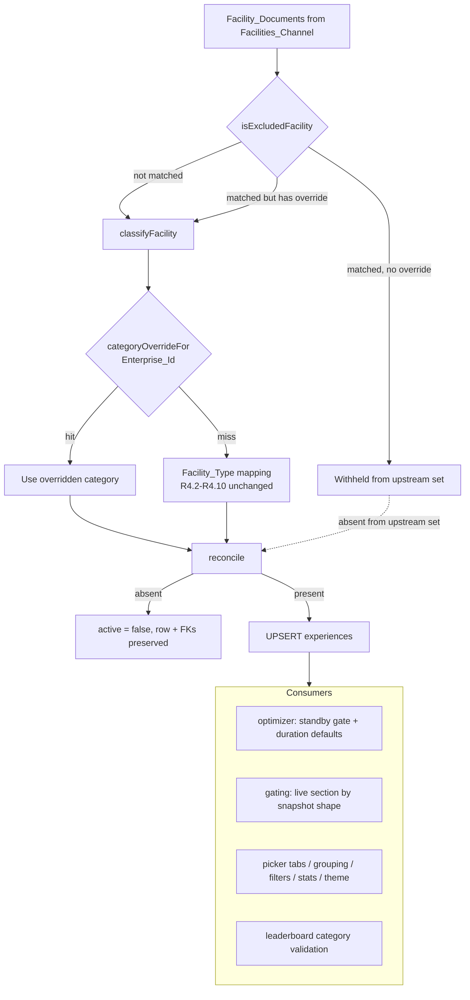

# Design Document

## Overview

Two changes to the catalog taxonomy plus the consumer changes that make them safe.

1. **Exclusion.** A new pure predicate `isExcludedFacility(doc)` runs inside the classification stage of `Catalog_Sync`. A matching document is withheld from the upstream Experience set. Because `disney-facilities-catalog-source` R11 already soft-deletes any cached Experience absent from the upstream set, the existing 326 matching rows flip to `active = false` on the next sync with no data migration and no `DELETE`.

2. **Re-categorization.** Three new `ExperienceCategory` members (`Walkthrough`, `PlayArea`, `Game`) plus a curated `Enterprise_Id → ExperienceCategory` override map consulted before the Facility_Type-derived classification. The override map is a hand-maintained constant of 53 entries, not a heuristic.

3. **The safety change.** `optimizer.ts` currently decides "does this have a queue" from `category === 'Ride' || 'Character_Meet'`. Re-labeling wait-posting attractions under that gate would silently zero out real queue waits. The gate moves to the snapshot: an item is charged a queue wait when its `WaitSnapshot` actually carries one. The same idea fixes the detail screen's live-section choice.

Nothing about the Disney sources, credentials, id derivation, or area resolution changes.

## Architecture



The exclusion and override decisions are pure functions of one `FacilityDocument`, so both are property-testable without I/O and both live beside the existing `classifyFacility` in the catalog service's Disney module.

## Components and Interfaces

### `facilityExclusion.ts` (new, `apps/api/src/services/catalog/disney/facilityExclusion.ts`)

```ts
import type { FacilityDocument } from './facilityDoc.js';

/** Which rule matched, for the per-run audit counts (R7.1). */
export type ExclusionRule =
  | 'audio_tour'
  | 'amenity_sub_type'
  | 'animal_placard'
  | 'rental_inventory'
  | 'community_hall'
  | 'informational_page'
  | 'excluded_name'
  | 'service_facility'
  | 'duplicate_clone';

/**
 * Pure, total, deterministic. Returns the first matching rule in the fixed
 * order of the ExclusionRule union, or null when the document is admissible.
 * Never throws; tolerates absent `type`, `subType`, and `name`.
 */
export function exclusionRuleFor(doc: FacilityDocument): ExclusionRule | null;

/** Convenience predicate over `exclusionRuleFor`. */
export function isExcludedFacility(doc: FacilityDocument): boolean;
```

Rule order is fixed so the audit breakdown is deterministic when a document matches more than one rule. `duplicate_clone` is evaluated last: it is an identity decision rather than a "this isn't an experience" decision, so when a clone also matches a content rule the content rule is the more informative audit reason.

### `duplicateDetector.ts` (new, `apps/api/src/services/catalog/disney/duplicateDetector.ts`)

Deduplication itself needs no cross-document pass — it is a curated id lookup inside `exclusionRuleFor` (R8.3). What does need a cross-document view is the **detector**, which surfaces clones we have not yet curated (R8.7).

```ts
export interface DuplicateGroup {
  readonly normalizedName: string;
  readonly members: readonly { readonly enterpriseId: string; readonly category: string }[];
}

/**
 * Pure. Groups admitted Experiences by normalized name (lower-cased, NFKD,
 * non-alphanumerics collapsed to single spaces, trimmed) and returns every
 * group of two or more, minus the curated `KNOWN_DISTINCT_NAMESAKES` pairs.
 * Diagnostic only — never mutates or withholds (R8.8).
 */
export function detectDuplicateGroups(
  experiences: readonly { readonly upstreamEntityId: string; readonly category: string; readonly name: string }[],
): readonly DuplicateGroup[];
```

`sync.ts` calls this after `buildUpstreamCatalog` and logs each returned group at warn level. A newly appearing clone therefore shows up in the sync log without changing any row, and curating it is a deliberate edit to `DUPLICATE_CLONE_IDS`.

### `categoryOverrides.ts` (new, `apps/api/src/services/catalog/disney/categoryOverrides.ts`)

```ts
import type { ExperienceCategory } from '@dwt/shared';

/** Curated key: the numeric id plus entityType, per R2.5. */
export interface OverrideKey {
  readonly numericId: string;
  readonly entityType: string;
}

/** The full curated map. Exported for the unmatched-override audit (R2.7). */
export const CATEGORY_OVERRIDES: ReadonlyMap<string, ExperienceCategory>;

/** `${numericId};entityType=${entityType}` → category, or null when absent. */
export function categoryOverrideFor(enterpriseId: string): ExperienceCategory | null;
```

The map key is the full `Enterprise_Id` string (`{numericId};entityType={Type}`) so lookup is a single `Map.get` on the value the document already carries. `parseEnterpriseId` (already in `facilityDoc.ts`) supplies the parts for the audit warning.

### `classifyFacility` (modify, `apps/api/src/services/catalog/disney/`)

Consult `categoryOverrideFor` first; on a miss, fall through to the existing R4.2–R4.10 mapping unchanged. The function keeps its current signature and its `null`-means-excluded contract, so `Non_Experience_Type` handling is untouched.

### `sync.ts` (modify, `apps/api/src/services/catalog/sync.ts`)

Between document parsing and Experience construction: skip a document when `isExcludedFacility(doc)` is true **and** `categoryOverrideFor(doc.id)` is null (R1.10). Accumulate per-rule counts, applied-override count, and the set of override keys that matched nothing; log all three at run completion (R7.1, R7.2). After `applyReconciliation`, log an error-level warning when `diff.experiences.softDeletes.length` exceeds `DEACTIVATION_SAFETY_THRESHOLD` (R7.3) — the check runs on the reconciliation result rather than the exclusion tally, because the soft-delete count is this run's real blast radius.

### `optimizer.ts` (modify, `apps/api/src/services/planning/optimizer.ts`)

Two changes inside `getWaitAndDuration` and `resolveDefaultDuration`.

```ts
/**
 * Does this snapshot carry a usable posted wait? Pure; the single place the
 * optimizer decides whether an item has a queue (R3.1).
 *
 * TRUE when the snapshot exists and carries a numeric, non-negative standby
 * wait (or the single-rider wait when the item requests it). Virtual-queue and
 * Lightning Lane items remain Standby_Bearing so their existing substitutions
 * (LL_WAIT_MINS, VQ handling) continue to apply.
 */
export function isStandbyBearing(
  snapshot: WaitSnapshot | undefined,
  useSingleRider: boolean,
): boolean;
```

The gate replaces `const isRideLike = item.category === 'Ride' || item.category === 'Character_Meet'`:

- Break items short-circuit to `wait = 0` first, exactly as today (R3.4).
- `Show`/`Parade` with showtimes take the showtime path first, exactly as today (R3.5). With no showtimes but Standby_Bearing, they fall through to the standby path instead of returning `showtimesUnavailable` with a zero wait (R3.6).
- Otherwise: Standby_Bearing → the existing standby path (rope-drop ramp, single rider, VQ, LL); not Standby_Bearing → `wait = 0` (R3.2, R3.3).
- Missing snapshot entirely: keep the current `wait = 30` default **only** for `Ride`/`Character_Meet` (R3.7); `0` otherwise (R3.8). This preserves today's ride behavior exactly when prediction is unavailable.

`resolveDefaultDuration` gains an explicit branch for the three new categories before the `DEFAULT_RIDE_DUR` fall-through (R4.1–R4.5). The existing branches and their precedence are untouched.

### `gating.ts` (modify, `apps/mobile/src/screens/catalog/gating.ts`)

`liveSectionFor` currently takes only a category. It gains a second parameter describing what the `Live_Detail` actually carries, so the decision can fall back:

```ts
export interface LiveShape {
  readonly hasShowtimes: boolean;
  readonly hasStandbyWait: boolean;
}

/** "Nothing loaded yet"; gates identically to the original category-only map. */
export const NO_LIVE_SHAPE: LiveShape;

export function liveSectionFor(
  category: ExperienceCategory,
  live: LiveShape,
): LiveSection;
```

The shape parameter is **required**, not optional. An optional parameter would let a
call site silently fall back to category-only gating and re-introduce the empty-panel
bug this parameter exists to fix; callers with no loaded `Live_Detail` pass
`NO_LIVE_SHAPE` so the compiler enforces the decision at every call site.

- `Ride` / `Character_Meet` → `wait_status` (unchanged).
- `Show` / `Parade` → `showtimes` when `hasShowtimes`, else `wait_status` when `hasStandbyWait`, else `showtimes` (preserving today's empty-state messaging when neither is present) (R5.3).
- `Walkthrough` / `PlayArea` / `Game` → `wait_status` when `hasStandbyWait`, else `none` (R5.1, R5.2).
- `Restaurant` → `dining` (unchanged).
- Every Structural_Category → `none` (unchanged, R5.5).
- The `never` exhaustiveness guard is retained, so adding the three members forces this map to be updated rather than silently defaulting.

### Remaining consumer edits (R6)

| File | Change |
| --- | --- |
| `packages/shared/src/enums.ts` | Add the three members to `EXPERIENCE_CATEGORIES` after `Character_Meet` and before `Tour`, so the canonical browse order groups attraction-like categories together. |
| `apps/mobile/src/theme/theme.ts` | Add a `categoryVisual` entry per member: glyph, tint, and label. `Record<ExperienceCategory, …>` makes this a compile error until done. |
| `apps/mobile/src/screens/trips/experiencePickerFilters.ts` | `TAB_CATEGORIES.attractions` becomes `['Ride', 'Walkthrough', 'PlayArea', 'Game']`. |
| `apps/mobile/src/screens/catalog/catalogGrouping.ts` | No code change expected — it iterates `EXPERIENCE_CATEGORIES` and omits empty categories. Verify with a test. |
| `apps/mobile/src/screens/navigation/experienceFilter.ts`, `screens/stats/statsView.ts`, `screens/friends/progressComparison.ts` | Confirm each derives from `EXPERIENCE_CATEGORIES`; fix any hardcoded list. |
| `apps/api/src/services/aggregate/leaderboard.ts` | Its hand-rolled read-path category check must accept the new members (R6.4). |
| Category placeholder imagery | One placeholder per new member (R6.6). |

## Data Models

### Migration `00NN_experience_category_taxonomy.sql`

Use the next free sequential number at implementation time — check `apps/api/migrations/` rather than assuming `0032`.

```sql
BEGIN;

-- Widen the closed category set with Walkthrough / PlayArea / Game (R2.2).
-- Additive only: every existing member is retained, so no row is invalidated.
ALTER TABLE experiences DROP CONSTRAINT experiences_category_chk;
ALTER TABLE experiences
    ADD CONSTRAINT experiences_category_chk CHECK (category IN (
        'Ride',
        'Show',
        'Restaurant',
        'Parade',
        'Character_Meet',
        'Walkthrough',
        'PlayArea',
        'Game',
        'Tour',
        'Recreation',
        'Spa',
        'Event',
        'Other',
        'Resort'
    ));

COMMIT;
```

This migration MUST be applied before the classifier writes a new value, or every affected upsert in that sync run fails the CHECK. No backfill statement is needed: the override map re-categorizes the affected rows on the next sync, and the exclusion rules deactivate the dropped ones.

### The curated Category_Override list (53 entries)

Every Enterprise_Id below was verified on 2026-08-24 to resolve to exactly one active `experiences` row. The trailing name is documentation, not a matching key (R2.5).

**→ `Show`** (theater and cinema attractions Disney types as `attraction`)

| Enterprise_Id | Name |
| --- | --- |
| `80069748;entityType=Attraction` | Country Bear Musical Jamboree |
| `80069754;entityType=Attraction` | The Hall of Presidents |
| `80010200;entityType=Attraction` | The American Adventure |
| `80010170;entityType=Attraction` | Mickey's PhilharMagic |
| `136550;entityType=Attraction` | Monsters, Inc. Laugh Floor |
| `16124144;entityType=Attraction` | Walt Disney's Enchanted Tiki Room |
| `62992;entityType=Attraction` | Turtle Talk With Crush |
| `19463785;entityType=Attraction` | Beauty and the Beast Sing-Along |
| `80010145;entityType=Attraction` | Impressions de France |
| `80010180;entityType=Attraction` | Reflections of China |
| `80010174;entityType=Attraction` | Canada Far and Wide in Circle-Vision 360 |
| `19473173;entityType=Attraction` | Awesome Planet |
| `19497952;entityType=Attraction` | Vacation Fun — An Original Animated Short |
| `16767276;entityType=Attraction` | Enchanted Tales with Belle |
| `18770880;entityType=Attraction` | Walt Disney Presents |
| `412735091;entityType=Attraction` | The Magic of Disney Animation |
| `18269694;entityType=Attraction` | Disney and Pixar Short Film Festival |
| `19503896;entityType=Attraction` | Palais du Cinéma |

**→ `Walkthrough`** (self-paced trails, aquariums, exhibit halls, galleries, walkable landmarks)

| Enterprise_Id | Name |
| --- | --- |
| `80010175;entityType=Attraction` | Gorilla Falls Exploration Trail |
| `80010164;entityType=Attraction` | Maharajah Jungle Trek |
| `80010126;entityType=Attraction` | Discovery Island Trails |
| `80010214;entityType=Attraction` | The Oasis Exhibits |
| `80010184;entityType=Attraction` | SeaBase Aquarium |
| `80010196;entityType=Attraction` | Swiss Family Treehouse |
| `80010217;entityType=Attraction` | Tree of Life |
| `411794307;entityType=Attraction` | Journey of Water, Inspired by Moana |
| `411794409;entityType=Attraction` | Dreamers Point |
| `16767209;entityType=Attraction` | Cinderella Castle |
| `26421;entityType=Attraction` | American Heritage Gallery |
| `80069745;entityType=Attraction` | Bijutsu-kan Gallery |
| `80069743;entityType=Attraction` | Mexico Folk Art Gallery |
| `61525;entityType=Attraction` | Stave Church Gallery |
| `80010137;entityType=Attraction` | Gallery of Arts and History |
| `160914;entityType=Attraction` | House of the Whispering Willows |
| `411708725;entityType=Attraction` | Disney Springs Art Walk: A Canvas of Expression |

Do **not** add `18447293;entityType=Entertainment` ("Tree of Life Awakenings") — that is the nighttime projection show and is correctly a `Show` already. It is named here because a name-prefix match on "Tree of Life" wrongly captures it.

**→ `PlayArea`** (post-ride labs, splash zones, in-park play spaces)

| Enterprise_Id | Name |
| --- | --- |
| `80010144;entityType=Attraction` | ImageWorks — The "What If" Labs |
| `220239;entityType=Attraction` | Project Tomorrow: Inventing the Wonders of the Future |
| `3831;entityType=Attraction` | Advanced Training Lab |
| `91245;entityType=Attraction` | Kidcot Fun Stops |
| `412606840;entityType=Attraction` | Jumping Junction |
| `56404;entityType=Attraction` | Bruce's Shark World |
| `16512939;entityType=Attraction` | Casey Jr. Splash 'N' Soak Station |
| `65083;entityType=Attraction` | Marketplace Fun Fountains |
| `293719;entityType=Recreation` | Uwanja Camp — **curated keep**, R1.3 would otherwise drop it |

**→ `Game`** (park-wide interactive games and scavenger hunts)

| Enterprise_Id | Name |
| --- | --- |
| `17272158;entityType=Attraction` | A Pirate's Adventure ~ Treasures of the Seven Seas |
| `17396838;entityType=Attraction` | Wilderness Explorers |
| `19062768;entityType=Attraction` | Play Disney Parks |
| `411657083;entityType=Attraction` | Disney Fab 50 Quest |
| `411657082;entityType=Attraction` | Star Wars: Batuu Bounty Hunters |
| `19272517;entityType=Attraction` | Star Wars: Datapad on Play Disney Parks Mobile App |
| `412396709;entityType=Attraction` | Adventure All Around the Park |
| `80010119;entityType=Attraction` | Animal Care at Conservation Station |

**→ `Event`** (added after the first production run — see the Halloween-party note under Duplicate_Clone_List)

| Enterprise_Id | Name |
| --- | --- |
| `19637044;entityType=Recreation` | Mickey's Not-So-Scary Halloween Party |

### The curated Duplicate_Clone_List (14 entries)

Every id below was verified against the live catalog on 2026-08-25: all 14 drop-ids were active, and every retained sibling was confirmed present upstream with a usable document (`softDeleted` unset and a non-empty `name`). Dropping is unconditional per R8.4.

**Verifying a retained sibling is not optional.** Before adding a pair here, confirm the retain-target's document in `disney_documents` is usable. Disney tombstones retired documents by setting `softDeleted: true` and stripping `name` and `type` while leaving the row in the feed, and `disney-facilities-catalog-source` R3.4/R3.7 correctly exclude those. Deferring to a tombstoned sibling would remove the experience from the catalog indefinitely rather than resolving a duplicate. The Halloween party is exactly that case and is handled by a Category_Override instead.

**Generic `Recreation` landing-page clones** — Disney publishes the real thing under a specific type and *also* under a generic `Recreation` "things to do" document. The specific type wins.

| Drop | Retain | Real thing |
| --- | --- | --- |
| `19631365;entityType=Recreation` | `90004996;entityType=Event` | Mickey's Very Merry Christmas Party |
| `19610128;entityType=Recreation` | `18584410;entityType=Event` | EPCOT International Festival of the Arts |
| `19610126;entityType=Recreation` | `90004988;entityType=Event` | EPCOT International Festival of the Holidays |
| `19628700;entityType=Recreation` | `90004982;entityType=Event` | EPCOT International Food & Wine Festival |
| `19636301;entityType=Recreation` | `18998437;entityType=Event` | Disney H2O Glow After Hours |
| `19611304;entityType=Recreation` | `18721320;entityType=Attraction` | Aerophile balloon flight |
| `19611305;entityType=Recreation` | `18693677;entityType=Attraction` | Vintage Amphicar Tours |
| `19632587;entityType=Recreation` | `19382527;entityType=Entertainment` | Drawn to Life (the `Recreation` row is an `OverviewPage`) |
| `19614667;entityType=Recreation` | `65353;entityType=Spa` (**already inactive**) | Mandara Spa — see note below |

**Mickey's Not-So-Scary Halloween Party — resolved by override, not by dedupe.** The obvious entry here would be "drop `19637044;entityType=Recreation`, retain `90004990;entityType=Event`". That is wrong. Inspecting `disney_documents` shows `90004990;entityType=Event` is still *in* the feed (`deleted = false`, last updated 2026-08-14) but its body carries `softDeleted: true` with no `name` and no `type` — Disney has tombstoned it, and a second variant `90004990;entityType=guest-service` is tombstoned the same way. R3.4 and R3.7 of `disney-facilities-catalog-source` therefore exclude it every run, which is why the row is inactive. It is not a transient feed gap and there is no reason to expect it to come back.

The party's only usable upstream document is the `Recreation` one. So `19637044;entityType=Recreation` is **retained** and carries a Category_Override to `Event` (the 53rd override entry above). That gives the correct `Event` label, a stable Internal_Id, and keeps the party in the catalog — all three, using machinery this feature already has. No Duplicate_Clone entry is needed for this pair because after the tombstone there is only one live row to begin with.

`65353` (Mandara Spa) is inactive because R1.3 already excluded it under the `Health Club & Spa` sub-type. Dropping the `Recreation` clone therefore removes Mandara Spa from the catalog entirely, which is the consistent outcome given that decision — the 11 fitness-centre and health-club rows are all excluded. If real destination spas should be catalogued while hotel gyms are not, that is a deliberate reversal of the `Health Club & Spa` entry in `AMENITY_SUB_TYPES`, not something this list should paper over.

**Same numeric facility id under two `entityType`s**

| Drop | Retain | Reason |
| --- | --- | --- |
| `80010856;entityType=Entertainment` | `80010856;entityType=Dinner-Show` | One facility, two typings. The dinner show is a booked, ticketed meal, so the `Restaurant` classification carries the more useful live section and duration model. |
| `90002032;entityType=restaurant` | `80010856;entityType=Dinner-Show` | A third row for the same show under a separate numeric id; `80010856` is the canonical facility id and carries the specific `Dinner-Show` type. |

**Curated judgement calls**

| Drop | Retain | Reason |
| --- | --- | --- |
| `412316772;entityType=restaurant` | `412297708;entityType=restaurant` | Two GEO-82 rows; the dropped one is an empty stub (no description, no image) while the retained one carries both. |
| `16917380;entityType=Entertainment` | `16012973;entityType=restaurant` | AMC Dine-In is genuinely both a cinema and a restaurant. `Restaurant` is retained because Disney's feed carries dining availability for it and no showtimes, so the `Restaurant` live section has data and the `Show` one would not. |
| `17000640;entityType=Entertainment` | `19611303;entityType=Recreation` | Splitsville is a bowling alley. This is the one case where the generic `Recreation` row is the *more* accurate label, so the `Show/Atmosphere` row is dropped instead. Note the separate `17134590;entityType=restaurant` "Splitsville Dining Room" is a different name and a genuinely distinct venue — it stays. |

### Known_Distinct_Namesakes

Name collisions that are two genuinely different real things, suppressed from the R8.7 detector so the warning stays actionable:

| Enterprise_Ids | Why they co-exist |
| --- | --- |
| `80069785;entityType=resort:resort-visit` + `412312319;entityType=restaurant` | "Hilton Orlando Lake Buena Vista" — the hotel itself and a restaurant within it. Both retained by decision. Worth noting the restaurant row is an empty stub (no description, image, or coordinates), so if these auto-generated per-hotel restaurant stubs prove to be noise, that is a separate exclusion rule rather than a dedupe entry. |

## Correctness Properties

### Property 1: Exclusion is a pure, total, deterministic function of the document

*For any* `FacilityDocument` — including ones with absent `type`, `subType`, or `name` — `exclusionRuleFor` returns either `null` or a member of the `ExclusionRule` union, never throws, and returns the same result for equal inputs. It reads no field outside the document.

**Validates: Requirements 1.1, 1.13**

### Property 2: Every enumerated rule matches its intent and nothing broader

*For any* generated document whose `subType` is drawn from the R1.3 closed set, `exclusionRuleFor` returns `'amenity_sub_type'`; *for any* document whose `subType` is any other string, it does not return `'amenity_sub_type'`. The analogous both-directions property holds for each of the other seven rules against its own generator and its own complement.

**Validates: Requirements 1.2, 1.3, 1.4, 1.5, 1.6, 1.7, 1.8, 1.9**

### Property 3: A curated override always outranks a rule-based drop

*For any* document whose Enterprise_Id is in `CATEGORY_OVERRIDES`, the sync admits it as an Experience regardless of whether any Exclusion_Rule matches it, and assigns exactly the overridden category.

**Validates: Requirements 1.10, 2.3**

### Property 4: Classification is unchanged for every non-overridden document

*For any* document whose Enterprise_Id is absent from `CATEGORY_OVERRIDES`, the category assigned equals the category the pre-change `classifyFacility` would assign. Re-categorization is confined to the 53 curated entries.

**Validates: Requirements 2.4**

### Property 5: The queue gate follows the snapshot, not the category

*For any* non-break item and *any* `WaitSnapshot`, the optimizer charges a non-zero queue wait if and only if the snapshot is Standby_Bearing (showtime-slotted `Show`/`Parade` items excepted, which charge the fixed arrival buffer). In particular, holding the snapshot fixed and varying only the item's category across the entire `ExperienceCategory` union does not change the modeled queue wait.

**Validates: Requirements 3.1, 3.2, 3.3**

### Property 6: Ride behavior is preserved when prediction is unavailable

*For any* item with no snapshot: when its category is `Ride` or `Character_Meet` the modeled wait equals the existing missing-snapshot default; for every other category the modeled wait is `0`.

**Validates: Requirements 3.7, 3.8**

### Property 7: A wait-posting show is never modeled at zero

*For any* `Show` or `Parade` item whose snapshot carries no showtimes but is Standby_Bearing, the modeled queue wait is greater than zero and no `showtimes_unavailable` warning is emitted.

**Validates: Requirements 3.6**

### Property 8: Duration never falls through to the ride default for a new category

*For any* item whose category is `Walkthrough`, `PlayArea`, or `Game` with no user override and no catalog duration, the resolved duration equals that category's configured default and is never `DEFAULT_RIDE_DUR`. With a user override present, the override always wins; with only a catalog duration present, the catalog duration always wins.

**Validates: Requirements 4.1, 4.2, 4.3, 4.4, 4.5**

### Property 9: At most one live section, and never an empty one

*For any* `ExperienceCategory` and *any* `LiveShape`, `liveSectionFor` returns exactly one `LiveSection`. It never returns `wait_status` when `hasStandbyWait` is false for the three new categories, and never returns `showtimes` for a `Show` that has a standby wait and no showtimes.

**Validates: Requirements 5.1, 5.2, 5.3, 5.4, 5.5**

### Property 10: A curated clone is excluded regardless of its sibling's presence

*For any* upstream document set, a document whose Enterprise_Id is in `DUPLICATE_CLONE_IDS` is excluded under rule `duplicate_clone` whether or not its retained sibling appears in that same set. Consequently the surviving Enterprise_Id for a given real-world experience is a function of the curated list alone, never of feed contents — which is what makes the identity stable across runs.

**Validates: Requirements 8.1, 8.4, 8.5**

### Property 11: Duplicate detection reports without mutating

*For any* set of admitted Experiences, `detectDuplicateGroups` returns exactly the groups of two or more sharing a normalized name, minus `KNOWN_DISTINCT_NAMESAKES`, and returns the input unchanged — no Experience is withheld, reordered, or re-categorized as a result of detection. Normalization is case-insensitive and punctuation-insensitive, so curly and straight apostrophes group together.

**Validates: Requirements 8.7, 8.8, 8.9**

## Error Handling

- **A malformed document** cannot break exclusion: `exclusionRuleFor` is total over the tolerant `FacilityDocument` shape, so a document with no `name` or no `type` simply fails to match the name- and type-based rules. It remains subject to the existing R3.7 no-name exclusion.
- **An override that matches nothing** is a warning, not a failure (R2.7). A facility genuinely retired upstream must not fail a sync; the warning is how a stale override entry becomes visible.
- **A stale Duplicate_Clone entry** — an id in `DUPLICATE_CLONE_IDS` that no longer appears upstream — is not an error and needs no warning of its own: the id simply never matches, and the retained sibling is unaffected. This differs from a stale Category_Override (R2.7), which does warn, because an unmatched override means an intended re-categorization silently did not happen, whereas an unmatched clone entry means the clone is already gone.
- **A newly appearing clone** is surfaced by the R8.7 detector as a warn-level log rather than being auto-excluded. Auto-excluding on a name collision would let an upstream rename silently delete a real experience; a warning puts a human in the loop for what is an identity decision.
- **An over-matching rule** is caught by `DEACTIVATION_SAFETY_THRESHOLD` (R7.3), measured on rows newly soft-deleted rather than documents excluded. The run still completes — failing the sync would leave the catalog stale, which is worse than an over-pruned catalog that the operator can see in the logs and revert by reverting the rule.
- **The CHECK constraint is the hard failure.** If the classifier writes `Walkthrough` before the migration runs, the upsert fails and the whole sync run is recorded failed, leaving the cache unchanged per `disney-facilities-catalog-source` R1.13. This is the correct failure mode, and the task order prevents it.
- **No new user-facing error path** is introduced. Exclusion and re-categorization are invisible to the client beyond the changed catalog contents.

## Testing Strategy

- **`facilityExclusion.ts`** — unit tests per rule with realistic `FacilityDocument` fixtures (real `subType` strings like `'Spa / Hot Tub'`, real names like `'African Hogs - Disney Animals'`, real Enterprise_Ids), plus the Property 1 and Property 2 `fast-check` properties at ≥100 runs. Fixtures mirror the real audit rows, not simplified shapes.
- **`categoryOverrides.ts`** — a unit test asserting all 53 entries are present, keys are well-formed Enterprise_Ids, and no key appears twice; plus a negative test that `18447293;entityType=Entertainment` is absent, and an explicit case that `19637044;entityType=Recreation` maps to `Event` and is **not** in `DUPLICATE_CLONE_IDS`.
- **`DUPLICATE_CLONE_IDS`** — a unit test asserting all 14 entries are present and well-formed, no id appears twice, and no id is also a retained sibling of another entry (which would drop both halves of a pair). Add a cross-check test that no id in `DUPLICATE_CLONE_IDS` also appears in `CATEGORY_OVERRIDES`: R1.10 means an override silently wins, so an id in both lists is a contradiction that should fail loudly rather than resolve by precedence. Plus the Property 10 `fast-check` property, and an explicit unit case that a clone is excluded when its retained sibling is *absent* from the document set — the unconditional behavior R8.4 requires, which a both-present test would not distinguish.
- **`duplicateDetector.ts`** — unit tests over a realistic fixture: a genuine clone pair is reported; the `KNOWN_DISTINCT_NAMESAKES` Hilton pair is not; names differing only by apostrophe style or trailing trademark symbol group together; a single-member name is not reported. Plus the Property 11 `fast-check` property including the no-mutation assertion.
- **`classifyFacility`** — Property 3 and Property 4 as `fast-check` properties, plus a table-driven unit test walking each of the 53 overrides to its expected category.
- **`sync.ts`** — an integration test that a document matching a rule is withheld from the upstream set while an overridden document that also matches a rule is admitted; plus a test that the per-rule counts, applied-override count, and unmatched-override list are logged. The R7.3 threshold needs **two** tests, because the pair is what pins the semantics: one seeding `DEACTIVATION_SAFETY_THRESHOLD + 1` active rows that all vanish upstream and asserting the warning fires with that `deactivatedCount`, and one excluding 505 documents that were never cached and asserting **no** warning fires. The second is the regression guard — a document-count threshold passes the first test and fails the second.
- **Migration** — `migrationNNNN.test.ts` (pg-mem) asserting the widened CHECK accepts each of `Walkthrough`, `PlayArea`, `Game`, still accepts every pre-existing member, and still rejects an unknown value.
- **Reconciliation** — a pg-mem repo test that a previously active row absent from the upstream set ends at `active = false` with its `id` unchanged and a referencing `completions` row still present (R1.11), and that re-admitting it reactivates the same `id` (R1.12).
- **`optimizer.ts`** — Properties 5–8 as `fast-check` properties at ≥100 runs, **plus** explicit unit tests that drive the specific new branches: a `Walkthrough` item with a Standby_Bearing snapshot asserting a non-zero wait; a `Walkthrough` item with a non-bearing snapshot asserting zero; a `Show` with no showtimes but a standby wait asserting the standby path and no `showtimes_unavailable`; and one duration test per new category. The existing coverage gate on `src/services/planning/**` (90% lines/functions/statements, 80% branches) applies — satisfy it with tests, never by weakening the threshold.
- **`gating.ts`** — Property 9 as a `fast-check` property over the full category union × both `LiveShape` booleans, plus unit cases for the three new categories in both shapes.
- **Mobile components** — a `@testing-library/react-native` render test that a `Walkthrough` experience with no standby wait renders no live section and a distinct category label; and an `ExperiencePicker` test that the attractions tab request includes the three new categories and that a `Walkthrough` result renders in that tab. Mock only the network/query layer.
- Property tests are tagged `// Feature: catalog-taxonomy-cleanup, Property N: <text>`.

## Configuration & Constants

| Name | Value | Where | Purpose |
| --- | --- | --- | --- |
| `AMENITY_SUB_TYPES` | `['Quiet Pool','Pool','Feature Pool','Kiddie Pool','Spa / Hot Tub','Water Play Area','Playground','Playgrounds','Arcade','Arcades','Fitness Center','Health Club & Spa']` | `facilityExclusion.ts` | R1.3 closed set |
| `ANIMAL_PLACARD_SUFFIX` | `' - Disney Animals'` | `facilityExclusion.ts` | R1.4 |
| `RENTAL_INVENTORY_PATTERN` | `/Umbrellas$\|Beachcomber Shacks\|Polar Patios\|Poolside Patios/` | `facilityExclusion.ts` | R1.5 |
| `INFORMATIONAL_PAGE_PATTERN` | `/^Guide for Families\|^Weather Updates\|^Night Owls Guide\|^Little Ones Guide\|^Park Hopper Hours$\|^Allergy\|Merchandise\|Keepsakes\|^Photo Opportunit\|^World Showcase Entry$\|^World ShowPlace$\|^Summer Fun in the Disney Water Parks$\|Trick-or-Treat\|^Enhanced Nighttime Spectaculars$\|^Choose Your Favorite Things\|^Real Stuff for Real Life/` | `facilityExclusion.ts` | R1.7. The `^Allergy` term was added after the first production run left "Allergy-Friendly Offerings at Mickey's Not-So-Scary Halloween Party" and "Allergy-Friendly Options at 2026 EPCOT International Food & Wine Festival" active as `Restaurant` rows; both are dietary information pages, not places you eat. Their sibling "Allergy Request Trick-or-Treating Experience" was already caught by the `Trick-or-Treat` term. Verified: no active row starting with "Allergy" is a real experience. |
| `DUPLICATE_CLONE_IDS` | The 14 Enterprise_Ids tabulated in Data Models | `facilityExclusion.ts` | R8.1, R8.2; curated, hand-maintained, never inferred |
| `KNOWN_DISTINCT_NAMESAKES` | The groups tabulated in Data Models | `duplicateDetector.ts` | R8.9; suppresses known-good name collisions from the detector warning |
| `EXCLUDED_NAME_LIST` | `['Cabanas','Golf Cart Rental','Golf Lessons','Tennis','Volleyball','Campfires','Running Trails','Cake Ordering','In-Room Floral & Gifts','Arcades','Playgrounds','Community Halls','Walt Disney World Golf']` | `facilityExclusion.ts` | R1.8, exact-match only |
| `SERVICE_FACILITY_PATTERN` | `/Best Friends Pet Hotel\|Signature Portrait Session/` | `facilityExclusion.ts` | R1.9 |
| `DEACTIVATION_SAFETY_THRESHOLD` | `450` | `sync.ts` | R7.3; compared against `diff.experiences.softDeletes.length` (rows this run newly deactivated), which the 2026-08-24 audit and the first production run both put at 326. 450 leaves real headroom for upstream growth while still catching a runaway rule. Deliberately **not** compared against the excluded-document count, which was already 462 on that same run and so would leave only 38 rows of margin. |
| `DEFAULT_WALKTHROUGH_DUR` | `25` minutes | `optimizer.ts` | R4.1; Maharajah Jungle Trek and Gorilla Falls both run ~20–30 min at a normal pace |
| `DEFAULT_PLAY_AREA_DUR` | `30` minutes | `optimizer.ts` | R4.2; a play stop is a deliberate downtime block, not a 15-min beat |
| `DEFAULT_GAME_DUR` | `20` minutes | `optimizer.ts` | R4.3; a single station or hunt leg, not the whole multi-hour quest |

No new environment variables, secrets, base URLs, cadences, or retention windows. Every constant above is a code-level constant, because each one is a curated data decision that should be reviewed in a diff rather than changed by an operator at runtime.

## External Interfaces

No new external interface. This feature consumes only fields of `Facility_Document` that `disney-facilities-catalog-source` already documents and relies on:

- `type` → Facility_Type, used by the `audio-tour` rule (R1.2).
- `subType` → Facility_SubType, used by the amenity rule (R1.3). The twelve values in `AMENITY_SUB_TYPES` are verbatim upstream strings observed in the live catalog, including the spaced-slash form `'Spa / Hot Tub'` and the singular/plural pairs `Arcade`/`Arcades` and `Playground`/`Playgrounds`, which upstream uses inconsistently.
- `name` → used by the suffix, pattern, and exact-name rules (R1.4–R1.9).
- `id` → Enterprise_Id, formatted `{numericId};entityType={Type}`, used as the Category_Override key (R2.5).

The facet groups `thrillFactor` and `parkInterests` were used to *derive* the override list during the audit and are deliberately **not** read at runtime (R2.6): the facet signal is roughly 90% accurate — "American Heritage Gallery" and "Advanced Training Lab" both carry a `Slow Rides` tag — so it is a good discovery tool and a bad classifier.

## Cross-Spec Dependencies & Build Order

Depends on, and amends, three shipped specs. All three are built, so this is an amendment-and-extend, not a new dependency.

1. **`disney-facilities-catalog-source`** — owns `Experience_Eligible_Type` (R4.1), the classification mapping (R4.2–R4.10), and the soft-delete reconciliation (R11) this feature relies on. Amended with Requirement 17, which narrows R4.1 by reference without renumbering or removing it.
2. **`day-planning-optimization`** — owns the optimizer's wait and duration model. R3.14's category-based queue gate is superseded by this feature's Requirement 3; its duration precedence is retained and extended. Amended with Requirement 3.19.
3. **`experience-live-details`** — owns R7's "at most one live section, determined solely by Experience_Category". Amended with R7.6 and R7.7 so the choice may consult the live shape for the fallback cases.

Build order within this feature is strict on one point: **the migration must land before the classifier writes a new category value.** Beyond that, the exclusion work (Requirement 1) and the re-categorization work (Requirements 2, 3, 4, 5, 6) are independent and could ship separately; the task graph keeps them in separate waves so the exclusion half can be verified on its own.
