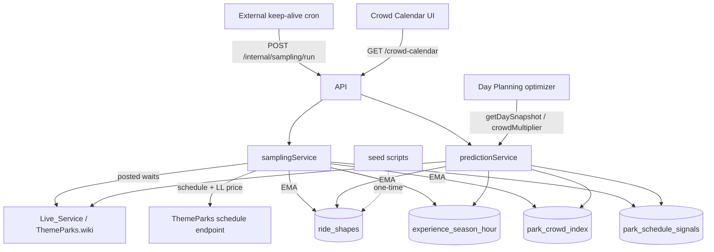

# Design Document

## Overview

The Crowd Calendar and Wait-Time Intelligence feature is the shared prediction foundation for both a browsable crowd calendar and the Day Planning optimizer. It predicts a park's daily busyness and an attraction's wait at any hour of any date, on free infrastructure, improving over time.

### Key design decisions

1. **Factored, most-specific-reliable prediction.** A wait is predicted from the most specific tier with enough data: (a) season-resolved `(ride, season, day_of_week, hour)` direct average; else (b) `Ride_Shape(day_of_week, hour) × Crowd_Multiplier(park, date)`; else (c) Park-typical shape × crowd. The factored default exists because the seed and early data are dense only in the `(day_of_week, hour)` dimension; the crowd multiplier specializes an all-season shape to a specific date. Tier (a) starts empty and densifies from the app's own sampling, then takes precedence — strictly more accurate as data grows, with no cold-start penalty.
2. **The crowd forecast leans on Disney's own signals.** ThemeParks.wiki `/entity/{park}/schedule` publishes, months ahead: park hours, Early Entry / Extended Evening / Special Ticketed Event flags, and **Lightning Lane Multi Pass price**. LL price is Disney's money-backed demand forecast and is the strongest single free forward signal; park-hours length and Extended-Evening days are secondary demand tells. A rule-computed seasonal prior (see below) fills the rest and is only load-bearing beyond Disney's publication window. This gives a usable forecast with zero observed history on day one.
3. **Reuse the existing keep-alive cron; no worker, no in-process timer, never user-driven.** The deployment already runs an external keep-alive cron; point it at the authenticated `/internal/sampling/run` endpoint so a single ping both keeps the box awake and collects data. The endpoint is **idempotent and self-throttling** — it samples waits at most once per a short debounce window and refreshes schedule/LL signals at most daily. The debounce exists only to absorb accidental rapid re-fires (a double-fire or a manual trigger); it MUST stay well below the keep-alive cadence so **every** keep-alive pass samples (R2.4). Critically, the debounce window must not equal the cron interval and must be measured from the pass **start**, not its completion — an equal-to-interval window stamped at completion lands every alternate cron hit just under the threshold and silently halves the effective sampling rate. It **returns immediately (`202`) and runs the pass asynchronously in-process**, so a slow ThemeParks.wiki response never delays or times out the calling cron; an overlap guard prevents concurrent passes. This avoids a BullMQ worker (whose continuous Redis polling would exhaust the free Upstash budget) and avoids an in-process timer (which only fires while awake and merely duplicates the keep-alive). Collection is independent of app usage; missed passes degrade gracefully.
4. **Recency-weighted updates.** Shapes, the season store, and the crowd index update via EMA (or capped count) so recent observations dominate and the model tracks Disney's operational changes.
5. **Reuse existing services.** Live waits/forecasts/hours come from the existing `Live_Service`; the Enterprise_Id → ThemeParks GUID mapping reuses the existing `themeParksDirectory`; coordinates come from `experiences.latitude/longitude`; the WDW calendar day comes from `wdwClock`.
6. **Pure math, testable.** Normalization, EMA, crowd-multiplier, forecast-from-features, and tier selection live in pure modules with no I/O, so they are deterministic and property-testable; the services pass in prefetched data.
7. **Frozen-forecast calibration loop.** Forecasts are captured at fixed lead times and stored as-issued, then reconciled against the observed index after the day closes. This measures true forecast error (not a hindsight recompute), and the resulting per-park/per-lead-time bias is fed back as a bounded correction — so the forecast self-tunes rather than only accumulating data.
8. **Rich per-ride signals captured from the same feeds.** Single-rider wait, Lightning Lane return/availability/sell-out, virtual-queue status, operating status/downtime, showtimes, and per-ride LL price all come from the live and schedule feeds already fetched each pass, so capturing them is near-free. Several are correctness-critical: virtual-queue rides have no standby line and shows use showtimes, so the snapshot must carry them or consumers would mis-model those experience types.
9. **Weather as a near-term adjustment.** Observed weather for the single WDW location is captured each pass from Open-Meteo (free, keyless); a per-ride weather sensitivity is learned (outdoor rides empty in rain, indoor rides fill). For dates inside the ~14-day forecast horizon, the prediction applies a bounded weather adjustment; beyond the horizon it is a no-op (weather is unknowable far out). One location fetch per pass, forecast refreshed daily.
10. **Derived stats and cross-ride effects, tiered by cost.** Dispersion (stddev/CV, p50/p90) and downtime rate live alongside the shape; best/worst hour, rope-drop escalation, and peak window are pure read-time derivations (no storage). Event-window wait dips and cascade (ride-down → neighbor spikes) are learned by correlation and recomputed at a **reduced daily cadence** because they are heavier; they surface as insights and MAY feed bounded same-day prediction adjustments. All bounded per decision 4/§Data Models.
12. **Historical comparables are date-proximity matched, not month-averaged (R2.9).** The forecast's year-over-year history feature selects prior dates within a ±7-day calendar window of the target (like-for-like: Christmas week vs Christmas week), because averaging every same-month, same-weekday date collapses holiday/festival peaks into the monthly mean and makes busy dates read as average. The seed already records the peaks correctly (verified: Magic Kingdom Dec 26 2024 at level 8, Dec 29 at level 8, while early December sits at level 2–4); the old `getComparableCrowdIndices` averaged all December-weekday dates together (a December-Thursday comparable mean of ~0.6/level-3 despite a max of 1.6/level-8), diluting those peaks to green. Proximity matching surfaces them instead.
11. **Crowd index over a standby basket, measured relatively (R2.7/R2.8).** The observed Crowd_Index counts only Experiences that post a standby queue — shows, dining, and parades are excluded — and is the mean of each ride's observed-vs-its-own-expected ratio, **not** a raw average of posted minutes. In practice ~75–90% of a park's operating live entries are no-queue zeros (shows, restaurants, pavilions), and the old all-entries average let them compress the index's range and make busy parks read as "empty" (Magic Kingdom averaging ~10 min, EPCOT ~5.6). The per-ride-relative form is also robust to *which* rides happen to be operating. The **same standby-queue predicate** gates raw-sample storage, so structurally-zero rows are neither aggregated nor written to `wait_samples` — bounding raw-sample growth. A walk-on 0-min ride stays in the basket (real low-crowd signal); exclusion is by absence of a standby queue, not by a zero value.

## Architecture



## Components and Interfaces

### Pure modules (`services/intelligence/`)

- `waitMath.ts` — `applyEma(prev, sample, weight)`, `emaVariance(...)` (streaming stddev/CV), `normalizeCrowdIndex(dailyAvg, parkDistribution)` (returns a **continuous** value), `crowdMultiplier(forecastContinuous, typicalContinuous)` (consumes the continuous values, never a rounded 1–10), `displayLevel(continuousIndex)` (the *only* place a 1–10 integer is produced, for rendering), `selectTier(seasonBucket, shapeBucket, parkTypical, threshold)`, and `weatherAdjustment(sensitivity, forecastCondition)` — a bounded multiplier that is 1.0 (no-op) when no in-horizon forecast exists. Plus, for the crowd-index refinement (R2.7/R2.8): `isStandbyBasketEntry(liveEntry)` — a pure predicate, true iff the entry is operating AND exposes a numeric standby wait (walk-on 0 included), used both to filter the crowd-index basket and to gate `wait_samples` recording; and `relativeCrowdIndex(rides)` — the mean of per-ride `observed / expected` ratios over basket-eligible rides (expected from Ride_Shape; a ride is excluded when its shape sample count is below `CROWD_INDEX_MIN_SHAPE_SAMPLES` or its expected ≤ 0), returning the continuous ratio (1.0 = typical) that `displayLevel` rounds at render only.
- `derivedStats.ts` — pure read-time derivations over a Ride_Shape: `bestWorstHours`, `escalationRate`, `peakWindow` (park aggregate), and `coefficientOfVariation` from mean/stddev. **`escalationRate` is a signed minute delta** (a morning slope: the predicted-wait change from the first to the second operating hour) — NOT a ratio. Consumers MUST treat it as minutes: a rope-drop-favorable verdict keys off a steep positive climb (default threshold `ROPE_DROP_ESCALATION_MINUTES = 15`), never off a bare `> 1.5` comparison.
- `crowdForecast.ts` — `forecastIndex(features)` from Schedule_Signal + calendar features, with the calibration bias correction applied (on the **continuous ratio scale**, clamped to the ratio band `[0.4, 3.0]` per R2.6 — NOT `[1,10]`, and never floored at 1.0); deterministic and property-testable. Plus (R2.9) a pure `selectComparableIndices(targetDate, history, windowDays)` that filters a `{date, crowd_index}` history to rows within ±`COMPARABLE_DAY_WINDOW` days of the target's day-of-year (wrapping the year boundary), preferring same-day-of-week when enough samples remain, and returns the values whose mean becomes `historyEstimate` — so the forecast compares a date to *nearby-calendar* history (Christmas week vs Christmas week), never a flat month+weekday average that buries the peak.
- `calibration.ts` — `updateAccuracy(prev, error, weight)` (recency-weighted MAE + bias) and `applyBiasCorrection(rawIndex, bias)` clamped to the ratio band `[0.4, 3.0]` per R2.6 (the 1–10 scale is display-only via `displayLevel`).
- `seasonalPrior.ts` — `seasonalPrior(date)` computed by rule per year, **not** hardcoded: US federal holidays via nth-weekday formulas, Easter via the Computus algorithm, an Easter-anchored spring-break window, plus summer / winter / Thanksgiving windows. Recomputes correctly every year, so it never goes stale. Weak feature within Disney's publication window; primary only for far-future dates.

Added by R14–R16 (all pure, no I/O, in `waitMath.ts` unless noted):

- `establishBaseline(prevBaseline, prevBaselineCount, shapeAvgWaitMinutes, shapeSampleCount)` (R14) — **establish-once-then-freeze**, not an EMA. Returns an already-established baseline completely untouched (value *and* count), so no observation can ever move it. When unestablished, it freezes `shapeAvgWaitMinutes` once `shapeSampleCount >= BASELINE_ESTABLISH_MIN_SHAPE_SAMPLES` (20) and otherwise leaves the baseline `null`.

  A long-memory EMA was implemented first and then discarded on measured grounds: at `count = 100` with a persistently different observed level it drifts `0.197` ratio units over `100` passes — only `1.27×` better than the fast shape over the same horizon, since both converge on the observations eventually. Beyond that, *any* exponential memory over-weights the recent season and therefore cannot be season-neutral, which is the one property the index actually needs. Genuine multi-season change is absorbed by the deliberate re-anchor of R14.9 instead.
- `isBaselineEstablished(baselineWait, baselineCount)` (R14.5) — the basket-eligibility predicate, replacing the Ride_Shape sample-count check inside `relativeCrowdIndex`'s input construction.
- `relativeCrowdIndex(rides)` — **behavioral change**: each ride's `expected` is now its Ride_Baseline rather than its Ride_Shape average, and the per-ride eligibility gate reads the baseline's sample count. The function's signature and its existing composition-robustness guarantees (Property 9) are unchanged; only the meaning of `expected` at the call site changes. `CROWD_INDEX_MIN_EXPECTED_MINUTES` and the `MAX_RIDE_RATIO` clamp still apply.
- `shrinkToPooled(bucketWait, bucketSampleCount, pooledWait, k)` (R16) — the day-of-week shrinkage blend. Returns `pooledWait` at `sampleCount = 0`, the raw bucket as `sampleCount → ∞`, and never a value outside the interval spanned by its two inputs.
- `selectTier(...)` — **signature change**. Tier 1 now takes the bucket's `avgCrowdIndex` and the raw `forecastIndex` so it can de-mean (R15); tier 2 now takes the day-of-week-pooled per-hour mean and the bucket's sample count so it can shrink (R16). The tier *ordering* and the park-typical fallback are unchanged, so Property 1 still holds. `predictionService.getDaySnapshot` supplies the pooled mean by grouping the already-fetched all-day-of-week shape rows by hour — no extra query.

Note the two multipliers are deliberately different quantities and must not be conflated: tier 2 scales by `crowdMultiplier(forecastIndex, 1.0)` — an *absolute* level factor, because a Ride_Shape average is season-agnostic — while tier 1 scales by `forecastIndex / bucket.avg_crowd_index` — a *relative* factor, because a season-resolved average already contains that season's typical crowd level. Applying the absolute multiplier to tier 1 would double-count it.

### Services (`services/intelligence/`)

- `predictionService.ts` — `getDaySnapshot(experienceIds, date, park)` and `crowdMultiplier(park, date)`; applies same-day live correction (via `Live_Service`) for today/tomorrow, and — for dates inside the ~14-day forecast horizon — a bounded per-Experience weather adjustment; falls back to model + Standard Operating Hours.
- `weatherClient.ts` — thin wrapper over Open-Meteo (keyless) for the WDW location: current/observed conditions and the near-term daily forecast; base URL from config. Caches process-wide and refreshes at most once per `WEATHER_REFRESH_MS` (default 24h) with a 429 backoff + stale-serve fallback, so the shared per-IP rate limit is never tripped by per-pass/per-prediction fetches.
- `samplingService.ts` — `runSamplingPass()`: reads posted waits and additional per-ride signals (single-rider wait, Lightning Lane return/availability, virtual-queue/boarding-group status, operating status, showtimes) from the Live_Service feed, plus Schedule_Signals and per-ride LL price from the schedule endpoint. Records a standby (and single-rider) wait value only for operating rides that expose a posted standby queue — `isStandbyBasketEntry` (closed/down/refurbishment reads and no-standby entities like shows/dining/parades are skipped for both shape and `wait_samples` purposes), per-pass EMA-updates the shape and season stores and the rolling `experience_signals`, maintains `park_crowd_index` as a running **daily** aggregate whose per-pass slice is the **per-ride-relative** `relativeCrowdIndex` over the standby basket (mean of observed/expected ratios per R2.8 — not a raw average of minutes, and not a per-slice EMA), UPSERTs `experience_daily_signals`, records observed weather (one Open-Meteo fetch for the WDW location) and updates `experience_weather_sensitivity`, updates per-bucket `stddev_wait`/`down_rate` each pass, appends bounded raw samples, runs a reduced-cadence (daily) recompute of percentiles (`p50`/`p90` from retained samples), `experience_event_impact`, and `ride_cascade`, and runs the calibration steps — **capture** frozen forecasts for upcoming dates at the configured lead times into `crowd_forecast_log`, and **reconcile** newly-closed dates against their observed index (updating `crowd_forecast_accuracy` via EMA). Per-park failure isolation throughout.
- `IntelligenceRepo` — bounded snapshot reads and EMA UPSERTs.

### Routes

- `POST /internal/sampling/run` (and `HEAD /internal/sampling/run`) — cron-authenticated (shared `x-cron-secret`); idempotent and self-throttling (a start-stamped debounce below the keep-alive cadence so every pass samples per R2.4, refreshes schedule at most daily). Returns `202 Accepted` immediately and runs `runSamplingPass` asynchronously in-process (safe because Render runs a persistent Node process, not serverless), with an overlap guard and internal error handling, so a slow upstream never delays or times out the calling cron. Both methods share the same secret gate and async kick-off; **`POST` returns a tiny `{status:'accepted'}` body while `HEAD` returns headers only (no body)** — the keep-alive cron may target `HEAD` so its response can never be "too large". Intended target for the existing keep-alive cron.
- `GET /crowd-calendar?park&from&to` — session-authenticated; returns per-date forecast index, park hours, event flags, LL price, and best-park picks.
- `GET /experiences/:id/wait-insights?date=` — session-authenticated; serves `WaitInsightsDTO` for the requested date-context (defaulting to today when omitted). The service resolves the ride's `park` from `experiences.park` (via `IntelligenceRepo`) to pick the crowd multiplier — it does NOT resolve park through `themeParksDirectory` (which maps Enterprise_Id → GUID for live lookups, not experience → park) and MUST NOT fall back to a hardcoded park.

### Seed scripts (`apps/api/src/scripts/`)

- `seedShapes.ts` — maps each Experience via `themeParksDirectory.resolveEntityId(upstream_entity_id)` (Enterprise_Id → ThemeParks GUID == RopeDrop entity id), fetches RopeDrop `/api/analysis/ride/{guid}`, writes `(day_of_week, hour) → avg_wait` into `ride_shapes`. Identifying User-Agent + attribution. One-time; not in any request path.
- `seedCrowdIndex.ts` (optional) — seeds historical `park_crowd_index` from a free date-resolved source when available.

## Data Models

### Migration `0020_wait_time_intelligence.sql`

- **`ride_shapes`** — PK `(experience_id, day_of_week, hour)`; `avg_wait_minutes REAL`, `sample_count INTEGER`, plus nullable `sr_avg_wait_minutes REAL`, `sr_sample_count INTEGER` for the single-rider shape where offered, plus dispersion/reliability per bucket: `stddev_wait REAL` (EMA variance → CV), `p50_wait REAL`, `p90_wait REAL` (recomputed periodically from retained samples), and `down_rate REAL`. ~100×7×24 ≈ 17k rows.
- **`experience_season_hour`** — PK `(experience_id, season, day_of_week, hour)`; `avg_wait_minutes REAL`, `sample_count INTEGER`. Coarse `season` to densify faster; ~100×4×7×24 ≈ 67k rows. Starts empty; filled by sampling.
- **`park_crowd_index`** — PK `(park, date)`; `crowd_index REAL` (a **continuous** normalized value, not a 1–10 integer), `daily_avg_wait REAL` (the raw signal), `sample_count INTEGER`, and `source TEXT` (`observed` default | `seed`, added in `0021`). ~4 rows/day; the observed record and forecast trainer. The 1–10 shown in the UI is rounded from `crowd_index` at render time only. The rolling-baseline query filters `source='observed'`; the comparable-dates query includes seeds. **Basket & method (R2.7/R2.8):** `crowd_index` is a **per-ride-relative** aggregate — the mean over the Park's **standby basket** (only Experiences exposing a posted standby queue; shows / dining / parades / no-queue excluded) of each ride's observed standby wait ÷ its own Ride_Shape expected wait for that `(day_of_week, hour)`, over core hours, with a ride basket-eligible only once its Ride_Shape has ≥ `CROWD_INDEX_MIN_SHAPE_SAMPLES` samples. `daily_avg_wait` remains the basket's mean posted wait as an **informational signal only** — it is **no longer** the index numerator, so a park's low absolute average (historically dominated by no-queue zeros) can no longer read as "empty." Because the index is per-ride-relative it no longer needs a park-level typical, so `getParkRollingBaseline` is **removed** — its only production caller was the old numerator, and `ride_shapes` now supplies a finer per-ride, `(day_of_week, hour)`-resolved baseline. WHEN a pass's standby basket is empty (no ride yet has an eligible shape), the System writes **no** `crowd_index` slice for that pass and lets the forecast/seed carry the date, rather than falling back to a park-wide constant. A walk-on 0-min ride stays in the basket; a no-standby entity is never written to `wait_samples` at all.

**Park key (canonical).** The `park` column in every store (`park_crowd_index`, `park_schedule_signals`, `crowd_forecast_log`, `crowd_forecast_accuracy`) and every lookup MUST use the canonical `Park` enum value, mapped from the ThemeParks park name at ingestion via a single mapping helper. Storing raw ThemeParks names in one place and querying enum values (or hardcoded names) in another silently breaks the calibration reconcile and the calendar reads — writes and reads must agree on one key.
- **`park_schedule_signals`** — PK `(park, date)`; `open_time TIMESTAMPTZ`, `close_time TIMESTAMPTZ`, `early_entry BOOLEAN`, `extended_evening BOOLEAN`, `ticketed_event BOOLEAN`, `ll_multipass_price_cents INTEGER`. Keyed by park/date; refreshed each pass for the forward window.
- **`crowd_forecast_log`** — PK `(park, date, lead_days)`; `forecast_index REAL`, `forecasted_at TIMESTAMPTZ`, `observed_index REAL` (null until reconciled), `error REAL` (null until reconciled). The frozen forecast as issued; reconciled after the date closes; pruned beyond a retention window.
- **`crowd_forecast_accuracy`** — PK `(park, lead_days)`; `mae REAL`, `bias REAL`, `sample_count INTEGER`. Recency-weighted rolling accuracy that feeds the bias correction.
- **`experience_signals`** — PK `experience_id`; slowly-changing rolling per-ride facts: `has_single_rider BOOLEAN`, `uses_virtual_queue BOOLEAN`, `downtime_rate REAL`, `ll_sellout_median_hour REAL`, `sample_count INTEGER`. One row per experience (~100 rows).
- **`experience_daily_signals`** — PK `(experience_id, date)`; per-date facts from the live/schedule feeds: `ll_price_cents INTEGER`, `ll_available BOOLEAN`, `used_virtual_queue BOOLEAN`, `showtimes JSONB` (for shows). Holds the RAW upstream `ThemeParksShowtime[]` objects (`{type, startTime, endTime}`), NOT ISO strings. Showtimes accumulate across sampling passes as a per-date UNION deduplicated by `startTime` (sorted ascending) rather than being overwritten on each pass, preventing morning showtime erosion as upstream drops elapsed performances. All readers (`predictionService.getDaySnapshot`, `predictionService.getCrowdCalendarDay`, `derivedStatsService` / `deriveShowTimePatterns`) must normalize through `normalizeShowtimeEntries`. Pruned to a forward + recent window.
- **`weather_observations`** — PK `observed_at` (one WDW location); `temp_f REAL`, `precip REAL`, `condition TEXT`. Bounded recent-window retention; plus a small cached near-term forecast (by date).

- **`experience_weather_sensitivity`** — PK `(experience_id, condition)`; `wait_multiplier REAL` versus a clear-sky baseline, `sample_count INTEGER`. ~100 rides × few conditions ≈ small, bounded.
- **`experience_event_impact`** — PK `(experience_id, event_type)`; `wait_multiplier REAL` during nearby entertainment vs baseline, `sample_count INTEGER`. Learned from showtimes + waits.
- **`ride_cascade`** — PK `(down_experience_id, affected_experience_id)`; `wait_delta REAL`, `wait_pct_delta REAL`, `baseline_wait REAL`, `sample_count INTEGER`. Same-park pairwise effect of a breakdown; recomputed at reduced cadence (daily). Bounded to same-park pairs.
- **`wait_samples`** — `(experience_id, observed_at, wait_minutes, status)`; pruned to a bounded recent window.

### Migration `0021_crowd_index_source.sql`

Adds `source TEXT NOT NULL DEFAULT 'observed' CHECK (source IN ('observed','seed'))` to `park_crowd_index` so the one-time historical backfill (Task 7.2, from WDW Passport) can be stored without skewing each park's own rolling baseline. `getComparableCrowdIndices` (the forecast's year-over-year feature) intentionally includes both `seed` and `observed`, and (R2.9) returns **dated rows within a calendar-proximity window of the target date** (not a flat month+day-of-week average), so date-specific peaks are preserved for `selectComparableIndices` to weight. Seeded rows carry `daily_avg_wait=0`, `sample_count=0`, `source='seed'`. Because seeds are past-dated and live sampling only writes today/forward, the two never collide on the `(park, date)` PK.

### Shared DTOs (`@dwt/shared`)

- `CrowdCalendarDayDTO` — `{ date, park, forecastIndex, observedIndex?, capturedForecast?, forecastAccuracy?, parkHours, earlyEntry, extendedEvening, ticketedEvent, llMultipassPriceCents?, festival? }`, plus optional per-ride surfacing of reliability, typical LL sell-out hour, and showtimes in the day-detail projection.

  `forecastIndex` and `observedIndex` are both on the **display 1–10 scale** (the continuous ratio is projected via `displayLevel` at the DTO boundary). `observedIndex` is set only for a past date whose observed index is finalized from the app's own sampling — a `source='seed'` row is history, not "how we did", and does not populate it.

  The two accuracy fields exist because R7.5 requires predicted-versus-actual to be honest, and the naive implementation is not:
  - `capturedForecast: { index, leadDays, capturedAt }` — the forecast **as issued**, read from the frozen `crowd_forecast_log`. Critically NOT a recomputed value: for a past date `computeRawForecast` returns the observed index verbatim (its first branch), so a recomputed "prediction" would always equal the actual and the comparison would be vacuous. `getCapturedForecast` returns the **earliest-issued** surviving capture (largest `lead_days`) — the strongest honest claim, and the one least contaminated by the R4.3 same-day live correction. `leadDays` travels with it so the UI can state how far ahead the claim was made.
  - `forecastAccuracy: { meanAbsoluteErrorLevels, leadDays, sampleCount }` — the measured rolling error at the **same** lead time, so the figure carries its own error bar. Ratio-scale MAE is multiplied by 5 to express it in display levels (since `displayLevel` is `round(5 × ratio)`), and `sampleCount` is exposed so a one-day-old average is not read as an established one. Omitted entirely when nothing has been scored at that lead.

  **Date-key convention (`toDateKey`).** Values bound to a `DATE` column are keyed off the instant's **UTC** calendar date. Both callers supply an instant whose UTC date already equals the intended park day: the calendar route passes midnight-UTC dates, and `captureForecasts` passes ET-noon (`16:00Z`). Converting to Eastern instead would shift a midnight-UTC date back a day (`00:00Z Aug 20` is `20:00 ET Aug 19`) and break every calendar read, so the convention is pinned by two live-Postgres tests rather than left to be "fixed" later.
- `WaitSnapshot` — per-experience view carrying, per hour, the predicted standby wait, plus the single-rider wait (when offered), `isVirtualQueue`, `showtimes` (for shows), and Lightning Lane info — so consumers model each experience type correctly. Consumed internally and by Day Planning.
- `WaitInsightsDTO` — per-ride derived wait insights for the "When to ride" surface (named *wait insights*, distinct from the personal Stats tab): `p50`/`p90` (day-representative percentiles, aggregated across the day's operating-hour buckets — NOT read from a single arbitrary hour bucket such as `shape[0]`) and coefficient of variation, `bestHour`/`worstHour`, `escalationRate` (rope-drop value), reliability (`downRate`), typical LL sell-out hour, and event/cascade highlights. It also carries the fields the UI needs so it never hardcodes or fabricates values: `waits` (the real per-hour predicted-wait curve for the requested date-context — the always-visible forecast chart binds to this, per R11.11), `sampleCount` (the representative bucket sample count backing the verdict, so the UI can scale the verdict's certainty per R11.11 alongside `cv`), `hasSingleRider` and `singleRiderP50WaitMinutes?` (to render the single-rider decision helper's estimated time saved per R11.9 — absent when the ride has no single-rider line), and `llMultipassPriceCents?` (the ride's Lightning Lane price for the LL decision helper — the UI MUST render this, not a hardcoded price). The ride's `park` used to compute the crowd multiplier for this DTO is resolved from `experiences.park` (via the repo), never from a fabricated directory method or a hardcoded park default.

## Correctness Properties

### Property 1: Prediction picks the most specific reliable tier and is never unusable
*For any* experience/date/hour, `getDaySnapshot` returns a finite non-negative wait, preferring the season-resolved bucket when it clears the threshold, else `shape × crowd`, else park-typical — never a thinner tier over a denser one.

**Validates: Requirements 1.1, 4.1**

### Property 2: EMA update is recency-weighted and bounded
*For any* sequence of samples, `applyEma` yields a value within the observed range, weights the newest sample no less than any older one, and never lets `sample_count` exceed its cap.

**Validates: Requirements 3.5, 3.6**

### Property 3: Crowd index is continuous and monotonic; display rounding is separate
*For any* daily average and park distribution, `normalizeCrowdIndex` returns a **continuous** value non-decreasing in the daily average; `displayLevel` maps that continuous value to an integer in [1, 10], monotonically, and is the only producer of the 1–10 value. No calculation consumes `displayLevel`'s output.

**Validates: Requirements 2.1**

### Property 4: Crowd forecast is defined with zero history
*For any* date with only Schedule_Signal and calendar features (no observed index), `forecastIndex` returns a finite, positive continuous **ratio** in `[0.4, 3.0]` (1.0 = typical) — quieter-than-typical inputs yield a value **below 1.0**, i.e. it is not floored at typical. `crowdMultiplier` is computed from continuous ratios and falls back to 1.0 only when neither forecast nor history exists.

**Validates: Requirements 2.3, 2.4, 2.6**

### Property 5: Sampling failure is isolated
*For any* pass where one park's fetch fails, the other parks' stores are still updated and the failure is recorded.

**Validates: Requirements 3.7**

### Property 6: Calibration reconciles by key and stays bounded
*For any* captured forecast and later observed index, reconciliation pairs them by `(park, date, lead_days)` and records `error = forecast − observed`; `updateAccuracy` keeps a recency-weighted MAE/bias, and `applyBiasCorrection` returns a continuous ratio clamped to the ratio band `[0.4, 3.0]` (ratio-scale units — NOT [1, 10]).

**Validates: Requirements 7.1, 7.2, 7.3, 7.4**

### Property 19: The bias correction reaches the published forecast and nothing on the wait path
*For any* park with a scored accuracy row, the calibrated forecast differs from the raw forecast by exactly the clamped measured bias, and:
1. **Both published consumers agree.** The value returned by `getCalibratedForecast` (what `captureForecasts` freezes) equals the continuous value behind `getCrowdCalendarDay`'s displayed `forecastIndex`. If these diverged, published accuracy would describe a forecast nobody was shown.
2. **No wait consumer is affected.** `getRawForecast`, `getCrowdMultiplier`, `getDaySnapshot`'s per-hour `predictedWaitMinutes`, and `getWaitInsights` are **bit-identical** whether or not an accuracy row exists — so the correction cannot move a wait prediction (R7.7).
3. **Absence is not zero.** A park with no reconciled rows (`sample_count = 0`), or an unavailable accuracy store, yields the raw forecast unchanged rather than a correction of `0` applied to a fabricated bias.

**Validates: Requirements 7.4, 7.7**

### Property 7: Weather adjustment is bounded and horizon-limited
*For any* Experience and date, `weatherAdjustment` returns a bounded multiplier, and returns exactly 1.0 (no effect) when the date is outside the forecast horizon or no sensitivity is known — so weather never distorts a far-future prediction.

**Validates: Requirements 10.3, 10.4**

### Property 8: Derived statistics are internally consistent
*For any* Ride_Shape bucket, `p50 ≤ p90`, the coefficient of variation is finite and non-negative, `down_rate ∈ [0, 1]`, and `derivedStats` functions return values within the shape's own range (best/worst hour are actual hours; escalation is a difference of in-range waits).

**Validates: Requirements 11.1, 11.2**

### Property 9: Crowd index measures the standby basket, relatively, and is composition-robust
*For any* set of rides with observed and expected waits, `relativeCrowdIndex` (a) ignores rides whose expected baseline is absent, expected ≤ 0, or Ride_Shape sample count is below `CROWD_INDEX_MIN_SHAPE_SAMPLES`; (b) returns `1.0` when every included ride sits exactly at its expected wait; (c) is non-decreasing in any included ride's observed wait; and (d) is **unchanged by adding a ride that is exactly at its expected level** — so a park's index does not move merely because more at-typical or no-wait entries are operating.

**Validates: Requirements 2.7, 2.8**

### Property 10: Only standby-queue entries are sampled
*For any* Live_Service entry, `isStandbyBasketEntry` is `true` iff the entry is operating AND a numeric standby wait is posted (a walk-on `0` included) and `false` for entries with no standby queue or a non-operating status; consequently the pass contributes a `wait_samples` row and a crowd-index term for exactly the entries it selects — never for a no-standby entity (show / dining / parade).

**Validates: Requirements 3.5, 2.7**

### Property 11: Comparable selection is calendar-proximate and preserves date-specific peaks
*For any* target date and history of `{date, crowd_index}` rows, `selectComparableIndices` returns only rows within ±`COMPARABLE_DAY_WINDOW` days of the target's day-of-year (respecting year wraparound), and when the history contains a peak clustered near the target date, the selected mean is **≥** the flat mean over all rows sharing the target's month and day-of-week — i.e. a date inside a known peak window is never diluted below the unrelated same-month average.

**Validates: Requirements 2.9**

### Property 12: Historical showtime patterns derive from past signals with separate group and slot gates
*For any* show experience:
1. **Group Gate:** An `(experience_id, day_of_week)` group derives patterns iff `totalObservedDates >= SHOWTIME_PATTERN_MIN_SAMPLES` (2) distinct dates with showtimes were observed over the trailing `SHOWTIME_PATTERN_WINDOW_DAYS` (180 days); groups with fewer observed dates emit no patterns.
2. **Slot Gate:** Within a qualifying group, a candidate 5m showtime bucket is retained iff `frequency >= SHOWTIME_PATTERN_MIN_FREQUENCY` (0.50), where `frequency = sample_count / totalObservedDates` and `sample_count` is the count of observed dates running that performance time. `SHOWTIME_PATTERN_MIN_SAMPLES` is strictly a group gate and is not applied per-slot.
3. **Fallback & Accumulation:** `getDaySnapshot` and `getCrowdCalendarDay` fall back to these patterns with `showtimesAreTypical = true` exactly when no per-date schedule signal exists for that date; and per-date showtimes accumulate across sampling passes as a per-date UNION deduplicated by start time.

**Validates: Requirements 12.1, 12.2, 12.3, 12.4, 12.6, 12.7**

### Property 13: Daily recompute leg isolation and outcome recording
*For any* daily recompute run where a subset of legs fails: (1) every leg is executed regardless of failures in preceding legs (full isolation); (2) each leg's outcome is recorded in `derived_stat_runs` — successful legs set `consecutive_failures = 0` and clear `last_error` while preserving `last_error_at`; failing legs increment `consecutive_failures` and record `last_error` truncated to ≤500 characters while preserving `last_success_at`; (3) a failure during `recordDerivedStatRun` is caught and swallowed without failing the run; and (4) the recompute run logs a `warn` structured summary when any leg failed, and `info` only when all legs succeeded.

**Validates: Requirements 13.1, 13.2, 13.3, 13.4, 13.5, 13.6**


### Property 14: An established Ride_Baseline is frozen, so the crowd index cannot self-drift
*For any* basket of rides and *any* run of repeated passes in which each ride's observed wait is held constant while the fast Ride_Shape is updated toward those observations between passes:
1. **Exact stability.** The baseline-denominated index is **exactly unchanged** across the entire run — not merely within a tolerance — because `establishBaseline` returns an already-established baseline untouched. Over the same run the shape-denominated index converges to `1.0`, so a ride reliably running 25% above its baseline reads as a typical day. That collapse is the defect.
2. **Idempotence.** `establishBaseline` is idempotent on an established bucket: for any sample and any shape state, both the returned value and `baseline_sample_count` equal the inputs.
3. **Establishes from a settled shape, never from a sample.** A bucket with no baseline establishes to `avg_wait_minutes` — carrying the Model_Seed's absolute level — and only once `shapeSampleCount >= BASELINE_ESTABLISH_MIN_SHAPE_SAMPLES`. Below that it stays unestablished (`null`) rather than freezing a noisy level, and it is never set to the observation.
4. **Eligibility reads the baseline's own columns.** A ride with `baseline_sample_count < CROWD_INDEX_MIN_SHAPE_SAMPLES` or `baseline_wait_minutes < CROWD_INDEX_MIN_EXPECTED_MINUTES` is excluded from the basket, independently of how dense its fast shape is.

**Validates: Requirements 14.1, 14.3, 14.4, 14.5, 14.6, 14.8**

### Property 15: A mature season bucket still responds to the date's crowd forecast
*For any* season-resolved bucket at or above the tier-1 reliability threshold with a positive `avg_crowd_index`, `selectTier` returns a value that is **strictly increasing in `forecastIndex`** over the unclamped range — so two dates with different crowd forecasts never receive the same tier-1 wait. The returned value equals the bucket's raw average exactly when `forecastIndex == avg_crowd_index` (the bucket's own embedded crowd level), and falls back to the raw average when `avg_crowd_index` is absent, non-finite, or `<= 0`. The scaling factor stays within `[CROWD_MULTIPLIER_MIN, CROWD_MULTIPLIER_MAX]`.

**Validates: Requirements 15.1, 15.2, 15.3, 15.4**

### Property 16: Day-of-week shrinkage is bounded, monotone, and converges to the raw bucket
*For any* weekday bucket wait, pooled per-hour mean, and non-negative sample count, the shrunk shape estimate (a) lies within the closed interval bounded by the two inputs (never outside it), (b) is non-decreasing in the bucket's sample count when the bucket exceeds the pooled mean and non-increasing when it is below, (c) equals the pooled mean at `sampleCount = 0` and tends to the raw bucket as `sampleCount → ∞`, and (d) is applied only in the shape tier — the season-resolved and park-typical tiers are numerically unchanged by the shrinkage parameter.

**Validates: Requirements 16.1, 16.4, 16.5, 16.6**

### Property 17: The wait archive is bounded, idempotent, and prediction-neutral
*For any* set of raw samples, the archive aggregation for an `(experience_id, date, hour)` key yields `sampleCount >= 1`, `min <= mean <= max`, and re-running the aggregation over the same samples produces an identical row (idempotent per key, no double-counting). Archive contents are **prediction-neutral**: for any two archive states, `getDaySnapshot` and `getCrowdMultiplier` return identical values for the same inputs.

**Validates: Requirements 17.1, 17.2, 17.5, 17.6**

### Property 18: Wait forecasts are frozen, scored by key, and challengers never leak into serving
*For any* captured wait prediction and later observed hourly mean, reconciliation pairs them by `(experience_id, date, hour, lead_days)` and records `error = predicted − observed` in minutes; the recency-weighted per-`(experience, lead)` MAE and bias update by the same capped-alpha form as Property 6. A captured row's `predicted_wait_minutes` is never rewritten by a later recompute (frozen). A present `challenger_wait_minutes` contributes only to challenger error columns and **never** to the served prediction or to the primary accuracy summary; an absent challenger leaves its error columns null and is excluded from every challenger aggregate.

**Validates: Requirements 18.1, 18.3, 18.4, 18.5, 18.6**


## Error Handling

- **Slow/failing upstream during a pass:** the endpoint has already returned `202`, so the caller is never blocked; the pass runs async, bounded by the Live_Service deadline, and isolates the failing park (Property 5). Errors are logged, not surfaced to the cron.
- **Live_Service / schedule timeout or failure (prediction path):** best-effort within the existing deadline; prediction falls back to the model + Standard Operating Hours.
- **Missing LL price / schedule gap for a date:** the forecast uses the remaining features; a null LL price is treated as "unknown," not zero.
- **Thin or empty stores:** tier fallback (Property 1) and neutral 1.0 multiplier (R2.4) keep predictions finite.
- **Seed unavailable:** non-fatal; the model starts from park-typical shapes + Schedule_Signal forecast (R5.3).

## Testing Strategy

- **Property-based (`fast-check`, ≥100 runs, tagged `Feature: crowd-calendar, Property N`):** the properties above, against `waitMath.ts` and `crowdForecast.ts` — including **Property 9** (`relativeCrowdIndex` composition-robust) and **Property 10** (`isStandbyBasketEntry` selects only posted-standby entries).
- **Crowd-index basket (regression):** a repo/`server.inject` test drives a sampling pass over a mixed park (a headliner ride, a walk-on 0-min ride, a show, and a restaurant) and asserts `wait_samples` is written **only** for the two rides and that `crowd_index` is the per-ride-relative aggregate over them. This test MUST fail against the pre-change all-entries average (which read the show/restaurant zeros and understated the park), so it genuinely guards the fix.
- **Migration test (`migration0020.test.ts`, `migration0030.test.ts`):** all stores, PKs, CHECK constraints, and bounded retention.
- **Integration (`server.inject`):** `/internal/sampling/run` updates stores and isolates a failing park; `/crowd-calendar` returns forecast + signals and is session-gated; same-day correction path in `predictionService`.
- **Live-Postgres testing & pg-mem limitations:** pg-mem cannot execute the `AT TIME ZONE` operator, ordered-set aggregates (`percentile_cont … WITHIN GROUP`), or **multi-argument `unnest`** (`unnest($1::uuid[], $2::int[], …)` fails with "unnest expects 1 arguments, given 13"). Any repo query using them CANNOT be covered by the pg-mem suites and MUST use the live-Postgres scratch-database pattern from `repo.performance.test.ts`. Known cases requiring the live DB harness: `IntelligenceRepo.getRecentPercentiles` (`AT TIME ZONE` + `percentile_cont`), and the bulk upserts `upsertRideShapes` / `upsertSeasonHours` / `upsertParkCrowdIndices` / `upsertForecastLogs` (multi-array `unnest`).

  A second, independent reason the bulk upserts need live Postgres: the `21000` error they guard against (`ON CONFLICT DO UPDATE command cannot affect row a second time`) **only exists on real Postgres**. pg-mem happily accepts a batch containing a duplicated conflict key, so a pg-mem test could not guard the `dedupeByKey` call even if it could run the query.
- **Unit:** `crowdForecast` feature weighting (LL price / park hours / holidays / school breaks), the seed script's RopeDrop mapping, and `normalizeCrowdIndex`.
- **Mobile:** the calendar month view, day-detail, best-park pick, and predicted-vs-actual rendering.
- **Season-tier regression (R15.5) — mandatory, not optional.** The existing tier tests all sit *below* the tier-1 reliability threshold, so the tier-1 branch is currently executed by no assertion. The new test MUST construct a season bucket at `sample_count >= 30` with a positive `avg_crowd_index` and assert the returned wait **differs** between two forecast indices, in the correct direction. A test that leaves every bucket under the threshold does not cover R15 no matter how green it runs — this is the executed-but-unasserted trap.
- **Crowd-index drift regression (R14.8).** A test MUST run `relativeCrowdIndex` across repeated passes with observed waits held constant while the *fast shape* is updated toward those observations between passes, and assert the index does not move. This test fails against the pre-change denominator (which drifts upward) and passes after, so it genuinely guards the fix rather than restating it.
- **Migration test (`migration0033.test.ts`).** Asserts the two new `ride_shapes` columns and their backfill (`baseline_wait_minutes = avg_wait_minutes` for pre-existing rows, `baseline_sample_count = LEAST(sample_count, 500)`), the nullable `experience_season_hour.avg_crowd_index` (and that it is **not** defaulted to `1.0`), and the `wait_archive` / `wait_forecast_log` / `wait_forecast_accuracy` PKs and CHECK constraints.
- **Repo tests (pg-mem or live-Postgres per the limitation above).** The archive upsert must be exercised as **real SQL** and read back — a route or service test with a mocked repo does not cover an aggregation bug in the query. Note the archive aggregation groups by ET hour and so uses `AT TIME ZONE`, which pg-mem cannot execute; it therefore requires the live-Postgres scratch-database harness.
- **Prediction-neutrality (R17.5 / Property 17).** A test asserts `getDaySnapshot` returns byte-identical output with an empty and a populated `wait_archive`, so the archive can never quietly become a prediction input.

## UI Surfaces & Navigation

Two mobile surfaces, placed on existing navigation (no new tab — the bottom bar stays Home / Catalog / Trips / Friends / Profile):

- **Crowd Calendar** — a new `CrowdCalendar` screen registered in the **Catalog stack** (`CatalogStack`), entered via a prominent "Plan your visit" card on the **Home** screen. It hosts the month view (per-park 1–10 coloring, best-park/best-days picks) and pushes a day-detail view (per-park index, park hours, Early Entry / Extended Evening / party flags, LL Multi Pass price, festival, near-term forecast weather, and captured-forecast-vs-actual + accuracy for past dates). Served by `GET /crowd-calendar`.
- **When to ride (wait insights)** — a new section on the existing root-level `ExperienceDetailScreen`, which already shows the live wait. It is **date-contextual** (a Now / trip-date / typical switcher — never an arbitrary fixed date, R11.8) and leads with an **actionable best-time-to-ride verdict** rather than a raw chart. The verdict's **tone scales with confidence** (R11.11) — prescriptive when data is dense ("Ride after 8 PM"), observational when thin ("Evenings are usually calmer") — and never uses apologetic/doubt copy; uncertainty lives in the chart, not the headline. Below it: the forecast curve for the chosen date, **decision helpers** (Lightning Lane time-saved-vs-price and single-rider tradeoffs, R11.9), and secondary insights (typical/worst p50/p90, reliability, LL sell-out, event/cascade dips). Two actions bridge outward: **"Add to my plan"** inserts the ride into a Trip's `TripSchedule` at its recommended time, and an optional **wait-drop alert** (R11.10). Served by `GET /experiences/:id/wait-insights`. Named *wait insights* to stay distinct from the personal **Stats** tab (own tracking), a different domain.

Model internals (weather sensitivity, calibration bias, cascade/event correlation tables, EMA counts, seasonal-prior weights, raw per-date LL prices) are inputs that sharpen the rendered numbers; they are not their own screens.

## Configuration & Constants

Concrete defaults so nothing is left to guess. Override via env where noted.

### Env vars
- `SAMPLING_CRON_SECRET` (required) — shared secret the keep-alive cron sends (e.g. `X-Cron-Secret` header) to authenticate `POST /internal/sampling/run`. Fail the request `401` if absent/mismatched.
- `THEMEPARKS_BASE_URL` — already present; default `https://api.themeparks.wiki/v1`.
- `OPEN_METEO_BASE_URL` — default `https://api.open-meteo.com/v1` (keyless).
- `WEATHER_REFRESH_MS` — how long the weather client caches before re-fetching; default `86400000` (24h). Kept high because Open-Meteo rate-limits per IP and Render's free tier shares outbound IPs.
- `ROPEDROP_BASE_URL` — one-time seed only; default `https://ropedropplanner.com/api`. Used by `seedShapes.ts` to fetch `/analysis/ride/{guid}`; not on any request path.
- `CROWD_SEED_DIR` — one-time seed only; directory of saved WDW Passport month-page HTML files that `seedCrowdIndex.ts` parses locally (default `apps/api/seed-data/crowd/`). Not on any request path; the app never fetches the site.
- `ROPEDROP_BASE_URL` — default `https://ropedropplanner.com/api` (seed script only; not read at request time).
- `SEED_USER_AGENT` — identifying UA + contact for the one-time RopeDrop seed, e.g. `DisneyApp/1.0 (you@example.com)`. **Mandatory** — RopeDrop returns `403` for bare/generic user agents.
- `SEED_DELAY_MS` — polite spacing between RopeDrop analysis requests during `seedShapes`; default `2100` (RopeDrop limits `/api/analysis/*` to 30/min). One-time seed only.
- `SAMPLING_CRON_SECRET` — also required at boot for the sampling endpoint; must be present in every env file (`.env`, `.env.dev`) or the API/scripts fail to load config.

### Constants (defaults)
- **WDW location:** lat `28.3852`, lon `-81.5639` (single Open-Meteo point).
- **Sampling debounce:** at most once per `5` min, measured from the pass **start** — deliberately below the ~`10`-min keep-alive cadence so every keep-alive pass samples (R2.4). It must never equal the cron interval nor be stamped at pass completion: a `10`-min window stamped at completion drops every other `10`-min pass (~`20`-min effective rate). Refresh schedule/LL signals at most once per `24` h.
- **Core hours (crowd index):** `10:00`–`17:00` ET, operating rides only.
- **EMA:** shape/season/crowd updates use weight `alpha = 2 / (N + 1)` with `sample_count N` capped at `500` (≈ season-scale half-life; recent data dominates once mature).
- **Tier-1 reliability threshold:** a season-resolved bucket is used only at `sample_count >= 30`, else fall back to shape × crowd.
- **Crowd-index standby basket (R2.7/R2.8):** the observed Crowd_Index is computed only over Experiences that expose a posted standby queue (`isStandbyBasketEntry`), as the mean of per-ride `observed / expected` ratios; a ride is basket-eligible once its Ride_Shape has `CROWD_INDEX_MIN_SHAPE_SAMPLES = 5` samples (and expected > 0). The same standby-queue predicate gates `wait_samples` recording (R3.5), so no-standby entities (shows / dining / parades) are neither aggregated nor stored.
- **Forecast comparables (R2.9):** `COMPARABLE_DAY_WINDOW = ±7` days — the historical comparable feature selects prior seed/observed dates within this calendar-day window of the target (wrapping the year boundary), preferring the same day-of-week when enough samples remain, rather than averaging all same-month, same-weekday dates. This preserves intra-month peaks (holiday weeks, festivals) that a monthly average would flatten.
- **Wait-insights verdict confidence (R11.11):** high confidence at `sampleCount >= 30` and `cv <= 0.35` (prescriptive tone); low confidence at `sampleCount < 10` (soft/observational tone + "early estimate" chip); moderate otherwise. `sampleCount` and `cv` are aggregated across the day's operating-hour buckets, not a single hour.
- **Rope-drop verdict threshold:** `ROPE_DROP_ESCALATION_MINUTES = 15` — `escalationRate` (a signed minute delta) must climb at least this much from the first to second operating hour to favor a rope-drop verdict.
- **Season buckets:** 4 — Winter (Dec–Feb), Spring (Mar–May), Summer (Jun–Aug), Fall (Sep–Nov). Coarse on purpose so they densify.
- **Forecast capture lead times:** `[30, 14, 7, 3, 1]` days.
- **Weather forecast horizon:** `14` days; beyond it, weather adjustment = 1.0.
- **Bounds (clamps):** forecast index (continuous ratio, 1.0 = typical) `[0.4, 3.0]`; crowd multiplier `[0.4, 2.0]`; weather adjustment `[0.75, 1.25]`; calibration bias correction `±0.5` **ratio-scale** units. All internal crowd values share the ratio scale; `displayLevel` (`round(5 × ratio)`, clamped 1–10) is the only conversion to the display scale.
- **Standard Operating Hours fallback:** `9:00 AM`–`9:00 PM` ET.
- **Cadences:** percentiles, `experience_event_impact`, and `ride_cascade` recompute once per `24` h; sampling every pass.
- **Retention:** `wait_samples` pruned to `30` days; `crowd_forecast_log` retained until reconciled + `90` days; `experience_daily_signals` retained `400` days (year-over-year), forward window `120` days.
- **Money:** all prices stored in integer cents.
- **Historical crowd seed (WDW Passport):** convert their 1–10 level to a ratio via `crowd_index = clamp(level / 5, 0.4, 3.0)` (level 5 ≈ typical, ratio 1.0). Seeded rows use `source='seed'`, `daily_avg_wait=0`, `sample_count=0`; ~2 recent years (post-2021 to avoid COVID distortion) is ample for the comparable-dates feature.
- **Showtime pattern derivation & threshold warm-up (R12):** `SHOWTIME_PATTERN_WINDOW_DAYS = 180` days, `SHOWTIME_PATTERN_MIN_SAMPLES = 2` observed dates per `(experience_id, day_of_week)` group, `SHOWTIME_PATTERN_MIN_FREQUENCY = 0.50` per slot within a qualifying group.
  - `SHOWTIME_PATTERN_MIN_SAMPLES` governs the **Group Gate** (requiring at least 2 distinct observed dates for that weekday before claiming any typical pattern, ~2 weeks of warm-up).
  - `SHOWTIME_PATTERN_MIN_FREQUENCY` governs the **Slot Gate** (requiring a specific performance time to occur on at least 50% of the observed dates in that qualifying group). It is never combined with a per-slot sample count minimum.
  - During this warm-up period, shows on dates lacking per-date showtimes honestly emit `showtimes_unavailable`.
- **Stable Ride_Baseline (R14):** `BASELINE_ESTABLISH_MIN_SHAPE_SAMPLES = 20` — the fast shape must hold at least this many samples before its average is frozen as the baseline. `20` is deliberately `SHAPE_EMA_MAX_SAMPLES`, the point at which the shape's own capped alpha saturates and its average has settled. `BASELINE_SAMPLE_COUNT_CAP = 500` caps the recorded evidence count (and matches the migration's backfill cap). Once established, the baseline is **frozen** — no EMA, no alpha, no drift — and only the R14.9 archive re-anchor may change it. Basket eligibility reuses `CROWD_INDEX_MIN_SHAPE_SAMPLES = 5` and `CROWD_INDEX_MIN_EXPECTED_MINUTES = 5`, read against the baseline's own columns. `CROWD_INDEX_DRIFT_HORIZON_PASSES = 100` is retained only as the length of the run the regression test exercises; the asserted drift is exactly `0`.
- **Crowd multiplier bounds (named):** `CROWD_MULTIPLIER_MIN = 0.4`, `CROWD_MULTIPLIER_MAX = 2.0` — the existing clamp, named here because both the tier-2 absolute multiplier and the R15 tier-1 relative factor share it.
- **Day-of-week shrinkage (R16):** `DOW_SHRINKAGE_K = 8` pseudo-observations of the pooled per-hour mean. Holdout-measured on train Aug 4–18 / test Aug 19–25: MAE `5.87` at `k = 0` (raw bucket), `5.65` at `k = 5` and `k = 10`, `5.72` at `k = 20`, `5.82` at `k = 40`, `6.04` at `k = ∞` (weekday ignored). `8` sits in the measured optimum; the curve is flat between 5 and 10, so this is not a knife-edge.
- **Wait archive (R17):** `WAIT_ARCHIVE_RETENTION_DAYS = 1100` (~3 years). The archive leg aggregates a trailing `WAIT_ARCHIVE_LOOKBACK_DAYS = 3` days each run — wider than one day so a missed recompute cannot leave a day unarchived before the `30`-day raw prune, and narrow enough to stay cheap. Idempotent per `(experience_id, date, hour)` via `ON CONFLICT DO UPDATE`.
- **Wait forecast accuracy (R18):** `WAIT_FORECAST_LEAD_DAYS = [7, 3, 1]`, `WAIT_FORECAST_HOURS = [10, 13, 16, 19]` ET, `WAIT_FORECAST_MAX_EXPERIENCES = 40` (highest Ride_Baseline wait first), `WAIT_FORECAST_RETENTION_DAYS = 180`. Store size ≈ `40 × 4 × 3 = 480` rows per capture day — trivial against R8.3. Accuracy EMA uses the same capped alpha as R7.3: `2 / (min(sample_count, 100) + 2)`.

### Expected accuracy after these changes — stated so it is not over-sold

The holdout backtest bounds what R15/R16 can deliver, and the honest number is small. On train Aug 4–18 / test Aug 19–25 the shipped granularity scored `5.87` min MAE; the *ceiling* for any model using only ride, hour, and weekday — fitted with perfect hindsight on the test period — was `5.58` min. The shrinkage of R16 recovers roughly `0.22` min of that `0.29` min gap. The remaining headroom down to the `2.95` min noise floor is **day-level** signal that no ride/hour/weekday average can express, which is precisely why R14 (a Crowd_Index that actually means something across seasons) and R17/R18 (retained day-level data and a way to measure it) matter more to long-run accuracy than any refinement of the tier arithmetic. On headliners (test mean wait `43.3` min) the same split gave `10.13` min MAE against a `9.29` min ceiling and a `4.91` min floor. All figures come from a single low-crowd late-August window with no holiday or capacity event, so they bound this régime only.


## External Interfaces

Endpoint shapes and the id-mapping relied on. Live/schedule reads go through the existing `Live_Service`; the seed script is standalone.

### Verified Upstream Live/Schedule Characteristics for Shows
- **Upstream `/entity/{id}/schedule` publishes NO future showtimes:** querying schedule for Entertainment entities yields 0 entries. Deriving historical patterns from past observed daily signals is therefore the only mechanism to predict showtimes on future dates.
- **Upstream `/entity/{id}/live` publishes only REMAINING performances of the current park day:** as performances conclude, they drop off the live feed. Consequently, daily signals must union/accumulate showtimes across sampling passes rather than overwriting the row, so morning performances are preserved in the historical daily record.

### Showtime Data Shapes Across Layers

There are three distinct showtime data shapes in play across the layers:
- **Raw Upstream Form:** `{ startTime: string, endTime?: string, type?: string }` — produced by the live upstream ThemeParks feed; persisted verbatim in `experience_daily_signals.showtimes`.
- **Projected Form:** `{ start: string, end?: string, type?: string }` — `Showtime` in `LiveDetail.ts`, produced by `projectShowtimes` for client-facing live view.
- **Canonical ISO Instants:** `'2026-08-17T14:45:00.000Z'` — emitted by `normalizeShowtimeEntries`, consumed by `getDaySnapshot` (`WaitSnapshot.showtimes`), `getCrowdCalendarDay` (`rideSignals[].showtimes`), and the Day Planning optimizer.

### Id mapping (critical)
`experiences.upstream_entity_id` holds the **Enterprise_Id** (== ThemeParks `externalId`, e.g. `411499845;entityType=Attraction`). The ThemeParks entity **GUID** is obtained via `themeParksDirectory.resolveEntityId(enterpriseId)`. RopeDrop's `entity_id` **is** that GUID. Never join RopeDrop on `upstream_entity_id` directly.


### ThemeParks.wiki — live (`GET {THEMEPARKS_BASE_URL}/entity/{guid}/live`)
Fields used per attraction: `status` (`OPERATING`/`CLOSED`/`DOWN`/`REFURBISHMENT`), `queue.STANDBY.waitTime`, `queue.SINGLE_RIDER.waitTime`, `queue.PAID_RETURN_TIME`/`queue.RETURN_TIME` (Lightning Lane), `queue.BOARDING_GROUP` (virtual queue), `showtimes[]`, `operatingHours[]`, `forecast[]`. Prefer the park-level live feed to get all attractions in one call.

### ThemeParks.wiki — schedule (`GET {THEMEPARKS_BASE_URL}/entity/{parkGuid}/schedule`)
`schedule[]` entries: `date`, `type` (`OPERATING` | `TICKETED_EVENT`), `openingTime`, `closingTime`, `description` (`Early Entry` | `Extended Evening` | `Special Ticketed Event`), and `purchases[]` `{ id, name, type, price.amount (cents), available }`. LL Multi Pass price = the purchase named `Lightning Lane Multi Pass`; per-ride LL price = `Lightning Lane for {ride}`. Park GUIDs (MK/EPCOT/HS/AK) resolved via the directory (EPCOT is `47f90d2c-e191-4239-a466-5892ef59a88b`).

### RopeDrop — seed only (`GET {ROPEDROP_BASE_URL}/api/analysis/ride/{entity_id}`) — VERIFIED against live API
Documented at `ropedropplanner.com/developers` (no API key). **`entity_id` == the ThemeParks entity GUID** (confirmed: Space Mountain/Test Track/Rock 'n' Roller Coaster all resolve via `themeParksDirectory.resolveEntityId`), so the original mapping is correct — do NOT change it. Response fields used:
- **`best_worst_hours[]`** `{ entity_id, name, park, dow, hour_et, avg_wait, n }` — the `(day_of_week, hour)` shape. **`dow` is BigQuery `DAYOFWEEK`: 1=Sunday … 7=Saturday**, so map to our `day_of_week` (JS `getDay`, 0=Sunday) with **`day_of_week = dow - 1`**. `hour_et` is 0–23. Use `n` as the initial `sample_count`. (Feeding the raw `dow` (1–7) violates the `ride_shapes` `CHECK(0..6)` and silently zeroes the seed — that was the real seed bug, not the id.)
- Bonus fields available from the same payload (optional future use): `weather[]` (per-condition avg wait → `experience_weather_sensitivity`), `downtime_by_hour[]` (`down_rate` per hour), `cascade_as_down[]` / `cascade_as_affected[]` (→ `ride_cascade`).

Operational rules (from the developers page):
- **User-Agent is mandatory:** bare/generic UAs (`curl`, `python-requests`, empty) get **403**. Send `SEED_USER_AGENT` = `AppName/1.0 (you@example.com)`.
- **`404` is normal and expected** for entities without pre-computed analysis (minor attractions, restaurants, shops, no-standby entities) — skip and continue; it is NOT an error.
- **Rate limit `/api/analysis/*` is 30/min** with a `Retry-After` header on `429`; the seed spaces requests ~2.1s (`SEED_DELAY_MS`, default 2100) and backs off on 429. A full WDW pass takes ~30–40 min.
- Ride/park listing + live waits: `GET /api/parks/wait-times?park_id={slug}` returns an object keyed by `entity_id` (slugs: `magic_kingdom`, `epcot`, `hollywood_studios`, `animal_kingdom`). Not needed for the shape seed (we already map via the directory) but useful for verification.

### WDW Passport — historical crowd-index seed only (local HTML files, NOT a runtime fetch)
The site bot-blocks automated requests, so it is **never** contacted from the app or any request path. A developer saves the **month** pages (`https://wdwpassport.com/past-crowds/{month}-{year}`, e.g. `june-2026`) once from a browser into `CROWD_SEED_DIR`; `seedCrowdIndex.ts` parses those local files. Each month page is server-rendered HTML with one `<a href=".../past-crowds/{month}-{year}/{day}">` per day; inside, a `<ul>` lists the four parks, each as `<h4>{park}</h4>` followed by `<div class="crowd-bubble-level-{n} …">{n}</div>` — a **1–10** crowd level. Park-name map to the `Park` enum: `Magic Kingdom`→`Magic Kingdom`, `Epcot`→`EPCOT`, `Hollywood Studios`→`Hollywood Studios`, `Animal Kingdom`→`Animal Kingdom` (ignore any others). Conversion to our continuous scale: `crowd_index = clamp(level / 5, 0.4, 3.0)` (their level 5 ≈ our typical day, ratio 1.0). This is an approximation across two different index definitions, so seeded rows are marked `source='seed'` and feed only the comparable-dates history — never the park's rolling baseline (which stays on observed data). Licensing is the developer's responsibility; one-time, human-in-the-loop.

### Open-Meteo (`GET {OPEN_METEO_BASE_URL}/forecast`)
Params `latitude`, `longitude`, `current=temperature_2m,precipitation,weather_code`, `daily=weather_code,temperature_2m_max,temperature_2m_min,precipitation_sum`, `temperature_unit=fahrenheit`, `precipitation_unit=inch`, `timezone=America/New_York`, `timeformat=unixtime`, `forecast_days=14`. Map `weather_code` to a coarse condition (`clear` / `cloudy` / `rain` / `storm`). **Use `timeformat=unixtime`** and parse times as `new Date(seconds*1000)` — a zoneless local-time string is otherwise parsed in the *server's* timezone (wrong instant on a UTC host). **The client caches its result process-wide and refreshes at most once per `WEATHER_REFRESH_MS` (default 24h)**, de-dupes concurrent callers, retries on `429` with `Retry-After`/backoff, and serves the stale cache when a refresh fails. This matters because Open-Meteo rate-limits per IP and Render's free tier shares outbound IPs — fetching per pass/prediction triggers `429`s. Historical seeding (optional) uses the Open-Meteo archive API.

## Forecast Model (concrete starting formula)

A multiplicative model on the **continuous** crowd index (1.0 = a typical day for that park + day-of-week). Tune later; this is the explicit starting point.

```
featureModel(park, date) =
  typical(park, dowOf(date))                         // continuous baseline (history or 1.0)
  × clamp(llMultipassPrice / trailingMedianPrice, 0.7, 1.4)
  × clamp(openHours / typicalOpenHours, 0.9, 1.2)
  × (extendedEvening ? 1.1 : 1.0)
  × seasonalPrior(date)                              // holidays/breaks, ~[0.8, 1.6]

forecastIndex = w · historyEstimate(park, date-features) + (1 - w) · featureModel(park, date)
              − biasCorrection(park, leadDays)       // ratio-scale units; bias clamp ±0.5
   where w = min(1, comparableSampleCount / 20)      // lean on history as it accrues
forecastIndex = clamp(forecastIndex, 0.4, 3.0)       // continuous RATIO band — NOT [1,10], NOT floored at 1.0

crowdMultiplier(park, date) = clamp(forecastIndex / typical(park, dowOf(date)), 0.4, 2.0)

predictedWait(ride, date, hour) =
  max(0, tierValue(ride, date, hour) × crowdMultiplier × weatherAdjustment × eventAdjustment)

displayLevel(continuousIndex) = clamp(round(5 × continuousIndex), 1, 10)   // display only; sole ratio→1–10 conversion
```

**Scale convention (canonical).** Every internal crowd value — `normalizeCrowdIndex` output, `forecastIndex`, `historyEstimate`, `typical`, and the calibration bias — is on **one continuous ratio scale where 1.0 = a typical day**; quiet days are < 1.0 and must stay representable. `forecastIndex` is therefore clamped to the ratio band `[0.4, 3.0]`, never `[1, 10]` and never floored at 1.0. The 1–10 value exists only as `displayLevel`'s output and is never fed back into any calculation.

`tierValue` is the most-specific reliable tier (season-resolved direct → shape × crowd → park-typical, R1.1). `weatherAdjustment`/`eventAdjustment` default to 1.0 when unavailable or out of horizon.

**`tierValue` expanded (R15 / R16).** The crowd factor lives *inside* `tierValue`, applied once and differently per tier — the outer `predictedWait` line above must NOT be read as multiplying by `crowdMultiplier` a second time:

```
tierValue(ride, date, hour) =
  // Tier 1 — season-resolved direct average, RELATIVE crowd factor (R15)
  season.n >= 30 && season.avgCrowdIndex > 0
    ? season.wait × clamp(forecastIndex / season.avgCrowdIndex, 0.4, 2.0)

  // Tier 1 fallback — no embedded crowd level known, use the raw average
  : season.n >= 30
    ? season.wait

  // Tier 2 — day-of-week-shrunk shape, ABSOLUTE crowd factor (R16)
  : shape != null || pooled != null
    ? shrinkToPooled(shape.wait, shape.n, pooled.wait, DOW_SHRINKAGE_K) × clamp(forecastIndex / 1.0, 0.4, 2.0)

  // Tier 3 — park-typical, ABSOLUTE crowd factor (unchanged)
  : parkTypical × clamp(forecastIndex / 1.0, 0.4, 2.0)

shrinkToPooled(w, n, pooled, k) = (w × n + pooled × k) / (n + k)

pooled(ride, hour) = mean over day_of_week of ride_shapes[ride, *, hour].avg_wait_minutes
```

**Crowd_Index denominator (R14).** The observed index divides by the *stable baseline*, never the fast shape:

```
relativeCrowdIndex(basket) = mean over eligible rides of clamp(observed_i / baseline_i, 0, 5.0)
  eligible_i  ⟺  baseline_sample_count_i >= 5 AND baseline_i >= 5 minutes

establishBaseline(prev, prevN, shapeAvg, shapeN) =
  prev is established                    → (prev, prevN)        // FROZEN. No sample moves it.
  shapeN >= BASELINE_ESTABLISH_MIN_SHAPE_SAMPLES → (shapeAvg, min(shapeN, 500))
  otherwise                              → (null, prevN)        // not yet; ride stays out of the basket
```

The fast shape keeps its 4-week memory (`alpha` floor `2/22 ≈ 0.091`) so that *predictions* track current conditions. The baseline has no memory parameter at all, because the correct yardstick is not a slower average of the same signal — it is a value that does not respond to the signal. Using one store for both roles is what produced the measured drift in R14.2; using a slower EMA for the second role was measured to reduce that drift by only `1.27×` and was discarded (R14.3).

### Migration `0029_show_time_patterns.sql`

- **`show_time_patterns`** — PK `(experience_id, day_of_week, start_minutes)`; `frequency REAL NOT NULL`, `sample_count INTEGER NOT NULL`. Stores derived typical showtimes for shows and parades bucketed to 5-minute increments in Eastern Time, computed by `derivedStatsService.runDailyRecompute` over a trailing 180-day window (`SHOWTIME_PATTERN_WINDOW_DAYS = 180`). Check constraints enforce `day_of_week BETWEEN 0 AND 6` and `start_minutes BETWEEN 0 AND 1440`. Cascades delete on parent experience deletion.

### Migration `0030_derived_stat_runs.sql`

- **`derived_stat_runs`** — PK `leg TEXT`; `last_success_at TIMESTAMPTZ`, `last_error_at TIMESTAMPTZ`, `last_error TEXT`, `consecutive_failures INTEGER NOT NULL DEFAULT 0 CHECK (consecutive_failures >= 0)`. Bounded at one row per daily-recompute leg (12 rows as of R18: R17 adds `archiveWaitSamples` + `pruneWaitArchive`, R7.6 adds `pruneCrowdForecastLog`, R18 adds `reconcileWaitForecasts` + `captureWaitForecasts` + `pruneWaitForecastLog`; the bound is "one per leg", not a fixed count). Stores execution health, timestamp of last success, timestamp of last failure, truncated last error message (≤ 500 characters), and consecutive failure counter for visibility on free-tier hosting.

### Migration `0033_stable_baseline_and_wait_archive.sql`

Four additive changes; no existing column is dropped or retyped.

- **`ride_shapes` gains `baseline_wait_minutes REAL` and `baseline_sample_count INTEGER NOT NULL DEFAULT 0`** (R14) — the slow-moving Ride_Baseline that denominates the Crowd_Index. The migration **backfills `baseline_wait_minutes = avg_wait_minutes`** so every existing bucket starts from the level currently in the store (which still carries most of the Model_Seed's multi-year RopeDrop average) instead of from a cold start, and backfills `baseline_sample_count = LEAST(sample_count, BASELINE_EMA_MAX_SAMPLES)` so an already-dense bucket is immediately basket-eligible. `baseline_wait_minutes` stays nullable to represent "not yet established" for buckets created after this migration.
- **`experience_season_hour` gains `avg_crowd_index REAL`** (R15) — the recency-weighted mean observed Crowd_Index of the samples that formed the bucket, so the season tier can de-mean its own embedded crowd level. Nullable; a null means "fall back to the unscaled direct average." Deliberately **not** backfilled to `1.0`: existing buckets accumulated under an unknown crowd level, and asserting `1.0` would bake in a false premise. They re-establish it from the next samples.
- **`wait_archive`** (R17) — PK `(experience_id, date, hour)`; `avg_wait_minutes REAL NOT NULL`, `sample_count INTEGER NOT NULL`, `min_wait_minutes REAL NOT NULL`, `max_wait_minutes REAL NOT NULL`. `CHECK (hour BETWEEN 0 AND 23)`, `CHECK (sample_count > 0)`, `CHECK (min_wait_minutes <= max_wait_minutes)`, `ON DELETE CASCADE` on the parent Experience. Bounded by `WAIT_ARCHIVE_RETENTION_DAYS`; ~0.5M rows/year at the observed rate. Written by a daily-recompute leg; **read by nothing on the prediction path**.
- **`wait_forecast_log`** and **`wait_forecast_accuracy`** (R18) — the wait-side mirror of `crowd_forecast_log` / `crowd_forecast_accuracy`.
  - `wait_forecast_log` — PK `(experience_id, date, hour, lead_days)`; `predicted_wait_minutes REAL NOT NULL`, `forecasted_at TIMESTAMPTZ NOT NULL`, `challenger_wait_minutes REAL` (nullable — shadow mode), `observed_wait_minutes REAL`, `error REAL`, `challenger_error REAL`. The `predicted_*` value is written once and never rewritten; reconciliation fills only the observed/error columns.
  - `wait_forecast_accuracy` — PK `(experience_id, lead_days)`; `mae REAL NOT NULL DEFAULT 0`, `bias REAL NOT NULL DEFAULT 0`, `sample_count INTEGER NOT NULL DEFAULT 0`, plus `challenger_mae REAL`, `challenger_bias REAL`, `challenger_sample_count INTEGER NOT NULL DEFAULT 0` kept as a separate tally so a challenger can never contaminate the served model's numbers.

### Property 12: Historical Showtime Patterns and Typical Showtimes Fallback

**Validates:** Requirements 12.1, 12.2, 12.3, 12.4

For any arbitrary set of historical daily showtime signals across trailing dates (supporting raw upstream objects, projected objects, or ISO strings):
1. Every emitted pattern in `show_time_patterns` satisfies `sample_count >= 3`, `frequency >= 0.5`, `0 <= day_of_week <= 6`, `0 <= start_minutes <= 1440`, and `start_minutes % 5 === 0` (5-minute bucketing in Eastern Time).
2. Slots appearing in fewer than `SHOWTIME_PATTERN_MIN_SAMPLES` (3) dates or with frequency below `SHOWTIME_PATTERN_MIN_FREQUENCY` (0.50) are excluded.
3. In `getDaySnapshot`, real per-date showtimes (normalized from stored raw objects via `normalizeShowtimeEntries`) strictly take precedence when present (leaving `showtimesAreTypical` unset and never emitting `"[object Object]"`), while absent per-date showtimes fall back to `show_time_patterns` for that day of week formatted as ISO instants on the target date with `showtimesAreTypical: true`. Unparseable entries increment `skipped` and log a warning rather than silently dropping.

## Cross-Spec Dependencies & Build Order

Build this feature **before** `day-planning-optimization`, which consumes `predictionService.getDaySnapshot()` / `crowdMultiplier()`. This feature owns migration `0020`, `0029`, and `0030`; the day planner owns `0021` and `0027`. No other spec depends on this one.

