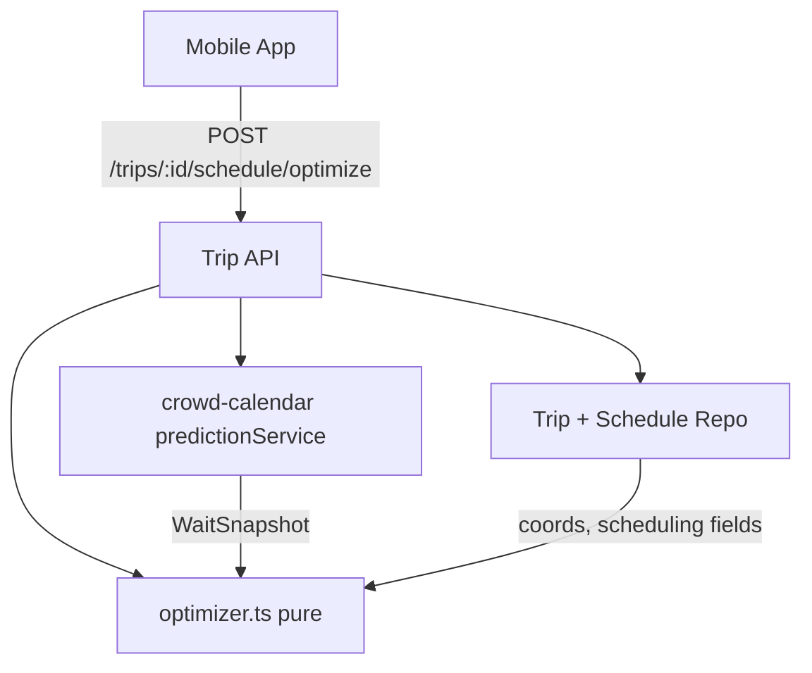

# Design Document

## Overview

The Day Planning feature adds automated touring-plan optimization to Trips. It solves a Time-Dependent Traveling Salesperson Problem (TD-TSP): the cost of visiting an attraction depends on when you arrive, because waits vary through the day.

This feature **depends on the Crowd Calendar and Wait-Time Intelligence feature** (`.kiro/specs/crowd-calendar`) for all wait prediction. It calls that feature's `predictionService.getDaySnapshot(experienceIds, date, park)` once per optimize request to get a prefetched per-experience, per-hour wait snapshot, then runs a pure optimizer over it. Day Planning owns only: the scheduling data model, the optimizer, the schedule/optimize routes, and the mobile timeline UI.

### Key design decisions

1. **Consume, don't reinvent.** The wait model, crowd forecast, sampling, and seeding all live in the crowd-calendar feature. Day Planning imports its `predictionService`; the optimizer receives a `WaitSnapshot` and does no I/O.
2. **Pure optimizer.** `optimizer.ts` is a pure module (greedy construction + or-opt/2-opt local search + seeded random restarts), deterministic and property-testable. Because waits are time-dependent, every move re-simulates downstream arrivals.
3. **Reuse existing services.** Coordinates from `experiences.latitude/longitude`; authorization via `services/trips/permissions.ts`; time zone via `services/trips/wdwClock.ts`. Same-day live correction is handled inside the Prediction_Service, not here.
4. **Lightning Lane as minimal wait.** An `is_lightning_lane` item is modeled with a small return-and-board wait rather than the standby prediction — the biggest real-world accuracy lever for how people actually tour.

## Architecture

### Placement

- **Pure domain:** `services/planning/optimizer.ts` (sequencing/cost) and `services/planning/travel.ts` (Haversine, pace scaling, transit penalty), no I/O.
- **Wiring:** routes in `services/trips/routes.ts`; the Prediction_Service is injected via `composeServices.ts` from the crowd-calendar feature.

## Components and Interfaces

### Pure modules (`services/planning/`)

#### `optimizer.ts`
- `optimize(input: OptimizeInput): OptimizeResult` — greedy seed, then or-opt (relocate one item) and 2-opt (reverse a segment) local search, re-simulating downstream arrivals after each move; a fixed number of seeded random restarts keeps the best. Respects `is_fixed` anchors, `is_lightning_lane` minimal waits, priorities, park hours, the 45-minute transit penalty, and pace-scaled travel.
- **Experience-type handling** (from the `WaitSnapshot`): a show is scheduled to a showtime with its wait = time-to-next-show; a virtual-queue ride is not standby-optimized but flagged for boarding-group signup; a `use_single_rider` item uses the single-rider wait. Each such item is labeled in the result so the timeline can explain it.
- Consumes a prefetched `WaitSnapshot` (from the Prediction_Service) plus coordinates; performs no I/O.

#### `travel.ts`
- `travelMinutes(a, b, pace)` — Haversine × 1.4 path factor, absolute pace scaling (50/80/100 m/min), default intra-park time for null coordinates; `transitPenalty` (45 min) when parks differ.

### Trip_Service endpoints (`services/trips/routes.ts`)

- `POST /trips/:id/schedule/optimize` — Member-gated; body carries the target date; prefetches the `WaitSnapshot` via `predictionService.getDaySnapshot`, runs `optimize`, persists suggested times, returns `TripOptimizationResult`.
- `PATCH /trips/:id/planned-items/:itemId` — Member-gated; updates scheduling fields (`plannedDate`, `plannedTime`, `isFixed`, `isLightningLane`, `itemType`, `priority`, `durationMinutes`).

## Data Models

### Migration `0021_planned_item_ride_options.sql`

- `planned_items`: add `is_lightning_lane BOOLEAN NOT NULL DEFAULT FALSE` and `use_single_rider BOOLEAN NOT NULL DEFAULT FALSE`.

The other scheduling columns (`planned_date`, `planned_time`, `is_fixed`, `priority`, `item_type`, `duration_minutes`) and the `trips` planning settings (`walking_speed`, `early_entry_eligible`) already exist from migration `0019_planned_item_scheduling.sql`, along with `experiences.duration_minutes`. The wait-intelligence tables are owned by the crowd-calendar feature's migration `0020`.

### Shared DTOs (`@dwt/shared`)

- `PlannedItemDTO` / `PlannedItemAddInput`: add `plannedDate`, `plannedTime`, `isFixed`, `isLightningLane`, `useSingleRider`, `priority`, `itemType`, `durationMinutes`.
- `TripOptimizationInput`: `{ date }`.
- `TripOptimizationResult`: `{ items: OptimizedItem[]; totalWaitMinutes; totalWalkMinutes; unfittedItemIds; warnings }`, where `OptimizedItem` carries `plannedItemId`, `suggestedArrival`, `predictedWaitMinutes`, and `travelFromPrev` (`{ kind: 'walk' | 'park_hop'; minutes }`).
- `WaitSnapshot` is imported from the crowd-calendar shared contracts.

## Correctness Properties

### Property 1: Fixed items are never moved
*For any* schedule, every `is_fixed` item in `optimize`'s result keeps its input `planned_time`; no Flexible_Item overlaps a Fixed_Item.

**Validates: Requirements 3.3**

### Property 2: The simulated timeline is monotonic and self-consistent
*For any* result, each item's arrival ≥ previous item's `arrival + wait + duration + travel`, and predicted waits are read from the snapshot at each item's own simulated arrival hour.

**Validates: Requirements 3.1, 3.2**

### Property 3: Optimization is deterministic
*For any* input and fixed restart seed, repeated calls to `optimize` return an identical sequence, arrivals, and totals.

**Validates: Requirements 3.10**

### Property 4: Priority dominates under over-constraint
*For any* over-constrained day, no lower-priority item is fitted at the expense of dropping a higher-priority item that would otherwise fit; dropped items are reported.

**Validates: Requirements 3.8**

### Property 5: Travel cost is symmetric, pace-scaled, and penalizes hops
*For any* two experiences, `travelMinutes` is symmetric, decreases as pace increases, and includes the 45-minute penalty exactly when parks differ.

**Validates: Requirements 3.4, 3.5, 3.6**

### Property 6: Experience types are handled per their kind
*For any* schedule, a show item is placed at one of its showtimes and never given a standby wait; a virtual-queue item is flagged and excluded from standby wait accumulation; and a `use_single_rider` item's wait equals the snapshot's single-rider wait.

**Validates: Requirements 6.2, 6.3, 6.4**

## Error Handling

- **Prediction_Service fallback/failure:** the optimizer uses whatever snapshot is returned (including a model-only fallback for far-future dates) and never fails for want of live data (R1.3).
- **Missing coordinates:** an Experience with null lat/long uses a default intra-park travel time rather than producing `NaN`.
- **Over-constrained day:** items that cannot fit are excluded from the timeline, returned in `unfittedItemIds`, and surfaced as a UI warning (R4.5).
- **Infeasible fixed items:** two Fixed_Items impossible to make in sequence are both kept at their times and the unreachable gap is flagged as a warning rather than silently reordered.

## Testing Strategy

- **Property-based (`fast-check`, ≥100 runs, tagged `Feature: day-planning-optimization, Property N`):** the five properties above, against `optimizer.ts` and `travel.ts` with a stubbed `WaitSnapshot`.
- **Migration test (`migration0021.test.ts`):** the `planned_items.is_lightning_lane` and `use_single_rider` columns apply.
- **Integration (`server.inject`):** optimize and scheduling routes enforce Member auth, persist scheduling fields, reflect the transit penalty and pace scaling, and round-trip `planned_time` through the WDW clock; the optimize route is exercised with a stubbed Prediction_Service.
- **Mobile:** Timeline and TransitGap rendering (walk vs. park hop, all paces), the Schedule Builder toggles, and the unfitted/over-hours warning.

## UI Surfaces & Navigation

- **`TripSchedule`** — a new screen in `TripsStack`, reached from `TripDetail` / `TripPlannedList`. `TripPlannedList` remains the "bucket" of everything the party wants to do; `TripSchedule` is the day-by-day surface that hosts the Schedule Builder (assign date, Fixed/Flexible, fixed times, Lightning Lane, single-rider, breaks, priority) and the "Optimize Day" action with the resulting timeline (arrivals, predicted waits, walk / park-hop gaps, single-rider / show-slot / virtual-queue labels, and over-hours / unfitted-priority warnings). It optionally links to the Crowd Calendar so a user can pick a low-crowd date before optimizing.
- Predicted waits shown here come from the crowd-calendar `predictionService`; this feature renders the result, it does not compute waits.

## Configuration & Constants

Concrete defaults for the optimizer so nothing is invented.

- **Walking speeds (absolute):** `slow` 50, `moderate` 80, `fast` 100 m/min. **Path factor:** 1.4× straight-line Haversine.
- **Missing coordinates fallback:** default intra-park travel `8` min between two same-park items with unknown coords.
- **Transit penalty:** `45` min whenever consecutive items are in different Parks.
- **Early entry:** start `30` min before official open when `early_entry_eligible`.
- **Lightning Lane item wait:** modeled as a fixed `10` min (return + board), not the standby prediction.
- **Default durations (when `duration_minutes` null):** ride `15`, break `60`; a show uses time-to-next-show from its `showtimes`.
- **Limits & budget:** max `20` items per day per request; return within `2` s (excludes the single prefetched `getDaySnapshot` call).
- **Search:** greedy seed → or-opt + 2-opt local search; `50` iterations cap and `5` seeded random restarts (fixed seed `42` for determinism); keep the lowest-cost feasible result.
- **Standard Operating Hours fallback:** inherited from the Prediction_Service (9 AM–9 PM ET) when park hours are unavailable.

No new env vars. No external APIs are called by this feature — predicted waits come in-process from the crowd-calendar `predictionService`.

## Cross-Spec Dependencies & Build Order

Depends on the `crowd-calendar` feature's `predictionService` (`getDaySnapshot`, `crowdMultiplier`) and its `WaitSnapshot` contract — build `crowd-calendar` first. This feature adds only migration `0021` (`is_lightning_lane`, `use_single_rider` on `planned_items`); the intelligence tables belong to `crowd-calendar`'s `0020`. Until `predictionService` exists, the pure `optimizer`/`travel` modules (tasks 2.x) can be built and property-tested against a stubbed `WaitSnapshot`.
