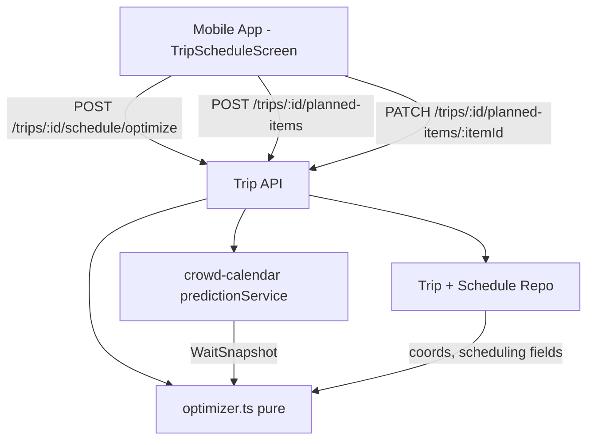

# Design Document

## Overview

The Day Planning feature adds automated touring-plan optimization to Trips. It solves a Time-Dependent Traveling Salesperson Problem (TD-TSP): the cost of visiting an attraction depends on when you arrive, because waits vary through the day.

This feature **depends on the Crowd Calendar and Wait-Time Intelligence feature** (`.kiro/specs/crowd-calendar`) for all wait prediction. It calls that feature's `predictionService.getDaySnapshot(experienceIds: string[], park: string, date: Date)` (arg order: **park before date**) once per optimize request; it returns `Record<string, WaitSnapshot>` (keyed by `experienceId`), a prefetched per-experience, per-hour wait snapshot, over which a pure optimizer then runs. Day Planning owns only: the scheduling data model, the optimizer, the schedule/optimize routes, and the mobile timeline UI.

### Key design decisions

1. **Consume, don't reinvent.** The wait model, crowd forecast, sampling, and seeding all live in the crowd-calendar feature. Day Planning imports its `predictionService`; the optimizer receives a `WaitSnapshot` and does no I/O.
2. **Pure optimizer.** `optimizer.ts` is a pure module (greedy construction + or-opt/2-opt local search + seeded random restarts), deterministic and property-testable. Because waits are time-dependent, every move re-simulates downstream arrivals.
3. **Reuse existing services.** Coordinates from `experiences.latitude/longitude`; authorization via `services/trips/permissions.ts`; time zone via `services/trips/wdwClock.ts`. Same-day live correction is handled inside the Prediction_Service, not here.
4. **Lightning Lane as minimal wait.** An `is_lightning_lane` item is modeled with a small return-and-board wait rather than the standby prediction — the biggest real-world accuracy lever for how people actually tour.
5. **Break & Dining Reservation Modeling (Non-null `experience_id`).** The database schema retains `planned_items.experience_id UUID NOT NULL REFERENCES experiences(id)`. Dining reservations, sit-down meals, and rest breaks link directly to their corresponding catalog experience (e.g. dining locations or venue spots in the catalog). Setting `item_type: 'break'` allows a custom `durationMinutes` (e.g. 45 min) while preserving geographic coordinates (`latitude`/`longitude`) for walking and travel time calculations before and after the break.

## Architecture

### Placement

- **Pure domain:** `services/planning/optimizer.ts` (sequencing/cost) and `services/planning/travel.ts` (Haversine, pace scaling, transit penalty), no I/O.
- **Wiring:** routes in `services/trips/routes.ts`; the Prediction_Service is injected via `composeServices.ts` from the crowd-calendar feature.
- **Mobile UI:** `apps/mobile/src/screens/trips/TripScheduleScreen.tsx` (Date selector bar, inline catalog experience search, persistent itinerary timeline, dining reservation locks, Lightning Lane / Single Rider controls).

## Mobile Schedule UI Architecture (`TripScheduleScreen.tsx`)

1. **Horizontal Date Selector Bar**:
   - Computes array of trip dates (`startDate` to `endDate`).
   - Renders scrollable date pills (e.g., `Thu, Aug 20`, `Fri, Aug 21`, `Sat, Aug 22`).
   - State `selectedDate` determines which day's itinerary and unassigned items are displayed.

2. **Inline Experience Addition (`ExperiencePicker` Modal)**:
   - Action button `+ Add Experience to [Date]` opens modal containing `ExperiencePicker`.
   - On selection: dispatches `POST /trips/:id/planned-items` with `{ experienceId, plannedDate: activeDate }`.
   - On success: invalidates `tripPlannedListKeys.items(tripId)` to update the day's item list in place.

3. **Persistent Itinerary Timeline**:
   - Renders scheduled items chronologically with arrival times formatted via `formatTimeDisplay` (e.g., `1:00 PM`).
   - Displays dynamic walking connectors between items (`+3m walk`, `+5m walk`) computed from `travelFromPrev`.
   - Displays clear visual badges for Fixed Times, Lightning Lanes (⚡), Single Rider (👤), and Dining Reservations.
   - **Persisted vs. un-optimized (R8.2, R8.3):** predicted waits and travel legs come from the freshly-returned `TripOptimizationResult` when the user just optimized this session, otherwise from each item's persisted `predictedWaitMinutes` / `travelFromPrev`. It never fabricates placeholder wait/travel constants. When a day's scheduled items carry a persisted result, the timeline shows a "Last optimized {time}" hint (from the latest `optimizedAt`). When they do not, the wait pill is omitted and a "Not optimized yet — tap Optimize Day" notice is shown so a user is never shown a fake number.
   - Formats raw optimizer warning codes (`infeasible_fixed_gap`, `over_constrained`, `expired_lightning_lane`) and experience notes into clean, human-readable user messages resolving item IDs to experience names.

4. **Item Settings Modal**:
   - Allows users to lock Fixed Times (e.g. 1:00 PM dining reservation), toggle `is_lightning_lane`, pick pass window start times via a Native Time Wheel Picker Dialog (3 wheel columns: Hour 1-12, Minute :00-:45, AM/PM + quick presets), toggle `use_single_rider`, set `priority` (1-3), and specify `durationMinutes` for dining/breaks.
   - Maintains local draft state (`localFormState`) while open so selecting times or toggling options does not auto-close the modal.
   - Dispatches `PATCH /trips/:id/planned-items/:itemId` on explicit user save ("Done").

5. **Schedule Settings Modal**:
   - Accessed via header gear icon `⚙️`.
   - Allows configuring per-date Day Touring Hours (start/end hour preset pills: 7:00 AM – 11:00 PM for the selected date), Early Entry Eligibility toggle, and Walking Pace (`slow`, `moderate`, `fast`).
   - Stores per-date hours (`dayHoursMap[activeDate]`) and passes the active date's custom touring hours (`startHour`, `endHour`) to the optimization engine.

## Components and Interfaces

### Pure modules (`services/planning/`)

#### `optimizer.ts`
- `optimize(input: OptimizeInput): OptimizeResult` — greedy seed, then or-opt (relocate one item) and 2-opt (reverse a segment) local search, re-simulating downstream arrivals after each move; a fixed number of seeded random restarts keeps the best. Respects `is_fixed` anchors, `is_lightning_lane` minimal waits with 1-hour return window flexibility (valid arrival range: `[start - 5m, start + 75m]` incorporating Disney's 5-minute early and 15-minute late grace periods), priorities, park hours, the 45-minute transit penalty, and pace-scaled travel.
- **Experience-type handling** (from the `WaitSnapshot`): a show is scheduled to a showtime with its wait = time-to-next-show; a virtual-queue ride is not standby-optimized but flagged for boarding-group signup; a `use_single_rider` item uses the single-rider wait. Each such item is labeled in the result so the timeline can explain it.
- Consumes a prefetched `WaitSnapshot` (from the Prediction_Service) plus coordinates; performs no I/O.

#### `travel.ts`
- `travelMinutes(a, b, pace)` — Haversine × 1.4 path factor, absolute pace scaling (50/80/100 m/min), default intra-park time for null coordinates; `transitPenalty` (45 min) when parks differ.

### Trip_Service endpoints (`services/trips/routes.ts`)

- `POST /trips/:id/schedule/optimize` — Member-gated; body carries the target date; prefetches the `WaitSnapshot` via `predictionService.getDaySnapshot`, runs `optimize`, persists suggested times, returns `TripOptimizationResult`.
- `PATCH /trips/:id/planned-items/:itemId` — Member-gated; updates scheduling fields (`plannedDate`, `plannedTime`, `isFixed`, `isLightningLane`, `itemType`, `priority`, `durationMinutes`).

## Data Models

### Migration `0022_planned_item_ride_options.sql`

- `planned_items`: add `is_lightning_lane BOOLEAN NOT NULL DEFAULT FALSE` and `use_single_rider BOOLEAN NOT NULL DEFAULT FALSE`.

### Migration `0024_planned_item_optimization_result.sql`

- `planned_items`: add the persisted optimization result columns (all nullable — an item is "not optimized yet" precisely when they are `NULL`):
  - `predicted_wait_minutes INTEGER` — the wait the optimizer read at this item's simulated arrival.
  - `travel_from_prev_minutes INTEGER` — the travel leg from the previous scheduled item (null for the first item of the day).
  - `travel_from_prev_kind TEXT CHECK (travel_from_prev_kind IN ('walk','park_hop'))` — leg type.
  - `optimized_at TIMESTAMPTZ` — when this item was last part of an optimize run.
- These columns are set together by the optimize route's persistence step and cleared together when an item is manually edited (R8.4).

### Migration `0027_planned_items_soft_windows.sql`

- `planned_items`:
  - `ALTER COLUMN experience_id DROP NOT NULL` to allow unlocated standalone breaks.
  - `custom_title TEXT` — title for unlocated breaks.
  - `window_start_minutes INTEGER` — soft time-of-day window start (0..1440).
  - `window_end_minutes INTEGER` — soft time-of-day window end (0..1440).
  - `meal_period TEXT` — display-only label ('breakfast', 'lunch', 'dinner', 'snack').
  - `scheduled_showtime TIMESTAMPTZ` — persisted matched showtime from optimization run.

### Shared DTOs (`@dwt/shared`)

- `PlannedItemDTO`:
  - `experienceId: string | null`
  - `park: Park | null`
  - `category: ExperienceCategory | null`
  - `subType: string | null`
  - `customTitle?: string | null`
  - `windowStartMinutes?: number | null`
  - `windowEndMinutes?: number | null`
  - `mealPeriod?: MealPeriod | null`
  - `scheduledShowtime?: string | null`
  - `predictedWaitMinutes: number | null`
  - `travelFromPrev: { kind: 'walk' | 'park_hop'; minutes: number } | null`
  - `optimizedAt: string | null`
- `plannedItemAddSchema` / `plannedItemEditSchema`:
  - `superRefine` rule: when `experienceId == null`, require `itemType === 'break'` and a non-empty `customTitle`.
  - Window validation: `windowEndMinutes >= windowStartMinutes`.
- `TripOptimizationInput`: `{ date }`.
- `TripOptimizationResult`: `{ items: OptimizedItem[]; totalWaitMinutes; totalWalkMinutes; unfittedItemIds; warnings }`, where `OptimizedItem` carries `plannedItemId`, `suggestedArrival`, `predictedWaitMinutes`, `scheduledShowtime`, and `travelFromPrev`.
- `WaitSnapshot` is imported from the crowd-calendar shared contracts, carrying `showtimesAreTypical?: boolean`.

## Correctness Properties

### Property 1: Fixed items are never moved
*For any* schedule, every `is_fixed` item in `optimize`'s result keeps its input `planned_time`; no Flexible_Item overlaps a Fixed_Item.

**Validates: Requirements 3.3**

### Property 2: The simulated timeline is monotonic and self-consistent
*For any* result, each item's arrival ≥ previous item's `arrival + wait + duration + travel`, and predicted waits are read from the snapshot at each item's own simulated arrival hour.

**Validates: Requirements 3.1, 3.2**

### Property 3: Optimization is deterministic
*For any* input and fixed restart seed, repeated calls to `optimize` return an identical sequence, arrivals, and totals.

**Validates: Requirements 3.10**

### Property 4: Priority dominates under over-constraint
*For any* over-constrained day, no lower-priority item is fitted at the expense of dropping a higher-priority item that would otherwise fit; dropped items are reported.

**Validates: Requirements 3.8**

### Property 5: Travel cost is symmetric, pace-scaled, and penalizes hops
*For any* two experiences, `travelMinutes` is symmetric, decreases as pace increases, and includes the 45-minute penalty exactly when parks differ (treating `null` resort venue as a distinct park value).

**Validates: Requirements 3.4, 3.5, 3.6**

### Property 6: Experience types are handled per their kind
*For any* schedule, a show item is placed at one of its showtimes and never given a standby wait; a virtual-queue item is flagged and excluded from standby wait accumulation; and a `use_single_rider` item's wait equals the snapshot's single-rider wait.

**Validates: Requirements 6.2, 6.3, 6.4**

### Property 7: Extended Evening and After-Hours Schedule Optimization
*For any* date with `useExtendedEvening: true`, the simulated operating window closing time is extended by 120 minutes; *for any* date with `hasAfterHoursTicket: true`, the operating window closing time is extended by 180 minutes and default itinerary start time is set to 16:00 (4:00 PM ET mix-in time). Items scheduled during these extended windows are successfully placed without being dropped.

**Validates: Requirements 7.1, 7.2, 7.3, 7.4**

### Property 8: Optimization results persist and un-optimized items carry no wait
*For any* optimize run, each scheduled item read back from the repo carries the same `predictedWaitMinutes` and `travelFromPrev` the run produced plus a non-null `optimizedAt`; *for any* item that has never been optimized or has been edited since its last optimization, the read-back `predictedWaitMinutes`, `travelFromPrev`, and `optimizedAt` are all `null`.

**Validates: Requirements 8.1, 8.2, 8.3, 8.4**

### Property 9: Rope-drop waits ramp from a walk-on floor and never inflate
*For any* standby/single-rider wait `w` and arrival within the rope-drop window, the modeled wait is ≤ `w` (never raised), ≥ `min(w, 5)` (at least the walk-on floor while `w` exceeds it), equals `min(w, 5)` exactly at open, and is monotonically non-decreasing across arrival times within the window; an arrival at or after the end of the window (`≥ 30 min` past open) uses `w` unchanged.

**Validates: Requirements 3.7, 3.11**

### Property 10: Early-entry availability gates scheduling and anchors the opening ramp
*For any* early-entry-eligible day: an Experience with `operatesDuringEarlyEntry !== true` never has an arrival before official open; an Experience with `operatesDuringEarlyEntry === true` may arrive as early as early-entry open (official open − 30); and each Experience's rope-drop ramp (Property 9) is anchored to its own first-rideable open (early-entry open for early-entry Experiences on such a day, official open otherwise). On a non-early-entry day the flag has no effect (official open is the only open).

**Validates: Requirements 3.11, 3.12**

### Property 11: Late-window availability gates scheduling into the extensions
*For any* day using Extended Evening, an Experience with `operatesDuringExtendedEvening !== true` never completes after base close; *for any* day with an after-hours ticket, an Experience with `operatesDuringTicketedEvent !== true` never completes after base close; and an eligible Experience may complete up to base close plus the extension(s) it qualifies for. On a day with no active extension the flags have no effect.

**Validates: Requirements 3.13**

### Property 12: Soft time windows are respected with graded penalty
*For any* item with `window_start_minutes` and `window_end_minutes` (including meal periods with derived or custom windows, and snack items with custom windows or null windows), arrival before `window_start_minutes` clamps up and charges idle wait; arrival after `window_end_minutes` applies `100 * (arrival - window_end_minutes)` penalty and emits `outside_window:<id>`. An item with null window columns (such as a snack with no custom window) incurs no window clamping or penalty.

**Validates: Requirements 2.7, 2.8, 3.15**

### Property 13: Duration precedence and zero queue wait for non-ride categories
*For any* item, queue wait is `0` for all non-ride categories (dining, resorts, recreation, spas, tours, events, other) and breaks (`item_type = 'break'`). ONLY ride-like categories (`category === 'Ride'` or `'Character_Meet'`) model standby queue wait and `DEFAULT_RIDE_DUR` (15). Duration precedence is strictly: (1) `item.durationMinutes` override if non-null; (2) `DEFAULT_BREAK_DUR` (60) for breaks; (3) `sub_type` defaults (30 Quick / 60 Table / 90 Signature) for dining; (4) `catalogDurationMinutes ?? DEFAULT_SHOW_DURATION_MIN` (30) for shows and parades; (5) `item.catalogDurationMinutes ?? 60` for non-ride catalog categories (Resort, Recreation, Spa, Tour, Event); (6) `DEFAULT_RIDE_DUR` (15) for rides.

**Validates: Requirements 2.4, 3.14, 3.16**

### Property 14: Linkage-based travel chain and travel-neutral unlocated breaks
*For any* sequence of items, travel legs and `prevItem` tracking are strictly keyed on linkage (`experience_id != null`). A located item with a null park (a resort) participates in the travel chain, charging `TRANSIT_PENALTY_MINUTES` (45 min) `park_hop` on arrival from a park and on departure back to a park. For any unlocated break (`experience_id = null`), the break is travel-neutral (skipped in the travel chain, routing travel directly between adjacent located items).

**Validates: Requirements 2.4, 3.4, 3.6**

### Property 15: Showtimes slot with 15-minute buffer and miss penalty
*For any* show item with valid showtimes, arrival is clamped to the doors time (`showtime - 15`), charging `idleGap` for the difference, wait equals 15, and completion is `showtime + duration`. If arrival exceeds the last doors time, a graded penalty (`1000 * (arrival - lastDoors)`) is applied, `scheduledShowtime` is `null`, and `show_missed:<id>` is emitted.

**Validates: Requirements 3.16, 6.2, 8.1**

### Property 16: Timing modes are mutually exclusive
*For any* item edit payload that carries an exact time (`plannedTime` / `isFixed`), soft window columns (`window_start_minutes`, `window_end_minutes`, `meal_period`) are cleared to null; *for any* edit payload that carries a soft window, `planned_time` is cleared to null and `is_fixed` set to false; *for any* edit payload omitting all timing fields, all existing stored timing columns remain unmodified.

**Validates: Requirements 2.2, 2.8**

### Property 17: Custom soft window range clamping
*For any* item with a `meal_period` having a service span defined in `MEAL_SERVICE_WINDOWS`, custom soft window selections are clamped within `[serviceWindow.startMinutes, serviceWindow.endMinutes]`. For items without a bounded meal service span, custom soft window selections are clamped within the active day's touring hours.

**Validates: Requirements 2.9, 4.4**

### Property 18: Same-kind downtime adjacency penalty
*For any* simulated sequence, two consecutive items of the same downtime kind (where kind is `dining` for `category === 'Restaurant'` and `break` for `item_type === 'break'`) incur a flat `SAME_KIND_ADJACENCY_PENALTY = 500` penalty and emit `adjacent_dining:<id>` or `adjacent_break:<id>`, unless BOTH adjacent items are user-pinned (`is_fixed = true`). A break adjacent to a meal incurs no adjacency penalty, and a schedule composed entirely of downtime items is never rejected (soft penalty).

**Validates: Requirements 3.18, 4.6**

## Error Handling

- **Prediction_Service fallback/failure:** the optimizer uses whatever snapshot is returned (including a model-only fallback for far-future dates) and never fails for want of live data (R1.3).
- **Missing coordinates:** an Experience with null lat/long uses a default intra-park travel time rather than producing `NaN`.
- **Over-constrained day:** items that cannot fit are excluded from the timeline, returned in `unfittedItemIds`, and surfaced as a UI warning (R4.5).
- **Infeasible fixed items:** two Fixed_Items impossible to make in sequence are both kept at their times and the unreachable gap is flagged as a warning rather than silently reordered.
- **Early-entry availability (R3.12):** an unknown `operatesDuringEarlyEntry` (never captured) is treated conservatively as not operating during Early Entry, so an un-flagged ride is scheduled from official open rather than being placed in the early-entry window on a guess.

## Testing Strategy

- **Property-based (`fast-check`, ≥100 runs, tagged `Feature: day-planning-optimization, Property N`):** the properties above, against `optimizer.ts` and `travel.ts` with a stubbed `WaitSnapshot`.
- **Migration test (`migration0027.test.ts`):** `planned_items` columns (`custom_title`, `window_start_minutes`, `window_end_minutes`, `meal_period`, `scheduled_showtime`) apply, and `experience_id` is nullable.
- **Migration test (`migration0028.test.ts`):** `chk_planned_items_meal_period` accepts `'snack'` and rejects unknown values.
- **Repo (pg-mem):** `addPlannedItem` and `editPlannedItem` persist and read back soft window columns, `meal_period`, `custom_title`, null `experience_id`, `scheduled_showtime`, and enforce mutual exclusion between exact times and soft windows.
- **Integration (`server.inject`):** optimize route scopes items to `planned_date = date`, leaving other dates untouched.
- **Mobile:** `@testing-library/react-native` tests driving tab switching (Rides, Shows, Dining, Break), break addition, meal period selection, showtime selection, and 3-state timing mode.

## Configuration & Constants

- **Meal Preference Windows (`MEAL_WINDOWS`, minutes from midnight ET):** `breakfast` 480–630 (8:00–10:30 AM), `lunch` 690–840 (11:30 AM–2:00 PM), `dinner` 1020–1200 (5:00–8:00 PM), `snack` has no preset window (valid with null window columns).
- **Meal Service Windows (`MEAL_SERVICE_WINDOWS`, outer bounds of generalized WDW service times):** `breakfast` 420–660 (7:00–11:00 AM), `lunch` 660–930 (11:00 AM–3:30 PM), `dinner` 960–1260 (4:00–9:00 PM), `snack` has no bounded service window (available all day). Note: these are generalizations pending per-restaurant capture from facility documents.
- **Time-of-Day Presets (minutes from midnight ET):** `Morning` 540–720 (9:00 AM–12:00 PM), `Midday` 660–840 (11:00 AM–2:00 PM), `Afternoon` 780–960 (1:00–4:00 PM), `Evening` 1020–1200 (5:00–8:00 PM).
- **Penalties:** `WINDOW_MISS_PENALTY_PER_MIN = 100`, `SHOW_MISS_PENALTY_PER_MIN = 1000`, `SAME_KIND_ADJACENCY_PENALTY = 500`.
- **Show Arrival Buffer:** `SHOW_ARRIVAL_BUFFER_MIN = 15`.
- **Durations:** `DEFAULT_SHOW_DURATION_MIN = 30`, `DEFAULT_RIDE_DUR = 15`, `DEFAULT_BREAK_DUR = 60`.
- **Dining Duration Defaults:** `Quick Service` 30, `Table Service` 60, `Signature Dining` 90, `unknown` 60.
- **Typical Showtime Derivation:** `SHOWTIME_PATTERN_MIN_SAMPLES = 3`, `SHOWTIME_PATTERN_MIN_FREQUENCY = 0.5`, `SHOWTIME_PATTERN_WINDOW_DAYS = 180`.
- **Walking speeds (absolute):** `slow` 50, `moderate` 80, `fast` 100 m/min. **Path factor:** 1.4× straight-line Haversine.
- **Missing coordinates fallback:** default intra-park travel `8` min between two same-park items with unknown coords.
- **Transit penalty:** `45` min whenever consecutive items are in different Parks.
- **Early entry:** start `30` min before official open when `early_entry_eligible`.
- **Rope-drop window:** `ROPE_DROP_WINDOW_MINUTES = 30`, `ROPE_DROP_WALKON_MINS = 5`.
- **Lightning Lane item wait:** modeled as a fixed `10` min (return + board).
- **Limits & budget:** max `20` items per day per request; return within `2` s.
- **Search:** greedy seed → or-opt + 2-opt local search; `50` iterations cap and `5` seeded random restarts (fixed seed `42` for determinism).
