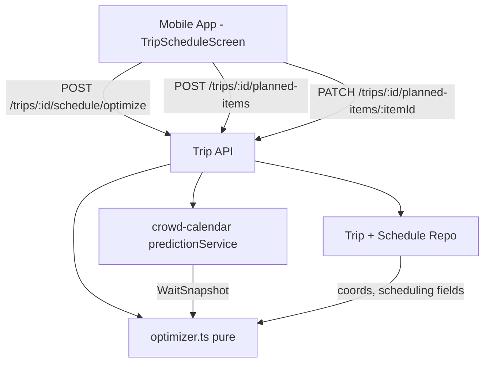

# Design Document

## Overview

The Day Planning feature adds automated touring-plan optimization to Trips. It solves a Time-Dependent Traveling Salesperson Problem (TD-TSP): the cost of visiting an attraction depends on when you arrive, because waits vary through the day.

This feature **depends on the Crowd Calendar and Wait-Time Intelligence feature** (`.kiro/specs/crowd-calendar`) for all wait prediction. It calls that feature's `predictionService.getDaySnapshot(experienceIds: string[], park: string, date: Date)` (arg order: **park before date**) once per optimize request; it returns `Record<string, WaitSnapshot>` (keyed by `experienceId`), a prefetched per-experience, per-hour wait snapshot, over which a pure optimizer then runs. Day Planning owns only: the scheduling data model, the optimizer, the schedule/optimize routes, and the mobile timeline UI.

### Key design decisions

1. **Consume, don't reinvent.** The wait model, crowd forecast, sampling, and seeding all live in the crowd-calendar feature. Day Planning imports its `predictionService`; the optimizer receives a `WaitSnapshot` and does no I/O.
2. **Pure optimizer.** `optimizer.ts` is a pure module (greedy construction + or-opt/2-opt local search + seeded random restarts), deterministic and property-testable. Because waits are time-dependent, every move re-simulates downstream arrivals.
3. **Reuse existing services.** Coordinates from `experiences.latitude/longitude`; authorization via `services/trips/permissions.ts`; time zone via `services/trips/wdwClock.ts`. Same-day live correction is handled inside the Prediction_Service, not here.
4. **Lightning Lane as minimal wait.** An `is_lightning_lane` item is modeled with a small return-and-board wait rather than the standby prediction — the biggest real-world accuracy lever for how people actually tour.
5. **Break & Dining Reservation Modeling (Non-null `experience_id`).** The database schema retains `planned_items.experience_id UUID NOT NULL REFERENCES experiences(id)`. Dining reservations, sit-down meals, and rest breaks link directly to their corresponding catalog experience (e.g. dining locations or venue spots in the catalog). Setting `item_type: 'break'` allows a custom `durationMinutes` (e.g. 45 min) while preserving geographic coordinates (`latitude`/`longitude`) for walking and travel time calculations before and after the break.

## Architecture

### Placement

- **Pure domain:** `services/planning/optimizer.ts` (sequencing/cost) and `services/planning/travel.ts` (Haversine, pace scaling, transit penalty), no I/O.
- **Wiring:** routes in `services/trips/routes.ts`; the Prediction_Service is injected via `composeServices.ts` from the crowd-calendar feature.
- **Mobile UI:** `apps/mobile/src/screens/trips/TripScheduleScreen.tsx` (Date selector bar, inline catalog experience search, persistent itinerary timeline, dining reservation locks, Lightning Lane / Single Rider controls).

## Mobile Schedule UI Architecture (`TripScheduleScreen.tsx`)

1. **Horizontal Date Selector Bar**:
   - Computes array of trip dates (`startDate` to `endDate`).
   - Renders scrollable date pills (e.g., `Thu, Aug 20`, `Fri, Aug 21`, `Sat, Aug 22`).
   - State `selectedDate` determines which day's itinerary and unassigned items are displayed.

2. **Inline Experience Addition (`ExperiencePicker` Modal)**:
   - Action button `+ Add Experience to [Date]` opens modal containing `ExperiencePicker`.
   - On selection: dispatches `POST /trips/:id/planned-items` with `{ experienceId, plannedDate: activeDate }`.
   - On success: invalidates `tripPlannedListKeys.items(tripId)` to update the day's item list in place.

3. **Persistent Itinerary Timeline**:
   - Renders scheduled items chronologically with arrival times formatted via `formatTimeDisplay` (e.g., `1:00 PM`).
   - Displays dynamic walking connectors between items (`+3m walk`, `+5m walk`) computed from `travelFromPrev`.
   - Displays clear visual badges for Fixed Times, Lightning Lanes (⚡), Single Rider (👤), and Dining Reservations.
   - **Persisted vs. un-optimized (R8.2, R8.3):** predicted waits and travel legs come from the freshly-returned `TripOptimizationResult` when the user just optimized this session, otherwise from each item's persisted `predictedWaitMinutes` / `travelFromPrev`. It never fabricates placeholder wait/travel constants. When a day's scheduled items carry a persisted result, the timeline shows a "Last optimized {time}" hint (from the latest `optimizedAt`). When they do not, the wait pill is omitted and a "Not optimized yet — tap Optimize Day" notice is shown so a user is never shown a fake number.
   - Formats raw optimizer warning codes (`infeasible_fixed_gap`, `over_constrained`, `expired_lightning_lane`) and experience notes into clean, human-readable user messages resolving item IDs to experience names.

4. **Item Settings Modal**:
   - Allows users to lock Fixed Times (e.g. 1:00 PM dining reservation), toggle `is_lightning_lane`, pick pass window start times via a Native Time Wheel Picker Dialog (3 wheel columns: Hour 1-12, Minute :00-:45, AM/PM + quick presets), toggle `use_single_rider`, set `priority` (1-3), and specify `durationMinutes` for dining/breaks.
   - Maintains local draft state (`localFormState`) while open so selecting times or toggling options does not auto-close the modal.
   - Dispatches `PATCH /trips/:id/planned-items/:itemId` on explicit user save ("Done").

5. **Schedule Settings Modal**:
   - Accessed via header gear icon `⚙️`.
   - Allows configuring per-date Day Touring Hours (start/end hour preset pills: 7:00 AM – 11:00 PM for the selected date), Early Entry Eligibility toggle, and Walking Pace (`slow`, `moderate`, `fast`).
   - Stores per-date hours (`dayHoursMap[activeDate]`) and passes the active date's custom touring hours (`startHour`, `endHour`) to the optimization engine.

## Components and Interfaces

### Pure modules (`services/planning/`)

#### `optimizer.ts`
- `optimize(input: OptimizeInput): OptimizeResult` — greedy seed, then or-opt (relocate one item) and 2-opt (reverse a segment) local search, re-simulating downstream arrivals after each move; a fixed number of seeded random restarts keeps the best. Respects `is_fixed` anchors, `is_lightning_lane` minimal waits with 1-hour return window flexibility (valid arrival range: `[start - 5m, start + 75m]` incorporating Disney's 5-minute early and 15-minute late grace periods), priorities, park hours, the 45-minute transit penalty, and pace-scaled travel.
- **Experience-type handling** (from the `WaitSnapshot`): a show is scheduled to a showtime with its wait = time-to-next-show; a virtual-queue ride is not standby-optimized but flagged for boarding-group signup; a `use_single_rider` item uses the single-rider wait. Each such item is labeled in the result so the timeline can explain it.
- Consumes a prefetched `WaitSnapshot` (from the Prediction_Service) plus coordinates; performs no I/O.

#### `travel.ts`
- `travelMinutes(a, b, pace)` — Haversine × 1.4 path factor, absolute pace scaling (50/80/100 m/min), default intra-park time for null coordinates; `transitPenalty` (45 min) when parks differ.

### Trip_Service endpoints (`services/trips/routes.ts`)

- `POST /trips/:id/schedule/optimize` — Member-gated; body carries the target date; prefetches the `WaitSnapshot` via `predictionService.getDaySnapshot`, runs `optimize`, persists suggested times, returns `TripOptimizationResult`.
- `PATCH /trips/:id/planned-items/:itemId` — Member-gated; updates scheduling fields (`plannedDate`, `plannedTime`, `isFixed`, `isLightningLane`, `itemType`, `priority`, `durationMinutes`).

## Data Models

### Migration `0022_planned_item_ride_options.sql`

- `planned_items`: add `is_lightning_lane BOOLEAN NOT NULL DEFAULT FALSE` and `use_single_rider BOOLEAN NOT NULL DEFAULT FALSE`.

### Migration `0024_planned_item_optimization_result.sql`

- `planned_items`: add the persisted optimization result columns (all nullable — an item is "not optimized yet" precisely when they are `NULL`):
  - `predicted_wait_minutes INTEGER` — the wait the optimizer read at this item's simulated arrival.
  - `travel_from_prev_minutes INTEGER` — the travel leg from the previous scheduled item (null for the first item of the day).
  - `travel_from_prev_kind TEXT CHECK (travel_from_prev_kind IN ('walk','park_hop'))` — leg type.
  - `optimized_at TIMESTAMPTZ` — when this item was last part of an optimize run.
- **Migration number:** must be `0024` — `0023` (`trip_touring_hours`) is the latest applied migration. Never reuse an applied number.
- These columns are set together by the optimize route's persistence step and cleared together when an item is manually edited (R8.4).

**Migration number:** must be `0022` — `0020` (`wait_time_intelligence`) and `0021` (`crowd_index_source`) are already taken by the crowd-calendar feature and are applied/deployed. Never reuse `0021`. The other scheduling columns (`planned_date`, `planned_time`, `is_fixed`, `priority`, `item_type`, `duration_minutes`) and the `trips` planning settings (`walking_speed`, `early_entry_eligible`) already exist from migration `0019_planned_item_scheduling.sql`, along with `experiences.duration_minutes`.

### Shared DTOs (`@dwt/shared`)

- `PlannedItemDTO` / `PlannedItemAddInput`: add `plannedDate`, `plannedTime`, `isFixed`, `isLightningLane`, `useSingleRider`, `priority`, `itemType`, `durationMinutes`.
- `PlannedItemDTO` (read projection only): add the persisted last-optimization result — `predictedWaitMinutes: number | null`, `travelFromPrev: { kind: 'walk' | 'park_hop'; minutes: number } | null`, and `optimizedAt: string | null` (ISO UTC). These are populated by the optimize run and cleared on manual edit; a `null` `optimizedAt` means the item has not been optimized (R8.1–R8.4). They are not client inputs, so no request-schema change accompanies them.
- `TripOptimizationInput`: `{ date }`.
- `TripOptimizationResult`: `{ items: OptimizedItem[]; totalWaitMinutes; totalWalkMinutes; unfittedItemIds; warnings }`, where `OptimizedItem` carries `plannedItemId`, `suggestedArrival`, `predictedWaitMinutes`, and `travelFromPrev` (`{ kind: 'walk' | 'park_hop'; minutes }`).
- `WaitSnapshot` is imported from the crowd-calendar shared contracts. Its real shape is `{ experienceId, isVirtualQueue: boolean, showtimes?: string[], lightningLane?: { available, priceCents?, returnTime? }, waits: { hour, predictedWaitMinutes, singleRiderWaitMinutes? }[] }`. **What `getDaySnapshot` populates:** `experienceId`, `isVirtualQueue`, `waits[].predictedWaitMinutes` always; `waits[].singleRiderWaitMinutes` for any date (from the single-rider shape); and `showtimes` / `lightningLane` whenever per-date signals exist for that date. Only far-future `showtimes` are inherently unavailable — read that field defensively and fall back to standby when absent (R6.6).

## Correctness Properties

### Property 1: Fixed items are never moved
*For any* schedule, every `is_fixed` item in `optimize`'s result keeps its input `planned_time`; no Flexible_Item overlaps a Fixed_Item.

**Validates: Requirements 3.3**

### Property 2: The simulated timeline is monotonic and self-consistent
*For any* result, each item's arrival ≥ previous item's `arrival + wait + duration + travel`, and predicted waits are read from the snapshot at each item's own simulated arrival hour.

**Validates: Requirements 3.1, 3.2**

### Property 3: Optimization is deterministic
*For any* input and fixed restart seed, repeated calls to `optimize` return an identical sequence, arrivals, and totals.

**Validates: Requirements 3.10**

### Property 4: Priority dominates under over-constraint
*For any* over-constrained day, no lower-priority item is fitted at the expense of dropping a higher-priority item that would otherwise fit; dropped items are reported.

**Validates: Requirements 3.8**

### Property 5: Travel cost is symmetric, pace-scaled, and penalizes hops
*For any* two experiences, `travelMinutes` is symmetric, decreases as pace increases, and includes the 45-minute penalty exactly when parks differ.

**Validates: Requirements 3.4, 3.5, 3.6**

### Property 6: Experience types are handled per their kind
*For any* schedule, a show item is placed at one of its showtimes and never given a standby wait; a virtual-queue item is flagged and excluded from standby wait accumulation; and a `use_single_rider` item's wait equals the snapshot's single-rider wait.

**Validates: Requirements 6.2, 6.3, 6.4**

### Property 7: Extended Evening and After-Hours Schedule Optimization
*For any* date with `useExtendedEvening: true`, the simulated operating window closing time is extended by 120 minutes; *for any* date with `hasAfterHoursTicket: true`, the operating window closing time is extended by 180 minutes and default itinerary start time is set to 16:00 (4:00 PM ET mix-in time). Items scheduled during these extended windows are successfully placed without being dropped.

**Validates: Requirements 7.1, 7.2, 7.3, 7.4**

### Property 8: Optimization results persist and un-optimized items carry no wait
*For any* optimize run, each scheduled item read back from the repo carries the same `predictedWaitMinutes` and `travelFromPrev` the run produced plus a non-null `optimizedAt`; *for any* item that has never been optimized or has been edited since its last optimization, the read-back `predictedWaitMinutes`, `travelFromPrev`, and `optimizedAt` are all `null`.

**Validates: Requirements 8.1, 8.2, 8.3, 8.4**

### Property 9: Rope-drop waits ramp from a walk-on floor and never inflate
*For any* standby/single-rider wait `w` and arrival within the rope-drop window, the modeled wait is ≤ `w` (never raised), ≥ `min(w, 5)` (at least the walk-on floor while `w` exceeds it), equals `min(w, 5)` exactly at open, and is monotonically non-decreasing across arrival times within the window; an arrival at or after the end of the window (`≥ 30 min` past open) uses `w` unchanged.

**Validates: Requirements 3.7, 3.11**

### Property 10: Early-entry availability gates scheduling and anchors the opening ramp
*For any* early-entry-eligible day: an Experience with `operatesDuringEarlyEntry !== true` never has an arrival before official open; an Experience with `operatesDuringEarlyEntry === true` may arrive as early as early-entry open (official open − 30); and each Experience's rope-drop ramp (Property 9) is anchored to its own first-rideable open (early-entry open for early-entry Experiences on such a day, official open otherwise). On a non-early-entry day the flag has no effect (official open is the only open).

**Validates: Requirements 3.11, 3.12**

### Property 11: Late-window availability gates scheduling into the extensions
*For any* day using Extended Evening, an Experience with `operatesDuringExtendedEvening !== true` never completes after base close; *for any* day with an after-hours ticket, an Experience with `operatesDuringTicketedEvent !== true` never completes after base close; and an eligible Experience may complete up to base close plus the extension(s) it qualifies for. On a day with no active extension the flags have no effect.

**Validates: Requirements 3.13**

## Error Handling

- **Prediction_Service fallback/failure:** the optimizer uses whatever snapshot is returned (including a model-only fallback for far-future dates) and never fails for want of live data (R1.3).
- **Missing coordinates:** an Experience with null lat/long uses a default intra-park travel time rather than producing `NaN`.
- **Over-constrained day:** items that cannot fit are excluded from the timeline, returned in `unfittedItemIds`, and surfaced as a UI warning (R4.5).
- **Infeasible fixed items:** two Fixed_Items impossible to make in sequence are both kept at their times and the unreachable gap is flagged as a warning rather than silently reordered.
- **Early-entry availability (R3.12):** an unknown `operatesDuringEarlyEntry` (never captured) is treated conservatively as not operating during Early Entry, so an un-flagged ride is scheduled from official open rather than being placed in the early-entry window on a guess. **Known limitation:** the opening ramp still models a non-early-entry ride at official open as a near-walk-on climb; it does not yet raise that ride's open-time wait to reflect the early-entry crowd surging onto it at official open — that awaits the per-ride opening-curve calibration (thin pre-open sampling data today).

## Testing Strategy

- **Property-based (`fast-check`, ≥100 runs, tagged `Feature: day-planning-optimization, Property N`):** the five properties above, against `optimizer.ts` and `travel.ts` with a stubbed `WaitSnapshot`.
- **Migration test (`migration0022.test.ts`):** the `planned_items.is_lightning_lane` and `use_single_rider` columns apply.
- **Migration test (`migration0024.test.ts`):** the `planned_items` optimization-result columns (`predicted_wait_minutes`, `travel_from_prev_minutes`, `travel_from_prev_kind`, `optimized_at`) apply, are nullable, and enforce the `travel_from_prev_kind` CHECK.
- **Repo (pg-mem):** `updatePlannedItemTimes` persists the optimization result and `listPlannedItems` reads it back (Property 8); a manual `editPlannedItem` clears the persisted result to null (R8.4).
- **Integration (`server.inject`):** optimize and scheduling routes enforce Member auth, persist scheduling fields, reflect the transit penalty and pace scaling, and round-trip `planned_time` through the WDW clock; the optimize route is exercised with a stubbed Prediction_Service. An optimize call followed by `GET /trips/:id/planned-items` returns the persisted `predictedWaitMinutes` / `travelFromPrev` / `optimizedAt` (R8.1, R8.2).
- **Mobile:** Timeline and TransitGap rendering (walk vs. park hop, all paces), the Schedule Builder toggles, and the unfitted/over-hours warning. Returning to an already-optimized day renders the persisted waits and the "Last optimized" hint; a never-optimized day omits the wait pill and shows the "Not optimized yet" notice (R8.2, R8.3).

## UI Surfaces & Navigation

- **`TripSchedule`** — a new screen in `TripsStack`, reached from `TripDetail` / `TripPlannedList`. `TripPlannedList` remains the "bucket" of everything the party wants to do; `TripSchedule` is the day-by-day surface that hosts the Schedule Builder (assign date, Fixed/Flexible, fixed times, Lightning Lane, single-rider, breaks, priority) and the "Optimize Day" action with the resulting timeline (arrivals, predicted waits, walk / park-hop gaps, single-rider / show-slot / virtual-queue labels, and over-hours / unfitted-priority warnings). It optionally links to the Crowd Calendar so a user can pick a low-crowd date before optimizing.
- Predicted waits shown here come from the crowd-calendar `predictionService`; this feature renders the result, it does not compute waits.

## Configuration & Constants

Concrete defaults for the optimizer so nothing is invented.

- **Walking speeds (absolute):** `slow` 50, `moderate` 80, `fast` 100 m/min. **Path factor:** 1.4× straight-line Haversine.
- **Missing coordinates fallback:** default intra-park travel `8` min between two same-park items with unknown coords.
- **Transit penalty:** `45` min whenever consecutive items are in different Parks.
- **Early entry:** start `30` min before official open when `early_entry_eligible`. Only Experiences with `operatesDuringEarlyEntry === true` may be scheduled in that 30-min pre-open window (R3.12); every other Experience (including unknown-flag ones) is clamped to official open. `OptimizeInputItem` carries `operatesDuringEarlyEntry`, `operatesDuringExtendedEvening`, and `operatesDuringTicketedEvent` (each `boolean | null`) sourced from the matching `experiences.operates_during_*` columns; `official open = early_entry_eligible ? startMins + 30 : startMins`. **Per-item close (R3.13):** `base close + (useExtendedEvening && operatesDuringExtendedEvening ? 120 : 0) + (hasAfterHoursTicket && operatesDuringTicketedEvent ? 180 : 0)` — a completion past this is infeasible, so a non-eligible ride cannot be scheduled into an extension.
- **Rope-drop window (R3.7, R3.11):** `ROPE_DROP_WINDOW_MINUTES = 30` from the operating window's effective open (already shifted 30 min earlier under early entry). **Walk-on floor:** `ROPE_DROP_WALKON_MINS = 5`. Within the window a standby/single-rider wait is `round(5 + (rawWait − 5) × (minutesIntoWindow / 30))` when `rawWait > 5`, else `rawWait`; outside the window it is `rawWait` unchanged. Applies only to shape-derived standby/single-rider waits — Lightning Lane (fixed 10), virtual queue (0), and show (time-to-next-show) waits are unaffected.
- **Lightning Lane item wait:** modeled as a fixed `10` min (return + board), not the standby prediction.
- **Default durations (when `duration_minutes` null):** ride `15`, break `60`; a show uses time-to-next-show from its `showtimes`.
- **Limits & budget:** max `20` items per day per request; return within `2` s (excludes the single prefetched `getDaySnapshot` call).
- **Search:** greedy seed → or-opt + 2-opt local search; `50` iterations cap and `5` seeded random restarts (fixed seed `42` for determinism); keep the lowest-cost feasible result.
- **Standard Operating Hours fallback:** inherited from the Prediction_Service (9 AM–9 PM ET) when park hours are unavailable.

No new env vars. No external APIs are called by this feature — predicted waits come in-process from the crowd-calendar `predictionService`.

## Cross-Spec Dependencies & Build Order

Depends on the `crowd-calendar` feature's `predictionService.getDaySnapshot(experienceIds, park, date)` and its `WaitSnapshot` contract — `crowd-calendar` is already built. This feature adds only migration **`0022`** (`is_lightning_lane`, `use_single_rider` on `planned_items`); `0020`/`0021` belong to `crowd-calendar` and are deployed. The pure `optimizer`/`travel` modules (tasks 2.x) build and property-test against a stubbed `WaitSnapshot` independently of the live service.

**Snapshot signals (resolved — full R6 supported):** `getDaySnapshot` now populates the R6 signals (crowd-calendar R9.5): `isVirtualQueue` (R6.3), `waits[].singleRiderWaitMinutes` for any date from the single-rider shape (R6.4), and `showtimes` / `lightningLane` whenever per-date signals exist (R6.2). The only inherent gap is `showtimes` for a **far-future** date (future showtimes aren't known) — the optimizer must therefore still degrade a show with no showtimes to standby (R6.6) and never read an absent field as a wait. No crowd-calendar changes are required before building this feature.

**Pre-existing test to update:** adding scheduling/LL fields to `PlannedItemDTO` (task 1.1) will break `apps/api/src/services/trips/__tests__/plannedCompletionModelConstraints.test.ts`, which asserts `PlannedItemDTO` has exactly its original five fields — widen that one assertion to allow the new scheduling/LL fields (while still forbidding a *completion* field/column/route). The guard's migration-scan half has already been relaxed to allow the shipped `planned_items` scheduling migration (`0019`) while still forbidding a completion column/link, so the suite baseline is green; task 1.1 only owns the `PlannedItemDTO` field assertion.
