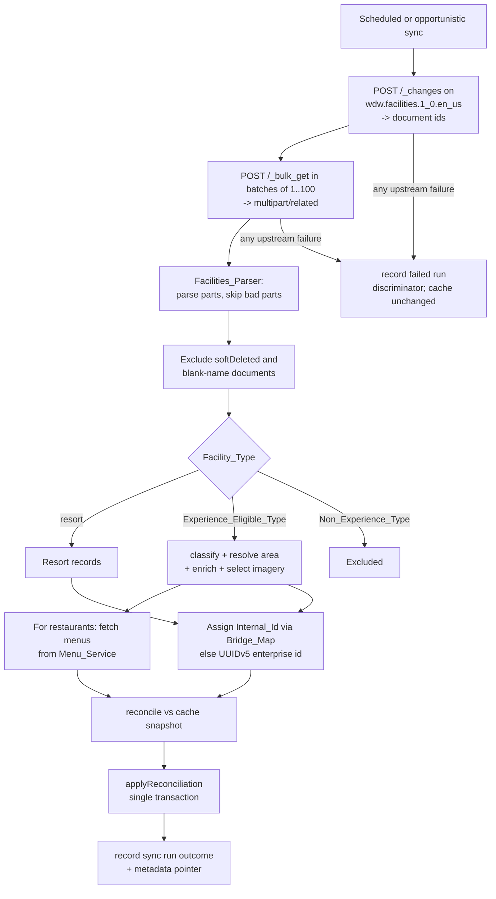
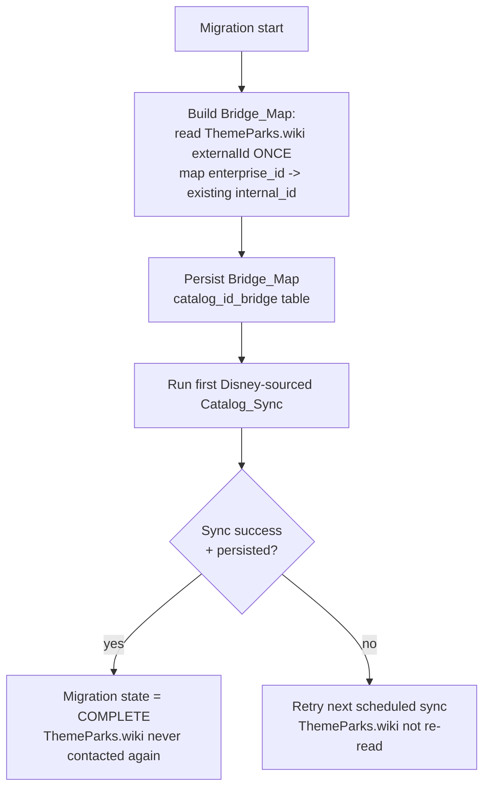

# Design Document

## Overview

This feature replaces ThemeParks.wiki entirely with Disney's own internal data sources as the sole
origin of both catalog and live data for the Disney World Tracker. After the migration completes, no
part of the app reads from ThemeParks.wiki. The Disney sources are the ones the `mousetools` library
uses and that discovery verified live: a Couchbase **Sync Gateway** (`Disney_Sync_Gateway`) for
facilities, status, schedules, forecasts, and dining status, plus a public **dining-menu service**
(`Menu_Service`) reached with an app-level anonymous bearer token.

The migration is deliberately built on top of the patterns already established in `apps/api`, so the
new code reads like the code it replaces:

- A **thin, typed upstream client** (`Facilities_Client`) that surfaces every failure as a single
  discriminated error, mirroring `services/catalog/themeparks.ts` and reusing its `UpstreamError`
  discriminator vocabulary (`http_status | network | invalid_response | aborted`).
- A **resilient parser** (`Facilities_Parser`) for the `multipart/related` body that `POST /_bulk_get`
  returns, which tolerates a single malformed part without failing the whole sync.
- **Pure transformation cores** — classification of the expanded taxonomy, area resolution,
  enrichment extraction, imagery selection, description sanitization, and the live projection —
  modeled on the purity discipline of `services/catalog/classify.ts`, `reconcile.ts`, `sanitize.ts`,
  and `services/live/project.ts`. This is where the bulk of the correctness risk lives and where
  property-based testing pays off.
- The existing **reconcile → transactional apply** cache path (`reconcile.ts` + `repo.applyReconciliation`)
  extended to cover Resorts and the new enrichment fields, preserving the soft-delete / reactivation
  guarantees that keep Completions, Ratings, and Notes valid.
- The existing **opportunistic-read + scheduled-sync** cache-serving path (`readDecision.ts`,
  `scheduler.ts`) extended with a staleness indicator and the Disney failure discriminators.
- The **config loader** boundary (`config.ts`) extended so the Sync Gateway URL and Static
  Credentials are the only place provider details and secrets enter the app.

The two genuinely new capabilities versus the retired source are:

1. **Identity continuity.** Completions, Ratings, and Notes reference the internal Experience id
   (UUIDv5 of an upstream entity id). To avoid orphaning that data, a one-time `Bridge_Map` maps each
   Disney `Enterprise_Id` to the internal id previously derived from the ThemeParks.wiki entity whose
   `externalId` equals that `Enterprise_Id`, so ids remain stable across the source switch.
2. **First-class Resorts, enrichment, imagery, and menus** the old source could not provide:
   hotel/resort records, coordinates, accessibility/price facets, native Disney imagery, and full
   dining menus.

Lightning Lane return windows, paid return windows, boarding groups, and the Individual Lightning
Lane price are **out of scope** (per-guest authenticated / entitlement-based, unreachable with
app-level credentials). Scope is limited to Walt Disney World Resort.

### Scope

- **In scope:** the `Facilities_Client`, `Facilities_Parser`, classification/area/enrichment/imagery
  pure cores, menu retrieval, the Disney-sourced live projection, the Resort catalog concept, the
  identity `Bridge_Map` and one-time migration, reconciliation and cache preservation for both
  Experiences and Resorts, resilience/staleness behavior, config for the Disney sources, and the App's
  area-grouped browsing (`apps/mobile`).
- **Out of scope:** Lightning Lane return windows / paid return windows, boarding groups / virtual
  queue, Individual Lightning Lane price, any Disneyland or non-WDW destination, and any data source
  requiring per-guest authentication.

### Source-of-truth note

The Disney sources are undocumented and reverse-engineered. The verified live response shapes (from
discovery and the `mousetools` reference) are treated as ground truth. All parsing and projection is
**defensive**: a recognized-but-partial document projects whatever it can rather than failing, and
only a wholly unparseable body is treated as an upstream failure.

## Architecture

### System context

```mermaid
flowchart LR
    App[Mobile App] -->|GET /catalog, /resorts, /catalog/:id| CatalogRoute[Catalog routes]
    App -->|GET /catalog/:id/live| LiveRoute[Live route]

    subgraph api [apps/api]
        CatalogRoute --> ReadDecision[readDecision\ncache-serve + staleness]
        CatalogRoute --> Repo[(Postgres cache\nexperiences, resorts,\nexperience_menus,\ncatalog_sync_runs)]
        Sync[Catalog_Sync orchestrator] --> Repo
        Sync --> FClient[Facilities_Client]
        Sync --> FParser[Facilities_Parser]
        Sync --> Classify[classify + area + enrich\n+ imagery pure cores]
        Sync --> MenuClient[Menu_Service client]
        LiveRoute --> LiveSvc[Live_Service]
        LiveSvc --> LiveProject[Disney live projection]
        LiveSvc --> FClient
        Bridge[one-time Bridge_Map build] --> Repo
    end

    FClient -->|POST /_changes, /_bulk_get\nHTTP Basic| SyncGw[Disney_Sync_Gateway]
    MenuClient -->|GET menu\nBearer Public_Token| MenuSvc[Menu_Service]
    Bridge -.one time.->|read externalId| TP[ThemeParks.wiki]
```

### Catalog_Sync flow (Disney sources)



### One-time migration flow



### Module layout (new / changed)

New Disney-source modules live under a `disney/` subfolder of the existing catalog service so the
retired `themeparks.ts` can be removed without disturbing unrelated files:

```
apps/api/src/services/catalog/disney/
  facilitiesClient.ts   Facilities_Client: Sync Gateway (_changes/_bulk_get, HTTP Basic) +
                        Menu_Service (bearer Public_Token + token acquisition). One typed error.
  multipart.ts          Facilities_Parser: parse multipart/related body -> Facility_Document[]
  facilityDoc.ts        Facility_Document raw shapes; Enterprise_Id parse/format; type sets
  classifyFacility.ts   Facility_Type -> Experience_Category + subtype/name sub-classification (pure)
  area.ts               ancestor chain -> Area + Area_Type (ThemePark|WaterPark|DisneySprings|Resort) (pure)
  enrich.ts             coordinates, accessibility facets, price tier, meal periods extraction (pure)
  imagery.ts            detailImageUrl/listImageUrl -> imageUrl selection (pure)
  menu.ts               Menu_Service payload -> Menu DTO projection (pure)
  liveProject.ts        Disney status/dining-status/forecast/schedule docs -> LiveDetail (pure)
  bridge.ts             build + apply Bridge_Map (enterprise_id -> internal_id)
  __tests__/            unit + property tests

apps/api/src/services/catalog/  (changed)
  reconcile.ts          extended: Experience enrichment fields + Resort reconciliation; now also
                        carries image_url through the diff (see behavior change below) (R7, R14.9)
  repo.ts               extended: resorts, experience_menus, enrichment columns, staleness read;
                        applyReconciliation now writes image_url from the diff and no longer
                        persists image_attribution (see behavior change below) (R7, R14.8, R14.9)
  sync.ts               rewired to Disney sources; menu fetch; resort split; bridge id assignment
  routes.ts             extended: /resorts endpoint; area-type filter; staleness in /catalog response
  scheduler.ts          unchanged (24h cadence); runSync body now Disney-sourced

apps/api/src/config.ts   (changed) disney.syncGateway.baseUrl + disney.credentials.{username,password}
apps/api/migrations/     (new) 0004_disney_sources.sql

apps/api/src/scripts/  (removed)
  sourceImages.ts       DELETED: the out-of-band Wikimedia/Wikipedia image-sourcing job, together
                        with its `source-images` npm command in apps/api/package.json (R14.6)
  imageOverrides.json   DELETED: the curated manual image-override file (R14.7)
```

**Behavior change — `image_url` now flows through reconciliation.** In the ThemeParks.wiki design,
`applyReconciliation` deliberately **never touched** `image_url` (nor `image_attribution`): imagery was
owned entirely by the out-of-band `sourceImages.ts` job writing from Wikimedia plus the
`imageOverrides.json` file, so the reconciliation apply left those columns alone to avoid clobbering
the job's writes. With the Disney sources, that job and override file are removed (R14.6, R14.7) and
`image_url` is Disney-provided (Requirement 7). `reconcile` therefore now includes each item's
`image_url` (from `selectImageUrl`, §6) in the diff, and `applyReconciliation` writes it as part of
the same insert/upsert/reactivate path — making Catalog_Sync the **sole writer** of `image_url`
(R14.9). The `image_attribution` column is dropped and no attribution value is persisted, since
Disney-sourced imagery needs no third-party credit (R14.8).
```

Shared package additions (`@dwt/shared`): `AreaType` enum; new `ExperienceCategory` members
(`Tour`, `Recreation`, `Spa`, `Event`); enrichment fields on `ExperienceDTO`; new `ResortDTO`,
`MenuDTO`, `MealPeriodDTO`; and a revised `LiveDetailDTO` that drops the out-of-scope Lightning Lane /
boarding-group fields and adds a dining-availability status.

### Why the shapes stay separated

The Sync Gateway and the Menu Service are two distinct upstreams with different auth (HTTP Basic vs
anonymous bearer) and different failure semantics. A menu failure must **not** fail a catalog run
(R8.4), whereas a Sync Gateway failure **does** fail the run and preserves the prior cache (R12.3,
R12.4). Keeping the menu fetch as a per-restaurant best-effort side call — separate from the
facilities enumeration — is what makes that asymmetry clean.

## Components and Interfaces

### 1. Facilities_Client (`facilitiesClient.ts`)

A config-driven client that talks to both Disney sources and surfaces exactly one typed error, in
the same spirit as `createThemeParksClient`. It reuses the existing `UpstreamError` class and its
discriminator vocabulary so the sync orchestrator continues to catch a single error class.

```ts
export interface FacilitiesClient {
  /** POST /_changes for a channel; returns the child document ids (R2.1, R2.2, R1.6). */
  listChannelDocumentIds(channel: string): Promise<readonly string[]>;

  /**
   * POST /_bulk_get for the given ids, batched 1..100 per request until all ids are
   * requested; returns every fetched Facility_Document (R2.3, R2.4, R2.5, R1.6).
   * An empty id set returns [] and sends no request (R2.4).
   */
  bulkGetDocuments(ids: readonly string[]): Promise<readonly FacilityDocument[]>;

  /** GET a restaurant's menus from the Menu_Service by Enterprise_Id (R8.1). */
  getMenus(enterpriseId: string): Promise<readonly RawMenu[]>;
}
```

Design points:

- **Auth (R1.2, R1.3, R1.4).** Sync Gateway requests carry `Authorization: Basic <base64(user:pass)>`
  built from `Static_Credentials`. Menu Service requests carry `Authorization: Bearer <Public_Token>`.
  When no unexpired `Public_Token` is held, the client first obtains one from Disney's authorization
  service using the anonymous `assertion`/`public` grant, caches it in memory with its expiry, and
  reuses it until it expires.
- **Base URL (R1.5, R13.5).** The Sync Gateway base URL comes from config; when unset the default
  `https://realtime-sync-gw.wdprapps.disney.com/park-platform-pub/` is used. The default is supplied
  by the config loader (R13.5), not hard-coded in this module.
- **Request bodies (R2.1, R2.3).** `_changes` bodies set `style: "all_docs"`,
  `filter: "sync_gateway/bychannel"`, `feed: "normal"`. `_bulk_get` bodies list 1..100 ids with
  `json: true`. Batching is handled by a pure `chunk(ids, 100)` helper so the batch-size invariant is
  property-testable independently of the transport.
- **Single typed error (R1.7–R1.10).** Every failure surfaces as `UpstreamError` with a discriminator
  in `{ http_status, network, invalid_response, aborted }`: a non-2xx status → `http_status` carrying
  the code; a transport failure before any response → `network`; a caller cancellation → `aborted`;
  an unparseable body → `invalid_response` (raised by the parser, see below).

### 2. Facilities_Parser (`multipart.ts`)

`POST /_bulk_get` returns a `multipart/related` body whose parts are individual JSON documents. The
parser splits the body on its MIME boundary and JSON-parses each part.

```ts
export interface ParseResult {
  readonly documents: readonly FacilityDocument[];
}

/** Parse a multipart/related bulk_get body. Throws UpstreamError('invalid_response')
 *  only when the whole body yields no document at all (R3.2). */
export function parseBulkGet(contentType: string, body: string): ParseResult;
```

Rules:

- **Whole-body failure (R3.2).** If the body cannot be parsed into *any* document, the parser raises
  `UpstreamError('invalid_response')`; the orchestrator leaves the upstream entity set unchanged.
- **Per-part resilience (R3.3).** A part that cannot be JSON-parsed into a document is excluded and
  parsing continues with the remaining parts.
- The boundary is read from the `Content-Type` header (`multipart/related; boundary=...`). The parser
  is pure over `(contentType, body)`, which makes the "encode N docs → parse recovers N docs" and the
  "one bad part among good parts" behaviors directly property-testable.

Document-level exclusion (softDeleted, blank name) is **not** done here — it belongs to the sync
orchestrator's normalization step so the parser stays a pure format concern (see §7).

### 3. Facility_Document model and Enterprise_Id (`facilityDoc.ts`)

A tolerant projection of one Disney entity document. Every field except `id`, `name`, and `type` is
optional so a partial document still processes (R3.5, R3.6).

```ts
export interface FacilityDocument {
  readonly id: string;                 // e.g. "80010177;entityType=Attraction"
  readonly name?: string;              // absent/blank -> excluded (R3.7)
  readonly type?: string;              // Facility_Type
  readonly subType?: string;           // Facility_SubType
  readonly description?: string;
  readonly detailImageUrl?: string;
  readonly listImageUrl?: string;
  readonly latitude?: number;
  readonly longitude?: number;
  readonly address?: string;
  readonly phone?: string;
  readonly ancestors?: readonly AncestorRef[];   // ancestor chain for area resolution
  readonly facets?: {
    readonly accessibility?: readonly string[];
    readonly priceRangeDining?: readonly string[];
    readonly interests?: readonly string[];
  };
  readonly mealPeriods?: readonly { readonly type?: string; readonly priceTier?: string }[];
  readonly softDeleted?: boolean;      // tombstone (R3.4)
  readonly lastUpdate?: string;
  readonly channels?: readonly string[];
}

export interface AncestorRef {
  readonly id: string;                 // Enterprise_Id of the ancestor
  readonly type?: string;              // e.g. theme-park, water-park, resort, resort-area, destination
  readonly name?: string;
}

/** Enterprise_Id = "{numericId};entityType={Type}". */
export function parseEnterpriseId(id: string): { numericId: string; entityType: string } | null;
```

The type-set constants — `Experience_Eligible_Type`, `Non_Experience_Type` — are declared here as
readonly sets so classification and property generators share one source of truth.

### 4. Classification (`classifyFacility.ts`) — pure core

Encodes the expanded taxonomy mapping table (R4.1–R4.10). Pure, total, deterministic, modeled on the
existing `classify.ts`.

```ts
/** Map a Facility_Document to an Experience_Category, or null when the type is a
 *  Non_Experience_Type and must be excluded from the Experience set (R4.1). */
export function classifyFacility(doc: FacilityDocument): ExperienceCategory | null;
```

Mapping (R4.2–R4.10):

| Facility_Type | Base category | Sub-classified? |
| --- | --- | --- |
| `attraction` | `Ride` | yes → `Parade` / `Character_Meet` |
| `entertainment` | `Show` | yes → `Parade` / `Character_Meet` |
| `restaurant`, `dinner-show` | `Restaurant` | no |
| `tour`, `audio-tour` | `Tour` | no |
| `recreation`, `recreation-activity` | `Recreation` | no |
| `spa` | `Spa` | no |
| `event`, `dining-event` | `Event` | no |
| any other `Experience_Eligible_Type` | `Other` | no |
| any `Non_Experience_Type` | (excluded → `null`) | — |

Sub-classification signal (R4.9): a non-empty `Facility_SubType` is matched case-insensitively against
parade / character-meet keywords first; when `subType` is absent or empty, the same keyword match runs
against the document `name`. This mirrors the precedence already used in `classify.ts` (structured
signal first, then name fallback).

### 5. Area resolution (`area.ts`) — pure core

Resolves an Experience's owning `Area` and `Area_Type` from its ancestor chain (R4.11–R4.15).

```ts
export type AreaType = 'ThemePark' | 'WaterPark' | 'DisneySprings' | 'Resort';

export interface AreaResolution {
  readonly areaType: AreaType;
  /** Park value when areaType is ThemePark/WaterPark/DisneySprings; else undefined. */
  readonly park?: Park;
  /** Enterprise_Id of the specific resort ancestor when areaType is Resort. */
  readonly resortEnterpriseId?: string;
}

/** Resolve area from the ancestor chain. Always returns a resolution — never excludes
 *  an Experience for area reasons (R4.15 catch-all). */
export function resolveArea(doc: FacilityDocument): AreaResolution;
```

Resolution precedence (R4.12 → R4.15):

1. A theme-park ancestor → `ThemePark` (mapped to the `Park` enum by name); a water-park ancestor →
   `WaterPark`.
2. Else a Disney Springs ancestor → `DisneySprings`.
3. Else a resort ancestor → `Resort`, referencing that resort's `Enterprise_Id` (later resolved to the
   resort's `Internal_Id`).
4. Else a resort-wide catch-all `Area` with `Area_Type = Resort` and no specific resort — so the
   Experience is **never dropped** for lacking a resolvable area (R4.15).

### 6. Enrichment and imagery (`enrich.ts`, `imagery.ts`) — pure cores

```ts
export interface Enrichment {
  readonly latitude: number | null;             // R5.1, R5.2
  readonly longitude: number | null;
  readonly accessibility: readonly string[];     // R5.3 (empty when none)
  readonly priceTier: string | null;             // R5.4 (restaurant priceRangeDining)
  readonly mealPeriods: readonly MealPeriodDTO[]; // R5.5 (restaurant)
}
export function extractEnrichment(doc: FacilityDocument): Enrichment;

/** detailImageUrl wins; else listImageUrl; else null (R7.1–R7.3, R6.5). A field
 *  counts only when non-empty. */
export function selectImageUrl(doc: FacilityDocument): string | null;
```

`extractEnrichment` reads coordinates (null when either is missing, R5.2), the `accessibility` facet
list, and — only for `restaurant` documents — the `priceRangeDining` price tier and the `mealPeriods`
type/price-tier entries. `selectImageUrl` implements the single imagery precedence used for both
Experiences and Resorts.

### 7. Menu retrieval and projection (`menu.ts`)

`Facilities_Client.getMenus(enterpriseId)` fetches raw menus; `projectMenus` converts them to the DTO
shape, persisting per menu the menu type, cuisine type, and each group's name, item names, and item
price strings (R8.2).

```ts
export function projectMenus(raw: readonly RawMenu[]): readonly MenuDTO[];
```

Best-effort semantics (R8.3, R8.4): the orchestrator calls `getMenus` per restaurant; on an empty
result it persists no menu and leaves the restaurant otherwise unchanged; on a failure it catches the
`UpstreamError`, leaves any previously persisted menu untouched, records the failure, and continues
the run (a menu failure never fails the catalog run).

### 8. Live projection (`liveProject.ts`) — pure core

The Disney-sourced replacement for `services/live/project.ts`. It projects the Experience's documents
from the Status, Dining-Status, Forecast, and Schedule channels into a `LiveDetailDTO`, in the Park's
local time zone, and **omits** the out-of-scope Lightning Lane / boarding-group fields (R9.7, R15.4,
R15.5).

```ts
export interface LiveProjectionInput {
  readonly status?: StatusDoc;               // Status_Channel doc
  readonly diningStatus?: DiningStatusDoc;   // Dining_Status_Channel doc (restaurants)
  readonly forecast?: ForecastDoc;           // Forecast_Channel doc
  readonly schedule?: readonly ScheduleDoc[]; // Schedule_Channel current-day docs
}
export function projectLiveDetail(input: LiveProjectionInput, ctx: ProjectionContext): LiveDetailDTO;
```

Rules (R9.2–R9.8): populate `status`, standby `waitMinutes`, `singleRiderWaitMinutes` from the Status
doc; walk-up dining availability (per party-size status + estimated wait) from the Dining-Status doc
for restaurants; `forecast` (per-hour predicted wait + busyness percentage) from the Forecast doc;
`showtimes` and `operatingHours` from the current-day Schedule docs. Any absent or unparseable field
is omitted rather than fabricated, and `status` is always present (`Unknown` when absent, R9.6). All
times render in `WDW_TIME_ZONE` (R9.8), reusing the existing `parkTime.ts` helpers.

### 9. Identity Bridge_Map (`bridge.ts`)

A one-time step that guarantees id continuity (R10, R14.3).

```ts
/** Build the Bridge_Map by reading ThemeParks.wiki externalId ONCE (R14.3).
 *  Maps each enterprise_id (== a TP entity's externalId) to the internal id
 *  previously derived from that TP entity (R10.2). Persists to catalog_id_bridge. */
export function buildBridgeMap(deps: BridgeDeps): Promise<void>;

/** Assign an Internal_Id for a Facility_Document: the bridged id when the
 *  Enterprise_Id is in the Bridge_Map (R10.3), else UUIDv5 of the Enterprise_Id
 *  over INTERNAL_ID_NAMESPACE (R10.1, R10.4). */
export function assignInternalId(enterpriseId: string, bridge: ReadonlyMap<string, string>): string;
```

The existing `internalId(upstreamId)` and `INTERNAL_ID_NAMESPACE` are reused so both Experiences and
Resorts derive ids the same way (R6.6, R10.1). Because a bridged Experience keeps its prior internal
id, all Completions, Ratings, and Notes that reference it remain valid without modification (R10.5).

### 10. Reconciliation (`reconcile.ts`, extended) — pure core

The existing pure `reconcile(currentCache, upstreamSet)` diff is extended to (a) carry the new
enrichment/area fields — including each item's Disney-provided `image_url` from `selectImageUrl`
(§6) — through inserts, upserts, and reactivations, and (b) produce a parallel diff for Resort
records. Previously `image_url` was owned by the retired out-of-band image-sourcing job and was
intentionally excluded from the diff; it now flows through reconciliation, making Catalog_Sync the
sole writer of `image_url` (R7, R14.9). The
soft-delete / reactivation rules are unchanged in spirit and now apply to both Experiences and Resorts
(R6.9, R6.10, R10.6, R11.1–R11.5): a new upstream id inserts active; a reappearing id reactivates with
the same internal id; drift in `name`/`park`/`category` (and, for Resorts, the resort fields) upserts;
an absent-upstream active row soft-deletes while preserving the row and its id. Descriptions are run
through the existing `sanitizeDescription` so all HTML/markup is stripped before persistence (R11.8).

### 11. Persistence (`repo.ts`, extended)

The repo gains Resort, menu, and enrichment persistence and applies all inserts/upserts/soft-deletes
for a run inside a **single transaction** so a partial failure rolls back to the pre-run state
(R11.6, R11.7). `applyReconciliation` now also writes each item's `image_url` from the diff — where
the ThemeParks.wiki design deliberately left `image_url`/`image_attribution` untouched — and the
`image_attribution` column is dropped so no attribution value is persisted (R14.8, R14.9).
New/changed operations:

```ts
export interface CatalogRepo {
  // ...existing...
  getResortSnapshot(): Promise<readonly ResortCacheRow[]>;
  applyReconciliation(diff: CatalogDiff): Promise<void>;   // experiences + resorts + menus, one tx
  listActiveResorts(): Promise<readonly ResortDTO[]>;      // R6.8
  getMenusFor(experienceId: string): Promise<readonly MenuDTO[]>; // R8.5
  getCacheAge(now?: Date): Promise<CacheAgeInfo>;          // now also feeds the staleness indicator
}
```

`listActiveExperiences` is extended with an optional `areaType` filter (R16.3) and returns the
enrichment fields; the DTO exposes coordinates, accessibility, price tier, meal periods, `areaType`,
and (for `Resort` areas) `resortId` — each present only when persisted (R5.6, R5.7).

### 12. Routes (`routes.ts`, extended)

```
GET /catalog                 list active Experiences; filters: parkId, category, areaType, q (R16.3, R16.4)
                             response adds { staleCache, cacheAgeHours } staleness indicator (R12.1)
GET /catalog/:experienceId   Experience detail incl. enrichment + menus (R5.6, R5.7, R8.5)
GET /resorts                 list active Resort DTOs (R6.8, R16.5)
GET /catalog/:experienceId/live   Disney-sourced Live_Detail (R9)
```

The read path continues to use `decideCatalogRead`: a fresh cache serves directly; a stale/failed
upstream with a prior cache serves the cache with the staleness indicator (R12.1, R12.6, R12.7); no
prior cache with an unreachable upstream yields `503 catalog_unavailable` (R12.2).

### 13. Configuration (`config.ts`, extended)

```ts
readonly disney: {
  readonly syncGateway: { readonly baseUrl: string };        // default supplied here (R13.1, R13.5)
  readonly credentials: { readonly username: string; readonly password: string }; // required (R13.2)
};
```

The env schema adds an optional `DISNEY_SYNC_GATEWAY_BASE_URL` (defaulting to the documented URL,
validated as an absolute URL — R13.6) and two required non-empty values
`DISNEY_SYNC_GATEWAY_USERNAME` / `DISNEY_SYNC_GATEWAY_PASSWORD`. A missing/empty credential or a
malformed URL fails `loadConfig()` with a `ConfigError` naming each offending value, halting startup
before the API accepts a request (R13.3, R13.6). No other module reads these from `process.env`
(R13.4).

### 14. App-side browsing (`apps/mobile`)

The catalog screen groups Experiences by `Area_Type` into distinct sections/tabs (`ThemePark`,
`WaterPark`, `DisneySprings`, `Resort`), groups `Resort`-area Experiences under their specific Resort,
offers an `Area_Type` filter and the existing within-area `Experience_Category` filter, and lists every
Resort as a browsable item even when it has no associated Experiences (R16.1–R16.5). A catalog item
with a `null` `imageUrl` renders a category placeholder, or a Resort placeholder for a Resort (R7.5).

## Data Models

### Shared domain model (`@dwt/shared`)

New / changed types (types only, mirroring the existing DTO convention):

```ts
// enums.ts — expanded closed set
export const EXPERIENCE_CATEGORIES = [
  'Ride','Show','Restaurant','Parade','Character_Meet','Tour','Recreation','Spa','Event','Other',
] as const;

export const AREA_TYPES = ['ThemePark','WaterPark','DisneySprings','Resort'] as const;
export type AreaType = (typeof AREA_TYPES)[number];

export interface MealPeriodDTO { readonly type: string; readonly priceTier?: string | null; }

export interface MenuDTO {
  readonly menuType: string;
  readonly cuisineType?: string | null;
  readonly groups: readonly {
    readonly name: string;
    readonly items: readonly { readonly name: string; readonly price?: string | null }[];
  }[];
}

export interface ResortDTO {
  readonly id: string;                    // Internal_Id (UUIDv5 of Enterprise_Id) (R6.6)
  readonly name: string;
  readonly description: string | null;
  readonly imageUrl: string | null;
  readonly latitude: number | null;
  readonly longitude: number | null;
  readonly address: string | null;
  readonly phone: string | null;
}

// ExperienceDTO — enrichment additions
export interface ExperienceDTO {
  readonly id: string;
  readonly name: string;
  readonly park: Park | null;             // null for Resort-area experiences without a park
  readonly category: ExperienceCategory;
  readonly description: string;
  readonly active: boolean;
  readonly imageUrl: string | null;       // now Disney-sourced (R7)
  readonly areaType: AreaType;            // R5.7
  readonly resortId?: string | null;      // Resort's Internal_Id when areaType === 'Resort' (R5.7)
  readonly latitude?: number | null;      // R5.1, R5.2, R5.6
  readonly longitude?: number | null;
  readonly accessibility?: readonly string[];      // R5.3, R5.6
  readonly priceTier?: string | null;              // R5.4, R5.6
  readonly mealPeriods?: readonly MealPeriodDTO[];  // R5.5, R5.6
  readonly menus?: readonly MenuDTO[];             // R8.5 (detail view)
}
```

`LiveDetailDTO` is revised for the Disney source: it keeps `status`, `waitMinutes`,
`singleRiderWaitMinutes`, `forecast` (`{ time, waitMinutes, percentage }`), `showtimes`,
`operatingHours`, and `diningAvailability`, adds a per-entry dining `status` alongside `partySize` and
`estimatedWaitMinutes` (R9.3), and **drops** `returnWindow`, `paidReturnWindow`, and `boardingGroup`
(out of scope, R9.7). `imageAttribution` is removed since native Disney imagery needs no third-party
credit.

### Raw Disney shapes (internal)

`FacilityDocument` / `AncestorRef` (§3) model the Sync Gateway documents. The Status, Dining-Status,
Forecast, and Schedule channel documents and `RawMenu` are modeled the same tolerant way — every field
optional, validated inside the pure projections — so no projection ever throws on a partial payload.

### Persistence (migration `0004_disney_sources.sql`)

```sql
-- experiences: enrichment + area, expanded enums, park now nullable
ALTER TABLE experiences
  ADD COLUMN latitude      DOUBLE PRECISION,
  ADD COLUMN longitude     DOUBLE PRECISION,
  ADD COLUMN area_type     TEXT NOT NULL DEFAULT 'ThemePark',
  ADD COLUMN resort_id     UUID REFERENCES resorts(id),
  ADD COLUMN accessibility TEXT[] NOT NULL DEFAULT '{}',
  ADD COLUMN price_tier    TEXT,
  ADD COLUMN meal_periods  JSONB NOT NULL DEFAULT '[]';
ALTER TABLE experiences ALTER COLUMN park DROP NOT NULL;
ALTER TABLE experiences DROP COLUMN image_attribution;   -- Disney imagery needs no attribution (R14.8)
-- image_url is retained and, post-migration, written solely by Catalog_Sync via reconciliation (R14.9)
-- CHECK on category expanded to include Tour, Recreation, Spa, Event
-- CHECK on area_type IN ('ThemePark','WaterPark','DisneySprings','Resort')

-- resorts: first-class hotel/resort records (R6)
CREATE TABLE resorts (
  id                 UUID PRIMARY KEY,                 -- UUIDv5 of Enterprise_Id (R6.6)
  upstream_entity_id TEXT NOT NULL UNIQUE,             -- Enterprise_Id
  name               TEXT NOT NULL,
  description        TEXT,
  image_url          TEXT,
  latitude           DOUBLE PRECISION,
  longitude          DOUBLE PRECISION,
  address            TEXT,
  phone              TEXT,
  active             BOOLEAN NOT NULL DEFAULT TRUE,     -- soft-delete (R6.9, R6.10)
  updated_at         TIMESTAMPTZ NOT NULL DEFAULT now()
);

-- experience_menus: full dining menus per restaurant (R8)
CREATE TABLE experience_menus (
  experience_id UUID PRIMARY KEY REFERENCES experiences(id),
  menus         JSONB NOT NULL,          -- MenuDTO[] (menu type, cuisine, groups, items, prices)
  updated_at    TIMESTAMPTZ NOT NULL DEFAULT now()
);

-- catalog_id_bridge: one-time enterprise_id -> internal_id continuity map (R10.2)
CREATE TABLE catalog_id_bridge (
  enterprise_id TEXT PRIMARY KEY,
  internal_id   UUID NOT NULL
);

-- catalog_sync_runs: record the run outcome discriminator (R12.5)
ALTER TABLE catalog_sync_runs
  ADD COLUMN outcome TEXT;   -- 'success' | 'http_status' | 'network' | 'invalid_response' | 'aborted'
```

The `resorts` table is created before the `experiences.resort_id` foreign key is added. `menus` is
stored as JSONB because the requirement is to round-trip the full menu structure (type, cuisine,
groups, item names, prices) as a unit, and no relational query over individual menu items is needed.
Meal periods are stored as JSONB on `experiences` for the same reason. All existing tables
(`completions`, `ratings`, `notes`, and their FKs to `experiences.id`) are untouched, which is what
preserves user data across the migration (R10.5, R10.6).

## Correctness Properties

*A property is a characteristic or behavior that should hold true across all valid executions of a
system — essentially, a formal statement about what the system should do. Properties serve as the
bridge between human-readable specifications and machine-verifiable correctness guarantees.*

This feature is a strong fit for property-based testing because the migration's correctness risk
concentrates in pure, deterministic cores over large, structured input spaces: the batch chunker, the
`multipart/related` parser, the taxonomy classifier, the area resolver, the enrichment/imagery
extractors, the id-derivation and bridge logic, the reconciliation diff, the description sanitizer,
the menu projection, and the Disney live projection. The properties below are the consolidated set
produced after the prework reflection — redundant per-criterion properties (e.g. the individual
`Facility_Type → category` arms, the individual imagery/enrichment field arms, and the separate
Experience-vs-Resort reconciliation arms) have been merged into single comprehensive properties.
Purely presentational or infrastructural criteria (UI grouping, DB transaction atomicity/durability,
config-schema presence, one-time sequencing) are covered by example, component, integration, and
smoke tests in the Testing Strategy rather than by properties.

### Property 1: Bulk-get batching partitions the id set without loss

*For any* set of document ids, the client's `_bulk_get` batching produces batches each containing
between 1 and 100 ids whose concatenation equals the input ids exactly (no id dropped, added, or
duplicated); and an empty id set produces no batch and no request.

**Validates: Requirements 2.3, 2.4**

### Property 2: Document retrieval returns the full set untouched

*For any* enumerated id set and corresponding fetched documents, the client returns every enumerated
id and every fetched document without applying business classification, filtering, or deduplication.

**Validates: Requirements 2.5**

### Property 3: Multipart parsing recovers every well-formed part and drops only the malformed ones

*For any* list of documents encoded as a `multipart/related` body, parsing recovers exactly those
documents; and *for any* body in which an arbitrary subset of parts is corrupted, parsing returns
exactly the well-formed parts and excludes the corrupted ones while continuing.

**Validates: Requirements 3.1, 3.3**

### Property 4: Normalization excludes tombstones and blank-name documents

*For any* set of Facility_Documents, the normalized upstream entity set contains no document whose
`softDeleted` is `true` and no document whose `name` is absent or consists only of whitespace, and
retains every other document.

**Validates: Requirements 3.4, 3.7**

### Property 5: Classification is a total mapping over the type space with correct sub-classification

*For any* Facility_Document, `classifyFacility` returns a category if and only if the document's
`Facility_Type` is an `Experience_Eligible_Type` (every `Non_Experience_Type` is excluded); the
category follows the mapping table (`attraction`→`Ride`, `entertainment`→`Show`,
`restaurant`/`dinner-show`→`Restaurant`, `tour`/`audio-tour`→`Tour`,
`recreation`/`recreation-activity`→`Recreation`, `spa`→`Spa`, `event`/`dining-event`→`Event`, any
other eligible type→`Other`); and for `attraction`/`entertainment` the result is `Parade` or
`Character_Meet` exactly when the case-insensitive keyword match succeeds on a non-empty
`Facility_SubType`, or, when `subType` is absent/empty, on the `name`.

**Validates: Requirements 4.1, 4.2, 4.3, 4.4, 4.5, 4.6, 4.7, 4.8, 4.9, 4.10**

### Property 6: Area resolution is total and follows the ancestor precedence

*For any* Experience Facility_Document, `resolveArea` always returns a resolution (an Experience is
never dropped for lacking a resolvable area); the `Area_Type` is `ThemePark` or `WaterPark` when a
theme-park/water-park ancestor exists, otherwise `DisneySprings` when a Disney Springs ancestor
exists, otherwise `Resort` referencing the resort ancestor's `Enterprise_Id` when a resort ancestor
exists, otherwise the resort-wide catch-all with `Area_Type = Resort`.

**Validates: Requirements 4.11, 4.12, 4.13, 4.14, 4.15**

### Property 7: Enrichment extraction maps present fields and nulls absent ones

*For any* Facility_Document, the extracted enrichment carries `latitude`/`longitude` from the
document when both are present and `null` for whichever is absent; carries the `accessibility` facet
tags when present (empty otherwise); and, only for `restaurant` documents, carries the
`priceRangeDining` price tier and the `mealPeriods` type/price-tier entries when present.

**Validates: Requirements 5.1, 5.2, 5.3, 5.4, 5.5**

### Property 8: Imagery selection prefers detail then list then null

*For any* Facility_Document, the selected `imageUrl` is the `detailImageUrl` when it is non-empty,
otherwise the `listImageUrl` when it is non-empty, otherwise `null`.

**Validates: Requirements 6.5, 7.1, 7.2, 7.3**

### Property 9: The Experience and Resort DTOs expose exactly the persisted fields

*For any* persisted Experience, its DTO carries `areaType` always, carries `resortId` exactly when
the area type is `Resort`, and carries each enrichment field (coordinates, accessibility, price tier,
meal periods, menus) exactly when that field is persisted; and *for any* set of Resort records, the
resorts endpoint exposes exactly the active (non-soft-deleted) records, each with `id`, `name`,
`description`, `imageUrl`, `latitude`, `longitude`, `address`, and `phone`.

**Validates: Requirements 5.6, 5.7, 6.8**

### Property 10: Resort production has one record per resort document and excludes resort-area

*For any* set of Facility_Documents, exactly one Resort record is produced per retained document of
`Facility_Type` `resort`, no Resort record is produced for a `resort-area` document, and each Resort
record copies `name`/`description`/`imageUrl`/`latitude`/`longitude`/`address`/`phone` from its
document with `null` substituted for each absent optional field.

**Validates: Requirements 6.1, 6.2, 6.3, 6.4**

### Property 11: Internal ids are a deterministic one-to-one derivation, bridged for continuity

*For any* `Enterprise_Id`, its `Internal_Id` is the deterministic UUIDv5 over the fixed namespace
(equal inputs yield equal ids, distinct inputs yield distinct ids), used for both Experiences and
Resorts; and *for any* id-assignment, the assigned id is the bridged id when the `Enterprise_Id`
appears in the `Bridge_Map` (the previously derived internal id) and the freshly derived UUIDv5
otherwise — so a bridged item keeps the exact id its Completions, Ratings, and Notes already
reference.

**Validates: Requirements 6.6, 10.1, 10.2, 10.3, 10.4, 10.5**

### Property 12: The Bridge_Map maps each Enterprise_Id to the prior ThemeParks-derived id

*For any* set of ThemeParks.wiki entities carrying an `externalId`, the built `Bridge_Map` contains,
for each entity, an entry mapping that entity's `externalId` (the `Enterprise_Id`) to the internal id
previously derived from that ThemeParks.wiki entity.

**Validates: Requirements 10.2**

### Property 13: Reconciliation diff rules hold for both Experiences and Resorts

*For any* cache snapshot and upstream set (of Experiences or Resorts), `reconcile` emits: an active
insert for each upstream id absent from the cache; a reactivation preserving the same internal id for
each upstream id present as a soft-deleted row; an upsert to upstream values for each active row whose
`name`/`park`/`category` (or, for Resorts, resort fields) differ; no change for each active row that
already equals upstream; and a soft-delete preserving the row and its internal id for each active
cached row absent from upstream.

**Validates: Requirements 6.9, 6.10, 10.6, 11.1, 11.2, 11.3, 11.4, 11.5**

### Property 14: Persisted descriptions are plain text

*For any* upstream description, the persisted description contains no HTML or markup tags.

**Validates: Requirements 11.8**

### Property 15: Menu persistence round-trips the full menu structure

*For any* set of menus returned by the Menu_Service, projecting, persisting, and reading them back
yields the same per-menu type and cuisine type and, per group, the same group name, item names, and
item price strings that the App receives through the menu DTO; and when no menus are returned, no menu
is persisted.

**Validates: Requirements 8.2, 8.3, 8.5**

### Property 16: A menu failure is isolated from the catalog run

*For any* menu retrieval failure, any previously persisted menu for that restaurant is left unchanged,
the failure is recorded, and the overall catalog run is not failed by it.

**Validates: Requirements 8.4**

### Property 17: The client raises exactly one typed error whose discriminator is in the closed set

*For any* Disney-source request failure, the client raises exactly one typed error whose discriminator
is one of `http_status`, `network`, `invalid_response`, or `aborted`; and when the failure is a status
outside 200–299 the discriminator is `http_status` and carries that exact status code.

**Validates: Requirements 1.7, 1.8**

### Property 18: The Public_Token is obtained exactly when none unexpired is held

*For any* token state (absent, expired, or valid at the request instant), the client obtains a new
Public_Token before calling the Menu_Service if and only if no unexpired token is held, and the Menu
request carries an unexpired token.

**Validates: Requirements 1.4**

### Property 19: The live projection carries present valid fields, defaults status, and excludes out-of-scope data

*For any* combination of Status, Dining-Status, Forecast, and Schedule documents, the projected
`Live_Detail` carries `status` always (`Unknown` when absent or unrecognized), carries standby
`waitMinutes`/`singleRiderWaitMinutes`, per-hour `forecast` (predicted wait + busyness percentage),
current-day `showtimes`/`operatingHours`, and per-party-size walk-up dining availability (status +
estimated wait) exactly when present and valid — never fabricating an absent field — with every time
expressed in the Park's local time zone, and never includes Lightning Lane return windows, paid
return windows, boarding-group/virtual-queue information, or the Individual Lightning Lane price.

**Validates: Requirements 9.2, 9.3, 9.4, 9.5, 9.6, 9.7, 9.8, 15.4, 15.5, 15.6**

### Property 20: Catalog reads serve from cache, refresh past 24h, and preserve the cache on failure

*For any* cache age and upstream outcome: a read with a cache age at most 24 hours serves from the
Catalog_Cache without refreshing; a read with a cache age strictly over 24 hours triggers a refresh; a
failed refresh (or any failed sync run) with a prior cache serves the cached catalog with a staleness
indicator conveying served-from-cache and the cache's age and leaves the cache unchanged with the run
recorded as failed; and a failure with no prior cache yields `503 catalog_unavailable`.

**Validates: Requirements 12.1, 12.2, 12.4, 12.7, 12.9**

### Property 21: Every sync run records an outcome discriminator from the closed set

*For any* Catalog_Sync run, the recorded outcome discriminator is exactly one of `success`,
`http_status`, `network`, `invalid_response`, or `aborted`, matching the run's result.

**Validates: Requirements 12.5**

### Property 22: Config validation halts startup and names every offending value

*For any* combination of missing/empty Static_Credentials and/or a malformed Sync Gateway URL,
`loadConfig()` throws before the API accepts a request, and the error names each missing credential
value and identifies any malformed URL value; a valid configuration loads, supplying the default base
URL when none is configured.

**Validates: Requirements 13.3, 13.6, 13.5**

### Property 23: Catalog filtering returns only items matching the requested facets

*For any* set of active Experiences and any combination of `areaType` and `Experience_Category`
filters, every returned Experience matches all supplied filters.

**Validates: Requirements 16.3, 16.4**

### Property 24: Catalog_Sync is the sole writer of image_url, sourced from Disney via reconciliation

*For any* upstream Facility_Document set and cache snapshot, after reconciliation the persisted
`image_url` of every catalog item (Experience or Resort) equals `selectImageUrl` of its document — the
non-empty `detailImageUrl`, else the non-empty `listImageUrl`, else `null` — set only through the
`reconcile` → `applyReconciliation` path and by no other writer, and no `image_attribution` value is
persisted.

**Validates: Requirements 7.1, 7.2, 7.3, 7.4, 14.8, 14.9**

## Error Handling

The feature reuses the existing uniform error envelope, the `AppError` mechanism, and the
`UpstreamError` discriminated-failure type; no new error-handling infrastructure is introduced.

### Upstream failures inside the sync (Sync Gateway)

Every Sync Gateway failure surfaces as a single `UpstreamError`
(`http_status | network | invalid_response | aborted`). The sync orchestrator catches this single
class, records the run as `failed` with the matching outcome discriminator (R12.5), and leaves the
prior Catalog_Cache unchanged (R12.3, R12.4). Because `applyReconciliation` writes inside one
transaction, an applied diff is durable and an un-applied diff is rolled back, so the cache is never
left partially updated (R11.6, R11.7). A wholly unparseable `_bulk_get` body is surfaced as
`invalid_response` and leaves the upstream entity set unchanged (R3.2); a single malformed part is
dropped and the run proceeds (R3.3).

| Condition | Prior cache | Behavior |
| --- | --- | --- |
| Non-2xx / network / unparseable / aborted / 10s timeout during a read-triggered sync | yes | Serve cached catalog with staleness indicator (served-from-cache + age); run recorded `failed`; cache unchanged (R12.1, R12.4, R12.7) |
| Same conditions | no | `503 catalog_unavailable`; cache unchanged (R12.2) |
| Sync Gateway rejects Static_Credentials (401/403) | any | Run recorded `failed`; prior cache unchanged (R12.3) |

### Menu failures (Menu_Service)

A menu failure is caught per restaurant and never propagated to the run: any previously persisted menu
is left unchanged, the failure is recorded, and the run continues and can still succeed (R8.4). An
empty menu result persists no menu and leaves the restaurant otherwise unchanged (R8.3).

### Live failures

Live retrieval reuses the existing `Live_Service` stale-serve fallback: a failed live fetch surfaces
as a stale or unavailable live result and never affects the Catalog_Cache (R12.10). The projection
never throws — every absent/unrecognized/out-of-range value maps to the documented absent/`Unknown`
representation (R9.6).

### Configuration failures

Missing/empty Static_Credentials or a malformed Sync Gateway URL cause `loadConfig()` to throw a
`ConfigError` that names each offending value, halting startup before the API accepts any request
(R13.3, R13.6). The default base URL is supplied by the loader when none is configured (R13.5).

### Retirement invariants

Once the migration state is complete, no code path issues a request to ThemeParks.wiki for catalog or
live data (R14.2, R14.4); the only ThemeParks.wiki read ever performed is the one-time `externalId`
read during the `Bridge_Map` build (R14.3). When the Disney sources are unavailable while complete,
the API serves the existing cache marked stale rather than falling back to ThemeParks.wiki (R14.4).

Once complete, the out-of-band image pipeline no longer exists: the Wikimedia/Wikipedia
image-sourcing job (`scripts/sourceImages.ts` and its `source-images` command) and the curated
`scripts/imageOverrides.json` override file are deleted from the codebase (R14.6, R14.7), the
`image_attribution` column is dropped and no attribution value is persisted (R14.8), and Catalog_Sync
is the **sole writer** of each catalog item's `image_url`, populated only through reconciliation from
the Disney-provided imagery (`selectImageUrl`, Requirement 7) (R7, R14.9). No remaining path reads
catalog imagery from the retired job, the override file, or object storage (R7.4).

## Testing Strategy

Property-based testing **is** appropriate for the pure cores listed above; the presentational,
infrastructural, and one-time-sequencing criteria are covered by example, component, integration, and
smoke tests. Unit tests are kept deliberately small since the properties carry the input-space
coverage.

### Tooling

- **Runner:** `vitest` (`npm test` runs `vitest --run`).
- **Property library:** `fast-check` (already a dev dependency), used as in the existing
  `*.prop.test.ts` suites (e.g. `services/aggregate/__tests__/aggregate.prop.test.ts`,
  `services/live/__tests__/project.prop.test.ts`).
- **App-side:** the mobile package's existing `vitest`/Testing Library setup for component tests.

### Property tests (one per correctness property)

Each of Properties 1–24 is implemented as a **single** property-based test running a **minimum of
100 iterations**, tagged with a comment referencing the design property in the established format:

```
// Feature: disney-facilities-catalog-source, Property {n}: {property text}
```

Target locations:

- **Properties 1, 2, 17, 18** (client / batching / typed error / token) →
  `services/catalog/disney/__tests__/facilitiesClient.prop.test.ts`, with a fake `fetch` that can be
  driven to any status/transport/abort outcome and a controllable clock for token expiry.
- **Properties 3, 4** (multipart parse + normalization) → `disney/__tests__/multipart.prop.test.ts`,
  with a generator that encodes document lists to `multipart/related` and independently corrupts a
  subset of parts.
- **Properties 5, 6** (classification, area) → `disney/__tests__/classifyFacility.prop.test.ts` and
  `area.prop.test.ts`, iterating the full type space and generated ancestor chains.
- **Properties 7, 8** (enrichment, imagery) → `disney/__tests__/enrich.prop.test.ts`,
  `imagery.prop.test.ts`, with each optional field independently present/absent/empty.
- **Properties 9, 10, 13, 14** (DTO exposure, resort production, reconciliation, sanitization) →
  `services/catalog/__tests__/reconcile.prop.test.ts` and `repo`/DTO projection prop tests, extending
  the existing reconcile property suite to the resort and enrichment arms.
- **Property 24** (image_url sole-sourced via reconciliation) →
  `services/catalog/__tests__/reconcile.prop.test.ts`, generating upstream document sets (with
  detail/list image fields independently present/absent/empty) and cache snapshots, running
  reconcile → applyReconciliation, and asserting each persisted `image_url` equals `selectImageUrl` of
  its document and is written only through that path.
- **Properties 11, 12** (id derivation, bridge) → `disney/__tests__/bridge.prop.test.ts`, reusing the
  existing `internalId` determinism/one-to-one generators.
- **Properties 15, 16** (menu round-trip, failure isolation) → `disney/__tests__/menu.prop.test.ts`,
  with a generator for raw menu structures and a fake menu client driven to fail.
- **Property 19** (live projection) → `disney/__tests__/liveProject.prop.test.ts`, with generators
  for Status/Dining-Status/Forecast/Schedule documents including partial and out-of-range values.
- **Properties 20, 21** (read decision, run outcome) → `services/catalog/__tests__/readDecision.prop.test.ts`
  and `sync.prop.test.ts`, with generated cache ages straddling 24h and generated failure modes.
- **Property 22** (config validation) → `apps/api/src/__tests__/config.disney.prop.test.ts`, with
  generated missing/empty-credential combinations and malformed URLs.
- **Property 23** (catalog filtering) → `services/catalog/__tests__/routes.prop.test.ts` (or repo
  filter prop test), generating rows and filter combinations.

### Example and edge-case unit tests

- **Client request shape (R1.1, R1.2, R1.3, R1.5, R1.6, R1.9, R1.10, R2.1, R2.2):** spy `fetch`;
  assert the Basic/Bearer headers, the `_changes` body fields, the WDW facilities channel, the two
  operations, and the `network`/`aborted` mappings.
- **Partial / minimal documents (R3.5, R3.6):** generators/examples with each optional field omitted
  and with only `id`/`name`/`type`; assert no throw and correct processing.
- **Menu wiring (R8.1):** spy the menu client; assert it is called with the restaurant `Enterprise_Id`.
- **Live wiring (R9.1):** assert the live fetch is keyed by `Enterprise_Id`.
- **Scope wiring (R15.1, R15.2, R15.3, R15.6):** assert only the WDW facilities channel is enumerated,
  no other facilities channel is requested, no per-guest credentials are ever sent, and the ILL price
  never appears in the catalog or Live_Detail.
- **Config presence (R13.1, R13.2, R13.4):** assert optional base URL and required credentials are
  accepted and that no module outside `config.ts` reads the Disney env vars.
- **App rendering (R5.7, R7.5, R16.1, R16.2, R16.5):** component tests assert area-type sections,
  resort grouping, the category/resort image placeholders for `null` `imageUrl`, and that a Resort
  with no Experiences is still listed.

### Integration tests

- **Transactional apply (R11.6, R11.7):** inject a failing statement mid-apply against a sandbox
  database; assert the cache is byte-for-byte its pre-run state and that a single `BEGIN`/`COMMIT`
  wraps the apply.
- **Resort durability (R6.7):** insert a Resort, re-read through a fresh repo; assert it persists
  across "restarts" and subsequent syncs.
- **Identity continuity (R10.5, R10.6):** seed Completions/Ratings/Notes against a prior internal id;
  run the bridge + a Disney sync; assert the referencing rows are retained unchanged and that a
  soft-deleted Experience preserves its row and references.
- **End-to-end sync/read smoke (R12.6, R14.1):** run a full Disney-sourced sync against stubbed Sync
  Gateway / Menu_Service fetches through `buildServer`; assert catalog, resorts, menus, imagery, and
  live all source from Disney and reads serve from cache.

### Smoke tests

- **Schedule cadence (R12.8):** assert the scheduler interval is at most 24 hours.
- **Image pipeline retirement (R14.6, R14.7, R14.8):** assert `apps/api/src/scripts/sourceImages.ts`
  and `apps/api/src/scripts/imageOverrides.json` are absent, that `apps/api/package.json` has no
  `source-images` command, that migration `0004` leaves the `experiences` table with no
  `image_attribution` column, and that neither the `ExperienceDTO` nor the `LiveDetailDTO` surfaces an
  attribution field.
- **Migration completeness (R14.5):** assert the completeness predicate flips only after the
  `Bridge_Map` is built and at least one Disney-only sync has succeeded and persisted; and that once
  complete, no ThemeParks.wiki request is issued (R14.2, R14.3, R14.4).
