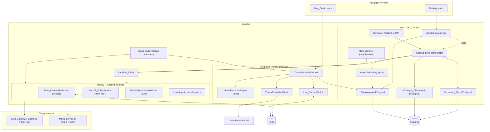

# Design Document

## Overview

This feature re-architects data sourcing for the Disney World Tracker along a
**data-by-change-rate** principle and hardens every Disney access path. It is a
refactor and extension of the shipped `disney-facilities-catalog-source`
implementation, not a green-field build. The guiding split:

- **Static_Catalog_Data** (descriptive fields, resorts, imagery, menus,
  coordinates, facets, area/park hierarchy) — low change rate, staleness
  tolerant, and available *only* from Disney — continues to be sourced from the
  `Disney_Sync_Gateway` and the `Menu_Service`, now behind a hardened,
  incremental, infrequently-run `Catalog_Sync`.
- **Live_Data** (status, waits, single-rider minutes, forecast, showtimes,
  operating hours, walk-up dining, Lightning Lane coarse state, boarding
  groups) — high change rate, stable, third-party-maintained — moves back to
  `ThemeParks_Wiki`, un-retiring it for the live path only.

Four architectural pillars deliver the requirements:

1. **`Disney_Transport`** — a single shared component through which *every*
   Disney request passes. It owns the `Rate_Limiter` (Redis-backed shared
   budget + in-process fallback), the `Backoff_Policy` (bounded exponential
   backoff with jitter and `Retry-After` handling), `WAF_Block` vs
   `Auth_Failure` classification, and the required `User-Agent` headers. Both
   existing Disney clients (`Facilities_Client`, and any residual Disney
   client) funnel through it (Requirements 1–5).

2. **Incremental replication** — a persisted `Changes_Checkpoint` plus a durable
   local `Document_Store` turn `Catalog_Sync` into a `Bootstrap_Sync` (first
   run) then routine `Delta_Sync`s that fetch only changed documents, paced
   inside the `Request_Budget` (Requirements 6, 7). Menus are fetched
   lazily/throttled rather than all-at-once (Requirement 8), and the sync runs
   on an infrequent (default ≥24h) cadence (Requirement 9).

3. **Live path on ThemeParks.wiki** — a `Live_Service` that derives
   `Live_Detail` from `ThemeParks_Wiki`, joined to catalog Experiences by
   `Enterprise_Id` ↔ `External_Id`, and never touches a Disney source
   (Requirements 10, 11).

4. **Graceful degradation + visibility** — a Disney block or credential
   rotation degrades only to slightly-stale static data while the live path
   stays fully functional; `Sync_Run_History` records `waf_block`,
   `auth_failure`, and other outcomes distinctly (Requirement 12). Startup fails
   loudly on missing credentials or malformed URLs (Requirement 14).

Requirement 13 (supersession) and Requirement 15 (scope) are honored throughout:
`ThemeParks_Wiki` returns *only* for live data, Disney remains the *only* static
source, identity continuity via `Internal_Id` = UUIDv5(`Enterprise_Id`) is
preserved, and no per-guest-authenticated Disney data is ever requested.

### What changes vs. the shipped implementation

| Area | Shipped (`disney-facilities-catalog-source`) | This feature |
| --- | --- | --- |
| Live path | Disney Sync Gateway live channels via `DisneyLiveClient` (`liveClient.ts`, `liveService.ts`, `liveProject.ts`) | `ThemeParks_Wiki` via a new `ThemeParksLiveClient` + `themeParksLiveProject` + `ThemeParksLiveService`; Disney live modules retired from the serving path |
| Disney HTTP | Each Disney client owns its own `fetch` + headers | All Disney HTTP flows through the shared `Disney_Transport` |
| Rate limiting | None (unthrottled burst tripped Akamai) | Shared `Request_Budget` enforced by a Redis-backed + in-process `Rate_Limiter` |
| Retries | None in the client (BullMQ job-level only) | `Backoff_Policy` inside the transport with jitter + `Retry-After` |
| 403 handling | Any non-2xx → `http_status`, non-retriable | `WAF_Block` (retriable) vs `Auth_Failure` (fatal) classification |
| Sync mode | Full enumeration every run (~6,195 docs + 62 bulk_get + ~576 menu calls) | `Bootstrap_Sync` once, then `Delta_Sync` from `Changes_Checkpoint`; menus lazy |
| Persistence | `experiences`, `resorts`, `experience_menus` only | adds `disney_documents` (Document_Store) + `disney_sync_checkpoint` |
| Sync outcomes | `success \| http_status \| network \| invalid_response \| aborted` | adds `waf_block` and `auth_failure`; `http_status` retired from the closed set |

## Architecture

### Component diagram



### Key design decisions

**One transport, two clients.** `Disney_Transport` exposes a single
`request(spec)` operation. `Facilities_Client` (and any other Disney caller) is
refactored so its per-endpoint logic (URL building, body encoding, response
parsing) stays in the client while *all* network egress, header injection, rate
limiting, retry, and classification move into the transport. This is the only
place `fetch` is invoked for Disney. This mechanically satisfies R1.1–R1.4: a
client physically cannot reach Disney except through the transport.

**Shared budget over one egress IP.** Because the sync worker and API present
the same egress IP to Disney, the `Rate_Limiter` must coordinate across
processes. The design uses a Redis-backed token/window limiter as the source of
truth (R2.4) with an in-process limiter as a same-process fast path / fallback
(R2.5). Capacity acquisition *waits* rather than rejects (R2.6), so callers
naturally pace instead of failing.

**Classification is pure and testable.** Deciding `WAF_Block` vs `Auth_Failure`
vs other failure kinds from an HTTP status + body is a pure function
(`classifyDisneyResponse`), independent of the network. Likewise the backoff
delay schedule (`computeBackoffDelays`) is a pure function of attempt number,
config, and an injected jitter/`Retry-After` input. Both become property-test
targets, decoupled from I/O.

**Incremental by default, bootstrap once.** `Catalog_Sync` reads the
`Changes_Checkpoint` at the start of every run. Absent ⇒ `Bootstrap_Sync` (full
channel enumeration). Present ⇒ `Delta_Sync` (`_changes?since=<seq>`). The
returned `last_seq` is persisted *only* on a successful enumeration, so a failed
run resumes from the last good sequence (R6.3, R6.5, R7.5). Reconciliation reads
the upstream entity set from the `Document_Store`, not from a fresh full
enumeration (R7.4).

**Menus are demand-driven.** `Catalog_Sync` no longer fetches every menu. Menus
are fetched on-demand at read time when missing/stale and cached; an optional
background refresh trickles through the transport within the budget (R8). A menu
fetch failure never fails a sync and always falls back to any cached menu
(R8.5).

**Live path is isolated.** The `ThemeParksLiveService` shares exactly one piece
of state with the catalog — the `experiences.upstream_entity_id` (=
`Enterprise_Id`) read — and uses it to look up the ThemeParks.wiki entity whose
`externalId` equals that `Enterprise_Id`. It never calls a Disney source (R11.10)
and is unaffected by a Disney block (R12.3).

## Components and Interfaces

### 1. Disney_Transport (`services/catalog/disney/transport.ts`, new)

The single egress point for all Disney HTTP. Exposes one operation and returns
either a parsed value or throws exactly one typed `DisneyTransportError`.

```ts
export type DisneyTarget = 'sync_gateway' | 'web'; // web = auth service + Menu_Service

export interface DisneyRequestSpec {
  readonly target: DisneyTarget;      // selects User-Agent + budget bucket
  readonly url: string;
  readonly method: 'GET' | 'POST';
  readonly headers?: Readonly<Record<string, string>>; // auth added by client
  readonly body?: string;
  readonly accept: string;            // 'application/json' | 'multipart/related' | ...
  readonly signal?: AbortSignal;      // caller deadline
}

export interface DisneyResponse {
  readonly status: number;
  readonly headers: Readonly<Record<string, string>>;
  readonly text: string;              // raw body; client parses JSON/multipart
}

export interface DisneyTransport {
  /** Acquire budget, add UA, dispatch, classify, and retry per policy. */
  request(spec: DisneyRequestSpec): Promise<DisneyResponse>;
}

export function createDisneyTransport(deps: DisneyTransportDeps): DisneyTransport;
```

Responsibilities (R1.4):

- **User-Agent (R5):** `target: 'sync_gateway'` ⇒ `Couchbase_User_Agent`;
  `target: 'web'` ⇒ `Web_User_Agent`. The header is always injected by the
  transport, never left to the caller.
- **Rate limiting (R2):** acquire capacity from the `Rate_Limiter` for the
  target bucket before every dispatch; wait when unavailable.
- **Backoff (R3):** on a retriable failure, retry per `Backoff_Policy`.
- **Classification (R4):** map every non-2xx / transport outcome to a typed
  error kind via `classifyDisneyResponse`.

`DisneyTransportDeps` injects `fetch`, the `Rate_Limiter`, the `Backoff_Policy`
config, a `now()` clock, a `sleep(ms)` function, and a jitter source — all
overridable so the transport is testable without real time or network.

#### 1a. classifyDisneyResponse (pure)

```ts
export type DisneyFailureKind =
  | 'http_status'      // generic non-2xx that is neither WAF nor auth
  | 'waf_block'        // Akamai "Access Denied" / rate denial (403/429) — retriable
  | 'auth_failure'     // 401, or 403 not classified as WAF — fatal
  | 'network'          // transport failure before a response
  | 'invalid_response' // body unparseable into the agreed shape
  | 'aborted';         // caller cancellation / deadline

export interface DisneyClassification {
  readonly kind: DisneyFailureKind;
  readonly retriable: boolean;
  readonly status?: number;
}

/** Pure: decides the failure kind from status, body, and target. */
export function classifyDisneyResponse(input: {
  readonly target: DisneyTarget;
  readonly status: number;
  readonly body: string;
}): DisneyClassification;
```

Rules:

- `status` 200–299 ⇒ not a failure (caller proceeds).
- `403`/`429` **with** an Akamai "Access Denied" / edge rate-limit body marker
  ⇒ `waf_block`, `retriable: true` (R4.1, R4.2).
- `401`, or `403` **without** the WAF body marker ⇒ `auth_failure`,
  `retriable: false` (R4.3, R4.4).
- other `5xx`/`429`-without-WAF ⇒ `http_status`, retriable for `5xx` (transient
  server error) — a conservative, bounded retry consistent with R3.
- WAF detection is a body-content check (case-insensitive match on the Akamai
  reference/"Access Denied" markers) combined with the status code, so a genuine
  JSON `403` from the gateway is treated as auth, not WAF.

#### 1b. Backoff_Policy (`computeBackoffDelays`, pure)

```ts
export interface BackoffConfig {
  readonly baseDelayMs: number;    // first retry base
  readonly factor: number;         // exponential factor (e.g. 2)
  readonly maxRetries: number;     // R3.3 cap on attempts
  readonly maxTotalDelayMs: number;// R3.6 cap on cumulative delay
  readonly maxDelayMs: number;     // per-attempt ceiling before jitter
}

export interface BackoffAttemptInput {
  readonly attempt: number;             // 1-based retry index
  readonly retryAfterMs?: number;       // parsed Retry-After (R3.4)
  readonly jitter: number;              // in [0,1), injected
}

/** Delay to wait before `attempt`, honoring Retry-After as a floor. */
export function computeBackoffDelay(cfg: BackoffConfig, input: BackoffAttemptInput): number;
```

- Exponential growth: `base * factor^(attempt-1)`, capped at `maxDelayMs`
  (R3.2).
- Jitter: `delay * (1 + jitter*jitterRange)` (or full-jitter variant) so
  successive delays are randomized (R3.2).
- `Retry-After` acts as a **floor**: the actual wait is
  `max(computed, retryAfterMs)` (R3.4).
- The retry loop stops when `attempt > maxRetries` **or** the accumulated delay
  would exceed `maxTotalDelayMs`, then rethrows the final typed error (R3.3,
  R3.6).
- Non-retriable classifications skip the loop entirely (R3.5, R4.4).

`parseRetryAfter(headerValue, now)` (pure) handles both the delta-seconds and
HTTP-date forms of `Retry-After`.

#### 1c. DisneyTransportError

```ts
export class DisneyTransportError extends Error {
  readonly kind: DisneyFailureKind; // R1.5 + R4.5 discriminator
  readonly status?: number;
  readonly url?: string;
  readonly attempts: number;        // how many dispatches were made
}
```

The single typed error the transport raises (R1.5). Its `kind` is the
discriminator; `waf_block` and `auth_failure` are distinct values so callers and
`Sync_Run_History` can tell an edge block from a credential failure (R4.5,
R12.4, R12.5). `UpstreamError` (themeparks.ts) is retained for the ThemeParks.wiki
live client; `DisneyTransportError.kind` reuses the same base vocabulary plus the
two new discriminators, and `Catalog_Sync` maps it to a `SyncRunOutcome`.

### 2. Rate_Limiter (`services/catalog/disney/rateLimiter.ts`, new)

```ts
export interface RateLimiter {
  /** Resolve once capacity is available for `bucket`; releases concurrency slot via the returned handle. */
  acquire(bucket: DisneyTarget): Promise<RateLimitLease>;
}
export interface RateLimitLease { release(): void; }

export interface RateLimiterConfig {
  readonly maxRequestsPerSecond: number; // R2.2
  readonly maxConcurrency: number;        // R2.3
}
```

- **Redis-backed shared limiter (R2.4):** a sliding-window / token-bucket
  implemented with a small Lua script keyed per bucket
  (`disney:ratelimit:{bucket}:*`) so all processes sharing the egress IP draw
  from one budget. The rate window enforces `maxRequestsPerSecond`; a Redis
  counter with expiry enforces `maxConcurrency`.
- **In-process limiter (R2.5):** when the sync worker and API run in one
  process, an in-memory limiter (a simple queue + semaphore) enforces the budget
  without a Redis round-trip. The composition root selects the implementation;
  the Redis-backed one is authoritative in multi-process deployments.
- **Wait, don't reject (R2.6):** `acquire` returns a promise that resolves when
  capacity frees up. Callers never see a rejection due to saturation; they pace.
- The pure scheduling core (given "current window count, in-flight count, limits,
  now" ⇒ "delay until dispatch allowed") is factored into
  `nextDispatchDelay(state, cfg, now)` so pacing is property-testable without
  Redis or timers.

### 3. Facilities_Client refactor (`services/catalog/disney/facilitiesClient.ts`)

The client keeps its public surface (`listChannelDocumentIds`,
`bulkGetDocuments`, `getMenus`) and its pure helpers (`chunk`, Public_Token
caching, response extraction), but every `fetch` call is replaced by a
`transport.request(spec)` call:

- `listChannelDocumentIds(channel, since?)` — POST `/_changes`. Gains an optional
  `since` argument to drive `Delta_Sync` (R6.2), and returns both the changed
  document ids *and* the `last_seq` so the orchestrator can persist the
  checkpoint (R6.3). New return shape:
  `{ changes: ReadonlyArray<{ id: string; deleted: boolean }>; lastSeq: string }`
  (the `deleted`/tombstone flag drives R7.3).
- `bulkGetDocuments(ids)` — unchanged batching (`chunk` at 100), now dispatched
  through the transport.
- `getMenus(enterpriseId)` — unchanged Public_Token flow; the token acquisition
  request and the menu request both go through the transport with
  `target: 'web'`. HTTP Basic (`sync_gateway`) and Bearer (`web`) auth headers
  are still built by the client and passed in `spec.headers` (R5.3).

The client no longer sets `User-Agent` itself; the transport owns it (R5.1,
R5.2). This removes the duplicated header logic that previously lived in each
client.

### 4. Document_Store (`services/catalog/documentStore.ts`, new)

Durable local persistence of fetched `Facility_Document`s and the
`Changes_Checkpoint` (R7).

```ts
export interface StoredDocument {
  readonly enterpriseId: string;    // Disney Enterprise_Id (doc id)
  readonly body: FacilityDocument;  // parsed document
  readonly deleted: boolean;        // tombstone marker (R7.3)
  readonly changeSeq: string;       // _changes seq this version came from
}

export interface DocumentStore {
  upsertDocuments(docs: readonly StoredDocument[]): Promise<void>;   // R7.1, R7.2
  markDeleted(enterpriseIds: readonly string[], seq: string): Promise<void>; // R7.3
  getActiveDocuments(): Promise<readonly FacilityDocument[]>;        // R7.4
  getCheckpoint(): Promise<string | null>;                          // R7.5
  setCheckpoint(seq: string): Promise<void>;                        // R6.3, R7.5
  /** Apply document upserts/deletes and the new checkpoint atomically. */
  applyDelta(input: {
    readonly upserts: readonly StoredDocument[];
    readonly deletes: readonly string[];
    readonly lastSeq: string;
  }): Promise<void>;
}
```

- Documents survive restarts (R7.1) and a `Delta_Sync` fetch replaces the prior
  version keyed by `Enterprise_Id` (R7.2).
- Tombstones flip `deleted = true` while keeping the row and the checkpoint
  continuity (R7.3).
- `getActiveDocuments()` returns the non-deleted set that reconciliation derives
  the upstream entity set from — no full re-enumeration from Disney (R7.4).
- The checkpoint lives in the store and is read at the start of each run and
  written only on successful enumeration (R7.5). `applyDelta` writes the document
  changes *and* the new checkpoint in one transaction so they can never diverge.

### 5. Catalog_Sync (incremental) (`services/catalog/sync.ts`, refactor)

`runSync` keeps its lock dance, its pure transform pipeline
(`buildUpstreamCatalog`, `classifyFacility`, `resolveArea`, `extractEnrichment`,
`selectImageUrl`), the reconcile step, and the transactional apply. The upstream
walk changes from "always full enumerate" to checkpoint-driven:

```
1. Acquire Redis lock (unchanged).
2. checkpoint = documentStore.getCheckpoint()
3. IF checkpoint === null:   // Bootstrap_Sync (R6.1)
     { changes, lastSeq } = client.listChannelDocumentIds(FACILITIES_CHANNEL)
     docs = client.bulkGetDocuments(all non-deleted ids)   // paced by transport (R6.6)
     documentStore.applyDelta({ upserts: docs, deletes: [], lastSeq })
   ELSE:                     // Delta_Sync (R6.2)
     { changes, lastSeq } = client.listChannelDocumentIds(FACILITIES_CHANNEL, checkpoint)
     changedIds = changes.filter(c => !c.deleted).map(id)   // R6.4
     deletedIds = changes.filter(c => c.deleted).map(id)    // R7.3
     docs = client.bulkGetDocuments(changedIds)
     documentStore.applyDelta({ upserts: docs, deletes: deletedIds, lastSeq })
4. upstreamDocs = documentStore.getActiveDocuments()        // reconcile from store (R7.4)
5. { experiences, resorts, restaurantRefs } = buildUpstreamCatalog(upstreamDocs, bridge)
6. // NO per-restaurant menu fetch here (R8.1) — menus are lazy.
7. diff = reconcileCatalog(snapshot, { experiences, resorts })
8. repo.applyReconciliation(diff)
9. recordSyncRun({ status:'success', outcome:'success', ... })
   On error: recordSyncRun({ status:'failed', outcome: outcomeFromError(err), ... }),
             checkpoint left unchanged (R6.5), cache left unchanged (R12.1, R12.2).
```

`outcomeFromError` maps a `DisneyTransportError` to the run outcome:
`waf_block → waf_block`, `auth_failure → auth_failure`, and `network`,
`invalid_response`, `aborted` pass through; any non-transport error →
`invalid_response` (R12.4, R12.5, R12.6). Because `applyDelta` only persists the
new checkpoint on a *successful* enumeration+fetch, a failure anywhere in steps
3–8 leaves the prior checkpoint and cache intact (R6.5, R7.5, R12.1).

### 6. Lazy/throttled menu retrieval (`services/catalog/menuRetrieval.ts`, new; repo extension)

- `experience_menus` gains a `fetched_at` column so freshness is computable. A
  menu-serving read path checks the cache first:
  - cache present and `now - fetched_at <= menuFreshnessInterval` ⇒ serve cached,
    no Disney call (R8.4).
  - cache missing (or past freshness) ⇒ fetch via `Facilities_Client.getMenus`
    (through the transport, within the budget), cache it with a fresh
    `fetched_at`, and serve (R8.2).
  - fetch fails ⇒ serve any previously cached menu unchanged and record the
    failure; never fail the enclosing operation (R8.5).
- An optional background menu-refresh job iterates stale restaurants and
  refreshes them through the transport within the `Request_Budget` (R8.3). It is
  rate-limited by the same limiter and is entirely best-effort.

`getMenuForRestaurant(experienceId, now)` is the orchestration seam; the
freshness decision (`decideMenuFetch(fetchedAt, now, interval)`) is a pure
function and a property-test target.

### 7. Scheduler cadence (`services/catalog/scheduler.ts`, config change)

The existing BullMQ scheduler is retained; its interval becomes configurable and
defaults to ≥24h (R9.1). `runSync` gains a freshness guard: if the most recent
successful sync completed within the freshness interval, a scheduled invocation
is a no-op (R9.2). The on-read opportunistic refresh in `decideCatalogRead`
already triggers a refresh when the cache age exceeds the freshness interval
(R9.3) and is retained unchanged in shape.

### 8. ThemeParks.wiki live path

The Disney live modules (`liveClient.ts`, `liveService.ts`, `liveProject.ts`)
are retired from the serving path (R13.1). Three new pieces replace them; the
`Live_Cache` (`cache.ts`), `LiveRepo` (`repo.ts`), and `parkTime.ts` are reused
unchanged.

#### 8a. ThemeParksLiveClient (`services/live/themeParksLiveClient.ts`, new)

Wraps ThemeParks.wiki's live endpoint for an entity. ThemeParks.wiki exposes a
`GET /entity/{externalId}/live` feed carrying `status`, `queue.STANDBY.waitTime`,
`queue.SINGLE_RIDER.waitTime`, `queue.PAID_RETURN_TIME` /
`queue.RETURN_TIME` (Lightning Lane), `queue.BOARDING_GROUP`, `showtimes`,
`operatingHours`, `forecast`, and dining fields. The client resolves the entity
by matching the Experience's `Enterprise_Id` to the ThemeParks.wiki `externalId`
(R11.2). It reuses the existing `createThemeParksClient` transport pattern and
`UpstreamError`; it does **not** use the `Disney_Transport` (ThemeParks.wiki is
not a Disney source).

#### 8b. themeParksLiveProject (`services/live/themeParksLiveProject.ts`, pure)

The Disney-shaped `projectLiveDetail` is replaced by a pure projection from the
ThemeParks.wiki live shape into `LiveDetailDTO`:

- `status` — mapped to `OperatingStatus`, defaulting to `Unknown` when absent or
  unrecognized (R11.8).
- `waitMinutes`, `singleRiderWaitMinutes` — from `queue.STANDBY` /
  `queue.SINGLE_RIDER` (R11.3); ThemeParks.wiki gives single-rider **minutes**,
  the capability the split was chosen for.
- `forecast`, `showtimes`, `operatingHours` — from the corresponding fields
  (R11.4), scoped to the current Park day and emitted as canonical ISO instants
  (R11.9).
- `diningAvailability` — walk-up dining for restaurants (R11.5).
- `lightningLane` — coarse LL price + return-window state from
  `queue.PAID_RETURN_TIME`/`paidReturnWindow` **when present** (R11.6).
- `boardingGroup` — boarding-group status from `queue.BOARDING_GROUP` **when
  present** (R11.7).
- Any absent/unparseable field is omitted rather than fabricated; `status` is
  always present using `Unknown` when absent (R11.8).

The projection is pure, total, and deterministic — a property-test target
mirroring the retired Disney projection's discipline.

#### 8c. ThemeParksLiveService (`services/live/themeParksLiveService.ts`, new)

Same orchestration lifecycle as the retired `DisneyLiveService` (resolve id →
cache check → fetch under deadline → project → cache → serve; stale-serve or 503
on failure) but sourcing from `ThemeParksLiveClient` and never contacting a
Disney source (R11.1, R11.10). Wired into the catalog `getLiveDetail` port in
`composeServices.ts` in place of `createDisneyLiveService`.

### 9. Configuration (`config.ts`, extension)

`loadConfig` is extended (R14) to obtain and validate:

- `THEMEPARKS_BASE_URL` (already present; validated as absolute URL, R14.5,
  R14.1) — un-retired for the live path.
- `DISNEY_SYNC_GATEWAY_BASE_URL` (present; URL-validated, R14.5).
- `DISNEY_SYNC_GATEWAY_USERNAME` / `_PASSWORD` (present; non-empty, halting
  startup with a message naming each missing value, R14.2).
- New: `Request_Budget` (`DISNEY_MAX_RPS`, `DISNEY_MAX_CONCURRENCY`),
  `Backoff_Policy` (`DISNEY_BACKOFF_BASE_MS`, `DISNEY_BACKOFF_FACTOR`,
  `DISNEY_BACKOFF_MAX_RETRIES`, `DISNEY_BACKOFF_MAX_DELAY_MS`,
  `DISNEY_BACKOFF_MAX_TOTAL_MS`), and freshness (`CATALOG_SYNC_INTERVAL_MS`,
  `MENU_FRESHNESS_MS`) — all with sane defaults so only credentials are strictly
  required.
- URL validation halts startup before the API accepts a request when any
  Disney/ThemeParks URL is malformed (R14.5), reusing the existing `ConfigError`
  fail-fast path.

No module other than the config loader reads these values from the environment
(R14.3); the `pull-disney-creds.mjs` tool remains the credential re-pull
mechanism and no credentials are embedded in source (R14.4).

## Data Models

### New persistence (migration `0005_disney_source_resilience.sql`)

```sql
-- Document_Store: durable local copy of fetched Facility_Documents (R7).
CREATE TABLE disney_documents (
    enterprise_id  TEXT         PRIMARY KEY,          -- Disney Enterprise_Id / doc id
    body           JSONB        NOT NULL,             -- parsed Facility_Document
    deleted        BOOLEAN      NOT NULL DEFAULT FALSE,-- tombstone (R7.3)
    change_seq     TEXT         NOT NULL,             -- _changes seq of this version
    updated_at     TIMESTAMPTZ  NOT NULL DEFAULT now()
);
CREATE INDEX disney_documents_active_idx ON disney_documents(deleted);

-- Changes_Checkpoint: singleton persisted _changes sequence (R6.3, R7.5).
CREATE TABLE disney_sync_checkpoint (
    id           INTEGER      PRIMARY KEY DEFAULT 1 CHECK (id = 1),
    last_seq     TEXT         NOT NULL,
    updated_at   TIMESTAMPTZ  NOT NULL DEFAULT now()
);

-- Menu freshness for lazy retrieval (R8.2, R8.4).
ALTER TABLE experience_menus
    ADD COLUMN fetched_at TIMESTAMPTZ NOT NULL DEFAULT now();
```

### Sync_Run_History outcome (migration, same file)

The `catalog_sync_runs.outcome` column stays `TEXT` and nullable (historical
rows), but the application-level closed set changes to match R12.6:

```ts
export type SyncRunOutcome =
  | 'success'
  | 'waf_block'        // NEW (R12.4)
  | 'auth_failure'     // NEW (R12.5)
  | 'network'
  | 'invalid_response'
  | 'aborted';
```

`http_status` is removed from the closed set: a Disney failure is now always
classified into `waf_block` or `auth_failure` (or a transport kind) by the
transport, so `http_status` no longer reaches `Sync_Run_History`. A tolerant read
of legacy `http_status` rows maps them to `auth_failure` for display continuity.

### LiveDetailDTO extension (`packages/shared/src/dto/LiveDetail.ts`)

Two optional fields are added for the ThemeParks.wiki-only live data (R11.6,
R11.7). They are omitted when ThemeParks.wiki does not provide them (R11.8).

```ts
/** Coarse Lightning Lane price + return-window state (R11.6). ThemeParks.wiki only. */
export interface LightningLaneState {
  readonly available?: boolean;          // paid return window offered
  readonly price?: { readonly amount: number; readonly currency: string };
  readonly returnStart?: string;         // ISO instant, when present
  readonly returnEnd?: string;           // ISO instant, when present
  readonly state?: string;               // coarse label, e.g. 'AVAILABLE' | 'SOLD_OUT'
}

/** Boarding-group / virtual-queue status (R11.7). ThemeParks.wiki only. */
export interface BoardingGroupState {
  readonly available?: boolean;
  readonly currentGroupStart?: number;
  readonly currentGroupEnd?: number;
  readonly state?: string;               // coarse label
}

export interface LiveDetailDTO {
  readonly status: OperatingStatus;
  readonly waitMinutes?: number;
  readonly singleRiderWaitMinutes?: number;
  readonly forecast?: readonly ForecastEntry[];
  readonly showtimes: readonly Showtime[];
  readonly operatingHours: readonly OperatingHours[];
  readonly diningAvailability: readonly DiningAvailabilityEntry[];
  readonly lightningLane?: LightningLaneState;   // NEW (R11.6)
  readonly boardingGroup?: BoardingGroupState;   // NEW (R11.7)
  readonly upstreamLastUpdated?: string;
}
```

The `liveDetailSchema` (Zod) is extended in lockstep with matching optional
sub-schemas so the `Live_Cache` round-trip and the response envelope validate
the new fields.

### Transport-facing types

`DisneyRequestSpec`, `DisneyResponse`, `DisneyClassification`,
`DisneyFailureKind`, `DisneyTransportError`, `BackoffConfig`,
`RateLimiterConfig`, `StoredDocument`, and the extended `AppConfig.disney`
(`syncGateway`, `credentials`, `requestBudget`, `backoff`, `menuFreshnessMs`,
`syncIntervalMs`) plus `AppConfig.themeparks.baseUrl` (already present) as
defined in the sections above.

## Correctness Properties

*A property is a characteristic or behavior that should hold true across all
valid executions of a system — essentially, a formal statement about what the
system should do. Properties serve as the bridge between human-readable
specifications and machine-verifiable correctness guarantees.*

The properties below are derived from the prework classification and
consolidated to remove redundancy. Each is universally quantified and maps to
the acceptance criteria it validates. Structural/wiring criteria (verified by
example or smoke tests) and purely external-service criteria (verified by
integration tests) are covered in the Testing Strategy rather than as
properties.

### Property 1: Transport dispatch discipline

*For any* sequence of Disney request specs, every request the `Disney_Transport`
dispatches SHALL be preceded by a successfully acquired `Rate_Limiter` lease
(capacity acquisition never rejects — it only waits), and SHALL carry the
target-appropriate `User-Agent` (`Couchbase_User_Agent` for `sync_gateway`,
`Web_User_Agent` for `web`) and the target-appropriate authorization scheme
(HTTP Basic for `sync_gateway`, Bearer for `web`), and no per-guest credential.

**Validates: Requirements 1.4, 2.1, 2.6, 5.1, 5.2, 5.3, 15.2**

### Property 2: Rate-limiter pacing bounds

*For any* burst of requests and any configured limits, the pure scheduling core
SHALL produce a dispatch schedule in which no 1-second window contains more than
`maxRequestsPerSecond` dispatches and the number of concurrently in-flight
requests never exceeds `maxConcurrency`.

**Validates: Requirements 2.2, 2.3, 2.5, 6.6, 8.3**

### Property 3: Backoff delay schedule

*For any* attempt index, backoff config, jitter value, and optional
`Retry-After`, `computeBackoffDelay` SHALL return a delay whose pre-jitter base
grows exponentially in the attempt and is capped at `maxDelayMs`, whose jittered
value stays within the documented jitter band, and which is at least the
`Retry-After` duration; and the cumulative delay across a full retry schedule
SHALL never exceed `maxTotalDelayMs`.

**Validates: Requirements 3.2, 3.4, 3.6**

### Property 4: Retry loop honors classification and bounds

*For any* failure outcome, the transport SHALL retry if and only if the
classification is retriable, SHALL make at most `maxRetries + 1` total
dispatches, and SHALL then raise exactly one `DisneyTransportError` whose `kind`
is a member of the closed set `{http_status, waf_block, auth_failure, network,
invalid_response, aborted}`; a non-retriable classification SHALL produce exactly
one dispatch and an immediate raise.

**Validates: Requirements 1.5, 3.1, 3.3, 3.5, 4.2, 4.4**

### Property 5: WAF vs Auth classification

*For any* HTTP status and body, `classifyDisneyResponse` SHALL classify a
`403`/`429` carrying an Akamai edge "Access Denied" / rate-limit body marker as
`waf_block` (retriable), SHALL classify a `401` or a `403` without that marker as
`auth_failure` (non-retriable), and the `kind` produced for a WAF input SHALL
never equal the `kind` produced for an auth input.

**Validates: Requirements 4.1, 4.3, 4.5**

### Property 6: Sync-mode decision

*For any* checkpoint state, `Catalog_Sync` SHALL issue a `Bootstrap_Sync` full
enumeration with no `since` parameter when the checkpoint is absent, and SHALL
issue a `Delta_Sync` enumeration whose `since` parameter equals the stored
checkpoint when it is present.

**Validates: Requirements 6.1, 6.2**

### Property 7: Delta fetch set

*For any* `_changes` feed, the set of document ids fetched via `_bulk_get` during
a `Delta_Sync` SHALL equal exactly the set of non-deleted ids reported changed
since the checkpoint — no unchanged document is fetched.

**Validates: Requirements 6.4**

### Property 8: Checkpoint lifecycle

*For any* run, the new checkpoint SHALL equal the enumeration's `last_seq` after
a successful enumeration+persist, and SHALL remain byte-identical to its prior
value when the run fails at any point before the atomic persist.

**Validates: Requirements 6.3, 6.5, 7.5**

### Property 9: Document store reconciliation

*For any* sequence of document upserts and tombstone deletes, re-upserting the
same `Enterprise_Id` SHALL leave exactly one stored entry with the latest body,
a tombstoned id SHALL be excluded from the active document set while the
checkpoint continuity is preserved, and the upstream entity set fed to reconcile
SHALL equal the set derived from the store's active documents.

**Validates: Requirements 7.2, 7.3, 7.4, 10.3**

### Property 10: Lazy menu retrieval

*For any* restaurant and menu-cache state, a menu read SHALL serve the cached
menu without contacting the `Menu_Service` while the cache is within the
freshness interval, SHALL fetch from the `Menu_Service` and cache the result when
the cache is missing or stale, and — when a fetch fails — SHALL serve any prior
cached menu unchanged and record the failure without raising.

**Validates: Requirements 8.2, 8.4, 8.5**

### Property 11: Sync freshness guard

*For any* last-successful-sync age, a scheduled `Catalog_Sync` invocation SHALL be
a no-op when the age is within the configured freshness interval and SHALL
proceed when the age exceeds it.

**Validates: Requirements 9.2**

### Property 12: ThemeParks entity resolution

*For any* Experience and any ThemeParks.wiki dataset, the `Live_Service` SHALL
resolve the entity whose `External_Id` equals the Experience's `Enterprise_Id`,
and SHALL resolve to none when no such entity exists — never matching on any
other key.

**Validates: Requirements 11.2, 13.4**

### Property 13: Live projection totality and field mapping

*For any* ThemeParks.wiki live payload, `themeParksLiveProject` SHALL never throw,
SHALL always produce a `status` (using `Unknown` when absent or unrecognized),
SHALL populate `waitMinutes`, `singleRiderWaitMinutes`, `forecast`, `showtimes`,
`operatingHours`, walk-up `diningAvailability`, `lightningLane`, and
`boardingGroup` exactly when the corresponding source field is present and valid
(omitting each otherwise, never fabricating a value), and SHALL emit every time
as a canonical ISO-8601 instant with current-day scoping computed in the Park's
local time zone.

**Validates: Requirements 11.3, 11.4, 11.5, 11.6, 11.7, 11.8, 11.9**

### Property 14: Catalog degradation preserves cache and conveys staleness

*For any* `Catalog_Sync` failure (including `waf_block` and `auth_failure`) with a
prior successful cache, the cache contents SHALL be left byte-identical, and a
subsequent catalog read SHALL resolve from that cache without error while
conveying a staleness indicator and the cache's age.

**Validates: Requirements 12.1, 12.2**

### Property 15: Sync outcome mapping is total and distinct

*For any* run result or caught error, `outcomeFromError` SHALL return a value in
the closed set `{success, waf_block, auth_failure, network, invalid_response,
aborted}`, mapping a `waf_block` transport error to `waf_block`, an
`auth_failure` transport error to `auth_failure`, and each remaining transport
kind to its like-named outcome, with WAF and auth outcomes never coinciding.

**Validates: Requirements 12.4, 12.5, 12.6**

### Property 16: Configuration fail-fast

*For any* nonempty subset of the required credential variables set to
empty/absent, and *for any* configured Disney/ThemeParks URL set to a malformed
value, `loadConfig` SHALL throw a `ConfigError` whose message names each
offending variable, and SHALL succeed otherwise.

**Validates: Requirements 14.2, 14.5**

## Error Handling

Error handling centers on the transport's single typed error and the sync's
outcome discriminator, so failures are classified once and interpreted
consistently everywhere downstream.

**Transport errors.** Every Disney failure surfaces as one
`DisneyTransportError` with a `kind` discriminator:

| kind | Retriable | Origin | Downstream effect |
| --- | --- | --- | --- |
| `waf_block` | yes | Akamai 403/429 "Access Denied" body | retried by `Backoff_Policy`; on exhaustion → `Sync_Run_History.outcome = waf_block`, cache preserved |
| `auth_failure` | no | 401, or non-WAF 403 | fail fast → `outcome = auth_failure`, cache preserved |
| `network` | bounded | transport failure before response | retried; then `outcome = network` |
| `invalid_response` | no | unparseable body | `outcome = invalid_response` |
| `aborted` | no | caller deadline / cancel | `outcome = aborted` |
| `http_status` | 5xx only | other non-2xx | bounded retry for 5xx; not persisted to the closed set (mapped to `invalid_response` if it reaches the sync) |

**Retry semantics.** Retriable failures are retried with bounded exponential
backoff + jitter, `Retry-After` respected as a floor, capped by both a max retry
count and a max total delay (R3). Non-retriable failures raise immediately with
no retry (R3.5, R4.4).

**Catalog degradation.** Any sync failure leaves the prior `Catalog_Cache` and
`Changes_Checkpoint` unchanged (the checkpoint + documents + reconcile diff are
each applied transactionally), so a Disney block degrades only to slightly-stale
static data. Catalog reads continue serving from cache with a staleness
indicator; only a *first-ever* sync failure with no prior cache surfaces
`catalog_unavailable` (503) via the existing `decideCatalogRead` path (R12.1,
R12.2).

**Live path isolation.** The `ThemeParksLiveService` never touches a Disney
source, so a Disney block leaves the live path fully functional (R12.3). A
ThemeParks.wiki failure with a cached entry serves the last value `stale: true`;
with no cache it raises `live_unavailable` (503) — the existing live-orchestrator
failure contract, unchanged.

**Menu failures.** A `Menu_Service` failure never propagates to the enclosing
sync or read: any prior cached menu is served unchanged and the failure is
recorded (R8.5).

**Configuration failures.** Missing credentials or malformed URLs throw
`ConfigError` at startup before the API accepts requests, naming each offending
value (R14.2, R14.5).

## Testing Strategy

The repository already uses `fast-check` extensively (see the `*.prop.test.ts`
files); this feature follows the same conventions.

**Dual approach.**
- **Property tests** (`fast-check`, `numRuns: 100` minimum) verify the universal
  properties above. Each property test is tagged with a comment referencing the
  design property:
  `// Feature: disney-source-resilience, Property {n}: {property text}`
  and annotated with `Validates: Requirements X.Y`.
- **Unit / example tests** verify concrete scenarios, boundaries, and wiring.
- **Integration tests** verify external-service and durability behavior that does
  not vary meaningfully with input.

**Property test placement (one PBT per property).**

| Property | Test file (new unless noted) | Under test (pure/seam) |
| --- | --- | --- |
| 1 Transport dispatch discipline | `disney/__tests__/transport.prop.test.ts` | `createDisneyTransport` with injected fetch/limiter |
| 2 Rate-limiter pacing | `disney/__tests__/rateLimiter.prop.test.ts` | `nextDispatchDelay` pure core |
| 3 Backoff delay schedule | `disney/__tests__/backoff.prop.test.ts` | `computeBackoffDelay` (pure) |
| 4 Retry loop | `disney/__tests__/transport.prop.test.ts` | transport retry loop |
| 5 WAF vs Auth classification | `disney/__tests__/classify.prop.test.ts` | `classifyDisneyResponse` (pure) |
| 6 Sync-mode decision | `catalog/__tests__/syncMode.prop.test.ts` | sync-mode branch |
| 7 Delta fetch set | `catalog/__tests__/syncMode.prop.test.ts` | delta id derivation |
| 8 Checkpoint lifecycle | `catalog/__tests__/checkpoint.prop.test.ts` | `DocumentStore.applyDelta` seam (in-memory fake) |
| 9 Document store reconciliation | `catalog/__tests__/documentStore.prop.test.ts` | store + `buildUpstreamCatalog` |
| 10 Lazy menu retrieval | `catalog/__tests__/menuRetrieval.prop.test.ts` | `decideMenuFetch` + orchestration seam |
| 11 Sync freshness guard | `catalog/__tests__/freshnessGuard.prop.test.ts` | freshness guard (pure) |
| 12 ThemeParks entity resolution | `live/__tests__/themeParksResolve.prop.test.ts` | resolver (pure) |
| 13 Live projection | `live/__tests__/themeParksLiveProject.prop.test.ts` | `themeParksLiveProject` (pure) |
| 14 Degradation preserves cache | extend `catalog/__tests__/readDecision.prop.test.ts` | `decideCatalogRead` + sync failure |
| 15 Outcome mapping | `catalog/__tests__/outcome.prop.test.ts` | `outcomeFromError` (pure) |
| 16 Config fail-fast | `__tests__/config.prop.test.ts` | `loadConfig` (pure over injected env) |

**Example / integration tests.**
- Wiring examples (spies): `Facilities_Client` dispatches through the transport
  (R1.2); the sync issues no menu or live-channel requests (R8.1, R10.4); the
  static path never contacts ThemeParks.wiki and the live path never contacts a
  Disney source (R11.10, R12.3, R13.5, R15.3); only the `Facilities_Channel` is
  enumerated (R15.1); config surfaces all settings (R14.1).
- Integration tests: the Redis-backed shared limiter enforces one budget across
  two clients (R2.4, 1–2 examples); `Document_Store` documents survive a store
  reopen (R7.1); background menu refresh dispatches through the transport (R8.3).
- Smoke tests: default sync interval ≥ 24h (R9.1); no `process.env` reads for
  Disney keys outside the loader (R14.3); credential re-pull tool present and no
  embedded credentials (R14.4).

**Purity discipline.** The transport, limiter, backoff, classifier, checkpoint,
document store, menu, and live projection logic are all factored so their
decision cores are pure and injectable (clock, jitter, fetch, limiter, store),
letting every property run deterministically in-memory without real timers,
Redis, network, or a database.
