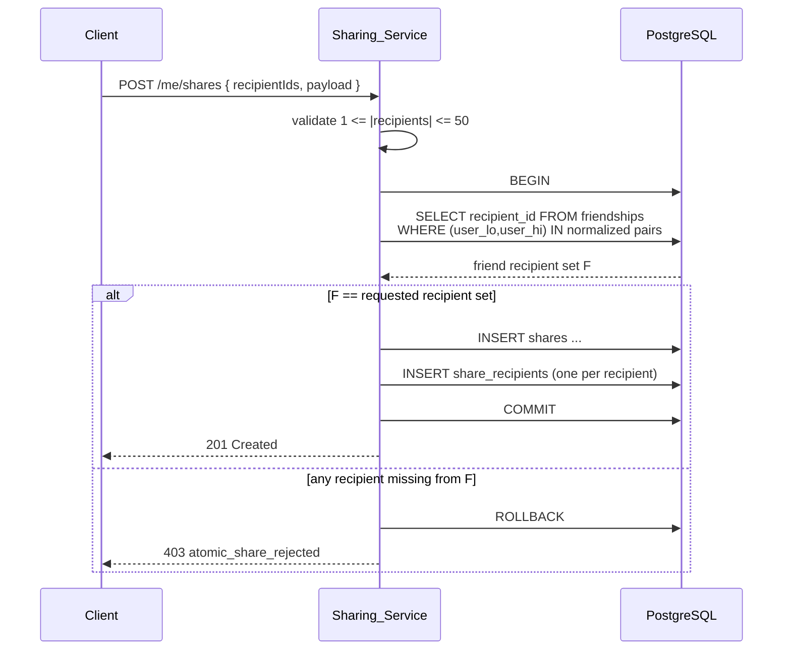

# Design Document

## Overview

The Disney World Tracker is a mobile application backed by a hosted multi-service backend that catalogs Walt Disney World Experiences sourced from the public ThemeParks.wiki API, lets authenticated Users track Completions, Ratings, and Notes, surfaces personal completion statistics, computes anonymous aggregate ratings, exposes a friends graph with sharing, and highlights the highest-rated Experiences on the Home_Screen.

The design treats the backend as a single deployable service composed of seven cohesive modules — `Auth_Service`, `Catalog_Service`, `Tracking_Service`, `Stats_Service`, `Friends_Service`, `Sharing_Service`, and `Aggregate_Ratings_Service` — each with a clear API and storage boundary. This monolith-with-clear-modules approach keeps deployment and operations simple for a first release while leaving each module independently extractable.

### Key Design Decisions

> Hosting and deployment details are documented separately in [hosting.md](hosting.md). The architecture below is platform-agnostic — only the hosting document changes if providers are swapped.

| Decision | Choice | Rationale |
| --- | --- | --- |
| Mobile platform | **React Native + TypeScript (Expo bare workflow)** | Single codebase for iOS and Android, mature ecosystem, native modules for image upload, secure storage, and offline cache. The catalog/sharing/ratings UI is screen-and-list heavy with no exotic native UX, which is exactly where React Native excels. Sharing the TypeScript types with the backend reduces drift. Flutter is also viable; React Native is preferred because more of the team's existing code is already TS. |
| API style | **REST over HTTPS, JSON bodies** | Operations are well-shaped CRUD with small, predictable response sets. HTTP caching headers help the catalog and the highest-rated leaderboard. GraphQL's flexible-query advantage adds little here and complicates rate limiting, lockout counters, and atomic share semantics. |
| Backend stack | **Node.js + Fastify (TypeScript)** | Shared types with the client, fast JSON throughput, mature middleware for auth, validation, and rate limiting. |
| Primary database | **PostgreSQL** | Strong ACID guarantees needed for share atomicity, friend-relationship invariants, and aggregate counter updates. Rich constraint support (unique indexes, partial indexes) maps directly onto the requirements (single rating per user/experience, single completion per user/experience, email uniqueness). |
| Cache and counters | **Redis** | Highest-rated leaderboard cache (5-minute TTL), opportunistic Catalog_Sync coordination lock, failed-login counters and lockout windows, session blacklist on logout. |
| Object storage | **S3-compatible bucket** | Avatar PNG/JPEG up to 5 MB per User, served behind signed URLs. |
| Password hashing | **Argon2id** with per-password salts and current OWASP-recommended parameters (m=64 MiB, t=3, p=1) | Memory-hard, side-channel resistant, recommended over bcrypt for new systems. |
| Session strategy | **Opaque random session tokens (256 bits)** stored server-side with absolute and idle TTLs | Opaque tokens are revocable on logout, lockout, and admin termination, satisfying R6.8 and R6.9. JWTs make revocation harder. |
| Background work | **BullMQ on Redis** | Schedules the 24-hour Catalog_Sync, retries failed syncs with backoff, and runs aggregate-rating recompute jobs within the 60-second SLA. |

### Goals

- Keep the Experience catalog faithful to upstream while never failing closed when ThemeParks.wiki is briefly unavailable.
- Make every per-User mutation (Completion, Rating, Note) idempotent in a way that survives network retries.
- Treat aggregate ratings as a privacy boundary: the only outputs are `(value, count)` and `(empty, count)`.
- Make share delivery atomic: a Share either delivers to all selected recipients or to none.
- Express as much business logic as universally quantified properties so a property-based test suite can pin down regressions.

### Non-Goals (for this release)

- Real-time wait times, schedules, or in-park live data from ThemeParks.wiki.
- Push notifications (the design assumes pull-on-open delivery; push can be added later without changing the data model).
- Social feeds beyond direct Sharing to selected Friends.
- Multi-tenant or admin tooling beyond what is implied by R6.9 ("administrative termination").

## Architecture

### Component Diagram

```mermaid
graph TB
    subgraph Client["React Native App (iOS / Android)"]
        UI[Screens & Navigation]
        Cache[(Local Cache:<br/>catalog, leaderboard,<br/>session token)]
        UI --> Cache
    end

    subgraph Edge["Edge"]
        GW[API Gateway / Load Balancer<br/>TLS, rate limiting]
    end

    subgraph Backend["Backend Service (Fastify, TypeScript)"]
        Auth[Auth_Service]
        Cat[Catalog_Service]
        Track[Tracking_Service]
        Stats[Stats_Service]
        Friends[Friends_Service]
        Share[Sharing_Service]
        Agg[Aggregate_Ratings_Service]
    end

    subgraph Jobs["Background Jobs (BullMQ)"]
        SyncJob[Catalog_Sync Job<br/>every 24h + opportunistic]
        AggJob[Aggregate Recompute<br/>per-Experience debounced]
    end

    subgraph Stores["Data Plane"]
        PG[(PostgreSQL)]
        Redis[(Redis:<br/>leaderboard cache,<br/>lockout counters,<br/>sync coordination)]
        S3[(Object Storage:<br/>avatars)]
    end

    External[ThemeParks.wiki API<br/>v1 entity-based]

    UI -->|HTTPS REST| GW
    GW --> Auth
    GW --> Cat
    GW --> Track
    GW --> Stats
    GW --> Friends
    GW --> Share
    GW --> Agg

    Auth --> PG
    Auth --> Redis
    Auth --> S3
    Cat --> PG
    Cat --> Redis
    Track --> PG
    Stats --> PG
    Friends --> PG
    Share --> PG
    Agg --> PG
    Agg --> Redis

    SyncJob --> Cat
    Cat -->|/destinations<br/>/entity/{id}/children| External
    Track -->|enqueue recompute| AggJob
    AggJob --> Agg
```

### Request Lifecycle

1. The client attaches a session token (opaque bearer) to every authenticated request.
2. The gateway terminates TLS, applies global rate limits, and forwards to the backend.
3. A Fastify auth middleware resolves the session, enforces the active/idle TTL rules, and rejects locked-out or expired sessions before any business handler runs.
4. Each service module owns its own Postgres tables and exposes a typed internal API. Cross-module reads (e.g., Stats reading Tracking and Catalog) go through these typed APIs rather than direct table access, so the modules can later be split into separate services.
5. Mutations that affect aggregate state (Ratings) enqueue a debounced recompute job for the affected Experience.

## Components and Interfaces

### Auth_Service

Responsible for registration, login, logout, sessions, lockout, and Profile.

**Storage:** `users`, `profiles`, `sessions`, `failed_login_attempts`, `account_lockouts`. Avatar bytes live in object storage; Postgres holds the URL and content metadata.

**Key endpoints:**

| Method | Path | Purpose | Notes |
| --- | --- | --- | --- |
| POST | `/auth/register` | Create User + Profile + session | RFC 5322 email, 1–50 char display name, 8–128 char password (R6.1, R6.4) |
| POST | `/auth/login` | Establish session | Increments failed counter on bad creds; rejects if locked out (R6.5–R6.7) |
| POST | `/auth/logout` | Invalidate session | Marks session row revoked; subsequent requests 401 (R6.8, R6.9) |
| GET | `/me` | Current User + Profile | Requires session |
| PATCH | `/me/profile` | Update display name | 1–50 chars after trim; whitespace-only rejected (R7.2, R7.6) |
| PUT | `/me/profile/avatar` | Upload avatar | PNG/JPEG, ≤ 5 MB, content-type and magic-byte sniffed (R7.3, R7.7) |
| GET | `/users/{userId}/profile` | View another User's Profile | Allowed only if requester is the owner or an accepted Friend (R7.4, R7.8) |

**Password handling:**

- On registration, hash password with Argon2id and a per-record random salt. Store the encoded hash string only.
- On login, fetch hash by email (constant-time email lookup), verify with Argon2id. Failed attempts increment a Redis counter keyed `lockout:{userId}`. On the 5th failure within 15 minutes, set a Redis lock `locked:{userId}` with 15-minute TTL; subsequent logins return account-locked until the key expires.
- Plaintext passwords are never logged, never persisted, and never returned in any response. The DTO type does not expose a `password` field after registration.

**Session lifecycle:**

- Session row stores `(token_hash, user_id, created_at, last_seen_at, absolute_expires_at, revoked_at)`. The token itself is returned to the client once and never stored in plaintext server-side.
- A request is authorized iff `revoked_at IS NULL`, `now < absolute_expires_at`, and `now − last_seen_at < 30 days` (idle window). On every authorized request, `last_seen_at` is updated, but `absolute_expires_at` is not extended (it is fixed at `created_at + 24h continuous-activity window`). The 24-hour continuous-activity rule is implemented as: `absolute_expires_at = max(created_at, last_active_burst_start) + 24h`; a 30-minute idle gap closes the burst and starts a new 24-hour window on the next request. This satisfies R6.5: "24 hours of continuous activity or 30 days of inactivity, whichever occurs first."

### Catalog_Service

Responsible for the Experience catalog and the ThemeParks_API integration.

**Storage:** `experiences`, `catalog_sync_runs`, `catalog_cache_metadata`.

**Stable internal id (R1.7):** `experiences.id` is a UUIDv5 derived from a fixed namespace UUID and the upstream entity ID string. This is a deterministic, one-to-one function; the same upstream id always produces the same internal id, and a regenerated row keeps that id.

**Entity-type to Experience_Category mapping (R1.2–R1.5):**

| Upstream `entityType` | Sub-classification signal | Experience_Category |
| --- | --- | --- |
| ATTRACTION | parade indicator (e.g., name match `/parade/i` or upstream `attractionType == "PARADE"` if present) | Parade |
| ATTRACTION | character meet indicator (e.g., name match `/meet[- ]?(and[- ]?)?greet/i` or upstream `attractionType == "MEET_AND_GREET"`) | Character_Meet |
| ATTRACTION | none of the above | Ride |
| SHOW | n/a | Show |
| RESTAURANT | n/a | Restaurant |
| any other included | n/a | Other |

The upstream sub-classification check is encapsulated in a single pure function `classify(entity) -> Experience_Category`, which is itself a property-test target.

**Park mapping (R1.6):** the Walt Disney World destination's children include the four theme parks, two water parks, and Disney Springs as named entities. The parent-park lookup walks the entity's `parentId` chain until it hits one of those known entity IDs, then maps to the Park enum.

**Catalog_Sync (R1.9–R1.16):**

- A scheduled BullMQ job runs every 24 hours. A coordination lock in Redis prevents duplicate concurrent syncs.
- Sync flow: fetch `/destinations`, locate Walt Disney World, fetch `/entity/{wdwId}/children` (paginated as the API requires), classify each returned entity, and reconcile against the local cache.
- Reconciliation is a deterministic pure function `reconcile(currentCache, upstreamSet) -> { upserts, softDeletes }`. Soft-delete sets `experiences.active = false` while preserving the row and all foreign-key references from Completions, Ratings, and Notes (R1.15). Re-appearance flips `active = true` again with the same internal id.
- On any HTTP error from upstream, the sync run is recorded with status `failed`, the cache is unchanged, and the existing rows continue to serve traffic with a `staleCache: true` flag on responses (R1.13).

**Opportunistic sync on read (R1.11, R1.12):**

```
GET /catalog
  if cacheAgeHours > 24:
    enqueue sync, await up to 5s for completion
    if completed: serve fresh cache
    else: serve existing cache with { staleCache: true }
  else:
    serve existing cache
```

The 5-second timeout is enforced with a deadline-aware promise race; the sync continues running in the background even when the request resumes from cache.

**Read endpoints:**

| Method | Path | Purpose |
| --- | --- | --- |
| GET | `/catalog` | All active Experiences, optional `parkId`, `category`, `q` filters; grouped/sorted server-side to satisfy R1.17–R1.21. The server returns a flat list with stable ordering; the client groups by Park for display. |
| GET | `/catalog/{experienceId}` | Single Experience detail (name, Park, Experience_Category, description) |

### Tracking_Service

Responsible for Completions, Ratings, and Notes, all keyed by `(user_id, experience_id)`.

**Storage:** `completions`, `ratings`, `notes`. Each table has a unique constraint on `(user_id, experience_id)` to enforce R2.3, R4.2, and R5.1 at the database level.

**Endpoints:**

| Method | Path | Purpose | Validation |
| --- | --- | --- | --- |
| PUT | `/me/experiences/{id}/completion` | Mark completed with date | Reject if date > today in user's TZ (R2.6) |
| PATCH | `/me/experiences/{id}/completion` | Edit completion date | Reject future date (R2.6); reject combined unmark+edit (R2.8) |
| DELETE | `/me/experiences/{id}/completion` | Unmark | 404 if no completion exists (R2.7) |
| PUT | `/me/experiences/{id}/rating` | Set rating | Integer 1..10 inclusive (R4.1, R4.7); replaces existing (R4.3) |
| DELETE | `/me/experiences/{id}/rating` | Remove rating | 404 if not present (R4.8) |
| PUT | `/me/experiences/{id}/note` | Set/edit note | 1..2000 chars after trim, reject whitespace-only (R5.2, R5.10) |
| DELETE | `/me/experiences/{id}/note` | Remove note | 404 if not present (R5.7) |

**Combined-operation handling (R2.8):** the API does not expose an endpoint that both unmarks and edits a date. A request body that attempts to set both `removed: true` and `date: <new>` is parsed as a structural validation error before any DB write, and the response error code is `completion_combined_op_not_allowed` per R2.8.

**Time-zone handling (R2.1):** the client sends its IANA TZ (e.g., `America/New_York`) and the local date as an ISO-8601 date string. The server validates that the supplied date is `≤ today_in_user_tz` and stores both the local date and the TZ used.

**Rating/note replacement semantics:** `PUT` is idempotent; the unique constraint plus an `INSERT ... ON CONFLICT (user_id, experience_id) DO UPDATE` upsert delivers the "replace, don't duplicate" guarantee. The Tracking_Service emits a domain event `RatingChanged{experienceId}` on rating create/update/delete; `Aggregate_Ratings_Service` consumes this to enqueue a recompute.

### Stats_Service

Responsible for completion percentages.

Stats are computed on demand from current data; no derived counters are persisted, which removes a class of drift bugs. The query returns the four denominators (overall, per-Park, per-Experience_Category) and four numerators in a single transaction snapshot.

`computePercent(numerator, denominator) = denominator == 0 ? 0.0 : min(100.0, round1(numerator * 100 / denominator))`

The `round1` and `min(100.0, …)` together guarantee R3.1–R3.3, R3.6–R3.8.

**Endpoints:**

| Method | Path | Purpose |
| --- | --- | --- |
| GET | `/me/stats` | Returns overall, per-Park, per-Experience_Category percentages with completed/total counts (R3.4) |
| GET | `/me/stats/summary?for=<userId>` | Friend or self only (R7.4 path) |

The 2-second SLA (R3.4, R3.5) is met by indexing `completions(user_id, experience_id)` and `experiences(active, park, category)`, and answering each `GET /me/stats` with at most four count queries plus one categorized roll-up.

### Friends_Service

Responsible for friend search, requests, accept/decline, removal.

**Storage:** `friend_requests`, `friendships`. The `friendships` table stores a single canonical row per relationship using the ordered pair `(min(userA, userB), max(userA, userB))` to make symmetry an enforced invariant rather than something to be checked at read time (R8.6).

**Endpoints:**

| Method | Path | Purpose | Validation |
| --- | --- | --- | --- |
| GET | `/users/search?q=...` | Up to 50 users matching query | Query length 1..100 (R8.1, R8.2) |
| POST | `/me/friend-requests` | Send request to user | Reject self (R8.8); reject if duplicate request or existing friendship in either direction (R8.7); reject unknown recipient (R8.10) |
| POST | `/me/friend-requests/{id}/accept` | Accept | Creates `friendships` row, deletes request (R8.4) |
| POST | `/me/friend-requests/{id}/decline` | Decline | Deletes request (R8.5) |
| GET | `/me/friends` | Current friends + incoming/outgoing pending requests (R8.9) |
| DELETE | `/me/friends/{userId}` | Remove friend | 404 if no current friendship (R8.11) |

### Sharing_Service

Responsible for atomic Share creation and per-recipient delivery state.

**Storage:** `shares`, `share_recipients`. A `share` row is the canonical record from the sender's side. Each `share_recipient` row tracks `opened_at` and `recipient_deleted_at` for that user; deletion by a recipient updates only their row, leaving the sender's record intact (R9.10).

**Atomic creation (R9.3):** in a single SQL transaction:

1. Validate the recipient list size (1..50) (R9.2).
2. Read the friendship rows for `(sender, recipient)` for every recipient.
3. If any recipient is missing from the friendship set, abort the transaction; insert nothing (R9.3).
4. Otherwise, insert one `share` row plus one `share_recipient` row per recipient, all in the same transaction.

**Endpoints:**

| Method | Path | Purpose |
| --- | --- | --- |
| POST | `/me/shares` | Send share (Experience or progress) to 1..50 friends |
| GET | `/me/inbox` | Recipient inbox; unopened entries reveal only `{shareId, isOpened: false}` and the unread count (R9.8) |
| POST | `/me/inbox/{shareId}/open` | Mark opened, return sender, content, sentAt (R9.9) |
| DELETE | `/me/inbox/{shareId}` | Recipient-side soft delete (R9.10) |

### Aggregate_Ratings_Service

Responsible for per-Experience aggregate rating, contributing-rating count, and the highest-rated leaderboard.

**Storage:** `aggregate_ratings(experience_id PK, sum_ratings BIGINT, count_ratings INT, mean_x10 SMALLINT, updated_at)`. The `mean_x10` field stores the rounded mean times 10 (an integer in 10..100 when `count_ratings >= 3`) to avoid floating-point representation drift; it is rendered as a decimal at the API boundary.

**Update strategy:** incremental, not recompute-from-scratch. On a `RatingChanged{experienceId, oldValue, newValue}` event, the recompute job acquires a per-experience advisory lock and runs:

```sql
sum_ratings  += (newValue or 0) - (oldValue or 0)
count_ratings += (newValue is not null ? 1 : 0) - (oldValue is not null ? 1 : 0)
mean_x10 = count_ratings >= 3 ? round_half_up(sum_ratings * 10 / count_ratings) : null
```

This is mathematically equivalent to recomputing `mean = sum/count` on the current set, satisfying R10.1, R10.2, R10.8, R10.9. A periodic reconciler (low-frequency) recomputes from raw `ratings` rows to detect any drift (defense in depth, not part of the SLA path).

The 60-second SLA (R10.7) is met because the event-driven recompute is enqueued synchronously with the rating mutation, the queue depth per experience is small (at most one job in flight per experience due to the advisory lock), and the work itself is O(1).

**Endpoints:**

| Method | Path | Purpose |
| --- | --- | --- |
| GET | `/experiences/{id}/aggregate-rating` | Returns `{count}` always; returns `value` only when `count >= 3` (R10.3, R10.4, R10.10) |
| GET | `/home/highest-rated` | Top 10 active Experiences by aggregate rating (R11) |

**Privacy boundary (R10.10):** the `aggregate-rating` and `highest-rated` endpoints have no path that returns or accepts another User's individual rating. The DTO type literally does not have a field for it. The only Rating endpoints that return a rating value are `GET /me/experiences/{id}/rating` (the requesting User's own).

**Highest-rated leaderboard (R11):**

- Computed by ranking all Experiences whose `aggregate_ratings.count_ratings >= 3` and `experiences.active = true` by:
  1. `mean_x10` descending,
  2. `count_ratings` descending,
  3. `lower(name)` ascending.
- Top 10 rows.
- Cached in Redis for 5 minutes (`highest-rated:v1`); the API responds from cache if the entry is younger than 5 minutes (R11.7–R11.9). The client also caches the response locally for 5 minutes.

## Data Models

### Entity-Relationship Diagram

```mermaid
erDiagram
    USER ||--|| PROFILE : has
    USER ||--o{ SESSION : has
    USER ||--o{ COMPLETION : records
    USER ||--o{ RATING : records
    USER ||--o{ NOTE : records
    USER ||--o{ FRIEND_REQUEST : sends
    USER ||--o{ FRIENDSHIP : participates_in
    USER ||--o{ SHARE : sends
    USER ||--o{ SHARE_RECIPIENT : receives

    EXPERIENCE ||--o{ COMPLETION : tracked_by
    EXPERIENCE ||--o{ RATING : rated_by
    EXPERIENCE ||--o{ NOTE : annotated_by
    EXPERIENCE ||--|| AGGREGATE_RATING : aggregates
    EXPERIENCE ||--o{ SHARE : referenced_by

    SHARE ||--|{ SHARE_RECIPIENT : delivered_to

    USER {
        uuid id PK
        text email UK
        text password_hash
        timestamptz created_at
    }
    PROFILE {
        uuid user_id PK_FK
        text display_name
        text avatar_url
        text avatar_mime
        int  avatar_size_bytes
    }
    SESSION {
        uuid id PK
        uuid user_id FK
        text token_hash UK
        timestamptz created_at
        timestamptz last_seen_at
        timestamptz absolute_expires_at
        timestamptz revoked_at
    }
    EXPERIENCE {
        uuid id PK "UUIDv5 of upstream entity id"
        text upstream_entity_id UK
        text name
        text park "enum"
        text category "enum: Ride|Show|Restaurant|Parade|Character_Meet|Other"
        text description
        bool active
        timestamptz updated_at
    }
    COMPLETION {
        uuid user_id PK_FK
        uuid experience_id PK_FK
        date completed_on
        text user_tz
    }
    RATING {
        uuid user_id PK_FK
        uuid experience_id PK_FK
        smallint value "1..10"
        timestamptz updated_at
    }
    NOTE {
        uuid user_id PK_FK
        uuid experience_id PK_FK
        text body "1..2000 after trim"
        timestamptz updated_at
    }
    FRIEND_REQUEST {
        uuid id PK
        uuid sender_id FK
        uuid recipient_id FK
        timestamptz created_at
    }
    FRIENDSHIP {
        uuid user_lo_id PK_FK "min(userA,userB)"
        uuid user_hi_id PK_FK "max(userA,userB)"
        timestamptz established_at
    }
    SHARE {
        uuid id PK
        uuid sender_id FK
        uuid experience_id FK "nullable for progress shares"
        text payload_kind "experience|progress"
        jsonb payload_snapshot "rating, note, percentages"
        timestamptz sent_at
    }
    SHARE_RECIPIENT {
        uuid share_id PK_FK
        uuid recipient_id PK_FK
        timestamptz opened_at
        timestamptz recipient_deleted_at
    }
    AGGREGATE_RATING {
        uuid experience_id PK_FK
        bigint sum_ratings
        int count_ratings
        smallint mean_x10 "null when count<3"
        timestamptz updated_at
    }
```

### Constraints summarized

- `users.email` UNIQUE, citext for case-insensitive matching (R6.2).
- `completions (user_id, experience_id)` PRIMARY KEY (R2.3).
- `ratings (user_id, experience_id)` PRIMARY KEY with CHECK `value BETWEEN 1 AND 10` (R4.2, R4.7).
- `notes (user_id, experience_id)` PRIMARY KEY with CHECK `char_length(body) BETWEEN 1 AND 2000` (R5.1, R5.2).
- `friendships (user_lo_id, user_hi_id)` PRIMARY KEY with CHECK `user_lo_id < user_hi_id` (R8.6 symmetry; R8.8 self-friend prevention is also enforced at the application layer because `lo == hi` is the only way to violate the CHECK and would be caught earlier as a self-target).
- `friend_requests` UNIQUE on `(sender_id, recipient_id)` plus an application-level check rejecting an inverse-direction pending request or an existing friendship (R8.7).
- `share_recipients (share_id, recipient_id)` PRIMARY KEY.
- `aggregate_ratings.experience_id` PRIMARY KEY with CHECK `count_ratings >= 0` and CHECK `mean_x10 IS NULL OR mean_x10 BETWEEN 10 AND 100` (R10.1).

### Sequence Diagrams

#### Catalog_Sync (scheduled and opportunistic)

```mermaid
sequenceDiagram
    participant Client
    participant API as Catalog_Service
    participant Cache as Postgres cache
    participant Lock as Redis lock
    participant TP as ThemeParks.wiki

    Note over API,Lock: Scheduled job runs every 24h
    API->>Lock: acquire sync lock (NX, 10m TTL)
    API->>TP: GET /destinations
    TP-->>API: destinations
    API->>TP: GET /entity/{wdwId}/children
    TP-->>API: entity set
    API->>API: classify each entity, reconcile
    API->>Cache: upsert + soft-delete missing
    API->>Lock: release
    API->>Cache: record sync run (success)

    Note over Client,Cache: Opportunistic on read
    Client->>API: GET /catalog
    API->>Cache: read cacheAge
    alt cacheAge > 24h
        API->>Lock: try-acquire sync lock
        API->>TP: sync (5s deadline race)
        alt sync completes within 5s
            API-->>Client: fresh catalog
        else timeout
            API-->>Client: cached catalog + staleCache:true
            Note over API,TP: sync continues in background
        end
    else cacheAge <= 24h
        API-->>Client: cached catalog
    end

    Note over API,TP: Failure path
    TP--xAPI: error
    API->>Cache: record sync run (failed); cache unchanged
    API-->>Client: cached catalog + staleCache:true
```

#### Share Delivery (atomic friend check)



#### Aggregate Rating Update on Rating Change

```mermaid
sequenceDiagram
    participant Client
    participant Track as Tracking_Service
    participant Q as Recompute Queue
    participant Agg as Aggregate_Ratings_Service
    participant DB as PostgreSQL

    Client->>Track: PUT /me/experiences/{id}/rating { value }
    Track->>DB: SELECT existing rating
    DB-->>Track: oldValue (or null)
    Track->>DB: UPSERT rating (value)
    Track->>Q: enqueue RatingChanged{expId, oldValue, value}
    Track-->>Client: 200 OK

    Q->>Agg: process RatingChanged
    Agg->>DB: BEGIN; lock aggregate_ratings row
    Agg->>DB: UPDATE sum, count, mean_x10
    Agg->>DB: COMMIT
    Note over Agg,DB: completes well within 60s SLA
```


## Correctness Properties

*A property is a characteristic or behavior that should hold true across all valid executions of a system — essentially, a formal statement about what the system should do. Properties serve as the bridge between human-readable specifications and machine-verifiable correctness guarantees.*

The properties below are written so each one drives one or more property-based tests. Each property has been derived from the prework analysis and consolidated to remove redundancy. Acceptance criteria not listed here either have a specific-example test (UI navigation, single error code paths) or are SMOKE/INTEGRATION concerns (perf SLAs, scheduler registration, external HTTP wiring) and are addressed in the Testing Strategy section.

### Property 1: Catalog classification and park mapping

*For any* upstream entity tree returned by the ThemeParks_API, every entity whose `entityType` is in `{ATTRACTION, SHOW, RESTAURANT}` (or is otherwise included by the include-set rule) is classified by `classify(entity)` according to the mapping table — parade indicator yields `Parade`, character-meet indicator yields `Character_Meet`, and otherwise the base mapping `ATTRACTION→Ride, SHOW→Show, RESTAURANT→Restaurant, other→Other` applies — and is associated with exactly one Park value derived by walking the entity's parent chain to a known Park root.

**Validates: Requirements 1.2, 1.3, 1.4, 1.5, 1.6**

### Property 2: Stable internal id is a one-to-one function of upstream entity id

*For any* pair of upstream entity IDs `a` and `b`, `internalId(a) == internalId(b)` if and only if `a == b`, and `internalId` is deterministic across repeated invocations.

**Validates: Requirements 1.7**

### Property 3: Generated Experience records satisfy field constraints

*For any* upstream entity set processed into Experiences, every produced Experience has a name of length 1..200, a Park value in the Park enum, an Experience_Category value in the Experience_Category enum, and a description of length 0..1000.

**Validates: Requirements 1.8**

### Property 4: Catalog read decision over cache age and sync outcome

*For any* `cacheAgeHours`, simulated `syncLatencyMs`, and simulated `syncOutcome` in `{success, error, timeout}`, the result of a catalog read matches: when `cacheAgeHours <= 24`, serve the existing cache without a sync; when `cacheAgeHours > 24` and an opportunistic sync completes successfully within 5 seconds, serve the freshly synced cache; otherwise serve the existing cache with a `staleCache: true` flag and leave the cache contents unchanged on any sync error.

**Validates: Requirements 1.11, 1.12, 1.13**

### Property 5: Catalog reconcile is correct on upserts and soft-deletes

*For any* `(currentCache, upstreamSet)` pair, the output of `reconcile(currentCache, upstreamSet)` (a) adds an Experience with `internalId == derive(upstreamId)` for every upstream id absent from `currentCache`, (b) marks `active = false` for every cache id absent from upstream while preserving the row and all foreign-key references from Completions, Ratings, and Notes, and (c) updates name, Park, and Experience_Category to the upstream value while preserving the internal id when an upstream entity's metadata differs from the cached row.

**Validates: Requirements 1.14, 1.15, 1.16**

### Property 6: Catalog presentation respects grouping, ordering, filters, and search

*For any* list of Experiences, optional `parkFilter`, optional `categoryFilter`, and optional search `query`, the rendered catalog list is exactly the subset of `active` Experiences that satisfy every selected predicate (Park equals `parkFilter`, Experience_Category equals `categoryFilter`, name contains the trimmed `query` as a case-insensitive substring when `query` has at least one non-whitespace character), grouped by Park, sorted within each group by `lower(name)` ascending.

**Validates: Requirements 1.17, 1.18, 1.19, 1.20, 1.21**

### Property 7: Completion state machine and cardinality

*For any* `(User, Experience)` pair and any sequence of `mark(date)`, `editDate(date)`, and `unmark()` operations, the resulting state has at most one Completion, where (a) `mark` followed by `unmark` returns to the no-Completion state, (b) the latest valid `mark` or `editDate` determines the stored date, (c) any operation with a date strictly later than today in the User's local time zone is rejected and leaves the prior state unchanged, and (d) any combined unmark+date-edit operation results in no Completion and no date update.

**Validates: Requirements 2.1, 2.2, 2.3, 2.5, 2.6, 2.8**

### Property 8: Completion render matches stored state

*For any* `(User, Experience)` Completion state, the rendered indicator and date in the App match the stored state: a Completion-present indicator with the stored date when present, a no-Completion indicator otherwise.

**Validates: Requirements 2.4**

### Property 9: Completion-percentage formula is bounded, rounded, and zero-safe

*For any* numerator `c` and denominator `t` with `c >= 0` and `t >= 0`, `computePercent(c, t)` returns a value in the closed interval `[0.0, 100.0]`, rounded to one decimal place, equal to `0.0` when `t == 0` and equal to `min(100.0, round1(c * 100 / t))` otherwise, applied identically to overall, per-Park, and per-Experience_Category percentages.

**Validates: Requirements 3.1, 3.2, 3.3, 3.6, 3.7, 3.8**

### Property 10: Rating state machine and validator

*For any* `(User, Experience)` pair and any sequence of rating `set(value)` and `remove()` operations, the stored state contains at most one rating; after a successful `set(v)` with `v` an integer in `1..10` the stored value equals `v`; `set(v)` for non-integer or out-of-range `v` is rejected and the prior state is unchanged; `remove()` after `set(v)` returns the state to no-rating; and the rendered view shows the stored value when present and the empty-state indicator when absent.

**Validates: Requirements 4.1, 4.2, 4.3, 4.4, 4.5, 4.6, 4.7**

### Property 11: Note state machine and validator

*For any* `(User, Experience)` pair and any sequence of note `save(body)`, `edit(body)`, and `delete()` operations, the stored state contains at most one Note; after any successful save or edit the stored body equals the most recently submitted body; `save` or `edit` is rejected when the trimmed length is 0 or the length exceeds 2000, leaving the prior body unchanged; `delete` after a save returns the state to no-Note; and the rendered view shows the stored body when present and the empty-state indicator when absent.

**Validates: Requirements 5.1, 5.2, 5.3, 5.4, 5.5, 5.6, 5.8, 5.9, 5.10**

### Property 12: Registration input validator

*For any* `(email, displayName, password)` triple, registration is accepted if and only if `email` matches RFC 5322 syntax, `displayName` length is in `1..50` after trimming with at least one non-whitespace character, and `password` length is in `8..128`; on rejection, no User account is created and the response identifies the failing field.

**Validates: Requirements 6.4**

### Property 13: Email uniqueness across all User accounts

*For any* sequence of registration attempts (each with a candidate email), no two stored Users share the same email under case-insensitive equality, and any registration whose email collides with an existing User's email is rejected with the duplicate-email error.

**Validates: Requirements 6.2, 6.3**

### Property 14: Session lifecycle and authorization

*For any* User session and any sequence of authenticated requests, logout events, expiration ticks, and administrative-termination events, a request is authorized if and only if the bound session is non-revoked, the absolute expiration (24 hours of continuous activity) has not elapsed, and the idle window (30 days) has not elapsed; for any session whose lifecycle has ended for any reason, every subsequent request using that session credential is rejected as unauthorized; and any request to a Completions, Ratings, Notes, Friends, or Sharing route without a valid session is rejected as unauthorized.

**Validates: Requirements 6.5, 6.8, 6.9, 6.10, 6.12**

### Property 15: Lockout window over login attempt sequences

*For any* User account and any sequence of `(timestamp, success)` login attempts, at any time `t`, the account is locked out if and only if there were 5 or more failed attempts in the trailing 15-minute window ending at the most recent failure and fewer than 15 minutes have elapsed since that failure; while locked out, every login attempt is rejected with the account-locked error regardless of credential validity.

**Validates: Requirements 6.7**

### Property 16: Password is never stored or transmitted in plaintext

*For any* password used in registration or login, the plaintext password value does not appear in any field of any persisted database row, in any structured log entry produced during the request lifecycle, or in any API response body; only the Argon2id hash representation is persisted.

**Validates: Requirements 6.11**

### Property 17: Display-name validator preserves prior on rejection

*For any* submitted display-name update, the update is accepted if and only if the trimmed length is in `1..50` and contains at least one non-whitespace character; on rejection the Profile's prior display name is unchanged.

**Validates: Requirements 7.2, 7.5, 7.6**

### Property 18: Avatar validator preserves prior on rejection

*For any* avatar upload, the upload is accepted if and only if the file format is PNG or JPEG (validated by both content type and magic bytes) and the size is at most 5 megabytes; on rejection the Profile's prior avatar is unchanged.

**Validates: Requirements 7.3, 7.7**

### Property 19: Profile authorization and render

*For any* `(viewer, target)` User pair, viewing the target's Profile succeeds if and only if `viewer == target` or an accepted Friend relationship exists between them; on success the response contains display name, avatar (if set), and overall completion percentage as computed by `Stats_Service`; on denial the response is an authorization error and no analytics or audit entry is produced for the viewing attempt.

**Validates: Requirements 7.4, 7.8**

### Property 20: User search returns substring matches with size, scope, and self-exclusion

*For any* User population, search query of length `1..100`, and requesting User `r`, the result set is exactly the case-insensitive substring matches on `displayName` or `email` over the population minus `{r}`, capped at 50 entries.

**Validates: Requirements 8.1**

### Property 21: Friend-graph state machine

*For any* sequence of friend operations (`sendRequest`, `accept`, `decline`, `remove`) on a population of Users, the resulting state satisfies: friendships are symmetric (a single canonical row per unordered pair); no User is friends with themselves; at most one pending Friend_Request exists between any unordered pair; no pending Friend_Request exists when a friendship is established; `accept` converts a pending request into a friendship and removes the request; `decline` removes the request without creating a friendship; `remove` deletes the friendship for both Users; any `sendRequest` to self, to a non-existent User, or that would create a duplicate of an existing pending or friendship state is rejected; and any `remove` for a non-existent friendship is rejected.

**Validates: Requirements 8.3, 8.4, 8.5, 8.6, 8.7, 8.8, 8.9, 8.10, 8.11**

### Property 22: Share atomic delivery

*For any* `(sender, recipientList, friendshipGraph)` with `1 <= |recipientList| <= 50`, a Share is created and exactly one delivery row is inserted per recipient if and only if every entry in `recipientList` is a Friend of the sender at the time of the request; otherwise no Share row and no delivery rows exist after the request.

**Validates: Requirements 9.1, 9.3**

### Property 23: Share payload composition

*For any* delivered Share, the delivered payload satisfies: when the Share includes the sender's Rating and a Rating exists at delivery time, the payload contains the integer Rating value in `1..10`; when the Share includes the sender's Rating and no Rating exists at delivery time, the payload omits the Rating value and includes a rating-unavailable notice; when the Share includes the sender's Note, the payload contains the Note body truncated to at most 2000 characters; when the Share is an overall-progress share, the payload contains overall, per-Park, and per-Experience_Category percentages each in `[0.0, 100.0]` rounded to one decimal place.

**Validates: Requirements 9.4, 9.5, 9.6, 9.7**

### Property 24: Inbox disclosure depends on opened state

*For any* recipient inbox state, the rendered preview reveals the sender, content, and timestamp of a Share if and only if the recipient's `opened_at` is set for that Share; otherwise the preview reveals only an unopened indicator and the recipient's unread Share count.

**Validates: Requirements 9.8, 9.9**

### Property 25: Recipient deletion independence

*For any* Share with multiple recipients, marking the Share deleted by recipient `r` removes the Share from `r`'s inbox view and leaves all other recipient delivery rows and the sender's record of the Share unchanged.

**Validates: Requirements 9.10**

### Property 26: Aggregate rating correctness, threshold gating, and privacy

*For any* sequence of rating `set(user, experience, value)`, `replace(user, experience, value)`, and `remove(user, experience)` operations, for every Experience the reported aggregate satisfies: `count` equals the number of distinct Users whose current Rating exists for that Experience; when `count >= 3`, the reported `value` equals `round1(sum / count)` constrained to `[1.0, 10.0]` and is rendered to one decimal place; when `count < 3`, the reported `value` is withheld and an empty-state indicator is reported with the count; the response shape contains only `value` and `count` and never contains an individual Rating value of any User other than the requesting User.

**Validates: Requirements 10.1, 10.2, 10.3, 10.4, 10.5, 10.6, 10.8, 10.9, 10.10**

### Property 27: Highest-rated leaderboard ordering and content

*For any* set of Experiences with associated aggregate rows, the highest-rated leaderboard equals the first 10 entries of the subset of `active` Experiences with `count >= 3`, ordered by `mean` descending, then `count` descending, then `lower(name)` ascending; each entry contains the Experience's name, Park, Experience_Category, mean rounded to one decimal place, and contributing rating count; when fewer than 10 Experiences qualify, the leaderboard contains exactly the qualifying subset in the same order; when zero Experiences qualify, the leaderboard is empty.

**Validates: Requirements 11.2, 11.3, 11.4, 11.5, 11.10, 11.11**

### Property 28: Leaderboard cache staleness

*For any* sequence of Home_Screen open events with timestamps, the leaderboard refresh count over any 5-minute sliding window is at most 1, and a refresh occurs on every open whose preceding cache age is greater than or equal to 5 minutes; opens whose preceding cache age is strictly less than 5 minutes serve the cached leaderboard without a refresh.

**Validates: Requirements 11.7, 11.8, 11.9**

## Error Handling

All API errors follow a uniform JSON envelope:

```json
{
  "error": {
    "code": "snake_case_code",
    "message": "human-readable message",
    "field": "optional, when validation pinpoints a field",
    "details": { }
  }
}
```

### Error code catalog (representative)

| Domain | Code | HTTP | Cause |
| --- | --- | --- | --- |
| Auth | `email_in_use` | 409 | R6.3 duplicate email on registration |
| Auth | `validation_failed` | 400 | R6.4 invalid email/displayName/password |
| Auth | `invalid_credentials` | 401 | R6.6 |
| Auth | `account_locked` | 423 | R6.7 lockout active |
| Auth | `unauthorized` | 401 | R6.8/R6.9/R6.10/R6.12 missing or invalid session |
| Catalog | `catalog_unavailable` | 503 | R1.24 no prior cache and upstream unreachable |
| Catalog | `stale_cache` | 200 + `staleCache: true` | R1.13 served from cache during upstream failure |
| Tracking | `completion_future_date` | 400 | R2.6 future date submitted |
| Tracking | `completion_not_found` | 404 | R2.7 |
| Tracking | `completion_combined_op_not_allowed` | 400 | R2.8 |
| Tracking | `rating_out_of_range` | 400 | R4.7 |
| Tracking | `rating_not_found` | 404 | R4.8 |
| Tracking | `note_length_invalid` | 400 | R5.10 trim/length violation |
| Tracking | `note_not_found` | 404 | R5.7 |
| Profile | `display_name_invalid` | 400 | R7.6 |
| Profile | `avatar_invalid` | 400 | R7.7 |
| Profile | `profile_forbidden` | 403 | R7.8 not owner and not friend |
| Friends | `search_query_length_invalid` | 400 | R8.2 |
| Friends | `friend_self_target` | 400 | R8.8 |
| Friends | `friend_duplicate_relationship` | 409 | R8.7 |
| Friends | `friend_recipient_unknown` | 400 | R8.10 |
| Friends | `friendship_not_found` | 404 | R8.11 |
| Sharing | `share_recipient_count_invalid` | 400 | R9.2 |
| Sharing | `share_atomic_rejected` | 403 | R9.3 any non-friend recipient |

### Cross-cutting handling

- **Validation failures** never produce partial state changes. Every mutation handler validates fully before opening a transaction; transaction rollback on a thrown validation error is a defense-in-depth backstop, not the primary mechanism.
- **Upstream API failures** in Catalog_Sync are caught at the integration boundary, recorded in `catalog_sync_runs` with `status = 'failed'` and an error class label, and never propagate as a 5xx to the client when prior cache exists (R1.13). The only client-visible error is R1.24's `catalog_unavailable` when there is also no prior cache.
- **Database constraint violations** (e.g., uniqueness on `users.email` or `friendships`) are translated into the corresponding domain error code; the client never sees a raw constraint name.
- **Unhandled exceptions** are caught by a single Fastify error hook, logged with a request id and a redacted body (no password, no full session token, no avatar bytes), and returned as a generic `internal_error` 500. Privacy-sensitive fields are added to a structured-logging redactor at startup so they cannot be added to a log line by accident.

### Observability

- Every request gets a `request_id`. Every domain mutation gets a structured event with `(request_id, user_id, action, target_id, outcome)`.
- Domain metrics: registration rate, login success/failure rate, failed-login lockouts triggered, share atomic-rejections, catalog_sync run outcomes, aggregate-recompute job latency p50/p95.
- Latency SLOs are wired to alerts: `/me/stats` p95 ≤ 1.5s (margin under the 2s requirement), aggregate-recompute end-to-end p95 ≤ 30s (margin under 60s), share delivery p95 ≤ 5s (margin under 10s).

### Security

- All traffic is HTTPS only; HSTS at the edge.
- Argon2id for password hashing; per-record salts; tunable parameters via config.
- Session tokens are 256-bit random URL-safe strings; only their hash is stored server-side.
- Avatars are content-type sniffed by magic bytes (not just by `Content-Type` header) to mitigate type-confusion uploads.
- Input length limits enforced both at the validator and at the gateway.
- Catalog_Service strips any HTML or script content from upstream `description` fields before persisting; the field is rendered as plain text in the client.
- Rate limiting at the gateway: 60 req/min/user for read endpoints, 10 req/min/user for mutations, 5 attempts/15 min/account for `/auth/login` (the lockout rule is enforced after rate limiting passes, so a flood does not bypass the account lockout window).
- Privacy boundary on aggregate ratings is enforced in the type system: the `AggregateRatingDTO` has only `value | null` and `count`; there is no code path on the server that returns another User's individual Rating value.

## Testing Strategy

### Dual approach

- **Property-based tests** verify the invariants in the Correctness Properties section across many randomly generated inputs.
- **Example-based unit tests** verify single-scenario behavior, error codes for specific paths, and UI navigation.
- **Integration tests** verify infrastructure wiring (ThemeParks_API endpoint shape, BullMQ scheduling, S3 avatar upload, lockout-counter Redis key TTL).
- **Smoke tests** verify perf SLAs (R3.4, R3.5, R5.8, R5.9, R6.1, R6.5, R10.7, R11.1) on representative datasets.

### Property-based testing library and conventions

- **Library**: [`fast-check`](https://github.com/dubzzz/fast-check) for the Node.js backend (TypeScript), driven through Vitest. The same library runs in the React Native bundle for client-side validators (search/filter/render). The model does not implement property-based testing from scratch; `fast-check` provides arbitraries, shrinking, and seeded reproducibility.
- **Iterations**: every property test runs at least **100 iterations** (`fc.assert(prop, { numRuns: 100 })`).
- **Tagging**: every property test carries a comment header naming the design property:

  ```ts
  // Feature: disney-world-tracker, Property 9: For any numerator c and denominator t...
  test.prop("computePercent is bounded, rounded, and zero-safe", ...)
  ```

- **Shrinking**: when a property fails, `fast-check`'s built-in shrinker reports the smallest counterexample for inclusion in the failing-example field of the PBT task.
- **Determinism**: seeds are recorded on CI failures so any failing run is reproducible.

### Property-to-test mapping (overview)

| Property | Generator surface | Notes |
| --- | --- | --- |
| 1 (classification) | Random upstream entity trees with mixed types and parade/meet markers | Includes the unknown-parent edge case |
| 2 (stable id) | Random upstream id strings | Tests both equality and inequality |
| 3 (field constraints) | Random upstream entity records | Includes empty descriptions and 200-char names |
| 4 (catalog read decision) | `(cacheAgeHours, syncOutcome, syncLatencyMs)` | Mocks both the sync subsystem and clock |
| 5 (reconcile) | `(cache, upstreamSet)` pairs | Includes overlapping, fully-disjoint, and identical inputs |
| 6 (presentation) | `(experiences, parkFilter, categoryFilter, query)` | Includes empty result and case-insensitivity edges |
| 7 (completion state machine) | Operation sequences with random TZs and dates | Includes future-date and combined-op edges |
| 8 (completion render) | `(User, Experience)` state | UI render tested with React Native Testing Library |
| 9 (computePercent) | `(c, t)` | Includes `t == 0` and `c > t` edges |
| 10 (rating state machine) | Operation sequences over a single (User, Experience) | Validator generators include floats, NaN, strings, 0, 11+ |
| 11 (note state machine) | Operation sequences with random Unicode strings | Includes pure-whitespace and 2001-char edges |
| 12 (registration validator) | Random `(email, displayName, password)` | Email arbitraries cover RFC 5322 valid and invalid forms |
| 13 (email uniqueness) | Sequences of registrations with reused emails | |
| 14 (session lifecycle) | Sessions over a clock generator with logout/expiration events | |
| 15 (lockout window) | Sequences of `(timestamp, success)` attempts | |
| 16 (password not stored plaintext) | Random password registrations | After registration, scan all DB rows, log entries, and HTTP responses |
| 17 (display-name validator) | Random Unicode strings | Includes whitespace-only and length boundaries |
| 18 (avatar validator) | Random byte buffers + claimed content types | Includes type-confusion attempts |
| 19 (profile authorization) | Random `(viewer, target)` pairs and friendship sets | Includes self, friend, and non-friend cases; verifies no analytics record |
| 20 (user search) | Random User population + query | Includes 0-length and 101-length queries (rejection edges) |
| 21 (friend graph) | Sequences of friend operations | State-machine model uses `fast-check`'s `commands` API |
| 22 (share atomicity) | `(sender, recipientList, friendshipGraph)` with mixed friend/non-friend recipients | |
| 23 (share payload) | Random Share inputs (Experience, optional Rating, optional Note, progress) | Includes the 2000-char truncation and rating-absent edges |
| 24 (inbox disclosure) | Random inbox states | |
| 25 (recipient deletion) | Shares with `n` recipients, random `r` to delete | |
| 26 (aggregate rating) | Sequences of rating set/replace/remove events | Reference implementation recomputes from raw events |
| 27 (leaderboard ordering) | Random Experience+aggregate datasets with ties | |
| 28 (leaderboard staleness) | Sequences of Home_Screen open timestamps | |

### Tests not driven by properties

- **UI navigation and empty-state messages** (R1.22, R1.23, R1.24, R11.6, R11.12) are verified with React Native Testing Library example tests.
- **Perf SLAs** (R3.4, R3.5, R5.8, R5.9, R6.1, R10.7, R11) are smoke tests that run a single representative scenario against staging-like data and assert the wall-clock duration is within budget.
- **External API wiring** (R1.1, R1.10) is verified with one integration test against a recorded ThemeParks_API fixture.
- **Persistence existence** (R1.9) and the avatar storage round-trip are verified with one integration test each.

### Coverage targets

- Property tests must cover every property listed above with `numRuns >= 100`.
- Unit + property tests together must reach ≥ 90% line coverage on the validator modules and ≥ 85% line coverage on the service modules.
- Integration tests must cover the happy path of every public endpoint at least once.

### Iteration and feedback

If review of this design surfaces gaps in the requirements (for example, an unspecified time-zone rule, an unstated rate-limit, or an ambiguous ordering rule), the design will return to the requirements phase to clarify before implementation begins.
