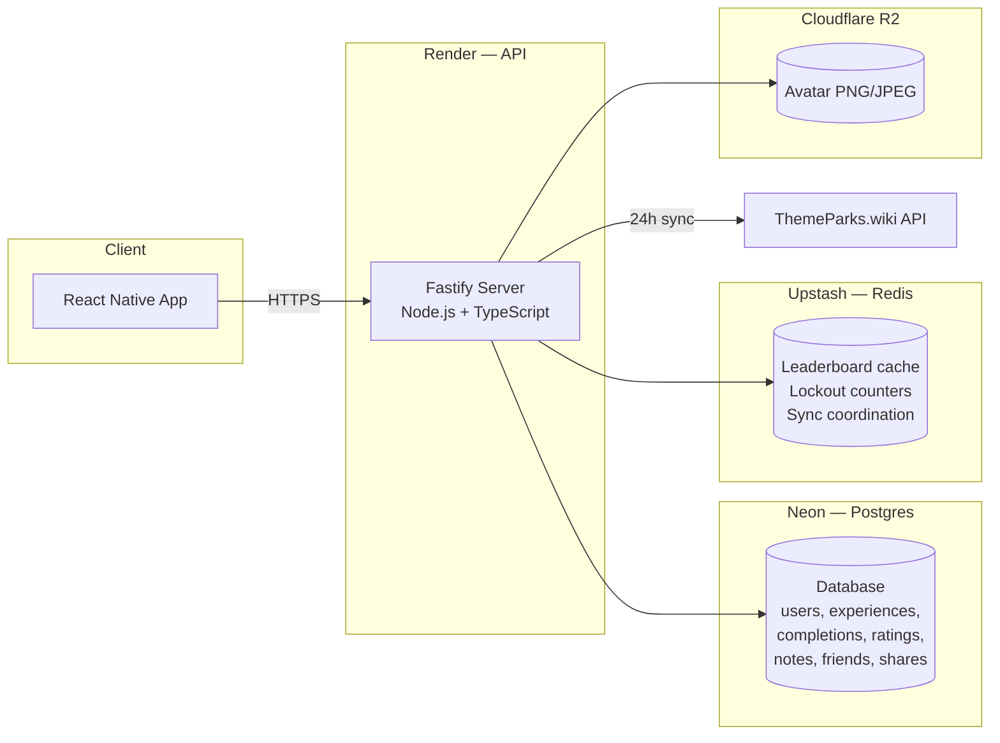
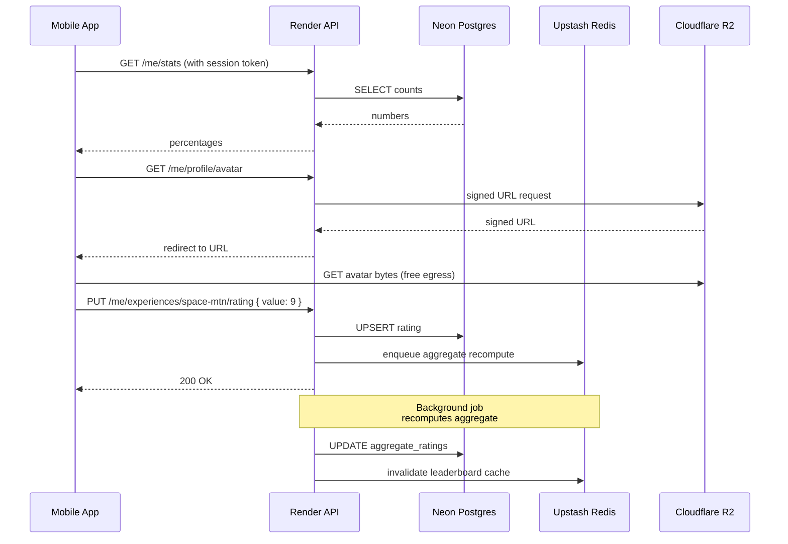

# Hosting Plan

This document explains how the Disney World Tracker backend will be hosted using free-tier services. It is meant for a side-project budget — every piece below has a free tier that does not expire, with no credit card surprises at month 13.

The full architecture from `design.md` calls for four moving pieces:

1. A long-running API server (Node.js + Fastify)
2. A relational database (PostgreSQL)
3. A fast in-memory store (Redis)
4. Object storage for avatar uploads (S3-compatible)

We map each one to a managed service that gives us a real free tier.

## At a Glance

| Concern | Service | Free tier limit | What happens when exceeded |
| --- | --- | --- | --- |
| API server | **Render** (Web Service) | 750 instance hours/month, sleeps after 15 min idle | First request after sleep takes 30-60s; upgrade to paid ($7/mo) for always-on |
| PostgreSQL | **Neon** | 0.5 GB storage, 1 project, autoscale to 0 when idle | Upgrade plan or migrate; data is portable |
| Redis | **Upstash** | 10,000 commands/day, 256 MB storage, global edge | Per-request pricing kicks in (very cheap); or swap to a different provider |
| Object storage | **Cloudflare R2** | 10 GB storage, 1M Class A ops/mo, 10M Class B ops/mo, **no egress fees** | Pennies per additional GB |
| ThemeParks.wiki API | n/a (already free) | Public, no key required | n/a |

Total monthly cost while the app is small: **$0**. No payment method required to start (R2 asks for one but doesn't charge inside the free tier).

## Architecture With Hosting Overlaid

Everything talks over HTTPS. The mobile app only ever knows about one URL — the Render API endpoint. Render, Neon, Upstash, and R2 are all reached server-side.

---

## Render — API Hosting

### What it does

Render is a platform that takes a GitHub repository, builds it, and runs it as a long-lived process behind an HTTPS URL. We use it for the Fastify API server.

### How it works

1. You create a Render account and connect your GitHub repo.
2. You point Render at the backend folder, tell it the build command (`npm run build`) and the start command (`npm start`).
3. Render builds a container, deploys it, and gives you a URL like `https://disney-world-tracker.onrender.com`.
4. Every push to `main` triggers an automatic rebuild and zero-downtime deploy.

### The free tier

- **750 instance hours/month**, which is enough for one service running 24/7.
- **Sleeps after 15 minutes of no traffic.** When a request comes in after a quiet period, Render starts the container back up. That first request takes 30-60 seconds to respond. Subsequent requests are fast.
- **512 MB RAM, shared CPU.** Plenty for a Fastify process serving JSON.
- **HTTPS and a custom domain are included.**

### What this means for the design

The 24-hour scheduled `Catalog_Sync` job is the one thing that doesn't fit nicely on a sleeping free instance. Two ways to handle it:

- **Cron Jobs on Render** are a separate service type with their own free hours. We schedule the sync as a cron job that wakes up daily, runs the sync, and exits. Cleaner than running it inside the API process.
- **External cron trigger** like [cron-job.org](https://cron-job.org) hits a `/internal/sync` endpoint on the API daily. This is the simpler "no extra Render service" option.

### Trade-offs

| Pro | Con |
| --- | --- |
| Truly free, no credit card | Cold-start delay on first request after idle |
| Simple GitHub-driven deploys | One service per free instance |
| HTTPS automatic | Build minutes are limited |

### When to upgrade

The first paid tier is **$7/month** for an always-on instance. Worth it as soon as you have any real users; the cold start otherwise frustrates anyone opening the app for the first time that day.

---

## Neon — PostgreSQL

### What it does

Neon is a managed Postgres provider built around the idea that databases should scale to zero when nobody's using them. We use it as the single source of truth for users, experiences, completions, ratings, notes, friend graph, and shares.

### How it works

1. You create a Neon project. Neon hands you a connection string.
2. You drop the connection string into Render's environment variables.
3. The Fastify server connects exactly like it would to any other Postgres database.
4. When the app sits idle, Neon pauses the database and stops billing CPU. The next query wakes it up in a couple of seconds.

### The free tier

- **0.5 GB storage** — enough for tens of thousands of users at this app's data shape (text-heavy but small per row).
- **Always-on branch + scale-to-zero compute.** You always have a primary, but it pauses when idle.
- **Postgres extensions available**, including `citext` (case-insensitive text — the design uses this for emails) and `pg_trgm` (substring search — useful for user search).
- **Connection pooling included** via PgBouncer, which matters because Render dynos and Postgres connection counts are otherwise a fight.

### What this means for the design

The schema in `design.md` (users, experiences, completions, ratings, notes, friend_requests, friendships, shares, share_recipients, aggregate_ratings) drops in unchanged. The `friendships` canonical-pair invariant, the per-table `(user_id, experience_id)` primary keys, and the integer `mean_x10` aggregate field all work the same as on any Postgres.

### Trade-offs

| Pro | Con |
| --- | --- |
| Real Postgres, not a Postgres-flavored thing | First query after idle has a 1-3 second wake-up |
| Branching feature is great for trying schema changes | 0.5 GB cap means you'll outgrow it eventually |
| Built-in connection pooling | Free tier is one project at a time |

### When to upgrade

Neon's first paid tier is **$19/month** with 10 GB storage and no scale-to-zero. The migration path is just a `pg_dump`/`pg_restore` if you ever want to move off Neon entirely.

---

## Upstash — Redis

### What it does

Upstash is a serverless Redis provider. You pay per command instead of per server-hour. We use it for:

- Leaderboard cache (5-minute TTL on the highest-rated experiences list)
- Failed-login counters and account lockout windows
- Coordination lock for the 24-hour Catalog_Sync job
- Session token blacklist on logout

### How it works

1. You create an Upstash database. They give you a Redis URL.
2. Render gets the URL via environment variable.
3. The API talks to it with any standard Redis client (`ioredis`, `redis`, etc.).

### The free tier

- **10,000 commands per day.** That sounds small, but most of our writes are on user actions (rating change, login attempt) and most of our reads are cache hits — well under 10K/day for a hobby app.
- **256 MB storage.**
- **Global edge replication available** (low latency reads from anywhere).

### What this means for the design

The leaderboard cache lookup is one Redis read per home-screen load. Lockout counters are a few writes per failed login. Catalog_Sync acquires one lock per 24-hour cycle. We're nowhere near the 10K/day limit at hobby scale.

### Trade-offs

| Pro | Con |
| --- | --- |
| No idle cost, true pay-per-use | Per-command pricing is higher than per-hour at high volumes |
| 256 MB is plenty for cache + counters | The 10K/day cap is a hard limit, not a soft throttle |
| HTTPS REST API option (handy for serverless if we ever go that way) | |

### When to upgrade

The next tier is **$0.20 per 100K commands** (pay-as-you-go). You'd have to be doing real volume to notice it.

---

## Cloudflare R2 — Avatar Storage

### What it does

R2 is Cloudflare's S3-compatible object storage. We use it for user avatar uploads (PNG or JPEG, up to 5 MB each per the design).

### How it works

1. You create an R2 bucket in the Cloudflare dashboard.
2. You generate an Access Key ID and Secret. Those go in Render's env vars.
3. The Fastify API uses any S3 SDK (e.g., `@aws-sdk/client-s3`) pointed at R2's endpoint URL. The code is identical to talking to AWS S3.
4. Avatar reads happen via signed URLs that the API generates on demand.

### The free tier

- **10 GB storage.** At 5 MB per avatar, that's 2,000 avatars even if every user maxes out the size. Realistically thousands more, since most avatars compress smaller.
- **1M Class A operations/month** (writes — uploads).
- **10M Class B operations/month** (reads — viewing avatars).
- **No egress fees.** This is the killer feature versus AWS S3. S3 charges $0.09/GB to send avatar bytes to phones; R2 charges nothing for that bandwidth.

### What this means for the design

The avatar upload flow in `design.md` (PNG/JPEG validation, magic-byte sniffing, 5 MB limit) sits in front of R2. The signed-URL pattern works the same. Only the SDK endpoint URL changes.

### Trade-offs

| Pro | Con |
| --- | --- |
| No egress charges (unique among major providers) | Cloudflare account required |
| S3-compatible, so no vendor lock-in | Upload write rate is rate-limited (not a problem at hobby scale) |
| Free tier is generous and persistent | Custom domain serving requires a Cloudflare-managed domain |

### When to upgrade

After 10 GB it's **$0.015 per GB-month** for storage. Reads stay free. Realistically you'd never notice the cost until very late.

---

## How the Pieces Talk

Here's the flow for a user opening the app and rating Space Mountain:

Every box on the left of "Render API" is the mobile app. Everything else is server-side, and the app never directly touches Neon, Upstash, or R2.

---

## Setup Order

When the time comes to deploy, the rough order is:

1. **Cloudflare R2** — create bucket, generate credentials.
2. **Neon** — create project, copy connection string, run schema migrations.
3. **Upstash** — create Redis database, copy URL.
4. **Render** — create Web Service, link GitHub repo, paste the three sets of credentials as environment variables, deploy.
5. **Optional: Render Cron Job** — schedule the daily Catalog_Sync hit.

All four signups are independent. If any single provider goes down or changes their free tier, you swap that one piece without rewriting the others.

---

## Honest Caveats

- **Cold starts** on Render's free tier mean the very first request after a long idle period will be slow. Acceptable for a side project, frustrating for users you want to keep.
- **Free tiers do change.** Fly.io's free tier got removed in 2024. Render, Neon, Upstash, and R2 have all been stable, but nothing is forever.
- **Region selection.** Pick the same region across services where possible (US East is the safe default) to keep latency between Render and Neon low.
- **Backups.** Free Neon includes point-in-time recovery on the latest 24 hours. For anything important, take periodic `pg_dump` exports yourself.
- **Secrets.** Connection strings and access keys live as environment variables on Render. Never check them into Git.

---

## What Changes in design.md

The design document is hosting-agnostic on purpose, and nothing in it needs to change to deploy on this stack. The interfaces (Postgres, Redis, S3-compatible) are exactly what Neon, Upstash, and R2 provide. Render runs the Node process the design assumes. The only deployment-specific decision is the Catalog_Sync trigger (Render Cron Job vs. external pinger), which is an operational detail rather than an architectural one.
