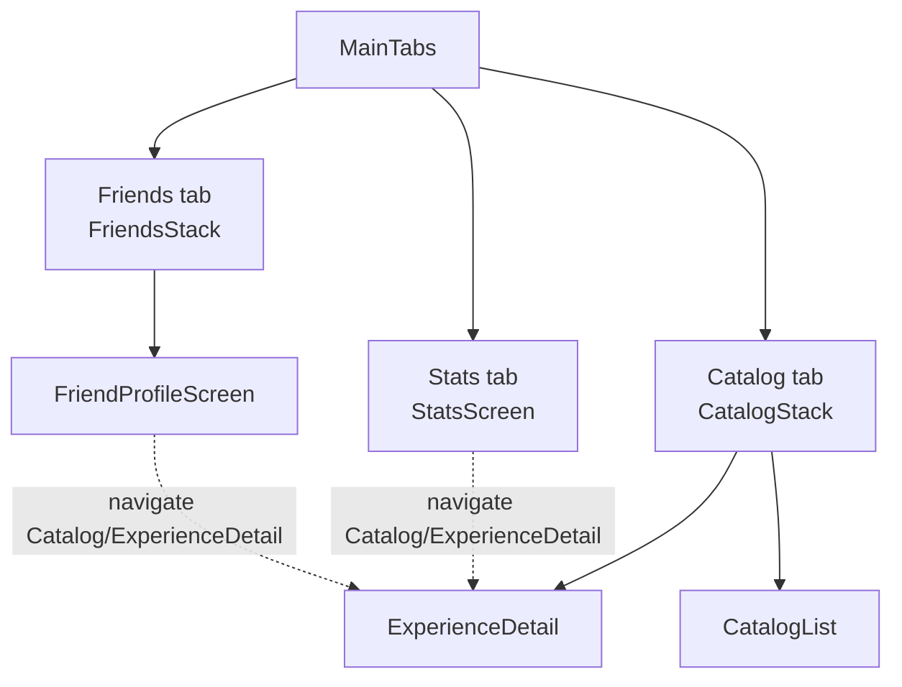

# Design Document

## Overview

The Experience Detail Navigation feature turns the existing, purely presentational `CompletionRow` into a navigation affordance: tapping a completed-Experience row on the User's own Stats page or on a Friend's profile opens the existing `ExperienceDetailScreen` for that Experience. It also makes the four grouped views (Friend `Parks`/`Categories`, Stats `Own_Parks`/`Own_Categories`) render each Park and Experience_Category as a collapsible `Group_Section`.

The destination screen and cross-stack navigation typing already exist. `ExperienceDetailScreen` is registered in the Catalog tab's stack as `ExperienceDetail` and is addressed by `{ experienceId }`; `MainTabParamList.Catalog` is typed as `NavigatorScreenParams<CatalogStackParamList>`, so any tab can dispatch `navigation.navigate('Catalog', { screen: 'ExperienceDetail', params: { experienceId } })` — exactly the pattern `HomeScreen` and `CatalogScreen` already use.

The one true gap is data: the `Completion_Entry` served by the Tracking_Service Completions read (`GET /users/:userId/completions`) does not carry an `Experience_Id`. The read's SQL already joins `experiences e ON e.id = c.experience_id`, so the catalog `Experience_Id` is available and only needs to be projected. This makes the feature a coordinated change across three layers:

1. **Backend (`apps/api`)** — add `e.id` to the Tracking_Service Completions read projection and to the repo's `CompletionEntry`, then map it onto the wire DTO in the route.
2. **Shared contract (`packages/shared`)** — add `experienceId` to `CompletionEntryDTO`.
3. **Mobile (`apps/mobile`)** — make `CompletionRow` a tappable, accessible control that navigates to `ExperienceDetail`; add collapsible `Group_Section`s to the four grouped views.

The feature reuses the existing `ExperienceDetailScreen` without modification. That screen always loads the *viewing* User's own Completion, Rating, and Note for the Experience (via `/me/experiences/:id/...`), independent of whose row was tapped — so opening a Friend's completed Experience intentionally shows the viewing User's own data and controls, not the Friend's.

This design changes no authorization rule, no set of returned Completions, no ordering, no cap (5,000), and no Rating/shared-Note disclosure behavior. It only adds one field to the read and wires up the client.

### Scope of change by layer

| Layer | File(s) | Change |
| --- | --- | --- |
| Backend repo | `apps/api/src/services/tracking/friendCompletions/repo.ts` | Add `e.id AS experience_id` to the SELECT; add `experienceId` to `CompletionEntry`; map it in `rowToEntry`. |
| Backend route | `apps/api/src/services/tracking/friendCompletions/routes.ts` | Add `experienceId` to `toCompletionEntryDTO`. |
| Shared contract | `packages/shared/src/dto/CompletionEntry.ts` | Add `readonly experienceId: string`. |
| Mobile — navigation | `apps/mobile/src/screens/navigation/experienceNavigation.ts` (new) | Pure `resolveExperienceTarget` + `useOpenExperience` hook (cross-stack navigate + repeat-tap guard). |
| Mobile — row | `apps/mobile/src/screens/navigation/CompletionRow.tsx` | Render as an activatable control with accessibility wiring when a target is available. |
| Mobile — group sections | `apps/mobile/src/screens/navigation/GroupSection.tsx` (new), `groupSectionState.ts` (new), `useGroupSections.ts` (new) | Collapsible section primitive + pure state reducer + per-Screen_Session state hook. |
| Mobile — grouped views | `StatsScreen.tsx`, `FriendProfileScreen.tsx` | Render `Own_Parks`/`Own_Categories` and `Parks`/`Categories` as `Group_Section`s. |

## Architecture

### Data flow: Experience_Id from catalog to navigation target

```mermaid
flowchart LR
  subgraph DB
    C[completions] -->|JOIN e.id = c.experience_id| E[experiences]
  end
  E -->|e.id AS experience_id| Repo[friendCompletions repo\nCompletionEntry.experienceId]
  Repo --> Route[GET /users/:userId/completions\ntoCompletionEntryDTO]
  Route -->|CompletionEntryDTO.experienceId| Wire[(wire contract)]
  Wire --> Hook[useFriendCompletions /\nuseOwnCompletions]
  Hook --> Row[CompletionRow]
  Row -->|resolveExperienceTarget(entry)| Nav[useOpenExperience]
  Nav -->|navigate Catalog → ExperienceDetail| Detail[ExperienceDetailScreen]
```

The same Completions read backs both lists, so a single backend/contract change serves the Stats tab (own list, owner path) and the Friends tab (friend list). The mobile layers downstream of the DTO are shared (`CompletionRow`, `grouping.ts`, `ExperiencesList`), so the row enhancement applies uniformly to all modes.

### Navigation topology (already in place)



A tab-level `navigate('Catalog', { screen: 'ExperienceDetail', params })` bubbles up from a nested screen (e.g. `FriendProfileScreen` inside `FriendsStack`) to the tab navigator that owns the `Catalog` route, then pushes `ExperienceDetail` onto the Catalog stack. Returning from the detail screen pops back to the Catalog stack; the originating tab (Stats or Friends) is preserved because the cross-tab jump does not unmount it. This is the same mechanism `HomeScreen` uses today.

### Collapsible group sections (client-only)

The grouped views already compute, per group, a stat header (name + completed/total + percent) and a body (rows or empty indication). The change wraps each group as a `Group_Section`:

- `Group_Header` — the existing stat header content, now a single tappable control that toggles the section and exposes `accessibilityRole` + `accessibilityState.expanded`.
- `Group_Body` — rendered only while Expanded; contains the group's `CompletionRow`s or a `Compact_Empty_State`.

Expanded/Collapsed state lives in a per-screen hook (`useGroupSections`) backed by a pure reducer. The state is in-memory for the duration of the `Screen_Session` and is recreated (reset to all-Collapsed) whenever the screen is presented anew, because the hook is mounted by the screen component and re-initialized on mount.

## Components and Interfaces

### Backend — Tracking_Service Completions read

`friendCompletions/repo.ts`:

- The SELECT gains `e.id AS experience_id` as the first projected column. Since the read already does `JOIN experiences e ON e.id = c.experience_id AND e.active = TRUE`, `e.id` is the catalog `Experience_Id` of the same Active Experience whose `name`/`park`/`category` the entry reports (R1.2, R1.3). No new join, filter, ordering, or limit.
- `CompletionEntry` gains `readonly experienceId: string;`.
- `rowToEntry` maps `experienceId: row.experience_id`.

`friendCompletions/routes.ts`:

- `toCompletionEntryDTO` adds `experienceId: entry.experienceId`. Authorization (`assertOwnerOrFriend`) and the rest of the handler are unchanged, so the Owner_Or_Friend_Rule still runs before any data is read or disclosed (R1.5).

```ts
// repo.ts
export interface CompletionEntry {
  readonly experienceId: string; // catalog Experience_Id (R1.1, R1.2, R1.3)
  readonly experienceName: string;
  readonly park: Park;
  readonly category: ExperienceCategory;
  readonly completedOn: string;
  readonly rating: number | null;
  readonly sharedNote: string | null;
}
```

### Shared contract — `CompletionEntryDTO`

```ts
export interface CompletionEntryDTO {
  /** Catalog Experience_Id (UUID) — the ExperienceDetail navigation target (R1.1–R1.3). */
  readonly experienceId: string;
  readonly experienceName: string;
  readonly park: Park;
  readonly category: ExperienceCategory;
  readonly completedOn: string;
  readonly rating: number | null;
  readonly sharedNote: string | null;
}
```

The mobile data-layer helpers (`fetchFriendCompletions`, `useOwnCompletionsQuery`) pass the DTO through unchanged, so the new field reaches every consumer without further wiring.

### Mobile — `experienceNavigation.ts` (new)

A small module that isolates the two pieces of navigation logic so they are unit/property-testable apart from React Navigation.

```ts
/** Pure: the navigation target for a row, or null when none is available (R6.1, R6.2). */
export function resolveExperienceTarget(entry: CompletionEntryDTO): string | null;

/**
 * Hook returning `openExperience(experienceId)` that dispatches the cross-stack
 * navigation and guards against duplicate presentations from rapid repeated taps.
 */
export function useOpenExperience(): (experienceId: string) => void;
```

- `resolveExperienceTarget` returns `entry.experienceId` when it is a present, non-empty string, otherwise `null`. The value is returned **unmodified** (R6.2). A `null` result means "no navigation affordance" (R6.1).
- `useOpenExperience` calls `navigation.navigate('Catalog', { screen: 'ExperienceDetail', params: { experienceId } })`. It holds a `useRef` "navigation in flight" flag: the first call for a tap burst dispatches and sets the flag; subsequent calls are ignored while the flag is set, so repeated taps present `ExperienceDetail` exactly once (R5.1, R5.2). The flag is cleared when the originating screen regains focus (`useFocusEffect`), so a later, deliberate tap after returning navigates again (R5.3).

### Mobile — `CompletionRow` (enhanced)

`CompletionRow` keeps its current presentational output (title, meta line, rating badge, shared note) and gains optional navigation:

```ts
export function CompletionRow({
  entry,
  fields,
  onOpenExperience, // (experienceId: string) => void
  testID,
}: {
  readonly entry: CompletionEntryDTO;
  readonly fields: CompletionRowFields;
  readonly onOpenExperience?: (experienceId: string) => void;
  readonly testID?: string;
}): JSX.Element;
```

Behavior:

- It computes `target = resolveExperienceTarget(entry)`.
- When `onOpenExperience` is provided **and** `target !== null`, the row renders through the `Card`'s `onPress` (a single `Pressable` spanning the whole row, R4.1) with `accessibilityRole="button"` and `accessibilityLabel` that includes the Experience name (R4.2). Pressing or activating it calls `onOpenExperience(target)` (R4.3 — the same path for tap and assistive activation, since RN maps both to `onPress`).
- When `target === null` (missing/empty id) or no callback is supplied, the row renders exactly as today: a plain, non-activatable `Card` that ignores taps (R6.1, R4.4).

Both grouped-view screens pass `onOpenExperience={openExperience}` (from `useOpenExperience`) to every `CompletionRow` in a Completed_Experience_Row context, and `ExperiencesList` forwards the same callback to its rows.

### Mobile — `groupSectionState.ts` (new, pure)

```ts
export type GroupSectionState = ReadonlySet<string>; // keys of Expanded sections

export function initialGroupSectionState(): GroupSectionState;          // empty ⇒ all Collapsed (R8.1)
export function isExpanded(state: GroupSectionState, key: string): boolean;
export function toggle(state: GroupSectionState, key: string): GroupSectionState; // flip one key
```

`toggle` returns a new set with `key` added if absent or removed if present, leaving every other key untouched (R10.1) and acting as its own inverse (R7.3). Modeling Expanded membership as a set makes "default Collapsed" the natural empty state and makes both isolation and toggle-idempotence-of-pairs trivially provable.

### Mobile — `useGroupSections.ts` (new)

```ts
export function useGroupSections(): {
  readonly isExpanded: (key: string) => boolean;
  readonly toggle: (key: string) => void;
};
```

A thin `useState(initialGroupSectionState)` wrapper. Because the screen component mounts it, the state lives for the whole `Screen_Session` and survives mode switches and re-renders (R10.2); presenting the screen anew remounts it and resets every section to Collapsed (R8.1, R10.3). Group keys are namespaced per mode (e.g. `parks:Magic Kingdom`, `categories:Ride`) so the same hook instance can back all of a screen's grouped modes without collisions.

### Mobile — `GroupSection.tsx` (new)

```ts
export function GroupSection({
  sectionKey,
  expanded,
  onToggle,
  header,     // name + stat content for the Group_Header
  accessibilityLabel,
  children,   // Group_Body content, rendered only when expanded
  testID,
}: { ... }): JSX.Element;
```

- The `Group_Header` is a `Pressable` wrapping the existing stat-header card content. It exposes `accessibilityRole="button"`, `accessibilityState={{ expanded }}`, and an `accessibilityLabel` containing the Park or Experience_Category name (R12.1–R12.3). `onPress` toggles the section (R7.3), and assistive activation routes through the same `onPress` (R12.4).
- The header content (name + completed/total + percent, including the empty-group suppression the underlying mode already applies) is identical whether Expanded or Collapsed (R9.1–R9.3); only the body's visibility changes.
- `children` (the `Group_Body`) is rendered only when `expanded` is true (R7.4, R7.5).

### Mobile — `Compact_Empty_State`

A single-line, non-interactive indication shown inside an Expanded `Group_Body` when the group has zero named entries (R11.2). It is intentionally smaller than the existing full `EmptyState` block and carries no press handler or accessibility action (R11.4). Implemented as a small local element (muted text inside the body) rather than the large `EmptyState` used elsewhere.

### Mobile — grouped-view screen refactor

`StatsScreen` (`Own_Parks`, `Own_Categories`) and `FriendProfileScreen` (`Parks`, `Categories`) change only their per-group rendering:

- For every group (every Park / every Experience_Category — none omitted, R7.2, R8.2), render a `GroupSection`.
- The `Group_Header` reuses the current `BreakdownCard`/`StatHeader` content.
- The `Group_Body` (when Expanded) renders the group's `CompletionRow`s (with `onOpenExperience`) when the group has named entries (R11.1, R11.3), or the `Compact_Empty_State` otherwise (R11.2).
- `useGroupSections` provides `isExpanded`/`toggle`, keyed per section.

The `Overview` and `Experiences`/`Own_Experiences` modes are unchanged except that `ExperiencesList` rows now receive `onOpenExperience` (Requirement 3 still applies to `Own_Experiences`; Requirement 2 to `Experiences`).

## Data Models

### `CompletionEntry` (backend repo) / `CompletionEntryDTO` (shared)

Both gain a single field. The repo and DTO shapes remain structurally identical (the route maps 1:1).

| Field | Type | Notes |
| --- | --- | --- |
| `experienceId` | `string` (UUID) | **New.** Catalog `Experience_Id`, sourced from `experiences.id` via the existing join (R1.1–R1.3). |
| `experienceName` | `string` | unchanged |
| `park` | `Park` | unchanged |
| `category` | `ExperienceCategory` | unchanged |
| `completedOn` | `string` (`YYYY-MM-DD`) | unchanged |
| `rating` | `number \| null` | unchanged |
| `sharedNote` | `string \| null` | unchanged |

`experienceId` is non-nullable on the wire because the read joins on `e.id = c.experience_id` with a `NOT NULL` foreign key, so every returned row has an Experience_Id. Requirement 6's "no Experience_Id available" branch is therefore a client-side defensive guard (e.g. against a malformed or partially-decoded entry), handled by `resolveExperienceTarget` returning `null`.

### `GroupSectionState` (mobile, in-memory)

`ReadonlySet<string>` of the keys of currently-Expanded sections. Empty set ⇒ all sections Collapsed (the first-display default). Lives only for a `Screen_Session`; never persisted.

### Navigation params (existing, unchanged)

`CatalogStackParamList.ExperienceDetail = { experienceId: string }`. The feature supplies `experienceId` from `resolveExperienceTarget(entry)`; the destination screen's contract is untouched.

## Correctness Properties

*A property is a characteristic or behavior that should hold true across all valid executions of a system — essentially, a formal statement about what the system should do. Properties serve as the bridge between human-readable specifications and machine-verifiable correctness guarantees.*

The properties below come from the prework analysis. UI wiring, timing, authorization reuse, and one-off structural checks are covered by example/integration tests (see Testing Strategy) rather than properties. Properties were consolidated to remove redundancy: all "navigate by the row's Experience_Id" criteria (2.1, 3.1, 3.3, 11.3) reduce to the single target-resolution property; the reducer criteria reduce to default-collapsed plus toggle-isolation/self-inverse.

### Property 1: Completion projection carries the matching Experience_Id

*For any* User and *any* set of that User's Completions over Active Experiences, every returned `Completion_Entry` carries an `experienceId` equal to the catalog `experiences.id` of the same Active Experience whose `name`, `park`, and `category` that entry reports.

**Validates: Requirements 1.1, 1.2, 1.3**

### Property 2: Adding Experience_Id preserves the existing read contract

*For any* set of Completions, the returned entries with `experienceId` removed are identical — in membership, ordering (`completed_on` descending, then case-insensitive name/park/category), 5,000-entry cap, Rating values, and shared-Note disclosure — to the entries the read produced before the `experienceId` field was added.

**Validates: Requirements 1.4**

### Property 3: Navigation target is the exact Experience_Id when present, and absent otherwise

*For any* `Completion_Entry`, `resolveExperienceTarget(entry)` returns `entry.experienceId` unchanged (same value, no modification) when the entry has a present, non-empty Experience_Id, and returns `null` (no navigation affordance) when the Experience_Id is missing, null, or blank.

**Validates: Requirements 2.1, 3.1, 3.3, 6.1, 6.2, 11.3**

### Property 4: Repeated taps navigate exactly once

*For any* number N ≥ 1 of activations of a single Completed_Experience_Row that occur before the `ExperienceDetailScreen` is presented (i.e. before the originating screen regains focus), the App dispatches exactly one navigation to `ExperienceDetailScreen` and stacks no duplicate instances.

**Validates: Requirements 5.1, 5.2**

### Property 5: Row accessibility label includes the Experience name

*For any* `Completion_Entry` rendered as an activatable Completed_Experience_Row, the row's accessibility label includes that entry's Experience name.

**Validates: Requirements 4.2**

### Property 6: Every group is present as a Group_Section

*For any* set of Completion_Entries, a Grouped_View_Mode renders exactly one `Group_Section` per catalog Park (or per Experience_Category), in canonical catalog order, including groups whose completed-Experience count is zero — no group is added or omitted.

**Validates: Requirements 7.2, 8.2**

### Property 7: Default Collapsed on first display

*For any* set of group keys, the initial `GroupSectionState` reports every `Group_Section` as Collapsed.

**Validates: Requirements 8.1, 10.3**

### Property 8: Toggling affects exactly one section and is self-inverse

*For any* `GroupSectionState`, *any* target key `k`, and *any* other key `j ≠ k`: `toggle(state, k)` flips the Expanded/Collapsed state of `k`, leaves the state of `j` unchanged, and `toggle(toggle(state, k), k)` equals the original `state`.

**Validates: Requirements 7.3, 10.1**

### Property 9: Group_Header content and announced state are consistent

*For any* group and *either* Expanded or Collapsed state, the `Group_Header` displays and announces (accessibility label) the group's Park or Experience_Category name identically in both states, and the header's announced expanded/collapsed accessibility state equals the section's current state.

**Validates: Requirements 9.1, 9.3, 12.2, 12.3**

### Property 10: Expanded Group_Body content matches the group's named entries

*For any* Expanded `Group_Section`: when the group has one or more Completion_Entries with an available Experience name, the `Group_Body` renders exactly those entries' Completed_Experience_Rows (same count and identity, in the group's order); when the group has zero such entries, the `Group_Body` renders a single `Compact_Empty_State` and no rows.

**Validates: Requirements 11.1, 11.2**

## Error Handling

- **Missing/blank Experience_Id (client).** `resolveExperienceTarget` returns `null`, so `CompletionRow` renders a non-activatable card and ignores taps and assistive activations (R6.1). No navigation is attempted and no error surfaces to the User.
- **Forbidden Completions read (backend).** Unchanged: `assertOwnerOrFriend` runs before any data is read, returning `profile_forbidden` (403) and disclosing no entries or Experience_Ids for a denied request (R1.5). The Friend_Profile_View already maps `profile_forbidden` to its single "Profile unavailable" state.
- **Malformed `:userId` (backend).** Unchanged: `uuidSchema` parse yields `validation_failed` (400) before any DB access.
- **Read failure / timeout (client).** Unchanged: the existing per-read loading/error/retry handling in `StatsScreen` and `FriendProfileScreen` (including the 30-second timeout in `friendProfile.ts`) continues to apply; the added field does not introduce new failure modes.
- **Rapid repeated taps.** The `useOpenExperience` in-flight guard collapses a tap burst into one presentation (R5.1, R5.2) and resets on screen focus so deliberate later taps work (R5.3).
- **Group toggling.** Toggling is a pure in-memory state change with no I/O; it cannot fail. State is intentionally not persisted, so a new Screen_Session safely resets to all-Collapsed (R10.3).

## Testing Strategy

### Property-based tests

Property-based testing applies to the pure logic introduced by this feature: the read projection, the navigation-target resolver, the repeat-tap guard, and the Group_Section state reducer. The project already uses **`fast-check`** (present in both `apps/api` and `apps/mobile`), so tests use it rather than a hand-rolled generator.

- Each property test runs a minimum of **100 iterations**.
- Each test is tagged with a comment referencing its design property, in the form:
  `// Feature: experience-detail-navigation, Property {number}: {property_text}`
- Mapping:
  - **Property 1, 2** — `apps/api` repo test using `pg-mem` (matching the existing `friendCompletions/__tests__` pattern): generate random users, experiences, ratings, notes, and completions; assert each entry's `experienceId` resolves to the matching experience row (P1) and that stripping `experienceId` reproduces the pre-change contract — ordering, cap, rating, shared-note gating (P2).
  - **Property 3, 4** — `apps/mobile` tests over `experienceNavigation.ts`: `resolveExperienceTarget` across generated entries with present/absent/blank ids (P3); the repeat-tap guard across generated N ≥ 1 (P4).
  - **Property 6, 7, 8, 10** — `apps/mobile` tests over `groupSectionState.ts` / the grouping + body-content selector: section completeness over generated entry sets (P6), default-collapsed over generated key sets (P7), toggle isolation/self-inverse over generated states and key pairs (P8), and body-content selection over generated groups (P10).
  - **Property 5, 9** — `apps/mobile` component tests over generated entries/groups asserting the accessibility label includes the name (P5) and the header name + announced expanded state are consistent across both states (P9).

### Example and integration tests

- **Navigation wiring (R2.1, R2.2, R3.1, R4.1, R4.3, R11.3):** mount each grouped mode and the `Own_Experiences`/`Experiences` lists inside a real `NavigationContainer`; tap (and assistive-activate) a row; assert the cross-stack navigation to `ExperienceDetail` is dispatched with the row's `experienceId`, in each mode.
- **Return navigation (R5.3):** navigate from a row, go back, assert the originating screen is shown and that a subsequent tap navigates again (guard reset on focus).
- **Detail data source (R2.4):** confirm `ExperienceDetailScreen` reads the viewing User's own `/me/...` data after navigating from a Friend's row (existing behavior; one example).
- **Affordance gating (R4.4, R6.1):** render a row without a callback or with a missing id; assert no activatable control and that presses perform no navigation.
- **Group rendering (R7.1, R7.4, R7.5, R8.2, R9.2, R10.2, R10.3, R11.4, R12.1, R12.4):** render a grouped mode; assert headers visible with bodies hidden on first display; toggling reveals/hides the body; header stat figures match the stats breakdown (with empty-group suppression); the `Compact_Empty_State` has no activatable control; the header exposes the expandable role and toggles under assistive activation; state survives a mode switch and resets on remount.
- **Authorization (R1.5):** existing repo/route tests confirming `profile_forbidden` short-circuits with no disclosed entries.

### Notes on what is not property-tested

- Timing requirements (R2.3, R3.2 — "within 2 seconds") are performance expectations, not deterministic unit assertions.
- The Owner_Or_Friend_Rule (R1.5) is reused unchanged and covered by existing example/integration tests.
- Pure structural/role assertions (single Pressable, fixed accessibility role) are example component tests, since they do not vary meaningfully with input.
