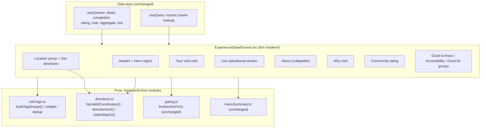

# Design Document

## Overview

This feature is a client-side presentation and layout reorganization of the mobile
`ExperienceDetailScreen` (`apps/mobile/src/screens/catalog/ExperienceDetailScreen.tsx`)
and its supporting pure module `infoTags.ts`. No backend, API, or DTO changes are involved;
the screen keeps consuming the existing `ExperienceDetailDTO` fields and the same
data-fetching, mutation, gating, and threshold behaviors.

The redesign delivers eight user-visible changes plus one developer-facing invariant:

1. **Grouped info tags** — the single flat `buildInfoTags()` row becomes four labeled
   `Tag_Group`s (Location, Good to know, Accessibility, Good for), each omitted when empty.
2. **Human-friendly labels** — raw slugs like `no-service-animals` are relabeled to readable
   text via a lookup map, with a hyphen/underscore-to-space fallback.
3. **De-duplication** — repeated display labels are collapsed to a single occurrence per group.
4. **Get directions** — raw coordinates are dropped as a tag; valid latitude/longitude power a
   "Get directions" action that opens the OS maps app.
5. **Collapsible About** — the description collapses to 4 lines with a "Read more" / "Read less"
   toggle.
6. **Consolidated "Your visit" card** — completion, rating, and note controls move into one card.
7. **Reordered sections** — personal and live information are promoted above the long
   descriptive content.
8. **Static map preview** — a static, non-interactive `<Image>` map preview (previously deferred, now
   in scope) renders in the Location area, centered on the Experience's coordinates with a pin overlaid at
   the image center, gated by the same coordinate-validity check as Get directions. The image is sourced
   from the keyless ArcGIS basemap export endpoint (a bbox centered on the coordinate). Tapping it opens the
   OS maps app (matching Get directions), and it degrades gracefully — hiding just the image — when the image
   fails to load.
9. **Pure core contract** — the grouping/relabeling/de-duplication logic stays framework-free in
   `infoTags.ts`, and the static-map-URL builder stays framework-free in `directions.ts`, so both are
   unit- and property-testable without rendering.

The core architectural strategy mirrors the existing codebase pattern (see `destinations.ts`,
`catalogGrouping.ts`, `menuSummary.ts`, `gating.ts`): **push all pure derivation logic into
framework-free modules** and keep the screen a thin renderer over those pure results. This makes
the grouping, relabeling, de-duplication, coordinate-validation, and directions-URL logic
property-testable in isolation, while the screen itself is validated with example-based
React Native Testing Library render tests.

### Research Notes

- **Dependencies (`apps/mobile/package.json`)**: The workspace has `fast-check@^3.21.0` for
  property-based testing (already used by `infoTags.prop.test.ts`, `menuSummary.prop.test.ts`,
  etc.), `@testing-library/react-native@^13.2.0` for render tests, and Jest via `jest-expo`.
  No native map library (`react-native-maps` / `expo-maps`) and no `expo-linking` are installed.
- **Opening the OS maps app**: React Native core exports `Linking` (`Linking.openURL`,
  `Linking.canOpenURL`) with no extra dependency. This is the mechanism the `Get_Directions_Action`
  will use. Platform-appropriate URLs: `https://maps.apple.com/?ll=<lat>,<lng>` works on iOS and as
  a universal web fallback; `geo:<lat>,<lng>?q=<lat>,<lng>` is the Android convention. A
  `https://www.google.com/maps/search/?api=1&query=<lat>,<lng>` URL is a robust cross-platform
  fallback that every device can open in a browser if no native maps app handles the scheme.
- **Line-clamp / overflow detection in React Native**: `Text` supports `numberOfLines` for visual
  clamping, and the `onTextLayout` event reports the actual laid-out `lines` array. Rendering the
  text once unclamped (or reading `nativeEvent.lines.length` on first layout) is the standard way to
  decide whether the content exceeds the collapsed limit and therefore whether to show the toggle.
- **Existing pure-core conventions**: `infoTags.ts` already defines `isNonEmpty` (non-whitespace
  string) and `isFiniteNumber` (finite coordinate) presence predicates, an `InfoTag` shape with a
  mandatory `accessibilityLabel`, and total, never-throwing folds. The redesign extends this module
  rather than replacing it, and preserves the `priceTierListTag` and `resortAreaLabel` exports
  unchanged (R9.4).

## Architecture

The redesign keeps the existing layered separation and adds one pure grouping layer:



**Key architectural decisions:**

- **Grouping lives in `infoTags.ts`, not the screen.** A new pure `buildTagGroups()` produces the
  ordered, relabeled, de-duplicated `Tag_Group[]`. The screen maps that array to rendered cards.
  This satisfies R9 (framework-free core) and makes R1/R2/R3 property-testable.
- **Directions logic is a new pure module `directions.ts`.** Coordinate range validation
  (R4.2/R4.3) and URL construction (R4.4) are pure functions; only the actual `Linking.openURL`
  call and its error handling (R4.5) live in the screen. This keeps the validate/build logic
  property-testable and isolates the single side-effect.
- **The screen remains a thin renderer.** Section ordering (R7), the collapsible About (R5), and
  the consolidated "Your visit" card (R6) are composition/UI concerns handled in the screen and
  small local components. They are validated with render tests rather than property tests.
- **All existing behaviors are preserved by reusing the existing sub-components** (`CompletionControls`,
  `RatingControl`, `NoteControl`, live sections, `MenuSummaryCard`, `shareEntryPoint`) and their
  `onMutated` query-invalidation wiring verbatim; only their placement changes.

## Components and Interfaces

### 1. `infoTags.ts` — pure grouping core (extended)

The module keeps `InfoTag`, `InfoTagKind`, `InfoTagExperience`, `buildInfoTags`,
`priceTierListTag`, and `resortAreaLabel`. It gains grouping types and functions:

```typescript
/** The four labeled sub-groups, in fixed render order. */
export type TagGroupId = 'location' | 'goodToKnow' | 'accessibility' | 'goodFor';

/** A labeled sub-group of Info_Tags ready to render. */
export interface TagGroup {
  readonly id: TagGroupId;
  /** Human-facing group label: "Location" | "Good to know" | "Accessibility" | "Good for". */
  readonly label: string;
  /** De-duplicated, relabeled, order-preserved tags for this group (always non-empty). */
  readonly tags: readonly InfoTag[];
}

/**
 * Build the ordered, relabeled, de-duplicated Tag_Groups for an Experience detail view.
 * Pure and total — never throws; returns [] for an Experience with no renderable tags.
 * Groups are emitted in the fixed order location -> goodToKnow -> accessibility -> goodFor,
 * omitting any group whose tag list is empty (R1.6, R1.8).
 */
export function buildTagGroups(
  experience: TagGroupExperience,
  resortName: string | null,
): readonly TagGroup[];

/**
 * Map a raw accessibility slug to its human-friendly label, or humanize it via the
 * separator-collapsing fallback when unmapped (R2.1, R2.2, R2.3).
 */
export function relabelTagValue(value: string): string;
```

- **`TagGroupExperience`** extends the current `InfoTagExperience` `Pick` with `park` (for the
  Location group) — all sourced from the existing `ExperienceDetailDTO`, so no DTO change.
- **Group assignment (R1.1–R1.5):**
  - `location`: park, land, resort, resort-area (in that fixed order).
  - `goodToKnow`: height-requirement, indoor/outdoor, ride-intensity (in that fixed order).
  - `accessibility`: service-animal tag, then ambulatory tag.
  - `goodFor`: age facet tags, then interest facet tags.
- **Relabeling (R2):** `relabelTagValue` looks up an `ACCESSIBILITY_LABELS` map
  (`{'no-service-animals': 'Service animals not permitted', ...}`) using an exact,
  whitespace-trimmed, case-sensitive key match; on miss it replaces every `-`/`_` with a space,
  collapses consecutive separators to one space, and trims. Each tag's `accessibilityLabel` is
  preserved/derived so assistive tech reads the friendly label (R2.4, R2.5).
- **De-duplication (R3):** within each group, tags whose relabeled+trimmed display label is a
  case-sensitive duplicate of an earlier tag in the same group are dropped, keeping the first
  occurrence (and its `accessibilityLabel`). De-dup is per-group, so the same label may appear in
  two different groups (R3.3).
- **Presence/omission (R1.2–R1.6, R9.3):** a tag is emitted only when its enrichment value is
  present and non-empty (non-null, non-undefined, ≥1 non-whitespace char for strings; finite
  number for coordinates). Empty groups (including their labels) are omitted (R1.6). Coordinates
  are never emitted as a tag (R4.1) — the coordinates `InfoTagKind` is removed from grouped output.

### 2. `directions.ts` — new pure directions core

```typescript
/** True iff lat ∈ [-90, 90] and lng ∈ [-180, 180], both finite (R4.2, R4.3). */
export function hasValidCoordinates(
  latitude: number | null | undefined,
  longitude: number | null | undefined,
): boolean;

/**
 * Build the platform-appropriate maps URL for the given coordinates (R4.4).
 * `platform` defaults to a cross-platform web maps URL so the function is
 * deterministic and testable; the screen passes the actual OS platform.
 */
export function directionsUrl(
  latitude: number,
  longitude: number,
  platform?: 'ios' | 'android' | 'web',
): string;

/**
 * Build a keyless static map image URL whose requested bbox is centered on the
 * given coordinates (R10.3, R10.4). Pure, framework-free, total, and
 * deterministic for valid finite inputs (R10.9, R10.10). A marker is overlaid
 * at the image center by the screen (the ArcGIS export has no built-in marker).
 */
export function staticMapUrl(
  latitude: number,
  longitude: number,
  options?: {
    /** Image width in pixels; defaults to 600. */
    width?: number;
    /** Image height in pixels; defaults to 300. */
    height?: number;
    /** Latitudinal span of the bbox in degrees; defaults to 0.01. */
    spanDegrees?: number;
  },
): string;
```

Only the actual `Linking.openURL(directionsUrl(...))` call, its `catch`, and the resulting error
indication live in the screen (R4.4, R4.5).

**`staticMapUrl` provider and encoding (R10.3, R10.4, R10.9, R10.10):** the builder targets the
keyless ArcGIS basemap export endpoint at
`https://server.arcgisonline.com/ArcGIS/rest/services/<service>/MapServer/export`, which
requires no API key, access token, or secret. (The originally-planned `staticmap.openstreetmap.de`
service was found to be defunct — its host no longer resolves — so it was replaced by ArcGIS.) It
composes the query string from:

- the target basemap `service` defaults to `World_Imagery` (satellite imagery), which shows
  recognizable building/park detail; any keyless ArcGIS basemap service works,
- `bbox=<xmin>,<ymin>,<xmax>,<ymax>` — a bounding box in EPSG:4326 (`lngMin,latMin,lngMax,latMax`)
  **centered on the exact coordinate**: `halfLat = spanDegrees / 2` (default span `0.001`, a
  tight building-level ~110 m view) and
  `halfLng = halfLat * (width / height)` so the bbox aspect matches the image and the map is not
  grossly distorted,
- `bboxSR=4326` — the bbox spatial reference,
- `size=<w>,<h>` — image dimensions (default `600,300`),
- `format=png`, `f=image` — request a PNG image.

The function stringifies every number verbatim so the returned URL encodes a bbox whose center equals
the exact latitude and longitude (R10.3, R10.10). Because the coordinate sits at the bbox center, the
screen overlays a pin at the image center to mark it (the ArcGIS export has no built-in marker). It
performs no I/O and no clamping; for any finite latitude in [-90, 90] and longitude in [-180, 180] it
returns a defined string, never throws, and yields an equal URL for equal inputs — making it
deterministic and total (R10.9, R10.10). The existing `hasValidCoordinates` and `directionsUrl` exports
remain in this module unchanged; the same `hasValidCoordinates` gate that governs the
`Get_Directions_Action` also governs whether the screen builds and renders a `Static_Map_Url`.

### 3. `ExperienceDetailScreen.tsx` — thin renderer (reorganized)

The screen's data layer (`useQueries` for detail/completion/rating/note/aggregate/live, plus the
gated `resorts` lookup), loading/error gating, and Share entry point are **unchanged**. The
`ScrollView` body is reordered and its content recomposed:

Rendered top-to-bottom (R7.1), each section omitted when it has no content (R7.5):

1. **Header + hero region** — `GradientHeader`, `ExperienceHero`, Park/category badges, Share button.
2. **Location group + static map preview + Get directions** — the `location` `TagGroup` (if
   present), the `Static_Map_Preview`, and the `Get_Directions_Action` rendered within the Location
   area. The `Static_Map_Preview` and the `Get_Directions_Action` are both gated by the **same**
   `hasValidCoordinates(latitude, longitude)` check (R4.2, R10.1, R10.2).
3. **`YourVisitCard`** — consolidated completion → rating → note controls (R6).
4. **`LiveOperationalSection`** — unchanged component, at most one section by category (R8.3).
5. **`MenuSummaryCard`** — for Restaurants, rendered between the live section and About (R7.4).
6. **`AboutSection`** — collapsible description (R5).
7. **`WhyThisSection`** — unchanged (R8.10, R8.11).
8. **`Community_Rating_Section`** — unchanged `AggregateContent` (R8.5, R8.6).
9. **Remaining groups** — the `goodToKnow`, `accessibility`, `goodFor` `TagGroup`s (if present).

### 4. `YourVisitCard` — new local component

A single `Card` with a "Your visit" `SectionLabel` that renders, in fixed vertical order (R6.1):
`CompletionSection` → `RatingSection` → `NoteSection`. It reuses the **exact existing**
`CompletionControls` / `RatingControl` / `NoteControl` components and the same per-control
loading/error/empty rendering (`QueryLike` branches) and `onMutated` invalidation callbacks
(`['experience-completion', id]` + `['me-stats']`; `['experience-rating', id]` +
`['experience-aggregate', id]`; `['experience-note', id]`) — preserving R6.2–R6.10 and R8.1–R8.2.
Each control's loading/error/empty/disabled state stays independent of the other two (R6.5, R6.6,
R6.9).

### 5. `AboutSection` — new local component

Renders the description with a collapse limit of 4 lines (R5.1). Uses `Text` `numberOfLines={4}`
while collapsed and unclamped while expanded. On first layout it measures whether the description
exceeds 4 lines (via `onTextLayout` line count) to decide whether to show the `Read_More_Toggle`
(R5.2, R5.3). Initial state is collapsed when the text overflows (R5.9). The toggle shows
"Read more" while collapsed (R5.4) and "Read less" while expanded (R5.6); activating it toggles the
state (R5.5, R5.7) and always carries a non-empty accessibility label reflecting the current action
(R5.10). When the description is absent/empty/whitespace-only it renders the existing
"No description available." empty state and no toggle (R5.8).

### 6. `Static_Map_Preview` within the Location area — new local rendering

Rendered inside the Location group area of `ExperienceDetailScreen.tsx` (alongside the
`Get_Directions_Action`), gated by the **same** `hasValidCoordinates(latitude, longitude)` predicate
already used for Get directions (R10.1, R10.2). When coordinates are valid the screen builds
`staticMapUrl(latitude, longitude)` and renders the preview as a tappable `<Image>` wrapped in a
`Pressable` (touchable):

- **Image source (R10.3, R10.4):** the `<Image source={{ uri: staticMapUrl(...) }}>` displays the
  keyless ArcGIS static map whose bbox is centered on the coordinates, with a pin `<Ionicons>` overlaid
  at the image center (which coincides with the coordinate) since the ArcGIS export has no built-in marker.
- **Tap behavior (R10.5, R10.6):** activating the touchable invokes the **same** open-OS-maps behavior
  as the `Get_Directions_Action` — `Linking.openURL(directionsUrl(...))` wrapped in the same
  `try/catch` (and/or `canOpenURL`), so a failure to open sets the same inline error indication and
  preserves the current screen state.
- **Load-error degradation (R10.7):** the `<Image>` `onError` handler sets a local
  `mapImageFailed` state flag; when set, the screen omits the `<Image>` while continuing to render the
  rest of the Location group content, including the `Get_Directions_Action`. Only the image is hidden.
- **Accessibility (R10.8):** the preview carries a non-empty `accessibilityLabel` describing the map
  preview for the Experience (e.g. a "Map preview of {name}. Tap for directions."-style label).

The `Get_Directions_Action` button remains rendered independently of the preview; the two share only
the coordinate-validity gate and the open-maps side effect.

## Data Models

All models are existing DTO shapes consumed as-is; no new persisted or wire models are introduced.

- **`ExperienceDetailDTO`** (screen-local, mirrors the backend `ExperienceDetailResponse`): source
  of `park`, `land`, `areaType`, `resortId`, `resortArea`, `latitude`, `longitude`, `accessibility`,
  `heightRequirement`, `physicalConsiderations`, `interestFacets`, `groupedFacets`, `description`,
  `menus`, `whyThis`, `category`. Unchanged.
- **`InfoTag`** (`{ kind, label, accessibilityLabel }`): unchanged shape; grouped output reuses it.
- **`TagGroup`** (`{ id, label, tags }`): new pure return shape (in-memory only).
- **`TagGroupId`**: `'location' | 'goodToKnow' | 'accessibility' | 'goodFor'`.
- **`ACCESSIBILITY_LABELS`**: a static `Record<string, string>` slug→label map, including
  `'no-service-animals' → 'Service animals not permitted'` (R2.2).
- **`Static_Map_Url`**: an in-memory derived `string` produced by `staticMapUrl(latitude, longitude)`
  from the existing `latitude`/`longitude` DTO fields. It is not persisted and introduces no new
  persisted or wire model.
- **DTOs used unchanged for the "Your visit" card and sections**: `CompletionDTO`, `RatingDTO`,
  `NoteDTO`, `AggregateRatingDTO`, `LiveDetailResponseDTO`, `MenuDTO`, `WhyThisDTO`.

## Correctness Properties

*A property is a characteristic or behavior that should hold true across all valid executions of a
system — essentially, a formal statement about what the system should do. Properties serve as the
bridge between human-readable specifications and machine-verifiable correctness guarantees.*

These properties target the pure, framework-free cores (`infoTags.ts`, `directions.ts`,
`shareEntryPoint.ts`, `gating.ts`) where behavior varies meaningfully with input and 100+ generated
iterations reveal edge cases. UI composition, ordering, and interaction criteria (R5, R6, R7, most
of R8) are validated with example-based render tests described in the Testing Strategy, not with
property tests.

### Property 1: Tag partition

*For any* Experience input and resort name, every Info_Tag emitted by `buildTagGroups` belongs to
exactly one `Tag_Group` — no emitted tag is assigned to zero groups and none to more than one — and
every emitted group id is one of `location`, `goodToKnow`, `accessibility`, `goodFor`.

**Validates: Requirements 1.1, 9.2**

### Property 2: Group order and non-emptiness

*For any* Experience input, the sequence of emitted group ids is a subsequence of the canonical
order `[location, goodToKnow, accessibility, goodFor]` (present groups preserve that relative
order, absent groups are omitted), and no emitted group has an empty `tags` array.

**Validates: Requirements 1.6, 1.8**

### Property 3: Intra-group ordering and omission

*For any* Experience input, the tags within each emitted group are a subsequence of that group's
canonical field order (Location: park → land → resort → resort-area; Good to know: height →
indoor/outdoor → ride-intensity; Accessibility: service-animal → ambulatory; Good for: age facets →
interest facets), preserving the relative order of present fields and omitting any field whose
enrichment value is absent or empty.

**Validates: Requirements 1.2, 1.3, 1.4, 1.5**

### Property 4: Presence gating and trimming

*For any* Experience input, `buildTagGroups` emits a tag for an enrichment source if and only if
that source is present and non-empty (a string that is non-null, non-undefined, and contains at
least one non-whitespace character; a coordinate that is a finite number), and every emitted tag's
display label is trimmed of leading and trailing whitespace.

**Validates: Requirements 9.3**

### Property 5: Relabeling

*For any* string value, `relabelTagValue` returns the mapped human-friendly label when the value
(whitespace-trimmed, case-sensitive) matches a key in the accessibility label map; otherwise it
returns the value with every hyphen and underscore replaced by a single space, consecutive
separators collapsed to a single space, and no leading or trailing whitespace.

**Validates: Requirements 2.1, 2.3**

### Property 6: Accessible text always present

*For any* Experience input, every emitted Info_Tag exposes non-empty accessible text — its
`accessibilityLabel` when one is generated, otherwise its display label — so no tag is ever
presented without a non-empty screen-reader alternative.

**Validates: Requirements 2.4, 2.5**

### Property 7: Per-group de-duplication

*For any* Experience input, within each emitted group the tag display labels (compared as
case-sensitive string identity after relabeling and trimming) are unique; when duplicates occur the
first occurrence in persisted order is retained along with its accessibility label and later
matching occurrences are dropped; and de-duplication is applied independently per group so a label
occurring in more than one group is retained once in each group in which it occurs.

**Validates: Requirements 3.1, 3.2, 3.3**

### Property 8: Coordinates are never a tag

*For any* Experience input — including one carrying finite latitude and longitude — no Info_Tag
emitted by `buildTagGroups` represents raw coordinates.

**Validates: Requirements 4.1**

### Property 9: Coordinate validity gate

*For any* latitude and longitude values, `hasValidCoordinates` returns true if and only if both are
finite numbers with latitude in the range -90 to 90 inclusive and longitude in the range -180 to
180 inclusive.

**Validates: Requirements 4.2, 4.3**

### Property 10: Directions URL encodes coordinates

*For any* valid latitude and longitude, the string produced by `directionsUrl` encodes the exact
latitude and longitude values that were passed in.

**Validates: Requirements 4.4**

### Property 11: Share entry enablement

*For any* combination of the detail, rating, and note loading flags,
`isExperienceShareEntryEnabled` reports the entry point as enabled if and only if none of the three
are loading.

**Validates: Requirements 8.1**

### Property 12: At most one live section by category

*For any* Experience category, `liveSectionFor` returns exactly one `LiveSection` value, so the
screen selects at most one Live_Operational_Section based solely on category.

**Validates: Requirements 8.3**

### Property 13: Community aggregate formatting

*For any* non-null community aggregate, the Community_Rating_Section renders the mean rounded to one
decimal place (equal to `value.toFixed(1)`) together with the rating count.

**Validates: Requirements 8.6**

### Property 14: Preserved price/area label outputs

*For any* inputs, `priceTierListTag` and `resortAreaLabel` produce output equal to their
pre-redesign reference computation (identical price-tier tag shape/label, and the trimmed
Resort_Area label or null under the same area/value conditions).

**Validates: Requirements 9.4**

### Property 15: Grouping is total

*For any* Experience input — including inputs with null fields, undefined fields, and empty
collections — `buildTagGroups` returns a defined array and never throws.

**Validates: Requirements 9.5**

### Property 16: Grouping is deterministic

*For any* Experience input, invoking `buildTagGroups` twice with equal input produces output with
the same groups, tag order, tag values, and labels on both invocations.

**Validates: Requirements 9.6**

### Property 17: Static map URL encodes coordinates as the bbox center

*For any* valid finite latitude and longitude, the string produced by `staticMapUrl` contains a
`bbox` parameter of four numeric values whose center — `((xmin + xmax) / 2, (ymin + ymax) / 2)` —
equals the exact longitude and latitude values that were passed in (within floating-point tolerance).

**Validates: Requirements 10.3, 10.10**

### Property 18: Static map URL is total and deterministic for valid inputs

*For any* valid finite latitude in the range -90 to 90 inclusive and longitude in the range -180 to
180 inclusive, `staticMapUrl` returns a defined string and never throws, and invoking it twice with
equal inputs yields equal URLs.

**Validates: Requirements 10.9, 10.10**

## Error Handling

- **Get directions failure (R4.5):** the screen wraps `Linking.openURL(directionsUrl(...))` in a
  `try/catch` (and/or checks `Linking.canOpenURL`). On rejection or an unopenable URL it sets a
  local error flag that renders an inline, non-blocking error indication (matching the existing
  danger-text pattern) and leaves every other section of the screen intact. The action is never
  rendered at all when coordinates are invalid (R4.3), so this path only handles genuine OS failures.
- **Static map preview failures (R10.6, R10.7):** a failure to open the OS maps app on tap reuses the
  same Get-directions error path above (inline error indication, screen state preserved). An image
  load failure (`<Image>` `onError`) sets a local `mapImageFailed` flag that hides only the map image
  while the rest of the Location group content, including the `Get_Directions_Action`, keeps rendering.
- **Per-control mutation and load failures inside "Your visit" (R6.5, R6.6, R6.10):** unchanged —
  the reused `CompletionControls` / `RatingControl` / `NoteControl` own their inline error copy,
  busy gating, and last-value retention. `isError` takes precedence over the loading indicator per
  control, and each control's state is independent of the other two.
- **Live retrieval failure (R8.4):** unchanged — `LiveOperationalSection` renders the
  `LiveUnavailableIndicator` while all static detail fields remain visible.
- **Detail query failure (R8.9):** unchanged — the screen renders the existing error empty state
  together with the `LiveUnavailableIndicator`.
- **Community aggregate load failure:** unchanged — `AggregateContent` renders its error text; a
  null value renders "Not enough ratings yet" (R8.5).
- **Pure-core robustness (R9.5, R10.9):** `buildTagGroups`, `relabelTagValue`, `hasValidCoordinates`,
  `directionsUrl`, and `staticMapUrl` are total and never throw on their valid inputs (and on
  null/undefined/empty inputs for the grouping functions); missing or malformed enrichment simply
  produces fewer (or no) tags rather than an error.

## Testing Strategy

The feature uses the workspace's existing tooling: **Jest** (via `jest-expo`) with
**`fast-check@^3.21.0`** for property tests and **`@testing-library/react-native`** for render
tests. Tests live under `apps/mobile/src/screens/catalog/__tests__/` alongside the existing suites.

### Property-based tests

Property tests target the pure cores. Each property test:

- runs a **minimum of 100 iterations** (`fc.assert(..., { numRuns: 100 })`), matching the existing
  `infoTags.prop.test.ts` convention;
- is tagged with a comment referencing its design property in the format
  **`Feature: experience-detail-redesign, Property {number}: {property_text}`**;
- implements exactly one correctness property with a single property-based test;
- reuses fast-check generators that deliberately span present, null, undefined, whitespace-only, and
  duplicate values (extending the generators already in `infoTags.prop.test.ts`).

Coverage: Properties 1–8 and 14–16 against `infoTags.ts` (`buildTagGroups`, `relabelTagValue`,
`priceTierListTag`, `resortAreaLabel`); Properties 9–10 and 17–18 against `directions.ts`
(`hasValidCoordinates`, `directionsUrl`, and `staticMapUrl`), each run with fast-check at 100+
iterations; Property 11 against `shareEntryPoint.ts`; Property 12 against `gating.ts` (already
largely covered — extend if needed); Property 13 against the aggregate formatting helper.

### Unit / example-based render tests

Example-based tests (React Native Testing Library) cover the UI composition and interaction criteria
that are not universal properties:

- **Info-tag rendering (R1.7, R2.2):** exact group labels; `no-service-animals` renders as
  "Service animals not permitted".
- **Get directions (R4.5, R4.6):** with `Linking.openURL` mocked — success calls it with the built
  URL; rejection/`canOpenURL` false shows the error indication while other content persists; the
  control exposes a non-empty accessibility label.
- **Static map preview (R10.1, R10.2, R10.5, R10.6, R10.7, R10.8):** renders the `<Image>` preview when
  coordinates are valid and omits it when latitude/longitude are missing or out of range; tapping the
  preview (with `Linking.openURL` mocked) invokes the same open-OS-maps behavior as Get directions and
  shows the error indication on failure while preserving screen state; firing the `<Image>` `onError`
  hides the map image while the `Get_Directions_Action` and the rest of the Location content remain
  rendered; the preview exposes a non-empty accessibility label.
- **Collapsible About (R5.1–R5.10):** collapsed shows `numberOfLines={4}` and "Read more"; toggling
  expands to full text and "Read less" and re-collapses; overflow detection shows/hides the toggle;
  absent/empty/whitespace description (edge cases) shows "No description available." with no toggle.
- **Your visit card (R6.1–R6.10):** fixed control order; per-control loading/error/empty/disabled
  independence; `onMutated` triggers the exact query invalidations (`['experience-completion', id]`
  + `['me-stats']`; `['experience-rating', id]` + `['experience-aggregate', id]`;
  `['experience-note', id]`); preserved accessibility labels.
- **Section ordering (R7.1–R7.5):** fully-populated render asserts the top-to-bottom section order;
  sparse render asserts omitted sections and preserved relative order; Restaurant places the
  Menu_Summary_Card between the live section and About.
- **Preserved behaviors (R8.2, R8.4, R8.5, R8.7, R8.8, R8.9, R8.10, R8.11):** Share navigation with
  built params; live-unavailable indicator on live failure; aggregate empty/populated states;
  Restaurant menu card; detail loading/error states; "Why visit" omission when absent or fully
  duplicating the description.

### Static / smoke tests

- **R9.1:** a static assertion (or lint rule) that `infoTags.ts` imports neither React nor
  react-navigation, preserving the framework-free contract.

### Balance

Property tests carry the comprehensive input coverage for the grouping, relabeling,
de-duplication, coordinate, and preservation logic; example tests carry the concrete UI structure,
ordering, interaction, and integration-point assertions. The two are complementary and together
give full coverage of the testable acceptance criteria.
