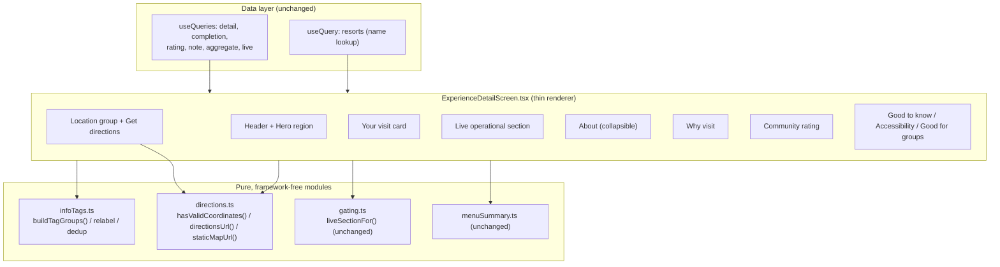
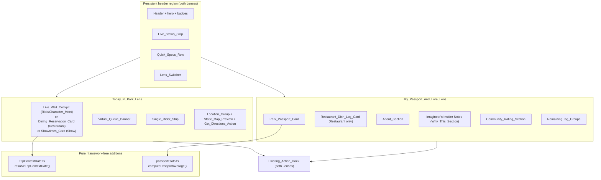

# Design Document

## Overview

This feature is a client-side presentation and layout reorganization of the mobile
`ExperienceDetailScreen` (`apps/mobile/src/screens/catalog/ExperienceDetailScreen.tsx`)
and its supporting pure module `infoTags.ts`. No backend, API, or DTO changes are involved;
the screen keeps consuming the existing `ExperienceDetailDTO` fields and the same
data-fetching, mutation, gating, and threshold behaviors.

The redesign delivers eight user-visible changes plus one developer-facing invariant:

1. **Grouped info tags** — the single flat `buildInfoTags()` row becomes four labeled
   `Tag_Group`s (Location, Good to know, Accessibility, Good for), each omitted when empty.
2. **Human-friendly labels** — raw slugs like `no-service-animals` are relabeled to readable
   text via a lookup map, with a hyphen/underscore-to-space fallback.
3. **De-duplication** — repeated display labels are collapsed to a single occurrence per group.
4. **Get directions** — raw coordinates are dropped as a tag; valid latitude/longitude power a
   "Get directions" action that opens the OS maps app.
5. **Collapsible About** — the description collapses to 4 lines with a "Read more" / "Read less"
   toggle.
6. **Consolidated "Your visit" card** — completion, rating, and note controls move into one card.
7. **Reordered sections** — personal and live information are promoted above the long
   descriptive content.
8. **Static map preview** — a static, non-interactive `<Image>` map preview (previously deferred, now
   in scope) renders in the Location area, centered on the Experience's coordinates with a pin overlaid at
   the image center, gated by the same coordinate-validity check as Get directions. The image is sourced
   from the keyless ArcGIS basemap export endpoint (a bbox centered on the coordinate). Tapping it opens the
   OS maps app (matching Get directions), and it degrades gracefully — hiding just the image — when the image
   fails to load.
9. **Pure core contract** — the grouping/relabeling/de-duplication logic stays framework-free in
   `infoTags.ts`, and the static-map-URL builder stays framework-free in `directions.ts`, so both are
   unit- and property-testable without rendering.

The core architectural strategy mirrors the existing codebase pattern (see `destinations.ts`,
`catalogGrouping.ts`, `menuSummary.ts`, `gating.ts`): **push all pure derivation logic into
framework-free modules** and keep the screen a thin renderer over those pure results. This makes
the grouping, relabeling, de-duplication, coordinate-validation, and directions-URL logic
property-testable in isolation, while the screen itself is validated with example-based
React Native Testing Library render tests.

### Research Notes

- **Dependencies (`apps/mobile/package.json`)**: The workspace has `fast-check@^3.21.0` for
  property-based testing (already used by `infoTags.prop.test.ts`, `menuSummary.prop.test.ts`,
  etc.), `@testing-library/react-native@^13.2.0` for render tests, and Jest via `jest-expo`.
  No native map library (`react-native-maps` / `expo-maps`) and no `expo-linking` are installed.
- **Opening the OS maps app**: React Native core exports `Linking` (`Linking.openURL`,
  `Linking.canOpenURL`) with no extra dependency. This is the mechanism the `Get_Directions_Action`
  will use. Platform-appropriate URLs: `https://maps.apple.com/?ll=<lat>,<lng>` works on iOS and as
  a universal web fallback; `geo:<lat>,<lng>?q=<lat>,<lng>` is the Android convention. A
  `https://www.google.com/maps/search/?api=1&query=<lat>,<lng>` URL is a robust cross-platform
  fallback that every device can open in a browser if no native maps app handles the scheme.
- **`Linking.canOpenURL` must NOT gate the open attempt (R4.8)**: from Android 11 (API 30) onward,
  package-visibility filtering makes `canOpenURL` resolve `false` for any non-`http(s)` scheme unless
  that scheme is declared in a native `<queries>` manifest element. Expo Go's manifest declares no
  `geo` scheme and the app registers no custom config plugin adding one, so `canOpenURL('geo:…')`
  resolves `false` on every Android dev client — while `openURL('geo:…')` succeeds, because launching
  an implicit intent is *not* subject to package-visibility filtering. A `canOpenURL` pre-check is
  therefore a false-negative gate that suppresses a working open. `openURL` already rejects when no
  activity can handle the URL, so `try/catch` around `openURL` is both sufficient and strictly more
  accurate. Cross-platform reference for the `canOpenURL`/`openURL` divergence:
  [react-native issue #32311](https://github.com/facebook/react-native/issues/32311) and the
  [react-native-phone-call notes on the `<queries>` requirement](https://github.com/tiaanduplessis/react-native-phone-call).
  (Content was rephrased for compliance with licensing restrictions.)
- **Ordered candidate list (R4.7, R4.9)**: the screen tries the platform-native URL first and falls
  back to the universal `https` web maps URL, so a device with no native maps handler (a bare Android
  emulator without Google Maps, for instance) still gets a map in the browser instead of an error. The
  error indication is reserved for the case where every candidate rejects.
- **Line-clamp / overflow detection in React Native**: `Text` supports `numberOfLines` for visual
  clamping, and the `onTextLayout` event reports the actual laid-out `lines` array. Rendering the
  text once unclamped (or reading `nativeEvent.lines.length` on first layout) is the standard way to
  decide whether the content exceeds the collapsed limit and therefore whether to show the toggle.
- **Existing pure-core conventions**: `infoTags.ts` already defines `isNonEmpty` (non-whitespace
  string) and `isFiniteNumber` (finite coordinate) presence predicates, an `InfoTag` shape with a
  mandatory `accessibilityLabel`, and total, never-throwing folds. The redesign extends this module
  rather than replacing it, and preserves the `priceTierListTag` and `resortAreaLabel` exports
  unchanged (R9.4).

## Architecture

The redesign keeps the existing layered separation and adds one pure grouping layer:


```mermaid
flowchart TD
    subgraph Screen["ExperienceDetailScreen.tsx (thin renderer)"]
        Header["Header + Hero region"]
        LocationBlock["Location group + Get directions"]
        YourVisit["Your visit card"]
        Live["Live operational section"]
        About["About (collapsible)"]
        Why["Why visit"]
        Community["Community rating"]
        RemainingGroups["Good to know / Accessibility / Good for groups"]
    end

    subgraph PureCore["Pure, framework-free modules"]
        InfoTags["infoTags.ts\nbuildTagGroups() / relabel / dedup"]
        Directions["directions.ts\nhasValidCoordinates() / directionsUrl() / staticMapUrl()"]
        Gating["gating.ts\nliveSectionFor() (unchanged)"]
        MenuSummary["menuSummary.ts (unchanged)"]
    end

    subgraph Data["Data layer (unchanged)"]
        Queries["useQueries: detail, completion,\nrating, note, aggregate, live"]
        ResortQ["useQuery: resorts (name lookup)"]
    end

    Queries --> Screen
    ResortQ --> Screen
    Screen --> InfoTags
    Screen --> Directions
    Screen --> Gating
    Screen --> MenuSummary
    LocationBlock --> Directions
```

**Key architectural decisions:**

- **Grouping lives in `infoTags.ts`, not the screen.** A new pure `buildTagGroups()` produces the
  ordered, relabeled, de-duplicated `Tag_Group[]`. The screen maps that array to rendered cards.
  This satisfies R9 (framework-free core) and makes R1/R2/R3 property-testable.
- **Directions logic is a new pure module `directions.ts`.** Coordinate range validation
  (R4.2/R4.3) and URL construction (R4.4) are pure functions; only the actual `Linking.openURL`
  call and its error handling (R4.5) live in the screen. This keeps the validate/build logic
  property-testable and isolates the single side-effect.
- **The screen remains a thin renderer.** Section ordering (R7), the collapsible About (R5), and
  the consolidated "Your visit" card (R6) are composition/UI concerns handled in the screen and
  small local components. They are validated with render tests rather than property tests.
- **All existing behaviors are preserved by reusing the existing sub-components** (`CompletionControls`,
  `RatingControl`, `NoteControl`, live sections, `MenuSummaryCard`, `shareEntryPoint`) and their
  `onMutated` query-invalidation wiring verbatim; only their placement changes.

## Components and Interfaces

### 1. `infoTags.ts` — pure grouping core (extended)

The module keeps `InfoTag`, `InfoTagKind`, `InfoTagExperience`, `buildInfoTags`,
`priceTierListTag`, and `resortAreaLabel`. It gains grouping types and functions:

```typescript
/** The four labeled sub-groups, in fixed render order. */
export type TagGroupId = 'location' | 'goodToKnow' | 'accessibility' | 'goodFor';

/** A labeled sub-group of Info_Tags ready to render. */
export interface TagGroup {
  readonly id: TagGroupId;
  /** Human-facing group label: "Location" | "Good to know" | "Accessibility" | "Good for". */
  readonly label: string;
  /** De-duplicated, relabeled, order-preserved tags for this group (always non-empty). */
  readonly tags: readonly InfoTag[];
}

/**
 * Build the ordered, relabeled, de-duplicated Tag_Groups for an Experience detail view.
 * Pure and total — never throws; returns [] for an Experience with no renderable tags.
 * Groups are emitted in the fixed order location -> goodToKnow -> accessibility -> goodFor,
 * omitting any group whose tag list is empty (R1.6, R1.8).
 */
export function buildTagGroups(
  experience: TagGroupExperience,
  resortName: string | null,
): readonly TagGroup[];

/**
 * Map a raw accessibility slug to its human-friendly label, or humanize it via the
 * separator-collapsing fallback when unmapped (R2.1, R2.2, R2.3).
 */
export function relabelTagValue(value: string): string;
```

- **`TagGroupExperience`** extends the current `InfoTagExperience` `Pick` with `park` (for the
  Location group) — all sourced from the existing `ExperienceDetailDTO`, so no DTO change.
- **Group assignment (R1.1–R1.5):**
  - `location`: park, land, resort, resort-area (in that fixed order).
  - `goodToKnow`: height-requirement, indoor/outdoor, ride-intensity (in that fixed order).
  - `accessibility`: service-animal tag, then ambulatory tag.
  - `goodFor`: age facet tags, then interest facet tags.
- **Relabeling (R2):** `relabelTagValue` looks up an `ACCESSIBILITY_LABELS` map
  (`{'no-service-animals': 'Service animals not permitted', ...}`) using an exact,
  whitespace-trimmed, case-sensitive key match; on miss it replaces every `-`/`_` with a space,
  collapses consecutive separators to one space, and trims. Each tag's `accessibilityLabel` is
  preserved/derived so assistive tech reads the friendly label (R2.4, R2.5).
- **De-duplication (R3):** within each group, tags whose relabeled+trimmed display label is a
  case-sensitive duplicate of an earlier tag in the same group are dropped, keeping the first
  occurrence (and its `accessibilityLabel`). De-dup is per-group, so the same label may appear in
  two different groups (R3.3).
- **Presence/omission (R1.2–R1.6, R9.3):** a tag is emitted only when its enrichment value is
  present and non-empty (non-null, non-undefined, ≥1 non-whitespace char for strings; finite
  number for coordinates). Empty groups (including their labels) are omitted (R1.6). Coordinates
  are never emitted as a tag (R4.1) — the coordinates `InfoTagKind` is removed from grouped output.

### 2. `directions.ts` — new pure directions core

```typescript
/** True iff lat ∈ [-90, 90] and lng ∈ [-180, 180], both finite (R4.2, R4.3). */
export function hasValidCoordinates(
  latitude: number | null | undefined,
  longitude: number | null | undefined,
): boolean;

/**
 * Build the platform-appropriate maps URL for the given coordinates (R4.4).
 * `platform` defaults to a cross-platform web maps URL so the function is
 * deterministic and testable; the screen passes the actual OS platform.
 */
export function directionsUrl(
  latitude: number,
  longitude: number,
  platform?: 'ios' | 'android' | 'web',
): string;

/**
 * The ordered, duplicate-free Directions_Url_Candidates the screen attempts on
 * activation (R4.7): the platform-native URL first, then the universal `https`
 * web maps URL. When `platform` is already `'web'` the two coincide and a
 * single-element list is returned. Never empty; always encodes the exact
 * coordinates in every element.
 */
export function directionsUrlCandidates(
  latitude: number,
  longitude: number,
  platform?: 'ios' | 'android' | 'web',
): readonly string[];

/**
 * Build a keyless static map image URL whose requested bbox is centered on the
 * given coordinates (R10.3, R10.4). Pure, framework-free, total, and
 * deterministic for valid finite inputs (R10.9, R10.10). A marker is overlaid
 * at the image center by the screen (the ArcGIS export has no built-in marker).
 */
export function staticMapUrl(
  latitude: number,
  longitude: number,
  options?: {
    /** Image width in pixels; defaults to 600. */
    width?: number;
    /** Image height in pixels; defaults to 300. */
    height?: number;
    /** Latitudinal span of the bbox in degrees; defaults to 0.01. */
    spanDegrees?: number;
  },
): string;
```

Only the actual `Linking.openURL(...)` calls, their `catch`, and the resulting error indication live
in the screen (R4.4, R4.5). The screen iterates `directionsUrlCandidates(lat, lng, Platform.OS)`,
awaiting `Linking.openURL(candidate)` inside `try/catch` and returning on the first success (R4.7);
it does **not** call `Linking.canOpenURL` (R4.8 — see the Research Note on Android 11 package
visibility), and it sets the error flag only after every candidate has rejected (R4.9).

**`staticMapUrl` provider and encoding (R10.3, R10.4, R10.9, R10.10):** the builder targets the
keyless ArcGIS basemap export endpoint at
`https://server.arcgisonline.com/ArcGIS/rest/services/<service>/MapServer/export`, which
requires no API key, access token, or secret. (The originally-planned `staticmap.openstreetmap.de`
service was found to be defunct — its host no longer resolves — so it was replaced by ArcGIS.) It
composes the query string from:

- the target basemap `service` defaults to `World_Imagery` (satellite imagery), which shows
  recognizable building/park detail; any keyless ArcGIS basemap service works,
- `bbox=<xmin>,<ymin>,<xmax>,<ymax>` — a bounding box in EPSG:4326 (`lngMin,latMin,lngMax,latMax`)
  **centered on the exact coordinate**: `halfLat = spanDegrees / 2` (default span `0.001`, a
  tight building-level ~110 m view) and
  `halfLng = halfLat * (width / height)` so the bbox aspect matches the image and the map is not
  grossly distorted,
- `bboxSR=4326` — the bbox spatial reference,
- `size=<w>,<h>` — image dimensions (default `600,300`),
- `format=png`, `f=image` — request a PNG image.

The function stringifies every number verbatim so the returned URL encodes a bbox whose center equals
the exact latitude and longitude (R10.3, R10.10). Because the coordinate sits at the bbox center, the
screen overlays a pin at the image center to mark it (the ArcGIS export has no built-in marker). It
performs no I/O and no clamping; for any finite latitude in [-90, 90] and longitude in [-180, 180] it
returns a defined string, never throws, and yields an equal URL for equal inputs — making it
deterministic and total (R10.9, R10.10). The existing `hasValidCoordinates` and `directionsUrl` exports
remain in this module unchanged; the same `hasValidCoordinates` gate that governs the
`Get_Directions_Action` also governs whether the screen builds and renders a `Static_Map_Url`.

### 3. `ExperienceDetailScreen.tsx` — thin renderer (reorganized)

The screen's data layer (`useQueries` for detail/completion/rating/note/aggregate/live, plus the
gated `resorts` lookup), loading/error gating, and Share entry point are **unchanged**. The
`ScrollView` body is reordered and its content recomposed:

Rendered top-to-bottom (R7.1), each section omitted when it has no content (R7.5):

1. **Header + hero region** — `GradientHeader`, `ExperienceHero`, Park/category badges, Share button.
2. **Location group + static map preview + Get directions** — the `location` `TagGroup` (if
   present), the `Static_Map_Preview`, and the `Get_Directions_Action` rendered within the Location
   area. The `Static_Map_Preview` and the `Get_Directions_Action` are both gated by the **same**
   `hasValidCoordinates(latitude, longitude)` check (R4.2, R10.1, R10.2).
3. **`YourVisitCard`** — consolidated completion → rating → note controls (R6).
4. **`LiveOperationalSection`** — unchanged component, at most one section by category (R8.3).
5. **`MenuSummaryCard`** — for Restaurants, rendered in `Today_In_Park_Lens` below the live dining section and above Location (R7.4, R14.5).
6. **`AboutSection`** — collapsible description (R5).
7. **`WhyThisSection`** — unchanged (R8.10, R8.11).
8. **`Community_Rating_Section`** — unchanged `AggregateContent` (R8.5, R8.6).
9. **Remaining groups** — the `goodToKnow`, `accessibility`, `goodFor` `TagGroup`s (if present).

### 4. `YourVisitCard` — new local component

A single `Card` with a "Your visit" `SectionLabel` that renders, in fixed vertical order (R6.1):
`CompletionSection` → `RatingSection` → `NoteSection`. It reuses the **exact existing**
`CompletionControls` / `RatingControl` / `NoteControl` components and the same per-control
loading/error/empty rendering (`QueryLike` branches) and `onMutated` invalidation callbacks
(`['experience-completion', id]` + `['me-stats']`; `['experience-rating', id]` +
`['experience-aggregate', id]`; `['experience-note', id]`) — preserving R6.2–R6.10 and R8.1–R8.2.
Each control's loading/error/empty/disabled state stays independent of the other two (R6.5, R6.6,
R6.9).

### 5. `AboutSection` — new local component

Renders the description with a collapse limit of 4 lines (R5.1). Uses `Text` `numberOfLines={4}`
while collapsed and unclamped while expanded. On first layout it measures whether the description
exceeds 4 lines (via `onTextLayout` line count) to decide whether to show the `Read_More_Toggle`
(R5.2, R5.3). Initial state is collapsed when the text overflows (R5.9). The toggle shows
"Read more" while collapsed (R5.4) and "Read less" while expanded (R5.6); activating it toggles the
state (R5.5, R5.7) and always carries a non-empty accessibility label reflecting the current action
(R5.10). When the description is absent/empty/whitespace-only it renders the existing
"No description available." empty state and no toggle (R5.8).

### 6. `Static_Map_Preview` within the Location area — new local rendering

Rendered inside the Location group area of `ExperienceDetailScreen.tsx` (alongside the
`Get_Directions_Action`), gated by the **same** `hasValidCoordinates(latitude, longitude)` predicate
already used for Get directions (R10.1, R10.2). When coordinates are valid the screen builds
`staticMapUrl(latitude, longitude)` and renders the preview as a tappable `<Image>` wrapped in a
`Pressable` (touchable):

- **Image source (R10.3, R10.4):** the `<Image source={{ uri: staticMapUrl(...) }}>` displays the
  keyless ArcGIS static map whose bbox is centered on the coordinates, with a pin `<Ionicons>` overlaid
  at the image center (which coincides with the coordinate) since the ArcGIS export has no built-in marker.
- **Tap behavior (R10.5, R10.6, R4.7-R4.9):** activating the touchable invokes the **same**
  open-OS-maps behavior as the `Get_Directions_Action` — the shared `handleGetDirections` handler that
  walks `directionsUrlCandidates(...)` with `Linking.openURL` in `try/catch` and no `canOpenURL`
  pre-check — so the inline error indication appears only when every candidate rejects, and the
  current screen state is preserved.
- **Load-error degradation (R10.7):** the `<Image>` `onError` handler sets a local
  `mapImageFailed` state flag; when set, the screen omits the `<Image>` while continuing to render the
  rest of the Location group content, including the `Get_Directions_Action`. Only the image is hidden.
- **Accessibility (R10.8):** the preview carries a non-empty `accessibilityLabel` describing the map
  preview for the Experience (e.g. a "Map preview of {name}. Tap for directions."-style label).

The `Get_Directions_Action` button remains rendered independently of the preview; the two share only
the coordinate-validity gate and the open-maps side effect.

## Data Models

All models are existing DTO shapes consumed as-is; no new persisted or wire models are introduced.

- **`ExperienceDetailDTO`** (screen-local, mirrors the backend `ExperienceDetailResponse`): source
  of `park`, `land`, `areaType`, `resortId`, `resortArea`, `latitude`, `longitude`, `accessibility`,
  `heightRequirement`, `physicalConsiderations`, `interestFacets`, `groupedFacets`, `description`,
  `menus`, `whyThis`, `category`. Unchanged.
- **`InfoTag`** (`{ kind, label, accessibilityLabel }`): unchanged shape; grouped output reuses it.
- **`TagGroup`** (`{ id, label, tags }`): new pure return shape (in-memory only).
- **`TagGroupId`**: `'location' | 'goodToKnow' | 'accessibility' | 'goodFor'`.
- **`ACCESSIBILITY_LABELS`**: a static `Record<string, string>` slug→label map, including
  `'no-service-animals' → 'Service animals not permitted'` (R2.2).
- **`Static_Map_Url`**: an in-memory derived `string` produced by `staticMapUrl(latitude, longitude)`
  from the existing `latitude`/`longitude` DTO fields. It is not persisted and introduces no new
  persisted or wire model.
- **DTOs used unchanged for the "Your visit" card and sections**: `CompletionDTO`, `RatingDTO`,
  `NoteDTO`, `AggregateRatingDTO`, `LiveDetailResponseDTO`, `MenuDTO`, `WhyThisDTO`.

## Correctness Properties

*A property is a characteristic or behavior that should hold true across all valid executions of a
system — essentially, a formal statement about what the system should do. Properties serve as the
bridge between human-readable specifications and machine-verifiable correctness guarantees.*

These properties target the pure, framework-free cores (`infoTags.ts`, `directions.ts`,
`shareEntryPoint.ts`, `gating.ts`) where behavior varies meaningfully with input and 100+ generated
iterations reveal edge cases. UI composition, ordering, and interaction criteria (R5, R6, R7, most
of R8) are validated with example-based render tests described in the Testing Strategy, not with
property tests.

### Property 1: Tag partition

*For any* Experience input and resort name, every Info_Tag emitted by `buildTagGroups` belongs to
exactly one `Tag_Group` — no emitted tag is assigned to zero groups and none to more than one — and
every emitted group id is one of `location`, `goodToKnow`, `accessibility`, `goodFor`.

**Validates: Requirements 1.1, 9.2**

### Property 2: Group order and non-emptiness

*For any* Experience input, the sequence of emitted group ids is a subsequence of the canonical
order `[location, goodToKnow, accessibility, goodFor]` (present groups preserve that relative
order, absent groups are omitted), and no emitted group has an empty `tags` array.

**Validates: Requirements 1.6, 1.8**

### Property 3: Intra-group ordering and omission

*For any* Experience input, the tags within each emitted group are a subsequence of that group's
canonical field order (Location: park → land → resort → resort-area; Good to know: height →
indoor/outdoor → ride-intensity; Accessibility: service-animal → ambulatory; Good for: age facets →
interest facets), preserving the relative order of present fields and omitting any field whose
enrichment value is absent or empty.

**Validates: Requirements 1.2, 1.3, 1.4, 1.5**

### Property 4: Presence gating and trimming

*For any* Experience input, `buildTagGroups` emits a tag for an enrichment source if and only if
that source is present and non-empty (a string that is non-null, non-undefined, and contains at
least one non-whitespace character; a coordinate that is a finite number), and every emitted tag's
display label is trimmed of leading and trailing whitespace.

**Validates: Requirements 9.3**

### Property 5: Relabeling

*For any* string value, `relabelTagValue` returns the mapped human-friendly label when the value
(whitespace-trimmed, case-sensitive) matches a key in the accessibility label map; otherwise it
returns the value with every hyphen and underscore replaced by a single space, consecutive
separators collapsed to a single space, and no leading or trailing whitespace.

**Validates: Requirements 2.1, 2.3**

### Property 6: Accessible text always present

*For any* Experience input, every emitted Info_Tag exposes non-empty accessible text — its
`accessibilityLabel` when one is generated, otherwise its display label — so no tag is ever
presented without a non-empty screen-reader alternative.

**Validates: Requirements 2.4, 2.5**

### Property 7: Per-group de-duplication

*For any* Experience input, within each emitted group the tag display labels (compared as
case-sensitive string identity after relabeling and trimming) are unique; when duplicates occur the
first occurrence in persisted order is retained along with its accessibility label and later
matching occurrences are dropped; and de-duplication is applied independently per group so a label
occurring in more than one group is retained once in each group in which it occurs.

**Validates: Requirements 3.1, 3.2, 3.3**

### Property 8: Coordinates are never a tag

*For any* Experience input — including one carrying finite latitude and longitude — no Info_Tag
emitted by `buildTagGroups` represents raw coordinates.

**Validates: Requirements 4.1**

### Property 9: Coordinate validity gate

*For any* latitude and longitude values, `hasValidCoordinates` returns true if and only if both are
finite numbers with latitude in the range -90 to 90 inclusive and longitude in the range -180 to
180 inclusive.

**Validates: Requirements 4.2, 4.3**

### Property 10: Directions URL encodes coordinates

*For any* valid latitude and longitude, the string produced by `directionsUrl` encodes the exact
latitude and longitude values that were passed in.

**Validates: Requirements 4.4**

### Property 11: Share entry enablement

*For any* combination of the detail, rating, and note loading flags,
`isExperienceShareEntryEnabled` reports the entry point as enabled if and only if none of the three
are loading.

**Validates: Requirements 8.1**

### Property 12: At most one live section by category

*For any* Experience category, `liveSectionFor` returns exactly one `LiveSection` value, so the
screen selects at most one Live_Operational_Section based solely on category.

**Validates: Requirements 8.3**

### Property 13: Community aggregate formatting

*For any* non-null community aggregate, the Community_Rating_Section renders the mean rounded to one
decimal place (equal to `value.toFixed(1)`) together with the rating count.

**Validates: Requirements 8.6**

### Property 14: Preserved price/area label outputs

*For any* inputs, `priceTierListTag` and `resortAreaLabel` produce output equal to their
pre-redesign reference computation (identical price-tier tag shape/label, and the trimmed
Resort_Area label or null under the same area/value conditions).

**Validates: Requirements 9.4**

### Property 15: Grouping is total

*For any* Experience input — including inputs with null fields, undefined fields, and empty
collections — `buildTagGroups` returns a defined array and never throws.

**Validates: Requirements 9.5**

### Property 16: Grouping is deterministic

*For any* Experience input, invoking `buildTagGroups` twice with equal input produces output with
the same groups, tag order, tag values, and labels on both invocations.

**Validates: Requirements 9.6**

### Property 17: Static map URL encodes coordinates as the bbox center

*For any* valid finite latitude and longitude, the string produced by `staticMapUrl` contains a
`bbox` parameter of four numeric values whose center — `((xmin + xmax) / 2, (ymin + ymax) / 2)` —
equals the exact longitude and latitude values that were passed in (within floating-point tolerance).

**Validates: Requirements 10.3, 10.10**

### Property 18: Static map URL is total and deterministic for valid inputs

*For any* valid finite latitude in the range -90 to 90 inclusive and longitude in the range -180 to
180 inclusive, `staticMapUrl` returns a defined string and never throws, and invoking it twice with
equal inputs yields equal URLs.

**Validates: Requirements 10.9, 10.10**

### Property 19: Directions URL candidates are ordered, non-empty, and coordinate-preserving

*For any* valid latitude, longitude, and platform, `directionsUrlCandidates` returns a non-empty,
duplicate-free list whose first element equals `directionsUrl(latitude, longitude, platform)`, whose
last element equals the universal web maps URL `directionsUrl(latitude, longitude, 'web')`, and every
element of which encodes the exact latitude and longitude values that were passed in.

**Validates: Requirements 4.7, 4.9**

## Error Handling

- **Get directions failure (R4.5, R4.7-R4.9):** the screen awaits `Linking.openURL(candidate)` inside
  a `try/catch` for each entry of `directionsUrlCandidates(...)` in order, returning on the first
  success. It performs **no** `Linking.canOpenURL` pre-check, because on Android 11+ that probe
  reports `geo:` as unopenable unless the scheme is declared in a native `<queries>` manifest element
  — a false negative that blocked an `openURL` call which in fact succeeds. Only when every candidate
  rejects does it set a local error flag that renders an inline, non-blocking error indication
  (matching the existing danger-text pattern), leaving every other section of the screen intact. The
  action is never rendered at all when coordinates are invalid (R4.3), so this path only handles
  genuine OS failures.
- **Static map preview failures (R10.6, R10.7):** a failure to open the OS maps app on tap reuses the
  same Get-directions error path above (inline error indication, screen state preserved). An image
  load failure (`<Image>` `onError`) sets a local `mapImageFailed` flag that hides only the map image
  while the rest of the Location group content, including the `Get_Directions_Action`, keeps rendering.
- **Per-control mutation and load failures inside "Your visit" (R6.5, R6.6, R6.10):** unchanged —
  the reused `CompletionControls` / `RatingControl` / `NoteControl` own their inline error copy,
  busy gating, and last-value retention. `isError` takes precedence over the loading indicator per
  control, and each control's state is independent of the other two.
- **Live retrieval failure (R8.4):** unchanged — `LiveOperationalSection` renders the
  `LiveUnavailableIndicator` while all static detail fields remain visible.
- **Detail query failure (R8.9):** unchanged — the screen renders the existing error empty state
  together with the `LiveUnavailableIndicator`.
- **Community aggregate load failure:** unchanged — `AggregateContent` renders its error text; a
  null value renders "Not enough ratings yet" (R8.5).
- **Pure-core robustness (R9.5, R10.9):** `buildTagGroups`, `relabelTagValue`, `hasValidCoordinates`,
  `directionsUrl`, and `staticMapUrl` are total and never throw on their valid inputs (and on
  null/undefined/empty inputs for the grouping functions); missing or malformed enrichment simply
  produces fewer (or no) tags rather than an error.

## Testing Strategy

The feature uses the workspace's existing tooling: **Jest** (via `jest-expo`) with
**`fast-check@^3.21.0`** for property tests and **`@testing-library/react-native`** for render
tests. Tests live under `apps/mobile/src/screens/catalog/__tests__/` alongside the existing suites.

### Property-based tests

Property tests target the pure cores. Each property test:

- runs a **minimum of 100 iterations** (`fc.assert(..., { numRuns: 100 })`), matching the existing
  `infoTags.prop.test.ts` convention;
- is tagged with a comment referencing its design property in the format
  **`Feature: experience-detail-redesign, Property {number}: {property_text}`**;
- implements exactly one correctness property with a single property-based test;
- reuses fast-check generators that deliberately span present, null, undefined, whitespace-only, and
  duplicate values (extending the generators already in `infoTags.prop.test.ts`).

Coverage: Properties 1–8 and 14–16 against `infoTags.ts` (`buildTagGroups`, `relabelTagValue`,
`priceTierListTag`, `resortAreaLabel`); Properties 9–10 and 17–19 against `directions.ts`
(`hasValidCoordinates`, `directionsUrl`, `directionsUrlCandidates`, and `staticMapUrl`), each run with
fast-check at 100+ iterations; Property 11 against `shareEntryPoint.ts`; Property 12 against `gating.ts` (already
largely covered — extend if needed); Property 13 against the aggregate formatting helper.

### Unit / example-based render tests

Example-based tests (React Native Testing Library) cover the UI composition and interaction criteria
that are not universal properties:

- **Info-tag rendering (R1.7, R2.2):** exact group labels; `no-service-animals` renders as
  "Service animals not permitted".
- **Get directions (R4.5, R4.6, R4.7, R4.8, R4.9):** with `Linking.openURL` mocked — success calls it
  with the built URL; a `canOpenURL` stub resolving `false` does **not** suppress the open (R4.8
  regression guard: the URL is still opened and no error indication appears); a first-candidate
  rejection falls back to the next candidate and still opens without an error (R4.7); only when every
  candidate rejects does the error indication show while other content persists (R4.9); the control
  exposes a non-empty accessibility label.
- **Static map preview (R10.1, R10.2, R10.5, R10.6, R10.7, R10.8):** renders the `<Image>` preview when
  coordinates are valid and omits it when latitude/longitude are missing or out of range; tapping the
  preview (with `Linking.openURL` mocked) invokes the same open-OS-maps behavior as Get directions and
  shows the error indication on failure while preserving screen state; firing the `<Image>` `onError`
  hides the map image while the `Get_Directions_Action` and the rest of the Location content remain
  rendered; the preview exposes a non-empty accessibility label.
- **Collapsible About (R5.1–R5.10):** collapsed shows `numberOfLines={4}` and "Read more"; toggling
  expands to full text and "Read less" and re-collapses; overflow detection shows/hides the toggle;
  absent/empty/whitespace description (edge cases) shows "No description available." with no toggle.
- **Your visit card (R6.1–R6.10):** fixed control order; per-control loading/error/empty/disabled
  independence; `onMutated` triggers the exact query invalidations (`['experience-completion', id]`
  + `['me-stats']`; `['experience-rating', id]` + `['experience-aggregate', id]`;
  `['experience-note', id]`); preserved accessibility labels.
- **Section ordering (R7.1–R7.5):** fully-populated render asserts the top-to-bottom section order;
  sparse render asserts omitted sections and preserved relative order; Restaurant places the
  Menu_Summary_Card between the live section and About.
- **Preserved behaviors (R8.2, R8.4, R8.5, R8.7, R8.8, R8.9, R8.10, R8.11):** Share navigation with
  built params; live-unavailable indicator on live failure; aggregate empty/populated states;
  Restaurant menu card; detail loading/error states; "Why visit" omission when absent or fully
  duplicating the description.

### Static / smoke tests

- **R9.1:** a static assertion (or lint rule) that `infoTags.ts` imports neither React nor
  react-navigation, preserving the framework-free contract.

### Balance

Property tests carry the comprehensive input coverage for the grouping, relabeling,
de-duplication, coordinate, and preservation logic; example tests carry the concrete UI structure,
ordering, interaction, and integration-point assertions. The two are complementary and together
give full coverage of the testable acceptance criteria.
## Amendment: Two-Lens Navigation (Requirements 11–19)

### Overview

This amendment restructures the previously-shipped single-scroll `ExperienceDetailScreen` into a
persistent header region (hero, Live_Status_Strip, Quick_Specs_Row, Lens_Switcher) above exactly one
active Lens (`Today_In_Park_Lens` or `My_Passport_And_Lore_Lens`), with a `Floating_Action_Dock` fixed
to the bottom across both Lenses. It is a client-only presentation and state restructuring: no new
DTO, endpoint, or migration is introduced except that Requirement 15 surfaces the already-existing
`liveDetail.boardingGroup` field for the first time, and Requirement 16 fixes a date-selection defect
in already-shipped code (`WaitInsightsSection.tsx`).

The reference visual/interaction design was iterated as an HTML mockup at
`.kiro/specs/experience-detail-redesign/mockup.html` (the "Two-Lens Living Guide" mode is the
selected/shipping mode; the mockup's "Bento Glanceable Stage" and "Full Continuous Scroll" alternate
presentation modes are exploratory only and are explicitly out of scope — Requirement 11 mandates
exactly the two-Lens shell).

### Research Notes

- **`boardingGroup` already exists but is unrendered.** `LiveDetailDTO.boardingGroup` —
  `packages/shared/src/schemas/LiveDetail.ts` — is `{ available?: boolean; currentGroupStart?: number;
  currentGroupEnd?: number; state?: string }`, populated only when ThemeParks.wiki's upstream response
  includes it. No mobile component currently reads it. Requirement 15 is the first consumer.
- **Single rider is already fully wired** (`liveDetail.singleRiderWaitMinutes`,
  `WaitInsightsDTO.hasSingleRider`/`singleRiderP50WaitMinutes`) and already rendered by
  `RideLiveSection.tsx` and `WaitInsightsSection.tsx`. The Single_Rider_Strip in the
  `Live_Wait_Cockpit` repositions this existing, working UI; it does not re-implement it.
- **The Trip context date bug.** `WaitInsightsSection.tsx` currently computes `tripDate` as
  `activeTrip?.startDate` unconditionally (where `activeTrip = tripsData?.trips?.[0]`). For a
  multi-day trip this pins the "Trip" forecast to day one regardless of which day the user is
  actually asking about, and ignores `planned_items.planned_date` (from migration `0019`) even when
  the Experience is already scheduled on a specific day of the itinerary. Requirement 16 replaces this
  resolution order with: (1) the Experience's own planned-item date if scheduled, (2) today's date
  (via `wdwClock`) if an active trip's range covers today, (3) the trip's start date as a last resort,
  (4) omit the "Trip" segment entirely if no trip is resolvable at all.
- **`getWaitInsights(experienceId, date)` already takes an arbitrary date** —
  `apps/api/src/services/intelligence/predictionService.ts` — and the route
  `GET /experiences/:id/wait-insights?date=YYYY-MM-DD` already accepts an optional ISO date. No
  backend change is required for Requirement 13 or 16; only the client's date-selection logic changes.
- **Lens state is local UI state, not persisted.** The active Lens and Wait_Context_Selector segment
  reset to their defaults ("Today in Park", "Now") on every fresh mount of `ExperienceDetailScreen`;
  neither is written to any store or query cache key, matching the existing screen's stateless-on-remount
  pattern for its other local toggles (e.g. the About_Section's collapsed/expanded state).

### Architecture


```mermaid
flowchart TD
    subgraph Persistent["Persistent header region (both Lenses)"]
        Hero["Header + hero + badges"]
        Strip["Live_Status_Strip"]
        Specs["Quick_Specs_Row"]
        Switcher["Lens_Switcher"]
    end

    subgraph TodayLens["Today_In_Park_Lens"]
        Cockpit["Live_Wait_Cockpit (Ride/Character_Meet)\nor Dining_Reservation_Card (Restaurant)\nor Showtimes_Card (Show)"]
        VQ["Virtual_Queue_Banner"]
        SR["Single_Rider_Strip"]
        Loc["Location_Group + Static_Map_Preview + Get_Directions_Action"]
    end

    subgraph PassportLens["My_Passport_And_Lore_Lens"]
        Passport["Park_Passport_Card"]
        Dish["Restaurant_Dish_Log_Card (Restaurant only)"]
        About["About_Section"]
        Why["Imagineer's Insider Notes (Why_This_Section)"]
        Community["Community_Rating_Section"]
        Remaining["Remaining Tag_Groups"]
    end

    Dock["Floating_Action_Dock (both Lenses)"]

    Persistent --> TodayLens
    Persistent --> PassportLens
    TodayLens --> Dock
    PassportLens --> Dock

    subgraph PureCore["Pure, framework-free additions"]
        TripDate["tripContextDate.ts\nresolveTripContextDate()"]
        Passport2["passportStats.ts\ncomputePassportAverage()"]
    end

    Cockpit --> TripDate
    Passport --> Passport2
```

**Key architectural decisions:**

- **Trip_Context_Date resolution is a new pure module (`tripContextDate.ts`), not inline screen logic.**
  Requirement 16's precedence rules (planned-item date → today-if-in-range → trip start date → 
  unresolvable) are exactly the kind of branchy, input-varying logic the existing codebase convention
  (`infoTags.ts`, `directions.ts`) pushes into a property-tested pure function rather than leaving
  embedded in a component.
- **Passport_Average_Rating computation is a new pure module (`passportStats.ts`).** Recomputing the
  mean on every add/edit/delete of a visit log's rating is pure arithmetic over the existing visit-log
  list; isolating it makes Requirement 17.5/17.6's "recompute and re-render" behavior independently
  testable from the render layer.
- **The Lens_Switcher and Wait_Context_Selector are local component state (`useState`), not
  query-cache or store state.** Neither selection is persisted; this matches the existing screen's
  precedent (About_Section's expand/collapse) and avoids introducing a new Zustand slice for two
  transient, screen-local toggles.
- **Category-specific Today_In_Park_Lens content reuses `liveSectionFor()` unchanged.** The dispatch
  between `Live_Wait_Cockpit` / `Dining_Reservation_Card` / `Showtimes_Card` is driven by the same
  category gate already governing `LiveOperationalSection` (Requirement 8.3); this amendment adds no
  second category-dispatch mechanism.
- **`Virtual_Queue_Banner` and `Single_Rider_Strip` are additive within `Live_Wait_Cockpit`,** not new
  data-fetching — both read fields already present on the `liveDetail` object already fetched by the
  screen's existing `useQueries` call.

### Components and Interfaces

#### 1. `tripContextDate.ts` — new pure module

```typescript
/**
 * Resolve the calendar date the "Trip" Wait_Context_Selector segment should
 * request, per Requirement 16's precedence order. Returns null when no date
 * is resolvable (R16.4), in which case the screen omits the "Trip" segment.
 * Pure and framework-free; performs no I/O, no Linking, no navigation.
 */
export function resolveTripContextDate(input: {
  /** The planned item's scheduled date for this Experience on the relevant
   *  trip, if one exists (`planned_items.planned_date`), else null. */
  plannedDate: string | null;
  /** The viewer's active or nearest-upcoming trip's date range, else null
   *  when the viewer has no trip at all. */
  activeTripRange: { startDate: string; endDate: string } | null;
  /** Today's date in the WDW park calendar (`America/New_York`), as
   *  produced by `wdwClock`. */
  todayWdw: string;
}): string | null;
```

- Precedence exactly matches R16.1–R16.5: `plannedDate` first; else `todayWdw` when
  `activeTripRange` is non-null and `todayWdw` falls within `[startDate, endDate]` inclusive; else
  `activeTripRange.startDate` when `activeTripRange` is non-null; else `null`.
- The screen supplies `plannedDate` by looking up the viewer's planned items for this
  `experienceId` on the resolved trip (existing planned-items query, no new endpoint); supplies
  `activeTripRange` from the existing `GET /me/trips?filter=active` (or nearest-upcoming variant)
  response already fetched for the pre-existing "Trip" chip; supplies `todayWdw` from the existing
  `wdwClock` helper.

#### 2. `passportStats.ts` — new pure module

```typescript
/** A single visit log's rating, or null when that visit carries none. */
export type VisitRatingInput = number | null;

/**
 * Compute the Passport_Average_Rating: the mean of every non-null rating in
 * `ratings`, rounded to one decimal place. Returns null when every entry is
 * null (R17.3 — no rating to average). Pure, total, never throws.
 */
export function computePassportAverage(
  ratings: readonly VisitRatingInput[],
): number | null;
```

#### 3. `ExperienceDetailScreen.tsx` — restructured shell

The screen's `useQueries` data layer (detail/completion/rating/note/aggregate/logs/live), plus the
gated `resorts` lookup, are unchanged. Local state gains two new `useState` slots:
`activeLens: 'today' | 'passport'` (default `'today'`, R11.2) and `waitContext: 'now' | 'trip' |
'typical'` (default `'now'`, R13.3). The render tree becomes:

1. Header + hero + badges (Hero badge clarifies community ratings).
2. `QuickSpecsRow` — renders duration/height/climate/feature chips directly under the hero canopy,
   matching `mockup.html` (lines 1243-1274). The redundant `LiveStatusStrip` is omitted from the top
   header region as live standby wait and Lightning Lane are directly presented in the `LiveWaitCockpit`
   below the switcher.
3. `LensSwitcher` — controls `activeLens`.
5. **`activeLens === 'today'`:** `TodayInParkLens`, containing (in order) the category-dispatched
   card (`LiveWaitCockpit` | `DiningReservationCard` | `ShowtimesCard` | omitted per R14.3), then
   `LocationGroupSection` (existing, unchanged) with the Static_Map_Preview and Get_Directions_Action.
6. **`activeLens === 'passport'`:** `PassportAndLoreLens`, containing (in order) `ParkPassportCard`,
   `RestaurantDishLogCard` (Restaurant only), `AboutSection` (existing), the renamed
   "Imagineer's Insider Notes" presentation of `WhyThisSection` (existing component, new label copy
   only), `Community_Rating_Section` (existing), remaining `TagGroupCard`s (existing).
7. `FloatingActionDock` — new component, fixed-position, reads `category` and `activeLens` to select
   its two action labels/handlers per R19.2–R19.4, delegating to the exact existing handlers from
   Requirements 6/8/Task 7.3 (R19.5 — no new mutation logic).

#### 4. `LiveWaitCockpit` — new component (Ride / Character_Meet only)

Composes, in order: `WaitContextSelector` (Now/Trip/Typical chips, R13.2–13.3), the standby-wait
instrument and `Lightning_Lane_Ticket` (existing values, restyled), `VirtualQueueBanner` (new, R15),
`SingleRiderStrip` (existing content relocated here, R13.10), the forecast chart driven by the
selected `waitContext` (R13.4–13.6), the Typical/Worst + Reliability stat pair (R13.7), and the
Best_Time_Verdict text (existing, unchanged, R13.8). `WaitContextSelector` omits its "Trip" segment
whenever `resolveTripContextDate(...)` returns `null` (R13.2, R16.4).

#### 5. `VirtualQueueBanner` — new component

```typescript
interface VirtualQueueBannerProps {
  readonly boardingGroup: LiveDetailDTO['boardingGroup'];
}
```

Renders only when `boardingGroup?.state` is a non-empty string (R15.1, R15.3); displays
`currentGroupStart`–`currentGroupEnd` when both are present (R15.2); carries a non-empty
`accessibilityLabel` (R15.4) describing the state and range for the Experience.

#### 6. `ParkPassportCard` — new component (supersedes `YourVisitCard`'s layout)

Wraps the same `CompletionControls` / `RatingControl` / `NoteControl` and the visit-history list
already produced by the existing `logsQ` (`ExperienceVisitHistoryDTO`) query. Adds:

- A visit count and `computePassportAverage(logs.map(l => l.rating))` header (R17.2, R17.3).
- An expandable per-visit-log list where each row shows date, that entry's own rating (editable via
  the existing rating-edit control, scoped to that log id), and that entry's own note (R17.4).
- On a per-entry rating edit/delete, invokes the existing `['experience-rating', id]` +
  `['experience-aggregate', id]` invalidation (R17.5) and locally recomputes
  `computePassportAverage` from the updated log list to re-render the header total (R17.5, R17.6).
- The existing empty state (R6.7) when `logs.length === 0` (R17.7).

#### 7. `RestaurantDishLogCard` — new component (Restaurant only)

Renders the existing food-item-log query's items (already fetched for the button-row affordances in
Task 7.3) as a list of name/rating/note rows (R18.2), with the existing "Log a food item" / "My
logged items" / "Add to a list" handlers unchanged (R18.1). Renders the existing empty state when the
list is empty (R18.3).

#### 8. `FloatingActionDock` — new component

```typescript
interface FloatingActionDockProps {
  readonly category: ExperienceCategory;
  readonly activeLens: 'today' | 'passport';
  readonly onLogVisit: () => void;
  readonly onAddToPlan: () => void;
  readonly onRateMostRecent: () => void;
  readonly onLogDish: () => void;
  readonly onReserve: () => void;
}
```

Pure props-in, label-and-handler-out dispatch per R19.2–R19.4; every handler passed in is the exact
existing handler from Requirements 6/8/Task 7.3 — the component introduces no logic of its own beyond
selecting which two of the five to render and with what label (R19.5). Rendered with
`position: 'absolute'` (or platform-equivalent fixed positioning) pinned to the screen bottom; the
scroll content's `contentContainerStyle` reserves bottom padding ≥ the dock's measured height (R19.7).

### Data Models

- **`0049_resort_metadata.sql` (Additive Migration)**:
  - Adds `tier` (TEXT, CHECK tier IN ('Value', 'Moderate', 'Deluxe', 'Deluxe Villa', 'Campground')), `feature_pool` (TEXT), `transportation_modes` (TEXT[]), `recreation` (JSONB), and `transit_times` (JSONB) to `resorts` table.
  - Updates `ResortDTO` in `packages/shared/src/dto/Resort.ts` to expose these fields.
  - Exposes these fields on `GET /catalog/:id` for resort-representing experiences.
- `VirtualQueueBanner` consumes the existing `LiveDetailDTO.boardingGroup` field.
- `ParkPassportCard` and `computePassportAverage` consume the existing `ExperienceVisitHistoryDTO` log list.
- `resolveTripContextDate` reads `planned_items.planned_date` and `Trip.startDate`/`endDate`.

### Correctness Properties

### Property 20: Trip_Context_Date precedence

*For any* combination of a nullable `plannedDate`, a nullable `activeTripRange`, and a `todayWdw`
date, `resolveTripContextDate` returns `plannedDate` when it is non-null; otherwise returns
`todayWdw` when `activeTripRange` is non-null and `todayWdw` falls within
`[activeTripRange.startDate, activeTripRange.endDate]` inclusive; otherwise returns
`activeTripRange.startDate` when `activeTripRange` is non-null; otherwise returns `null`.

**Validates: Requirements 16.1, 16.2, 16.3, 16.4, 16.5**

### Property 21: Trip_Context_Date is total and deterministic

*For any* valid input shape (including all fields null except `todayWdw`), `resolveTripContextDate`
returns a defined value (a date string or `null`), never throws, and returns an equal result on
repeated invocations with equal input.

**Validates: Requirements 16.1, 16.2, 16.3, 16.4**

### Property 22: Passport average is the mean of non-null ratings, rounded to one decimal

*For any* list of nullable numeric ratings containing at least one non-null value,
`computePassportAverage` returns the arithmetic mean of the non-null values rounded to one decimal
place. *For any* list containing only null values (including the empty list), it returns `null`.

**Validates: Requirements 17.2, 17.3**

### Property 23: Passport average recomputes correctly after a rating change

*For any* list of nullable ratings and any single-entry edit (change an entry's value, or remove an
entry from the list), the average computed after the edit equals `computePassportAverage` applied to
the post-edit list — i.e. recomputation is not incremental/stale, it is a fresh total-function
evaluation over the current list.

**Validates: Requirements 17.5, 17.6**

### Property 24: Virtual Queue Banner renders iff `state` is present

*For any* `boardingGroup` value (including `undefined`, an empty object, or one with only
`currentGroupStart`/`currentGroupEnd` and no `state`), the Virtual_Queue_Banner is rendered if and
only if `boardingGroup.state` is a non-empty string.

**Validates: Requirements 15.1, 15.3**

### Property 25: QuickSpecs polymorphic category resolution

*For any* Experience with `category === 'Resort'`, `QuickSpecsRow` resolves exactly three chips (no
Geographic Area chip — R20.1):
- Duration slot: Resort Tier (or fallback)
- Climate slot: Primary Transportation Mode (e.g. 'Disney Bus Service')
- Feature slot: Feature Pool (e.g. 'The Dig Site Pool')
and never returns 'Any Height' or default ride climate.

**Validates: Requirements 20.1, 21.3**

### Property 25a: Experience_Detail_Screen header subtitle and hero pin badge resolution

*For any* Experience, the header subtitle is: the Park when `category !== 'Resort'`; otherwise
`resortArea` when present, else the Park, else omitted (`undefined`) — the subtitle is never a blank
string and never renders an empty `<Text>` node. The hero photo's location pin badge (`ExperienceHero`)
follows the equivalent precedence: Land-then-Park for non-Resort Experiences (preserved), `resortArea`-
then-Park for Resort Experiences — and renders only the pin glyph, with no dangling `null`/`undefined`
text, when neither value resolves.

**Validates: Requirements 20.7, 20.8**

### Property 26: Location Group landmark resolution for resort-area experiences

*For any* Experience with `areaType === 'Resort'` (or non-null `resortId` / `resortArea`), `resolveLandmarkDetails` resolves its area, hubWalk, and detail to its resort name or resort area, and never returns 'Central Plaza' or 'Magic Kingdom'.

**Validates: Requirements 21.1**

### Property 27: Resorts Destination Section partitioning and sub-grouping

*For any* list of active Experiences and Resorts, `groupByResort` / `buildResortRows`:
1. Never emits a section titled 'Other'.
2. Partitions unlinked experiences (`resortId === null`) into structured sub-destination groups based on `resortArea` ("Disney's BoardWalk & Promenade", "ESPN Wide World of Sports Complex", "Property-Wide Recreation & Sports").
3. Forms a total partition where every active experience is placed in exactly one section.

**Validates: Requirements 22.1, 22.2, 22.3, 22.4**

### Property 28: Resort Property Map & Transit destination-specific mode resolution

*For any* Resort Experience, `resolveDestinationTransit(resortName, destination, transportationModes)`:
1. Resolves destination-specific transit modes (e.g., Boat for EPCOT and Hollywood Studios from Crescent Lake resorts; Monorail for Magic Kingdom and EPCOT from Monorail resorts; Skyliner for EPCOT and Hollywood Studios from Skyliner resorts; Boat for Magic Kingdom from Wilderness Lodge/Fort Wilderness; Boat for Disney Springs from Port Orleans/Saratoga/Old Key West; and Bus for remaining routes).
2. Renders the resolved transit mode icon and label alongside the destination name and estimated minutes.
3. Formats the transit card subtitle and badge to reflect the multi-modal transit options available (e.g., 'Complimentary Boat & Bus transportation...') rather than misrepresenting all park destinations under a single transit mode.

**Validates: Requirements 20.4**

### Error Handling

- **Trip_Context_Date unresolvable (R16.4):** `resolveTripContextDate` returning `null` is not an
  error state — the screen simply omits the "Trip" segment of the `WaitContextSelector`. No inline
  error indication is shown for this case.
- **`boardingGroup` absent or malformed (R15.3):** treated as "no virtual queue for this Experience,"
  not a load failure; the screen renders nothing extra rather than an error state.
- **Live retrieval failure while `Live_Status_Strip` is visible (R12.6):** reuses the existing
  live-unavailable indicator from Requirement 8.4 in place of the strip's headline value; the rest of
  the strip (category icon, category label if any) may still render.
- **Per-visit-log rating edit/delete failure within `ParkPassportCard` (R17.5, R17.6):** reuses the
  existing rating-mutation error handling from Requirement 6.10 — the edited/deleted entry's last
  known value is retained and an inline error is shown for that entry, independent of the other
  entries and independent of the header average, which is only recomputed on a *successful* mutation.
- **`Floating_Action_Dock` action failure:** delegates entirely to the existing error handling of
  whichever underlying handler (log visit, add to trip, reserve, log dish) it invokes; it introduces
  no error state of its own (R19.5).

### Testing Strategy

Continuing the existing convention (Jest via `jest-expo`, `fast-check@^3.21.0` for properties,
`@testing-library/react-native` for render tests):

#### Property-based tests

- **Property 20, 21** against `tripContextDate.ts`, generating the full cross-product of null/non-null
  `plannedDate` and `activeTripRange`, and `todayWdw` both inside and outside the range boundary
  (inclusive edges specifically), at 100+ iterations each.
- **Property 22, 23** against `passportStats.ts`, generating rating lists that mix nulls and numeric
  values (including all-null and empty), plus single-entry edit/delete operations, at 100+ iterations
  each.
- Both new modules are asserted (static test, matching the existing R9.1 convention) to import neither
  React nor react-navigation.

#### Unit / example-based render tests

- **Property 24** is also exercised as an example-based render test on `VirtualQueueBanner` (boundary
  cases — `state` present with/without the group range, `state` absent, `boardingGroup` entirely
  absent) since it is a rendering-presence property rather than a pure-function property.
- **Lens switching (R11.1–R11.7):** default Lens is `Today_In_Park_Lens`; activating the inactive
  segment swaps rendered content while the header/hero/strip/specs/switcher/dock stay identical;
  each segment's accessibility label reflects selected state.
- **Live_Status_Strip (R12.1–R12.7):** correct headline per category (Ride standby+LL, Restaurant
  reservation, Show countdown); omitted when `liveSectionFor` yields nothing; live-unavailable
  indicator on failure.
- **Live_Wait_Cockpit context switching (R13.1–R13.10):** default "Now"; switching to "Typical" issues
  the no-`date` query; switching to "Trip" issues the query with `resolveTripContextDate`'s result;
  "Trip" segment omitted when unresolvable; Single_Rider_Strip and Lightning_Lane content unchanged
  from their pre-existing assertions.
- **Category dispatch (R14.1–R14.4):** Restaurant renders `DiningReservationCard`; Show renders
  `ShowtimesCard`; a no-live category renders neither; Location_Group renders below whichever (or
  none) is shown, for every category.
- **`ParkPassportCard` (R17.1–R17.8):** visit count + average header; per-entry rating edit recomputes
  the header average and fires the existing invalidations; per-entry delete removes the entry, updates
  count and average, preserves remaining order; empty state when zero logs; every existing R6
  accessibility/loading/error/mutation assertion re-run against the new layout.
- **`RestaurantDishLogCard` (R18.1–R18.4):** renders logged items with name/rating/note; empty state;
  omitted for non-Restaurant categories.
- **`FloatingActionDock` (R19.1–R19.7):** correct label pair per category × Lens combination; each
  action invokes the exact pre-existing handler (asserted via spy, not a new mock behavior); dock
  remains rendered while the Lens content scrolls; content area's bottom padding accommodates the
  dock's height.

#### Balance

Properties 20–24 carry the input-space coverage for the new date-resolution and average-computation
pure logic (mirroring how Properties 1–19 already cover `infoTags.ts`/`directions.ts`); render tests
carry the Lens-switching, category-dispatch, and dock-composition assertions that are structural
rather than input-varying, matching the existing R5/R6/R7 testing split in this same design document.
