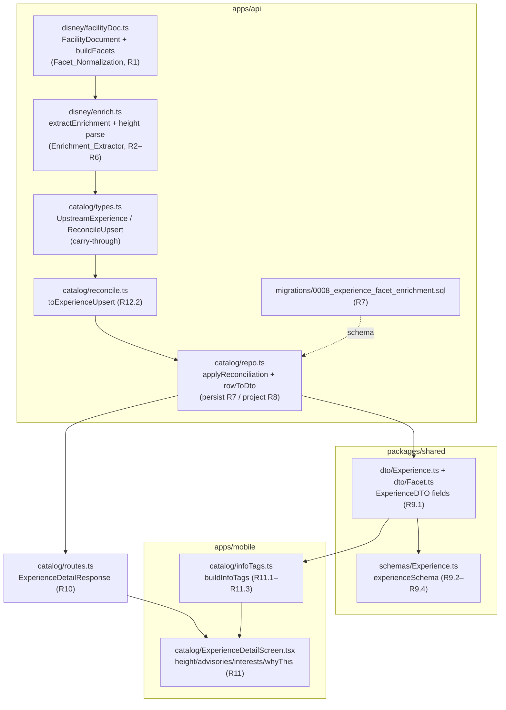

# Design Document

## Overview

This feature mines high-value Disney fields that `Catalog_Sync` already fetches
inside each `Facility_Document` but currently discards, and carries them
through the existing full-stack enrichment path with no new external data
source. Today `buildFacets` (in `disney/facilityDoc.ts`) collapses the raw
`facets` array down to three flat string lists (`accessibility`,
`priceRangeDining`, `interests`), throwing away every other facet group and the
human-readable `name` of each facet; and `extractEnrichment` (in
`disney/enrich.ts`) never reads `whyThis` or `subType`. We extend exactly those
two pure cores and thread the new values through the same pipeline every
existing enrichment field already flows through:

```
Facility_Document (raw, already synced)
  → adaptFacilityDocument / buildFacets   (Facet_Normalization, R1)
  → extractEnrichment                      (Enrichment_Extractor, R2–R6)
  → UpstreamExperience / ReconcileUpsert   (carried-through, R12)
  → reconcile / reconcileCatalog           (diff, R12.2)
  → CatalogRepo.applyReconciliation        (persist, R7)
  → CatalogRepo.rowToDto / getExperience   (project, R8)
  → ExperienceDTO + experienceSchema       (shared type + Zod, R9)
  → Catalog_Detail_Route                   (detail response, R10)
  → Experience_Detail_Screen / buildInfoTags (render, R11)
```

The six new enrichment values are:

- **Height_Requirement** — from the `height` facet group, carrying the facet
  `{id, name}` plus a derived numeric minimum in inches and/or centimeters (R2).
- **Physical_Considerations** — from the `physicalConsiderations` facet group,
  a list of `{id, name}` advisories (R3).
- **Interest_Facets** — from the `interests`, `thrillFactor`, `age`,
  `parkInterests`, and `disneyFavorites` facet groups, for display and future
  targeting/filtering (R4).
- **Grouped_Facets** — the full stored structure keyed by facet-group name,
  each value a list of `{id, name}` Facet_Values, covering the seven
  Persisted_Facet_Groups (R1, R7.1). Height_Requirement, Physical_Considerations,
  and Interest_Facets are all views over this structure.
- **Why_This** — the structured `{title, bullets, quotes}` marketing copy (R5).
- **Facility_SubType** — the optional finer classification `subType` (R6).

Design invariants that shape every decision below, taken directly from the
requirements:

- **`Catalog_Sync` remains the sole writer** of the new fields (R7.6, R12.4),
  exactly as it is for coordinates, accessibility, and price tier today.
- **Absence is modeled explicitly** — each field is `null`/empty when the
  source document does not carry it, so no partial or fabricated value is ever
  stored (R7.5) and each field is present on read only when persisted (R8.5).
- **The new fields are carried-through, not drift signals** — a change limited
  to a new enrichment field does not on its own trigger an upsert, mirroring the
  existing coordinates/accessibility/price-tier handling (R12.2).
- **Scope is Experiences only** — the Resort path, the ThemeParks.wiki live
  path, and the menu source are untouched (R13).

Because the heart of this feature is a set of pure, total, deterministic
transformations over a large, structured input space (arbitrary facet arrays,
arbitrary `whyThis`/`subType` shapes), it is an excellent fit for
property-based testing, consistent with the existing `enrich.prop.test.ts`,
`normalize.prop.test.ts`, and `reconcile.prop.test.ts` suites. The persistence
migration, the SQL projection, and the mobile rendering are validated with
example/integration/snapshot tests instead (see Testing Strategy).

## Architecture

The feature touches one vertical slice across the API and mobile apps. No new
services, jobs, transports, or external calls are introduced; every change
extends an existing module in place.



### Layer responsibilities

1. **Facet_Normalization (`disney/facilityDoc.ts`).** `buildFacets` is extended
   to additionally emit a `Grouped_Facets` structure alongside the existing
   flat `facets` object. It walks the raw `facets` array once, keeping each
   entry whose `group` is one of the Persisted_Facet_Groups as a `{id, name}`
   Facet_Value under its group, in appearance order, skipping any entry missing
   `group`/`id`/`name` (R1.1–R1.5). The existing collapsed `accessibility`/
   `priceRangeDining`/`interests` outputs are produced exactly as before
   (R1.6). `adaptFacilityDocument` additionally carries the raw `whyThis` and
   `subType` fields through untouched so the extractor can read them.

2. **Enrichment_Extractor (`disney/enrich.ts`).** `extractEnrichment` is
   extended to project the Grouped_Facets and the raw `whyThis`/`subType` into
   the new enrichment values: the derived Height_Requirement (with a pure
   height-minimum parser), the Physical_Considerations list, the Interest_Facets
   map, the normalized Why_This value, and the Facility_SubType. It stays pure,
   total, and deterministic.

3. **Carry-through types + reconcile (`catalog/types.ts`,
   `catalog/reconcile.ts`).** `UpstreamExperience` and `ReconcileUpsert` gain the
   new fields; `toExperienceUpsert` copies them through. `CatalogCacheRow` and
   `hasExperienceMaterialChange` are deliberately **not** extended, so the new
   fields never become drift signals (R12.2).

4. **Persistence (`migrations/0008_*.sql`, `catalog/repo.ts`).** An additive
   migration adds the columns; `applyReconciliation` writes them in the existing
   single transaction (R7.6, R12); `rowToDto` projects each field present-only-
   when-persisted (R8.5). Physical_Considerations and Interest_Facets are
   derived from the persisted `grouped_facets` via a shared pure helper so the
   grouping logic has a single source of truth.

5. **Shared contract (`packages/shared`).** `ExperienceDTO` declares the six new
   optional fields; `experienceSchema` validates them (accept when valid, accept
   when omitted, reject malformed — R9).

6. **Detail route (`catalog/routes.ts`).** `ExperienceDetailResponse` and
   `toDetailResponse` carry the new fields through verbatim from the DTO
   (present only when persisted), leaving all existing fields and the `/live`
   path unchanged (R10).

7. **Mobile (`apps/mobile`).** The detail screen renders the height, advisories,
   interest tags, and Why_This bullets, each omitted when absent and each with a
   screen-reader label (R11).

## Components and Interfaces

### 1. Facet value model (shared)

A `Facet_Value` is the reusable `{id, name}` pair. Because it appears in the
shared `ExperienceDTO` (R9.1) and is validated by Zod, it is defined once in
`packages/shared` and reused by the API cores.

```ts
// packages/shared/src/dto/Facet.ts
export interface FacetValueDTO {
  /** Machine identifier retained for future filtering/targeting. */
  readonly id: string;
  /** Human-readable display label. */
  readonly name: string;
}

/**
 * Grouped_Facets: the persisted display-and-targeting-ready structure keyed by
 * Facet_Group name, each value a list of Facet_Values (R1, R7.1). Only the
 * Persisted_Facet_Groups appear as keys; a group with no facets is absent.
 */
export type GroupedFacetsDTO = Readonly<Record<string, readonly FacetValueDTO[]>>;

/** Height_Requirement: the height facet value plus derived numeric minimums (R2). */
export interface HeightRequirementDTO {
  readonly id: string;
  readonly name: string;
  /** Derived minimum height in inches, or null when the id encodes none (R2.2, R2.4). */
  readonly minInches: number | null;
  /** Derived minimum height in centimeters, or null when the id encodes none (R2.3, R2.4). */
  readonly minCentimeters: number | null;
}

/** Why_This: structured curated marketing copy (R5). */
export interface WhyThisDTO {
  readonly title: string | null;
  readonly bullets: readonly string[];
  readonly quotes: readonly string[];
}
```

### 2. Facet_Normalization — `disney/facilityDoc.ts`

The set of captured groups is declared once as the single source of truth so
the normalizer and its property generators cannot drift:

```ts
/** The Facet_Groups this feature captures into Grouped_Facets (Glossary). */
export const PERSISTED_FACET_GROUPS: ReadonlySet<string> = new Set([
  'height',
  'physicalConsiderations',
  'interests',
  'thrillFactor',
  'age',
  'parkInterests',
  'disneyFavorites',
]);

/** The interest/targeting subset surfaced as Interest_Facets (R4). */
export const INTEREST_FACET_GROUPS: readonly string[] = [
  'interests',
  'thrillFactor',
  'age',
  'parkInterests',
  'disneyFavorites',
];
```

`FacilityDocument` gains two tolerant optional fields for the values that were
previously discarded:

```ts
export interface FacilityDocument {
  // ...existing fields...
  /** Structured "why visit this" marketing copy, when present (R5). */
  readonly whyThis?: {
    readonly title?: string;
    readonly bullets?: readonly string[];
    readonly quotes?: readonly string[];
  };
  /**
   * Grouped_Facets keyed by Facet_Group name, each a list of {id, name}
   * Facet_Values (R1). Synthesized by buildFacets from the raw facets array;
   * present only for groups that carried at least one valid facet.
   */
  readonly groupedFacets?: GroupedFacetsDTO;
  // subType already exists on FacilityDocument.
}
```

`buildFacets` is extended to build the grouped structure in the same single
pass it already uses. The existing flat lists remain byte-for-byte unchanged
(R1.6); the new grouped map is derived independently:

```ts
function buildGroupedFacets(rawFacets: readonly unknown[]): GroupedFacetsDTO {
  const grouped: Record<string, FacetValueDTO[]> = {};
  for (const entry of rawFacets) {
    if (typeof entry !== 'object' || entry === null) continue;
    const { group, id, name } = entry as Record<string, unknown>;
    // R1.5: skip entries missing group, id, or name.
    if (typeof group !== 'string' || typeof id !== 'string' || typeof name !== 'string') {
      continue;
    }
    // R1.1 / R1.4: only the Persisted_Facet_Groups are captured.
    if (!PERSISTED_FACET_GROUPS.has(group)) continue;
    // R1.2: preserve both id and name. R1.3: preserve appearance order.
    (grouped[group] ??= []).push({ id, name });
  }
  return grouped;
}
```

`adaptFacilityDocument` calls `buildGroupedFacets` when the raw `facets` is an
array (real data) and attaches the result as `groupedFacets`; for the object-
shaped fixture facets it leaves `groupedFacets` absent (the fixtures carry no
raw array to mine). It also carries `whyThis` and `subType` through untouched.

### 3. Enrichment_Extractor — `disney/enrich.ts`

The `Enrichment` interface is extended with the new fields; every one models
absence explicitly:

```ts
export interface Enrichment {
  // ...existing latitude/longitude/accessibility/priceTier/mealPeriods...
  /** Full Grouped_Facets for the Persisted_Facet_Groups (R1, R7.1). */
  readonly groupedFacets: GroupedFacetsDTO;
  /** Height requirement with derived numeric minimums, or null (R2). */
  readonly heightRequirement: HeightRequirementDTO | null;
  /** Physical/health advisories in appearance order; empty when none (R3). */
  readonly physicalConsiderations: readonly FacetValueDTO[];
  /** Interest/targeting facet groups; groups with no facets omitted (R4). */
  readonly interestFacets: GroupedFacetsDTO;
  /** Structured why-this copy, or null (R5). */
  readonly whyThis: WhyThisDTO | null;
  /** Finer classification, or null (R6). */
  readonly subType: string | null;
}
```

Extraction helpers (all pure, total, deterministic):

- **`extractGroupedFacets(doc)`** — returns `doc.groupedFacets ?? {}`.
- **`extractHeightRequirement(doc)`** — takes the **first** `height`
  Facet_Value (R2.1); returns `null` when the `height` group is absent/empty
  (R2.5); otherwise `{id, name, ...parseHeightMinimum(id)}`.
- **`parseHeightMinimum(id)`** — a pure parser returning
  `{minInches, minCentimeters}`. It scans the id for a numeric value adjacent to
  a recognized unit token (`in`/`inch`/`inches`/`"` → inches; `cm`/`centimeter(s)`
  → centimeters). A parseable inches value sets `minInches` (cm null); a
  parseable cm value sets `minCentimeters` (inches null); an id with no
  parseable numeric minimum yields `{minInches: null, minCentimeters: null}`
  (R2.2, R2.3, R2.4). No unit conversion is performed — only the unit the id
  encodes is populated, keeping the derivation faithful to the source.
- **`extractPhysicalConsiderations(doc)`** — the `physicalConsiderations` group's
  Facet_Values in order, or `[]` (R3.1, R3.2, R3.3).
- **`extractInterestFacets(doc)`** — a map containing each `INTEREST_FACET_GROUPS`
  key that has ≥1 Facet_Value, omitting empty groups, or `{}` when none (R4.1–R4.4).
- **`extractWhyThis(doc)`** — `null` when `doc.whyThis` is absent (R5.5);
  otherwise `{title: whyThis.title ?? null, bullets: whyThis.bullets ?? [],
  quotes: whyThis.quotes ?? []}`, preserving order (R5.1–R5.4).
- **`extractSubType(doc)`** — the trimmed `subType` when non-empty, else `null`
  (R6.1, R6.2).

Because Physical_Considerations and Interest_Facets are pure views over
Grouped_Facets, the same derivation is exposed as a shared helper reused by the
repo projection (see below), so the grouping rules live in exactly one place:

```ts
/** Derive the R3/R4 views from a persisted Grouped_Facets structure. */
export function deriveFacetViews(grouped: GroupedFacetsDTO): {
  physicalConsiderations: readonly FacetValueDTO[];
  interestFacets: GroupedFacetsDTO;
} { /* physicalConsiderations = grouped.physicalConsiderations ?? []; interestFacets = pick(grouped, INTEREST_FACET_GROUPS) */ }
```

### 4. Carry-through types — `catalog/types.ts`

`UpstreamExperience` and `ReconcileUpsert` gain the four **persisted** values
(the two derived views are re-derived on read, so they are not carried in the
diff):

```ts
readonly groupedFacets: GroupedFacetsDTO;      // R7.1
readonly heightRequirement: HeightRequirementDTO | null; // R7.2
readonly whyThis: WhyThisDTO | null;           // R7.3
readonly subType: string | null;              // R7.4
```

`CatalogCacheRow` is unchanged: the new fields are not read into the diff.

### 5. Reconcile — `catalog/reconcile.ts`

`toExperienceUpsert` copies the four new fields straight from the
`UpstreamExperience` (exactly like `latitude`/`accessibility` today).
`hasExperienceMaterialChange` is unchanged, so a change confined to a new
enrichment field is not a drift signal (R12.2). Soft-delete preserves the row
and therefore its last-persisted enrichment (R12.3).

### 6. Persistence — migration + `catalog/repo.ts`

New additive migration `0008_experience_facet_enrichment.sql` (mirrors the
additive shape of `0004`/`0006`/`0007`):

```sql
BEGIN;
ALTER TABLE experiences
    ADD COLUMN grouped_facets     JSONB  NOT NULL DEFAULT '{}',   -- R7.1
    ADD COLUMN height_requirement JSONB,                          -- R7.2 (null when absent)
    ADD COLUMN why_this           JSONB,                          -- R7.3 (null when absent)
    ADD COLUMN sub_type           TEXT;                           -- R7.4 (null when absent)

ALTER TABLE experiences
    ADD CONSTRAINT experiences_sub_type_length_chk
        CHECK (sub_type IS NULL OR char_length(sub_type) BETWEEN 1 AND 200);
COMMIT;
```

The migration is strictly additive — nullable columns / defaulted JSONB, no
change to any existing column, Internal_Id, or the completions/ratings/notes
tables (R7.6). Grouped_Facets is stored as one JSONB unit (like `meal_periods`)
because no relational query over individual facets is needed; the numeric
height minimums live inside `height_requirement` JSONB so the derived values
survive across reads (R8.1). Physical_Considerations and Interest_Facets are
**not** separate columns — they are derived from `grouped_facets` on read,
avoiding redundant storage while still exposing both on the DTO (R8.2, R9.1).

`ExperienceRow` gains `grouped_facets`, `height_requirement`, `why_this`,
`sub_type`. `applyReconciliation`'s Experience `INSERT ... ON CONFLICT`
adds the four columns to the column list, the `VALUES` list
(`$n::jsonb` for the three JSONB columns), and the `DO UPDATE SET` clause,
following the exact pattern `meal_periods` already uses. Both read queries
(`listActiveExperiences`, `getExperience`) add the four columns to their
`SELECT`.

`rowToDto` projects each field present-only-when-persisted, and derives the two
views from `grouped_facets` via `deriveFacetViews` (R8.1–R8.5):

```ts
function rowToDto(row: ExperienceRow): ExperienceDTO {
  const grouped = row.grouped_facets ?? {};
  const hasGrouped = Object.keys(grouped).length > 0;
  const { physicalConsiderations, interestFacets } = deriveFacetViews(grouped);
  return {
    // ...existing fields...
    ...(row.height_requirement !== null ? { heightRequirement: row.height_requirement } : {}),
    ...(hasGrouped ? { groupedFacets: grouped } : {}),
    ...(physicalConsiderations.length > 0 ? { physicalConsiderations } : {}),
    ...(Object.keys(interestFacets).length > 0 ? { interestFacets } : {}),
    ...(row.why_this !== null ? { whyThis: row.why_this } : {}),
    ...(row.sub_type !== null ? { subType: row.sub_type } : {}),
  };
}
```

### 7. Shared DTO + schema — `packages/shared`

`ExperienceDTO` gains six optional fields (R9.1):

```ts
readonly heightRequirement?: HeightRequirementDTO | null;
readonly groupedFacets?: GroupedFacetsDTO;
readonly physicalConsiderations?: readonly FacetValueDTO[];
readonly interestFacets?: GroupedFacetsDTO;
readonly whyThis?: WhyThisDTO | null;
readonly subType?: string | null;
```

`experienceSchema` (which is `.strict()`) gains matching optional validators so
a valid payload is accepted (R9.2), an omitting payload is accepted (R9.3), and
a malformed one is rejected (R9.4):

```ts
const facetValueSchema = z.object({ id: z.string(), name: z.string() }).strict();
const groupedFacetsSchema = z.record(z.string(), z.array(facetValueSchema));
// ...added to experienceSchema.object({...}):
heightRequirement: z.object({
  id: z.string(), name: z.string(),
  minInches: z.number().nullable(), minCentimeters: z.number().nullable(),
}).strict().nullable().optional(),
groupedFacets: groupedFacetsSchema.optional(),
physicalConsiderations: z.array(facetValueSchema).optional(),
interestFacets: groupedFacetsSchema.optional(),
whyThis: z.object({
  title: z.string().nullable(),
  bullets: z.array(z.string()), quotes: z.array(z.string()),
}).strict().nullable().optional(),
subType: z.string().max(200).nullable().optional(),
```

### 8. Detail route — `catalog/routes.ts`

`ExperienceDetailResponse` gains the same six optional fields. `toDetailResponse`
already spreads all DTO fields except `active`/`menus`, so the new
present-only-when-persisted fields flow through automatically; the interface is
extended to type them (R10.1, R10.2). The `/catalog/:experienceId/live` handler
and every existing field are untouched (R10.3).

### 9. Mobile — `apps/mobile/src/screens/catalog`

`ExperienceDetailDTO` (the screen's local wire type) gains the six fields.
Rendering (R11), each element omitted when the value is absent/empty (R11.5)
and each carrying a screen-reader label (R11.6):

- **Height_Requirement** — `buildInfoTags` gains a `height` Info_Tag rendering
  `heightRequirement.name` with label `Height requirement: <name>` (R11.1).
- **Physical_Considerations** — one Info_Tag per advisory `name`, label
  `Advisory: <name>` (R11.2).
- **Interest_Facets** — one Info_Tag per Facet_Value `name` across the interest
  groups, label `Interest: <name>` (R11.3).
- **Why_This bullets** — a new "Why visit" `Card`/section rendering the bullets
  as flavor text when `whyThis.bullets` is non-empty (R11.4); the section is
  omitted entirely when there are no bullets (R11.5). Each bullet is plain
  `Text`; the section header provides the accessible label (R11.6).

`buildInfoTags` keeps its ordering discipline: the new height/advisory/interest
tags slot into the fixed order after the existing tags, each omitted when
absent, preserving relative order of those present (existing R9.11 pattern).

## Data Models

### Persisted (`experiences` table, additive)

| Column | Type | Null? | Meaning | Req |
|---|---|---|---|---|
| `grouped_facets` | `JSONB` | `NOT NULL DEFAULT '{}'` | Grouped_Facets keyed by group name → `[{id,name}]` | R7.1 |
| `height_requirement` | `JSONB` | nullable | `{id,name,minInches,minCentimeters}`; null when absent | R7.2, R7.5 |
| `why_this` | `JSONB` | nullable | `{title,bullets,quotes}`; null when absent | R7.3, R7.5 |
| `sub_type` | `TEXT` | nullable | Facility_SubType; null when absent | R7.4, R7.5 |

### In-memory / wire shapes

- `FacetValueDTO = {id: string, name: string}`
- `GroupedFacetsDTO = Record<string, FacetValueDTO[]>` (keys ⊆ Persisted_Facet_Groups)
- `HeightRequirementDTO = {id, name, minInches: number|null, minCentimeters: number|null}`
- `WhyThisDTO = {title: string|null, bullets: string[], quotes: string[]}`

### Persisted_Facet_Groups (single source of truth in `facilityDoc.ts`)

`height`, `physicalConsiderations`, `interests`, `thrillFactor`, `age`,
`parkInterests`, `disneyFavorites`. Interest_Facets = all but `height` and
`physicalConsiderations`.

### Field lifecycle (mirrors coordinates/accessibility today)

For every new field: written only by `Catalog_Sync` from the current
`Facility_Document` (R12.1, R12.4); `null`/empty when the source omits it
(R7.5); carried through the diff without being a drift signal (R12.2);
preserved on a soft-deleted row (R12.3); projected on read only when persisted
(R8.5); applied only to Experience-eligible types, never Resorts (R13.1, R13.2).

## Correctness Properties

*A property is a characteristic or behavior that should hold true across all
valid executions of a system — essentially, a formal statement about what the
system should do. Properties serve as the bridge between human-readable
specifications and machine-verifiable correctness guarantees.*

The core of this feature is a set of pure, total, deterministic transformations
over a large, structured input space, so property-based testing is the primary
correctness tool (mirroring the existing `enrich.prop.test.ts` and
`reconcile.prop.test.ts` suites). Persistence and rendering wiring are covered
by integration/example tests in the Testing Strategy. The properties below are
the consolidated set produced by the prework reflection: each provides unique
validation value with no redundant overlap.

### Property 1: Facet_Normalization retains persisted groups faithfully

*For any* raw `facets` array, `buildFacets` produces a Grouped_Facets structure
in which every entry whose `group` is one of the Persisted_Facet_Groups and
whose `id` and `name` are both strings appears exactly once as a `{id, name}`
Facet_Value under its group, in original appearance order; and no entry whose
group is not a Persisted_Facet_Group, and no entry missing `group`/`id`/`name`,
appears anywhere in the structure.

**Validates: Requirements 1.1, 1.2, 1.3, 1.4, 1.5**

### Property 2: Facet_Normalization preserves the existing flat outputs

*For any* raw `facets` array, the flat `accessibility`, `priceRangeDining`, and
`interests` lists produced by the extended `buildFacets` are identical to those
produced by the pre-change collapse rule for the same input.

**Validates: Requirements 1.6**

### Property 3: Height_Requirement selection and absence

*For any* Facility_Document, `extractHeightRequirement` returns the `{id, name}`
of the first `height` Facet_Value when at least one is present, and `null` when
no `height` facet is present.

**Validates: Requirements 2.1, 2.5**

### Property 4: Height minimum parsing derives the encoded unit only

*For any* height facet `id`, `parseHeightMinimum` returns `minInches` equal to
the encoded value with `minCentimeters` null when the id encodes an inches
minimum, `minCentimeters` equal to the encoded value with `minInches` null when
the id encodes a centimeters minimum, and both `null` when the id encodes no
parseable numeric minimum — while the surrounding Height_Requirement always
retains the original `id` and `name`.

**Validates: Requirements 2.2, 2.3, 2.4**

### Property 5: Facet-view extraction preserves order, omits empties

*For any* Facility_Document, `extractPhysicalConsiderations` returns exactly the
`physicalConsiderations` group's Facet_Values in appearance order (empty when
none), and `extractInterestFacets` returns a structure containing exactly those
interest/targeting groups (`interests`, `thrillFactor`, `age`, `parkInterests`,
`disneyFavorites`) that have at least one facet, each carrying its
`{id, name}` Facet_Values in appearance order, omitting empty groups (`{}` when
none) — and the same holds for `deriveFacetViews` applied to any persisted
Grouped_Facets.

**Validates: Requirements 3.1, 3.2, 3.3, 4.1, 4.2, 4.3, 4.4**

### Property 6: Why_This normalization maps present fields and nulls/empties absent ones

*For any* Facility_Document, `extractWhyThis` returns `null` when no `whyThis`
object is present; otherwise it returns a value whose `title` is the source
title or `null` when omitted, and whose `bullets` and `quotes` equal the source
lists in order (each an empty list when omitted).

**Validates: Requirements 5.1, 5.2, 5.3, 5.4, 5.5**

### Property 7: Facility_SubType is the non-empty trimmed value or null

*For any* Facility_Document, `extractSubType` returns the trimmed `subType` when
it is present and not whitespace-only, and `null` when `subType` is omitted or
whitespace-only.

**Validates: Requirements 6.1, 6.2**

### Property 8: Read projection includes persisted enrichment and omits the rest

*For any* `experiences` row, `rowToDto` includes the Height_Requirement,
Grouped_Facets, Why_This, and Facility_SubType exactly when they are persisted
(non-null / non-empty), derives the Physical_Considerations and Interest_Facets
views from the persisted Grouped_Facets equal to `deriveFacetViews`, and omits
any field whose backing column is null/empty.

**Validates: Requirements 8.1, 8.2, 8.3, 8.4, 8.5**

### Property 9: Experience schema accepts valid payloads and rejects malformed ones

*For any* Experience_DTO carrying the new enrichment fields with valid values,
and *for any* Experience_DTO omitting them, `experienceSchema` accepts the
payload; and *for any* payload carrying a new enrichment field whose value
violates its declared shape, `experienceSchema` rejects the payload.

**Validates: Requirements 9.2, 9.3, 9.4**

### Property 10: Detail response passes new fields through by persistence

*For any* Experience_DTO, `toDetailResponse` includes each of the six new
enrichment fields in the response exactly when the DTO carries it, and omits
each field the DTO omits, leaving all existing detail fields unchanged.

**Validates: Requirements 10.1, 10.2**

### Property 11: Info_Tags surface each enrichment value with an accessible label

*For any* Experience, `buildInfoTags` emits a height tag carrying the
Height_Requirement `name` when one is present, one advisory tag per
Physical_Considerations `name` in order, and one interest tag per Interest_Facet
`name`; emits no tag for a value that is absent or empty; and every emitted tag
carries a non-empty `accessibilityLabel` conveying its value.

**Validates: Requirements 11.1, 11.2, 11.3, 11.5, 11.6**

### Property 12: Upsert carries the new enrichment fields through unchanged

*For any* `UpstreamExperience`, the `ReconcileUpsert` produced by
`toExperienceUpsert` carries identical `groupedFacets`, `heightRequirement`,
`whyThis`, and `subType` values.

**Validates: Requirements 12.1**

### Property 13: New enrichment fields are not a drift signal

*For any* active cached Experience row and any upstream Experience that agree on
the change-detection fields (`name`, `park`, `category`, `land`, `areaType`,
`resortId`, `resortArea`), `reconcile` produces no upsert for that row even when
their `groupedFacets`, `heightRequirement`, `whyThis`, or `subType` differ.

**Validates: Requirements 12.2**

## Error Handling

The feature introduces no new failure modes. It inherits and preserves the
existing catalog error discipline:

- **Tolerant, total pure cores.** `buildFacets`, `parseHeightMinimum`, and every
  `extract*` helper are total: any missing, malformed, or unexpected input
  (non-object facet entries, missing `id`/`name`, non-string values, absent
  `whyThis`/`subType`, unparseable height ids) is handled by skipping the entry
  or returning `null`/empty rather than throwing (R1.5, R2.4, R5.3, R5.4, R6.2).
  This matches the reverse-engineered, undocumented nature of the Disney
  sources and the null-on-failure convention already used by `extractEnrichment`
  and `parseEnterpriseId`.
- **No partial or fabricated values.** When a source field is absent the pipeline
  stores an explicit `null`/empty, never a placeholder (R7.5), so absence is
  unambiguous on read.
- **Transactional persistence unchanged.** The new columns are written inside the
  existing single `applyReconciliation` transaction; a failure rolls the whole
  run back exactly as today, leaving the prior cache intact. A malformed value
  can never reach the DB because the pure cores normalize before persistence.
- **Migration safety.** `0008_*` is strictly additive (nullable columns and a
  defaulted JSONB), so it cannot fail against existing rows and needs no
  backfill — every pre-existing row reads back `{}`/`null` until the next sync
  populates it (R7.5, R7.6).
- **Schema rejection at the boundary.** `experienceSchema` rejects a payload
  whose new field violates its shape (R9.4), surfacing a validation error rather
  than propagating a malformed DTO.
- **Mobile degradation.** Absent/empty enrichment simply renders nothing (no
  tag, no Why_This section) — the screen never errors on missing enrichment
  (R11.5).

## Testing Strategy

### Dual approach

- **Property tests** verify the universal correctness properties above across
  100+ generated inputs each. They target the pure cores (`buildFacets`,
  `parseHeightMinimum`, the `extract*`/`deriveFacetViews` helpers,
  `rowToDto`, `experienceSchema`, `toDetailResponse`, `toExperienceUpsert`,
  `reconcile`, `buildInfoTags`), which is where behavior varies meaningfully
  with input.
- **Unit / example tests** cover specific representative cases and regressions:
  the exact facet-group set, a fully-populated document, real-shaped height ids
  (inches and centimeters), the Why_This section render (R11.4), the detail
  route leaving existing fields and `/live` untouched (R10.3), and the scope
  guarantees that a Resort document receives no enrichment (R13.1).
- **Integration tests** cover the persistence round-trips against a sandbox
  Postgres (existing `repo.apply.integration.test.ts` pattern): apply a
  reconciliation carrying grouped facets / height / why-this / subType, read the
  row back, and assert equality (R7.1–R7.4); apply with absent fields and assert
  null/empty columns (R7.5); assert existing columns and Internal_Id are
  unchanged (R7.6); and soft-delete a row and assert the enrichment columns are
  preserved (R12.3).
- **Smoke checks** cover the type-level DTO declaration (R9.1) and the
  sole-writer constraint (R12.4, verified by confirming no module other than
  `applyReconciliation` writes the columns).

### Property-based testing configuration

PBT **is** appropriate here: the transformations are pure functions over a large
structured input space with clear round-trip / invariant / order-preservation
properties. It is **not** used for the migration (additive DDL — covered by the
integration round-trip), the raw SQL wiring (integration), or the React
rendering of the Why_This section (example render test).

- Use the existing `fast-check` + `vitest` setup already used across the catalog
  suites.
- Do not hand-roll property testing; use `fast-check` generators.
- Each property test runs a minimum of 100 iterations (`{ numRuns: 100 }`),
  matching the repo convention.
- Tag each property test with a comment referencing its design property, in the
  established format:
  `// Feature: experience-facet-enrichment, Property {number}: {property text}`
- Implement each of the 13 correctness properties with a single property-based
  test (additional fixed-example regression tests may accompany them, as in
  `enrich.prop.test.ts`).

### Test file placement (mirrors existing conventions)

- `apps/api/src/services/catalog/disney/__tests__/facetNormalization.prop.test.ts`
  — Properties 1, 2.
- `apps/api/src/services/catalog/disney/__tests__/enrich.prop.test.ts` (extend)
  — Properties 3, 4, 5, 6, 7.
- `apps/api/src/services/catalog/__tests__/repoDto.prop.test.ts` (extend) —
  Property 8.
- `packages/shared/src/schemas/__tests__/Experience.prop.test.ts` — Property 9.
- `apps/api/src/services/catalog/__tests__/routes.prop.test.ts` (extend) —
  Property 10; `routes.test.ts` for R10.3 example.
- `apps/mobile/src/screens/catalog/__tests__/infoTags.prop.test.ts` (extend) —
  Property 11; a screen render example for R11.4.
- `apps/api/src/services/catalog/__tests__/reconcile.prop.test.ts` (extend) —
  Properties 12, 13.
- `apps/api/src/services/catalog/__tests__/repo.apply.integration.test.ts`
  (extend) — R7.1–R7.6, R12.3.
