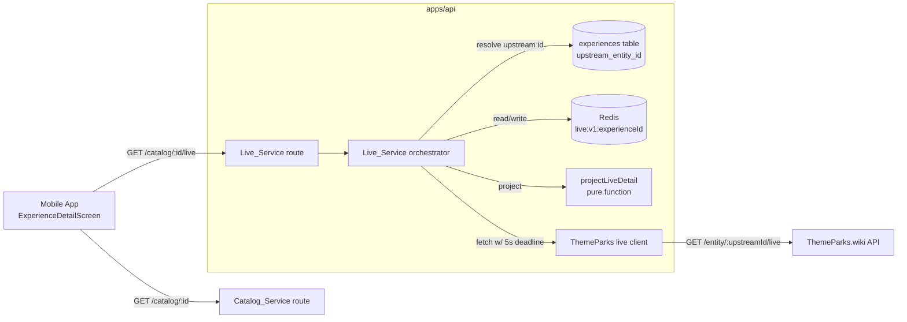
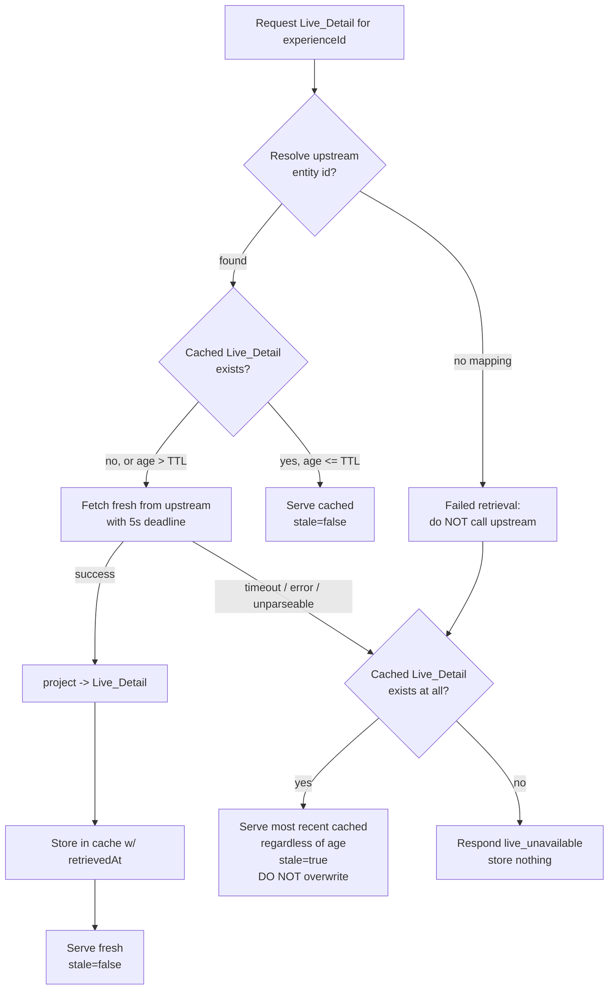

# Design Document

## Overview

This feature adds a **live operational layer** to the Experience detail view. The existing
`Catalog_Service` serves slow-changing catalog fields (name, Park, category, description, image)
from a Postgres cache that is refreshed at most once per 24 hours. This feature introduces a new,
independent `Live_Service` that retrieves volatile per-Experience operational data (operating
status, wait times, performance schedules, dining hours, return windows, boarding groups, and a
best-effort wait-time forecast) from the ThemeParks.wiki per-entity live endpoint
(`GET /entity/{id}/live`), projects the raw upstream payload into a narrow, validated `Live_Detail`
shape, caches it for a short window (5 minutes), and serves it to the App alongside the static
detail view.

The design is grounded in the patterns already established in `apps/api`:

- A **thin, typed upstream HTTP client** that surfaces every failure as a single `UpstreamError`
  type, mirroring `services/catalog/themeparks.ts`.
- A **pure projection function** that converts the loose upstream wire shape into a strict domain
  model, mirroring the purity of `services/catalog/classify.ts` and `reconcile.ts`. This pure core
  is where the bulk of the correctness risk lives and where property-based testing pays off.
- A **Redis-backed short-lived cache** with an explicit `retrievedAt` stamp, building on the
  `services/aggregate/leaderboard.ts` cache pattern but extended with a stale-serve fallback.
- A **Fastify route plugin** wired through `buildServer`'s `BuildServerServices`, mirroring
  `services/catalog/routes.ts`.
- A **React Query screen section** on the mobile side, mirroring the parallel-fetch pattern already
  used in `ExperienceDetailScreen.tsx`.

The key new behavior versus the catalog path is the **stale-serve fallback**: because live data is
volatile and the upstream is best-effort, a fresh retrieval that times out (5 seconds) or errors
must fall back to the most recent cached `Live_Detail` (regardless of its age) flagged as stale,
rather than failing the request — and only when no cached value exists at all does the App show a
"live information unavailable" state.

### Scope

- **In scope:** the `Live_Service` (upstream client, projection, cache, orchestration, route) in
  `apps/api`, the shared `Live_Detail` DTO/types and any new error code in `@dwt/shared`, and the
  App-side live section rendering and category gating in `apps/mobile`.
- **Out of scope:** restaurant menus (the upstream does not expose dish-level menu data — see the
  requirements Assumptions), and any change to the existing `Catalog_Sync` path.

### Source of truth for the upstream shape

Per the requirements Assumptions, the published ThemeParks.wiki OpenAPI schema is incomplete: the
verified real responses include a `forecast` array and a `type` label on operating-hours entries
that the schema omits. The projection treats the **verified real-response shapes as ground truth**
and tolerates missing/extra fields defensively, projecting whatever is present and representing
everything else as absent.

## Architecture

### System context



### Request lifecycle for `GET /catalog/:experienceId/live`



This single flow implements R1.1, R1.8, R1.9 (resolution and failed-retrieval handling), R2.1,
R2.2, R2.4–R2.8 (freshness, caching, deadline, stale fallback), and R3.1 (serve stale on failure).

### Why a separate service and cache path

The `Catalog_Service` cache is a Postgres table refreshed by a scheduled/opportunistic sync on a
24-hour cadence. Live data changes minute to minute and is requested per-Experience on demand, so
it gets its own retrieval path and its own Redis-backed cache with a 5-minute freshness window.
Keeping the two paths separate means a live-data outage never affects catalog browsing, and the
high request volume of live polling never touches the relational store. The two paths share exactly
one piece of state: the `experiences.upstream_entity_id` column, which the `Live_Service` reads
(never writes) to resolve the upstream entity id (R1.1).

### Module layout (new)

```
apps/api/src/services/live/
  themeparksLive.ts   ThemeParks live HTTP client (GET /entity/{id}/live) -> raw typed shape | UpstreamError
  project.ts          projectLiveDetail(raw): pure projection raw -> LiveDetail  (the PBT core)
  parkTime.ts         park-local-timezone helpers (WDW = America/New_York) + "current day" + "upcoming" filters
  cache.ts            Redis Live_Cache: get/set CachedLiveDetail keyed by experienceId, with retrievedAt
  repo.ts             resolveUpstreamEntityId(experienceId) -> string | null  (reads experiences.upstream_entity_id)
  service.ts          orchestration: resolve -> cache decision -> fetch w/ deadline -> stale fallback
  routes.ts           GET /catalog/:experienceId/live Fastify plugin
  gating.ts           liveSectionFor(category): which live section a category shows (pure)  (R7)
  __tests__/          unit + property tests
```

```
apps/mobile/src/screens/catalog/
  ExperienceDetailScreen.tsx   (extended) add the gated live section
  live/                        live section components (RideLiveSection, ShowtimesSection, DiningSection)
  live/liveView.ts             pure view helpers: sort showtimes, filter+sort forecast, pick lowest (R4.11, R5.1)
```

## Components and Interfaces

### 1. ThemeParks live client (`themeparksLive.ts`)

A thin wrapper around `GET /entity/{id}/live`, modeled on the existing
`createThemeParksClient`. It reuses the same `UpstreamError` discriminated-failure approach
(`http_status | network | invalid_response | aborted`) and the injected `FetchLike`/`baseUrl`
pattern so the base URL still flows from `AppConfig.themeparks.baseUrl` and tests inject a fake
`fetch`.

```ts
export interface ThemeParksLiveClient {
  /**
   * GET /entity/{id}/live. Returns the parsed body on a 2xx response, or throws
   * UpstreamError on non-2xx, transport error, abort (deadline), or non-JSON body.
   * `signal` carries the 5-second deadline (R2.6).
   */
  getEntityLive(upstreamId: string, signal?: AbortSignal): Promise<ThemeParksLiveResponse>;
}
```

The client validates only the **gross** shape (`liveData` is an array of objects; the top-level is
an object). It deliberately does NOT validate field-by-field — that is the projection's job, so
that a recognized-but-partial payload still projects what it can (R1.10, R1.17). A wholly
unparseable body (non-object, non-JSON, missing `liveData` array) is surfaced as
`UpstreamError('invalid_response')`, which the orchestrator treats as a failed retrieval (R1.8).

The `getEntityLive` signature reuses the established URL-encoding and error-translation helpers; the
only new wrinkle is forwarding the `AbortSignal` into `fetch` so the deadline cancels an in-flight
request.

### 2. Projection (`project.ts`) — pure core

`projectLiveDetail(raw, ctx)` converts a single entity's raw live entry into the strict
`Live_Detail` domain model. It is **pure, total, and deterministic** (no I/O, no clock — the
"current day" and timezone come in via `ctx`), which makes it the primary property-test target.

```ts
export interface ProjectionContext {
  /** IANA tz for the Park (WDW = 'America/New_York'); used to express times in park-local time. */
  readonly parkTimeZone: string;
  /** The instant the projection is run; used only to scope "current day" showtimes/hours. */
  readonly now: Date;
}

/**
 * Project the raw upstream live entry into a Live_Detail. Total over all inputs:
 * unrecognized/missing values map to the documented "absent"/"Unknown" representations
 * rather than throwing.
 */
export function projectLiveDetail(
  raw: ThemeParksLiveEntry,
  ctx: ProjectionContext,
): LiveDetail;
```

Projection rules (each maps directly to an acceptance criterion):

- **Operating_Status (R1.3, R1.4):** map the recognized upstream `status` tokens
  (`OPERATING`, `CLOSED`, `DOWN`, `REFURBISHMENT`) to the corresponding enum; any unrecognized or
  missing value becomes `Unknown`. Implemented as a total lookup with an `Unknown` default.
- **Wait_Time (R1.5, R1.6):** read the standby queue's posted wait; keep it only if it is an
  integer in `[0, 1440]`, otherwise represent as absent.
- **Single_Rider_Wait (R1.11, R1.12):** same range/integer rule as Wait_Time, from the single-rider
  queue.
- **Return_Window / Paid_Return_Window (R1.13, R1.14):** map the queue state to
  `Available | Temporarily_Full | Finished`; carry optional start/end times in park-local time. For
  the paid variant, carry `amount`, `currency`, and the `formatted` price string **verbatim** from
  upstream (no local reformatting — see Assumptions).
- **Boarding_Group_Status (R1.15):** map allocation status to `Available | Paused | Closed`; carry
  optional current group start/end numbers, optional next-allocation time (park-local), and optional
  estimated wait clamped to `[0, 1440]`.
- **Wait_Time_Forecast (R1.16, R1.17):** project an ordered series of `{ time, waitMinutes, percentage }`
  entries with `waitMinutes` in `[0, 1440]` and `percentage` in `[0, 100]`. If the forecast is
  missing or any entry is unparseable into that shape, the **whole forecast is represented as
  absent** while every other field is still projected.
- **Showtimes (R1.7, R1.18):** project each current-day showtime as `{ start, end?, type? }` in
  park-local time; carry the `type` label only when present.
- **Operating_Hours (R1.19):** project each current-day hours set as `{ open, close, type? }` in
  park-local time; carry the `type` label only when present.
- **Dining_Availability (R1.20, R1.21):** project one entry per upstream walk-up list item, each
  carrying optional `partySize` and optional `estimatedWaitMinutes` (clamped to `[0, 1440]`),
  **independently** of whether Operating_Hours are present. A missing or empty list becomes an empty
  `Dining_Availability` (an empty array, not absent).
- **Upstream_Last_Updated (R1.22):** carry the upstream freshness timestamp when present, absent
  otherwise — kept distinct from `Retrieved_At`.

The projection always produces a complete `Live_Detail` containing **only** the fields present in
the response (R1.2, R1.10): everything optional is either a present value or explicitly absent
(`undefined`), and `diningAvailability` is always an array (possibly empty).

### 3. Park-time helpers (`parkTime.ts`)

All Walt Disney World parks observe US Eastern time, so the park-local timezone is the constant
`WDW_TIME_ZONE = 'America/New_York'`. (The catalog does not persist a per-Park timezone; using the
single WDW timezone is correct for every Park in scope and is documented as a design decision.)

```ts
export const WDW_TIME_ZONE = 'America/New_York';

/** True if the given instant falls on the same park-local calendar day as `now`. */
export function isCurrentParkDay(instant: Date, now: Date, tz?: string): boolean;

/** Filter forecast entries to those at or after `now`, sorted ascending by time (R4.11). */
export function upcomingForecast(entries: readonly ForecastEntry[], now: Date): readonly ForecastEntry[];
```

Times are resolved against the IANA database via `Intl.DateTimeFormat` (the same mechanism the
existing completion timezone logic relies on). The projection stores timestamps as absolute
instants plus the park timezone; rendering to a wall-clock string happens at the display boundary.

### 4. Live_Cache (`cache.ts`)

A Redis-backed store keyed by the **internal** Experience id, modeled on the leaderboard cache but
extended so stale entries survive past the freshness window for the fallback path.

```ts
export const LIVE_CACHE_TTL_SECONDS = 5 * 60;        // freshness window (R2.3)
export const LIVE_CACHE_RETENTION_SECONDS = 24 * 60 * 60; // how long a stale entry is retained for fallback

export interface CachedLiveDetail {
  readonly liveDetail: LiveDetail;
  readonly retrievedAt: string; // ISO-8601 UTC, the Retrieved_At time (R2.4)
}

export interface LiveCache {
  /** Most recent cached entry for an Experience, or null. Returned regardless of age. */
  get(experienceId: string): Promise<CachedLiveDetail | null>;
  /** Store a freshly-retrieved Live_Detail with its Retrieved_At time. */
  set(experienceId: string, entry: CachedLiveDetail): Promise<void>;
}
```

**Freshness vs retention.** The 5-minute `Live_Cache_TTL` is a *freshness* decision made in
application code by comparing `now - retrievedAt` against the TTL (R2.1, R2.2). It is **not** the
Redis key expiry, because R2.6/R2.7/R3.1 require serving the most recent cached value *regardless of
age* when a fresh retrieval times out or errors. The Redis key therefore uses a longer retention
expiry (`LIVE_CACHE_RETENTION_SECONDS`) so a stale-but-present entry remains available as a fallback.
Key format: `live:v1:{experienceId}` (the `:v1` prefix scopes the payload version for invalidation,
matching the leaderboard convention).

A malformed cached payload (bad JSON or failing the shape check) is treated as a cache miss, exactly
as the leaderboard cache does.

### 5. Upstream-id resolution (`repo.ts`)

```ts
export interface LiveRepo {
  /** Resolve the upstream entity id for an internal Experience id, or null when no mapping exists. */
  resolveUpstreamEntityId(experienceId: string): Promise<string | null>;
}
```

Implemented as a single `SELECT upstream_entity_id FROM experiences WHERE id = $1`. Returning `null`
when the row is absent drives R1.9 (failed retrieval, do not call upstream). This reads the same
one-to-one mapping the `Catalog_Service` maintains (R1.1); the `Live_Service` never writes to the
table.

### 6. Orchestrator (`service.ts`)

```ts
export interface LiveService {
  getLiveDetail(experienceId: string, now?: Date): Promise<LiveDetailResult>;
}

export interface LiveDetailResult {
  readonly liveDetail: LiveDetail;
  readonly retrievedAt: string; // Retrieved_At included in the response (R2.5)
  readonly stale: boolean;      // stale indicator (R2.6, R2.7, R3.1)
  readonly upstreamLastUpdated?: string; // surfaced distinct from retrievedAt (R1.22)
}
```

Orchestration steps (the flow diagram above):

1. **Resolve** the upstream id (R1.1). On `null`, treat as failed retrieval and skip upstream
   entirely (R1.9), then go to the failure fallback (step 5).
2. **Cache decision.** Read the cached entry. If it exists and `age <= TTL`, serve it with
   `stale: false` and no upstream call (R2.2).
3. **Fetch fresh** with a 5-second `AbortController` deadline when there is no cache or the cache is
   older than the TTL (R2.1). On success, project (R1.2–R1.22), store with a fresh `retrievedAt`
   (R2.4), and serve with `stale: false`.
4. **Failure (timeout, error, unparseable, or unresolved id).** If a cached entry exists (any age),
   serve it with `stale: true` and **do not overwrite** it (R2.6, R2.7, R3.1).
5. **No cache + failure.** Throw `AppError('live_unavailable', ...)` and store nothing (R2.8).

The orchestrator surfaces both `retrievedAt` (always) and `upstreamLastUpdated` (when the projected
detail carries it) so the App can show the two timestamps distinctly (R1.22, R4.13, R5.7, R6.8).

### 7. Route (`routes.ts`)

A Fastify plugin registered through a new `live` key on `BuildServerServices`, mirroring
`catalogRoutes`:

```
GET /catalog/:experienceId/live   ->  200 { liveDetail, retrievedAt, stale, upstreamLastUpdated? }
                                       503 { error: { code: 'live_unavailable', ... } }  (R2.8, R3.2)
```

- `:experienceId` is validated with the shared `uuidSchema` (consistent with the catalog detail
  route).
- The orchestrator's `AppError('live_unavailable')` flows through the existing global error hook
  into the uniform envelope; the new code maps to HTTP 503 (a transient-unavailable status,
  consistent with `catalog_unavailable`).
- A `stale: true` success is still HTTP 200 with the flag in the body (the same pattern catalog uses
  for `staleCache`), not an HTTP error.

The route is wired in `composeServices.ts` by constructing the client, cache, repo, and orchestrator
and passing `{ live: { getLiveDetail } }` into `buildServer`.

### 8. App-side live section (mobile)

`ExperienceDetailScreen` already fetches the catalog detail and renders the static fields. This
feature adds:

- A **category gate** (`gating.ts` mirrored on the client) that picks at most one live section based
  on `experience.category` (R7.1–R7.5): `Ride`/`Character_Meet` → wait/status section;
  `Show`/`Parade` → showtimes section; `Restaurant` → dining section; `Other` → no live section.
- A new React Query read of `GET /catalog/:experienceId/live` (added to the existing `useQueries`
  block). A `live_unavailable` (503) error renders the "live information currently unavailable"
  state while the static fields remain visible (R3.2, R3.3). A successful `stale: true` response
  renders an "information may be out of date" indicator plus the `Retrieved_At` time (R3.5).
- **Pure view helpers** (`liveView.ts`) for the bits that are logic rather than layout: sorting
  showtimes ascending by start (R5.1), filtering the forecast to upcoming entries sorted ascending
  and selecting the single lowest-wait entry to highlight (R4.11), and the empty-state decisions
  (R4.12, R5.2, R6.3, R6.7). These helpers are the App-side property-test targets.

The actual presentation (labels, badges, timestamps in park-local time) reuses the existing themed
components (`Card`, `SectionLabel`, `Badge`, `EmptyState`).

## Data Models

### Shared domain model (`@dwt/shared`)

New DTO `LiveDetailDTO` (types only, mirroring the existing DTO convention) plus a Zod schema for
runtime validation of the projected shape. All times are ISO-8601 UTC instants on the wire; the App
renders them in park-local time.

```ts
export type OperatingStatus = 'Operating' | 'Closed' | 'Down' | 'Refurbishment' | 'Unknown';
export type ReturnWindowState = 'Available' | 'Temporarily_Full' | 'Finished';
export type BoardingGroupAllocation = 'Available' | 'Paused' | 'Closed';

export interface ReturnWindow {
  readonly state: ReturnWindowState;
  readonly start?: string;   // park-local instant, ISO-8601
  readonly end?: string;
}

export interface PaidReturnWindow extends ReturnWindow {
  readonly price: {
    readonly amount: number;
    readonly currency: string;
    readonly formatted: string; // verbatim from upstream (R1.14)
  };
}

export interface BoardingGroupStatus {
  readonly allocation: BoardingGroupAllocation;
  readonly currentGroupStart?: number;
  readonly currentGroupEnd?: number;
  readonly nextAllocationTime?: string; // park-local
  readonly estimatedWaitMinutes?: number; // [0, 1440]
}

export interface ForecastEntry {
  readonly time: string;        // park-local instant
  readonly waitMinutes: number; // [0, 1440]
  readonly percentage: number;  // [0, 100]
}

export interface Showtime {
  readonly start: string;       // park-local instant, current day
  readonly end?: string;
  readonly type?: string;       // Showtime_Type label when present
}

export interface OperatingHours {
  readonly open: string;        // park-local instant, current day
  readonly close: string;
  readonly type?: string;       // Operating_Hours_Type label when present
}

export interface DiningAvailabilityEntry {
  readonly partySize?: number;
  readonly estimatedWaitMinutes?: number; // [0, 1440]
}

export interface LiveDetailDTO {
  readonly status: OperatingStatus;        // always present (Unknown when absent upstream)
  readonly waitMinutes?: number;           // standby, [0, 1440]
  readonly singleRiderWaitMinutes?: number;
  readonly returnWindow?: ReturnWindow;
  readonly paidReturnWindow?: PaidReturnWindow;
  readonly boardingGroup?: BoardingGroupStatus;
  readonly forecast?: readonly ForecastEntry[]; // absent when missing/unparseable (R1.17)
  readonly showtimes: readonly Showtime[];      // current day; possibly empty
  readonly operatingHours: readonly OperatingHours[]; // current day; possibly empty
  readonly diningAvailability: readonly DiningAvailabilityEntry[]; // possibly empty (R1.21)
  readonly upstreamLastUpdated?: string;   // distinct from Retrieved_At (R1.22)
}
```

The HTTP response wraps this with the retrieval metadata:

```ts
export interface LiveDetailResponseDTO {
  readonly liveDetail: LiveDetailDTO;
  readonly retrievedAt: string; // Retrieved_At (R2.5)
  readonly stale: boolean;      // stale indicator (R2.6, R2.7, R3.1, R3.5)
}
```

### Raw upstream shape (internal to `Live_Service`)

A minimal, tolerant projection of the verified `GET /entity/{id}/live` response. Modeled as
`unknown`-tolerant: every field is optional and validated inside `projectLiveDetail`, so the
projection never throws on a partial or surprising payload.

```ts
interface ThemeParksLiveResponse {
  readonly id: string;
  readonly liveData?: readonly ThemeParksLiveEntry[];
}

interface ThemeParksLiveEntry {
  readonly id?: string;
  readonly status?: string;                 // OPERATING | CLOSED | DOWN | REFURBISHMENT | ...
  readonly lastUpdated?: string;            // -> Upstream_Last_Updated
  readonly queue?: {
    readonly STANDBY?: { readonly waitTime?: number | null };
    readonly SINGLE_RIDER?: { readonly waitTime?: number | null };
    readonly RETURN_TIME?: { readonly state?: string; readonly returnStart?: string; readonly returnEnd?: string };
    readonly PAID_RETURN_TIME?: { /* RETURN_TIME fields + price { amount, currency, formatted } */ };
    readonly BOARDING_GROUP?: { /* allocationStatus, currentGroupStart/End, nextAllocationTime, estimatedWait */ };
  };
  readonly showtimes?: readonly { readonly type?: string; readonly startTime?: string; readonly endTime?: string }[];
  readonly operatingHours?: readonly { readonly type?: string; readonly startTime?: string; readonly endTime?: string }[];
  readonly diningAvailability?: readonly { readonly partySize?: number; readonly waitTime?: number }[];
  readonly forecast?: readonly { readonly time?: string; readonly waitTime?: number; readonly percentage?: number }[];
}
```

### Persistence

No new Postgres tables or migrations. The `Live_Service` reads the existing
`experiences.upstream_entity_id` column for resolution and stores cached `Live_Detail` only in Redis
under `live:v1:{experienceId}`.

### New shared error code

Add `live_unavailable` to the `ERROR_CODES` catalog in `@dwt/shared`, mapped to HTTP **503** in
`errorCodeToHttpStatus` (consistent with `catalog_unavailable`). This is the code the orchestrator
throws when a fresh retrieval fails and no cached value exists (R2.8, R3.2).

## Correctness Properties

*A property is a characteristic or behavior that should hold true across all valid executions of a
system — essentially, a formal statement about what the system should do. Properties serve as the
bridge between human-readable specifications and machine-verifiable correctness guarantees.*

The bulk of this feature's correctness risk lives in three pure cores — the **projection**
(`projectLiveDetail`), the **orchestration decision** (cache freshness and stale fallback), and the
**view helpers** (forecast/showtime ordering and category gating). These are deterministic functions
over large input spaces, which makes them ideal property-test targets. The criteria that are purely
presentational (rendering a label, formatting a timestamp) are covered by example-based component
tests in the Testing Strategy rather than properties.

The properties below are the consolidated set produced by the prework reflection.

### Property 1: Projection carries exactly the present, valid fields

*For any* raw upstream live entry, the projected `Live_Detail` carries each optional field
(`singleRiderWaitMinutes`, `returnWindow`, `paidReturnWindow`, `boardingGroup`, `forecast`,
per-`showtime` `type`, per-`operatingHours` `type`, `diningAvailability` entries, and
`upstreamLastUpdated`) **if and only if** that field is present and valid in the input, and never
fabricates a field that was absent.

**Validates: Requirements 1.2, 1.10, 1.18, 1.19, 1.22**

### Property 2: Operating_Status is a total mapping

*For any* upstream status value, the projected `status` is the matching enum member when the value
is one of the recognized tokens (Operating, Closed, Down, Refurbishment) and is `Unknown` for every
unrecognized or missing value.

**Validates: Requirements 1.3, 1.4**

### Property 3: Minute-valued fields are whole numbers in [0, 1440] or absent

*For any* raw entry, every minute-valued field that is projected (standby `waitMinutes`,
`singleRiderWaitMinutes`, the boarding-group `estimatedWaitMinutes`, and each forecast
`waitMinutes`) is an integer in `[0, 1440]`; a missing, non-integer, or out-of-range upstream value
is represented as absent (and for forecast entries, triggers Property 6's degradation).

**Validates: Requirements 1.5, 1.6, 1.11, 1.12, 1.15**

### Property 4: Return windows and boarding groups map state and carry price/numbers faithfully

*For any* return-time, paid-return-time, or boarding-group queue in the input, the projected state
is one of its allowed labels (`Available | Temporarily_Full | Finished` for return windows;
`Available | Paused | Closed` for boarding groups), optional times/numbers are carried iff present,
and a paid return window's `amount`, `currency`, and `formatted` price string are carried **verbatim**
from upstream with no reformatting.

**Validates: Requirements 1.13, 1.14, 1.15**

### Property 5: Showtimes, operating hours, and dining availability preserve structure and cardinality

*For any* raw entry, each projected showtime has a start with an end carried iff present, each
projected operating-hours set has open/close with a type carried iff present, and
`diningAvailability` has exactly one entry per upstream walk-up list item (with `partySize` and
`estimatedWaitMinutes` carried iff present) — independently of whether operating hours are present —
and is the empty array when the upstream list is missing or empty.

**Validates: Requirements 1.7, 1.20, 1.21**

### Property 6: A bad forecast degrades in isolation; a good forecast preserves order and bounds

*For any* raw entry: if the forecast is missing or any entry cannot be parsed into
`{ time, waitMinutes in [0,1440], percentage in [0,100] }`, the projected `forecast` is absent while
every other present field is still projected; otherwise the projected forecast preserves the upstream
entry order and every entry satisfies the wait and percentage bounds.

**Validates: Requirements 1.16, 1.17**

### Property 7: Cache freshness decision is keyed on age versus the 5-minute TTL

*For any* cached entry and request instant, the orchestrator serves the cached `Live_Detail` without
contacting upstream when its age is at most the `Live_Cache_TTL` (5 minutes), and performs a fresh
retrieval before serving when there is no cached entry or the cached age strictly exceeds the TTL.

**Validates: Requirements 2.1, 2.2**

### Property 8: A successful retrieval is stored and reflected with a Retrieved_At

*For any* successful upstream retrieval, the orchestrator stores the projected `Live_Detail` in the
cache with a `Retrieved_At`, and the served result is non-stale and carries that same `Retrieved_At`.

**Validates: Requirements 2.4, 2.5**

### Property 9: Any failed retrieval with a cache present serves stale and never overwrites

*For any* cached entry and any failed retrieval — an upstream error, an unparseable body, a deadline
timeout, or an unresolved upstream id — the orchestrator serves the most recent cached `Live_Detail`
regardless of its age, marks the result stale, and leaves the cached entry unchanged.

**Validates: Requirements 1.8, 2.6, 2.7, 3.1**

### Property 10: A failed retrieval with no cache yields live_unavailable and stores nothing

*For any* failed retrieval when no cached entry exists for the Experience, the orchestrator responds
with the `live_unavailable` error and writes nothing to the cache.

**Validates: Requirements 2.8**

### Property 11: Forecast view shows only upcoming entries, sorted ascending, highlighting the unique lowest wait

*For any* forecast and request instant, the forecast view yields exactly the entries whose time is at
or after the instant, in ascending time order, and designates the single lowest predicted-wait entry
among them (with a deterministic tie-break) as highlighted; when no entry is at or after the instant
(or the forecast is absent) the view yields an empty list that drives the empty state.

**Validates: Requirements 4.11, 4.12**

### Property 12: Wait/status display gating is a pure function of status and wait presence

*For any* (Operating_Status, Wait_Time) pair for a Ride/Character_Meet, the wait/status view shows a
standby wait value if and only if the status is Operating and a wait is present; shows the
"no standby wait posted" indicator when the status is Operating and the wait is absent; and shows no
standby wait value for any non-Operating status.

**Validates: Requirements 4.2, 4.3, 4.4**

### Property 13: Showtime view is sorted ascending by start, empty when none

*For any* set of current-day showtimes, the showtime view lists them in ascending start-time order,
and yields an empty list (driving the empty state) when there are none.

**Validates: Requirements 5.1, 5.2**

### Property 14: Dining view empty states are decided purely from the data

*For any* dining `Live_Detail`, the hours view signals the "dining hours unavailable" empty state
exactly when there is no current-day operating-hours set carrying both an open and a close, and the
walk-up view signals the "walk-up availability unavailable" empty state exactly when the
`diningAvailability` is empty.

**Validates: Requirements 6.3, 6.7**

### Property 15: Category gating yields at most one live section, determined solely by category

*For any* Experience_Category, the gating function returns at most one live operational section —
wait/status for `Ride` and `Character_Meet`, showtimes for `Show` and `Parade`, dining for
`Restaurant`, and none for `Other` — and depends only on the category.

**Validates: Requirements 7.1, 7.2, 7.3, 7.4, 7.5**

## Error Handling

The feature uses the existing uniform error envelope and `AppError` mechanism; no new error-handling
infrastructure is introduced.

### Upstream failures (inside `Live_Service`)

Every failure mode of the live HTTP client is surfaced as the single `UpstreamError` type
(`http_status | network | invalid_response | aborted`), exactly as the catalog client does. The
orchestrator catches `UpstreamError` (and the unresolved-id and unparseable cases) as a single
"failed retrieval" class and routes them through the fallback logic:

| Condition | Cache present | Behavior |
| --- | --- | --- |
| Non-success / network / unparseable / **deadline (5s)** / unresolved id | yes | Serve most recent cached `Live_Detail` (any age), `stale: true`, **do not overwrite** the cache (R1.8, R2.6, R2.7, R3.1) |
| Same conditions | no | Throw `AppError('live_unavailable')` → HTTP 503, store nothing (R2.8, R3.2) |

The 5-second deadline is enforced with an `AbortController` whose signal is passed into `fetch`; an
abort surfaces as `UpstreamError('aborted')` and is treated identically to other failures for the
fallback decision.

### Route and envelope

- `live_unavailable` is added to the shared `ERROR_CODES` catalog and mapped to HTTP **503** in
  `errorCodeToHttpStatus`, consistent with `catalog_unavailable`. The global Fastify error hook
  serializes it into the standard `{ error: { code, message } }` envelope.
- A `stale: true` result is **not** an error — it is a normal HTTP 200 with `stale: true` in the
  body, mirroring how the catalog read returns `staleCache: true` on a successful-but-stale read.
- The `:experienceId` path param is validated with the shared `uuidSchema`; an invalid id surfaces
  as the existing `validation_failed` (HTTP 400).

### App-side degradation

- A `live_unavailable` (503) response renders the "live information currently unavailable" indicator
  while the static catalog fields (name, Park, category, description) remain visible (R3.2, R3.3).
  Because the static fields come from the independent `GET /catalog/:id` query, a live failure cannot
  blank them; conversely, if the catalog detail itself errors, the screen still surfaces the
  live-unavailable indicator (R3.4).
- A `stale: true` success renders an "information may be out of date" indicator together with the
  `Retrieved_At` time (R3.5).
- Each live read is independent of the static read in the screen's `useQueries` block, so neither can
  block the other.

### Defensive projection

`projectLiveDetail` never throws: every unrecognized, missing, or out-of-range upstream value maps to
the documented `Unknown`/absent/empty representation. This guarantees that a recognized-but-partial
payload (the common case given the incomplete upstream schema) always yields a usable `Live_Detail`
rather than a failed retrieval. Only a wholly unparseable body (caught in the client as
`invalid_response`) is treated as a failure.

## Testing Strategy

Property-based testing **is** appropriate for this feature: the projection, the orchestration
decision logic, and the view helpers are pure, deterministic functions over large, structured input
spaces (arbitrary upstream payloads, cache ages, forecasts, and categories), where 100+ generated
inputs reveal edge cases that a handful of examples would miss. The presentational criteria (label
text, timestamp formatting) are covered by example-based component tests.

### Tooling

- **Runner:** `vitest` (already configured; `npm test` runs `vitest --run`).
- **Property library:** `fast-check` (already a dev dependency), used exactly as in the existing
  `*.prop.test.ts` suites (e.g. `services/aggregate/__tests__/aggregate.prop.test.ts`).
- **App-side:** the mobile package's existing `vitest`/Testing Library setup for component tests and
  for the pure `liveView.ts`/`gating.ts` property tests.

### Property tests (one per correctness property)

Each property above is implemented as a **single** property-based test running a **minimum of 100
iterations**, tagged with a comment referencing the design property in the established format:

```
// Feature: experience-live-details, Property {n}: {property text}
```

Test target locations:

- **Properties 1–6** (projection) → `apps/api/src/services/live/__tests__/project.prop.test.ts`,
  driven by a `fast-check` arbitrary that generates raw `ThemeParksLiveEntry` values with each
  optional field independently present/absent/invalid, plus generators for malformed waits,
  out-of-range percentages, and unparseable forecast items.
- **Properties 7–10** (orchestration) →
  `apps/api/src/services/live/__tests__/service.prop.test.ts`, using an in-memory `LiveCache` fake,
  a fake client that can be made to succeed/error/time-out, and a fake repo, with generated cache
  ages straddling the TTL boundary and generated failure modes.
- **Properties 11–15** (view + gating) →
  `apps/mobile/src/screens/catalog/live/__tests__/liveView.prop.test.ts` and `gating.prop.test.ts`,
  generating forecasts/showtimes with arbitrary times relative to `now` and iterating the closed
  `ExperienceCategory` enum.

Generators draw times both before and after `now`, and the forecast/showtime generators include
duplicate-time and equal-wait cases so the ordering and tie-break logic (Properties 11, 13) are
exercised.

### Example and edge-case unit tests

Concrete, non-universal behaviors are covered by focused unit/component tests (kept deliberately
small since the properties carry the input-space coverage):

- **Resolution wiring (R1.1, R1.9):** a fake repo + spy client assert the resolved upstream id is
  used, and that an unresolved id never calls upstream.
- **TTL constant (R2.3):** assert `LIVE_CACHE_TTL_SECONDS === 300`.
- **Cache payload robustness:** a malformed cached payload is treated as a miss (mirrors the
  leaderboard cache test).
- **App rendering (R3.2–R3.5, R4.1, R4.5–R4.10, R4.13, R5.3–R5.7, R6.1, R6.2, R6.4–R6.6, R6.8):**
  React component tests render the gated live section for each category with representative
  `Live_Detail` fixtures and assert the labels, the verbatim formatted price string, the park-local
  timestamps, the distinct Retrieved_At vs Upstream_Last_Updated labels, the stale indicator, and the
  live-unavailable state.

### Integration smoke

One integration test exercises `GET /catalog/:experienceId/live` end to end with a stubbed upstream
`fetch` (success, error, and timeout) through `buildServer`, asserting the 200/`stale` and 503
envelopes — verifying the route wiring rather than re-testing the pure logic the properties already
cover.
