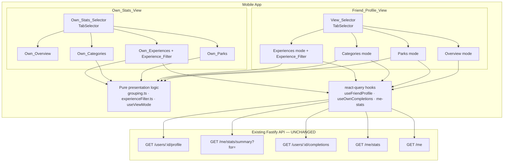
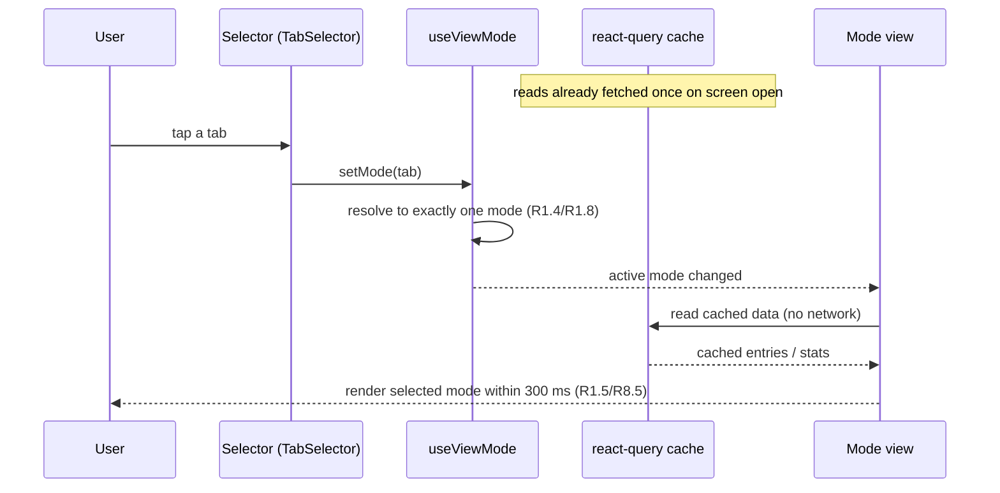
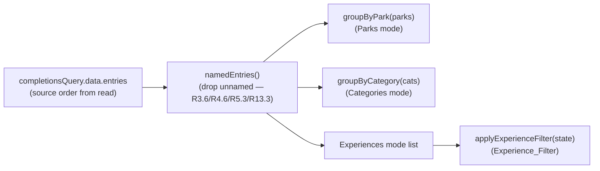

# Design Document

## Overview

Friend Profile Navigation reorganizes two existing mobile screens — the **Friend_Profile_View** (`apps/mobile/src/screens/friends/FriendProfileScreen.tsx`) and the **Own_Stats_View** (`apps/mobile/src/screens/stats/StatsScreen.tsx`) — so a User browses progress through a row of icon-and-label tabs instead of one long scroll. Both screens gain a tab selector with four mutually exclusive modes:

- **Friend_Profile_View** → `View_Selector` with **Overview / Parks / Categories / Experiences**.
- **Own_Stats_View** → `Own_Stats_Selector` with **Own_Overview / Own_Parks / Own_Categories / Own_Experiences**.

The feature is **presentation and in-screen navigation only**. It is purely additive on the client and changes **no backend code, route, authorization rule, or response shape**. Every byte of data the new modes render already arrives from reads the app issues today:

| Read | Endpoint | Used by | Status |
| --- | --- | --- | --- |
| Profile | `GET /users/{friendId}/profile` | Friend Overview | reused as-is |
| Friend statistics | `GET /me/stats/summary?for={friendId}` | Friend Parks / Categories | reused as-is |
| Friend Completions | `GET /users/{friendId}/completions` | Friend Parks / Categories / Experiences | reused as-is |
| Own statistics | `GET /me/stats` | Own_Overview / Own_Parks / Own_Categories | reused as-is |
| Own Completions (Own_Completions_Read) | `GET /users/{ownUserId}/completions` | Own_Experiences | **new client call** to an existing endpoint, on the owner path |
| Own identity | `GET /me` | resolves `ownUserId` for the Own_Completions_Read | reused as-is |

The only genuinely new data fetch is the **Own_Completions_Read**: the Own_Stats_View calls the existing Tracking_Service completions endpoint `GET /users/{userId}/completions` with the **requesting User's own** `userId`. The established `Owner_Or_Friend_Rule` grants this on the owner path (requester === target), so it returns the User's own Completion_Entries with no new backend work and raises no `profile_forbidden` concern for own data. The own `userId` is resolved from the existing `GET /me` read, exactly as `ProfileScreen` already does.

### What changes, concretely

1. A reusable **tab selector** component (`TabSelector`) rendering one icon-and-label tab per mode, with an accessibility selected-state, used by both screens.
2. A small **selection state machine** (`useViewMode`) that holds the active mode and resolves any degenerate state (no mode / more than one mode) back to the single Overview mode.
3. Pure, framework-free **grouping** functions that fold the already-loaded Completion_Entries into Park_Groups and Category_Groups, and a pure **filter** function for the Experience_Filter. These hold the feature's testable correctness logic.
4. A reusable **Experiences list** with an **Experience_Filter** (independent Park and Category selections, both defaulting to "All"), shared by the Friend Experiences mode and the Own_Experiences mode.
5. Per-mode wiring of the existing loading / `profile_forbidden` / error / retry states into the tabbed layout, plus the new `useOwnCompletions` query for the Own_Experiences mode.

### Key Design Decisions

| Decision | Rationale |
| --- | --- |
| Keep the three existing Friend reads and the existing `GET /me/stats` read exactly as they are; only switch the **arrangement** of already-loaded data | The feature is explicitly a presentation enhancement (R6.5, R12.4, R14.4 forbid re-fetching just because a mode or filter changed). Re-using the existing react-query caches means a mode switch is a pure local re-render. |
| Fetch each read **once per screen open**, keyed as today, and derive all four modes from that cached data | R6.5 / R12.4: switching modes must not re-issue any read. With react-query, the modes read from the same cache entry, so no mode switch triggers a network call. |
| Put grouping and filtering in **pure functions** (`grouping.ts`, `experienceFilter.ts`) that take entries + catalog tuples and return ordered groups / filtered lists | This isolates the only input-varying logic in the feature, makes the grouping-integrity guarantees (R6.1–R6.4) and filter guarantees (R14.5–R14.8) property-testable without rendering, and keeps the screens declarative. |
| Model the selected mode as a single discriminated value resolved through `useViewMode`, never as independent per-tab booleans | R1.4 / R1.8 / R8.4 / R8.8 require exactly one mode selected at all times and a defined recovery when that invariant is violated. A single source-of-truth value makes "exactly one" unrepresentable-as-broken, and the resolver makes the recovery total. |
| Reuse the existing `Owner_Or_Friend_Rule` on the **owner path** for the Own_Completions_Read rather than adding an own-completions endpoint | The requirements note the owner path of `GET /users/{userId}/completions` already returns the requester's own data; calling it with `ownUserId` needs no backend change and inherits the existing timeout/error handling. |
| Share one `ExperiencesList` + `Experience_Filter` between the Friend and Own experiences modes, parameterized by the entries and an `originLabel` | R14 requires identical filter behavior on both lists; one component means one place to satisfy R14.5–R14.8 and the accessibility requirements (R14.9). The two filters hold **independent** state (R14.1). |
| Keep `profile_forbidden` handling only on the Friend_Profile_View; the Own_Stats_View has no forbidden branch | R12 intro and R7.2 vs R12: own reads return only the requester's data on the owner path, so `profile_forbidden` cannot occur for own data — encoding that asymmetry prevents a dead, misleading code path on the Own_Stats_View. |

### Goals

- Browse a Friend's and one's own progress through a four-tab navigation with stable ordering, full accessibility labels, and a selected-state indicator.
- Guarantee the grouped views never hide, duplicate, or invent a Completion relative to the flat Experiences list.
- Provide an Experience_Filter that narrows an already-loaded list by Park and Category without any re-fetch.
- Preserve every existing loading, authorization, error, and retry behavior, now scoped within the selected mode.

### Non-Goals

- Any backend change: no new endpoint, no route/authorization/response-shape change, no migration.
- Server-side filtering, sorting, or pagination of Completions (the Experience_Filter is client-side over already-loaded entries).
- Changing the percentage math or the Completions ordering — both remain entirely server-computed and are rendered as received.
- Persisting the selected mode or filter selections across screen unmounts.

## Architecture

The feature lives entirely in the mobile app. The backend boxes below are unchanged and shown only to anchor where each mode's data originates.



### Mode-switch lifecycle (no re-fetch)



The mode switch is a local state transition. Because all reads were already issued (and cached by react-query) when the screen opened, switching modes performs **no** network request (R6.5, R12.4). The Experience_Filter behaves the same way: changing a selection re-derives the displayed list from already-loaded entries with no read (R14.4).

### Data dependency per mode

| Mode | Renders from | Loading / error scope |
| --- | --- | --- |
| Overview | Profile read | Profile request |
| Parks | Friend statistics (per-Park) + Friend Completions (grouped) | both reads, within the Parks pane |
| Categories | Friend statistics (per-Category) + Friend Completions (grouped) | both reads, within the Categories pane |
| Experiences | Friend Completions (filtered) | Completions request, within the Experiences pane |
| Own_Overview | `GET /me/stats` `overall` | stats request |
| Own_Parks | `GET /me/stats` `byPark` | stats request |
| Own_Categories | `GET /me/stats` `byCategory` | stats request |
| Own_Experiences | Own_Completions_Read (filtered) | Own_Completions_Read, within the pane |

A read whose data a mode displays drives that mode's loading indicator only while the read is in flight with no prior data; a `profile_forbidden` on any Friend read collapses the whole Friend_Profile_View to the unavailable message and withholds the View_Selector (R7.2); any other failure renders an in-pane error + retry that leaves the other modes' already-loaded data intact (R7.3, R7.6).

## Components and Interfaces

All paths are under `apps/mobile/src/`.

### Selection state machine — `screens/navigation/useViewMode.ts` (new)

The single source of truth for which mode is active. Generic over a mode tuple so both screens reuse it.

```ts
/**
 * Holds the active mode and guarantees exactly one mode is selected.
 * `modes[0]` is the canonical default (Overview / Own_Overview).
 */
export function useViewMode<M extends string>(
  modes: readonly [M, ...M[]],
): { readonly mode: M; readonly select: (next: M) => void };

/**
 * Pure resolver (exported for tests): given any candidate selection set,
 * return the single mode to display. Returns the sole element when exactly
 * one valid mode is selected; otherwise returns the default `modes[0]`
 * (covers no-selection and multi-selection — R1.8, R8.8 — and the initial
 * render — R1.3, R8.3).
 */
export function resolveSelectedMode<M extends string>(
  modes: readonly [M, ...M[]],
  selected: readonly M[],
): M;
```

`select` ignores a tap on the already-active tab beyond keeping it active (R8.9), and a tap on an unselected tab makes that the sole selected mode (R1.5, R8.5). The state never represents zero or two selected modes; `resolveSelectedMode` exists so the invariant and its recovery (R1.8, R8.8) are unit/property-testable in isolation.

### Tab bar — `screens/navigation/TabSelector.tsx` (new)

Renders one tab per mode, each with a distinct icon and a non-empty text label, and marks the active tab.

```ts
export interface TabSpec<M extends string> {
  readonly mode: M;
  readonly label: string;                       // non-empty (R1.2, R8.2)
  readonly icon: keyof typeof Ionicons.glyphMap; // distinct per tab (R1.2, R8.2)
  readonly accessibilityLabel: string;          // names the mode (R1.7, R8.7)
}

export function TabSelector<M extends string>(props: {
  readonly tabs: readonly TabSpec<M>[];
  readonly active: M;
  readonly onSelect: (mode: M) => void;
}): JSX.Element;
```

Each tab is a `Pressable` with `accessibilityRole="tab"`, `accessibilityState={{ selected: tab.mode === active }}` (R1.7, R8.7), and a visible active treatment (filled background / accent) that differs in at least one visible attribute from inactive tabs (R1.6, R8.6). The active mode's content is the only pane mounted (R1.4, R8.4). Tab specs are module constants so icons are distinct and order is fixed and applied identically on every render (R1.1, R8.1).

### Pure grouping — `screens/navigation/grouping.ts` (new)

Framework-free folds over already-loaded Completion_Entries. These functions hold the grouping-integrity guarantees (R6).

```ts
import type { CompletionEntryDTO, ExperienceCategory, Park } from '@dwt/shared';

/** Entries that have an available (non-empty) Experience name (R3.6, R4.6, R5.3, R13.3). */
export function namedEntries(
  entries: readonly CompletionEntryDTO[],
): readonly CompletionEntryDTO[];

export interface ParkGroup {
  readonly park: Park;
  readonly entries: readonly CompletionEntryDTO[]; // source order preserved (R3.4)
}

/**
 * One ParkGroup per catalog Park, in catalog order. Each named entry lands in
 * exactly the group whose Park equals the entry's Park; entries of other Parks
 * are excluded; unnamed entries are dropped (R3.4, R3.6, R6.1). Order within a
 * group is the source order from the originating read.
 */
export function groupByPark(
  entries: readonly CompletionEntryDTO[],
  parks: readonly Park[],
): readonly ParkGroup[];

export interface CategoryGroup {
  readonly category: ExperienceCategory;
  readonly entries: readonly CompletionEntryDTO[]; // source order preserved (R4.5)
}

/**
 * One CategoryGroup per Experience_Category, in enumerated order. Same
 * partition guarantees as groupByPark (R4.3, R4.6, R6.2).
 */
export function groupByCategory(
  entries: readonly CompletionEntryDTO[],
  categories: readonly ExperienceCategory[],
): readonly CategoryGroup[];
```

The combined-count guarantees (R6.3, R6.4) follow structurally: because each function partitions exactly `namedEntries(entries)`, the concatenation of all groups equals `namedEntries(entries)`, which is exactly what the Experiences mode renders.

### Pure filter — `screens/navigation/experienceFilter.ts` (new)

```ts
export type FilterParkSelection = Park | 'All';        // R14.3
export type FilterCategorySelection = ExperienceCategory | 'All'; // R14.3

export interface ExperienceFilterState {
  readonly park: FilterParkSelection;       // defaults to 'All' (R14.2)
  readonly category: FilterCategorySelection; // defaults to 'All' (R14.2)
}

export const DEFAULT_FILTER: ExperienceFilterState = { park: 'All', category: 'All' };

/**
 * Keep every named entry whose Park matches `state.park` (or 'All') AND whose
 * Category matches `state.category` (or 'All'), in the source order of the
 * originating read; exclude every entry failing either selection (R14.5).
 * With both selections 'All' the result equals namedEntries(entries) (R14.6).
 */
export function applyExperienceFilter(
  entries: readonly CompletionEntryDTO[],
  state: ExperienceFilterState,
): readonly CompletionEntryDTO[];
```

### Experiences list + filter UI — `screens/navigation/ExperiencesList.tsx` (new)

Shared by the Friend Experiences mode and the Own_Experiences mode.

```ts
export function ExperiencesList(props: {
  readonly entries: readonly CompletionEntryDTO[]; // already-loaded, source order
  readonly testIDPrefix: string;                   // 'friend' | 'own'
}): JSX.Element;
```

It owns its own `ExperienceFilterState` via `useState(DEFAULT_FILTER)` — so the two lists' filters are independent (R14.1) — renders the filter controls and a `CompletionRow` per `applyExperienceFilter(entries, state)` result. The filter controls expose, for each of the Park and Category controls, an `accessibilityLabel` naming the control and an `accessibilityValue` reflecting the active selection (R14.9). When the filtered result is empty it shows a "no completed Experiences match the active filter" message (R14.8); when the unfiltered named set is empty it shows the mode's empty-state instead (R5.4, R13.4). Changing a selection updates the rendered list synchronously within the same render pass — well under 300 ms (R14.7) — with no read (R14.4).

### `CompletionRow` — extracted to `screens/navigation/CompletionRow.tsx` (new, refactor)

The existing per-entry row in `FriendProfileScreen.tsx` is extracted so the Park, Category, and Experiences modes — and both screens — render entries identically: Experience name, plus the contextual fields each mode requires, the Completion date as a calendar date, the Rating when present (omitted when absent), and the shared Note when present (omitted when absent) (R3.5, R4.4, R5.2, R13.2). A `fields` prop selects which metadata line a mode shows (Parks omits Park since it is implied by the group; Categories omits Category; Experiences shows both).

### Friend_Profile_View — `screens/friends/FriendProfileScreen.tsx` (refactor)

Keeps the existing three independent queries (`useFriendProfileQuery`, `useFriendStatsQuery`, `useFriendCompletionsQuery`) and their retry policy unchanged. The screen now:

1. Computes the forbidden guard exactly as today; when any Friend read is `profile_forbidden`, it withholds the View_Selector and all four modes and shows the unavailable message (R7.2).
2. Otherwise renders the `View_Selector` (`TabSelector`) plus the active mode via `useViewMode(['Overview','Parks','Categories','Experiences'])` (R1.1–R1.8).
3. Per mode:
   - **Overview** — the existing profile card (name, avatar or placeholder, overall percent to one decimal) (R2.*).
   - **Parks** — for each catalog Park in order, an `Own_Park`-style stat header from `statsQuery.byPark[park]` plus the `groupByPark` entries; an empty Park shows the "no completed Experiences in that Park" message (R3.*).
   - **Categories** — for each category in order, the stat header from `statsQuery.byCategory[category]` (suppressed counts/percent when the group is empty, R4.7) plus the `groupByCategory` entries (R4.*).
   - **Experiences** — `ExperiencesList` over `completionsQuery.data.entries` (R5.*, R14.*).
4. Scopes each mode's loading indicator and error+retry to the read(s) that mode displays (R7.1, R7.3, R7.5, R7.6); the View_Selector remains usable while a non-forbidden read is in error (R7.6).

### Own_Stats_View — `screens/stats/StatsScreen.tsx` (refactor)

Keeps the existing `me-stats` query (`GET /me/stats`) and adds the **Own_Completions_Read** for the Own_Experiences mode only. The screen renders the `Own_Stats_Selector` via `useViewMode(['Own_Overview','Own_Parks','Own_Categories','Own_Experiences'])` (R8.*), with:

- **Own_Overview** — `overall` Completion_Statistic to one decimal with completed/total counts; zero-total shows 0.0 / 0 (R9.*).
- **Own_Parks** — one `Own_Park_Stat` per catalog Park in order from `byPark` (R10.*).
- **Own_Categories** — one `Own_Category_Stat` per category in order from `byCategory` (R11.*).
- **Own_Experiences** — `ExperiencesList` over the Own_Completions_Read entries (R13.*, R14.*).

Loading/error for `GET /me/stats` gates the selector and the three stats modes (R12.1–R12.3, R12.5, R12.6). The Own_Experiences pane has its **own** loading/error/retry scoped to the Own_Completions_Read (R12.7–R12.9). There is no `profile_forbidden` branch (R12 intro).

### Own completions query — `hooks/useOwnCompletions.ts` (new)

```ts
/** Resolve own userId via GET /me, then read GET /users/{ownUserId}/completions. */
export function useOwnCompletionsQuery(): UseQueryResult<FriendCompletionsDTO, ApiError>;
```

It depends on the cached `['me']` query (the same `GET /me` `ProfileScreen` uses) to obtain `ownUserId`, then issues the existing `fetchFriendCompletions(ownUserId)` helper — reusing the established 30-second timeout and error translation in `api/friendProfile.ts` (R12.7, R12.8). Keyed `['own-completions', ownUserId]`, fetched once and read from cache on every Own_Experiences re-entry so a mode switch never re-issues it (R12.4). Because this is the owner path, the server never returns `profile_forbidden` for it; any failure flows through the standard error+retry path (R12.8, R12.9).

## Data Models

No persisted or wire models change. The feature adds **presentation-only** view models in the mobile app.

### Reused wire shapes (unchanged)

- `ProfileDTO` (`@dwt/shared`) — Overview.
- `FriendStatsResponse` / `StatsResponse` (`overall`, `byPark`, `byCategory`, `byParkAndCategory`, each `{ completed, total, percent }`) — Parks / Categories / Own stats modes.
- `FriendCompletionsDTO` = `{ entries: CompletionEntryDTO[] }`, `CompletionEntryDTO = { experienceName, park, category, completedOn, rating, sharedNote }` — Experiences / Own_Experiences modes.

### New view models (client-only)

```ts
// Friend_Profile_View modes (R1.1)
type ProfileViewMode = 'Overview' | 'Parks' | 'Categories' | 'Experiences';

// Own_Stats_View modes (R8.1)
type OwnStatsViewMode =
  | 'Own_Overview' | 'Own_Parks' | 'Own_Categories' | 'Own_Experiences';

interface ParkGroup     { readonly park: Park; readonly entries: readonly CompletionEntryDTO[]; }
interface CategoryGroup { readonly category: ExperienceCategory; readonly entries: readonly CompletionEntryDTO[]; }

interface ExperienceFilterState {
  readonly park: Park | 'All';                 // R14.2, R14.3
  readonly category: ExperienceCategory | 'All'; // R14.2, R14.3
}
```

### Catalog ordering

Parks and Categories iterate the canonical `PARKS` and `EXPERIENCE_CATEGORIES` tuples from `@dwt/shared/enums` (the same tuples `StatsScreen` and `FriendProfileScreen` already use), so the group order and tab/stat order are fixed and applied identically on every display (R3.1, R4.1, R8.1, R10.1, R11.1).



## Correctness Properties

*A property is a characteristic or behavior that should hold true across all valid executions of a system — essentially, a formal statement about what the system should do. Properties serve as the bridge between human-readable specifications and machine-verifiable correctness guarantees.*

This feature is a presentation enhancement, but it contains a well-defined core of **pure, input-varying logic**: folding a list of Completion_Entries into Park_Groups and Category_Groups, filtering an already-loaded list, and resolving the active mode. That logic carries the grouping-integrity guarantees (R6) and the filter guarantees (R14) — exactly the places a regression would silently hide or duplicate a Completion — so it is expressed as properties below and implemented in the pure modules `grouping.ts`, `experienceFilter.ts`, and `useViewMode.ts`.

Everything else — tab rendering and styling (R1.1, R1.2, R1.6, R1.7, R8.1, R8.2, R8.6, R8.7), the 300 ms / 1 s / 2 s SLAs, avatar and empty-state rendering, per-entry field rendering (R2.*, R3.2, R3.5, R3.7, R4.2, R4.4, R4.7, R5.2, R5.4, R9.*, R10.*, R11.*, R13.2, R13.4, R14.2, R14.3, R14.8, R14.9), the loading/`profile_forbidden`/error/retry branches (R7.*, R12.*), and the no-refetch-on-mode-switch / no-refetch-on-filter-change behaviors (R6.5, R12.4, R12.6, R12.9, R14.4, R7.5, R7.6) — does not vary meaningfully with generated input and is verified with React Native Testing Library, example, and request-spy tests (see Testing Strategy). All percentages and counts are computed by the existing Stats_Service and rendered as received, so there is no client-side percentage property.

### Property 1: The Experiences list is exactly the named entries in source order

*For any* list of Completion_Entries returned by a completions read (Friend or own), the Experiences / Own_Experiences list displays exactly those entries that have an available (non-empty) Experience name, in the order returned by the read, each entry exactly once, and omits every entry with no available Experience name.

**Validates: Requirements 5.1, 5.3, 13.1, 13.3**

### Property 2: Park grouping is a faithful, order-preserving partition

*For any* list of Completion_Entries and the catalog `PARKS` tuple, `groupByPark` produces exactly one Park_Group per catalog Park in catalog order; each named entry appears in exactly the group whose Park equals that entry's Park and in no other group; no entry with no available name appears in any group; within each group the entries preserve the source order of the read; and the concatenation of all groups equals, as a multiset and a count, the named-entry set the Experiences mode displays.

**Validates: Requirements 3.1, 3.4, 3.6, 6.1, 6.3**

### Property 3: Category grouping is a faithful, order-preserving partition

*For any* list of Completion_Entries and the `EXPERIENCE_CATEGORIES` tuple, `groupByCategory` produces exactly one Category_Group per category in enumerated order; each named entry appears in exactly the group whose Experience_Category equals that entry's category and in no other group; no unnamed entry appears in any group; within each group the entries preserve the source order; and the concatenation of all groups equals, as a multiset and a count, the named-entry set the Experiences mode displays.

**Validates: Requirements 4.1, 4.3, 4.5, 4.6, 6.2, 6.4**

### Property 4: The Experience_Filter selects exactly the matching named entries in source order

*For any* already-loaded list of Completion_Entries and *any* Experience_Filter state (a Filter_Park_Selection of "All" or one catalog Park, and a Filter_Category_Selection of "All" or one Experience_Category), `applyExperienceFilter` returns exactly the entries that have an available Experience name AND whose Park equals the Filter_Park_Selection or where it is "All" AND whose Experience_Category equals the Filter_Category_Selection or where it is "All", in the source order of the read, and excludes every entry failing either selection; in particular, when both selections are "All" the result equals the unfiltered named-entry set in source order.

**Validates: Requirements 14.5, 14.6, 14.7**

### Property 5: Mode selection always resolves to exactly one mode

*For any* mode tuple (the Profile_View_Modes or the Own_Stats_View_Modes) and *any* candidate selection set, `resolveSelectedMode` returns exactly one mode: the sole selected mode when exactly one valid mode is selected, and otherwise the default mode (Overview / Own_Overview) — covering the initial empty selection, the no-mode-selected state, and the more-than-one-mode-selected state; and selecting the already-active mode leaves that same mode active (selection is idempotent on the active mode).

**Validates: Requirements 1.3, 1.4, 1.8, 8.3, 8.4, 8.8, 8.9**

## Error Handling

The feature introduces no new error codes and no new server interaction. It reuses `ApiError` and the closed `ErrorCode` union from `@dwt/shared`, and the existing 30-second client timeout in `api/friendProfile.ts` that translates an aborted request into a synthetic non-`profile_forbidden` `ApiError` (R7.4, R12.5, R12.8).

| Surface | Condition | Handling |
| --- | --- | --- |
| Friend_Profile_View | Any Friend read returns `profile_forbidden` | Withhold the View_Selector and all four modes; show the unavailable message (R7.2). |
| Friend_Profile_View | A read whose data the active mode displays is in flight, no prior data | Show the in-pane loading indicator within 1 s, until complete / fail / 30 s timeout (R7.1). |
| Friend_Profile_View | A displayed read fails with a non-`profile_forbidden` error (incl. timeout) | Show an in-pane error message + retry for that read; tabs stay usable; other modes' loaded data retained (R7.3, R7.4, R7.6). |
| Friend_Profile_View | User taps retry | Re-issue only the failed read; show its loading indicator (R7.5). |
| Own_Stats_View | `GET /me/stats` in flight, no prior data | Show the view-level loading indicator within 1 s (R12.1). |
| Own_Stats_View | `GET /me/stats` fails or 30 s timeout | Show an error message + retry; retry re-issues stats and shows the loader (R12.3, R12.5, R12.6). |
| Own_Experiences | Own_Completions_Read in flight / fails / 30 s timeout | In-pane loader, then in-pane error + retry scoped to the Own_Completions_Read; retry re-issues only it (R12.7, R12.8, R12.9). |
| Own_Stats_View | (n/a) `profile_forbidden` | Not possible — own reads use the owner path and return only the requester's data; no forbidden branch exists (R12 intro). |

The `profile_forbidden` vs. non-forbidden branch is driven by `ApiError.code`, identical to today's `FriendProfileScreen` logic; the only change is that the non-forbidden error and loading states are now scoped to the active mode's pane rather than the whole scroll.

## Testing Strategy

### Dual approach

- **Property-based tests** verify Properties 1–5 across many generated inputs — the grouping, filtering, and selection logic where a regression would corrupt data integrity.
- **React Native Testing Library (RNTL) tests** verify tab rendering, the selected-state and accessibility wiring, per-mode rendering, avatar/empty states, and the loading / `profile_forbidden` / error / retry branches.
- **Request-spy (integration-style) tests** verify the no-refetch-on-mode-switch (R6.5, R12.4) and no-refetch-on-filter-change (R14.4) behaviors and the scoped-retry behaviors (R7.5, R7.6, R12.6, R12.9) by asserting on a mocked `apiRequest`/fetch call count.

PBT is appropriate here because grouping, filtering, and mode resolution are **pure functions** with universal "for all entries / for all selections" properties over a large input space. PBT is **not** used for the rendering, timing-SLA, navigation-state, or no-refetch behaviors, which are verified by the RNTL and request-spy tests above.

### Property-based testing library and conventions

- **Library**: [`fast-check`](https://github.com/dubzzz/fast-check), the library already used across the repo's `*.prop.test.ts` suites. It runs in the mobile package via Jest. Property-based testing is not implemented from scratch.
- **Location**: `apps/mobile/src/screens/navigation/__tests__/*.prop.test.ts`.
- **Iterations**: every property test runs at least **100 iterations** (`fc.assert(prop, { numRuns: 100 })`).
- **One test per property**: each of Properties 1–5 is implemented by exactly one property-based test.
- **Tagging**: each property test carries a header comment in the form
  `// Feature: friend-profile-navigation, Property {n}: {property text}`.
- **Generators**: a `completionEntryArb` arbitrary produces `CompletionEntryDTO`s with a random Park from `PARKS`, a random category from `EXPERIENCE_CATEGORIES`, an optional rating (`null` or 1–10), an optional shared note, and an Experience name that is sometimes empty/whitespace (to exercise the unnamed-entry filter, R3.6/R4.6/R5.3/R13.3). A `filterStateArb` produces `{ park: 'All' | Park, category: 'All' | ExperienceCategory }`. A `selectionArb` produces arbitrary subsets/multisets of a mode tuple (including empty and duplicate-laden sets) for Property 5.

### Property-to-test mapping

| Property | Function under test | Generator surface |
| --- | --- | --- |
| 1 — Experiences list identity | `namedEntries` | lists mixing named and unnamed entries |
| 2 — Park partition | `groupByPark` | entry lists over all Parks incl. never-visited Parks and unnamed entries |
| 3 — Category partition | `groupByCategory` | entry lists over all categories incl. empty categories and unnamed entries |
| 4 — Experience_Filter | `applyExperienceFilter` | entry lists × `filterStateArb` incl. `All/All`, single-axis, and both-axis selections |
| 5 — Mode resolver | `resolveSelectedMode` / `useViewMode` | both mode tuples × `selectionArb` (empty, singleton, multi) |

### RNTL and example tests

- **Tab navigation (R1.1–R1.7, R8.1–R8.7)**: render each screen; assert four tabs with the expected labels, distinct icons, the active tab's `accessibilityState.selected === true` and others `false`, and that tapping a tab swaps the visible pane (R1.5, R8.5) and keeps the already-active tab active (R8.9).
- **Mode content (R2.*, R3.2, R3.5, R3.7, R4.2, R4.4, R4.7, R5.2, R5.4, R9.*, R10.*, R11.*, R13.2, R13.4)**: per mode, assert the rendered fields, one-decimal percentages, completed/total counts, avatar vs. placeholder, empty Park/Category indications, and empty-state messages, using fixture data.
- **Experience_Filter (R14.1, R14.2, R14.3, R14.8, R14.9)**: assert default `All`/`All`, the option sets equal `PARKS`/`EXPERIENCE_CATEGORIES` plus `All`, independence of the two lists' filters, the no-match empty-state message, and the controls' `accessibilityLabel`/`accessibilityValue`.
- **Loading / forbidden / error / retry (R7.1–R7.4, R12.1–R12.3, R12.5, R12.7, R12.8)**: with controllable promises and fake timers, assert in-pane loaders, the `profile_forbidden` unavailable-and-withheld-selector branch, in-pane error + retry, and the 30-second timeout surfacing as a non-forbidden error.

### Request-spy tests

- **No refetch on mode switch (R6.5, R12.4)**: open a screen, let the initial reads resolve, switch through every mode, assert zero additional `apiRequest` calls.
- **No refetch on filter change (R14.4)**: change Park and Category selections, assert zero additional completions reads.
- **Scoped retry (R7.5, R7.6, R12.6, R12.9)**: fail one read, tap its retry, assert exactly that read is re-issued, other modes still render their cached data, and tabs remain selectable.

### Coverage targets

- Every property (1–5) covered with `numRuns >= 100`.
- The pure modules `grouping.ts`, `experienceFilter.ts`, and `useViewMode.ts` reach ≥ 90% line coverage from the property tests.
- Each screen has at least one RNTL test per mode and one per error/loading branch, and at least one request-spy test for the no-refetch and scoped-retry guarantees.
