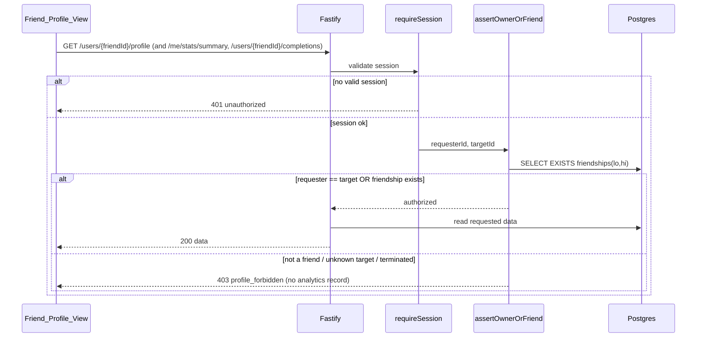
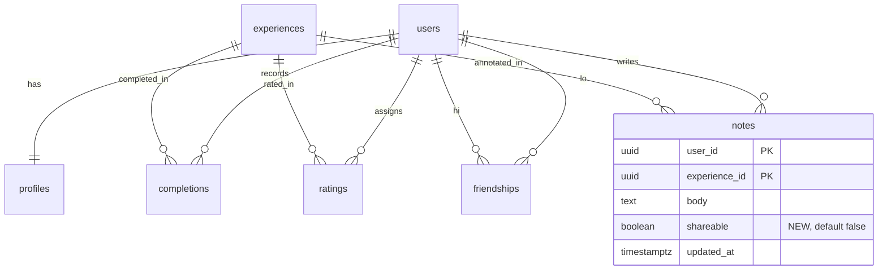

# Design Document

## Overview

The Friend Stats Viewing feature lets a User open one of their accepted Friends and view that Friend's progress in a single screen, the **Friend_Profile_View**: the Friend's Profile summary, completion statistics (overall, per-Park, per-Experience_Category), and the list of Experiences the Friend has completed.

The feature is deliberately **additive** to the existing Disney World Tracker backend. The owner-or-friend authorization model and the percentage computations already exist and are reused rather than re-implemented:

- `Auth_Service` already serves an owner-or-friend Profile read at `GET /users/:userId/profile` (`apps/api/src/services/auth/profileRoutes.ts`), including the Friend's overall completion percentage via `computePercent`.
- `Stats_Service` already serves a friend-or-self statistics summary at `GET /me/stats/summary?for=<userId>` (`apps/api/src/services/stats/routes.ts`).
- Both already enforce the same rule (`assertOwnerOrFriend`) and both deny non-friend reads with a `profile_forbidden` error without recording the attempt.

What is genuinely **new** in this feature:

1. A **Friend-scoped Completions read** — a list of the target User's Completions over Active Experiences, with each entry's Rating and shareable Note. No "list a user's completions" endpoint exists today (the current Tracking_Service Completion routes are all per-Experience, keyed by `(user, experience)`).
2. A **per-Note `shareable` flag**. The requirements glossary defines a Note as carrying a shareable flag that is private by default and only becomes shareable when the owner explicitly marks that Note. The current `notes` table has no such column, so this feature introduces it (migration `0003`) and respects it on the Friend Completions read.
3. A single mobile screen, **Friend_Profile_View**, plus navigation into it from the friends list, that composes the three reads (Profile, statistics, Completions) with independent loading/error/retry states.

### Key Design Decisions

| Decision | Rationale |
| --- | --- |
| Reuse the existing `profile_forbidden` / owner-or-friend rule; do not introduce a parallel authorization path | R1 explicitly requires the same rule and the same opaque error. A single rule means a single place to reason about disclosure and termination semantics (R1.5, R1.7). |
| Extract `assertOwnerOrFriend` into a single shared module (`services/friends/ownerOrFriend.ts`) and have Profile, Stats, and the new Completions read all call it | The rule currently lives in two near-identical copies. Adding a third copy for Completions would make a security-critical invariant drift-prone. One implementation = one audit surface. |
| Add the Friend Completions read as a new endpoint `GET /users/:userId/completions` | Mirrors the existing target-scoped read `GET /users/:userId/profile` (same shape: UUID path param, owner-or-friend gate, returns the target's data). The `?for=` query form used by stats is the alternative; the path form is chosen here for parity with the closest analog (the profile read). |
| Introduce `notes.shareable BOOLEAN NOT NULL DEFAULT FALSE` via migration `0003` | The Completion_Entry must include a Note's text only when it exists and is shareable (R4.6), and must disclose nothing about a non-shareable Note (R4.7). A persisted boolean defaulting to `FALSE` makes "private by default" the storage invariant. |
| The Completions read returns `null` uniformly for both "no Note" and "Note not shareable" | R4.7 requires the response to leak no information about whether a non-shareable Note exists. Collapsing both cases to one wire value (`sharedNote: null`) makes the privacy boundary a property of the response shape, not of handler discipline. |
| Cap the Completions list at 5,000 entries, most-recent-first | R4.1. A hard cap bounds response size and query cost; ordering by Completion date descending makes the cap deterministic. |
| The mobile screen issues three independent queries (Profile / stats / Completions) | R5.2, R5.4, R5.6 require independent loading, error, and retry states per request, and require that a failure in one does not discard data already loaded for the others. |

### Goals

- View a Friend's Profile, statistics, and Completions through one screen, gated by the existing owner-or-friend rule.
- Keep authorization, disclosure, and termination semantics identical to the existing Profile/Stats reads.
- Respect a per-Note shareable flag on the Completions read.

### Non-Goals

- A full Note-management surface beyond the minimal owner toggle described under Data Models. The shareable flag's primary consumer in this feature is the read path; the owner-facing control is limited to a single "share with friends" toggle on the existing Note editor.
- Any change to how the Sharing_Service composes one-off shares (`shares` / `share_recipients`). That is an orthogonal mechanism and is untouched.
- Pagination of the Completions list beyond the 5,000-entry cap.

## Architecture

### Component diagram

```mermaid
flowchart TD
  subgraph Mobile[Mobile App]
    FL[FriendsListScreen]
    FPV[Friend_Profile_View]
  end

  subgraph API[Fastify API]
    SM[requireSession middleware]
    OOF[assertOwnerOrFriend\nservices/friends/ownerOrFriend.ts]
    PROF[Auth_Service\nGET /users/:userId/profile]
    STATS[Stats_Service\nGET /me/stats/summary?for=]
    COMP[Tracking_Service\nGET /users/:userId/completions\nNEW]
  end

  subgraph DB[(Postgres)]
    friendships
    profiles
    completions
    experiences
    ratings
    notes
  end

  FL -->|select friend| FPV
  FPV -->|Profile request| PROF
  FPV -->|stats request| STATS
  FPV -->|Completions request| COMP

  PROF --> SM --> OOF
  STATS --> SM --> OOF
  COMP --> SM --> OOF

  OOF --> friendships
  PROF --> profiles
  PROF --> completions
  STATS --> completions
  STATS --> experiences
  COMP --> completions
  COMP --> experiences
  COMP --> ratings
  COMP --> notes
```

### Request lifecycle for a Friend_Profile_View open



The session check is enforced by the existing `requireSession` pre-handler, which runs **before** any handler body and therefore before the owner-or-friend rule (R1.6). The owner-or-friend rule reads the `friendships` table fresh on every request, so a relationship termination committed before a request's evaluation begins denies that request (R1.7).

## Components and Interfaces

### Shared authorization helper — `services/friends/ownerOrFriend.ts` (new)

Single source of truth for the Owner_Or_Friend_Rule. Extracted from the two existing copies in `auth/profileRoutes.ts` and `stats/routes.ts`.

```ts
/**
 * Authorize a requester to read a target User's owner-or-friend-gated data.
 * Returns immediately when requester === target. Otherwise performs exactly
 * one friendship lookup against the canonical pair and throws
 * AppError('profile_forbidden') on absence. Emits no log/analytics on the
 * deny path (R1.4).
 */
export async function assertOwnerOrFriend(
  pool: DbPool,
  requesterId: string,
  targetId: string,
): Promise<void>;
```

Behavior is identical to today's `assertOwnerOrFriend`: `SELECT EXISTS (SELECT 1 FROM friendships WHERE user_lo_id = $1 AND user_hi_id = $2)` using `canonicalPair(requesterId, targetId)`. `auth/profileRoutes.ts` and `stats/routes.ts` are refactored to import this helper so all three reads share one implementation. The deny path performs no logging (R1.4).

#### Auth_Service — `GET /users/:userId/profile` (reused, unchanged behavior)

Already returns `{ userId, displayName, avatarUrl, overallCompletionPercent }` via `ProfileDTO`, where `overallCompletionPercent` is computed with `computePercent` over the target's Completions against Active Experiences (R2.1–R2.3). `avatarUrl` is `null` when no avatar is set (the App renders a placeholder, R2.6). No code change is required beyond switching its internal `assertOwnerOrFriend` to the shared helper.

#### Stats_Service — `GET /me/stats/summary?for=<userId>` (reused, unchanged behavior)

Already returns the four-dimension `StatsResponse` (`overall`, `byPark`, `byCategory`, `byParkAndCategory`), each as `{ completed, total, percent }`, computed over Active Experiences in a single `REPEATABLE READ READ ONLY` snapshot, with `computePercent` applied uniformly (R3.1–R3.4, R3.6). No code change is required beyond the shared-helper switch.

#### Tracking_Service — Friend Completions read (new)

A new module `services/tracking/friendCompletions/` with a `repo.ts` and `routes.ts`, wired into `buildServer`'s `BuildServerServices` and `composeServices.ts` the same way the existing tracking sub-domains are.

**Endpoint**

| Method | Path | Purpose | Authorization |
| --- | --- | --- | --- |
| GET | `/users/:userId/completions` | Return the target User's Completion_Entries over Active Experiences | `requireSession` then `assertOwnerOrFriend` (R1.1–R1.7, R4.*) |

**Repository surface**

```ts
export interface CompletionEntry {
  readonly experienceName: string;
  readonly park: Park;
  readonly category: ExperienceCategory;
  readonly completedOn: string;       // YYYY-MM-DD
  readonly rating: number | null;     // 1..10 or null (no-rating indicator)
  readonly sharedNote: string | null; // shareable note body, else null
}

export interface FriendCompletionsRepo {
  /** Up to MAX_ENTRIES (5000) entries for `userId`, ordered per R4.8. */
  listCompletions(userId: string): Promise<readonly CompletionEntry[]>;
}
```

**Query** (single statement; `LEFT JOIN` so a missing Rating or non-shareable Note yields `NULL`):

```sql
SELECT e.name AS experience_name,
       e.park,
       e.category,
       c.completed_on,
       r.value AS rating,
       CASE WHEN n.shareable THEN n.body ELSE NULL END AS shared_note
  FROM completions c
  JOIN experiences e ON e.id = c.experience_id AND e.active = TRUE
  LEFT JOIN ratings r ON r.user_id = c.user_id AND r.experience_id = c.experience_id
  LEFT JOIN notes   n ON n.user_id = c.user_id AND n.experience_id = c.experience_id
 WHERE c.user_id = $1
 ORDER BY c.completed_on DESC,
          lower(e.name) ASC,
          lower(e.park) ASC,
          lower(e.category) ASC
 LIMIT 5000;
```

- The `JOIN ... AND e.active = TRUE` excludes Completions against inactive Experiences from both the entry set (R4.5) — Completion rows are preserved in the table but never surfaced.
- `LEFT JOIN ratings` yields `rating = NULL` when the Friend has no Rating (R4.3, R4.4).
- The `CASE WHEN n.shareable THEN n.body ELSE NULL` projection guarantees the body is emitted only for a shareable Note and that a non-shareable Note is indistinguishable from no Note at all (R4.6, R4.7).
- `ORDER BY` matches R4.8 exactly: Completion date descending, then case-insensitive Experience name, Park, then Experience_Category ascending. `LIMIT 5000` plus the date-descending order delivers the most-recent 5,000 when more exist (R4.1).

The route maps each row to a `CompletionEntryDTO` and returns `{ entries }`. An empty result returns `{ entries: [] }`, which the App renders as the empty state (R4.10).

#### Note write-path extension (minimal)

To make a Note shareable, the existing `PUT /me/experiences/:id/note` accepts an optional `shareable: boolean` field (defaulting to `false` when the column is first written, preserving the prior value on edit when omitted). The `notes` UPSERT writes the flag. This is the owner-only path; the flag is never settable by anyone other than the Note's owner because the route is keyed on `request.userId`. This keeps "private by default" (R glossary) and gives the read path something to honor.

#### Mobile — Friend_Profile_View (new screen)

A new screen `apps/mobile/src/screens/friends/FriendProfileScreen.tsx`, registered in `FriendsStack` with a `friendId` + `displayName` route param. `FriendsListScreen`'s `FriendRow` gains an `onPress` that navigates to it (R5.1).

The screen issues **three independent** `useQuery` calls (react-query), one per backend read, keyed by `friendId`:

- `['friend-profile', friendId]` → `GET /users/{friendId}/profile`
- `['friend-stats', friendId]` → `GET /me/stats/summary?for={friendId}`
- `['friend-completions', friendId]` → `GET /users/{friendId}/completions`

Per-request UI states (R5.2–R5.6):

- Each query renders its own loading indicator while in flight with no prior data (R5.2).
- A `profile_forbidden` (403) on any request renders an "unavailable" message and the dependent sections (stats, Completions) are withheld (R5.3).
- A non-`profile_forbidden` error (including the 30-second client timeout, R5.5) renders an error message plus a per-request **retry** control, while leaving any already-loaded sections intact (R5.4). Retry re-issues only the failed request and shows that request's loading indicator (R5.6).
- A 30-second timeout is enforced with an `AbortController` per request; on abort the query rejects with a synthetic non-`profile_forbidden` error so it flows through the retry path (R5.5).

Rendering: display name and overall completion to one decimal place; avatar image or placeholder (R2.4–R2.6); per-Park and per-Category percentages to one decimal place with completed/total counts (R3.5); Completion_Entries with Experience name, Park, Category, date, Rating when present, and shared Note text when present (R4.9).

## Data Models

### New shared DTOs (`packages/shared/src/dto/`)

```ts
// CompletionEntry.ts
export interface CompletionEntryDTO {
  readonly experienceName: string;
  readonly park: Park;
  readonly category: ExperienceCategory;
  readonly completedOn: string;       // ISO-8601 calendar date YYYY-MM-DD
  readonly rating: number | null;     // integer 1..10, or null = no-rating indicator (R4.3, R4.4)
  readonly sharedNote: string | null; // shareable note body, or null = no-shared-note indicator (R4.6, R4.7)
}

export interface FriendCompletionsDTO {
  readonly entries: readonly CompletionEntryDTO[];
}
```

`Profile` and `Stats` DTOs are reused unchanged (`ProfileDTO`, the Stats route's `StatsResponse`).

### Schema change — migration `0003_note_shareable.sql`

```sql
BEGIN;

ALTER TABLE notes
    ADD COLUMN shareable BOOLEAN NOT NULL DEFAULT FALSE;

COMMIT;
```

- `NOT NULL DEFAULT FALSE` makes every existing and new Note private by default (R glossary: "private by default").
- The Friend Completions query reads `notes.shareable` to gate the Note body.
- No index is added: the Note is joined by its `(user_id, experience_id)` primary key, and `shareable` is a projection filter, not a lookup key.

### Entities touched



All other tables (`friendships`, `profiles`, `completions`, `experiences`, `ratings`) are read as they exist today.

## Correctness Properties

*A property is a characteristic or behavior that should hold true across all valid executions of a system — essentially, a formal statement about what the system should do. Properties serve as the bridge between human-readable specifications and machine-verifiable correctness guarantees.*

The acceptance criteria were analyzed for testability. The owner-or-friend authorization rule, the percentage formula, and the Completions projection/filter/order/cap/disclosure logic are pure decision logic over generated inputs and are expressed as properties below. The Requirement 5 UI states, the avatar/empty-state rendering (R2.4–R2.6, R3.5, R4.9, R4.10), the "no analytics on deny" absence-of-side-effect check (R1.4), the session-precedence behavior (R1.6), and the 1-/2-second SLAs are verified with example/RNTL/integration/smoke tests instead (see Testing Strategy), because their observable behavior does not vary meaningfully with input.

Several criteria collapse into a single property: the authorization criteria (R1.1, R1.2, R1.3, R1.5, R1.7, and the stats-endpoint instance R3.6) are one rule over the `(requester, target, friendship-graph)` space; the rounding/clamp/zero-safe criteria (R2.2, R2.3, R3.2, R3.4) are one `computePercent` contract.

### Property 1: Owner-or-friend authorization and opaque denial

*For any* set of Users, friendship graph, and pending-request set, and *for any* requesting User and target identifier, a gated read (Profile, statistics, or Completions) is authorized **iff** the requester is the target or an accepted Friend of the target; in every other case — non-friend, pending-request-only, terminated friendship, or a target identifier absent from the User set — the read is denied with an identical `profile_forbidden` error carrying no data, and the response is indistinguishable across those deny cases.

**Validates: Requirements 1.1, 1.2, 1.3, 1.5, 1.7, 3.6**

### Property 2: Completion-percentage formula is bounded, rounded, and zero-safe

*For any* non-negative integer `completed` and `total`, the reported percentage equals `total == 0 ? 0.0 : min(100.0, round1(completed * 100 / total))`, is always within `[0.0, 100.0]`, is rounded to exactly one decimal place, and reports `0.0` with a total count of `0` when `total == 0` (even when `completed > total`).

**Validates: Requirements 2.2, 2.3, 3.2, 3.4**

### Property 3: Profile projection content

*For any* target profile row, an authorized Profile read returns the display name, the avatar reference when an avatar is set and a `null` no-avatar indicator when none is set, and the overall completion percentage in `[0.0, 100.0]` to one decimal place.

**Validates: Requirements 2.1**

### Property 4: Stats coverage, active-only computation, and counts

*For any* catalog of active and inactive Experiences and *any* completion set, an authorized statistics read returns a breakdown for the overall total, for every Park, and for every one of the six Experience_Categories, where each breakdown's `completed` and `total` counts are computed over only Active Experiences and each `percent` is the `computePercent` of those two counts.

**Validates: Requirements 3.1, 3.3**

### Property 5: Completion-entry content and rating inclusion

*For any* set of the target's Completions over Active Experiences, every returned Completion_Entry carries the completed Experience's name, Park, Experience_Category, and Completion date matching the source rows, includes the Friend's Rating as an integer in `1..10` exactly when a Rating exists for that Experience, and carries a `null` no-rating indicator otherwise.

**Validates: Requirements 4.2, 4.3, 4.4**

### Property 6: Shareable-note disclosure is opaque for absent and private Notes

*For any* Completion_Entry, the entry's shared-note value equals the Friend's Note body when a Note exists for that Experience and is marked shareable, and is exactly `null` in both the no-Note case and the present-but-not-shareable case, so the response cannot distinguish a private Note from no Note.

**Validates: Requirements 4.6, 4.7**

### Property 7: Completions exclude inactive Experiences

*For any* set of Completions mixing Active and inactive Experiences, no returned Completion_Entry references an inactive Experience, while the underlying Completion rows remain unmodified.

**Validates: Requirements 4.5**

### Property 8: Completions are capped at 5,000 most-recent entries

*For any* set of the target's Completions over Active Experiences, the returned list contains at most 5,000 Completion_Entries, and when more than 5,000 exist the returned set is exactly those with the most recent Completion dates (every returned entry's date is greater than or equal to every excluded entry's date).

**Validates: Requirements 4.1**

### Property 9: Completions ordering with case-insensitive tie-breaks

*For any* set of Completion_Entries, the returned list is ordered by Completion date descending, breaking ties by Experience name ascending, then Park name ascending, then Experience_Category ascending, all under case-insensitive comparison.

**Validates: Requirements 4.8**

## Error Handling

The feature uses the existing uniform error envelope (`{ error: { code, message, field?, details? } }`) and the closed `ErrorCode` union from `@dwt/shared`. No new error codes are introduced.

| Condition | Code | HTTP | Notes |
| --- | --- | --- | --- |
| No valid session on any gated read | `unauthorized` | 401 | Enforced by `requireSession` before the owner-or-friend rule (R1.6). |
| Requester is neither target nor accepted Friend | `profile_forbidden` | 403 | Includes pending-request-only (R1.3), unknown target (R1.5), and terminated friendship (R1.7). No data in body. |
| Malformed `:userId` / `for` parameter | `validation_failed` | 400 | Parsed with `uuidSchema` before any DB access. |
| Unhandled exception (DB error, etc.) | `internal_error` | 500 | Global Fastify error hook; redacts internals. |

Deny paths under the owner-or-friend rule perform **no** analytics, audit, or telemetry write (R1.4). The shared `assertOwnerOrFriend` helper logs nothing on deny; the only log line that can result is the global error hook's standard error-response log, which carries the error code but is not a viewing-attempt analytics record.

On the mobile side, `ApiError.code` drives the per-request UI branch: `profile_forbidden` → unavailable message with stats/Completions withheld (R5.3); any other code, plus the 30-second client-side timeout, → error message with a per-request retry control while other already-loaded sections are retained (R5.4, R5.5, R5.6).

## Testing Strategy

### Dual approach

- **Property-based tests** verify Properties 1–9 across many generated inputs.
- **Example-based unit tests** verify specific error codes, the no-analytics-on-deny invariant, and individual UI branches.
- **React Native Testing Library tests** verify the Friend_Profile_View render and state machine.
- **Integration tests** verify the new endpoint end-to-end against Postgres, including the `notes.shareable` migration.
- **Smoke tests** verify the 1-/2-second SLAs (R2.4, R3.5, R4.9, R5.1, R5.2) on representative data.

### Property-based testing library and conventions

- **Library**: [`fast-check`](https://github.com/dubzzz/fast-check) through Vitest for the backend, matching the existing `*.prop.test.ts` suites under `apps/api/src/services/**/__tests__/`. The same library runs in the React Native bundle for any client-side logic. Property-based testing is not implemented from scratch.
- **Iterations**: every property test runs at least **100 iterations** (`fc.assert(prop, { numRuns: 100 })`).
- **Tagging**: every property test carries a header comment naming the design property, e.g.:

  ```ts
  // Feature: friend-stats-viewing, Property 6: For any Completion_Entry, the shared-note
  // value equals the body iff a shareable Note exists, else null (opaque for private/absent).
  ```

- **Single test per property**: each of Properties 1–9 is implemented by exactly one property-based test.
- **Shrinking / determinism**: `fast-check`'s shrinker reports the minimal counterexample on failure; CI records seeds for reproducibility.

### Property-to-test mapping

| Property | Generator surface | Notes |
| --- | --- | --- |
| 1 (authorization) | Random user sets, friendship graphs, pending-request sets, `(requester, target)` pairs incl. self / friend / non-friend / pending-only / unknown / post-termination | Drives the shared `assertOwnerOrFriend`; parameterized over the Profile, stats, and Completions endpoints. |
| 2 (computePercent) | `(completed, total)` incl. `total == 0` and `completed > total` | Reuses the base `computePercent` contract. |
| 3 (profile projection) | Random profile rows with/without avatar | Asserts DTO fields and percent bounds. |
| 4 (stats coverage) | `(experiences[active/inactive], completions)` | Asserts every Park/Category present, active-only counts, percent == computePercent. |
| 5 (entry content) | Completions with/without ratings over active experiences | Asserts fields + rating inclusion/`null`. |
| 6 (shareable-note disclosure) | Notes absent / present-private / present-shareable | Asserts `null` is indistinguishable for absent vs. private; body only for shareable. |
| 7 (active-only completions) | Completions over mixed active/inactive experiences | Asserts no inactive references; source rows untouched. |
| 8 (5000 cap) | `> 5000` completions with varied dates | Asserts length `<= 5000` and most-recent-by-date selection. |
| 9 (ordering) | Completions with colliding dates and case-differing names/parks | Asserts the full case-insensitive comparator on adjacent pairs. |

### Tests not driven by properties

- **No analytics on deny (R1.4)**: unit test injecting a recording analytics/logger spy; assert zero viewing-attempt events across several denied requests.
- **Session precedence (R1.6)**: integration test issuing gated requests with no/expired session for self, friend, non-friend, and unknown targets; assert all return `unauthorized` (401), never `profile_forbidden`.
- **UI render and state machine (R2.4–R2.6, R3.5, R4.9, R4.10, R5.2–R5.6)**: RNTL tests with controllable promises and fake timers covering loading, avatar/placeholder, one-decimal formatting, empty state, `profile_forbidden` withholding, per-request error+retry, retention of other sections, the 30-second timeout, and scoped retry re-fetch.
- **Navigation (R5.1)**: navigation test asserting friend selection routes to `FriendProfileScreen` with the `friendId` param.
- **Endpoint happy path + migration**: one integration test per public read (`GET /users/:userId/completions` happy path) and a schema test asserting `notes.shareable` exists with `NOT NULL DEFAULT FALSE`.
- **Perf SLAs (R2.4, R3.5, R4.9, R5.1, R5.2)**: smoke tests against representative datasets asserting wall-clock budgets.

### Coverage targets

- Every property (1–9) covered with `numRuns >= 100`.
- Unit + property tests reach ≥ 90% line coverage on the Friend Completions repo/route and the shared `assertOwnerOrFriend` helper.
- Integration tests cover the happy path of the new endpoint at least once.
