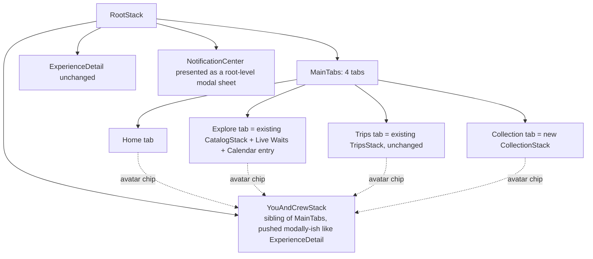

# Design Document

## Overview

This feature replaces the App's flat 5-tab bottom navigation (Home, Catalog, Trips, Friends, Profile) with a stable 4-tab bar plus a center Magic_FAB (Home, Explore, FAB, Trips, Collection), relocates Friends/Profile-identity/sharing/settings behind a header-reachable You_And_Crew surface, promotes the Notification_Center to a global header control, and adds one net-new capability the redesign depends on to make the FAB's "Check Live Waits" action worth having: a park-wide Live_Waits_Screen backed by a new server-side Park_Live_Snapshot read.

The change spans two layers:

1. **Navigation relocation (mobile-only).** `RootNavigator.tsx`'s `MainTabParamList` is rebuilt from five tabs to four, `ProfileStack`/`FriendsStack` are retired as tab-hosted stacks and their screens re-parented under a new `YouAndCrewStack` reachable via a header control, and a new `CollectionStack` hosts Pins/Food/Stats (currently reachable only through `ProfileStack`). Every relocated screen (`PinBoardScreen`, `StatsStack`, `MyFoodHistoryScreen`, `FriendsListScreen`, `InboxScreen`, etc.) is reused unchanged — only its parent stack and entry point move. No screen component is rewritten by this feature except the four new/rewritten navigation-shell screens (`HomeScreen` trim, `ExploreScreen`, `CollectionScreen`, `YouAndCrewScreen`) and the two net-new Live_Waits pieces.
2. **Live Waits (full vertical slice).** A new `GET /parks/:park/live` route backed by a new `ParkLiveService` that reuses the existing per-Experience `Live_Service`'s resilience pattern (cache-first, deadline-bounded fetch, stale-serve fallback, Disney isolation) but keyed by Park instead of by Experience, fetching every child of a park's ThemeParks.wiki entity in one upstream call — verified against the live production API (see External Interfaces) rather than assumed.

### Research notes

Investigation of the existing codebase and the live ThemeParks.wiki API established the following facts that shape the design, so no new upstream integration, fan-out, or unproven assumption is required:

- **`GET /entity/{parkGuid}/live` already returns every child in one call.** Verified directly against the production API: requesting Magic Kingdom's entity GUID returned 71 `liveData` entries (the park entity itself plus every tracked child), each carrying the same `status` / `queue.STANDBY.waitTime` shape the existing `ThemeParksLiveEntry` type already models for the single-entity case. `samplingService.runSamplingPass` already issues exactly this call shape per park (`liveClient.getEntityLive(park.id)`) during its cron pass — this feature's `ParkLiveService` reuses the same client and the same call shape for an interactive, cached, on-demand read instead of a batch sampling pass.
- **Park → ThemeParks GUID resolution already exists.** `samplingService.ts` resolves the WDW destination's parks via `catalogClient.getDestinations()` → `wdw.parks`, giving each park's own ThemeParks GUID directly (a park's live-query id is the park entity's own id — it is not run through `themeParksDirectory.resolveEntityId`, which maps an *Experience's* `Enterprise_Id` to *that Experience's* ThemeParks GUID). `ParkLiveService` reuses this same destination enumeration, cached identically to how `themeParksDirectory` caches its own map (TTL + de-duplicated in-flight build), rather than introducing a second resolution mechanism.
- **The existing per-Experience `Live_Cache`/`LiveCache` pattern is directly reusable, not reinventable.** `cache.ts`'s split between a freshness TTL (evaluated in application code) and a longer Redis key retention (for stale-serve) is exactly the shape a park-keyed cache needs; only the key prefix and payload shape change (a `ThemeParksLiveResponse`-shaped array instead of one projected `LiveDetailDTO`).
- **`thrillFactor` is an existing, already-synced Facet_Group.** `INTEREST_FACET_GROUPS` in `facilityDoc.ts` already includes `thrillFactor`, populated by the existing `disney-facilities-catalog-source`/`experience-facet-enrichment` sync. The Headliner filter (Requirement 10.5) is a read-time match against this existing persisted facet — no new catalog field, no new sync logic.
- **The claimable-Pin count and queue-navigation contract already exist.** `useClaimablePinsBadge()` reads the exact same `pinBoardKey` cache `PinBoardScreen` reads, and `ProfileStack.PinBoard` already accepts `{ celebratePinIds?: string[] }` to drive the existing claim-and-celebrate queue. The Quick_Action_Sheet's "Claim Pins" action (Requirement 4.5) is wiring, not new claim logic.
- **The combined Attention_Badge is already screen-agnostic.** `useAttentionBadge()` and `useClaimablePinsBadge()` are plain hooks with no dependency on being rendered inside a specific tab's icon — today's `ProfileTabIcon` just happens to be their only caller. Promoting the badge to a header control on every Main_Tab (Requirement 8) is a new call site for an existing hook, not new state.

## Architecture

### System context

```mermaid
flowchart LR
    subgraph MobileNav [apps/mobile navigation shell]
        Home[HomeScreen] -->|avatar chip| YAC[YouAndCrewStack]
        Explore[ExploreScreen] -->|jump-in| LiveWaits[LiveWaitsScreen]
        Explore -->|jump-in| Calendar[CrowdCalendarScreen unchanged]
        FAB[Magic_FAB] -->|opens| Sheet[QuickActionSheet]
        Sheet -->|Check Live Waits| LiveWaits
        Sheet -->|Log Ride / Snack| LogModals[LogVisitModal / LogFoodItemModal unchanged]
        Sheet -->|Claim Pins| PinBoard[PinBoardScreen unchanged, via celebratePinIds]
        Sheet -->|View Today's Schedule| TripSchedule[Trip Schedule section unchanged]
        Trips[TripsStack unchanged] --> YAC
        Collection[CollectionStack] --> PinBoard
        Collection --> Stats[StatsStack unchanged]
        Collection --> Food[MyFoodHistoryScreen / MyFoodListsScreen unchanged]
        AllTabs[Every Main_Tab header] -->|bell| NotifSheet[NotificationCenterScreen as modal sheet]
    end

    LiveWaits -->|GET /parks/:park/live| ParkLiveRoute[apps/api park-live route]

    subgraph API [apps/api]
        ParkLiveRoute --> ParkLiveService[ParkLiveService]
        ParkLiveService --> ParkLiveCache[(Redis park-live cache)]
        ParkLiveService --> ThemeParksClient[ThemeParksLiveClient.getEntityLive]
        ParkLiveService --> ParkDirectory[Park to WDW park GUID\nreuses samplingService's getDestinations enumeration]
    end

    ThemeParksClient -->|GET /entity/{parkGuid}/live| TPWiki[ThemeParks.wiki]
```

### Mobile navigation structure (replaces `RootNavigator.tsx`'s tab shape)



`YouAndCrewStack` is registered on the root `RootStack` (a sibling of `MainTabs`, `ExperienceDetail`, `Menu`, etc.) rather than nested inside any one tab, because Requirement 7.2 requires it to be reachable identically from every Main_Tab — nesting it under one tab would make reaching it from another tab a cross-stack navigate with an inconsistent back-stack, whereas a root-level stack is reached the same way (`navigation.navigate('YouAndCrew')`) regardless of which tab is active, and backing out of it always returns to whichever tab/screen was active underneath (mirroring how `ExperienceDetail` already behaves as a root-level push over any tab).

The Notification_Center is likewise promoted to a root-level presentation (`presentation: 'modal'`, mirroring the existing `ShareComposer` registration) rather than living inside any one stack, so every Main_Tab's header bell opens the identical screen instance path.

### Module layout (new / changed)

```
apps/mobile/src/navigation/
  RootNavigator.tsx          (changed) MainTabParamList: Home | Explore | Trips | Collection (4 tabs,
                                       no Catalog/Friends/Profile keys); registers YouAndCrewStack and
                                       NotificationCenter as root-level screens; removes ProfileTabIcon's
                                       tab-icon wiring (badge moves to HeaderBell, not the tab bar)
  ExploreStack.tsx            (renamed from CatalogStack.tsx, extended) adds LiveWaits route
  CollectionStack.tsx         (new) hosts PinBoard/PinShowcase/PinAttribution (moved from ProfileStack)
                                     + MyFoodHistory/MyFoodLists (moved from RootStack) + StatsStack
  YouAndCrewStack.tsx         (new) hosts identity (from ProfileScreen, trimmed), FriendsList/Search
                                     (moved from FriendsStack), Inbox/Sent (moved from FriendsStack),
                                     push/password/logout controls (from ProfileScreen, trimmed)
  FriendsStack.tsx            (removed) contents redistributed into YouAndCrewStack
  ProfileStack.tsx            (removed) contents redistributed into CollectionStack + YouAndCrewStack

apps/mobile/src/screens/
  home/HomeScreen.tsx         (changed) full dashboard command center: personalized header with
                                        avatar pill button, countdown card for upcoming trips,
                                        action dock, park wait pulse carousel, and sectioned leaderboard
  home/UpcomingTripHero.tsx   (new) countdown hero card for upcoming trips reading /me/trips
  home/ActionDock.tsx         (new) 4 quick action tiles: Live Waits, Log Ride, Log Snack, My Pins
  home/ParkWaitPulse.tsx      (new) horizontal line-radar carousel across 4 parks using /parks/:park/live
  home/pulseCalculations.ts   (new) pure calculation of average wait and crowd trend level
  explore/ExploreScreen.tsx   (renamed from catalog/CatalogScreen's role as landing; the existing
                                        CatalogScreen becomes the Explore tab's Browse entry unchanged;
                                        a new thin landing wrapper adds the Live Waits + Calendar
                                        jump-in cards ahead of the existing destination grid)
  liveWaits/LiveWaitsScreen.tsx        (new) park selector, filter row, wait list, Log action per row
  liveWaits/parkLiveView.ts            (new) pure sort/filter/walk-on/headliner core (no I/O)
  collection/CollectionScreen.tsx      (new) landing with Pins / Food / Stats entry cards
  youAndCrew/YouAndCrewScreen.tsx      (new) identity + friends + shares + settings, composed from
                                        existing ProfileScreen/FriendsListScreen sub-pieces
  quickAction/QuickActionSheet.tsx     (new) the Magic_FAB's modal sheet + its action list
  quickAction/MagicFab.tsx             (new) the tab-bar-embedded FAB control
  notifications/NotificationBell.tsx  (new) header control wrapping useAttentionBadge + sheet trigger

apps/api/src/services/live/
  parkLive.ts                (new) ParkLiveService — cache-first park-wide live read, mirrors
                                    themeParksLiveService.ts's structure
  parkLiveCache.ts            (new) Redis-backed cache keyed by park, mirrors cache.ts's TTL/retention split
  parkResolve.ts              (new) Park -> WDW park GUID resolver, reuses catalogClient.getDestinations()
  routes.ts                   (changed, or new parkLiveRoutes.ts) GET /parks/:park/live

packages/shared/src/
  constants/navigation.ts     (new) WALK_ON_THRESHOLD_MINUTES, HEADLINER_THRILL_FACET_VALUES
  schemas/ParkLive.ts          (new) ParkLiveSnapshotDTO + Zod schema
```

## Components and Interfaces

### 1. `MainTabParamList` restructure (`RootNavigator.tsx`) — mobile

```ts
export type MainTabParamList = {
  Home: undefined;
  Explore: NavigatorScreenParams<ExploreStackParamList> | undefined;
  Trips: NavigatorScreenParams<TripsStackParamList> | undefined;
  Collection: NavigatorScreenParams<CollectionStackParamList> | undefined;
};
```

`Friends` and `Profile` are removed from this type entirely (Requirement 1.5, 7.5) — not hidden, not
conditionally rendered, removed as keys, so no code path can select them as a Main_Tab. `TAB_ICONS`
drops its `Friends`/`Profile` entries and the `ProfileTabIcon` component (today's avatar-and-badge tab
icon) is deleted; the identical avatar-rendering logic it contained is reused inside the new
`AvatarChip` header control instead (Requirement 1.1, 2.2, 7.1).

`YouAndCrew` and `NotificationCenter` are added to `RootStackParamList` (siblings of `MainTabs`,
`ExperienceDetail`), not to `MainTabParamList` — they are not tabs (Requirement 1.5).

```ts
export type RootStackParamList = {
  MainTabs: NavigatorScreenParams<MainTabParamList> | undefined;
  ExperienceDetail: { experienceId: string };
  Menu: { experienceId: string };
  ShareComposer: ShareComposerParams;
  FoodListDetail: { foodListId: string };
  FoodListDiscovery: undefined;
  YouAndCrew: undefined;                 // NEW — Requirement 7
  NotificationCenter: { focusRef?: AttentionItemRef } | undefined;  // MOVED from ProfileStack — Requirement 8
};
```

`NotificationCenterScreen`'s own component is unchanged; only its registration moves from
`ProfileStack` to `RootStack` with `presentation: 'modal'` (matching `ShareComposer`'s existing modal
registration), satisfying Requirement 8.2/8.4 (closing the sheet returns to the tab/screen beneath it —
the default `react-navigation` modal-dismiss behavior when no route params changed underneath).

### 2. `AvatarChip` header control (shared across Home/Explore/Trips/Collection) — mobile

A small header control, reused by every Main_Tab's screen header (Requirement 7.2), that renders the
existing avatar-or-placeholder visual (extracted unchanged from the retired `ProfileTabIcon`) and
navigates to `YouAndCrew` on press:

```ts
export interface AvatarChipProps {
  readonly size?: number; // defaults to 28, matching the header's icon-button sizing
}

export default function AvatarChip({ size }: AvatarChipProps): JSX.Element;
```

It reads `/me` via the same `['me']` query key `ProfileScreen`/`ProfileTabIcon` already use, so it
shares the cached avatar preset with zero extra requests. `GradientHeader`'s existing `right` slot
(already a supported prop on every screen using it) is where each tab's landing screen places the
`AvatarChip` + `NotificationBell` pair.

### 3. `NotificationBell` header control — mobile

```ts
export default function NotificationBell(): JSX.Element;
```

Wraps `useAttentionBadge()` (unchanged) to render the existing `AttentionBadge` overlay on a bell icon
button; on press, `navigation.navigate('NotificationCenter')` (root-level, per the restructure above).
Placed in `GradientHeader`'s `right` slot alongside `AvatarChip` on every Main_Tab landing screen
(Requirement 8.1). No new query, no new badge-count logic — this is a new render location for the
existing hook (Requirement 8.3).

### 4. `MagicFab` + `QuickActionSheet` — mobile

`MagicFab` renders as a custom `tabBarButton` for a fifth, non-navigating tab-bar slot positioned
between `Explore` and `Trips` (React Navigation's bottom-tab supports a tab whose `tabBarButton` is
fully overridden and whose `listeners.tabPress` calls `e.preventDefault()` so it never becomes the
"selected" tab — this is the standard pattern for a center action button on a bottom tab bar, and
keeps `MainTabParamList` at exactly four real screen-bearing keys per Requirement 1.1/1.2, with the FAB
itself contributing no tab route).

```ts
export interface QuickAction {
  readonly key: 'liveWaits' | 'logRide' | 'logSnack' | 'claimPins' | 'todaySchedule';
  readonly label: string;
  readonly icon: keyof typeof Ionicons.glyphMap;
}

/**
 * The Quick_Action_Sheet's fixed action order (Requirement 4.2), with "Claim
 * Pins" included only when the claimable count is > 0 (Requirement 4.7). Pure,
 * so it is unit-testable without rendering the sheet.
 */
export function buildQuickActions(claimablePinCount: number): readonly QuickAction[];
```

`QuickActionSheet` is a modal (mirrors the existing `AddToListsSheet`/`ManageFoodListSharesSheet`
bottom-sheet pattern already in the codebase) that renders `buildQuickActions(claimablePinCount)` from
`useClaimablePinsBadge().count` (existing hook, Requirement 4.7) and dispatches on tap:

- **Check Live Waits** → dismiss, then `navigateToLiveWaits(defaultPark)` where `defaultPark` is
  resolved by a pure `resolveDefaultLiveWaitsPark(activeTrip, lastViewedPark)` helper implementing
  Requirement 4.3's fallback chain (active Trip's park → last-viewed park → first park in canonical
  `PARKS` order). "Last-viewed park" is tracked by a small Zustand slice (`liveWaitsStore`, mirroring
  `sessionStore`'s shape) updated whenever `LiveWaitsScreen` mounts with a park selected — no new
  server-side state.
- **Log Ride / Log Snack** → dismiss, then open the existing experience-picker flow the current
  Home/Catalog "Log Ride"/"Log Snack" entry points already use (`LogVisitModal`/`LogFoodItemModal`'s
  existing presentation contract is unchanged; Requirement 4.4).
- **Claim Pins** → dismiss, then `navigation.navigate('MainTabs', { screen: 'Collection', params: {
  screen: 'PinBoard', params: { celebratePinIds: claimableIds } } })`, reusing `PinBoardScreen`'s
  existing `celebratePinIds` claim-and-celebrate queue verbatim (Requirement 4.5) — no new
  celebration-modal invocation path is added.
- **View Today's Schedule** → dismiss, then navigate to the active Trip's `TripSchedule` section when
  one exists, else to `TripsList` (Requirement 4.6), reusing the existing `navigateToTripDetail`/
  `navigateToTripsList` helpers from `navigationRef.ts` that `ActiveTripShortcut` already uses.

### 5. `CollectionScreen` + `CollectionStack` — mobile

`CollectionStack` (new) registers `CollectionHome`, `PinBoard`, `PinAttribution`, `PinShowcase`,
`MyFoodHistory`, `MyFoodLists`, and `Stats` (nesting the existing `StatsStack` unchanged, exactly as
`ProfileStack` does today). `CollectionScreen` (the stack's landing route) renders three entry cards —
Pins, Food, Stats — each a themed `Card` with a representative icon and a short live summary line:

```ts
export interface CollectionScreenProps {}

// Pins card: claimable count via useClaimablePinsBadge() (Requirement 6.4); tapping
// navigates to PinBoard.
// Food card: no live count (matches today's Profile presentation — MyFoodHistory/
// MyFoodListsScreen own their own data); tapping opens a small chooser (History vs
// Lists) or, simpler, navigates directly to MyFoodHistory with a link to Lists from
// there (mirrors today's two separate Profile buttons collapsed onto one card).
// Stats card: the existing StatsScreen overview hero is NOT duplicated here; the
// card navigates into StatsStack's existing Overview route, preserving that
// screen's single-source-of-truth query (`disney-world-tracker` R4.1) unchanged.
```

This mirrors the `catalog-navigation-redesign` spec's `Destination_Screen` pattern of a thin,
non-data-owning landing screen that composes existing, unchanged detail screens — `CollectionScreen`
introduces no new query keys of its own for Pins/Stats (it reads only the two existing badge hooks for
its summary counts) and owns none of the underlying data.

#### Section 5.1: Disney Vault Segmented Hub Redesign (Requirements 6.5–6.9)

To eliminate dead launcher whitespace and provide a rich personal scrapbook hub, `CollectionScreen` is amended into a four-way segmented hub (originally three-way per R6.6; split into "Food" and "Lists" per R6's amendment and `experience-lists` Requirement 12's revision — Experience_Lists are not food-related, and sharing a segment named "Food & Lists" with an unrelated collection type read as a bolted-on capability rather than a first-class part of the hub):
1. **Header & Tab Label (R6.5):**
   - The bottom tab bar displays `tabBarLabel: 'Vault'` and renders an attention badge reflecting `useClaimablePinsBadge().count`.
   - `GradientHeader` renders an eyebrow greeting pill `📌 DISNEY VAULT`, title `My Disney Collection`, and subtitle `Your personal scrapbook of pins, treats, and progress stats`, retaining `NotificationBell` and `AvatarChip` in the header right.
2. **Segmented Control (R6.6a):**
   - Four pills: "Pins" (with unread claimable-pin badge, shortened from "Pins & Showcase" once a 4th equal-width pill made the longer label clip), "Food", "Lists" (no badge — a list count is not actionable/urgent the way a claimable pin is), and "Park Stats".
   - **Amendment (styling correction, not a requirement change):** the segmented control originally sat with a `-16` negative top margin so its rounded card visually overlapped the header's bottom curve ("to eliminate dead launcher whitespace"). This was the only screen in the app using that overlapping treatment — every other `GradientHeader` screen (Explore, Trip Detail, Experience Detail, etc.) places its content flush below the header with no intrusion into the curve — and side-by-side it read as inconsistent, not as an intentional design language. The negative margin is removed; the segmented control now sits with ordinary positive spacing below the header, matching every other screen's pattern.
3. **Pins & Showcase Sub-View (R6.7):**
   - **Claim Banner:** When `claimableCount > 0`, renders a celebratory gold card with a "Claim" button that navigates to `PinBoardScreen` with `{ celebratePinIds }`.
   - **Display Corkboard Canvas:** A 240px-high wood-framed corkboard (`assets/cork.png`). Reuses **only** the read-only projection math from `PinShowcaseScreen.tsx`, mapping fractional `0.0–1.0` floats to board coordinates:
     `x = Math.max(minLeft, Math.min(maxLeft, placement.posX * boardWidth - PIN_SIZE / 2))`
     `y = Math.max(minTop, Math.min(maxTop, placement.posY * boardHeight - PIN_SIZE / 2))`
     without mounting `PanResponder` or drag physics. Tapping a pin opens `PinDetailModal`. A header action "Customize ✏️" navigates to `PinShowcaseScreen`.
   - **Pin Directory Card:** Displays overall progress `X of Y Pins Collected (Z%)` with a progress bar, tier badges, and "View Board ➔" button navigating to `PinBoardScreen`.
4. **Food Sub-View (R6.8a, supersedes the pre-split "Food & Lists" R6.8):**
   - A single summary stat tile for snacks logged (`useQuery(['me-food-item-logs'])`) — no list-count tile here anymore, since list content moved to the "Lists" segment.
   - A "🍽️ Log a food item" primary action opening the exact same restaurant→dish→rating flow `MagicFab`'s existing "Log Snack" quick action already drives (`ExperiencePicker` with `defaultTab="dining"` → `FoodItemPickerModal` → `LogFoodItemModal`), composed locally in `CollectionScreen.tsx` rather than routing through `MagicFab`/`QuickActionSheet` — the Food segment needed its own in-place entry point rather than relying on a User remembering the separate global FAB exists, but the underlying modals and mutation/invalidation logic are the same reused components, not a second implementation.
   - Recent treats passport showing the last 2–3 logged items with ratings.
   - The Classic Treats Checklist card (unchanged from the pre-split view).
   - Primary action "Open Food History Timeline" navigating to `MyFoodHistoryScreen`.
5. **Lists Sub-View (R6.8b, new):**
   - "My Food Lists" card (unchanged content/behavior, moved here from the old "Food & Lists" view) and "My Experience Lists" card (per `experience-lists` Requirement 12, likewise moved here rather than living beside food content) presented as two equal-weight cards, in that order, with no visual hierarchy implying one is primary.
   - Each card's own active-list preview and "+ New / Discover" link are unchanged from their pre-split implementation — this is a relocation of two existing cards onto a new segment, not a rebuild of either.
6. **Park Stats Sub-View (R6.9):**
   - Derived from existing cached `GET /me/stats?percentile=true` (`useQuery(['me-stats', { percentile: true }])`).
   - Overall completion ring/percentage, brag banner, and 4-park coverage bars.
   - Primary action "View Full Stats & Insights" navigating to `StatsStack`.

### 6. `YouAndCrewScreen` + `YouAndCrewStack` — mobile

`YouAndCrewStack` registers `YouAndCrewMain` (the composed identity+friends+shares+settings screen),
plus `FriendProfile`, `FriendsSearch`, `Inbox`, `Sent`, and `PinShowcase` (the read-only friend-showcase
route, moved here from `FriendsStack`).

`YouAndCrewScreen` is composed from the existing `ProfileScreen`'s identity block (avatar picker,
display-name editor — Requirement 7.4) and `FriendsListScreen`'s list-with-search-and-compare content
(Requirement 7.3), plus the existing Inbox/Sent entry cards and the existing
`PushNotificationPreferenceControl`/`ChangePasswordControl`/logout block — all reused as child
components or thin navigation cards, not rewritten.

Section order reflects the unified social identity and preferences hierarchy:
1. **Your Identity:** `ProfileIdentityBlock` with avatar preset picker and display-name editor (R7.4).
2. **My Friends (Crew):** Header with section title, friend count badge, and a `+ Add Friends` action navigating to `FriendsSearch` (R7.3). Friend rows are rendered as sleek single-row items with avatar, name, subtitle (`Friend`), and a right-aligned `[Compare Stats]` action button. When accepted friends exceed `MAX_INLINE_FRIENDS` (value `3`), the inline list displays the first 3 friends and presents an expand/collapse toggle (`Show all (N) friends` / `Show fewer`) to keep the screen bounded (R7.7).
3. **Shared Items:** Side-by-side cards for `Share Inbox` and `Sent Shares` with icon, title, and count subtitles (R7.3).
4. **Preferences & Security:** Grouped list rows for `Push Notifications` and `Change Password` with icons and chevrons, followed by the themed `Log Out` button (R7.3).

The **removed** content (relative to today's `ProfileScreen`) is: the "View your stats" button, "View your food history" button, "View your food
lists" button, "View your pins"/"My Showcase" buttons, and the "View notifications" button — each of
those five now lives in Collection (stats/food/pins) or the global header (notifications), per
Requirements 6 and 8. `ProfileScreen.tsx` itself is trimmed to only the identity block and re-exported
for reuse inside `YouAndCrewScreen`, rather than duplicated.

### 7. `ParkLiveService` — API

The park-wide counterpart to `themeParksLiveService.ts`, deliberately structured to mirror it field for
field so its resilience behavior (Requirement 9.3, 9.4, 9.5) is reviewable by comparison rather than by
re-deriving new failure-mode reasoning:

```ts
export interface ParkLiveEntrySnapshot {
  readonly experienceId: string;       // internal id, joined via upstream_entity_id (R9.6)
  readonly name: string;
  readonly status: string;             // 'OPERATING' | 'CLOSED' | 'DOWN' | 'REFURBISHMENT' | unknown passthrough
  readonly waitMinutes: number | null; // queue.STANDBY.waitTime when present, else null
}

export interface ParkLiveSnapshotResult {
  readonly park: Park;
  readonly entries: readonly ParkLiveEntrySnapshot[];
  readonly retrievedAt: string;
  readonly stale: boolean;
}

export interface ParkLiveService {
  /**
   * Resolve the Park's ThemeParks.wiki entity, cache-check, and (when needed)
   * fetch+project its live feed in one request (R9.1). Throws
   * AppError('live_unavailable') only when a fresh retrieval fails and no
   * cached snapshot exists (R9.5) — mirrors ThemeParksLiveService's contract
   * exactly.
   */
  getParkLive(park: Park, now?: Date): Promise<ParkLiveSnapshotResult>;
}
```

Construction (`createParkLiveService(deps)`) takes the same dependency shape as
`createThemeParksLiveService`: an injected `ThemeParksLiveClient`, a `ParkLiveCache`, a park→GUID
resolver, a clock, and a deadline — reusing the identical fetch-with-deadline / cache-decision /
stale-serve-fallback control flow (Requirement 9.3, 9.4, 9.5), differing only in:

- **Resolution.** Instead of `LiveRepo.resolveUpstreamEntityId` (Experience → Enterprise_Id) +
  `themeParksDirectory.resolveEntityId` (Enterprise_Id → GUID), it resolves directly Park → GUID via a
  new `ParkGuidResolver` (below) — a park's own id is already its ThemeParks GUID; no Enterprise_Id
  join is needed for the park entity itself (Requirement 9.2).
- **Projection.** Instead of `projectThemeParksLive` (single entity → one `LiveDetailDTO`), a new pure
  `projectParkLive(response, upstreamIdToExperienceId)` maps every `liveData` entry whose `id` matches a
  tracked Experience's `upstream_entity_id` into a `ParkLiveEntrySnapshot`, discarding entries with no
  catalog match (Requirement 9.6) — including the park entity's own live entry, which never matches an
  Experience. `upstreamIdToExperienceId` is a `Map<string, string>` built once per call from
  `LiveRepo`'s existing experience-listing capability (reusing the same query shape
  `samplingService.getExperiencesWithUpstreamIds` already uses), not a new per-request N+1 lookup.

```ts
/** Pure — no I/O. Maps a park-wide live response onto tracked Experiences only (R9.6). */
export function projectParkLive(
  response: ThemeParksLiveResponse,
  upstreamIdToExperienceId: ReadonlyMap<string, string>,
): readonly ParkLiveEntrySnapshot[];
```

### 8. `ParkGuidResolver` (`parkResolve.ts`) — API

```ts
export interface ParkGuidResolver {
  /** Park -> its own ThemeParks.wiki entity GUID, or null if unresolvable (R9.2). */
  resolveParkGuid(park: Park): Promise<string | null>;
}
```

Built exactly like `themeParksDirectory.ts`: one `catalogClient.getDestinations()` call, find the WDW
destination, index `park.name` (mapped through the existing Park-name normalization already used
elsewhere in the catalog code) → `park.id`, cache the map with the same TTL + de-duplicated in-flight
build pattern, degrade to an empty map on build failure. This is a second, smaller instance of the same
pattern `themeParksDirectory` already implements — not a shared module, because the two resolve
different things (Experience→GUID vs Park→GUID) even though the underlying enumeration call is
identical; a future refactor could hoist the shared `getDestinations()` enumeration into one place, but
that is out of scope here (this feature does not touch `themeParksDirectory.ts`).

### 9. `ParkLiveCache` (`parkLiveCache.ts`) — API

Structurally identical to `cache.ts`'s `LiveCache`, with a `park-live:v1:{park}` key prefix instead of
`live:v1:{experienceId}`, and separate TTL/retention constants (Configuration & Constants) so the two
caches cannot collide on Redis keys and so a change to one's cadence never silently affects the other:

```ts
export const PARK_LIVE_CACHE_TTL_SECONDS = 300;         // matches LIVE_CACHE_TTL_SECONDS (R9.3)
export const PARK_LIVE_CACHE_RETENTION_SECONDS = 86400;  // matches LIVE_CACHE_RETENTION_SECONDS (R9.4)

export interface CachedParkLive {
  readonly entries: readonly ParkLiveEntrySnapshot[];
  readonly retrievedAt: string;
}

export interface ParkLiveCache {
  get(park: Park): Promise<CachedParkLive | null>;
  set(park: Park, entry: CachedParkLive): Promise<void>;
}
```

### 10. Route (`GET /parks/:park/live`) — API

```ts
app.get('/parks/:park/live', async (request) => {
  const { park } = parseParkParam(request.params); // validates against the Park enum, 400 on mismatch
  const result = await parkLiveService.getParkLive(park);
  return {
    park: result.park,
    entries: result.entries,
    retrievedAt: result.retrievedAt,
    stale: result.stale,
  };
});
```

Session-authenticated, matching every other read route in the app. `live_unavailable` (R9.5) surfaces
through the existing global `AppError` → uniform error envelope handler, exactly like the per-Experience
live route.

### 11. `LiveWaitsScreen` + `parkLiveView.ts` — mobile

```ts
export type LiveWaitsFilter = 'all' | 'walkOn' | 'lightningLane' | 'headliners';

export interface LiveWaitsRow {
  readonly experienceId: string;
  readonly name: string;
  readonly waitMinutes: number | null;
  readonly isClosedOrDown: boolean;
  readonly land?: string | null;
  readonly lightningLane?: LightningLaneState;
  readonly isLightningLane?: boolean;
}

export type WaitStatus = 'low' | 'mod' | 'high' | 'down';

export function getWaitStatus(waitMinutes: number | null, isClosedOrDown: boolean): WaitStatus;

/**
 * Sort (ascending wait, closed/down last — R10.2) and filter (R10.3-R10.6) a
 * ParkLiveSnapshotDTO's entries against the Catalog's Experience list (for
 * category/facet data the live snapshot itself does not carry). Pure, no I/O.
 */
export function buildLiveWaitsRows(
  entries: readonly ParkLiveEntrySnapshot[],
  experiencesById: ReadonlyMap<string, ExperienceDTO>,
  filter: LiveWaitsFilter,
): readonly LiveWaitsRow[];

/** R10.4 — a numeric wait at or below WALK_ON_THRESHOLD_MINUTES. */
export function isWalkOn(waitMinutes: number | null): boolean;

/** R10.5 — the Experience carries a configured high-intensity thrillFactor facet value. */
export function isHeadliner(experience: ExperienceDTO): boolean;
```

`LiveWaitsScreen` fetches `GET /parks/:park/live` (react-query, keyed `['park-live', park]`, `staleTime`
matching `PARK_LIVE_CACHE_TTL_SECONDS`) and the already-cached `GET /catalog?parkId=...` list (for
category/facet data), composes them via `buildLiveWaitsRows`, and renders the park selector (limited to
`PARKS`, styled with themed emojis), the four-way filter `Chip` row (default `'all'`, Requirement 10.3),
the Crowd Status radar card with live wait average and peak-time touring advice (Requirement 10.10),
the sorted row list with status dots, land meta, live Lightning Lane return windows/prices, prominent wait
numbers with `MIN WAIT` labels, and a "Log" button per row opening `LogVisitModal` for that Experience
(Requirement 10.7, 10.11), and the retrieval-time / stale-indicator footer reusing the existing live-detail
staleness presentation pattern from `RideLiveSection.tsx` (Requirement 10.8). A `live_unavailable` response
with no cached snapshot renders the existing themed `EmptyState` (Requirement 10.9), matching `HomeScreen`'s
leaderboard-error branch pattern.

### 12. Home operating-context weather read (`GET /weather/current`) — API and mobile

Added to close a gap found during implementation review of Requirement 2 (task 15): the Home tab's
operating-context subtitle previously hardcoded a literal weather string (`'78° Sunny'`) because no
route exposed the existing `weatherClient.getWDWWeather()` output to the mobile app. Park hours were
already real (`GET /crowd-calendar`'s `parkHours` field, task 6.1's existing route); only weather needed
a new, small addition — no new upstream integration, since `weatherClient.ts` (Open-Meteo, hourly-cached,
already used by `predictionService`/`samplingService`) is reused verbatim.

```ts
// apps/api/src/services/intelligence/routes.ts (changed) — new route, same plugin as /crowd-calendar
app.get('/weather/current', { preHandler: [options.requireSession] }, async () => {
  const weather = await weatherClient.getWDWWeather();
  return {
    current: weather.current
      ? { tempF: weather.current.temp_f, condition: weather.current.condition }
      : null,
  };
});
```

```ts
// packages/shared/src/schemas/Weather.ts (new)
export interface CurrentWeatherDTO {
  readonly current: { readonly tempF: number; readonly condition: string } | null;
}
export const currentWeatherSchema = z.object({
  current: z.object({ tempF: z.number(), condition: z.string() }).nullable(),
});
```

`weather.current` is `null` whenever `WeatherClient.getWDWWeather()`'s own current-observation fetch
came back empty (its existing contract — see `weatherClient.ts`'s `WeatherResult.current`); the route
does not synthesize a value when the client reports none.

On the mobile side, a pure `buildOperatingContextSubtitle` core (`screens/home/operatingContext.ts`)
composes the existing `GET /crowd-calendar` `parkHours` read (for the resolved `currentPark`, today's
date) with the new `GET /weather/current` read into the header subtitle string, per Property 9:

```ts
export interface OperatingContextInputs {
  readonly park: Park;
  readonly parkHours?: { readonly openTime?: string; readonly closeTime?: string } | undefined;
  readonly weather?: { readonly tempF: number; readonly condition: string } | null | undefined;
}

/**
 * Builds the Home header's operating-context subtitle from only the fields
 * present in the two query results (R2.6). Never fabricates a value; omits
 * the weather segment entirely when `weather` is absent (R2.6, Property 9).
 */
export function buildOperatingContextSubtitle(inputs: OperatingContextInputs): string;
```

`HomeScreen.tsx` calls this with `useQuery(['crowd-calendar', 'today', currentPark])` (a single-day
`GET /crowd-calendar?park=...&from=today&to=today` read) and `useQuery(['weather', 'current'])`
(`staleTime` matching the server's hourly cache, e.g. 60 minutes), passing each query's `data` straight
through — `undefined` while loading or on error, which `buildOperatingContextSubtitle` treats identically
to "omit that segment" per Property 9. This replaces the previously hardcoded
`'Magic Kingdom • 8:00 AM – 11:00 PM • 78° Sunny'` fallback string entirely.

## Data Models

### Shared domain model (`@dwt/shared`)

```ts
// schemas/ParkLive.ts (new)
export interface ParkLiveEntryDTO {
  readonly experienceId: string;
  readonly name: string;
  readonly status: string;
  readonly waitMinutes: number | null;
  readonly lightningLane?: LightningLaneState;
}

export interface ParkLiveSnapshotDTO {
  readonly park: Park;
  readonly entries: readonly ParkLiveEntryDTO[];
  readonly retrievedAt: string;
  readonly stale: boolean;
}

export const parkLiveEntrySchema = z.object({
  experienceId: z.string().uuid(),
  name: z.string(),
  status: z.string(),
  waitMinutes: z.number().int().min(0).max(1440).nullable(),
  lightningLane: lightningLaneStateSchema.optional(),
});

export const parkLiveSnapshotSchema = z.object({
  park: parkSchema,
  entries: z.array(parkLiveEntrySchema),
  retrievedAt: z.string(),
  stale: z.boolean(),
});
```

No new persisted table is required — the Park_Live_Snapshot is a cache-only, ephemeral read (Redis TTL
per Configuration & Constants), exactly like the existing per-Experience live detail. No migration is
needed for this feature; the entire feature is additive at the route/service/mobile-navigation layer.

## Correctness Properties

### Property 1: Park_Live_Snapshot projection includes only tracked Experiences and is total

*For any* `ThemeParksLiveResponse` (including one with unmapped/garbage entries, missing `queue`, or a
missing `waitTime`) and *any* `upstreamIdToExperienceId` map, `projectParkLive` never throws, includes
exactly the entries whose `id` is a key in the map (mapped to that Experience's internal id), and
excludes every entry whose `id` is absent from the map — including the park entity's own live entry,
which never appears as a map key.

**Validates: Requirements 9.6**

### Property 2: Sort and filter never drops or duplicates an eligible Row and resolves closed/down last

*For any* set of `ParkLiveEntrySnapshot` entries and any `experiencesById` map, `buildLiveWaitsRows` returns a subset of the input's `experienceId`s with no duplicates; under `'all'` every queue-eligible input entry (categories Ride and Character_Meet, or any entry actively posting a standby wait; excluding Restaurants and schedule-only entertainment without waits) is present as exactly one Row; the returned order has every numeric-wait Row before every closed/down Row, and numeric-wait Rows strictly ascending by `waitMinutes`.

**Validates: Requirements 10.2**

### Property 3: Walk-on and Headliner filters are threshold/facet-exact and monotonic in their own dimension

*For any* Row, `isWalkOn(waitMinutes)` is true iff `waitMinutes` is non-null and
`waitMinutes <= WALK_ON_THRESHOLD_MINUTES`; raising `WALK_ON_THRESHOLD_MINUTES` never removes a
previously-included Row (monotonic in the threshold). *For any* Experience, `isHeadliner(experience)` is
true iff its `groupedFacets.thrillFactor` contains at least one id in `HEADLINER_THRILL_FACET_VALUES`.

**Validates: Requirements 10.4, 10.5**

### Property 4: `buildQuickActions` is a total, order-preserving projection of the claimable count

*For any* non-negative `claimablePinCount`, `buildQuickActions` returns the five fixed actions in the
Requirement 4.2 order when `claimablePinCount > 0`, and the same four actions with `'claimPins'` omitted
when `claimablePinCount === 0`, never reordering the remaining actions and never returning a duplicate
key.

**Validates: Requirements 4.2, 4.7**

### Property 5: `resolveDefaultLiveWaitsPark` always resolves to a valid tracked Park

*For any* combination of `{ activeTripPark: Park | null, lastViewedPark: Park | null }`,
`resolveDefaultLiveWaitsPark` returns `activeTripPark` when non-null, else `lastViewedPark` when
non-null, else the first entry of the canonical `PARKS` order — never `null`, never a value outside
`PARKS`.

**Validates: Requirements 4.3, 10.1**

### Property 6: Trip section structure is untouched by this feature

*For any* Trip, the set of section routes reachable from `TripDetailScreen`'s hub is exactly
`{TripPlannedList, TripSchedule, TripReservations, TripFeed, TripMembers, TripSummary}` — unchanged in
count, membership, and the `trips` spec's Requirement 20 consolidation of Shared_Log/Trip_Feed into the
single `TripFeed` (Trip_Activity) route.

**Validates: Requirements 5.1, 5.2**

### Property 7: Park Wait Pulse computation and crowd trend classification

*For any* set of park live entries with standby wait times, the average wait time is the integer arithmetic mean of all non-null, non-negative wait entries (returning `null` if no attractions are operating with reported waits); the crowd classification is deterministically mapped: `< 20` minutes is `'Walk-on'`, `< 35` minutes is `'Light lines'`, `< 50` minutes is `'Moderate'`, and `>= 50` minutes is `'Heavy'`.

**Validates: Requirements 2.1, 2.5**

### Property 8: Upcoming vacation countdown day derivation

*For any* upcoming trip with a future start date `tripStart` and current date `today`, the countdown days is derived as `Math.max(0, Math.ceil((tripStart.getTime() - today.getTime()) / (1000 * 60 * 60 * 24)))`, never negative and monotonically decreasing as `today` approaches `tripStart`.

**Validates: Requirements 2.1**

### Property 9: Home operating-context subtitle never renders a fabricated hours or weather value

*For any* combination of `{ parkHoursQuery: { data, isLoading, isError }, weatherQuery: { data, isLoading, isError } }`, `buildOperatingContextSubtitle` returns a string built only from fields present in `parkHoursQuery.data`/`weatherQuery.data`; it never returns a string containing a literal temperature, condition word, or open/close time that was not read from one of those two query results. WHEN `weatherQuery.data` is absent (loading or errored), the returned string omits the weather segment entirely rather than substituting a placeholder value. The function is total (never throws) for every combination of loading/error/present states on both queries.

**Validates: Requirements 2.6**

## Error Handling

- **`GET /parks/:park/live` failure, cache present.** `ParkLiveService.getParkLive` returns the cached
  snapshot with `stale: true`, mirroring `ThemeParksLiveService`'s `failureFallback` exactly. The
  screen renders the existing stale-indicator treatment; no error state is shown to the user (R9.4,
  R10.7).
- **`GET /parks/:park/live` failure, no cache.** `AppError('live_unavailable')` → the existing global
  503 envelope. `LiveWaitsScreen` renders the existing themed `EmptyState` "live unavailable" branch
  (R9.5, R10.8).
- **Invalid `:park` path param.** 400 `validation_failed` via the existing shared param-parsing
  convention (matching `parseDetailParams`'s existing pattern in `catalog/routes.ts`).
- **`ParkGuidResolver` build failure.** Degrades to an empty map (mirroring
  `themeParksDirectory.ensureFresh`'s catch branch exactly) so a directory outage degrades every park's
  live read to the stale-serve/`live_unavailable` path above rather than throwing an unhandled
  rejection.
- **`YouAndCrew`/`Collection`/`NotificationCenter` navigation into a screen whose own query fails.**
  Every relocated screen keeps its own existing error handling verbatim (e.g. `ProfileScreen`'s
  `profile_forbidden` empty state, `FriendsListScreen`'s existing error branch) — this feature changes
  no screen's internal error behavior, only its parent stack.
- **Quick_Action_Sheet dispatch with a stale claimable-Pin count** (e.g. a Pin was claimed by a
  concurrent action between opening the sheet and tapping "Claim Pins"). `PinBoardScreen`'s existing
  `celebratePinIds` handling already tolerates an id that is no longer claimable (it re-derives the
  claim queue against the freshly-fetched board — see `pin-collection` Requirement 20.6); no new
  handling is added here.

## Testing Strategy

- **Pure-core property tests (`fast-check`, ≥100 runs)** for `projectParkLive`, `buildLiveWaitsRows`,
  `isWalkOn`, `isHeadliner`, `buildQuickActions`, and `resolveDefaultLiveWaitsPark` — tagged
  `Feature: navigation-redesign, Property N` per the Correctness Properties above.
- **`ParkLiveService` unit tests** with an in-memory fake `ThemeParksLiveClient`/`ParkLiveCache`/clock,
  mirroring `themeParksLiveService`'s existing test structure: fresh-fetch success, cache-hit-within-TTL
  serve, stale-serve-on-failure-with-cache, `live_unavailable`-on-failure-without-cache, and Disney
  source isolation (asserting the service's dependency shape carries no Disney client at all, matching
  `livePathIsolation.test.ts`'s existing pattern).
- **Route integration test (`server.inject`)** for `GET /parks/:park/live`: 200 with a well-formed
  snapshot, 400 on an invalid `:park`, 503 `live_unavailable` on failure with no cache, session-auth
  gate.
- **Mobile navigation structure tests.** A test asserting `MainTabParamList`'s keys are exactly
  `{Home, Explore, Trips, Collection}` (regression guard for Requirement 1.1/1.5) and a test asserting
  `YouAndCrew`/`NotificationCenter` are reachable via `navigation.navigate` from a screen rendered under
  each of the four Main_Tabs (Requirement 7.2, 8.1), following the existing pattern in
  `navigation/__tests__/`.
- **`LiveWaitsScreen` component tests** (`@testing-library/react-native`, mocking only the network/query
  layer): default `'all'` filter renders every row sorted ascending with closed/down last; selecting
  `'walkOn'`/`'headliners'` re-filters without a refetch; tapping a row's "Log" button opens
  `LogVisitModal` for that Experience's id; the stale/`live_unavailable` branches render their expected
  `EmptyState`.
- **`QuickActionSheet` component test.** Renders the five actions when a claimable count is injected,
  four when zero; each tap dispatches the expected navigation call (mocked `navigationRef` helpers) and
  dismisses the sheet.
- **`buildOperatingContextSubtitle` property test (Property 9).** `fast-check`, ≥100 runs, generating
  every combination of present/absent `parkHours` and `weather` inputs; asserts the function never
  throws and never emits a weather segment when `weather` is `undefined`/`null`. Tagged
  `Feature: navigation-redesign, Property 9`.
- **`GET /weather/current` route integration test (`server.inject`).** 200 with `current: null` when
  `weatherClient.getWDWWeather()` returns no current observation; 200 with the mapped `tempF`/`condition`
  when it does; session-auth gate.
- **`HomeScreen` regression test.** Asserts the rendered subtitle never contains the literal string
  `'78°'` or `'Sunny'` regardless of query state — the concrete guard against the fabricated-weather
  defect this addendum fixes.
- **Regression test for Requirement 5 / Property 6.** A `server.inject`-independent snapshot of the
  existing `TripsStackParamList` keys and the `HUB_SECTIONS` array in `TripDetailScreen.tsx`, asserting
  both are byte-for-byte unchanged by this feature's diff — the concrete guard against silently
  re-splitting Trip_Activity.
- **Full `npm run verify`** once the change is complete, per this repo's execution-discipline steering.


## Amendment: Multi-Row Preview, Pin-Aware Ordering, Deep Link, and Inline Create (Requirement 6 amendment 8c)

### Why the single active-list preview row was replaced

The Lists Sub-View's original single-row preview (5. in the Sub-View list above) picked
`ownedLists[0]` with no visible rationale — since `listOwned` already orders by `updatedAt DESC`
(and now, per `food-lists`/`experience-lists` Requirement 14/19, pinned-first), the row shown was
technically "most recently touched," but nothing on screen communicated that, so it read as an
arbitrary pick to a User with more than one list. Worse, tapping the row (or "+ New / Discover")
navigated to the full list-management screen rather than that specific list, adding an extra hop
for the single most common action. This amendment replaces the single row with up to 3 rows per
card, each deep-linking directly to its own list, plus makes the ordering's rationale visible and
actionable via the pin toggle already specified in `food-lists` Requirement 14.5 /
`experience-lists` Requirement 19.5.

### Component changes — `CollectionScreen.tsx`

- Remove `activeList`/`activeExperienceList` (the `[0]`-pick derivations).
- Each of the "My Food Lists"/"My Experience Lists" cards renders
  `ownedLists.slice(0, MAX_COLLECTION_PREVIEW_ROWS)` as individual rows (name, item count, pin
  toggle), reusing the existing row visual style. `ownedLists` is already returned pinned-first by
  `listOwned` (Requirement 14.4/19.4), so no client-side re-sort is needed — the card renders the
  array exactly as received.
- Each row's `onPress` navigates to `FoodListDetail`/`ExperienceListDetail` with that row's own
  `id` (`{ foodListId: item.id }` / `{ experienceListId: item.id }`), replacing the old
  `navigation.navigate('MyFoodLists')`/`'MyExperienceLists'` full-screen jump.
- Each row renders a small pin/unpin icon (e.g. a pin glyph, filled when `pinnedAt !== null`)
  calling `PATCH /me/food-lists/:id`/`PATCH /me/experience-lists/:id` with `{ pinned: !current }`
  and invalidating `['food-lists-collection']`/`['experience-lists-collection']` on success — the
  identical request shape `MyFoodListsScreen.tsx`/`MyExperienceListsScreen.tsx`'s own row-level
  pin control (Requirement 14.5/19.5) sends. Implemented as parallel one-line handler functions
  (`handleToggleFoodListPinned`/`handleToggleExperienceListPinned` in `CollectionScreen.tsx`,
  `handleTogglePinned` in each management screen) rather than a shared hook — each is a single
  `apiRequest('PATCH', ...)` call with no other logic, so extracting a hook would add a layer of
  indirection without removing any duplication worth removing.
- WHERE `ownedLists.length > MAX_COLLECTION_PREVIEW_ROWS` (3), an additional row renders "View
  all (N) →" (`N = ownedLists.length`) navigating to `MyFoodLists`/`MyExperienceLists` — the only
  remaining path to the full management screen from this card.
- The card header's "+ New / Discover" link (unchanged destination for "Discover") gains a
  sibling "+ New" action that opens a small create-list modal in place, without navigating away
  from `CollectionScreen`. This modal is the exact same `CreateFoodListModal`/
  `CreateExperienceListModal` component `MyFoodListsScreen.tsx`/`MyExperienceListsScreen.tsx`
  already renders — extracted from those screens into a standalone component
  (`apps/mobile/src/screens/foodLists/CreateFoodListModal.tsx`,
  `apps/mobile/src/screens/experienceLists/CreateExperienceListModal.tsx`) taking `{ visible,
  onClose, onCreated }`, so `CollectionScreen` and the two management screens share one
  implementation rather than duplicating the name/visibility/(checklist, for food lists)
  form and its validation/error-surfacing.
- The empty-state text ("No saved food lists yet...") is unchanged, rendered when
  `ownedLists.length === 0`.

## Correctness Properties — Addition

### Property 10: Collection Preview Rows Are Exactly the First `MAX_COLLECTION_PREVIEW_ROWS` of the Pinned-First-Ordered Owned List (Added by this amendment)
*For any User and either list card ("My Food Lists" / "My Experience Lists"), the rows rendered on `CollectionScreen` equal `ownedLists.slice(0, 3)` exactly (same ids, same order) as returned by `GET /me/food-lists/collection` / `GET /me/experience-lists/collection`'s `owned` array — no client-side re-sort, re-filter, or `[0]`-style pick is applied. A "View all (N)" row renders if and only if `ownedLists.length > 3`, with `N` equal to the exact `ownedLists.length`.*
**Validates:** Requirement 6 amendment 8c

### Property 11: Each Collection Preview Row Deep-Links to Its Own List (Added by this amendment)
*For any rendered Collection preview row with id `X`, activating that row navigates to `FoodListDetail`/`ExperienceListDetail` with that exact `X` — never to `MyFoodLists`/`MyExperienceLists`, and never to a different row's id.*
**Validates:** Requirement 6 amendment 8c

### Property 12: Collection and Management-Screen Pin Toggles Are Behaviorally Identical (Added by this amendment)
*For any Food_List or Experience_List, activating its pin/unpin toggle on the Collection preview row and activating the equivalent row's pin/unpin toggle on `MyFoodListsScreen`/`MyExperienceListsScreen` issue the identical `PATCH` request body and produce the identical resulting `pinnedAt` state — the two surfaces are two entry points into the same mutation, never two independently-behaving implementations.*
**Validates:** Requirement 6 amendment 8c; `food-lists` Requirement 14.5; `experience-lists` Requirement 19.5

## Testing Strategy — Addition

- **`CollectionScreen.test.tsx`**: extend the existing Lists-segment tests to assert (a) up to 3
  rows render per card ordered exactly as the mocked `collection` response's `owned` array (no
  re-sort), (b) a 4th+ list produces a "View all (N)" row navigating to
  `MyFoodLists`/`MyExperienceLists`, and its absence when `ownedLists.length <= 3`, (c) tapping a
  specific row's `testID` navigates to `FoodListDetail`/`ExperienceListDetail` with that row's own
  id (not a different row's, not the management screen), (d) tapping a row's pin toggle issues
  `PATCH .../:id` with `{ pinned: true }` (or `false` when already pinned) and the row's pin icon
  reflects the new state, (e) tapping "+ New" opens the create-list modal in place (no navigation
  away from `CollectionHome`) and a successful submission adds the new list to the rendered rows.
- **`CreateFoodListModal.test.tsx` / `CreateExperienceListModal.test.tsx`** (new, extracted
  components): render/interaction tests covering name entry, visibility toggle (and checklist
  toggle for the food variant), submit calling `POST /me/food-lists`/`POST /me/experience-lists`
  with the expected body, and a rejected submission surfacing a visible error without closing the
  modal — ported directly from `MyFoodListsScreen.test.tsx`/`MyExperienceListsScreen.test.tsx`'s
  existing create-modal test cases, which are updated to render the extracted component via those
  screens rather than inline modal markup.
