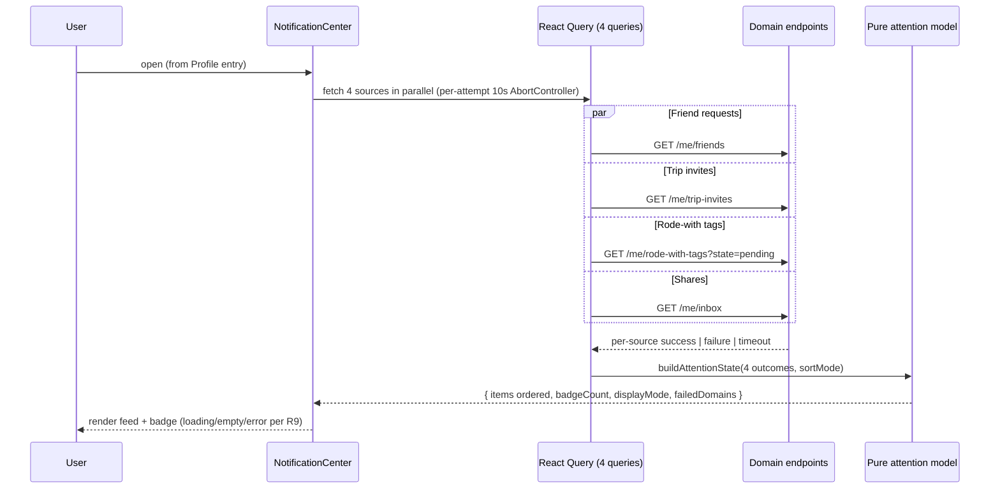
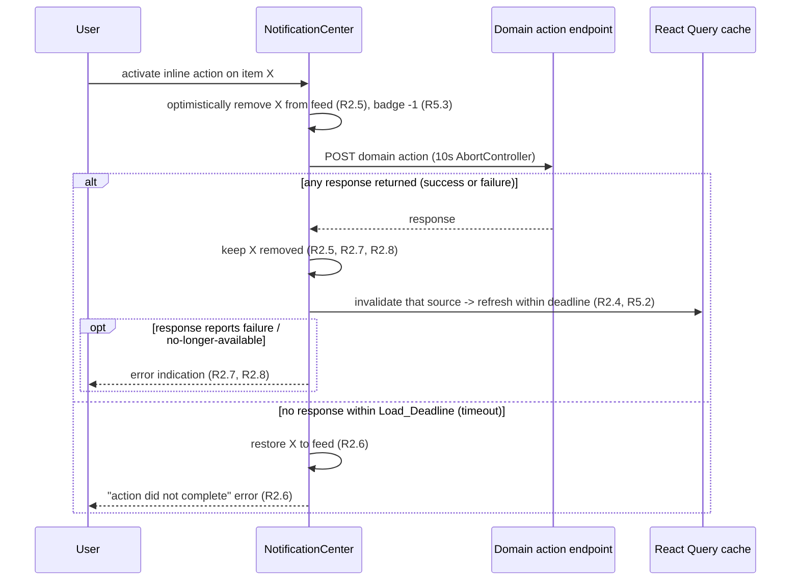

# Design Document

## Overview

The Notification_Center is a single "needs your attention" surface in the
Mobile_App that aggregates pending, actionable items from four independent
domains — Friend_Requests, Trip_Invites, Rode_With_Tags, and unread Shares —
into one ordered Attention_Feed, lets the user act on each item inline, and
drives an app-wide Attention_Badge on the Profile tab.

The central design constraint (Requirement 7) is that the Notification_Center
is **not** a new backend service and **not** a new data store. It is a client
composition layer that reads from each domain's existing per-domain read
endpoint and writes through each domain's existing per-item action endpoint.
Each domain keeps ownership of its data and lifecycle; the Notification_Center
only fans out reads, merges the results into one list, and fans in actions.

To make the merging, ordering, badge, and failure-handling logic testable and
correct independent of React and the network, the design isolates all of that
behavior into a **pure attention model** (`@dwt/shared` + a mobile hook layer).
The pure functions take the four domain responses (or their per-source
success/failure outcomes) and produce the exact Attention_Feed and
Attention_Badge count. The React layer is a thin adapter that fetches, calls the
pure model, and renders.

One backend change is required and is the only backend change: the Trips_API
gains a `GET /me/rode-with-tags?state=pending` read so pending rode-with tags
can be listed the same way the other three domains already expose their pending
reads. Today rode-with tags expose only a single-tag deep-link read plus
confirm/decline, so a missed push leaves a tag unreachable in-app.

### Key design decisions

1. **Client-side aggregation, no aggregation endpoint or store (R7.2, R7.3).**
   The four reads fan out from the client in parallel. There is no `/me/attention`
   endpoint and no denormalized "notifications" table. This preserves per-domain
   ownership and means the feed can never drift from domain truth — it *is*
   domain truth, merged.

2. **Pure model for merge/order/badge/failure.** The ordering rules (R1.4–R1.6,
   R1.8), the badge count and display mode (R4), the badge/feed equality
   invariant (R4.5, R5.6), the optimistic-removal rules (R2.5–R2.8), and the
   partial-failure merge (R8) are all deterministic functions of the domain
   responses. They live in pure, dependency-free functions so they can be
   exhaustively property-tested and reused by both the feed and the badge.

3. **Reuse of existing mobile infrastructure.** The design follows the app's
   established conventions: TanStack React Query for reads/mutations, the
   `apiRequest<T>` client with its `ApiError.code` envelope and 401 →
   session-clear flow, a 60s `refetchInterval` for foreground polling, a
   per-attempt `AbortController` for the 10s Load_Deadline, `useFocusEffect`
   for refresh-on-return, Zustand `sessionStore` for session scoping, the
   `navigationRef` deep-link helpers for push routing, and the themed component
   kit (`GradientHeader`, `Card`, `EmptyState`, `Badge`).

4. **Generalize the existing badge.** `RootNavigator` already has a
   `useNotificationBadgeCount()` that counts only unread Shares + incoming
   friend requests and renders on the Friends tab. This is replaced by a
   four-domain `useAttentionBadge()` rendered on the **Profile** tab (R10.3),
   removing the ad-hoc two-domain rollup.

5. **Consolidation, not duplication (R7.1, R7.5).** The Friends list's
   incoming-request accept/decline section and the Trips list's invitations
   section are removed as actionable surfaces; those actions move to the
   Notification_Center. The Share_Inbox survives as a browse/history/react
   surface reachable from the Notification_Center (R12), but stops being the
   alerting surface for unread Shares.

### Design consideration flagged for review: trip-invite source timestamp

R1.3/R1.4 require every Attention_Item to carry a **source timestamp** used as
the primary sort key. Three of the four reads already expose one:
`FriendRequestDTO.createdAt`, `InboxItemDTO.sentAt`, and the new rode-with
pending read's `createdAt`. The existing `TripIncomingInviteDTO`
(`GET /me/trip-invites`) does **not** expose a timestamp field.

R7.3 says the Notification_Center must not "reshape" the existing endpoints.
This design treats **adding a single additive, optional-to-existing-consumers
`createdAt` field** to `TripIncomingInviteDTO` (sourced from the already-stored
`trip_invites.created_at`) as within the Trips domain's ownership and *not* a
semantic reshape — it changes no request contract, removes no field, and
existing consumers ignore it. This is the minimal change that lets trip invites
participate in timestamp ordering. It is called out here explicitly because it
is the one place the design touches an existing read DTO. **If the reviewer
prefers strict "no touch,"** the fallback is to sort trip invites among
same-adjacent items using their `inviteId` only and place them with a
domain-fixed epoch; that produces a worse ordering and is not recommended.

## Architecture

### System context

```mermaid
graph TD
    subgraph Mobile_App
        NC[NotificationCenterScreen]
        BADGE[Profile tab AttentionBadge]
        MODEL[Pure attention model\n merge / order / badge / failures]
        HOOK[useAttention hook\n React Query fan-out + polling]
        SI[ShareInboxScreen survives]
        NAV[navigationRef deep-link helpers]
    end

    subgraph Trips_API_and_domains[Backend - existing per-domain endpoints]
        FR[GET /me/friends -> incomingRequests\n POST /me/friend-requests/:id/accept|decline]
        TI[GET /me/trip-invites\n POST /me/trip-invites/:id/accept|decline]
        RW[GET /me/rode-with-tags?state=pending  NEW\n POST /me/rode-with-tags/:id/confirm|decline]
        SH[GET /me/inbox\n POST /me/inbox/:id/open]
    end

    NC --> HOOK
    BADGE --> HOOK
    HOOK --> MODEL
    HOOK -->|reads| FR
    HOOK -->|reads| TI
    HOOK -->|reads| RW
    HOOK -->|reads| SH
    NC -->|inline actions| FR
    NC -->|inline actions| TI
    NC -->|inline actions| RW
    NC -->|inline actions| SH
    NC --> SI
    NAV --> NC
```

### Read fan-out and merge flow



### Inline action flow (optimistic removal)



### Layering

- **Pure model layer** (`@dwt/shared/attention`): domain-agnostic types and
  functions. No React, no `fetch`, no timers. This is the property-tested core.
- **Data/hook layer** (`apps/mobile/src/features/notifications`): React Query
  fan-out, polling, focus refresh, optimistic mutation orchestration, session
  gating. Adapts raw domain DTOs into the model's `AttentionSourceOutcome`
  inputs and calls the pure model.
- **Presentation layer** (screens/components): `NotificationCenterScreen`,
  `AttentionItemRow` variants per domain, `AttentionBadge`, loading/empty/error
  states, sort control. Reads only from the hook layer.
- **Backend**: one additive route + repo function + migration index in
  `apps/api/src/services/trips`, plus the additive `createdAt` on
  `TripIncomingInviteDTO`.

## Components and Interfaces

### Backend: rode-with pending read (Requirement 3)

New route in the existing `tripRoutes` plugin
(`apps/api/src/services/trips/routes.ts`), registered before the parametric
`/me/rode-with-tags/:tagId` route so `?state=pending` is matched as a query on
the collection path, not captured as a `:tagId`.

```
GET /me/rode-with-tags?state=pending
```

Behavior:

- `preHandler: requireSession` → a caller with no session gets `unauthorized`
  (401) before any repo call (R3.5).
- The `state` query parameter is validated by a strict local Zod schema
  `z.object({ state: z.literal('pending') }).strict()`. A missing `state`, a
  `state` other than `pending`, or any extra query key is rejected with a
  client-error `AppError` (`validation_failed`, 400) and returns no tags
  (R3.6). This deliberately makes `state` **required** on the collection path so
  the endpoint cannot accidentally return a full unfiltered list.
- On success, delegates to a new repo function `listPendingRodeWithTags(userId)`.

New repo function (`apps/api/src/services/trips/repo.ts`), modeled on
`listMyInvites` and `getRodeWithTag`:

```ts
listPendingRodeWithTags(userId: string): Promise<PendingRodeWithTagDTO[]>
```

- Scoped to `rwt.tagged_member_id = $1 AND rwt.state = 'pending'` (R3.1, R3.2),
  so it never returns tags for other users or tags in any non-pending state.
- Joins `trip_log_entries`, `experiences`, and the tagging member's `profiles`
  row to project the required fields (R3.3).
- `ORDER BY rwt.created_at DESC, rwt.id ASC` (R3.1) — descending creation time
  with a deterministic id tie-break.
- Returns `[]` for a user with no pending tags (the route replies `200`) (R3.4).

Registration/order note: like the existing `/me/inbox/unread-count` vs
`/me/inbox/:shareId` ordering, the collection route with the query is registered
so the static/collection form wins over the parametric `:tagId` form.

### Mobile: pure attention model (`@dwt/shared/attention`)

Domain-agnostic types and functions, no dependencies:

```ts
export type AttentionDomain =
  | 'friendRequest'
  | 'tripInvite'
  | 'rodeWithTag'
  | 'share';

/** One normalized pending item, produced from a domain DTO. */
export interface AttentionItem {
  readonly domain: AttentionDomain;
  readonly id: string;              // domain item identifier
  readonly sourceTimestamp: string; // ISO-8601; primary sort key
  readonly summary: string;         // <= 140 chars, identifies user + subject
  // Opaque per-domain identifiers needed to invoke actions / open destination.
  readonly ref: AttentionItemRef;
}

/** Per-source read outcome fed into the model. */
export type AttentionSourceOutcome =
  | { readonly domain: AttentionDomain; readonly status: 'success';
      readonly items: readonly AttentionItem[] }
  | { readonly domain: AttentionDomain; readonly status: 'failure' };

export type SortMode = 'timestampDesc' | 'groupByDomain';

export interface AttentionState {
  readonly items: readonly AttentionItem[]; // ordered per sortMode
  readonly badgeCount: number;
  readonly badgeDisplay: BadgeDisplay;       // hidden | count | overflow
  readonly failedDomains: readonly AttentionDomain[];
  readonly allFailed: boolean;
}
```

Pure functions:

- `summarize(domain, dto): string` — build the ≤140-char human summary and
  hard-truncate to 140 (R1.3).
- `toAttentionItem(domain, dto): AttentionItem` — normalize a domain DTO into an
  `AttentionItem`.
- `DOMAIN_ORDER: readonly AttentionDomain[]` = `['friendRequest','tripInvite','rodeWithTag','share']`
  (R1.5, R1.8).
- `compareItems(a, b): number` — timestamp desc, then `DOMAIN_ORDER` index, then
  `id` ascending lexicographic (R1.4, R1.5, R1.6).
- `orderItems(items, sortMode)` — `timestampDesc` sorts by `compareItems`;
  `groupByDomain` groups in `DOMAIN_ORDER`, each group sorted by timestamp desc
  (R1.7, R1.8).
- `badgeDisplayFor(count): BadgeDisplay` — `0 → hidden`, `1..99 → count`,
  `>=100 → overflow "99+"` (R4.2, R4.3, R4.4).
- `buildAttentionState(outcomes, sortMode): AttentionState` — the top-level
  reducer. Concatenates items from **successful** sources only, orders them,
  sets `badgeCount = items.length` (guaranteeing R4.5, R5.6, R8.4), derives
  `badgeDisplay` from that same count (R4.6), collects `failedDomains`, and sets
  `allFailed` when every source failed (R8.7).

Because `badgeCount` is *defined as* `items.length` over the same successful
outcomes used to build the feed, the badge and feed can never disagree — the
consistency requirements are structural, not a runtime reconciliation.

### Mobile: data/hook layer

`useAttention(sortMode)` — orchestrates the four React Query reads and returns
an `AttentionState` plus per-source loading/failure flags and action helpers.

- Query keys reuse existing domain keys where present so cache stays coherent
  with the surviving domain screens:
  - `['friends']` → `GET /me/friends`, `select: data => data.incomingRequests`
  - `['trips','invites']` → `GET /me/trip-invites`
  - `['rodeWithTags','pending']` → `GET /me/rode-with-tags?state=pending` (new)
  - `['inbox']` → `GET /me/inbox`, `select: data => data.items.filter(!read)`
- Foreground polling: `refetchInterval: 60_000` (Polling_Interval) on all four
  (R5.1, R6.1). New pending items that appear on a poll flow into the badge
  within one interval (R6.1, R6.3).
- `useFocusEffect` refetches all four on return to the screen (R5.5).
- Per-attempt 10s `AbortController` + `retry: false` enforces the Load_Deadline;
  a read that aborts or rejects becomes an `AttentionSourceOutcome` with
  `status: 'failure'` (R8, R9.4).
- Session gating: subscribes to `sessionStore.token`. With no token, all queries
  are `enabled: false` and the hook returns an empty state (no items, hidden
  badge) (R11.2, R11.3). On session end, `queryClient.clear()` discards every
  cached pending item so nothing leaks to a later session (R11.4, R11.6); the
  existing 401 → `notifyUnauthorized()` path already clears the token.

`useAttentionBadge()` — a thin wrapper that returns just `badgeDisplay` from the
same hook, rendered on the Profile tab icon. Because it shares the same query
keys/cache, the badge and the open feed observe identical data (R4.5, R5.6,
R10.6).

Inline action helpers (one `useMutation` per action kind), each implementing the
optimistic-removal contract:

- `onMutate`: snapshot, optimistically remove the item from every relevant
  cached list, decrement is implicit (badge derives from list length) (R2.5,
  R5.3).
- `mutationFn`: `apiRequest('POST', endpoint, body?, signal)` with a 10s
  `AbortController`.
- On **any returned response** (2xx or error envelope): keep the item removed
  and invalidate that source to refresh within the deadline (R2.4, R2.5, R2.7,
  R2.8). Map `ApiError.code` to an error indication; `trip_not_found` /
  `friendship_not_found` / inbox not-found → "no longer available" (R2.8);
  other failures → "action did not complete" (R2.7).
- On **timeout/abort (no response)**: restore the snapshot item and show
  "action did not complete" (R2.6).

Endpoint map for inline actions (all existing, unchanged — R7.6):

| Domain | Accept/Confirm/Read | Decline |
| --- | --- | --- |
| Friend_Request | `POST /me/friend-requests/:id/accept` | `POST /me/friend-requests/:id/decline` |
| Trip_Invite | `POST /me/trip-invites/:inviteId/accept` | `POST /me/trip-invites/:inviteId/decline` |
| Rode_With_Tag | `POST /me/rode-with-tags/:tagId/confirm` (optional `{rating}`) | `POST /me/rode-with-tags/:tagId/decline` |
| Share | `POST /me/inbox/:shareId/open` | — (mark-read only) |

### Mobile: presentation layer

- `NotificationCenterScreen` — hosts the Attention_Feed, the sort control
  (R1.7), the loading/empty/error branches (R9), the retry control for failed
  sources (R8.2, R8.5), a partial-failure banner naming failed domains (R8.1),
  and a control that opens the full `ShareInboxScreen` (R2.9, R12.2). Reached
  from a `Profile_Notifications_Entry` in the Profile area (R10.2, R10.5).
- `AttentionItemRow` — renders the domain type, summary, and relative timestamp,
  and the per-domain inline controls (R2.1): Accept/Decline (friend request,
  trip invite), Confirm-with-optional-rating/Decline (rode-with tag), Mark read
  (share). A Share that references a Share_Destination also renders an "Open"
  control (R2.3), reusing the Inbox screen's destination-verify + cross-navigate
  logic.
- `AttentionBadge` — themed count badge; `hidden`/`count`/`"99+"` per
  `badgeDisplay`; rendered on the Profile tab (R10.3, R10.4) and reused inside
  the screen header if desired.
- State exclusivity: the screen renders exactly one of loading / empty / error
  at a time (R9.6), preferring loading while any read is in flight (R9.3), and
  showing empty only when all four succeed with zero total items (R9.2).

### Mobile: push routing (Requirement 13)

`useNotificationResponse` / `navigationRef` are updated so a tapped push for a
Friend_Request, Trip_Invite, Rode_With_Tag, or Share opens the
Notification_Center rather than a standalone handler screen (R13.1, R13.4). A
new `navigateToNotificationCenter(params?: { focusRef?: AttentionItemRef })`
helper deep-links into the Profile stack. The screen attempts to surface the
referenced item (R13.2); if it is no longer pending/available, it shows the
"no longer available" indication and still opens the feed where possible
(R13.3). The existing `TripInvite`, `RodeWithConfirm`, and inbox deep-link
targets are removed from the tap-routing switch in `dispatchPendingTap`.

## Data Models

### New shared DTO: `PendingRodeWithTagDTO`

Added to `packages/shared/src/trips.ts` (and exported from the package index),
mirroring the field set called out in R3.3:

```ts
/**
 * One `pending` Rode_With_Tag as surfaced to the Tagged_Member in the
 * Notification_Center (`GET /me/rode-with-tags?state=pending`). Only `pending`
 * tags are listed, so a row here is always actionable (R3.1–R3.3).
 */
export interface PendingRodeWithTagDTO {
  readonly tagId: string;
  readonly tripLogEntryId: string;
  readonly experienceName: string;
  readonly taggingMemberDisplayName: string;
  readonly createdAt: string; // ISO-8601; source timestamp + sort key
}
```

A `pendingRodeWithTagSchema` Zod validator is added alongside the existing trips
schemas for symmetry and API/DTO drift protection.

### Additive field on `TripIncomingInviteDTO`

```ts
export interface TripIncomingInviteDTO {
  readonly inviteId: string;
  readonly tripId: string;
  readonly tripName: string;
  readonly startDate: string;
  readonly endDate: string;
  readonly inviterDisplayName: string;
  readonly inviterAvatarPreset: string | null;
  readonly createdAt: string; // NEW: ISO-8601, from trip_invites.created_at
}
```

Sourced from the already-stored `trip_invites.created_at`; `listMyInvites`
selects and maps it. See the flagged design consideration above.

### Attention item normalization

How each domain DTO maps into the pure model's `AttentionItem`:

| Domain | Read source | `id` | `sourceTimestamp` | `summary` inputs | action `ref` |
| --- | --- | --- | --- | --- | --- |
| friendRequest | `GET /me/friends`.`incomingRequests[]` (`FriendRequestDTO`) | `id` | `createdAt` | sender display name | `requestId` |
| tripInvite | `GET /me/trip-invites` (`TripIncomingInviteDTO`) | `inviteId` | `createdAt` | inviter name + trip name | `inviteId`, `tripId` |
| rodeWithTag | `GET /me/rode-with-tags?state=pending` (`PendingRodeWithTagDTO`) | `tagId` | `createdAt` | tagging member + experience name | `tagId`, `tripLogEntryId` |
| share | `GET /me/inbox`.`items[]` unread (`InboxItemDTO`) | `shareId` | `sentAt` | sender name + payload label | `shareId`, optional destination |

The `summary` is composed then hard-truncated to 140 characters (R1.3). The
`ref` carries only identifiers already present in the domain DTO, so actions and
destination-open reuse the unchanged domain endpoints (R7.6).

### Database

No new tables. The rode-with pending read uses the existing `rode_with_tags`
table. A new migration `0017_rode_with_pending_read.sql` adds a supporting
partial index so the scoped, ordered pending read stays efficient, following the
additive BEGIN/COMMIT + inline-comment conventions of prior migrations:

```sql
BEGIN;
-- Supports GET /me/rode-with-tags?state=pending: scoped to the Tagged_Member,
-- filtered to pending, ordered by created_at DESC (R3.1, R3.2).
CREATE INDEX rode_with_tags_pending_by_member_idx
    ON rode_with_tags (tagged_member_id, created_at DESC)
    WHERE state = 'pending';
COMMIT;
```

The existing `rode_with_tags_tagged_member_idx` remains; the new partial index
is purely additive and touches no data.

## Correctness Properties

*A property is a characteristic or behavior that should hold true across all
valid executions of a system — essentially, a formal statement about what the
system should do. Properties serve as the bridge between human-readable
specifications and machine-verifiable correctness guarantees.*

This feature is a strong fit for property-based testing because its core —
merging four domain reads into one ordered feed, computing the badge, and
handling partial failure — is a set of pure, deterministic functions over
arbitrary domain responses. The UI wiring, navigation, polling cadence, session
lifecycle, and push routing are covered by example and integration tests
instead (see Testing Strategy).

**Reflection on redundancy.** The prework surfaced many overlapping criteria that
consolidate: the badge/feed equality invariant (R4.1, R4.5, R5.3, R5.6, R6.2,
R8.4) is one property because the badge count is *defined as* the feed size; all
ordering tie-breaks (R1.4–R1.6) form one total-order property; every
optimistic-removal outcome (R2.4–R2.8, R5.2) is one invariant with a
returned-response branch and a timeout branch; feed membership and partial
failure (R1.2, R6.1, R6.3, R8.1) fold into one feed-composition property; the
badge display rules (R4.2–R4.4, R4.6, R10.3, R10.4) form one mapping property;
and the backend pending read's filter, scope, and projection (R3.1–R3.3) form
one comprehensive property. The result is 13 non-redundant properties.

### Property 1: Feed composition over successful sources

*For any* combination of per-source outcomes (each source either a success with
an arbitrary set of pending items, or a failure), the Attention_Feed contains
exactly one Attention_Item for each pending item of each **successful** source
and no item from any failed source, and the reported failed-domain set equals
exactly the set of failed sources.

**Validates: Requirements 1.2, 6.1, 6.3, 8.1**

### Property 2: Item summary and shape

*For any* pending domain item, its Attention_Item carries the item's domain type
and its source timestamp, and its summary is at most 140 characters.

**Validates: Requirements 1.3**

### Property 3: Default (timestamp-descending) ordering is a total order

*For any* set of Attention_Items, ordering in the default mode yields a
permutation of the input that is sorted by source timestamp descending, then by
domain type in the fixed sequence Friend_Request, Trip_Invite, Rode_With_Tag,
Share, then by domain item identifier in ascending lexicographic order.

**Validates: Requirements 1.4, 1.5, 1.6**

### Property 4: Group-by-domain ordering

*For any* set of Attention_Items, ordering in the group-by-domain mode yields a
permutation of the input in which items are grouped by domain type in the fixed
sequence Friend_Request, Trip_Invite, Rode_With_Tag, Share, and within each
group are sorted by source timestamp descending.

**Validates: Requirements 1.8**

### Property 5: Inline action endpoint mapping

*For any* Attention_Item and any inline action valid for its domain, activating
that action invokes exactly that domain's existing per-item action endpoint,
with the HTTP method, path, and identifiers dictated by the item's domain and
its identifiers (and the optional rating for a rode-with confirm), and invokes
no other endpoint.

**Validates: Requirements 2.2, 7.6**

### Property 6: Optimistic removal outcome invariant

*For any* Attention_Feed and any item in it on which an inline action is
activated: after the action resolves, if the action endpoint returned any
response (reporting success or failure), that item is absent from the feed; if
the action did not return within the Load_Deadline, that item is restored to the
feed; and in either case every other item in the feed is unchanged.

**Validates: Requirements 2.4, 2.5, 2.6, 2.7, 2.8, 5.2**

### Property 7: Badge count equals feed size

*For any* combination of per-source outcomes, the Attention_Badge count equals
the number of Attention_Items presented in the Attention_Feed for those same
outcomes (counting only successful sources); consequently, removing any k items
from the feed reduces the count by exactly k and the count is never negative.

**Validates: Requirements 4.1, 4.5, 5.3, 5.6, 6.2, 8.4**

### Property 8: Badge display derivation

*For any* total attention count n, the badge display is hidden when n is 0, the
exact value n when n is between 1 and 99 inclusive, and "99+" when n is 100 or
greater; and the badge's display mode and displayed value are always derived
from the single badge count (the shown indicator is always consistent with that
count).

**Validates: Requirements 4.2, 4.3, 4.4, 4.6, 10.3, 10.4**

### Property 9: Rode-with pending read is scoped, filtered, ordered, and complete

*For any* population of rode-with tags across arbitrary users and states,
`GET /me/rode-with-tags?state=pending` for a given caller returns exactly the
tags whose tagged member is that caller and whose state is `pending`, excludes
every tag that is not pending or belongs to another user, orders the result by
creation timestamp descending, and populates every required field (tag
identifier, linked trip-log-entry identifier, referenced Experience name,
tagging member display name, creation timestamp) for each returned tag.

**Validates: Requirements 3.1, 3.2, 3.3**

### Property 10: Retry recomputes state from the latest per-source outcomes

*For any* prior set of successful sources and any set of retried-source
outcomes, the Attention_State after a retry equals the state computed from the
latest outcome of every source (retried successes replace their prior failure
and merge with the previously loaded successful items; still-failed sources
remain in the failed-domain set).

**Validates: Requirements 8.5, 8.6**

### Property 11: Total-failure state

*For any* combination of per-source outcomes in which every source failed, the
Notification_Center is in the error state (never the empty-success state) and
the Attention_Badge displays no count indicator.

**Validates: Requirements 8.3, 8.7**

### Property 12: View classification is mutually exclusive

*For any* combination of in-flight status and per-source outcomes, the view
classifier returns exactly one view: it returns loading whenever at least one
read is still in flight; it returns empty only when all four reads succeeded and
the total number of pending items is zero; otherwise it returns the error view
(when applicable) or the populated list — never more than one at a time.

**Validates: Requirements 9.2, 9.3, 9.6**

### Property 13: Session gating

*For any* cached or prior domain data, when no authenticated session exists the
Attention_Feed presents no Attention_Items and the Attention_Badge displays no
count indicator.

**Validates: Requirements 11.2, 11.3**

## Error Handling

Error handling follows the app's established `ApiError` envelope and the
Load_Deadline discipline.

### Per-source read errors (Requirements 8, 9)

- Each of the four reads runs under its own per-attempt `AbortController` with a
  10s Load_Deadline. A rejection, a non-2xx `ApiError`, or an abort (timeout) is
  normalized to an `AttentionSourceOutcome` of `status: 'failure'` for that
  domain (R9.4).
- Partial failure: successful sources still render; a banner names each failed
  domain type; an enabled retry re-requests only the failed sources and merges
  results (R8.1, R8.2, R8.5, R8.6). The badge reflects only successful sources
  (R8.4), which holds structurally via Property 7.
- Total failure: the error view with a retry control is shown instead of an
  empty-success state, and the badge shows no indicator (R8.3, R8.7).
- Loading vs empty vs error are mutually exclusive and loading wins while any
  read is in flight (R9.1–R9.3, R9.5, R9.6), enforced by the pure view
  classifier (Property 12).

### Inline action errors (Requirement 2)

- Actions are optimistic: the item is removed on activation and the badge
  follows the feed (Property 6, Property 7).
- Any returned response keeps the item removed and refreshes the affected source
  (R2.4, R2.5). A returned failure while the item is still pending shows "action
  did not complete" (R2.7); an `ApiError.code` indicating the item is gone
  (`trip_not_found`, `trip_tag_state_invalid`, `friendship_not_found`, inbox
  not-found) shows "no longer available" (R2.8).
- A timeout with no response restores the item and shows "action did not
  complete" (R2.6).
- Errors are surfaced per-row (mirroring `FriendsListScreen`/`InboxScreen`
  patterns) so one failed action never blocks other rows.

### Auth and session errors (Requirement 11)

- The shared `apiRequest` 401 path clears the session token and calls
  `notifyUnauthorized()`; the hook then treats the session as ended, clears the
  React Query cache (`queryClient.clear()`), empties the feed, and hides the
  badge (R11.4–R11.6). With no token the queries are disabled and the state is
  empty (R11.2, R11.3, Property 13).

### Backend endpoint errors (Requirement 3)

- Missing session → `unauthorized` (401) before any repo work (R3.5).
- Missing/invalid/extra `state` query parameter → `validation_failed` (400) with
  no tags returned (R3.6), via a strict Zod schema.
- No pending tags → `200` with `[]` (R3.4).

## Testing Strategy

The feature uses the dual approach already standard in this repo: **property
tests** for the pure attention model and the backend pending read, and
**example/integration tests** for UI wiring, navigation, polling, session
lifecycle, and push routing.

### Property-based tests

- **Library**: `fast-check` (already used throughout the repo; files named
  `*.prop.test.ts(x)`), run under Jest / `jest-expo` on the mobile side and the
  API's existing Jest setup on the backend side.
- **Iterations**: minimum 100 runs per property (`{ numRuns: 100 }`), matching
  the repo convention.
- **Tagging**: each property test is tagged with a comment of the form
  **Feature: notification-center, Property {number}: {property_text}**.
- **One test per property**: each of the 13 correctness properties is
  implemented by a single property-based test.
- **Generators**:
  - `AttentionItem` generators per domain (arbitrary ISO timestamps including
    duplicates, arbitrary ids including shared ids to exercise tie-breaks,
    arbitrary summary inputs including >140-char and multi-byte/emoji strings).
  - `AttentionSourceOutcome` generators producing arbitrary success/failure
    mixes across the four domains (covering none/some/all failed).
  - Backend: generators producing rode-with tags across arbitrary users and all
    four states, so Property 9 exercises scoping, filtering, ordering, and
    projection together. The backend property test runs against the repo with a
    test database (following the existing `migrationNNNN.test.ts` and
    `repo.test.ts` patterns) or a faithful in-memory fake of the query.
  - Edge cases folded into generators: empty sources (R3.4 / empty feed),
    duplicate timestamps (R1.5/R1.6), counts at the 99/100 boundary (R4.3/R4.4),
    whitespace/long/emoji summaries (R1.3), and arbitrary invalid `state` values
    (R3.6).

Properties map to tests as: model ordering/composition/badge/view/session
(Properties 1–4, 7, 8, 11, 12, 13) as pure `@dwt/shared` property tests; action
mapping and optimistic removal (Properties 5, 6, 10) as hook-level property
tests with a mocked `apiRequest` and a `QueryClientProvider`; and the backend
pending read (Property 9) as an API property test.

### Example and integration tests

- **Backend route** (`apps/api/.../trips/__tests__`): `GET /me/rode-with-tags`
  with `state=pending` (happy path + empty), missing/invalid `state` → 400,
  unauthenticated → 401, and route-ordering vs `:tagId` (R3.4, R3.5, R3.6).
- **Hook/data layer**: fan-out fires all four reads on open (R1.1); only the
  four read endpoints are used (R7.2, R7.4); 60s polling and `useFocusEffect`
  refresh are configured (R5.1, R5.5, R6.1, R10.6); marking a share read from
  the center reflects in the inbox via shared cache invalidation (R12.5);
  session end clears cache (R11.4–R11.6).
- **Presentation**: per-domain inline controls render (R2.1); share
  open-destination control conditional on a destination (R2.3); sort-control
  toggle (R1.7); loading/empty/error branches and their exclusivity in the
  rendered tree (R9.1, R9.5); retry re-requests only failed sources (R8.2);
  open-full-inbox control (R2.9, R12.2).
- **Consolidation**: the Friends list no longer renders friend-request
  accept/decline as an actionable section and the Trips list no longer renders
  the invitations actions (R7.1, R7.5); the Share_Inbox still lists read+unread
  shares and supports reactions (R7.7, R12.1, R12.3, R12.4).
- **Navigation & tabs**: tab bar unchanged with no Notifications tab (R10.1);
  Profile_Notifications_Entry opens the center (R10.2, R10.5); badge on the
  Profile tab (R10.3).
- **Push routing**: taps for all four kinds open the Notification_Center and no
  longer route to standalone handler screens (R13.1, R13.4); a still-pending
  referenced item is surfaced (R13.2); a stale referenced item shows "no longer
  available" (R13.3).

### Contract protection

Because R7.3/R7.6 require the reused endpoints to remain unchanged in semantics,
the existing per-domain route and repo tests act as regression guards: the
notification-center work adds only the new rode-with pending read, the additive
`PendingRodeWithTagDTO`, and the additive `TripIncomingInviteDTO.createdAt`
field, and must not modify existing endpoint behavior. The surviving domain
tests failing would signal an accidental reshape.
