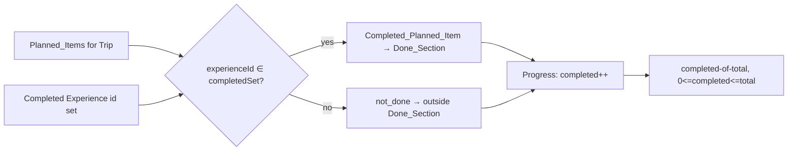

# Design Document

## Overview

Planned List Completion Sync is a **presentation and derivation layer** on top of the shipped Trips
feature. It closes the loop between the shared `Planned_List` (what the group intends to do) and the
`Trip_Activity` surface (what the group actually did) so the two read as one connected experience rather
than two disconnected lists.

The enhancement is deliberately **additive and non-destructive**. It introduces **no new endpoints, no
new tables, no new columns, and no stored link** between a `Planned_Item` and a `Trip_Log_Entry`. Every
new behavior is derived at read time by matching a `Planned_Item`'s referenced `Experience` against the
`Trip_Log_Entries` of the same `Trip` — the rule the requirements name `Planned_Completion_Match`.

It delivers three payoffs, each built on data the `Trip_Detail_View` already loads:

1. **One-tap logging from a plan.** Each `Planned_Item` gains a `Planned_Item_Log_Control` that opens the
   existing Log-a-Completion composer (`Log_Composer`) pre-filled with that item's `Experience`, so a
   `Trip_Member` never re-searches the Catalog for something already planned. Submitting uses the
   **existing** `POST /trips/:id/log-entries` request unchanged (Trips R10, R20).

2. **Derived completed state instead of deletion.** A `Planned_Item` is presented as `done` when **any**
   `Trip_Member` has a `Trip_Log_Entry` for the same `Experience` in that `Trip`. Completed items are
   never deleted — they are visually marked, grouped into a `Done_Section`, and keep their "added by"
   attribution. The completed state (`Planned_Item_Completion_State`) is computed each render and is
   never persisted as a field.

3. **Progress and summary payoff.** The `Planned_List` shows `Planned_List_Progress` as a
   completed-of-total count, and the `Trip_Summary` (served by the existing `GET /trips/:id/summary`)
   gains a derived planned-total and planned-completed count.

### Where the work lands

The feature splits cleanly along the existing client/server seam:

- **Client-side derivation (the bulk of the feature).** The `Trip_Detail_View` already fetches
  `GET /trips/:id/planned-items` (the `PlannedItemDTO[]`) and `GET /trips/:id/feed` (the
  `TripFeedItemDTO[]`, where each `completion_logged` item carries its `metadata.experienceId`). A new
  **pure derivation module** takes those two already-loaded collections and produces the
  `Planned_Item_Completion_State` per item, the `Done_Section` / not-done partition, and the
  `Planned_List_Progress`. No network call beyond the two the view already makes (R2.5, R6.3).

- **Server-side derivation (a small additive extension).** The existing pure `deriveTripSummary`
  (`services/trips/summary.ts`) and its `getSummary` repo assembler are extended to also read the Trip's
  `planned_items` and report `plannedTotalCount` and `plannedCompletedCount`, matched against the Trip's
  `trip_log_entries` under the same `Planned_Completion_Match`. This is surfaced through the **existing**
  `GET /trips/:id/summary` endpoint (R5, R6.4). The `TripSummaryDTO` gains two additive integer fields.

- **No model change, no deletion.** Logging a Completion continues to run through the unchanged
  `logCompletion` repo path; it writes a `trip_log_entry` and a `completion_logged` feed item and touches
  `planned_items` **not at all**, so a `Planned_Item` is retained with its `Experience` and adder intact
  when it becomes a `Completed_Planned_Item` (R3.5, R3.6, R6.1, R6.2).

### Guiding constraints from the existing Trips feature

The design follows the shipped Trips patterns so this reads as a natural extension, not a bolt-on:

- **Endpoint reuse only.** The four endpoints named in the requirements —
  `GET /trips/:id/planned-items`, `POST /trips/:id/log-entries`, `GET /trips/:id/feed`, and
  `GET /trips/:id/summary` — already exist in `services/trips/routes.ts` and are consumed as-is. No route
  is added.
- **Authorization is inherited, not re-implemented.** All four endpoints already run behind
  `requireSession` and then `assertTripMember`, which collapses a non-member and a non-existent Trip to
  the identical `trip_forbidden` response (Trips R15). Because this feature adds no endpoint, it inherits
  that two-layer gate wholesale (R7).
- **Canonical Rating is referenced, never copied.** Ratings displayed for a `Completed_Planned_Item` or a
  logged Completion are read live from the `ratings` table each render, exactly as the existing feed
  projection does (Trips R12); this feature stores no Rating copy (R6.5–R6.7).
- **Pure logic isolated for property testing.** New derivation logic lives in pure, I/O-free modules
  (client: a shared derivation function; server: the extended `deriveTripSummary`) so it is
  property-testable across many inputs the same way `services/trips/summary.ts` and `tripStatus.ts` are.
- **Shared DTOs keep client and server in lock-step.** The two new `TripSummaryDTO` fields and the pure
  client derivation live in `@dwt/shared` so the API and the mobile client cannot drift, mirroring how
  `PlannedItemDTO` / `TripSummaryDTO` are defined today.

### Key design decisions

1. **`Planned_Item_Completion_State` is derived at display time from a set-membership test, never
   stored.** A `Planned_Item` is `done` iff its `experienceId` is a member of the set of `Experience` ids
   completed in the Trip. On the client that set is built from the `completion_logged` feed items'
   `metadata.experienceId`; on the server it is built from `trip_log_entries.experience_id`. Because both
   read live data and compute the value fresh each time, the state can never drift and is never persisted
   (R2.1–R2.6, R6.1).

2. **The match is by `Experience` identity and is member-agnostic.** Any `Trip_Log_Entry` in the Trip —
   regardless of which `Trip_Member` created it — marks the matching `Planned_Item` `done` (R2.3). A
   `Planned_Item` is counted at most once no matter how many `Trip_Log_Entries` reference its `Experience`
   (R4.2, R5.5), because membership in a `Set` is idempotent.

3. **Completion never deletes; it re-groups.** The derivation partitions the `Planned_List` into a
   `Done_Section` (the `done` items) and a not-done group, with **every** `Planned_Item` in exactly one
   group and its `Experience`, `Park`, and adder attribution preserved (R3.2, R3.3). No repo path deletes
   a `Planned_Item` in response to a `Trip_Log_Entry` (R3.5, R3.6).

4. **Progress and summary counts are two views of the same match.** `Planned_List_Progress` (client) and
   the `Trip_Summary` planned counts (server) both compute `completed = |{ planned items whose experience
   is in the completed set }|` and `total = |planned items|`, clamped so `0 <= completed <= total` and
   `0/0` for an empty list (R4, R5). Sharing one match rule keeps the client badge and the server summary
   consistent.

5. **Feed-unavailability fails safe to not-done.** If the `Trip_Activity` feed needed to evaluate the
   match has not loaded, the derivation treats the completed set as empty, marks every affected
   `Planned_Item` `not_done`, and flags that completion status is undetermined so the UI can show an
   indication — it never renders `done` from unavailable data (R2.7).

6. **The `Planned_Item_Log_Control` is always present, even for `done` items.** The control opens the
   existing composer pre-filled and stays available on completed items so a Member can log an additional
   Completion (R1.5); it is only ever surfaced to a `Trip_Member`, and the authoritative gate remains the
   server on `POST /trips/:id/log-entries` (R1.6, R7.3).

## Architecture

### Data flow (all reads already made by the Trip_Detail_View)

```mermaid
graph TB
  subgraph Mobile["Trip_Detail_View (React Native / Expo)"]
    PL[TripPlannedListScreen]
    ACT[TripFeedScreen / Trip_Activity]
    SUM[TripSummaryScreen]
    DERIVE[["derivePlannedListPresentation()\n(pure, @dwt/shared)"]]
  end

  subgraph API["Fastify API (apps/api) — existing endpoints only"]
    PI["GET /trips/:id/planned-items"]
    FEED["GET /trips/:id/feed"]
    LOG["POST /trips/:id/log-entries"]
    SUMR["GET /trips/:id/summary"]
  end

  DB[(Postgres — existing tables)]

  PL -->|PlannedItemDTO[]| PI
  PL -->|TripFeedItemDTO[] for match| FEED
  PL --> DERIVE
  ACT -->|TripFeedItemDTO[]| FEED
  ACT -->|log a completion| LOG
  PL -->|Planned_Item_Log_Control opens Log_Composer| LOG
  SUM -->|TripSummaryDTO incl. planned counts| SUMR

  PI --> DB
  FEED --> DB
  LOG --> DB
  SUMR -->|deriveTripSummary + planned counts| DB
```

The client derivation is a **pure function of two arrays already in memory**. Logging a Completion writes
through the unchanged `POST /trips/:id/log-entries`; the next read of the feed re-runs the derivation and
the matching `Planned_Item` becomes `done` with no extra action (R2.4).

### Match derivation (client and server share one rule)



- **Client** builds `completedSet` from `feed.filter(type === 'completion_logged').map(metadata.experienceId)`.
- **Server** builds `completedSet` from `SELECT experience_id FROM trip_log_entries WHERE trip_id = $1`.

Both feed the same set-membership test, so the completed-of-total the badge shows and the
planned-completed the summary reports agree.

### Module placement

New/changed code, following the existing layout:

```
packages/shared/src/
  plannedCompletion.ts     # NEW pure: derivePlannedListPresentation(), derivePlannedCounts(),
                           #          completedExperienceIdsFromFeed()  (the PBT surface, shared)
  trips.ts                 # CHANGED: TripSummaryDTO gains plannedTotalCount + plannedCompletedCount
  index.ts                 # CHANGED: re-export the new module

apps/api/src/services/trips/
  summary.ts               # CHANGED: deriveTripSummary() also returns planned counts (pure)
  repo.ts                  # CHANGED: getSummary() also reads planned_items; maps the two new counts

apps/mobile/src/screens/trips/
  TripPlannedListScreen.tsx # CHANGED: also read the feed, run the derivation, render Done_Section,
                            #          progress, and the Planned_Item_Log_Control
  TripFeedScreen.tsx        # UNCHANGED contract (already hosts the Log_Composer; reused as-is)
  TripSummaryScreen.tsx     # CHANGED: render the planned-vs-completed counts
```

No migration is added; no route is added.

## Components and Interfaces

### Pure shared derivation — `packages/shared/src/plannedCompletion.ts` (the PBT surface)

This is the heart of the feature: a small, I/O-free module used by the mobile client for the
`Planned_List` presentation and reused by the server for the `Trip_Summary` planned counts, so the two
cannot drift.

```ts
import type { PlannedItemDTO, TripFeedItemDTO } from './trips.js';

/** Derived completion state of a Planned_Item; never persisted (R2.6). */
export type PlannedItemCompletionState = 'done' | 'not_done';

/** A Planned_Item annotated with its derived completion state. */
export interface PlannedItemView extends PlannedItemDTO {
  readonly completionState: PlannedItemCompletionState;
}

/** Completed-of-total progress for a Trip's Planned_List (R4). */
export interface PlannedListProgress {
  readonly completed: number; // 0 <= completed <= total
  readonly total: number;     // >= 0
}

/** The full derived presentation of a Trip's Planned_List. */
export interface PlannedListPresentation {
  readonly doneSection: readonly PlannedItemView[];     // Completed_Planned_Items (R3.2)
  readonly notDoneSection: readonly PlannedItemView[];  // not_done items (R3.2)
  readonly progress: PlannedListProgress;               // R4
  /**
   * `false` when the completed set could not be determined (feed unavailable):
   * every item is forced `not_done` and the UI shows an "undetermined" hint
   * without ever rendering `done` from unavailable data (R2.7).
   */
  readonly completionAvailable: boolean;
}

/**
 * Collect the set of Experience ids completed in a Trip from its already-loaded
 * Trip_Activity feed: the `metadata.experienceId` of every `completion_logged`
 * item. Returns `null` when `feed` is `null` (not yet loaded / load failed) so
 * the caller can fail safe (R2.7).
 */
export function completedExperienceIdsFromFeed(
  feed: readonly TripFeedItemDTO[] | null,
): ReadonlySet<string> | null;

/**
 * Derive the Planned_List presentation from the two already-loaded collections
 * (R2, R3, R4, R6.3). `completedExperienceIds === null` means the feed is
 * unavailable: every item is `not_done`, `completionAvailable` is `false`
 * (R2.7). Grouping is a total partition — every Planned_Item appears in exactly
 * one of the two sections (R3.2) — and each item keeps its Experience, Park, and
 * adder attribution unchanged (R3.3).
 */
export function derivePlannedListPresentation(
  plannedItems: readonly PlannedItemDTO[],
  completedExperienceIds: ReadonlySet<string> | null,
): PlannedListPresentation;

/**
 * Derive the planned-total and planned-completed counts for the Trip_Summary
 * (R5). Shares the set-membership match with the client presentation: a
 * Planned_Item is completed iff its Experience id is in `completedExperienceIds`,
 * counted at most once (R5.5). `0/0` for an empty Planned_List (R5.4).
 */
export function derivePlannedCounts(
  plannedItems: readonly { readonly experienceId: string }[],
  completedExperienceIds: ReadonlySet<string>,
): { readonly plannedTotalCount: number; readonly plannedCompletedCount: number };
```

**Derivation rules (invariants the implementation guarantees):**

- A `Planned_Item` is `done` iff `completedExperienceIds.has(item.experienceId)` (R2.1, R2.2).
- The match is by `experienceId` only, so *which* Member logged is irrelevant (R2.3).
- Ordering within each section preserves the input order of `plannedItems` (which the API already returns
  by insertion, `created_at ASC, id ASC`), so the presentation is deterministic.
- `progress.total === plannedItems.length`; `progress.completed === doneSection.length`; and
  `doneSection.length + notDoneSection.length === plannedItems.length` (R3.2, R4.2, R4.3, R4.6).
- Empty input yields `{ doneSection: [], notDoneSection: [], progress: { completed: 0, total: 0 } }`
  (R4.4, R5.4).

### Server — `deriveTripSummary` extension (`services/trips/summary.ts`)

The existing pure `deriveTripSummary` is extended with a `plannedItems` input and two output counts. It
reuses `derivePlannedCounts` (imported from `@dwt/shared`) so the server and client match logic are
literally the same function.

```ts
export interface TripSummaryInput {
  readonly logEntries: readonly { memberId: string; experienceId: string; experienceName: string }[];
  readonly confirmedTags: readonly { memberId: string; experienceId: string }[];
  readonly ratings: readonly { experienceId: string; value: number }[];
  readonly plannedItems: readonly { experienceId: string }[]; // NEW (R5.1, R5.3)
}

export interface TripSummary {
  readonly distinctExperienceCount: number;
  readonly topRated: readonly TopRatedExperience[];
  readonly perMember: readonly PerMemberContribution[];
  readonly plannedTotalCount: number;     // NEW (R5.1, R5.4)
  readonly plannedCompletedCount: number; // NEW (R5.2, R5.5, R5.6)
}
```

The `completedExperienceIds` used for the planned counts is the set of `logEntries[*].experienceId` — the
same activity the rest of the summary derives from — so a `Planned_Item` counts as completed exactly when
at least one `Trip_Log_Entry` in the Trip references its `Experience` (R5.2), at most once (R5.5), and the
count is clamped `0 <= plannedCompletedCount <= plannedTotalCount` (R5.6).

### Server — `getSummary` repo assembler (`services/trips/repo.ts`)

`getSummary` gains one more live read alongside its existing three (log entries, confirmed tags,
ratings): the Trip's `planned_items`. It maps the result into the extended `deriveTripSummary` input and
copies the two new counts onto the `TripSummaryDTO`.

```sql
-- added to the existing Promise.all in getSummary:
SELECT experience_id FROM planned_items WHERE trip_id = $1
```

Because the summary is served by the **existing** `GET /trips/:id/summary` route (already behind
`assertTripMember`), the planned counts inherit the member-gated, non-disclosing authorization with no
route change (R5.7, R6.4, R7.1, R7.2).

### Client — `TripPlannedListScreen` (Planned_List presentation)

The existing screen already reads `GET /trips/:id/planned-items`. It is extended to:

- Additionally read `GET /trips/:id/feed` (the same query key the `Trip_Activity` screen uses, so the two
  share TanStack Query cache and a log from either refreshes both).
- Run `derivePlannedListPresentation(plannedItems, completedExperienceIdsFromFeed(feed))` and render:
  - a **`Done_Section`** containing the `Completed_Planned_Item`s, each with a completed indicator
    visually distinct from not-done items (R3.1), showing Experience name, Park, and adder display name
    (R3.3), and an "added by … (unavailable)" attribution when the adder name is missing (R3.4);
  - the not-done items outside the `Done_Section` (R3.2);
  - a **`Planned_List_Progress`** badge rendering `completed of total` (R4.1), `0 of 0` for an empty list
    (R4.4);
  - a **`Planned_Item_Log_Control`** on every item (done or not) that opens the existing `Log_Composer`
    pre-filled with the item's `Experience` (R1.1, R1.2, R1.5). The composer is the same one hosted in
    `TripFeedScreen`, assembling the same `POST /trips/:id/log-entries` body with rode-with tags and an
    optional Rating (R1.3, R1.4).
- When the feed read has not succeeded (`completionAvailable === false`), render every item as not-done
  and show a non-blocking "couldn't determine completion" indication, never a `done` badge (R2.7).

Ratings shown on a `Completed_Planned_Item` or a logged Completion come from the feed item's live
`metadata.rating` (or an unrated indicator when absent, R6.6) and a "rating unavailable" indication when
the feed enrichment could not resolve it (R6.7); the client stores no Rating copy (R6.5).

### Client — `TripSummaryScreen`

Renders the two new `TripSummaryDTO` fields as a "planned: `plannedCompletedCount` of `plannedTotalCount`
completed" line, `0 of 0` for an empty `Planned_List` (R5.4). No new fetch; the counts ride the existing
`GET /trips/:id/summary` read.

### The Log_Composer and Planned_Item_Log_Control

`Log_Composer` is the existing composer already implemented at the head of `TripFeedScreen` (the
`Trip_Activity` surface). This feature does not fork it; `TripPlannedListScreen` opens the same composer
pre-filled with the `Planned_Item`'s `Experience`, so the rode-with tagging and optional-Rating inputs and
the `POST /trips/:id/log-entries` submission are identical whether logging is started from the feed or from
a plan (R1.2, R1.3, R1.4).

## Data Models

### No schema change

This feature adds **no migration, no table, and no column**. It reuses, unchanged:

- `planned_items (id, trip_id, experience_id, added_by, created_at)` — the source of the `Planned_List`
  and each item's Experience and adder (Trips migration `0015_trips.sql`).
- `trip_log_entries (id, trip_id, member_id, experience_id, created_at)` — the completions matched
  against; the `experience_id` is the sole join key for `Planned_Completion_Match`.
- `trip_feed_items` — the `completion_logged` items whose `metadata.experienceId` the client uses to build
  the completed set.
- `experiences`, `ratings`, `profiles` — referenced live for name/Park, canonical Rating, and adder
  display name.

The `Planned_Item_Completion_State`, `Planned_List_Progress`, and the summary planned counts are **derived
values with no backing storage** (R2.6, R5.3, R6.1). There is no stored link column between
`planned_items` and `trip_log_entries` (R6.1, R6.2).

### DTO change — `TripSummaryDTO` (`@dwt/shared`)

Two additive, non-negative integer fields:

```ts
export interface TripSummaryDTO {
  readonly distinctExperienceCount: number;
  readonly topRated: readonly { /* unchanged */ }[];
  readonly perMember: readonly { /* unchanged */ }[];
  readonly plannedTotalCount: number;     // NEW: |Planned_List|, >= 0 (R5.1, R5.4)
  readonly plannedCompletedCount: number; // NEW: matched planned items, 0..plannedTotalCount (R5.2, R5.6)
}
```

The `PlannedItemDTO`, `TripFeedItemDTO`, and `TripLogEntryDTO` are **unchanged** — the client derivation
reads `PlannedItemDTO.experienceId` and `TripFeedItemDTO.metadata.experienceId`, both already present.

### Derived value shapes (client, not persisted)

`PlannedItemView`, `PlannedListProgress`, and `PlannedListPresentation` (defined above) are computed in
memory each render and never stored.

### No new error codes

Because no endpoint is added, no new `ErrorCode` is introduced. Reused, from the Trips feature:

- `unauthorized` (401) — no valid session, returned before any Trip lookup (R7.4).
- `trip_forbidden` (403) — non-member or non-existent Trip, collapsed to one response so existence cannot
  be probed (R5.7, R7.2, R7.3).
- `trip_validation_failed` (400) and the other log-entry codes — surfaced unchanged by the existing
  `POST /trips/:id/log-entries` path when logging from a `Planned_Item` (R1.4).

## Correctness Properties

*A property is a characteristic or behavior that should hold true across all valid executions of a
system — essentially, a formal statement about what the system should do. Properties serve as the bridge
between human-readable specifications and machine-verifiable correctness guarantees.*

This feature is a good fit for property-based testing because its core is **pure derivation logic** — a
set-membership match, a total partition, count derivations, and clamping invariants — that is
universally quantified over any `Planned_List` and any set of completed `Experiences`. The properties
below are consolidated from the prework to remove redundancy, covering the completion match, the
Done-Section partition, the no-deletion invariant, the progress count, the summary planned counts, and
the inherited Trip authorization. UI presentation
(the log control, completed indicator, composer pre-fill), the live-Rating reference and its
unavailability, and the "no stored field / no new endpoint" model constraints are covered by example,
edge-case, integration, and structural tests (see Testing Strategy), not by properties.

### Property 1: A Planned_Item is done exactly when its Experience was completed in the Trip

*For any* `Planned_List` and *any* set of `Experience` ids completed in the same `Trip` (drawn from that
Trip's `Trip_Log_Entries`, regardless of which `Trip_Member` created them), `derivePlannedListPresentation`
derives a `Planned_Item`'s `Planned_Item_Completion_State` as `done` if and only if that item's referenced
`Experience` id is a member of the completed set, and as `not_done` otherwise; the result is a pure,
deterministic function of those two inputs, so recomputing after a matching `Trip_Log_Entry` is added
flips the item to `done` with no other change, and when the completed set is unavailable (the feed did not
load) every item derives `not_done` with `completionAvailable = false` and no item is ever `done`.

**Validates: Requirements 2.1, 2.2, 2.3, 2.4, 2.7**

### Property 2: The Planned_List is a total, attribution-preserving partition into Done and not-Done

*For any* `Planned_List` and completed-`Experience` set, every `Planned_Item` appears in exactly one of
the `Done_Section` or the not-done grouping — the two are disjoint and together contain every input item
with none dropped or duplicated — the `Done_Section` contains exactly the `Completed_Planned_Items` and
the not-done grouping exactly the `not_done` items, and each item in either grouping retains its source
`Planned_Item`'s referenced `Experience` name, `Park`, and adder attribution unchanged (including items
whose adder display name is empty, which are retained rather than omitted).

**Validates: Requirements 3.2, 3.3, 3.4**

### Property 3: Logging a Completion never deletes or mutates a Planned_Item

*For any* `Trip` and *any* logged Completion (`POST /trips/:id/log-entries`), the Trip's set of
`Planned_Items` after the operation is identical to the set before it — no `Planned_Item` is deleted as a
result of a `Trip_Log_Entry` being created, and every `Planned_Item`'s referenced `Experience` and
recorded adding `Trip_Member` are preserved unchanged even when the log entry causes that item to become a
`Completed_Planned_Item`.

**Validates: Requirements 3.5, 3.6, 6.2**

### Property 4: Planned_List_Progress is a clamped completed-of-total count over distinct items

*For any* `Planned_List` and completed-`Experience` set, `Planned_List_Progress` reports `total` equal to
the number of `Planned_Items` (each counted once regardless of completion state) and `completed` equal to
the number of `Planned_Items` whose `Experience` is completed — each counted at most once no matter how
many `Trip_Log_Entries` reference that `Experience` — as non-negative integers satisfying
`0 <= completed <= total`, with `0` of `0` for an empty `Planned_List`; and recomputing after adding a
completed `Experience` increases `completed` by exactly one when it newly completes a previously
`not_done` item and leaves `completed` unchanged otherwise.

**Validates: Requirements 4.1, 4.2, 4.3, 4.4, 4.5, 4.6**

### Property 5: The Trip_Summary planned counts faithfully derive from Planned_Items and Trip_Log_Entries

*For any* `Trip`'s `Planned_Items` and `Trip_Log_Entries`, `deriveTripSummary` reports `plannedTotalCount`
equal to the number of `Planned_Items` and `plannedCompletedCount` equal to the number of `Planned_Items`
whose referenced `Experience` matches at least one `Trip_Log_Entry` in the `Trip` under the
`Planned_Completion_Match` — each `Planned_Item` counted at most once regardless of how many
`Trip_Log_Entries` reference its `Experience` — as non-negative integers satisfying
`0 <= plannedCompletedCount <= plannedTotalCount`, with both counts `0` for an empty `Planned_List`.

**Validates: Requirements 5.1, 5.2, 5.4, 5.5, 5.6**

### Property 6: Planned-completion-sync data and actions require membership and never disclose existence

*For any* request for a `Trip`'s `Planned_List`, derived `Planned_Item_Completion_State`,
`Planned_List_Progress`, or `Trip_Summary` planned-versus-completed counts, and *for any* completion
logged from a `Planned_Item`: a request lacking a valid authenticated session is denied `unauthorized`
before any membership or existence evaluation; an authenticated current `Trip_Member` is authorized and
receives only that `Trip`'s data; and an authenticated non-member — indistinguishably from a request for a
non-existent `Trip` — is denied with the identical `trip_forbidden` response carrying no data and making no
change (no `Trip_Log_Entry` created, every `Planned_Item_Completion_State` and the `Planned_List_Progress`
left unchanged), disclosing nothing about whether the `Trip` exists.

**Validates: Requirements 5.7, 7.1, 7.2, 7.3, 7.4**

## Error Handling

Because this feature adds no endpoint, it introduces no new error surface; it reuses the Trips feature's
uniform `{ error: { code, message, field? } }` envelope and its layered authorization.

- **Authorization.** The reused endpoints run `requireSession` first, yielding `unauthorized` (401) for a
  missing/expired session before any Trip lookup (R7.4), then `assertTripMember`, yielding `trip_forbidden`
  (403) for a non-member; a non-member and a non-existent `Trip` collapse to the identical response so
  existence cannot be probed (R5.7, R7.2, R7.3).
- **Logging from a plan.** Submitting the `Log_Composer` opened from a `Planned_Item_Log_Control` goes
  through the unchanged `POST /trips/:id/log-entries`, so its existing validation and conflict codes
  (`trip_validation_failed`, etc.) are surfaced unchanged (R1.4). A rejected log creates no
  `Trip_Log_Entry`, so no derived completion or progress changes (R7.3).
- **Feed unavailable (completion undetermined).** When the `Trip_Activity` feed read fails or has not
  completed, `completedExperienceIdsFromFeed` returns `null` and the derivation marks every affected item
  `not_done` with `completionAvailable = false`; the `Planned_List` shows a non-blocking "couldn't
  determine completion" indication and never a `done` badge, and offers a retry — it never renders `done`
  from unavailable data (R2.7). The `Planned_List` itself still renders from its own successful
  `GET /trips/:id/planned-items` read; a failure of *that* read surfaces the existing member-gated error
  with retry.
- **Rating reference.** Ratings shown for a `Completed_Planned_Item` or a logged Completion are read live
  from the feed's `metadata.rating` (the canonical `ratings` row, referenced never copied, per Trips R12).
  An absent Rating renders an unrated indicator with no placeholder value (R6.6); a Rating that could not
  be retrieved renders an "unavailable" indication and writes nothing, leaving the `Planned_Item` and
  `Trip_Log_Entry` records unchanged (R6.7).
- **Empty lists.** A `Trip` with zero `Planned_Items` yields `0 of 0` progress and `0` / `0` summary
  counts by construction, overriding any other computed value (R4.4, R5.4).

## Testing Strategy

**Dual approach.** Property-based tests cover the universal derivation behaviors (Properties 1–6); unit,
edge-case, integration, and mobile tests cover specific examples, boundaries, external references, and UI.

**Property-based testing.** Uses **fast-check** (the repo's existing PBT library, e.g.
`services/aggregate/__tests__/*.prop.test.ts` and the Trips `*.prop.test.ts` suites). The pure derivation
modules are tested directly as functions, so 100+ iterations are cheap and deterministic:

- Properties 1, 2, and 4 target `derivePlannedListPresentation` / `derivePlannedCounts` in
  `packages/shared/src/__tests__/plannedCompletion.prop.test.ts`. Generators produce arbitrary
  `Planned_List`s (varying size including empty, duplicate-experience-free per the DB unique constraint,
  and including empty adder display names) and arbitrary completed-`Experience` sets (including the
  `null`/unavailable case, ids not present in the list, and ids matching multiple items).
- Property 5 targets the extended `deriveTripSummary` in
  `apps/api/src/services/trips/__tests__/summary.prop.test.ts` (extending the existing summary property
  suite), generating planned items and log entries with overlapping and disjoint `Experience` ids and
  duplicate log entries per `Experience`.
- Property 3 (no-deletion invariant) and Property 6 (authorization/non-disclosure) are tested against the
  same **in-memory repo model** the Trips `*.prop.test.ts` suites already drive, asserting the
  `planned_items` set is unchanged across a generated log-completion and that non-member / non-existent /
  unauthenticated requests to the reused reads collapse to the identical denial with no data; a thin set
  of integration tests then pins the SQL `getSummary` and the live endpoints to the same behavior.
- Each property test runs a minimum of **100 iterations** and is tagged with a comment referencing its
  design property in the form **Feature: planned-list-completion-sync, Property {number}: {property_text}**.
- Each of Properties 1–6 is implemented by a single property-based test.

**Unit and edge-case tests** cover: the empty `Planned_List` (`0 of 0`, both summary counts `0`); a
`Planned_Item` whose `Experience` matches several `Trip_Log_Entries` counted once; a `done` item with an
empty adder display name retained in the `Done_Section` with an unavailable attribution (R3.4); the
feed-unavailable (`null`) branch yielding all-`not_done` and `completionAvailable = false` (R2.7); and an
item/completion with no canonical Rating rendering an unrated indicator rather than a placeholder (R6.6).

**Integration tests** (1–3 representative examples each, not property tests) cover the cross-service /
external behaviors: the extended `GET /trips/:id/summary` returning correct planned counts against a
sandbox Postgres with real `planned_items` and `trip_log_entries`; the member-gated, non-disclosing
authorization of `GET /trips/:id/summary`, `GET /trips/:id/planned-items`, and `GET /trips/:id/feed` for a
non-member and a non-existent `Trip` (R5.7, R7.2); and the canonical Rating being read live (referenced,
not copied) for a completed item, including the unavailable-Rating indication (R6.5, R6.7).

**Mobile tests** (React Native Testing Library, mirroring
`apps/mobile/src/screens/trips/__tests__/*.test.tsx`) cover the UI criteria that are not properties: the
`Planned_Item_Log_Control` present on every item and on both `done` and `not_done` items, opening the
`Log_Composer` pre-filled with the item's `Experience` and submitting the existing
`POST /trips/:id/log-entries` (R1.1–R1.6); the visually distinct completed indicator and the `Done_Section`
grouping (R3.1); the `Planned_List_Progress` badge including `0 of 0`; the `TripSummaryScreen` rendering
the planned-vs-completed line; and the feed-unavailable indication with retry (R2.7).

**Structural / smoke checks** confirm the model-preservation and endpoint-reuse constraints that have no
runtime property: no new migration, table, or column is added; `PlannedItemDTO` carries no completion
field and the derived state lives only on the in-memory `PlannedItemView` (R2.6); no stored link between
`planned_items` and `trip_log_entries` exists (R6.1, R6.2); the derivation inputs are exactly the two
already-loaded collections (R2.5, R6.3); and the planned counts are exposed on the existing
`GET /trips/:id/summary` with no route added (R5.3, R6.4).
