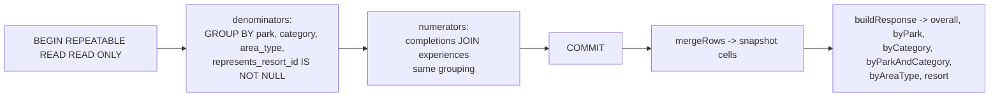

# Design Document

## Overview

This feature makes "hotel content" visible in a User's progress in two ways
that were previously impossible:

1. **Resort-area Experiences count in statistics.** Experiences with Area_Type
   `Resort` (resort restaurants, spas, recreation) already exist and are
   already completable, but they carry no owning Park, and the current
   `Stats_Service` groups strictly by `(park, category)` and silently discards
   Park-less rows. The fix makes the statistics pipeline Park-optional and adds
   an **Area_Type** roll-up dimension.

2. **Resorts become completable ("hotels visited").** A Resort is a first-class
   catalog entity in its own `resorts` table, not an Experience, and
   `completions` can only reference `experiences(id)`. Per the chosen approach
   (**Option A**), Catalog_Sync writes one **resort-representing Experience**
   per active Resort so a Resort flows through the existing
   completion / rating / stats machinery with no new persistence surface for
   completions.

The design is deliberately **additive**. The `resorts` table stays the
authoritative record of hotel entities and their attributes (address, phone,
imagery); the resort-area Experiences that belong to a hotel keep referencing
it via `experiences.resort_id`. Option A does **not** merge the two tables — it
adds a thin, sync-managed Experience row that represents each hotel as a single
checkable item.

### The two resort concepts, kept distinct

The word "resort" now names two different measurements, and the design keeps
them separate on purpose (Requirement 4.4):

| Concept | What it counts | Source rows |
| --- | --- | --- |
| **`Resort` Area_Statistic** | Resort-*area* activity a User has completed (a hotel's restaurants, spas, recreation) | Real Experiences where `area_type = 'Resort'` and `represents_resort_id IS NULL` |
| **Resort_Statistic** | Hotels a User has recorded as visited | Resort-representing Experiences (`represents_resort_id IS NOT NULL`), one per active Resort |

A resort-representing Experience is therefore excluded from the per-Area_Type
roll-up (it is not a resort-area *activity*, so it must not inflate
`byAreaType['Resort']`), but it carries the dedicated `Resort` Experience_Category
and so counts under the per-Category roll-up as `byCategory['Resort']` — making
resort progress a first-class Category statistic. It is also included in the
overall total (it is a thing you can check off) and it remains the sole source of
the Resort_Statistic. (`byCategory['Resort']` and the `resort` Resort_Statistic
therefore report the same hotels-visited figure by construction.)

### Key Design Decisions

| Decision | Rationale |
| --- | --- |
| **Option A** — Catalog_Sync writes one resort-representing Experience per active Resort | `completions`, `ratings`, `notes`, and the friend-scoped Completions read all FK to `experiences(id)`. Representing a Resort as an Experience reuses every one of those paths with zero new write plumbing. |
| Distinguish resort-representing rows with an explicit `experiences.represents_resort_id` column (nullable, FK to `resorts`, `UNIQUE`) | An explicit discriminator is unambiguous. Resort-area *activities* also carry `resort_id`, so "has a resort_id" cannot mean "is the hotel"; `represents_resort_id IS NOT NULL` means exactly "this row stands in for the hotel itself". `UNIQUE` guarantees at most one representing row per Resort. |
| Give the representing row a derived, stable id (UUIDv5 of the Resort's Enterprise_Id over a distinct `resort-visit` namespace) | Matches how Experiences/Resorts already derive stable Internal_Ids, so Completions against a hotel survive re-syncs and restarts (mirrors R10 continuity). The distinct namespace keeps the representing row's id from colliding with the Resort's own id or any Experience id. |
| Representing rows use `park = NULL`, `area_type = 'Resort'`, and the real `category = 'Resort'` | `park`/`area_type` already model the row correctly. A dedicated `Resort` Experience_Category (added to the shared enum and the `experiences_category_chk` CHECK via migration `0010`) lets a hotel stand-in carry a meaningful category, so resort progress surfaces under a `Resort` Category instead of reading zero. No real, browsable Experience is classified `Resort` — resort-*area* activities keep their own category (Restaurant, Recreation, Spa, …) — so the `Resort` Category counts exactly the hotel stand-ins. |
| Extend the statistics snapshot to be **Park-optional** and to carry `area_type` + an `isResortRepresentation` flag; keep a single grouped query | The existing single-transaction `REPEATABLE READ READ ONLY` snapshot already reads exactly the tables we need. Widening the `GROUP BY` and dropping the "Park-less row" filter is the smallest change that fixes the drop and feeds every new dimension from one snapshot (preserves the existing consistency guarantee). |
| Add `byAreaType` and `resort` to `StatsResponse`; leave `byPark`, `byCategory`, `byParkAndCategory` shapes intact | Additive wire change. Existing clients keep working; the mobile client opts into the new fields. |
| **`overall` now includes resort-area Experiences and resorts** | This is the correctness fix at the heart of the feature (R1.1, R1.2). It changes numbers that existing tests assert; those tests are updated deliberately rather than the behavior being left wrong. |
| Add a completion write/delete path for resort-representing Experiences reusing the existing Completion endpoints | Because a Resort *is* an Experience under Option A, the existing "record/remove completion for experience X" path already works; the only new surface is letting the client discover a Resort's representing `experienceId`. |
| Surface `areaType` on `CompletionEntryDTO` and make `park` nullable there | The mobile grouping folds partition by fields on the entry. Area_Type grouping and the resort group need `areaType`; Park-less entries need a nullable `park`. |

### Goals

- Count resort-area Experiences in overall and per-Category statistics.
- Report a per-Area_Type breakdown and a distinct hotels-visited Resort_Statistic.
- Let a User record and remove a "visited" mark on a Resort, and see it (and a Friend's, under the existing rule) in stats.

### Non-Goals

- Merging `resorts` into `experiences`, or removing the `resorts` table.
- Ratings/Notes UX for resorts beyond what falls out for free from resorts being Experiences (no new rating/note surfaces are designed here).
- Pagination changes to the Completions read beyond its existing cap.
- Any change to the `byParkAndCategory` semantics (it stays Park-scoped).

## Architecture

### Component diagram

```mermaid
flowchart TD
  subgraph Mobile[Mobile App]
    SS[StatsScreen / Own_Stats_View]
    RD[Resort detail view]
  end

  subgraph API[Fastify API]
    SM[requireSession]
    OOF[assertOwnerOrFriend]
    STATS[Stats_Service\nGET /me/stats\nGET /me/stats/summary]
    COMP[Tracking_Service\nPUT/DELETE completion for experienceId]
    SYNC[Catalog_Sync\nreconcile + apply]
  end

  subgraph DB[(Postgres)]
    experiences
    resorts
    completions
  end

  SS -->|stats request| STATS
  RD -->|mark / unmark visited| COMP
  STATS --> SM --> OOF
  STATS --> experiences
  STATS --> completions
  COMP --> completions
  COMP --> experiences
  SYNC -->|resort-representing rows| experiences
  SYNC --> resorts
```

### Data flow: statistics snapshot



## Components and Interfaces

| Component | File(s) | Change |
| --- | --- | --- |
| **Catalog_Sync** | `apps/api/src/services/catalog/sync.ts`, `types.ts` | Emit one resort-representing `UpstreamExperience` per active Resort; reconcile through the existing Experience diff rules. |
| **Catalog repo** | `apps/api/src/services/catalog/repo.ts` | Persist and project `represents_resort_id` on the upsert and read paths. |
| **Stats repo** | `apps/api/src/services/stats/repo.ts` | Park-optional snapshot; add `area_type` + `is_resort_representation` to both grouped queries; widen `StatsCell`. |
| **Stats routes** | `apps/api/src/services/stats/routes.ts` | Add `byAreaType` and `resort` to `StatsResponse`; extend `buildResponse` roll-up. |
| **Tracking (completions)** | existing per-Experience completion endpoints | Reused unchanged for resort visits; a Resort's representing `experienceId` is the completion target. |
| **Shared DTOs / enums** | `packages/shared/src/dto/CompletionEntry.ts` | Add `areaType`; make `park` nullable. `AREA_TYPES` already exists. |
| **Mobile stats** | `StatsScreen.tsx`, `TabSelector.tsx`, `grouping.ts` | New `Own_Areas` mode + "Areas" tab, `OwnAreasPane`, `groupByAreaType` fold. |
| **Migration** | `apps/api/migrations/0009_resort_representing_experiences.sql` | Additive column + indexes (below). |

## Data Models

### Migration `0009_resort_representing_experiences.sql`

Additive. One new nullable column plus a uniqueness guard:

```sql
BEGIN;

-- A resort-representing Experience stands in for a Resort so the hotel is
-- completable through the existing completions -> experiences FK. NULL for every
-- ordinary Experience (including resort-area activities, which use resort_id).
ALTER TABLE experiences ADD COLUMN represents_resort_id UUID REFERENCES resorts(id);

-- At most one representing Experience per Resort.
CREATE UNIQUE INDEX experiences_represents_resort_id_uniq
    ON experiences(represents_resort_id)
    WHERE represents_resort_id IS NOT NULL;

-- Stats reads select active representing rows for the Resort_Statistic; index the
-- discriminator alongside active.
CREATE INDEX experiences_active_represents_resort_idx
    ON experiences(active, represents_resort_id);

COMMIT;
```

No change to `completions`, `ratings`, or `notes` — they already reference
`experiences(id)`, and a resort-representing row is an `experiences` row.

### Catalog_Sync change

`buildUpstreamCatalog` already produces `resorts: UpstreamResort[]`. For each
upstream Resort, sync additionally emits a **resort-representing
`UpstreamExperience`**:

- `id`: `internalId(resort.enterpriseId, namespace = "resort-visit")` — stable, distinct from the Resort's own id.
- `upstreamEntityId`: the Resort's Enterprise_Id suffixed to stay UNIQUE in `experiences`.
- `name`: the Resort's name.
- `park`: `null`.
- `category`: `'Resort'` (the dedicated resort category added by migration `0010`).
- `areaType`: `'Resort'`.
- `resortId`: the Resort's Internal_Id (so the row links back to its hotel).
- `representsResortId`: the Resort's Internal_Id (the discriminator).
- `imageUrl` / `description`: copied from the Resort.

These rows reconcile through the **existing** Experience insert / reactivate /
soft-delete rules, so a Resort going inactive soft-deletes its representing
Experience (preserving Completions, R3.5) and a reactivation restores it.

### Statistics snapshot types (`stats/repo.ts`)

```ts
export interface StatsCell {
  readonly park: Park | null;          // null for resort-area + representing rows
  readonly category: ExperienceCategory;
  readonly areaType: AreaType;
  readonly isResortRepresentation: boolean;
  readonly completed: number;
  readonly total: number;
}
```

Both grouped queries drop their `park`-only filter and add `area_type` and the
representation flag to the `SELECT`/`GROUP BY`:

```sql
SELECT park, category, area_type,
       (represents_resort_id IS NOT NULL) AS is_resort_representation,
       COUNT(*)::bigint AS total
  FROM experiences
 WHERE active = TRUE
 GROUP BY park, category, area_type, is_resort_representation;
```

`mergeRows` keeps a row when `category ∈ EXPERIENCE_CATEGORIES` and
`area_type ∈ AREA_TYPES`; it no longer requires a valid `park` (a `null` park is
retained and simply does not contribute to Park dimensions).

### Response shape (`stats/routes.ts`)

```ts
export interface StatsResponse {
  readonly overall: StatsBreakdown;
  readonly byPark: { [park in Park]: StatsBreakdown };
  readonly byCategory: { [c in ExperienceCategory]: StatsBreakdown };
  readonly byParkAndCategory: { [park in Park]: { [c in ExperienceCategory]: StatsBreakdown } };
  readonly byAreaType: { [a in AreaType]: StatsBreakdown };   // NEW
  readonly resort: StatsBreakdown;                            // NEW — hotels visited
}
```

Roll-up rules in `buildResponse`, per cell:

| Dimension | Includes the cell when |
| --- | --- |
| `overall` | always |
| `byPark[park]` | `park !== null` |
| `byParkAndCategory[park][category]` | `park !== null` |
| `byCategory[category]` | always — a representing row's category is `Resort`, so it counts under `byCategory['Resort']` |
| `byAreaType[areaType]` | `isResortRepresentation === false` |
| `resort` | `isResortRepresentation === true` |

Every breakdown is still produced by `computePercent`, preserving the rounding,
`[0.0, 100.0]` clamp, and zero-denominator rules uniformly.

### `CompletionEntryDTO` (`packages/shared`)

```ts
export interface CompletionEntryDTO {
  readonly experienceId: string;
  readonly experienceName: string;
  readonly park: Park | null;   // CHANGED: null for resort-area + resort entries
  readonly areaType: AreaType;  // NEW
  readonly category: ExperienceCategory;
  readonly completedOn: string;
  readonly rating: number | null;
  readonly sharedNote: string | null;
}
```

## Mobile

### New Own_Stats_View mode

`OwnStatsViewMode` gains `Own_Areas`; `OWN_STATS_TABS` gains an "Areas" tab
(distinct icon, e.g. `business-outline`). The screen mounts an `OwnAreasPane`
that renders a single **"By Area"** list of collapsible Group_Sections, one per
area, each expanding the same way the Own_Parks / Own_Categories modes do:

- One Group_Section per **Park-like** Area_Type
  (`ThemePark`, `WaterPark`, `DisneySprings`) headed by a `BreakdownCard` from
  `stats.byAreaType`, whose body lists that area's completions.
- **Resorts as just another area card** in the same list, headed by
  `stats.resort` (the hotels-visited Resort_Statistic), whose body lists the
  User's resort completions — visited hotels *and* the resort-area experiences
  under them (every Completion whose Area_Type is `Resort`), each opening the
  referenced detail view. A zero-state message shows when there are none.

**Resort presentation (supersedes the earlier "one card per Area_Type" sketch
and the interim separate-section design).** To the User a resort is simply
another kind of area, so Resorts appears as a fourth area card in the "By Area"
list rather than in its own section. The `Resort` Area_Type is not shown as a
distinct "Resort Areas" card; the single Resorts card uses the hotels-visited
`stats.resort` figure and folds the resort-area experiences into its body. The
backend still computes `byAreaType['Resort']` and the distinct `resort`
Resort_Statistic separately (Requirement 4.4 holds at the data layer); the
mobile client simply presents resort progress as one area. This reflects a
product decision made after initial implementation.

### Grouping fold (`grouping.ts`)

Add `groupByAreaType(entries, AREA_TYPES)` mirroring `groupByPark`, partitioning
named entries by `entry.areaType`. `groupByPark` is unchanged; Park-less entries
simply match no Park group (correct — they are not in a Park).

## Correctness Properties

These are the executable properties the property-based tests will encode
(existing suites live under `services/aggregate/__tests__/*.prop.test.ts` and
`services/stats`).

### Property 1: Overall is the total over active items

For any catalog + completion state, `overall.total` equals the count of active
Experiences (including resort-area and resort-representing rows) and
`overall.completed` equals the count of the scope's completions against those
rows.

**Validates: Requirements 1.1, 1.2**

### Property 2: Park dimensions are Park-scoped

No Park-less row (resort-area or representing) contributes to any
`byPark`/`byParkAndCategory` cell.

**Validates: Requirements 1.4**

### Property 3: Category is a total partition; resorts count under `Resort`

`byCategory` counts every active row under its Experience_Category — a real
Experience under its own category, and each resort-representing row under the
`Resort` category (the only category those stand-ins carry). So `byCategory` is
a total partition of the active catalog by category, and `byCategory['Resort']`
equals the hotels-visited figure rather than reading zero.

**Validates: Requirements 1.3, 4.4**

### Property 4: Area partition

`sum(byAreaType[*].total)` equals the count of active non-representing
Experiences, and each such Experience contributes to exactly one Area_Type.

**Validates: Requirements 2.1, 2.2**

### Property 5: Resort_Statistic identity

`resort.total` equals the count of active Resorts and `resort.completed` equals
the scope's completions of representing rows; representing rows never appear in
`byAreaType['Resort']`.

**Validates: Requirements 4.1, 4.4**

### Property 6: Percent invariants hold everywhere

For every breakdown in the response (including `byAreaType` and `resort`),
`percent ∈ [0.0, 100.0]`, is rounded to one decimal, `completed ≤ total`, and
`total === 0 ⇒ completed === 0 ∧ percent === 0.0`.

**Validates: Requirements 2.4, 4.3**

### Property 7: Representation uniqueness and stability

After any sequence of syncs, at most one active representing Experience exists
per Resort, and its id is stable across syncs for a fixed Enterprise_Id.

**Validates: Requirements 3.2, 3.5**

### Property 8: Completion idempotence for resorts

Recording a Resort_Visit twice for the same `(user, resort)` yields exactly one
Completion; removing it deletes it.

**Validates: Requirements 3.1, 3.2, 3.3**

### Property 9: Friend parity

For any authorized requester, the `byAreaType` and `resort` values computed for a
target equal those the target sees for themselves; an unauthorized requester
receives `profile_forbidden` and no values.

**Validates: Requirements 6.1, 6.2**

## Error Handling

- Recording a Resort_Visit for a missing or inactive Resort resolves to no
  representing Experience (or an inactive one) and is rejected exactly as a
  completion against a missing/inactive Experience is today. *(R3.4)*
- The statistics endpoints' authorization, timeout, and error envelopes are
  unchanged; the new dimensions ride the existing response and share its failure
  modes. The mobile Areas pane reuses the screen-level stats loading/error/retry
  gating already in `StatsScreen`.

## Testing Strategy

- **Unit / property tests (backend):** extend `stats` roll-up tests to cover the
  new dimensions and the Park-optional merge; add sync tests for
  representing-row emission, reconciliation, and soft-delete/reactivation; add a
  resort-completion idempotence test. Encode properties 1–9 as fast-check
  properties where the existing suites already use fast-check.
- **Migration test:** apply `0009` against a seeded DB and assert the column,
  unique index, and that existing rows are untouched.
- **Mobile tests:** `groupByAreaType` fold properties (partition, order,
  Park-less handling); `StatsScreen` Areas-pane rendering including the zero
  Resort_Visits state and navigation into a Resort.
- **Contract test:** assert `GET /me/stats` returns every `AREA_TYPES` key in
  `byAreaType` and a `resort` breakdown, with the zero-shape when empty.
