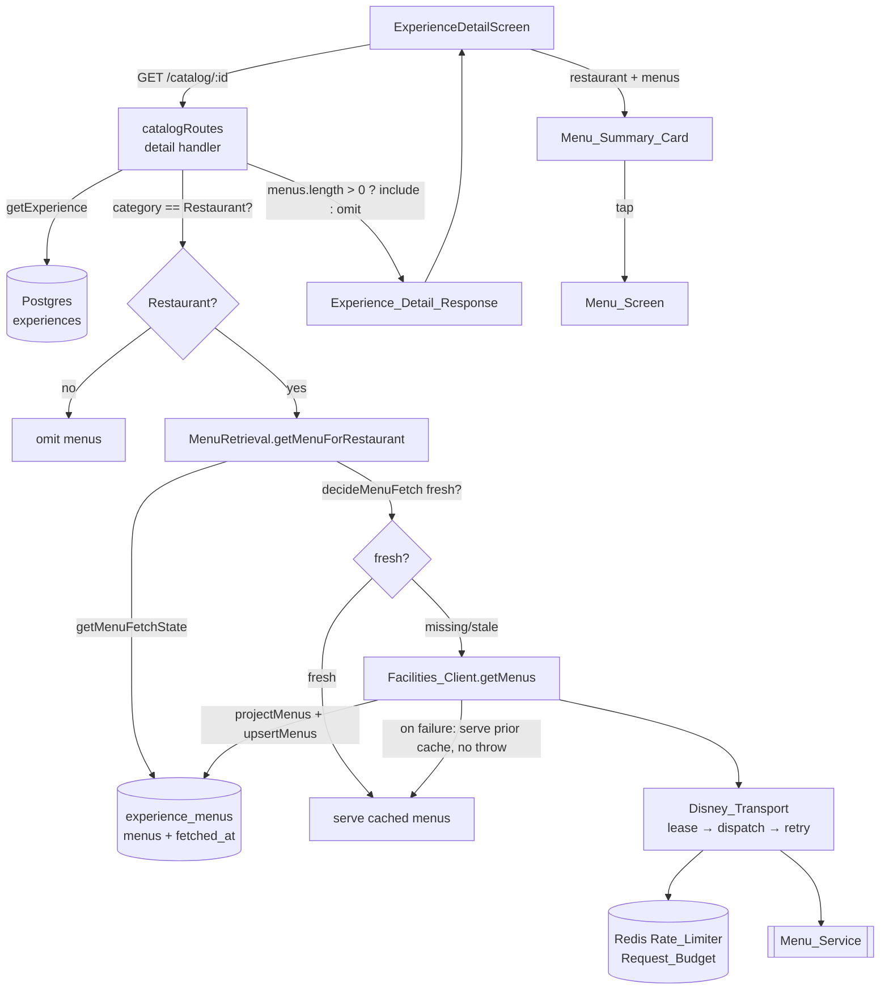
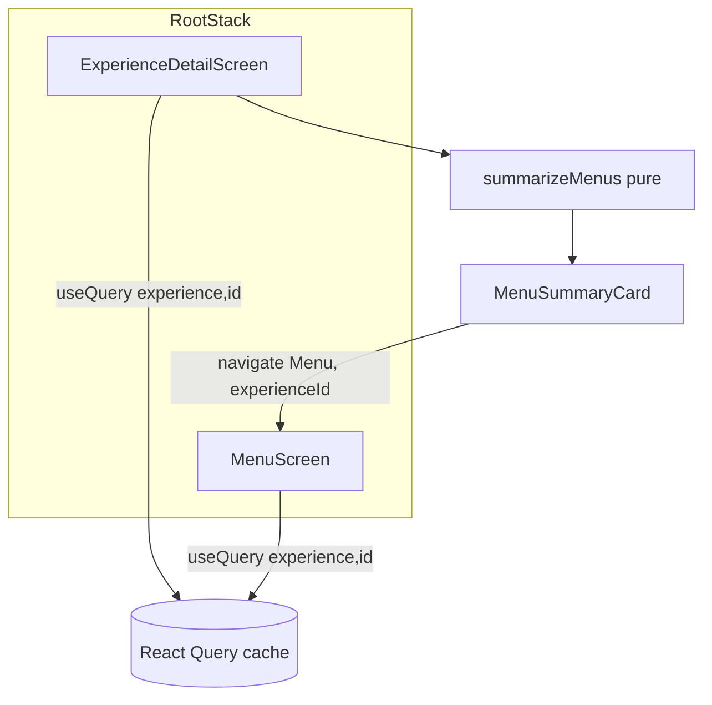

# Design Document

## Overview

Restaurant menus are already modeled end-to-end in the backend — a `menus` field
on the Experience detail response, a persisted `experience_menus` Menu_Cache with
a `fetched_at` freshness column, and a fully implemented lazy/throttled retrieval
seam (`createMenuRetrieval` / `getMenuForRestaurant` in
`services/catalog/menuRetrieval.ts`) that fetches through the shared
`Disney_Transport` on a cache miss/stale, serves the cache when fresh, and falls
back to the prior cache on failure without throwing. **What is missing is the
wiring.** The composition root (`composeServices.ts`) wires the catalog detail
route's `getMenusFor` port to `catalogRepo.getMenusFor(id)` — a plain cache read
that never fetches — so the `experience_menus` cache stays empty and the `menus`
field is always omitted.

This feature closes three gaps:

1. **Backend wiring (Requirements 1, 2, 3):** Build `createMenuRetrieval` at the
   composition root against the already-composed shared `Facilities_Client`
   (which routes through the Redis-backed `Rate_Limiter` + `Disney_Transport`),
   and route the catalog detail's menu read through it — gated so only a
   `Restaurant_Experience` triggers a Menu_Service fetch. No new transport, cache,
   projection, or freshness logic is written; the design reuses the existing seam
   and only connects it to the running server.

2. **Mobile summary card (Requirement 4):** Add a compact `Menu_Summary_Card` to
   the `ExperienceDetailScreen` that, for a restaurant carrying menus, summarizes
   the available menus (count + each menu's type) and navigates to the
   `Menu_Screen` on tap, with distinct loading, empty, error, and
   non-restaurant renderings.

3. **Mobile menu screen (Requirement 5):** Add a dedicated `Menu_Screen` that
   lays out the restaurant's full menus — every menu, group, and item in provided
   order, with cuisine type when present and item prices rendered verbatim — using
   the shared Magical / Whimsical theme components.

The guiding constraint from the incident that motivated this work: menus were
removed from the bulk `Catalog_Sync` because ~576 back-to-back Menu_Service calls
triggered an Akamai/WAF edge block. This design therefore never reintroduces a
burst — every Menu_Service call is demand-driven (one restaurant detail read →
at most one Menu_Service request) and flows through the single authoritative
`Request_Budget`.

## Architecture

### End-to-end read path



### What changes vs. what is reused

| Concern | Status | Location |
| --- | --- | --- |
| Lazy freshness decision (`decideMenuFetch`) | **Reused** (pure, already property-tested) | `services/catalog/menuRetrieval.ts` |
| Retrieval orchestration (`getMenuForRestaurant`) | **Reused** | `services/catalog/menuRetrieval.ts` |
| Menu projection (`projectMenus`) | **Reused** (pure) | `services/catalog/disney/menu.ts` |
| Menu_Service call (`getMenus`) via transport | **Reused** | `services/catalog/disney/facilitiesClient.ts` |
| Shared `Rate_Limiter` + `Disney_Transport` | **Reused** (already composed) | `composeServices.ts` |
| Repo cache reads/writes (`getMenuFetchState`, `upsertMenus`, `getMenusFor`) | **Reused** | `services/catalog/repo.ts` |
| **Wire retrieval into `getMenusFor` port** | **New** | `composeServices.ts` |
| **Category gate on the detail route** | **New** | `services/catalog/routes.ts` |
| **`menus` on the mobile detail DTO** | **New** | `ExperienceDetailScreen.tsx` |
| **`Menu_Summary_Card` + gating** | **New** | mobile catalog screens |
| **`Menu_Screen` + navigation entry** | **New** | mobile catalog screens + navigation |

### Backend wiring decision (the core fix)

At the composition root the shared Disney egress stack already exists:
`disneyRateLimiter` (Redis-backed, authoritative `Request_Budget`) →
`disneyTransport` → `facilitiesClient`. The design adds one seam instance:

```ts
const menuRetrieval = createMenuRetrieval({
  repo: catalogRepo,               // satisfies MenuRetrievalRepo structurally
  client: facilitiesClient,        // getMenus routes through the shared transport
  freshnessMs: config.disney.menuFreshnessMs,
});
```

and changes the catalog wiring from the plain cache read to the retrieval seam:

```ts
// before: getMenusFor: (id) => catalogRepo.getMenusFor(id)
getMenusFor: (id) => menuRetrieval.getMenuForRestaurant(id),
```

Because `facilitiesClient` is the same instance already injected into the
on-read `runSync` path, every Menu_Service call draws from the one authoritative
cluster-wide budget (R2.1, R2.3) — no second transport or limiter is created.

### Category gating decision

`getMenuForRestaurant` treats any Experience id it is given as fetch-eligible:
for an Experience with no cached menu it returns `decideMenuFetch(null, …) ===
true` and fetches. That is correct for a restaurant but would issue a spurious
Menu_Service request for a non-restaurant, violating R1.4. The detail route
already loads the full Experience (including `category`) before reading menus, so
the gate lives there:

```ts
const experience = await options.getExperience(experienceId);
// ...404 branch unchanged...
const menus =
  options.getMenusFor && experience.category === 'Restaurant'
    ? await options.getMenusFor(experienceId)
    : [];
return toDetailResponse(experience, menus);
```

This keeps the retrieval seam category-agnostic and reusable, satisfies R1.4
(non-restaurant → no Menu_Service contact, `menus` omitted) with a single guard,
and preserves the existing `toDetailResponse` behavior that omits `menus`
entirely when the array is empty (R3.2, R3.4).

### Mobile architecture



`Menu_Screen` is registered on the root stack as a sibling of
`ExperienceDetail` (mirroring how `ExperienceDetail` sits above the tabs) so a
back gesture returns to the detail screen (R5.8). Both screens read the same
React Query entry (`['experience', experienceId]`), so `Menu_Screen` renders the
menus already fetched for the detail view without a second network round trip and
without re-deriving order.

## Components and Interfaces

### Backend

#### 1. Composition root (`apps/api/src/composeServices.ts`) — modified

- Import `createMenuRetrieval` from `./services/catalog/menuRetrieval.js`.
- After `facilitiesClient` is built, construct the retrieval seam with the repo,
  the shared client, and `config.disney.menuFreshnessMs`.
- Change the catalog `getMenusFor` wiring to delegate to
  `menuRetrieval.getMenuForRestaurant(id)`.

No change to the seam's own dependencies — the injected `logger` and `now`
default to production implementations (R3.5 failure logging uses the shared
logger).

#### 2. Catalog detail route (`apps/api/src/services/catalog/routes.ts`) — modified

- In the `GET /catalog/:experienceId` handler, gate the menu read on
  `experience.category === 'Restaurant'` (see above). The `getMenusFor` port
  contract is unchanged; only the call site adds the category guard.
- `toDetailResponse` is unchanged: it attaches `menus` only when non-empty
  (R3.1) and omits the field otherwise (R3.2).

The `getMenusFor` port signature stays `(experienceId) => Promise<readonly
MenuDTO[]>`. In production it now resolves through the retrieval seam; in test
harnesses it can still be a plain stub, so existing catalog route tests remain
valid.

#### 3. Retrieval seam (`menuRetrieval.ts`) — reused unchanged

`getMenuForRestaurant(experienceId, now?)` already implements:
- fresh cache → serve without contacting Menu_Service (R1.3),
- missing/stale → fetch via `client.getMenus` → `projectMenus` → `upsertMenus`
  with the fetch instant → serve (R1.1, R1.2, R3.6),
- fetch failure → serve prior cached menus unchanged, log, never throw (R3.3,
  R3.4, R3.5),
- unknown Experience → `[]`.

Because `client.getMenus` returns **all** of a restaurant's menus in a single
Menu_Service response and the seam calls it at most once per invocation, one
detail read issues at most one Menu_Service request regardless of meal-period
count (R2.2).

### Mobile

#### 4. `summarizeMenus` pure helper (`apps/mobile/src/screens/catalog/menuSummary.ts`) — new

```ts
export interface MenuSummary {
  readonly count: number;              // number of menus
  readonly menuTypes: readonly string[]; // each menu's menuType, in order
}
export function summarizeMenus(menus: readonly MenuDTO[]): MenuSummary;
```

Pure and total: maps the menu list to its count and the ordered list of
`menuType` labels the card displays (R4.1). Extracted as a pure function so the
"card summary reflects the menus" property is testable without rendering.

#### 5. `MenuSummaryCard` (in `ExperienceDetailScreen.tsx` or a sibling module) — new

A themed `Card` (with `SectionLabel` + `Badge`s, R4.7) rendered inside the
detail scroll view. Its render is a function of the detail query state and the
Experience category:

- non-restaurant → renders nothing (R4.6),
- restaurant + detail loading → an `ActivityIndicator` in place of the card, no
  card content (R4.3),
- restaurant + detail error → nothing (the screen already shows its top-level
  error indicator, R4.5),
- restaurant + menus present → the summary card: a `SectionLabel` ("Menus"), the
  menu count, and a `Badge` per menu type; the whole card is a `Card` with
  `onPress` navigating to `Menu` (R4.1, R4.2),
- restaurant + no menus → an `EmptyState` ("No menu available") with no press
  target / no navigation (R4.4).

Navigation: `navigation.navigate('Menu', { experienceId })`.

#### 6. `MenuScreen` (`apps/mobile/src/screens/catalog/MenuScreen.tsx`) — new

Reads the cached detail via `useQuery(['experience', experienceId], …)` (same
key/fn as the detail screen) and renders `detail.menus`:

- `GradientHeader` with the restaurant name and an `onBack` control (R5.8, R5.9),
- one labelled block per menu (a `Card` per menu), the menu-type label as a
  `SectionLabel`/`Badge`, and the cuisine type rendered alongside when present
  (R5.3, R5.4, R5.5),
- within each menu, each group rendered with its name and its items in order
  (R5.1, R5.2),
- each item rendered as its name plus, when the price string is non-empty, the
  price verbatim; when price is absent/empty, the name alone (R5.6, R5.7).

Rendering iterates the arrays in index order, so the provided order of menus,
groups, and items is preserved by construction (R5.2).

#### 7. Detail DTO (`ExperienceDetailScreen.tsx`) — modified

Add `readonly menus?: readonly MenuDTO[]` to the screen's `ExperienceDetailDTO`
so it mirrors the backend `ExperienceDetailResponse`. Import `MenuDTO` from
`@dwt/shared`.

#### 8. Navigation (`RootNavigator.tsx`) — modified

Add `Menu: { experienceId: string }` to `RootStackParamList` and register
`<RootStack.Screen name="Menu" component={MenuScreen} options={{ headerShown:
false }} />` as a sibling of `ExperienceDetail`.

## Data Models

### `MenuDTO` (existing — `packages/shared/src/dto/Menu.ts`)

Reused verbatim; no change. Shape:

```ts
interface MenuDTO {
  readonly menuType: string;
  readonly cuisineType?: string | null;
  readonly groups: readonly {
    readonly name: string;
    readonly items: readonly {
      readonly name: string;
      readonly price?: string | null;
    }[];
  }[];
}
```

Ordering is significant: `groups` and `items` are ordered arrays and their order
must be preserved across persistence and rendering (R3.6, R5.2).

### `MenuFetchState` / `MenuCacheEntry` (existing — `services/catalog/repo.ts`)

Reused. `getMenuFetchState` returns `{ upstreamEntityId, cached }` where `cached`
is `{ menus, fetchedAt }` or `null`. Freshness is `now - fetchedAt` vs.
`menuFreshnessMs` (R1.1, R1.2, R1.3).

### `ExperienceDetailResponse` (existing — `services/catalog/routes.ts`)

Already declares an optional `menus?: readonly MenuDTO[]` field, attached only
when non-empty. No shape change; the change is that the field is now populated
for restaurants via the wired retrieval seam.

### Mobile route param (new)

```ts
// RootStackParamList
Menu: { experienceId: string };
```

### `MenuSummary` (new — mobile)

```ts
interface MenuSummary {
  readonly count: number;
  readonly menuTypes: readonly string[];
}
```

## Correctness Properties

*A property is a characteristic or behavior that should hold true across all
valid executions of a system — essentially, a formal statement about what the
system should do. Properties serve as the bridge between human-readable
specifications and machine-verifiable correctness guarantees.*

The properties below were derived from the prework analysis and consolidated to
remove redundancy: the lazy-retrieval branches (serve-fresh, fetch-on-miss/stale,
serve-cache-on-failure) collapse into one comprehensive property; the paired
cuisine-present/absent and price-present/absent criteria each collapse into one
conditional-render property; and the Menu_Screen completeness, order, and
per-menu-type labelling criteria collapse into one render property. Architectural
"routes through the transport/budget" criteria (2.1, 2.3) and pure styling
criteria (4.7, 5.9) are not universally-quantified properties and are covered by
integration and structure tests in the Testing Strategy.

### Property 1: Lazy retrieval serves fresh, fetches on miss/stale, and degrades on failure

*For any* Menu_Fetch_State and freshness window: when the cached menu is fresh
(`now - fetchedAt <= interval`), `getMenuForRestaurant` returns the cached menus
and never contacts the Menu_Service; when the cache is missing or stale, it
contacts the Menu_Service exactly once, persists the projected result stamped
with `now`, and returns it; and when the Menu_Service call fails, it returns any
previously cached menus unchanged and never throws.

**Validates: Requirements 1.1, 1.2, 1.3, 3.3, 3.4, 3.5**

### Property 2: Non-restaurant experiences never contact the Menu_Service and omit menus

*For any* Experience whose category is not `Restaurant`, serving its detail read
issues no Menu_Service request and produces an Experience_Detail_Response with no
`menus` field.

**Validates: Requirements 1.4**

### Property 3: A single detail read issues at most one Menu_Service request

*For any* Restaurant_Experience whose Menu_Service response carries any number of
menus, serving one detail read (with a missing or stale cache) invokes the
Menu_Service exactly once, regardless of how many menus or meal periods the
restaurant offers.

**Validates: Requirements 2.2**

### Property 4: The response includes menus exactly when non-empty and omits them otherwise

*For any* served menu list, the Experience_Detail_Response includes a `menus`
field deep-equal to that list when the list is non-empty, and omits the `menus`
field entirely (neither `null` nor `[]`) when the list is empty.

**Validates: Requirements 3.1, 3.2**

### Property 5: Menu projection preserves structure, order, and field values verbatim

*For any* raw Menu_Service payload, the projected menus preserve the order of
menus, of groups within each menu, and of items within each group, and preserve
each menu's `menuType`, each menu's `cuisineType` when present (else `null`),
each group's `name`, each item's `name`, and each item's `price` string verbatim
when present (else `null`), with no reordering, addition, or mutation as the
menus flow through to the response.

**Validates: Requirements 3.6**

### Property 6: The summary card reflects the available menus

*For any* non-empty menu list, the Menu_Summary_Card summary reports a count
equal to the number of menus and lists every menu's menu type, in the provided
order.

**Validates: Requirements 4.1**

### Property 7: The Menu_Screen renders every menu, group, and item in order

*For any* menu list, the Menu_Screen renders every menu (each as a distinct block
labelled by its menu type), every group within each menu, and every item within
each group, preserving the provided order of menus, of groups within each menu,
and of items within each group.

**Validates: Requirements 5.1, 5.2, 5.3**

### Property 8: Cuisine type is rendered exactly when present

*For any* menu, the Menu_Screen renders the cuisine type alongside the menu type
when the menu has a non-null cuisine type, and renders the menu type without a
cuisine type when it has none.

**Validates: Requirements 5.4, 5.5**

### Property 9: Item price is rendered verbatim exactly when non-empty

*For any* menu item, the Menu_Screen renders the item's price string exactly as
provided together with the item name when the price is a non-empty string, and
renders the item name with no price when the price is absent or an empty string.

**Validates: Requirements 5.6, 5.7**

## Error Handling

### Backend

- **Menu_Service fetch failure (R3.3, R3.4, R3.5):** The retrieval seam wraps the
  `client.getMenus` → `projectMenus` → `upsertMenus` sequence in a try/catch. Any
  failure — transport `DisneyTransportError` (`waf_block`, `auth_failure`,
  `network`, `http_status`, `invalid_response`, `aborted`), projection error, or
  persistence error — is caught, logged via `logger.warn` with `{ err,
  experienceId, upstreamEntityId }`, and the previously cached menus (possibly
  empty) are returned. The failure never propagates to the enclosing
  `GET /catalog/:experienceId` read, so the detail response always completes
  (with the cached menus, or with `menus` omitted when the cache is empty).
- **Rate-budget saturation (R2.4):** The shared `Rate_Limiter` waits for capacity
  rather than rejecting, so a saturated budget delays the Menu_Service dispatch
  rather than failing it, and no request is ever dispatched outside the transport.
  If the bounded backoff cap is exhausted, the transport raises a
  `DisneyTransportError`, which is handled by the failure path above (degrade to
  cached/omitted menus). The budget is never bypassed.
- **Unknown Experience id:** `getExperience` returns `null` → the route responds
  with Fastify's standard 404 (unchanged). The menu read is never reached.
- **Non-restaurant Experience (R1.4):** The category gate skips the menu port
  entirely, so no Menu_Service request is issued and `menus` is omitted.

### Mobile

- **Detail load pending (R4.3):** The summary card slot shows an
  `ActivityIndicator` and renders no card content until the detail query settles.
- **Detail load error (R4.5):** The existing top-level detail error indicator is
  shown and the summary card is not rendered.
- **Restaurant with no menus (R4.4):** An `EmptyState` ("No menu available") is
  rendered in place of the card with no press target, so there is no navigation
  to the Menu_Screen.
- **Menu_Screen with missing cached detail:** If the `['experience',
  experienceId]` query is not populated (e.g. deep link), the screen re-runs the
  same query; while pending it shows a loading indicator and on error an empty/
  error state, reusing the detail screen's patterns. Normal navigation from the
  card always has the entry cached, so this is a defensive fallback.

## Testing Strategy

### Property-based tests

Property-based testing applies to this feature's pure logic and
data-transformation layers: the lazy-retrieval decision/orchestration, the menu
projection, the response inclusion/omission rule, the summary derivation, and the
Menu_Screen rendering over arbitrary menu structures. Both packages already use
`fast-check` (`apps/api` and `apps/mobile`), so property tests reuse it.

- **Library:** `fast-check` (already a dev dependency in both `apps/api` and
  `apps/mobile`). Do not hand-roll generators frameworks.
- **Iterations:** each property test runs a minimum of 100 iterations
  (`fc.assert(fc.property(...), { numRuns: 100 })` or higher).
- **Tagging:** each property test carries a comment referencing its design
  property, in the form
  `// Feature: restaurant-menu-display, Property {n}: {property text}`.
- **One test per property:** each of Properties 1–9 is implemented by a single
  property-based test.
- **Generators:** a shared arbitrary produces `MenuDTO[]` with arbitrary menu
  types, optional cuisine types (including `null`), ordered groups with arbitrary
  names, and ordered items with names and prices spanning `null`, empty string,
  and non-empty strings — so edge cases (empty menus, empty groups, missing
  cuisine, missing/empty price, unicode strings) are covered by the generators
  rather than separate tests.

Property-to-location map:

| Property | Package | Under test |
| --- | --- | --- |
| 1 Lazy retrieval | `apps/api` | `menuRetrieval.getMenuForRestaurant` with faked repo/client (extends existing `menuRetrieval.prop.test.ts`) |
| 2 Non-restaurant gate | `apps/api` | detail route handler with a spy menu port |
| 3 At most one request | `apps/api` | retrieval seam with a call-counting `getMenus` |
| 4 Include/omit menus | `apps/api` | detail route `toDetailResponse` / handler |
| 5 Projection preservation | `apps/api` | `projectMenus` (extends existing menu projection tests) |
| 6 Summary reflects menus | `apps/mobile` | `summarizeMenus` + `MenuSummaryCard` |
| 7 Menu_Screen completeness+order | `apps/mobile` | `MenuScreen` render |
| 8 Cuisine conditional render | `apps/mobile` | `MenuScreen` render |
| 9 Price conditional render | `apps/mobile` | `MenuScreen` render |

### Unit / example tests

- **Route category gate (R1.4):** example test confirming a non-restaurant detail
  read never calls the menu port and omits `menus`.
- **Failure logging (R3.5):** example test confirming `logger.warn` is invoked on
  a Menu_Service failure (non-propagation is covered by Property 1).
- **Summary card interactions (R4.2, R4.3, R4.4, R4.5, R4.6):** example tests for
  navigation on tap, the loading indicator, the no-menu empty state, the detail
  error state, and the non-restaurant no-card case.
- **Menu_Screen back control (R5.8):** example test confirming a back control
  exists and invokes `navigation.goBack`.
- **Theme usage (R4.7, R5.9):** structure/snapshot assertions confirming the
  shared `Card`, `SectionLabel`, `Badge`, and `GradientHeader` primitives are
  used.

### Integration / wiring tests

- **Transport + budget routing (R2.1, R2.3):** an integration test (extending the
  existing Disney sourcing smoke coverage) asserts the retrieval seam is wired to
  the composed `facilitiesClient` so every Menu_Service call flows through the
  shared `Disney_Transport` and the Redis-backed `Rate_Limiter`, and that no code
  path reaches the Menu_Service without the transport.
- **End-to-end read (R1.1, R3.1):** a smoke test hitting
  `GET /catalog/:experienceId` for a restaurant with a stubbed Menu_Service
  asserts the cache is populated and the response carries `menus`, and a second
  read within the freshness window serves from cache without a further
  Menu_Service call.

### Rate-limit / WAF safety (R2.4)

The limiter's wait-never-reject pacing and the transport's bounded backoff are
already property-tested at their own layers; this feature does not re-test them.
The observable behavior for this feature — graceful degradation to cached/omitted
menus when a fetch ultimately fails — is covered by Property 1.
