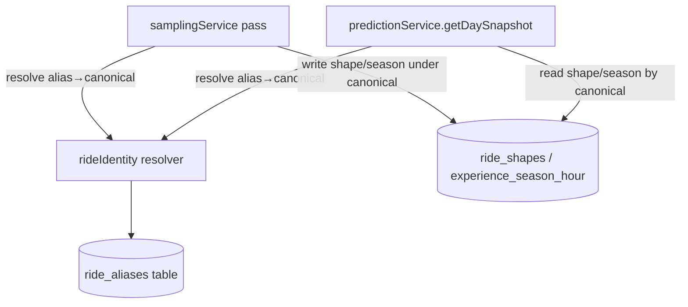

# Design Document

## Overview

This feature adds a curated grouping so that multiple upstream Experiences representing the **same physical ride** (film swaps like Soarin' Around the World ↔ Across America) pool their wait history under one **Canonical_Ride**. Sampling writes wait shape/season updates to the canonical; prediction reads from the canonical and returns results keyed by the requested id; day-planning resolves planned items to the canonical for prediction and coordinates.

It changes **no external contracts and adds no new external API**. It reuses the shipped crowd-calendar `ride_shapes` / `experience_season_hour` tables, the sampling pass, and `predictionService.getDaySnapshot`, plus the day-planning optimize route. The only new state is a small curated alias mapping.

Non-goal: automatic detection of same-ride pairs. The mapping is hand-curated because a film swap (alias) and a ride replacement (never alias) are indistinguishable by name or location.

## Architecture

- A single pure-ish resolver, `rideIdentity`, maps an `experienceId` to its `canonicalExperienceId` using a cached snapshot of the `ride_aliases` table. A non-aliased id resolves to itself.
- **Write path (sampling):** before upserting a `ride_shapes`/`experience_season_hour` bucket for an experience, resolve to canonical and key the bucket by the canonical id.
- **Read path (prediction):** `getDaySnapshot(experienceIds, …)` resolves each requested id to its canonical, fetches shapes/seasons for the set of canonicals, computes each requested experience's curve from its canonical's history, and returns the map keyed by the **originally requested** id.

## Components and Interfaces

### `rideIdentity` (new, `services/intelligence/rideIdentity.ts`)

- `resolveCanonical(experienceId: string): string` — returns the canonical id (self when not aliased). Backed by an in-memory map loaded from `ride_aliases`, refreshed on a TTL (reuse the directory's lazy-refresh pattern).
- `resolveCanonicalMap(ids: string[]): Map<string, string>` — batch form used by the sampling pass and `getDaySnapshot`.
- Pure resolution logic (given the alias map) is separated so it can be property-tested with no I/O.

### `IntelligenceRepo` (extend)

- `getRideAliases(): Promise<{ alias_experience_id: string; canonical_experience_id: string }[]>` — load the curated map.

### `samplingService` (modify)

- When building `updatedShapes` / `updatedSeasons`, key each row by `resolveCanonical(expId)` instead of the raw `expId`. Wait samples, daily signals, and experience signals remain keyed by the live experience (version-specific).

### `predictionService.getDaySnapshot` (modify)

- Resolve requested ids → canonicals; fetch `getRideShapes` / `getSeasonHours` for the canonical set; when building each requested experience's `waits`, read the canonical's buckets. Return keyed by the requested id (Requirement 3.2).

### Day-planning optimize route (modify, `services/trips/routes.ts`)

- Already calls `getDaySnapshot`, so Requirement 3 flows through automatically. For coordinates, when an item's experience has null lat/long, fall back to its canonical's coordinates.

## Data Models

### Migration `00NN_ride_aliases.sql`

Add the curated mapping table (use the next free sequential number at implementation time):

- `ride_aliases`:
  - `alias_experience_id UUID PRIMARY KEY REFERENCES experiences(id) ON DELETE CASCADE`
  - `canonical_experience_id UUID NOT NULL REFERENCES experiences(id) ON DELETE CASCADE`
  - `CONSTRAINT ride_aliases_not_self CHECK (alias_experience_id <> canonical_experience_id)`
  - Seed the known curated pairs in the migration (or a companion seed) — see Configuration & Constants.

Single-level/acyclic (Requirement 1.4) is enforced by convention + a test, not only by SQL: a `canonical_experience_id` must never also appear as an `alias_experience_id`.

## Correctness Properties

### Property 1: Resolution is total, idempotent, and single-step

*For any* experience id, `resolveCanonical` returns a defined id; a non-aliased id resolves to itself; and `resolveCanonical(resolveCanonical(x)) === resolveCanonical(x)` (a canonical resolves to itself).

**Validates: Requirements 1.3, 1.4**

### Property 2: Wait pooling is alias-invariant

*For any* sequence of wait observations distributed arbitrarily across the aliases of one Canonical_Ride, the resulting `ride_shapes`/`season` buckets equal those produced if the identical observations were all attributed to the canonical directly.

**Validates: Requirements 2.1, 2.2**

### Property 3: Prediction is alias-invariant and identity-preserving

*For any* aliased experience, `getDaySnapshot` returns a `WaitSnapshot` computed from the canonical's history and keyed by the requested id; and for a non-aliased experience the snapshot is byte-for-byte what the pre-feature code produced.

**Validates: Requirements 3.1, 3.2, 3.3**

## Error Handling

- **Missing/empty alias map:** every experience resolves to itself; behavior is exactly today's. The feature is inert until pairs are curated.
- **Cyclic or multi-level data** (a canonical that is also an alias): the resolver treats the requested id's direct mapping as authoritative and never recurses more than one step; a migration/seed test rejects such data so it cannot be introduced.
- **Ride replacement mistakenly aliased:** prevented by curation review, not code; the seed list documents why each pair is a film swap.

## Testing Strategy

- **Property tests (`fast-check`, ≥100 runs, tagged `Feature: ride-identity-aliases, Property N`):** the three properties above against the pure resolver and against an in-memory model of shape pooling.
- **Repo/migration test (`migrationNNNN.test.ts`, `pg-mem`):** the `ride_aliases` table and its self-reference/not-self constraint; and that a wait upsert routed through the canonical lands on the canonical's bucket.
- **Prediction test:** `getDaySnapshot` for an aliased id returns the canonical's curve, keyed by the requested id; a non-aliased id is unchanged.
- **Integration:** day-planning optimize for a planned item that is an alias produces a real prediction (not the flat default).

## Configuration & Constants

- **Curated alias seed (initial):** Soarin' — alias `Soarin' Across America` → canonical `Soarin' Around the World` (or vice versa; pick the historically-richest as canonical and document it). Add other confirmed film swaps only after manual verification. Each entry records a one-line justification (why it is a film swap, not a replacement).
- **Alias-map cache TTL:** 12h (reuse the ThemeParks directory default); aliases change extremely rarely.
- No new environment variables. No new external API.

## External Interfaces

None new. This feature only re-routes reads/writes among existing internal tables and services. The id-mapping it introduces is internal (`experiences.id` ↔ `experiences.id`), not an upstream mapping.

## Cross-Spec Dependencies & Build Order

- **Depends on** `crowd-calendar` (shipped): `ride_shapes`, `experience_season_hour`, the sampling pass, `predictionService.getDaySnapshot`.
- **Interacts with** `day-planning-optimization` (shipped): the optimize route consumes `getDaySnapshot` and item coordinates; both flow through the canonical once this feature routes them.
- **Build order:** after both of the above (both are built). This feature is self-contained and can be scheduled whenever.
