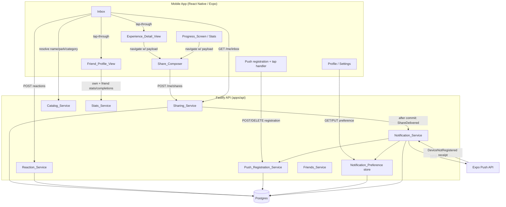
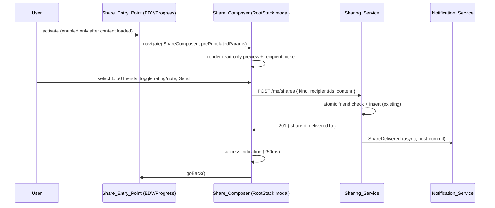
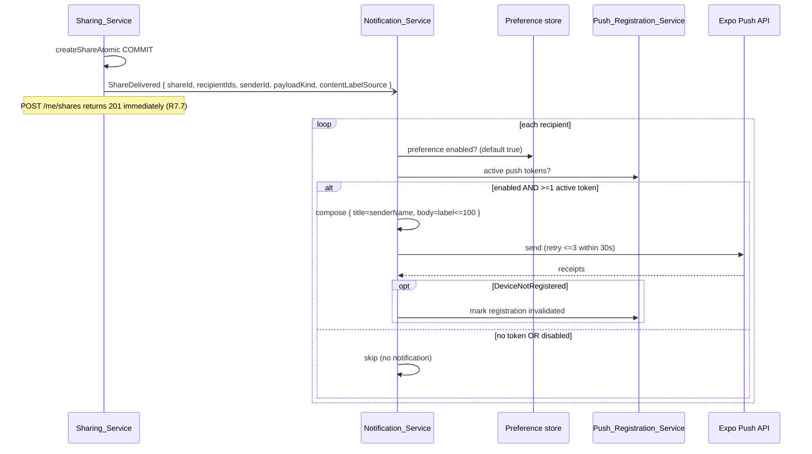
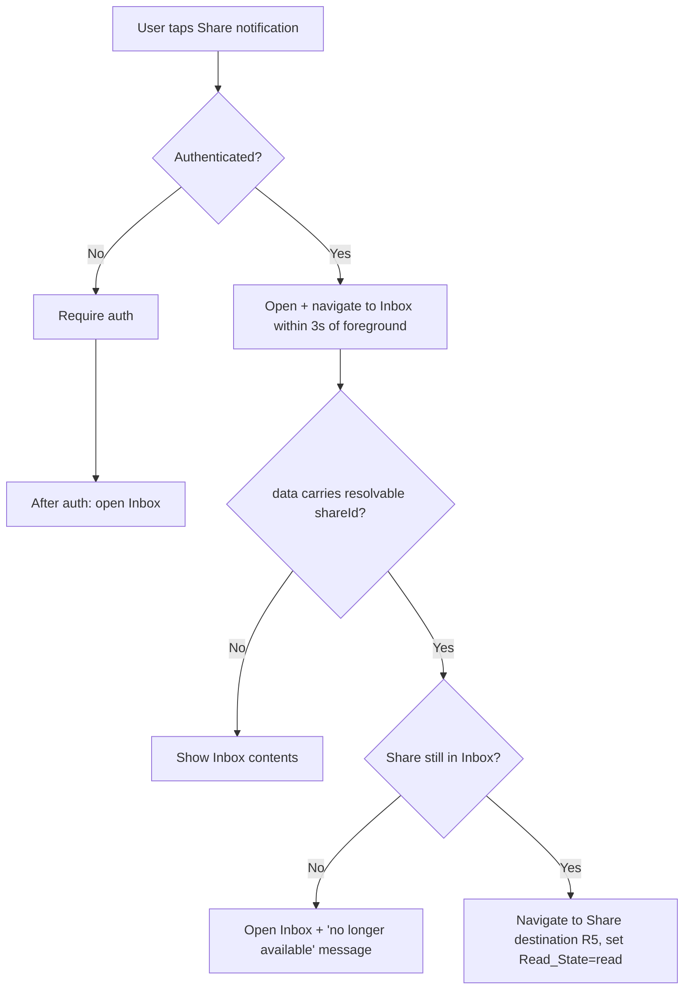

# Design Document

## Overview

The Social Sharing Loop reworks the existing sharing feature into a coherent, end-to-end
experience without discarding the Friends system, the four `Sharing_Service` endpoints, or the
`Friend_Profile_View` already in production. It layers three independently shippable phases on top
of the current implementation:

- **Phase 1 (R1–R6)** — Move `Share` initiation onto the content itself. Add `Share_Entry_Point`s to
  the `Experience_Detail_View` and the `Progress_Screen`, strip the free-text identifier and the
  payload-kind picker out of the `Share_Composer`, remove the top-level Share button from the
  Friends page, make the `Inbox` render human-readable sender/content/context for every delivered
  `Share` regardless of `Read_State`, and make a `Share` tap through to its destination across
  navigator boundaries.
- **Phase 2 (R7–R11)** — Deliver a push notification when a `Share` arrives, manage the
  `Push_Token` lifecycle and `Notification_Permission`, honor a per-User `Share_Notification_Preference`,
  deep-link a notification tap to the `Share`, and let a recipient attach one `Share_Reaction` from a
  fixed `Reaction_Vocabulary` that the sender can see.
- **Phase 3 (R12–R14)** — Frame the `Friend_Profile_View` as a side-by-side `Progress_Comparison`,
  list the `Completion_Diff` (Experiences the Friend completed that the viewer has not), and land a
  `Progress_Share` tap directly on the comparison section.

### Guiding constraints from the codebase

The design is shaped by patterns already established in the repository, so the feature reads as a
natural extension rather than a bolt-on:

- **Backend** is a Fastify + TypeScript monolith (`apps/api`) organized into services under
  `src/services/{name}/{repo.ts,routes.ts}`. Dependencies are constructor-injected through factory
  functions (`createXRepo(pool)`), wired in `composeServices.ts`, and registered in `server.ts` via
  a per-service option block. Every route authenticates through the shared `requireSession`
  pre-handler that assigns `request.userId`.
- **Validation** lives in `@dwt/shared` as Zod primitives and DTOs so the API and the mobile client
  cannot drift. Errors are thrown as `AppError(code, message)` where `code` is a member of the
  closed `ErrorCode` union in `packages/shared/src/errors.ts`, mapped to HTTP status by
  `errorCodeToHttpStatus`.
- **Persistence** is Postgres with sequentially numbered SQL migrations
  (`apps/api/migrations/000N_*.sql`). Redis is available (used by the leaderboard cache, lockout, and
  rate limiter) and BullMQ is present.
- **Mobile** is React Native / Expo with React Navigation. The authenticated tree is a root native
  stack (`RootStack`) hosting the bottom-tab navigator (`MainTabs`) plus `ExperienceDetail` and
  `Menu` as siblings above the tabs, so those detail screens present from their host stack regardless
  of the originating tab. Data fetching is TanStack Query; UI uses the shared "Magical / Whimsical"
  theme components.

### Key design decisions

1. **Promote `Share_Composer` to `RootStack`.** Today the composer lives inside `FriendsStack`. Because
   Phase 1 opens it from the `Experience_Detail_View` (already on `RootStack`) and the `Progress_Screen`
   (the Stats tab), the composer is moved to `RootStack` as a modal screen that accepts a pre-populated,
   discriminated `ShareComposerParams`. This lets every `Share_Entry_Point` open it with one
   cross-navigator-safe `navigate('ShareComposer', params)` call and return to the originating screen
   with `goBack()`.
2. **Read_State no longer gates disclosure.** The current `Sharing_Service.listInbox` reveals only
   `{ shareId, isOpened }` for unopened items. R4/R6 require the `Inbox` to show sender, `Share_Payload`,
   and timestamp for **every** delivered `Share` regardless of `Read_State`, using `Read_State` only for
   the unread count. `listInbox` is reworked to always project sender/payload/sentAt plus the recipient's
   own `Share_Reaction`, keeping the recipient-only privacy boundary (R6.1) enforced by the
   `recipient_id = request.userId` predicate.
3. **Resolve Experience metadata on the client.** The `experience` payload snapshot stores only
   `experienceId` (+ optional rating/note). Rather than change the write contract (R6.5 forbids new
   required params), the `Inbox` resolves name/Park/`Experience_Category` from the catalog read at
   display time, with the 10-second loading window and Experience-unavailable fallback (R4.10, R4.11).
   This uniformly covers pre-existing shares (R6.4).
4. **Notification delivery is decoupled and best-effort.** `POST /me/shares` must never fail or block on
   push outcome (R7.7). The `Notification_Service` is invoked after the share-delivery transaction
   commits, dispatched on a background path with its own bounded retry, so the request returns `201`
   regardless of push success.
5. **Phase 3 derives everything client-side.** R12.4 and R13.5 require deriving `Progress_Comparison`
   and `Completion_Diff` from data already retrieved. No new backend endpoints are added for Phase 3;
   the `Friend_Profile_View` additionally reads the viewer's own stats and completions (the existing
   `GET /me/stats` and owner-path `GET /users/:id/completions`) and computes the comparison and diff in
   pure functions.

## Architecture

### System context



### Phase boundaries

Each phase is independently shippable. Phase 1 touches only mobile screens/navigation plus a
projection change in `Sharing_Service.listInbox`. Phase 2 adds three new backend services
(`Push_Registration_Service`, `Notification_Service`, `Reaction_Service`), a preference store, one
migration, and mobile push plumbing. Phase 3 is mobile-only, composing existing reads.

### Share send flow (Phase 1)



### Share delivery + notification flow (Phase 2)



### Notification tap deep-link flow (Phase 2)



## Components and Interfaces

### Phase 1 — Mobile

#### `Share_Entry_Point` components

- **On `Experience_Detail_View`** (`screens/catalog/ExperienceDetailScreen.tsx`): a themed share
  control rendered in the header/action area. It is **disabled while** the Experience detail, the
  viewer's Rating, or the viewer's Note query is still loading (R1.2). On activation it builds an
  `experience` `ShareComposerParams` from the already-loaded detail (`name`, `park`, `category`), the
  viewer's `Rating` (whole number 1–10, when present, R1.4), and the viewer's `Note` (≤2000 chars,
  when present, R1.5), then `navigation.navigate('ShareComposer', params)`.
- **On `Progress_Screen`** (`screens/stats/StatsScreen.tsx`): a themed share control, **disabled while**
  the `GET /me/stats` query is loading (R1.7). On activation it builds a `progress`
  `ShareComposerParams` carrying overall, per-Park, and per-`Experience_Category` percentages each
  rounded to one decimal place as displayed (R1.8).

#### `Share_Composer` (moved to `RootStack`, modal)

New route params (added to `RootStackParamList`):

```ts
type ShareComposerParams =
  | {
      kind: 'experience';
      experienceId: string;
      experienceName: string;
      park: Park;
      category: ExperienceCategory;
      // Present only when the viewer has the value; drives the include/exclude toggles (R2.14).
      rating?: number;          // whole number 1..10 (R1.4)
      note?: string;            // <= 2000 chars (R1.5)
    }
  | {
      kind: 'progress';
      overallPercent: number;                                   // one decimal (R1.8)
      perParkPercent: { [park in Park]?: number };
      perCategoryPercent: { [category in ExperienceCategory]?: number };
    };
```

Behavior changes to `ShareComposerScreen.tsx`:

- Derives payload kind from `route.params.kind`; **no** kind picker (R2.1).
- Renders a **read-only preview** (R2.2): for `experience`, the name/Park/`Experience_Category` and each
  included value (R2.3); for `progress`, the overall percentage to one decimal (R2.4).
- **No** free-text Experience identifier input (R2.5); the `experienceId` comes from params.
- Recipient picker over `GET /me/friends`; selection allowed for 1–50 friends (R2.6). Send is disabled
  while the count is `0` or `>50` (R2.7), while submitting (R2.9), and while the User has zero friends,
  which also shows the no-friends empty state (R2.15).
- For an `experience` share with a pre-populated Rating and/or Note, independent include/exclude toggles,
  each defaulting to included (R2.14). Only marked values are submitted (R2.8).
- Submits via `POST /me/shares` using the **existing contract** (R6.5): `{ kind, recipientIds,
  experienceId, rating?, includeRating?, note? }` or `{ kind, recipientIds, statsSnapshot }`.
- On success shows a success indication for 250 ms then `goBack()` (R2.10). On
  `share_recipient_count_invalid` (R2.11), `share_atomic_rejected` (R2.12 — recipients no longer
  friends), or any other error (R2.13, retaining selection), it stays on the composer with a mapped
  message.

#### Friends page (`FriendsListScreen.tsx`)

Removes the top-level Share control (R3.1, R3.2). Retains the `Inbox` control and the Find control
(R3.4); the Inbox control navigates to `Inbox` (R3.5). The composer opens **only** from a
`Share_Entry_Point` (R3.2, R3.3).

#### `Inbox` (`screens/share/InboxScreen.tsx`)

- Reads `GET /me/inbox`; renders every delivered `Share` with the sender's display name (R4.1),
  content, and timestamp regardless of `Read_State` (R6.2). The unread count is derived from items
  whose `read` is `false` (R6.2).
- For an `experience` share, resolves the Experience name/Park/`Experience_Category` via a catalog read
  (`GET /catalog/:experienceId`, deduplicated by React Query key). While retrieving and under 10 s it
  shows a per-share loading indication (R4.10); on failure or after 10 s it shows an
  Experience-unavailable fallback label while keeping remaining content visible (R4.11, R6.4). It never
  uses the raw identifier as the primary label (R4.3). It renders the sender's Rating as 1–10 when
  present (R4.4), a rating-unavailable indication when marked unavailable (R4.5), nothing otherwise
  (R4.6), the full Note ≤2000 chars when present (R4.7), nothing when absent (R4.8).
- For a `progress` share, renders overall, per-Park, and per-`Experience_Category` percentages to one
  decimal place (R4.9).
- **Tap-through (R5):** selecting an `experience` share verifies the referenced Experience is
  retrievable (the catalog read) and navigates cross-stack to `ExperienceDetail` on `RootStack` (R5.1,
  R5.4); selecting a `progress` share verifies the sender is still a Friend (against the cached
  `GET /me/friends`) and navigates to `FriendProfile` (R5.2), or in Phase 3 to `FriendProfile` with the
  comparison section selected (R14.1). Selecting an unread share sets `Read_State=read` via
  `POST /me/inbox/:shareId/open` and updates the unread count (R5.3). Unavailable destinations keep the
  User on the `Inbox` with a message and retain content (R5.5, R5.6). While verifying, a per-share
  loading indication is shown and a second navigation for the same share is suppressed until verification
  completes (R5.7).

### Phase 1 — Backend

#### `Sharing_Service.listInbox` projection change

`InboxItem` and the route projection change so every non-deleted recipient row discloses sender,
payload, timestamp, per-recipient `read` state, and the recipient's own reaction (Phase 2). The
`recipient_id = $1` predicate remains the privacy boundary (R6.1).

```ts
interface InboxItem {
  readonly shareId: string;
  readonly read: boolean;              // opened_at IS NOT NULL
  readonly senderId: string;           // always disclosed to the recipient (R6.2)
  readonly senderDisplayName: string;  // joined from profiles (R4.1)
  readonly payloadKind: SharePayloadKind;
  readonly payload: SharePayload;
  readonly sentAt: string;
  readonly myReaction: ShareReactionValue | null; // Phase 2 (R11)
}

interface InboxResponse {
  readonly unread: number;             // COUNT(opened_at IS NULL)
  readonly items: ReadonlyArray<InboxItem>;
}
```

`openShare` (R5.3) and `softDeleteForRecipient` (delete) are unchanged. The `GET /me/inbox`,
`POST /me/inbox/:shareId/open`, and `DELETE /me/inbox/:shareId` request contracts gain no new required
parameters (R6.6).

### Phase 2 — Backend services

#### `Push_Registration_Service` (`services/push/{repo.ts,routes.ts}`)

Endpoints (all behind `requireSession`):

| Method | Path | Purpose | Requirements |
|---|---|---|---|
| `POST` | `/me/push-registrations` | Register/refresh a device's `Push_Token` as active for the User | R8.1, R8.2, R8.3, R8.5 |
| `DELETE` | `/me/push-registrations` | Invalidate the current device's registration (logout) | R8.4 |

`POST` body: `{ deviceId: string; expoPushToken: string }`. The repo upserts on the physical
`expo_push_token`, reassigning it to the requesting User and marking it active, so a token is active for
exactly one User at a time (R8.3, R8.5). It also upserts on `(user_id, device_id)` so a device that
rotates its token replaces the old one (R8.2). `DELETE` body: `{ deviceId: string }` marks that device's
registration invalidated (R8.4). Invalidated registrations are excluded from delivery (R8.6).

#### Notification preference store (folded into `services/push` or `services/auth/profile`)

| Method | Path | Purpose | Requirements |
|---|---|---|---|
| `GET` | `/me/notification-preferences` | Read `Share_Notification_Preference` (default enabled) | R9.3, R9.7 |
| `PUT` | `/me/notification-preferences` | Set enabled/disabled | R9.4, R9.5, R9.8 |

`GET` returns `{ shareNotificationsEnabled: boolean }`, defaulting to `true` when the User has never set
it (R9.7). `PUT` persists the value; when it cannot persist, the API returns an error and the mobile
client retains the previously persisted value and shows a message (R9.8).

#### `Reaction_Service` (`services/reactions/{repo.ts,routes.ts}`)

| Method | Path | Purpose | Requirements |
|---|---|---|---|
| `POST` | `/me/inbox/:shareId/reactions` | Submit/replace the recipient's `Share_Reaction` | R11.1, R11.4, R11.5, R11.8 |
| `DELETE` | `/me/inbox/:shareId/reactions` | Remove the recipient's `Share_Reaction` | R11.6 |
| `GET` | `/me/shares/:shareId/reactions` | Sender views reactions on a share they sent | R11.7 |

`POST` body: `{ reaction: ShareReactionValue }` validated against the closed `Reaction_Vocabulary`;
a value outside it is rejected with a validation error and nothing is persisted (R11.2, R11.3). The repo
enforces "delivered to that recipient" (a `share_recipients` row exists) before persisting, else returns
an authorization error (R11.8). It stores at most one reaction per `(share_id, recipient_id)` (R11.4),
replacing on resubmit (R11.5). `GET /me/shares/:shareId/reactions` is gated to the share's sender and
returns each reaction with the reactor's display name (R11.7).

A minimal **Sent Shares** surface on mobile (a "Sent" screen reachable from the Friends page or Inbox)
lists the User's sent shares and, per share, its reactions with reactor display names, with a loading
indication while reactions load (R11.9), an empty-state when none (R11.10), and an unavailable message
that keeps remaining content on failure (R11.11). Submitting/removing failures other than authorization
keep the share view and preserve prior reaction state (R11.12).

#### `Notification_Service` (`services/notifications/*`)

Invoked with a `ShareDelivered` event after `createShareAtomic` commits. For each recipient it:
1. reads the recipient's `Share_Notification_Preference` (default enabled, R9.7); skips if disabled
   (R9.4);
2. reads the recipient's active `Push_Registration`s; if none, completes delivery with no notification
   (R7.5, R8.6);
3. composes a notification disclosing only the sender's display name (as title) and a single content
   label ≤100 chars (as body) — the Experience name truncated to 100 for an `Experience_Share` (R7.3),
   or a "shared progress" indication for a `Progress_Share` (R7.4) — never rating/note/percentages
   (R7.2);
4. sends to each active token via the Expo Push API, retrying at most 3 times within the 30-second
   window (R7.1, R7.7); on a "device not registered" receipt it marks that `Push_Registration`
   invalidated and stops sending to it (R7.6).

The dispatch is decoupled from the request lifecycle (background execution with a structural
`(event) => Promise<void>` port, mirroring the existing `emitRatingChanged` seam), so `POST /me/shares`
returns `201` regardless of push outcome (R7.7). Composition wiring lives in `composeServices.ts`.

### Phase 2 — Mobile

- **Push registration + permission** (`hooks/usePushRegistration.ts`): on authentication, if permission
  was never requested on this device, request `Notification_Permission` (R9.1); on grant, obtain the
  Expo `Push_Token` and register it within 10 s (R8.1), retrying up to 3 times ≤60 s apart and otherwise
  continuing without a registration (R8.7). A stable device installation id is generated once and
  persisted in `expo-secure-store`. On denial, no token is registered and all in-app functionality
  continues (R9.2). On logout the client requests invalidation and clears the local session without
  blocking on the result (R8.8). `expo-notifications` is added as a mobile dependency.
- **Preference control** (`ProfileScreen.tsx`): displays and edits `Share_Notification_Preference`
  (R9.3). When OS permission is revoked, on next foreground the control renders an "unavailable until
  permission re-granted" state regardless of the stored value (R9.6).
- **Notification tap handler** (root, via `expo-notifications` response listener): navigates to the
  `Inbox` within 3 s of foreground (R10.1), then to the share destination setting `Read_State=read`
  (R10.2); requires auth first when unauthenticated (R10.3); shows "no longer available" when the share
  is gone (R10.4); opens the Inbox with current contents when the payload lacks a resolvable share id
  (R10.5).

### Phase 3 — Mobile (`Friend_Profile_View`)

- Adds the viewer's own reads: `GET /me/stats` and the owner-path `GET /users/:ownId/completions`
  (via `useOwnCompletionsQuery`), alongside the existing friend reads. All are already-retrieved data
  the comparison and diff derive from (R12.4, R13.5).
- **`Progress_Comparison`**: a pure derivation rendering the viewer's and Friend's overall (R12.1),
  per-Park (R12.2), and per-`Experience_Category` (R12.3) percentages side by side, each to one decimal
  in `[0.0,100.0]` and labeled to identify owner vs Friend. Loading indication while data loads and under
  30 s (R12.5); comparison-unavailable message keeping remaining profile content on failure/timeout
  (R12.6).
- **`Completion_Diff`**: a pure set difference of the Friend's completed-Experience set minus the
  viewer's, by Experience identity (R13.1), each entry showing name/Park/`Experience_Category` (R13.2),
  navigating to `ExperienceDetail` on selection (R13.3), an empty-state when the diff is empty (R13.4),
  loading (R13.6) and unavailable (R13.7) states, and an Experience-unavailable message if a selected
  entry cannot be retrieved (R13.8).
- **`FriendProfileParams`** gains an optional `initialSection: 'comparison'` so a `Progress_Share`
  tap lands with the comparison section initially visible (R14.1), navigating from the `Inbox` across
  navigator boundaries (R14.2). If the sender is no longer a Friend, the User stays on the `Inbox`
  (R14.3); if comparison data cannot be retrieved after navigation, the view still opens and shows the
  comparison-unavailable indication (R14.4).

## Data Models

### Existing tables reused

`shares`, `share_recipients` (with `opened_at`/`recipient_deleted_at`), `friendships`, `profiles`,
`experiences`, `completions`, `ratings`, `notes` are used as-is. No schema change is required for
Phase 1 — the inbox disclosure change is a projection-only change in `listInbox`.

### New enum — `Reaction_Vocabulary`

Added to `packages/shared/src/enums.ts`:

```ts
export const SHARE_REACTION_VALUES = ['like', 'love', 'been_there', 'want_to_go'] as const;
export type ShareReactionValue = (typeof SHARE_REACTION_VALUES)[number];
```

With a matching Zod primitive `shareReactionValueSchema = z.enum(SHARE_REACTION_VALUES)` in
`schemas/primitives.ts`.

### New migration `0011_social_sharing_loop.sql` (Phase 2)

```sql
BEGIN;

-- Push_Registration: one row per (user, device); the physical token is
-- globally unique so it can belong to exactly one user at a time (R8.3, R8.5).
CREATE TABLE push_registrations (
    id               UUID        PRIMARY KEY DEFAULT gen_random_uuid(),
    user_id          UUID        NOT NULL REFERENCES users(id) ON DELETE CASCADE,
    device_id        TEXT        NOT NULL,
    expo_push_token  TEXT        NOT NULL UNIQUE,          -- one user per token (R8.3)
    status           TEXT        NOT NULL DEFAULT 'active',
    created_at       TIMESTAMPTZ NOT NULL DEFAULT now(),
    updated_at       TIMESTAMPTZ NOT NULL DEFAULT now(),
    CONSTRAINT push_registrations_status_chk CHECK (status IN ('active','invalidated')),
    CONSTRAINT push_registrations_user_device_uniq UNIQUE (user_id, device_id)
);
CREATE INDEX push_registrations_user_active_idx
    ON push_registrations(user_id) WHERE status = 'active';

-- Share_Notification_Preference: per-user; absence means enabled (R9.7).
CREATE TABLE notification_preferences (
    user_id                    UUID        PRIMARY KEY REFERENCES users(id) ON DELETE CASCADE,
    share_notifications_enabled BOOLEAN    NOT NULL DEFAULT TRUE,
    updated_at                 TIMESTAMPTZ NOT NULL DEFAULT now()
);

-- Share_Reaction: at most one per (share, recipient) (R11.4), value from the
-- closed Reaction_Vocabulary (R11.3).
CREATE TABLE share_reactions (
    share_id      UUID        NOT NULL REFERENCES shares(id) ON DELETE CASCADE,
    recipient_id  UUID        NOT NULL REFERENCES users(id) ON DELETE CASCADE,
    reaction      TEXT        NOT NULL,
    created_at    TIMESTAMPTZ NOT NULL DEFAULT now(),
    updated_at    TIMESTAMPTZ NOT NULL DEFAULT now(),
    PRIMARY KEY (share_id, recipient_id),
    CONSTRAINT share_reactions_value_chk
        CHECK (reaction IN ('like','love','been_there','want_to_go'))
);
CREATE INDEX share_reactions_share_id_idx ON share_reactions(share_id);

COMMIT;
```

The `share_reactions` row references `shares` directly; authorization to react (R11.8) is enforced in
the repo by requiring a matching `share_recipients (share_id, recipient_id)` row before the insert.

### New DTOs (`@dwt/shared`)

```ts
// Inbox item (recipient view) — Phase 1 projection + Phase 2 reaction.
interface InboxItemDTO {
  shareId: string; read: boolean;
  senderId: string; senderDisplayName: string;
  payloadKind: SharePayloadKind; payload: SharePayload; sentAt: string;
  myReaction: ShareReactionValue | null;
}

// Sender view of one reaction (R11.7).
interface ShareReactionDTO {
  reaction: ShareReactionValue;
  reactorId: string;
  reactorDisplayName: string;
  reactedAt: string;
}

interface NotificationPreferenceDTO { shareNotificationsEnabled: boolean; }
```

### New error codes (`packages/shared/src/errors.ts`)

Added to the closed `ERROR_CODES` union and `errorCodeToHttpStatus`:

| Code | HTTP | Meaning | Requirements |
|---|---|---|---|
| `reaction_invalid` | 400 | Reaction value not in `Reaction_Vocabulary` | R11.3 |
| `reaction_forbidden` | 403 | Reacting to a share not delivered to the caller | R11.8 |
| `push_registration_invalid` | 400 | Malformed device id / push token | R8.7 |

Notification-send failures are internal to the `Notification_Service` and never surface on
`POST /me/shares`, so they need no client-facing code (R7.7).

## Correctness Properties

*A property is a characteristic or behavior that should hold true across all valid executions of a
system — essentially, a formal statement about what the system should do. Properties serve as the
bridge between human-readable specifications and machine-verifiable correctness guarantees.*

The properties below come from the prework analysis, consolidated to remove redundancy. They target
the pure logic and universal behaviors of the feature: `Share_Entry_Point` enablement and payload
projection, `Share_Composer` send-gating and body composition, `Inbox` disclosure and content
rendering, notification composition, `Push_Token` and preference-gating invariants, the
`Share_Reaction` lifecycle, the `Progress_Comparison` derivation, and the `Completion_Diff`. UI-timing,
navigation-mechanics, external-provider, and one-shot setup criteria are covered by example, edge-case,
and integration tests (see Testing Strategy), not by properties.

### Property 1: Share entry point enablement tracks content-load state

*For any* combination of content-load flags on a `Share_Entry_Point` (Experience/Rating/Note loading on
the `Experience_Detail_View`; completion-data loading on the `Progress_Screen`), the entry point is
enabled if and only if none of its required content is still loading.

**Validates: Requirements 1.2, 1.7**

### Property 2: Entry point projects content faithfully into composer params

*For any* Experience detail with any viewer Rating (integer 1–10) and any viewer Note (≤2000 chars),
activating the `Experience_Detail_View` entry point produces `experience` composer params carrying that
same `experienceId`, name, Park, `Experience_Category`, the same integer Rating, and the same Note text;
and *for any* completion data, activating the `Progress_Screen` entry point produces `progress` params
whose overall, per-Park, and per-`Experience_Category` percentages equal the displayed one-decimal
values.

**Validates: Requirements 1.3, 1.4, 1.5, 1.8**

### Property 3: Composer send control is gated by recipient count

*For any* number of selected recipient Friends `n`, the `Share_Composer`'s send control is enabled if
and only if `1 ≤ n ≤ 50` (and the User has at least one Friend available).

**Validates: Requirements 2.6, 2.7, 2.15**

### Property 4: Composer submits derived content with only marked values

*For any* pre-populated composer params and any states of the Rating/Note include toggles (each
defaulting to included when the value is present), the submitted `POST /me/shares` body carries the kind
and content derived from the entry point and includes the sender's Rating and Note if and only if their
toggles are marked included.

**Validates: Requirements 2.8, 2.14**

### Property 5: Inbox discloses sender, content, and timestamp for every item; unread counts unread items

*For any* `Inbox` response containing any mix of read and unread delivered `Share`s, every rendered item
exposes the sender's display name, the `Share_Payload` content, and the delivery timestamp regardless of
`Read_State`, and the unread count equals the number of items whose `Read_State` is `unread`.

**Validates: Requirements 4.1, 6.2**

### Property 6: Inbox renders resolved Experience metadata and never the raw identifier

*For any* `Experience_Share` whose Experience metadata has been resolved, the rendered row shows the
Experience's name, Park, and `Experience_Category`, and never uses the raw internal identifier as the
primary label.

**Validates: Requirements 4.2, 4.3**

### Property 7: Inbox rating rendering matches payload rating state

*For any* `Experience_Share` payload, the `Inbox` row shows the sender's Rating as a whole number 1–10
when a Rating is present, shows a rating-unavailable indication when the Rating is marked unavailable,
and shows no Rating when neither is present.

**Validates: Requirements 4.4, 4.5, 4.6**

### Property 8: Inbox note rendering matches payload note state

*For any* `Experience_Share` payload, the `Inbox` row shows the complete Note text (≤2000 chars) when a
Note is present and shows no Note otherwise.

**Validates: Requirements 4.7, 4.8**

### Property 9: Inbox renders progress percentages to one decimal place

*For any* `Progress_Share` payload, the `Inbox` renders the overall, per-Park, and
per-`Experience_Category` percentages as their one-decimal-formatted values from the payload.

**Validates: Requirements 4.9**

### Property 10: Opening an unread share marks it read and decrements the unread count

*For any* `Inbox` containing an unread `Share`, selecting that `Share` sets its `Read_State` to `read`
and reduces the unread count by exactly one; selecting an already-read `Share` leaves the count
unchanged.

**Validates: Requirements 5.3**

### Property 11: Destination verification is single-flight per share

*For any* sequence of taps on the same `Share` while its destination availability is being verified, at
most one verification and at most one navigation are initiated until the verification completes.

**Validates: Requirements 5.7**

### Property 12: Inbox discloses only the requesting recipient's shares

*For any* graph of `Share`s and recipients, `listInbox(u)` returns exactly the non-deleted `Share`s
delivered to `u` and never returns the sender identity, payload, or timestamp of a `Share` not delivered
to `u`.

**Validates: Requirements 6.1**

### Property 13: Notification composition discloses only sender name and a bounded label

*For any* delivered `Share`, the composed push notification contains the sender's display name and a
content label of at most 100 characters, contains none of the sender's Rating, the sender's Note, or any
completion percentage, and — for an `Experience_Share` — the label equals the Experience name truncated
to at most 100 characters.

**Validates: Requirements 7.2, 7.3**

### Property 14: A push token is active for exactly one user — the most recent registrant

*For any* sequence of `Push_Registration` operations, each physical `Push_Token` is active for at most
one User at any time — the most recent User to register it — and each `(User, device)` pair's active
token is the most recently registered token for that device.

**Validates: Requirements 8.2, 8.3, 8.5**

### Property 15: Delivery targets are exactly the active tokens of preference-enabled recipients

*For any* set of `Push_Registration`s and `Share_Notification_Preference` values (absent preference
treated as enabled), the `Notification_Service`'s delivery targets for a recipient are exactly that
recipient's active `Push_Token`s when the recipient's effective preference is enabled, and empty when it
is disabled.

**Validates: Requirements 8.6, 9.4, 9.5, 9.7**

### Property 16: Reactions are accepted if and only if drawn from the Reaction_Vocabulary

*For any* candidate reaction value, the `Reaction_Service` persists it if and only if the value belongs
to the `Reaction_Vocabulary`; a value outside the vocabulary is rejected with a validation error and
nothing is persisted.

**Validates: Requirements 11.2, 11.3**

### Property 17: Reaction lifecycle maintains at most one reaction per share per recipient

*For any* sequence of submit and remove operations by a recipient on a `Share` delivered to them, at
most one `Share_Reaction` exists for that `(Share, recipient)`; a resubmission replaces the prior
reaction with the submitted value, and a removal leaves no reaction.

**Validates: Requirements 11.1, 11.4, 11.5, 11.6**

### Property 18: Reacting to an undelivered share is rejected with an authorization error

*For any* `Share` not delivered to a given User, that User's reaction submission is rejected with an
authorization error and no `Share_Reaction` is persisted.

**Validates: Requirements 11.8**

### Property 19: Sender's reaction view lists every reaction with its reactor's display name

*For any* set of `Share_Reaction`s on a `Share` the sender sent, the sender's view lists each reaction
paired with the reacting recipient's display name.

**Validates: Requirements 11.7**

### Property 20: Progress comparison presents both parties' percentages, labeled and one-decimal

*For any* viewer and Friend completion data, the `Progress_Comparison` presents, for the overall figure
and for every Park and every `Experience_Category`, both the viewer's and the Friend's percentage each
within `[0.0, 100.0]` to one decimal place and each labeled to identify whether it belongs to the viewer
or the Friend.

**Validates: Requirements 12.1, 12.2, 12.3**

### Property 21: Completion diff is the friend-minus-viewer set difference by Experience identity

*For any* viewer completed-Experience set `V` and Friend completed-Experience set `F`, the
`Completion_Diff` equals `{ e ∈ F : e.id ∉ V }` compared by Experience identity, and is empty if and
only if every Friend-completed Experience is present in `V`.

**Validates: Requirements 13.1, 13.4**

### Property 22: Each completion-diff entry carries name, Park, and Experience_Category

*For any* non-empty `Completion_Diff`, each rendered entry shows the Experience's name, Park, and
`Experience_Category`.

**Validates: Requirements 13.2**

## Error Handling

Errors continue to flow through the existing uniform envelope: handlers throw
`AppError(code, message, options)`, the global Fastify hook serializes `{ error: { code, message,
field?, details? } }`, and the mobile `apiRequest` parses it into a typed `ApiError` keyed on the closed
`ErrorCode` union.

### New error codes

| Code | HTTP | Raised by | Client handling |
|---|---|---|---|
| `reaction_invalid` | 400 | `Reaction_Service` when a reaction value is outside `Reaction_Vocabulary` (R11.3) | Should be unreachable from the UI (only vocabulary buttons exist); surfaces as the generic "action didn't complete" message (R11.12). |
| `reaction_forbidden` | 403 | `Reaction_Service` when the caller is not a recipient of the share (R11.8) | Treated as a terminal authorization failure; not retried. |
| `push_registration_invalid` | 400 | `Push_Registration_Service` on malformed device id / token (R8.7) | Counts as a registration failure; client retries ≤3 times ≤60 s apart then continues without a registration. |

### Reused error codes

- `share_recipient_count_invalid` (400) — surfaced by the `Share_Composer` as "Pick between 1 and 50
  friends" and keeps the User on the composer (R2.11).
- `share_atomic_rejected` (403) — surfaced as "Some recipients are no longer your friends" and keeps the
  User on the composer (R2.12).
- `note_length_invalid`, `rating_out_of_range` (400) — defense-in-depth on the composer submission.
- `profile_forbidden` (403) — the `Friend_Profile_View` reads (including the Phase 3 comparison reads)
  already map this to the profile-unavailable branch.

### Phase-specific error behavior

- **Composer generic failures (R2.13):** any error other than the two mapped codes shows a generic retry
  message and retains the recipient selection.
- **Inbox metadata retrieval (R4.10, R4.11, R6.4):** the per-share catalog read has a 10-second window;
  on timeout or failure the row falls back to an Experience-unavailable label while remaining content
  stays visible. A failed catalog read on tap-through (R5.5) keeps the User on the `Inbox` with a
  message.
- **Tap-through destination unavailable (R5.5, R5.6, R14.3):** a non-retrievable Experience or a
  no-longer-Friend sender keeps the User on the `Inbox` with a message; content is retained.
- **Notification delivery (R7.7):** all `Notification_Service` failures are internal and best-effort;
  they never surface on `POST /me/shares`, which returns `201` regardless. Provider "device not
  registered" receipts invalidate the offending `Push_Registration` (R7.6).
- **Push registration failures (R8.7, R8.8):** registration retries ≤3 times ≤60 s apart then the app
  continues without a registration; a failed logout-invalidation never blocks logout.
- **Preference persistence failure (R9.8):** the client retains the previously persisted value, changes
  no sending behavior, and shows a "didn't save" message.
- **Reaction failures (R11.11, R11.12):** an unretrievable reactions list shows an unavailable message
  keeping remaining content; a failed submit/remove (non-authorization) keeps the share view and
  preserves the prior reaction state.
- **Comparison / diff unavailable (R12.6, R13.7, R14.4):** a failed or >30 s comparison read shows a
  comparison-unavailable indication while keeping remaining profile content; navigation from a
  `Progress_Share` still completes (R14.4).

## Testing Strategy

The feature spans pure logic that is well-suited to property-based testing (notification composition,
completion diff, reaction lifecycle, push-token invariants, preference gating, payload projection) and a
large surface of UI, navigation, external-provider, and one-shot behaviors that are better served by
example, edge-case, and integration tests. Both approaches are used.

### Property-based tests

- **Library:** `fast-check`, already a dependency (used by the aggregate service property tests). Do not
  hand-roll generators or a PBT harness.
- **Iterations:** each property test runs a minimum of 100 iterations.
- **Tagging:** each property test is tagged with a comment referencing its design property, in the form
  `Feature: social-sharing-loop, Property {number}: {property text}`.
- **One test per property:** each of Properties 1–22 is implemented by a single property-based test.
- **Placement:** backend properties (12–19) live under `apps/api/src/services/{sharing,push,
  notifications,reactions}/__tests__/*.prop.test.ts`; shared pure-logic properties (13 composition, 14
  token invariant, 15 preference gating, 21 diff) that operate on `@dwt/shared` helpers live beside those
  helpers; mobile component/derivation properties (1–11, 20, 22) live under
  `apps/mobile/src/screens/**/__tests__/*.prop.test.tsx` using `@testing-library/react-native` with
  fast-check driving generated inputs.
- **Mocks:** backend properties use in-memory fakes for the pool and the Expo client so 100+ iterations
  stay cheap; the notification-composition and diff/comparison properties are over pure functions and
  need no I/O.

### Unit and example tests

- Composer: no-kind-picker and no-experience-id-input (2.1, 2.5), read-only preview presence (2.2),
  submitting-state (2.9), 250 ms success then return (2.10, with fake timers), mapped error messages
  (2.11, 2.12, 2.13), zero-friends empty state (2.15).
- Entry points and Friends page: control presence (1.1, 1.6, 3.1, 3.4), navigation dispatch (1.3, 3.3,
  3.5), composer reachable only from an entry point (3.2), contract unchanged (6.5, 6.6).
- Tap-through and deep-link navigation: 5.1, 5.2, 5.4, 5.5, 5.6, 10.1–10.5, 13.3, 13.8, 14.1, 14.2, 14.3
  — assert React Navigation dispatches (including cross-navigator navigation to `RootStack`
  `ExperienceDetail` and to `FriendsStack` `FriendProfile`) and failure-branch messages, using a test
  navigation container.
- Push/permission client flows: 8.1, 8.4, 8.8, 9.1, 9.2, 9.3, 9.6, 9.8 — simulate permission grant/deny,
  token acquisition, logout, and OS-revocation with mocked `expo-notifications` and secure store.
- Reaction/UI states: 11.9, 11.10, 11.11, 11.12.
- Legacy payload rendering (6.3, 6.4) exercised via example inputs shaped like pre-feature shares.

### Edge-case tests

Time-bounded and boundary behaviors: inbox metadata loading/fallback windows (4.10, 4.11), comparison
and diff loading/unavailable windows (12.5, 12.6, 13.6, 13.7, 14.4), recipient-count boundaries at 1 and
50 (2.6), and push-registration retry exhaustion (8.7). These are covered by targeted tests with fake
timers rather than by properties.

### Integration tests (external provider / infrastructure)

The `Notification_Service` ↔ Expo Push API behaviors are verified with 1–3 representative examples using
a fake Expo client rather than 100+ iterations, because behavior does not vary meaningfully with input
and the cost of exercising the provider path is high:

- one delivery per active token within the window (7.1),
- token invalidation on a "device not registered" receipt and exclusion thereafter (7.6),
- ≤3 retries within 30 s on provider error while `POST /me/shares` still returns `201` (7.7),
- delivery completes with no notification when the recipient has no active registration (7.5),
- progress-share label is the "shared progress" indication (7.4).

A migration test covers `0011_social_sharing_loop.sql` (table creation, the `expo_push_token` unique
constraint, the `share_reactions` primary key, and the reaction CHECK), following the pattern of the
existing `migration0009.test.ts`.
