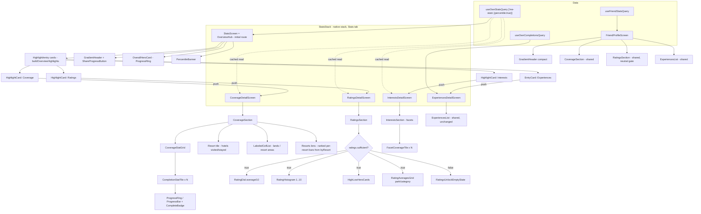
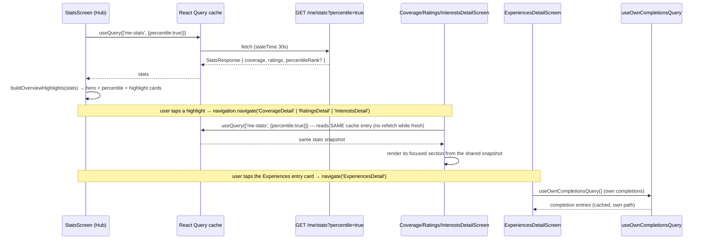
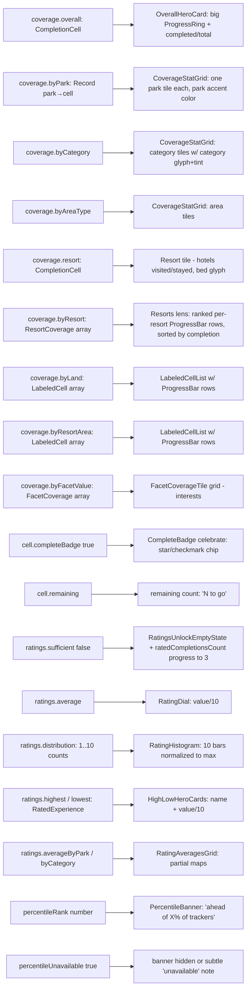

# Design Document: Stats Experience Redesign

## Overview

The backend `expanded-stats` feature reshaped `GET /me/stats` and
`GET /me/stats/summary?for=<id>[&percentile=true]` from a flat roll-up into a
nested `coverage` object plus new `ratings` and `percentileRank` data. The
mobile app (`apps/mobile`) still reads the old flat shape, so the Stats tab and
the Friend Profile view are broken and none of the new data (ratings,
distribution, highest/lowest, per-facet coverage, lands, resort areas,
percentile) is shown.

This feature **redesigns** the mobile stats experience rather than patching the
existing tabbed list. The landing surface is a compact, roughly screen-height
**Overview hub** — not an endless scroll of every section. The hub leads with a
hero overall-completion ring (celebratory at 100%), a percentile "you're ahead
of X% of trackers" brag line, and a small set (3–4) of curated **highlight
cards** that both summarize a story and act as tappable entry points (a Coverage
highlight, a Ratings highlight, an Interests highlight). Tapping a highlight
drills into a focused, bounded **detail screen** — `CoverageDetailScreen`,
`RatingsDetailScreen`, or `InterestsDetailScreen` — that shows the full richness
of that dimension (progress rings/bars, celebrated "complete" badges, the
average dial + 1–10 distribution histogram + highest/lowest + per-park/category
averages gated behind `ratings.sufficient`, per-facet interest tiles). Users
only go deep on what they care about; no single page scrolls forever. The Friend
Profile view reuses the same detail building blocks with friend-safe gating.

This is **primarily a mobile redesign with one small, additive backend change**.
The redesign also introduces **per-resort activity completion** — "how much
you've done *at* each resort" (dining, recreation, spa, and other resort-area
activities owned by a specific hotel). The current stats API does **not** expose
this, so a single additive coverage dimension, **`byResort`**, is added to the
`GET /me/stats` and `GET /me/stats/summary` response (see "Backend Addition:
`byResort` Coverage Dimension"). Every other statistic, transaction boundary,
and error path is unchanged. The mobile side reuses and extends the existing
theme system (`theme.ts` / `components.tsx`) and the shared navigation building
blocks; it does not introduce a parallel design system.

Note this `byResort` per-resort *activity* completion is **distinct from** the
existing hotels-visited `coverage.resort` statistic (whether you have *stayed*
at a hotel). Both are complementary stories shown together on the Coverage
screen (see Friend Parity and the Coverage detail screen).

## Goals

- Replace the broken flat-shape reads with the nested `coverage` / `ratings` /
  `percentileRank` contract on both the Own and Friend surfaces.
- Present a compact Overview-hub IA (hero + percentile + curated highlight
  cards) that drills into focused, bounded detail screens (not a wall of
  percentages, and not an endless scroll) — enjoyable, app-like, and shareable.
- Surface every new coverage dimension: overall, by park, by category, by area
  type, by land, by resort area, per facet ("interests"), hotels-visited
  resort, and **per-resort activity completion (`byResort`)**.
- Add the one additive backend `byResort` coverage dimension (per-resort
  activity completion) to `GET /me/stats` and `GET /me/stats/summary`, computed
  live inside the existing single stats snapshot transaction, and surface it in
  the Coverage detail screen.
- Surface personal ratings: average, distribution histogram, highest/lowest,
  per-park and per-category averages — gated behind `sufficient` with a tasteful
  unlock empty state.
- Surface percentile rank as a brag-worthy banner (opt in with `?percentile=true`).
- Keep the progress Share entry point working (`buildProgressShareParams`
  migrated to the new shape; composer still receives
  `overallPercent`/`perParkPercent`/`perCategoryPercent`).
- Preserve accessibility (labels, roles, dynamic type) and per-surface
  loading/error/empty states.

## Non-Goals

- No DB schema/migration changes and no changes to the existing stats
  computation (percent rounding, gating, percentile, the existing coverage /
  ratings dimensions). The server keeps doing all that math.
- The **only** backend change is additive: one new `byResort` coverage
  dimension computed inside the existing single stats snapshot transaction
  (no new transaction, no new endpoint, no migration). See "Backend Addition:
  `byResort` Coverage Dimension". This scopes back the earlier "mobile-only,
  no API changes" framing.
- No new social/sharing surfaces beyond keeping the existing progress-share
  entry point working.
- No offline caching strategy beyond the existing React Query behavior.
- The friend percentile is out of scope for display (see Friend Parity); friend
  reads will not request `?percentile=true`.

## Design Decisions Summary

| # | Decision | Choice | Rationale |
|---|----------|--------|-----------|
| D1 | Information architecture | **Overview hub + drill-in**: a compact, ~screen-height hub (hero ring + percentile brag line + 3–4 curated highlight/entry cards) replaces the 5-tab selector; each highlight drills into a focused, bounded detail screen (`CoverageDetailScreen`, `RatingsDetailScreen`, `InterestsDetailScreen`) | Kills the endless scroll the user rejected while keeping the experience brag-worthy and app-like. The hub gives the hero and the percentile room to shine and teases each story; users go deep only on what they care about, and each detail screen stays bounded (at most a modest scroll). |
| D1a | Drill-in mechanism | Push detail screens onto a **native stack local to the Stats tab** (new `StatsStack`), hub is its initial route | Mirrors the existing `CatalogStack`/`FriendsStack` pattern; keeps the bottom tab bar visible, gives native back/gestures for free, and lets each detail screen deep-link and re-read the cached snapshot. |
| D2 | Percentile fetch | Hub (Stats tab landing) requests `GET /me/stats?percentile=true` | Percentile is opt-in server-side; we must ask for it to show the brag line. |
| D3 | Friend percentile | Friend reads stay `?for=<id>` with **no** percentile | Comparing a friend's percentile to the viewer is ambiguous/competitive; keep friend view to coverage + gated ratings for parity and privacy. |
| D4 | Charting library | Build rings/bars/histogram from RN primitives + `expo-linear-gradient`; add **`react-native-svg`** only for the smooth arc ring, gated behind a flag with a primitive fallback | Avoids a heavy dep; `react-native-svg` is Expo-first-party and light, but is flagged as the single new dependency and is optional. |
| D5 | Wire types | Model the new nested `StatsResponse` inline in the mobile layer (mirroring the route contract), replacing the flat inline type and `FriendStatsResponse` | Matches the existing convention (mobile depends on the public contract, not backend internals). |
| D6 | Shared components | New visualization primitives live in `theme/components.tsx` (or a new `theme/charts.tsx`) and are reused by both Own and Friend surfaces | Structural parity, single design language. |
| D7 | Experiences list & grouping | Keep `ExperiencesList`, `CompletionRow`, `grouping.ts`, `GroupSection` as-is; they consume completions, not the stats shape | Minimize blast radius; only the stats-shape consumers migrate. |
| D8 | Experiences placement | Move the Experiences browse into its **own drill-in** `ExperiencesDetailScreen` (wrapping the unchanged `ExperiencesList`), reached from an entry card on the hub — rather than keeping it inline on the landing | The experiences list is itself long and filterable; inlining it on the landing would reintroduce the endless scroll the user rejected. A bounded entry card + dedicated route keeps the hub compact and gives the list room to breathe with its own filter/loading/retry, while the shared list component stays untouched (D7). |
| D9 | Per-resort activity completion (`byResort`) | Add **one additive coverage dimension** to the stats response, computed live inside the **existing** `REPEATABLE READ READ ONLY` snapshot transaction — grouping active experiences by `experiences.resort_id` joined to `resorts` for the name — rather than adding a new endpoint, a new transaction, or a DB migration | The data already exists (`experiences.resort_id` → `resorts`, migration 0004); it just was not surfaced. Folding one more grouped read into the same snapshot keeps every numerator/denominator on one pinned catalog state (R8) and stays within the existing latency budget (R11), with the smallest possible blast radius. Excluding resort-representing stand-in rows keeps it independent of the hotels-visited `coverage.resort` stat. |
| D10 | `byResort` presentation | Surface `byResort` as a **new "Resorts" lens** on the Coverage detail screen, rendering **ranked per-resort progress bars** with the existing bar/list components, while keeping the aggregate "Hotels visited" (`coverage.resort`) treatment | Per-resort *activity* completion and hotels-*visited* are two different, complementary stories; showing both on the Coverage screen tells the fuller picture. Reusing the ranked-bar `LabeledCellList`/`ProgressBar` pattern (as used for lands/resort areas) means no new visual language and minimal mobile blast radius. |

## Backend Addition: `byResort` Coverage Dimension (apps/api)

This is the sole backend change (D9). It adds one open-ended coverage
dimension, `byResort`, to the Stats_Service response. It touches only the
expanded-stats service (`apps/api/src/services/stats`), reuses the existing
single snapshot transaction, and requires **no DB migration** — the data
already exists.

### Data reality (confirmed from the schema)

- **`experiences.resort_id UUID REFERENCES resorts(id)`** (migration 0004) —
  links a resort-area *activity* (dining, recreation, spa, etc.) to its
  specific owning resort. This is the join key for `byResort`.
- This is **distinct** from two existing, unrelated columns:
  - **`experiences.represents_resort_id`** (migration 0009) — the
    resort-*representing* stand-in row that powers the hotels-visited
    `coverage.resort` aggregate (whether you have *stayed* at a hotel).
  - **`experiences.resort_area`** (a broad geographic zone text) — powers the
    existing `coverage.byResortArea` dimension.
- **`resorts`** is a first-class table: `id UUID PK`, `upstream_entity_id`,
  `name TEXT NOT NULL`, `active BOOLEAN` (plus descriptive columns). `byResort`
  joins to it for the display label and carries its `id`.

### Semantics

For each **active** resort (`resorts.active = TRUE`), group **active**
experiences by `experiences.resort_id`:

- **denominator** = count of active experiences with that `resort_id`;
- **numerator** = the Target_User's completions among those experiences.

This is per-resort *activity* completion (things done **at** the hotel),
deliberately **independent** of the hotels-visited `coverage.resort` stat:

- **Exclude resort-representing stand-in rows** (those with
  `represents_resort_id` set) from `byResort`, so the two stats never share a
  row and cannot conflate.
- **Only include resorts with ≥ 1 active experience** carrying that
  `resort_id` (open-ended, data-driven list — never a fixed map). A resort with
  no resort-linked activity simply does not appear.
- Use the resort's **`name`** as the display **label**, and carry the resort
  **`id`** so mobile can identify/navigate a resort.
- **Empty** when the user/catalog has no resort-linked experiences.

### Wire shape

Add `byResort` to `CoverageResponse` (in `apps/api/src/services/stats/routes.ts`)
and mirror it in the mobile `apps/mobile/src/api/statsTypes.ts`. Introduce a new
`ResortCoverage` type mirroring `FacetCoverage`:

```typescript
// mirrors FacetCoverage { key, label, cell }
export interface ResortCoverage {
  /** resorts.id — stable resort identity for navigation/identification. */
  readonly resortId: string;
  /** Display label = resorts.name. */
  readonly label: string;
  /** Completion cell: { completed, total, percent, remaining, completeBadge }. */
  readonly cell: CompletionCell;
}
```

```typescript
// CoverageResponse gains one field (both routes.ts and mobile statsTypes.ts):
export interface CoverageResponse {
  // ...existing dimensions unchanged...
  readonly resort: CompletionCell;             // hotels-visited (stayed) — unchanged
  readonly byResort: readonly ResortCoverage[]; // NEW: per-resort activity completion
}
```

`ResortCoverage` is defined once alongside the roll-up (see below) and imported
by `routes.ts`; the mobile `statsTypes.ts` re-declares the identical shape
(matching the existing convention that mobile mirrors the public contract). If
the project prefers a single source of truth, the type MAY be exported from the
shared `@dwt/shared` package instead and imported by both sides — this is the
one place where a shared-package touch could occur; either way the shape is the
same.

### Repo read (`apps/api/src/services/stats/repo.ts`)

Add one grouped read inside the **same** `BEGIN ISOLATION LEVEL REPEATABLE READ
READ ONLY` transaction (so it observes the same pinned snapshot as every other
statistic, R8.1/R8.3), returned as new raw material on `StatsSnapshot`:

- **Denominators** — active experiences grouped by `resort_id`, joined to
  `resorts` for the name, excluding resort-representing stand-ins:
  ```sql
  SELECT e.resort_id            AS resort_id,
         r.name                 AS resort_name,
         COUNT(*)::bigint       AS total
    FROM experiences e
    JOIN resorts r ON r.id = e.resort_id AND r.active = TRUE
   WHERE e.active = TRUE
     AND e.resort_id IS NOT NULL
     AND e.represents_resort_id IS NULL
   GROUP BY e.resort_id, r.name
  ```
- **Numerators** — the same grouping restricted to the Target_User's
  completions of those active experiences:
  ```sql
  SELECT e.resort_id            AS resort_id,
         COUNT(*)::bigint       AS completed
    FROM completions c
    JOIN experiences e ON e.id = c.experience_id
   WHERE c.user_id = $1
     AND e.active = TRUE
     AND e.resort_id IS NOT NULL
     AND e.represents_resort_id IS NULL
   GROUP BY e.resort_id
  ```

Expose the merged raw rows on `StatsSnapshot` as a new field, e.g.
`resortCoverage: readonly RawResortCoverageRow[]` where
`RawResortCoverageRow { resortId: string; label: string; completed: number; total: number }`
(owned by the pure roll-up module, mirroring how `RawCoverageCell` /
`RawFacetExperienceRow` are owned by their pure modules). The repo stays
"dumb": it reads and merges denominator/numerator counts per `resort_id`; it
folds nothing.

### Pure roll-up (`coverage.ts` or a small new `resorts.ts`)

A pure function (no I/O) folds the raw rows into the sorted `ResortCoverage[]`,
reusing the shared `toCompletionCell` constructor so the empty-group / percent /
`completeBadge` laws are identical to every other cell. Recommended location: a
small new `apps/api/src/services/stats/resorts.ts` (mirroring `facets.ts`), or
an added export in `coverage.ts`.

Sort order **matches the facet display sort** for determinism: **percent
descending, then total descending, then case-insensitive label ascending**
(with an exact-string tiebreak so the order is total):

```typescript
// resorts.ts (pure)
export function rollUpResortCoverage(
  rows: readonly RawResortCoverageRow[],
): readonly ResortCoverage[] {
  return rows
    .map((row) => ({
      resortId: row.resortId,
      label: row.label,
      cell: toCompletionCell(row.completed, row.total),
    }))
    .sort((a, b) => {
      if (b.cell.percent !== a.cell.percent) return b.cell.percent - a.cell.percent;
      if (b.cell.total !== a.cell.total) return b.cell.total - a.cell.total;
      const al = a.label.toLowerCase();
      const bl = b.label.toLowerCase();
      if (al !== bl) return al < bl ? -1 : 1;
      return a.label < b.label ? -1 : a.label > b.label ? 1 : 0;
    });
}
```

### Response assembly (`routes.ts`)

`assembleResponse` gains one line — `byResort: rollUpResortCoverage(snapshot.resortCoverage)`
— inside the `coverage` object it already builds. No change to gating,
authorization, percentile isolation, or error mapping. Both `GET /me/stats` and
`GET /me/stats/summary` return `byResort` automatically because they share
`assembleResponse` (self and friend reads stay structurally identical, R9.1).

### Ordering / empty

Open-ended, data-driven list. Empty (`[]`) when the user/catalog has no
resort-linked active experiences. Every included resort has `total ≥ 1` by
construction (the denominator read only yields groups with ≥ 1 active
resort-linked experience).

### Performance (R11)

`byResort` is **one additional grouped read** in the existing snapshot
transaction (both queries hit the already-indexed `experiences.active` /
`resort_id` columns and a PK join to `resorts`). It stays within the existing
R11 latency budgets (the 2s / 3s statement-timeout envelope is unchanged); the
perf test should seed resort-linked experiences so the added read is exercised
under load.

## Architecture

### Screen / component hierarchy



The hub and all three stat detail screens read from the **same cached
`['me-stats', { percentile: true }]` snapshot** (one source of truth): the hub
issues the query, and each detail screen reads the same cache entry (see
Navigation and Screen state), so a deep-link straight into a detail screen and a
back-navigation both work without a second fetch.

### Data fetch flow



The detail screens intentionally re-declare the **same query key** rather than
receiving the full `StatsResponse` through route params. This keeps one source
of truth (a background refetch updates the hub and every open detail screen
alike), keeps route params tiny/serializable, and makes a deep-link into a
detail route self-sufficient (it triggers the cached read or an initial fetch on
its own). Only the small `origin`/selection params travel through navigation.

## Information Architecture (D1)

The Own Stats view moves from a five-tab selector (`OWN_STATS_TABS`) — and from
the earlier rejected single long scrollable dashboard — to an **Overview hub +
drill-in** model. The landing is compact (roughly one screen tall, minimal
scroll); the depth lives in focused detail screens the user opens only when they
want it. Justification:

- The user explicitly rejected endless scrolling. A hub keeps the landing
  glanceable and app-like: the headline number and the percentile brag land
  immediately, and each story is teased by a card rather than stacked in full.
- The new payload still has four distinct registers (overall hero, coverage,
  ratings, interests). Each becomes a bounded destination instead of a section
  in one ever-growing page, so a detail screen can go rich without making *every*
  visit long.
- Coverage now includes open-ended, data-driven dimensions (lands, resort
  areas, facets) whose length is unpredictable; confining them to their own
  detail screen keeps the landing's height stable regardless of data volume.

### Overview hub (landing — `StatsScreen`)

Compact, ~screen-height, top → bottom:

1. **OverallHeroCard** — large progress ring, completed/total, celebratory state
   at 100%.
2. **PercentileBanner** — "You're ahead of X% of trackers" brag line (Own only;
   hidden if absent/unavailable).
3. **Highlight / entry cards** — a small curated set (3–4), each derived by
   `buildOverviewHighlights(stats)` and each **tappable** to drill into its
   detail screen:
   - **Coverage highlight** → `CoverageDetailScreen`. Headline teases the best
     story, e.g. "Best park: Magic Kingdom 82%", or a just-earned complete badge
     ("Magic Kingdom complete!") when one exists.
   - **Ratings highlight** → `RatingsDetailScreen`. When `ratings.sufficient`,
     teases the average dial + "your top-rated: <name>"; when not, shows a
     compact "unlock ratings (N/3)" affordance that still routes to the detail
     screen's unlock state.
   - **Interests highlight** → `InterestsDetailScreen`. Teases the top facet,
     e.g. "Thrill Rides 71%".
   - **Experiences entry card** → `ExperiencesDetailScreen` (D8). A navigational
     card ("Browse your experiences") rather than a stat tease.

Nothing on the hub scrolls endlessly: the highlight set is capped and the cards
are fixed-height. The hero + percentile + up to four cards fit within a
roughly screen-height layout.

### Detail screens (pushed onto `StatsStack`)

Each is focused and bounded — at most a modest scroll — and reads from the shared
cached snapshot:

- **`CoverageDetailScreen`** — the full coverage story, organized by a **lens
  switcher** (`Parks · Categories · Areas · Lands · Resorts`): `CoverageStatGrid`
  of `CompletionStatTile`s for **byPark**, **byCategory**, **byAreaType**; the
  hotels-visited **resort** tile (whether you have *stayed*); `LabeledCellList`s
  for **byLand** and **byResortArea** (each collapsible when long); and the new
  **Resorts** lens rendering **byResort** as **ranked per-resort progress bars**
  (e.g. "Grand Floridian 4/9 · 44%"), sorted by completion, using the same
  ranked-bar `LabeledCellList`/`ProgressBar` pattern. The aggregate
  hotels-visited **resort** treatment and the per-resort **byResort** activity
  completion are two distinct, complementary stories, both shown here.
- **`RatingsDetailScreen`** — gated on `ratings.sufficient`: **average dial**,
  **distribution histogram**, **highest/lowest** hero cards, **per-park &
  per-category averages**; when not sufficient, the **unlock** empty state
  (progress toward the 3-rating threshold).
- **`InterestsDetailScreen`** — `FacetCoverageTile`s for **byFacetValue** (the
  "Thrill Rides"-style interests), sorted for display; compact empty state when
  there are none.
- **`ExperiencesDetailScreen`** — the existing shared `ExperiencesList` over the
  user's completions (retains its own filter + loading/error/retry), unchanged
  internally (D7/D8).

### Navigation flow

`hub → (tap highlight) → detail → (native back) → hub`. Drill-in is a push onto a
Stats-local native stack (D1a, see Navigation), so the bottom tab bar stays
visible and back is a native gesture/header. Re-selecting the Stats tab returns
to the hub (its initial route) per default tab behavior.

The Friend surface reuses the Coverage/Ratings/Experiences detail *components*
(see Friend Parity) — omitting the percentile banner and, per D3, interests
unless later scoped in. The friend hub is the existing `FriendProfileScreen`
(itself a screen within `FriendsStack`), so friend coverage/ratings render inline
or via the same shared sections; friend drill-in is optional and not required for
parity.

## Navigation (D1a)

**Current state.** In `apps/mobile/src/navigation/RootNavigator.tsx` the Stats
tab is registered as a *bare screen* — `<MainTabs.Screen name="Stats"
component={StatsScreen} />` — with no nested stack. The Catalog and Friends tabs,
by contrast, each nest their own native stack (`CatalogStack`, `FriendsStack`)
so they can drill in without leaving the tab. The root stack (`RootStack`) hosts
`MainTabs`, plus `ExperienceDetail`, `Menu`, and the `ShareComposer` modal as
siblings above the tabs.

**Chosen mechanism.** Introduce a **`StatsStack`** (new
`apps/mobile/src/navigation/StatsStack.tsx`), a `createNativeStackNavigator`
mirroring `CatalogStack`/`FriendsStack`, and register it as the Stats tab's
component in place of the bare `StatsScreen`. The hub (`StatsScreen`) is the
stack's initial route; the four detail screens are pushed above it. This keeps
the bottom tab bar visible, gives native back gesture + header for free, and
matches the established per-tab-stack convention (justifying it over promoting
the detail screens to the root stack — they are Stats-local, not cross-tab
destinations like `ExperienceDetail`).

```typescript
// apps/mobile/src/navigation/StatsStack.tsx  (NEW)
export type StatsStackParamList = {
  /** Overview hub — the Stats tab landing (initial route). */
  StatsOverview: undefined;
  /** Focused coverage story; optional deep-link focus (e.g. jump to a section). */
  CoverageDetail: { focus?: 'parks' | 'categories' | 'areas' | 'lands' | 'resortAreas' | 'resort' | 'resorts' } | undefined;
  /** Focused ratings story (rich or unlock state, decided from the cache). */
  RatingsDetail: undefined;
  /** Focused interests/facets grid. */
  InterestsDetail: undefined;
  /** The existing ExperiencesList wrapped as its own route (D8). */
  ExperiencesDetail: undefined;
};
```

- **`MainTabParamList.Stats`** changes from `undefined` to
  `NavigatorScreenParams<StatsStackParamList> | undefined`, matching the
  `Catalog`/`Friends` tab typing, so a caller holding the root ref can deep-link
  a specific detail route via
  `navigate('MainTabs', { screen: 'Stats', params: { screen: 'RatingsDetail' } })`.
- **Route params are minimal.** No screen receives the `StatsResponse` through
  params. The only params are small, serializable hints (e.g. `CoverageDetail`'s
  optional `focus`). The data itself comes from the shared cached query (see
  Screen state), so back-navigation and deep-links both work with a single
  source of truth.
- **Header.** Detail screens use `headerShown: false` (like the other stacks)
  and supply their own themed in-content header with a back affordance; the hub
  is likewise headerless. The Stats tab icon/label registration in
  `MainTabsNavigator` is unchanged (the tab now points at `StatsStack`).
- **Friend consistency.** `FriendProfileScreen` stays within `FriendsStack`; it
  reuses the same detail *components* (Coverage/Ratings/Experiences sections) but
  does not gain a `StatsStack`. The friend hub omits the percentile banner (D3)
  and interests unless justified later. No change to `FriendsStack` routing is
  required by this redesign.
- **Unaffected root routes.** `ExperienceDetail`, `Menu`, and `ShareComposer`
  remain on the root stack; the highest/lowest hero cards and the share button
  continue to navigate to them cross-navigator exactly as today.

## Data-to-Visual Mapping



Visual rules:

- **completeBadge** (`cell.completeBadge === true` ⇔ `total>0 && completed===total`)
  is celebrated everywhere a tile/row appears — a gold star or check chip plus a
  filled ring. At `coverage.overall.completeBadge` the hero gets a full
  celebratory treatment (confetti-style accent, gold gradient ring).
- **remaining** (`cell.remaining`) is shown as an encouraging "N to go" affordance
  on incomplete tiles, and suppressed when complete.
- **Empty group** (`total === 0`): the server guarantees `percent 0.0`,
  `completed 0`, `remaining 0`, `completeBadge false`. Tiles render a muted
  0% ring and a "Nothing here yet" hint; they are not hidden (fixed-enum
  dimensions always render all members for a stable layout). Open-ended
  dimensions (lands, resort areas, facets, **resorts**) only include rows the
  server returns, so empty ones simply do not appear; if the whole list is
  empty the section shows a compact empty state.
- **byResort vs resort**: the Resorts lens (`coverage.byResort`, per-resort
  *activity* completion) and the hotels-visited **resort** tile
  (`coverage.resort`, whether you *stayed*) are rendered as two separate,
  complementary treatments and are never merged.

## Data Models

### Wire Types (D5)

The mobile layer models the new nested contract inline, mirroring
`apps/api/src/services/stats/routes.ts`. This **replaces** the flat inline
`StatsResponse`/`StatsBreakdown` in `StatsScreen.tsx` and the flat
`FriendStatsResponse`/`FriendStatsBreakdown` in `api/friendProfile.ts`.

A single shared module is proposed: `apps/mobile/src/api/statsTypes.ts` (new),
imported by both `StatsScreen`, `FriendProfileScreen`, `useOwnStats`,
`progressComparison`, and the projection helper. This removes the current
duplication of the stats shape across screens.

```typescript
// apps/mobile/src/api/statsTypes.ts  (NEW)

import type { AreaType, ExperienceCategory, Park } from '@dwt/shared';

/** One coverage cell. Mirrors CompletionCell in the Stats_Service route. */
export interface CompletionCell {
  readonly completed: number;
  readonly total: number;
  /** Already in [0.0, 100.0], one decimal, from the server. */
  readonly percent: number;
  readonly remaining: number;
  /** true iff total > 0 && completed === total. */
  readonly completeBadge: boolean;
}

/** A coverage cell tagged with a data-driven display label (lands, resort areas). */
export interface LabeledCell {
  readonly label: string;
  readonly cell: CompletionCell;
}

/** A per-facet ("interest") coverage cell. */
export interface FacetCoverage {
  readonly key: string;
  readonly label: string;
  readonly cell: CompletionCell;
}

/**
 * A per-resort *activity* coverage cell (things done AT the hotel), tagged with
 * the resort's id + display name. Mirrors ResortCoverage in the Stats route.
 * Distinct from `resort` (hotels-visited / stayed).
 */
export interface ResortCoverage {
  readonly resortId: string;
  readonly label: string;
  readonly cell: CompletionCell;
}

export interface CoverageResponse {
  readonly overall: CompletionCell;
  readonly byPark: Readonly<Record<Park, CompletionCell>>;
  readonly byCategory: Readonly<Record<ExperienceCategory, CompletionCell>>;
  readonly byAreaType: Readonly<Record<AreaType, CompletionCell>>;
  readonly byLand: readonly LabeledCell[];
  readonly byResortArea: readonly LabeledCell[];
  readonly byFacetValue: readonly FacetCoverage[];
  /** Hotels-visited Resort_Statistic (stayed), distinct from byAreaType['Resort']. */
  readonly resort: CompletionCell;
  /**
   * Per-resort activity completion (open-ended, sorted percent desc / total
   * desc / case-insensitive label asc). Empty when no resort-linked
   * experiences. Independent of `resort` (excludes resort-representing rows).
   */
  readonly byResort: readonly ResortCoverage[];
}

export interface RatedExperience {
  readonly experienceId: string;
  readonly name: string;
  /** The user's own rating, an integer 1..10. */
  readonly value: number;
}

export type RatingDistribution = Readonly<
  Record<1 | 2 | 3 | 4 | 5 | 6 | 7 | 8 | 9 | 10, number>
>;

export interface RatingStatistics {
  /** true iff active-rating count >= 3 (MINIMUM_RATINGS_THRESHOLD). */
  readonly sufficient: boolean;
  /** Always present. */
  readonly ratedCompletionsCount: number;
  readonly average?: number;                                   // [1.0,10.0]
  readonly averageByPark?: Partial<Record<Park, number>>;
  readonly averageByCategory?: Partial<Record<ExperienceCategory, number>>;
  readonly distribution?: RatingDistribution;
  readonly highest?: RatedExperience;
  readonly lowest?: RatedExperience;
}

export interface StatsResponse {
  readonly coverage: CoverageResponse;
  readonly ratings: RatingStatistics;
  /** Present only when requested with ?percentile=true AND computed. */
  readonly percentileRank?: number;
  /** Present only on isolated percentile failure. */
  readonly percentileUnavailable?: boolean;
}

/** Threshold mirrored from the server for the "unlock" progress affordance. */
export const MINIMUM_RATINGS_THRESHOLD = 3;
```

Notes:

- `FriendStatsResponse` is replaced by this same `StatsResponse` (both endpoints
  return the identical superset shape). The old `byParkAndCategory` field is
  **gone** — nothing in the redesign consumes it.
- `useOwnStats.ts` currently narrows to the old `FriendStatsResponse`; it will
  return `StatsResponse` (the full superset) so the comparison, the hub, and the
  detail screens read from `data.coverage.*`.

## Charting / Visualization Approach (D4)

**Current dependencies (from `apps/mobile/package.json`):** no charting or SVG
library is installed. Available primitives: `react-native` views,
`expo-linear-gradient`, `@expo/vector-icons` (Ionicons). This is the design
constraint.

**Approach:** build the visuals from primitives wherever possible, and flag a
single small dependency for the one shape primitives handle poorly.

- **ProgressBar** — pure `View` composition: a track view with a filled inner
  view whose width is `percent%`, rounded corners, gradient fill via
  `expo-linear-gradient`. No new dependency.
- **RatingHistogram** — 10 vertical bars (`View`s) with heights normalized to the
  max bin count; labels 1–10 beneath. No new dependency.
- **RatingDial** — a horizontal 0–10 track with a filled portion and a value
  chip, or a row of 10 segmented pips. No new dependency.
- **CompleteBadge / celebratory accents** — gold gradient + Ionicons star/check.
  No new dependency.
- **ProgressRing (circular arc)** — a smooth circular progress arc is the one
  thing RN primitives cannot render cleanly (no conic gradients / arc strokes).
  Options:
  - **(Recommended) Add `react-native-svg`** — Expo-first-party, widely used,
    small footprint. Enables a crisp `<Circle>` stroke-dashoffset ring for the
    hero and tiles.
  - **(Fallback, zero-dep)** — approximate the ring with two half-circle
    `View`s rotated by the fill angle (the classic "two semicircle" CSS trick),
    or simply use `ProgressBar` for tiles and reserve a larger bar for the hero.

**Flag:** `react-native-svg` is a **new dependency**. It is light and
Expo-supported, but adding it is a decision for the requirements phase. The
component API (`ProgressRing`) will be written so the SVG implementation is
swappable with the primitive fallback behind the same props, so the redesign is
not blocked on this decision.

New primitives are added to the theme layer (proposed `theme/charts.tsx`, a
sibling of `components.tsx`) so both surfaces share one visual language and the
existing `components.tsx` stays focused on generic UI.

## Components and Interfaces

All components are function components. Props are `readonly`. Colors, spacing,
radii come from `theme`. Every data-bearing visual carries an
`accessibilityLabel` (see Accessibility).

```typescript
// theme/charts.tsx (NEW) — shared visualization primitives

interface ProgressRingProps {
  readonly percent: number;          // [0,100], already server-rounded
  readonly size?: number;            // px diameter; default per usage (hero vs tile)
  readonly strokeWidth?: number;
  readonly color?: string;           // accent; defaults to theme.color.primary
  readonly trackColor?: string;
  readonly complete?: boolean;       // drives celebratory gold treatment
  readonly centerLabel?: string;     // e.g. "42.0%" or completed/total
  readonly accessibilityLabel: string;
  readonly testID?: string;
}

interface ProgressBarProps {
  readonly percent: number;          // [0,100]
  readonly color?: string;
  readonly complete?: boolean;
  readonly accessibilityLabel: string;
  readonly testID?: string;
}

interface RatingHistogramProps {
  readonly distribution: RatingDistribution;  // 1..10 → count
  readonly highlightValue?: number;            // e.g. rounded average bin
  readonly accessibilityLabel: string;
  readonly testID?: string;
}

interface RatingDialProps {
  readonly average: number;          // [1,10]
  readonly accessibilityLabel: string;
  readonly testID?: string;
}

interface CompleteBadgeProps {
  readonly testID?: string;          // gold star/check "Complete!" chip
}
```

```typescript
// screens/stats/components/*  (NEW section components — used inside detail screens)

interface OverallHeroCardProps {
  readonly cell: CompletionCell;     // coverage.overall
  readonly testID?: string;
}

interface PercentileBannerProps {
  // Rendered only when percentileRank is a number; hidden otherwise.
  readonly percentileRank: number;   // [0,100], one decimal
  readonly testID?: string;
}

interface CompletionStatTileProps {
  readonly title: string;
  readonly cell: CompletionCell;
  readonly accentColor?: string;     // park accent / category tint
  readonly icon?: keyof typeof Ionicons.glyphMap;
  readonly variant?: 'ring' | 'bar'; // ring for grid tiles, bar for dense lists
  readonly testID?: string;
}

interface CoverageStatGridProps {
  readonly cells: readonly {           // pre-ordered by the screen
    readonly key: string;
    readonly title: string;
    readonly cell: CompletionCell;
    readonly accentColor?: string;
    readonly icon?: keyof typeof Ionicons.glyphMap;
  }[];
  readonly testIDPrefix: string;
}

interface LabeledCellListProps {
  readonly title: string;
  readonly items: readonly LabeledCell[];   // byLand / byResortArea
  readonly initialVisible?: number;         // collapse long lists (e.g. 6)
  readonly emptyMessage: string;
  readonly testIDPrefix: string;
}

interface FacetCoverageTileProps {
  readonly facet: FacetCoverage;
  readonly testID?: string;
}

interface RatingsSectionProps {
  readonly ratings: RatingStatistics;  // gates internally on `sufficient`
  readonly testID?: string;
}

interface RatingsUnlockEmptyStateProps {
  readonly ratedCompletionsCount: number;   // shown as progress toward 3
  readonly threshold: number;                // MINIMUM_RATINGS_THRESHOLD
  readonly testID?: string;
}

interface HighLowHeroCardsProps {
  readonly highest?: RatedExperience;
  readonly lowest?: RatedExperience;
  readonly onOpenExperience: (experienceId: string) => void;
  readonly testID?: string;
}
```

The section/primitive components above (`CompletionStatTile`, `CoverageStatGrid`,
`LabeledCellList`, `FacetCoverageTile`, `RatingsSection`, `RatingsUnlockEmptyState`,
`HighLowHeroCards`, and the `theme/charts.tsx` primitives) are unchanged in
contract but now **live inside the detail screens** rather than a single
dashboard: `CoverageStatGrid` + `LabeledCellList` render inside
`CoverageDetailScreen`, `RatingsSection` inside `RatingsDetailScreen`, and
`FacetCoverageTile`s inside `InterestsDetailScreen`.

### Screen components (NEW — hub + detail screens)

```typescript
// screens/stats/StatsScreen.tsx — the Overview HUB (Stats tab landing).
// Owns the ['me-stats', {percentile:true}] query; renders hero + percentile +
// highlight/entry cards. No props (route component); reads nav from hooks.

// screens/stats/CoverageDetailScreen.tsx
// screens/stats/RatingsDetailScreen.tsx
// screens/stats/InterestsDetailScreen.tsx
// screens/stats/ExperiencesDetailScreen.tsx
//   Each is a StatsStack route component. The three stat detail screens read the
//   SAME cached ['me-stats', {percentile:true}] query (one source of truth);
//   ExperiencesDetailScreen reads useOwnCompletionsQuery and wraps ExperiencesList.

/** A curated highlight derived from the stats snapshot, and its drill-in target. */
type HighlightTarget =
  | { readonly route: 'CoverageDetail'; readonly focus?: CoverageFocus }
  | { readonly route: 'RatingsDetail' }
  | { readonly route: 'InterestsDetail' }
  | { readonly route: 'ExperiencesDetail' };

interface OverviewHighlight {
  readonly id: 'coverage' | 'ratings' | 'interests' | 'experiences';
  readonly icon: keyof typeof Ionicons.glyphMap;
  readonly title: string;          // e.g. "Coverage"
  readonly headline: string;       // e.g. "Best park: Magic Kingdom 82%"
  readonly subtext?: string;       // e.g. "3 more to a complete park"
  readonly percent?: number;       // optional mini progress affordance [0,100]
  readonly complete?: boolean;     // celebratory accent (e.g. a just-earned badge)
  readonly locked?: boolean;       // ratings not yet sufficient → "unlock (N/3)"
  readonly target: HighlightTarget;
}

/** One tappable highlight/entry card on the hub. Pure presentational. */
interface HighlightCardProps {
  readonly highlight: OverviewHighlight;
  readonly onPress: (target: HighlightTarget) => void;   // → navigation.navigate(target.route, params)
  readonly testID?: string;
}
```

`StatsScreen` (hub) calls `buildOverviewHighlights(stats)` (see Data-Transform
Pseudocode), maps each result to a `HighlightCard`, and on press dispatches
`navigation.navigate(target.route, params)` within `StatsStack`. The detail
screens re-read the same cached query and compose the existing section
components; no `StatsResponse` is passed through route params.

### Screen state

The **hub** (`StatsScreen`) owns the single `useQuery` for
`['me-stats', { percentile: true }]`; it derives the hero, percentile, and
highlight cards from that one snapshot via `buildOverviewHighlights(stats)`. The
`useViewMode`/tab machinery is removed from the Own view (the hub + drill-in
replaces it).

Each **stat detail screen** (`CoverageDetailScreen`, `RatingsDetailScreen`,
`InterestsDetailScreen`) re-declares the **same** `useQuery(['me-stats', {
percentile: true }])` and reads from the shared React Query cache — it does not
receive the `StatsResponse` through route params. This gives one source of truth
(a background refetch updates the hub and every open detail screen together),
tiny serializable route params, and self-sufficient deep-links/back-navigation
(a detail route entered cold still resolves its data via the cached read or an
initial fetch). `ExperiencesDetailScreen` uses `useOwnCompletionsQuery` and wraps
the unchanged `ExperiencesList`.

Section-local UI state (e.g. `LabeledCellList` expand/collapse; the histogram is
stateless) is held with `useState` inside each section component. The share
button and its in-flight guard (`useOpenShareComposer`) live on the hub and are
unchanged.

`FriendProfileScreen` keeps its three independent reads and per-read
loading/error/retry states; only the stats-consuming panes change shape (see
Friend Parity). Its `Compare` tab and `progressComparison`/`completionDiff`
derivations continue to work off the migrated `StatsResponse`.

## Data-Transform Pseudocode (Low-Level)

All heavy math is done server-side. Mobile transforms are display-only:
ordering, selecting, normalizing, and phrasing. These are pure, framework-free
helpers (mirroring the existing `grouping.ts` / `shareEntryPoint.ts` pattern),
proposed in `screens/stats/statsView.ts` (new), so they are unit- and
property-testable without rendering.

### Ordering fixed-enum coverage into grid tiles

```typescript
// Build ordered park tiles from coverage.byPark, in canonical PARKS order,
// carrying the park accent color. Every park is included (stable layout).
function buildParkTiles(byPark: Record<Park, CompletionCell>): TileSpec[] {
  return PARKS.map((park) => ({
    key: park,
    title: park,
    cell: byPark[park],
    accentColor: theme.parkAccent[park],
  }));
}

// Categories in EXPERIENCE_CATEGORIES order with glyph + tint from categoryVisual.
function buildCategoryTiles(
  byCategory: Record<ExperienceCategory, CompletionCell>,
): TileSpec[] {
  return EXPERIENCE_CATEGORIES.map((category) => {
    const visual = theme.categoryVisual[category];
    return {
      key: category,
      title: visual.label,
      cell: byCategory[category],
      accentColor: visual.tint,
      icon: visual.glyph,
    };
  });
}
```

### Selecting & sorting facets ("interests") and lands for display

The server returns `byFacetValue` sorted by exact key and `byLand`/`byResortArea`
sorted by case-insensitive label. For a brag-worthy display we prefer to lead
with the most-complete, most-substantial groups.

```typescript
// Sort facets for display: highest percent first, then most total (bigger
// groups), then label for determinism. Optionally cap to a "top N interests"
// with a "show all" affordance. Pure over the server list.
function sortFacetsForDisplay(
  facets: readonly FacetCoverage[],
): readonly FacetCoverage[] {
  return [...facets].sort((a, b) => {
    if (b.cell.percent !== a.cell.percent) return b.cell.percent - a.cell.percent;
    if (b.cell.total !== a.cell.total) return b.cell.total - a.cell.total;
    return a.label.localeCompare(b.label);
  });
}

// Lands / resort areas: keep the server's alphabetical order for scannability,
// but a LabeledCellList collapses to `initialVisible` rows with a toggle.
function visibleLabeledCells(
  items: readonly LabeledCell[],
  expanded: boolean,
  initialVisible: number,
): readonly LabeledCell[] {
  return expanded ? items : items.slice(0, initialVisible);
}
```

### Distribution normalization for the histogram

```typescript
// Map the 1..10 counts to bar fractions [0,1] of the tallest bin so bars scale
// to the available height. A zero-count value renders an empty (baseline) bar.
function normalizeDistribution(
  distribution: RatingDistribution,
): readonly { value: number; count: number; fraction: number }[] {
  const values = [1,2,3,4,5,6,7,8,9,10] as const;
  const max = Math.max(1, ...values.map((v) => distribution[v]));
  return values.map((v) => ({
    value: v,
    count: distribution[v],
    fraction: distribution[v] / max,   // in [0,1]
  }));
}
```

### Percentile phrasing (brag-worthy)

```typescript
// percentileRank is "percentage of OTHER trackers strictly behind you", [0,100].
// Phrase it warmly; degrade gracefully at the extremes and the only-tracker case.
function phrasePercentile(rank: number): string {
  const pct = rank.toFixed(1);
  if (rank <= 0) {
    return "You're just getting started — plenty of magic ahead.";
  }
  if (rank >= 99.5) {
    return `You're ahead of ${pct}% of trackers — legendary status.`;
  }
  return `You're ahead of ${pct}% of trackers.`;
}

// Rendering rule: show the banner iff `percentileRank` is a number.
// If `percentileUnavailable === true` (isolated failure), hide the banner (or
// show a subtle, non-alarming note); never block the rest of the hub.
function shouldShowPercentile(stats: StatsResponse): boolean {
  return typeof stats.percentileRank === 'number';
}
```

### Ratings gating & unlock affordance

```typescript
// Ratings section chooses between the rich view and the unlock empty state
// purely from `sufficient`. The unlock state shows progress toward the threshold.
function ratingsView(ratings: RatingStatistics): 'rich' | 'unlock' {
  return ratings.sufficient ? 'rich' : 'unlock';
}

// Unlock copy uses the always-present ratedCompletionsCount.
function unlockRemaining(ratings: RatingStatistics, threshold: number): number {
  return Math.max(0, threshold - ratings.ratedCompletionsCount);
}
```

### Building the Overview hub highlights

`buildOverviewHighlights` is a **pure** function from a `StatsResponse` to the
ordered list of curated highlight/entry cards shown on the hub. It selects the
"best story" for each dimension and phrases it for a brag-worthy tease; it is
deterministic (same input → same output, stable order) and total over any valid
`StatsResponse`. It performs no fetching and no rendering, so it is unit- and
property-testable.

```typescript
// screens/stats/statsView.ts (pure)

// Pick the coverage headline: prefer celebrating a just-completed fixed-enum
// group; otherwise lead with the highest-percent park (ties broken by PARKS
// order for determinism). Falls back to overall when nothing stands out.
function pickCoverageHighlight(coverage: CoverageResponse): OverviewHighlight {
  const parkEntries = PARKS.map((p) => ({ park: p, cell: coverage.byPark[p] }));

  const completePark = parkEntries.find((e) => e.cell.completeBadge);
  if (completePark) {
    return {
      id: 'coverage',
      icon: 'map',
      title: 'Coverage',
      headline: `${completePark.park} complete!`,
      complete: true,
      percent: 100,
      target: { route: 'CoverageDetail', focus: 'parks' },
    };
  }

  // Highest-percent park among those with any total; PARKS order breaks ties
  // because find/reduce below is stable over the canonical order.
  const best = parkEntries
    .filter((e) => e.cell.total > 0)
    .reduce<{ park: Park; cell: CompletionCell } | null>((acc, e) => {
      if (acc === null) return e;
      return e.cell.percent > acc.cell.percent ? e : acc;
    }, null);

  if (best) {
    return {
      id: 'coverage',
      icon: 'map',
      title: 'Coverage',
      headline: `Best park: ${best.park} ${best.cell.percent.toFixed(1)}%`,
      subtext: best.cell.remaining > 0 ? `${best.cell.remaining} to go` : undefined,
      percent: best.cell.percent,
      target: { route: 'CoverageDetail', focus: 'parks' },
    };
  }

  return {
    id: 'coverage',
    icon: 'map',
    title: 'Coverage',
    headline: `${coverage.overall.percent.toFixed(1)}% overall`,
    percent: coverage.overall.percent,
    target: { route: 'CoverageDetail' },
  };
}

// Ratings tease: rich when sufficient (average + top-rated name); otherwise a
// locked "unlock (N/3)" card that still routes to the detail unlock state.
function pickRatingsHighlight(ratings: RatingStatistics): OverviewHighlight {
  if (!ratings.sufficient) {
    return {
      id: 'ratings',
      icon: 'star-outline',
      title: 'Ratings',
      headline: `Unlock ratings (${ratings.ratedCompletionsCount}/${MINIMUM_RATINGS_THRESHOLD})`,
      locked: true,
      target: { route: 'RatingsDetail' },
    };
  }
  const avg = ratings.average ?? 0;
  return {
    id: 'ratings',
    icon: 'star',
    title: 'Ratings',
    headline: `Average ${avg.toFixed(1)}/10`,
    subtext: ratings.highest ? `Top-rated: ${ratings.highest.name}` : undefined,
    target: { route: 'RatingsDetail' },
  };
}

// Interests tease: the top facet by display order (percent desc, total desc,
// label asc). Omitted (returns null) when there are no facets.
function pickInterestsHighlight(coverage: CoverageResponse): OverviewHighlight | null {
  if (coverage.byFacetValue.length === 0) return null;
  const top = sortFacetsForDisplay(coverage.byFacetValue)[0];
  return {
    id: 'interests',
    icon: 'sparkles',
    title: 'Interests',
    headline: `${top.label} ${top.cell.percent.toFixed(1)}%`,
    percent: top.cell.percent,
    target: { route: 'InterestsDetail' },
  };
}

// Compose the ordered, curated set (3–4 cards). Order is fixed: coverage,
// ratings, interests (if any), experiences. Deterministic and total.
function buildOverviewHighlights(stats: StatsResponse): readonly OverviewHighlight[] {
  const out: OverviewHighlight[] = [
    pickCoverageHighlight(stats.coverage),
    pickRatingsHighlight(stats.ratings),
  ];
  const interests = pickInterestsHighlight(stats.coverage);
  if (interests) out.push(interests);
  out.push({
    id: 'experiences',
    icon: 'list',
    title: 'Experiences',
    headline: 'Browse your experiences',
    target: { route: 'ExperiencesDetail' },
  });
  return out;   // length 3 (no facets) or 4
}
```

### Progress share projection (migrated)

`buildProgressShareParams` keeps its output contract (`kind: 'progress'`,
`overallPercent`, `perParkPercent`, `perCategoryPercent`) but reads from the
nested `coverage`.

```typescript
function displayedPercent(cell: CompletionCell): number {
  if (cell.total === 0 || !Number.isFinite(cell.percent)) return 0;
  return Number(cell.percent.toFixed(1));
}

function buildProgressShareParams(stats: StatsResponse): ShareComposerParams {
  const perParkPercent: { [park in Park]?: number } = {};
  for (const park of PARKS) {
    perParkPercent[park] = displayedPercent(stats.coverage.byPark[park]);
  }
  const perCategoryPercent: { [c in ExperienceCategory]?: number } = {};
  for (const category of EXPERIENCE_CATEGORIES) {
    perCategoryPercent[category] = displayedPercent(stats.coverage.byCategory[category]);
  }
  return {
    kind: 'progress',
    overallPercent: displayedPercent(stats.coverage.overall),
    perParkPercent,
    perCategoryPercent,
  };
}
```

## Friend Profile Parity

The Friend Profile view reuses the same detail-screen section components with
these differences:

- **Same reads, same keys**: `useFriendStatsQuery(friendId)` (via
  `GET /me/stats/summary?for=<id>`, **no** `percentile`) and
  `useFriendCompletionsQuery`. `useOwnStatsQuery` (used by the Compare pane)
  becomes `StatsResponse`-typed and reads `data.coverage.*`.
- **Coverage & ratings** rendered with the shared components; the friend's
  ratings are gated by the friend's own `ratings.sufficient` exactly as for
  self. When insufficient, the friend view shows a neutral "Not enough ratings
  yet" state (not the "unlock" call-to-action, which is self-directed).
- **No percentile banner** for friends (D3).
- **Interests/facets** for friends: optional; default is to omit to keep the
  friend view focused on comparison. (Decision to surface can be revisited in
  requirements.)
- **Compare pane & Completion_Diff** keep working: `progressComparison.ts` is
  updated to read `viewer.coverage.overall/byPark/byCategory` and
  `friend.coverage.*`; `completionDiff.ts` is unaffected (it derives from
  completion entries, not the stats shape).
- The existing per-read loading/error/retry and the `profile_forbidden`
  unavailable gate are preserved.

## Loading / Error / Empty States (per surface)

| Surface | Loading | Error | Empty |
|---------|---------|-------|-------|
| Overview hub (`StatsScreen`) | View-level spinner while `['me-stats']` is in flight with no cached data (reuse existing pattern) | View-level error card + Retry that re-issues only `GET /me/stats?percentile=true` | N/A (stats always return; `buildOverviewHighlights` always yields ≥3 cards) |
| Percentile banner (hub) | — (part of the stats read) | Hidden if `percentileUnavailable` or absent | Hidden if absent |
| Coverage / Ratings / Interests detail screens | View-level spinner only if the shared `['me-stats']` cache is empty (cold deep-link) — otherwise renders instantly from cache | View-level error card + Retry (re-issues the same shared query) when there is no cached snapshot to read | N/A at screen level; sections have their own empty rules below |
| Coverage fixed-enum tiles (in CoverageDetail) | — | — | Muted 0% tile with "Nothing here yet" hint (never hidden) |
| Lands / resort areas list (in CoverageDetail) | — | — | Compact empty state when the server list is empty |
| Ratings section (in RatingsDetail) | — | — | `RatingsUnlockEmptyState` when `!sufficient` (shows `ratedCompletionsCount`/3) |
| Interests / facets (in InterestsDetail) | — | — | Compact empty state when `byFacetValue` is empty |
| Experiences detail (`ExperiencesDetailScreen`) | In-pane spinner (own completions read) | In-pane error + Retry scoped to completions read | Handled by `ExperiencesList` empty/no-match copy |
| Friend profile | Per-read spinners (profile/stats/completions) | Per-read error + scoped Retry; `profile_forbidden` → single unavailable message | Same section rules; friend ratings insufficient → neutral message |

The hub gates on the shared stats read because it has nothing to project (hero,
percentile, highlights) without the snapshot. The three stat detail screens read
the **same cached snapshot**, so in the normal hub → detail flow they render
instantly with no spinner; a cold deep-link straight into a detail route falls
back to the same loading/error treatment as the hub (it triggers the cached read
or an initial fetch of the identical query key). The Experiences detail retains
its independently-scoped completions read, so a completions failure never blanks
the coverage/ratings the user saw elsewhere.

## Accessibility

- Every ring/bar/dial/histogram is a single accessible element with a spoken
  label conveying meaning, e.g. `"Magic Kingdom: 42.0% complete, 21 of 50, 29 to
  go"`, `"Overall rating average 7.4 out of 10"`, `"Rating distribution: 4
  experiences rated 8 out of 10"` (histogram bars grouped under one summarizing
  label to avoid ten noisy nodes).
- `completeBadge` announces "Complete" as part of the tile label.
- The percentile banner reads its full phrase.
- Interactive elements (the hub's highlight/entry cards, highest/lowest hero
  cards that navigate, share button, list expand toggles) use
  `accessibilityRole="button"` and clear labels; the share button already
  exposes disabled state. Each highlight card's label conveys both its story and
  its action, e.g. `"Coverage. Best park: Magic Kingdom 82.0%. Opens coverage
  details"`; a locked ratings card announces its unlock progress, e.g.
  `"Ratings. Unlock ratings, 1 of 3. Opens ratings"`.
- Detail screens present their own themed header with a back control exposed as
  `accessibilityRole="button"` labeled "Back"; focus moves to the detail screen
  header on push and returns to the originating card on back per default native
  stack behavior.
- Text scales with dynamic type: numbers and labels use theme typography tokens;
  layouts wrap rather than truncate hero numbers; tiles use `numberOfLines`
  guards only on secondary text.
- Color is never the sole signal — completion is also conveyed by the "Complete"
  badge/label and the "N to go" text, not just a filled color.
- Decorative sparkles remain non-interactive / not accessibility-focusable.

## Error Handling

The stats reads surface errors through the same catalog the API already emits
(`stats_timeout`, `stats_unavailable`, `stats_target_not_found`,
`profile_forbidden`, `validation_failed`) via `ApiError`. Mobile handling:

- **Own stats read failure / timeout** (`stats_timeout`, `stats_unavailable`, or
  the synthetic 30s client timeout): the **hub** shows a single view-level error
  card with a Retry that re-issues only `GET /me/stats?percentile=true`. No
  partial hub is shown, because there is no snapshot to project. A detail screen
  entered as a **cold deep-link** (no cached snapshot) shows the same error +
  Retry against the identical query key; in the normal hub → detail flow the
  cache is already populated, so detail screens do not hit this path.
- **Isolated percentile failure** (`percentileUnavailable === true`): the full
  response is still valid; only the `PercentileBanner` is withheld. Every other
  section renders normally. This is a data condition, not an error path.
- **Own completions read failure** (Experiences section): scoped in-pane error +
  Retry; the coverage/ratings sections the user already sees are untouched.
- **Friend reads**: unchanged per-read loading/error/retry; a `profile_forbidden`
  on any of the three friend reads collapses to the single "profile unavailable"
  message and withholds all sections. `validation_failed` / not-found cannot
  occur on the owner path.
- **Malformed data defense**: display transforms are total over any structurally
  valid `StatsResponse` — a `total === 0` cell renders `0.0%`, an empty
  distribution normalizes to all-zero bars (max clamped to 1), and absent
  optional rating fields are simply not read (gated by `sufficient`).

## Correctness Properties

These are the invariants the implementation and its tests must uphold. Detailed
prework and property generation happen in the requirements/testing phase; these
anchor the design.

### Property 1: Shape fidelity
For any valid `StatsResponse`, the hub and every detail screen render without
error and read every value only through `coverage.*`, `ratings.*`, and
`percentileRank`/`percentileUnavailable`. No code path references the removed
`byParkAndCategory` or the old top-level flat fields.

### Property 2: Percent display
Every rendered coverage percent equals `cell.percent.toFixed(1)`; a
`total === 0` cell always displays `0.0%`, `completed 0`, and no "N to go".

### Property 3: Complete badge equivalence
A tile/row shows the complete badge iff `cell.completeBadge === true`
(⇔ `total > 0 && completed === total`).

### Property 4: Remaining consistency
When shown, "N to go" equals `cell.remaining` and is only shown when
`!completeBadge && total > 0`.

### Property 5: Ratings gating
The rich ratings view renders iff `ratings.sufficient === true`; otherwise the
unlock/neutral state renders and no gated field (`average`, `distribution`,
`highest`, `lowest`, `averageBy*`) is read. `ratedCompletionsCount` is readable
in both states.

### Property 6: Distribution normalization
For any distribution, each bar fraction is in `[0,1]`, the tallest non-zero bin
maps to fraction `1`, and the sum of counts equals `ratedCompletionsCount` when
`sufficient`.

### Property 7: Percentile visibility
The banner renders iff `percentileRank` is a number; `percentileUnavailable`
never blocks other sections; the friend view never renders a percentile banner.

### Property 8: Share projection stability
`buildProgressShareParams(stats)` yields `overallPercent`, a full
`perParkPercent` over all `PARKS`, and a full `perCategoryPercent` over all
`EXPERIENCE_CATEGORIES`, each equal to `displayedPercent` of the corresponding
`coverage` cell.

### Property 9: Ordering determinism
Park tiles follow `PARKS` order; category tiles follow `EXPERIENCE_CATEGORIES`
order; facet display order is a total order (percent desc, total desc, label
asc).

### Property 10: Friend parity
Given identical `StatsResponse` data, the Own detail screens and the Friend
coverage/ratings sections render structurally identical component trees
(differences limited to the percentile banner, interests, and unlock-vs-neutral
copy).

### Property 11: Highlight derivation determinism & totality
`buildOverviewHighlights(stats)` is total over any valid `StatsResponse` and
deterministic: the same input yields the same ordered output. Its length is 3
when `coverage.byFacetValue` is empty and 4 otherwise; the order is always
coverage, ratings, [interests], experiences. Each returned highlight's `target`
names an existing `StatsStack` route, and `pickCoverageHighlight` sets
`complete: true`/`percent: 100` iff some `byPark` cell has `completeBadge === true`.

### Property 12: One source of truth (cache read)
The hub and the three stat detail screens all read the single
`['me-stats', { percentile: true }]` query; no `StatsResponse` is passed through
navigation params. Consequently a detail screen rendered after the hub shows the
same values the hub derived from, with no additional fetch while the query is
fresh.

### Property 13: `byResort` bounds, independence & ordering
For any valid stats snapshot, `rollUpResortCoverage` yields, for every included
resort, a `CompletionCell` obeying the standard cell laws
(`0 <= completed <= total`, `total >= 1`, `percent ∈ [0,100]`, `remaining =
total - completed`, `completeBadge ⇔ completed === total`). Every entry
corresponds to an **active** resort with `≥ 1` active experience whose
`resort_id` matches, and **no** entry counts a resort-representing stand-in row
(`represents_resort_id` set) — so `byResort` is independent of the
hotels-visited `coverage.resort` stat (changing one cannot change the other for
a fixed catalog). The list is empty iff no active resort-linked experiences
exist, contains no duplicate `resortId`, and is ordered by a total order
(percent desc, then total desc, then case-insensitive label asc, then exact
label), matching the facet display sort. On mobile, the Resorts lens renders
these rows in server order and reads each value only through
`coverage.byResort[i].{resortId,label,cell}`.

## Testing Strategy

- **Unit / component tests** (`@testing-library/react-native`): each new section
  and primitive against representative `StatsResponse` fixtures — sufficient vs
  insufficient ratings, 100%-complete (badge) vs partial vs empty (total 0),
  percentile present/absent/unavailable, empty vs populated lands/facets.
- **Hub tests** (`StatsScreen`): renders hero + percentile + the curated
  highlight cards; each card is a button with the expected label; pressing a card
  dispatches `navigation.navigate` to the matching `StatsStack` route (mock the
  navigator); locked ratings card shows "(N/3)" and still routes to
  `RatingsDetail`; percentile card/banner hidden when absent/unavailable.
- **Detail-screen tests** (`CoverageDetailScreen`, `RatingsDetailScreen`,
  `InterestsDetailScreen`, `ExperiencesDetailScreen`): each reads the shared
  cached `['me-stats', {percentile:true}]` query and renders its focused section;
  cold-cache path shows the loading→error/Retry treatment; a rendered detail
  after a seeded cache shows values with no extra fetch (P12). `CoverageDetailScreen`
  additionally covers the **Resorts lens**: ranked per-resort bars render in
  server order from `coverage.byResort`, the aggregate hotels-visited **resort**
  tile still renders alongside, and an empty `byResort` shows the compact empty
  state.
- **Backend `byResort` tests** (`apps/api/src/services/stats`): follow the
  existing expanded-stats `*.prop.test.ts` / unit conventions.
  - **Roll-up** (`resorts.ts` / `coverage.ts`) — a new
    `resortCoverage.prop.test.ts`: P13 bounds & cell laws over arbitrary raw
    rows, **independence** from the hotels-visited resort stat (resort-
    representing rows never counted), label/sort determinism (total order
    matching the facet sort), no duplicate `resortId`, and empty-list behavior.
  - **Repo** — a `repo` unit/merge test that the denominator/numerator reads
    group by `resort_id`, join `resorts` for the name, exclude
    `represents_resort_id IS NOT NULL` rows and inactive resorts/experiences,
    and merge into `RawResortCoverageRow[]` (mirroring the existing coverage
    merge test style).
  - **Route/response** — the `routes` / `assembleResponse` tests must assert
    `byResort` is present in the `coverage` object of **both** `GET /me/stats`
    and `GET /me/stats/summary` (self and friend structurally identical, R9.1),
    with the expected `ResortCoverage` shape and ordering.
  - **Performance** — the expanded-stats perf test seeds resort-linked
    experiences (active, with `resort_id`) so the added grouped read is
    exercised, and asserts the request stays within the existing R11 latency
    budget (2s / 3s statement-timeout envelope unchanged).
- **Highlights selector tests** (`buildOverviewHighlights` in `statsView.ts`):
  coverage headline prefers a completed park, else best park, else overall;
  interests card omitted when no facets (length 3 vs 4); fixed order; locked vs
  rich ratings tease.
- **Navigation tests**: `StatsStack` registers the hub as initial route and the
  four detail routes; a deep-link `navigate('MainTabs', { screen: 'Stats',
  params: { screen: 'RatingsDetail' } })` lands on the ratings detail; native
  back from a detail returns to the hub.
- **Property-based tests** (`fast-check`, already a devDependency): P2, P3, P4,
  P6, P8, P9, **P11**, **P13** over arbitrary valid `StatsResponse` values (arbitraries for
  `CompletionCell` respecting `0<=completed<=total`, `remaining=total-completed`,
  `completeBadge` law; `RatingDistribution` of arbitrary counts; percentile in
  `[0,100]`). P11 asserts `buildOverviewHighlights` totality, determinism,
  length (3 vs 4), fixed order, and valid targets.
- **Migration/regression**: update every fixture off the flat shape to the nested
  `coverage` shape (see Impact) and re-run the existing Stats/Friend/navigation
  suites so back-navigation, group sections, refetch, and comparison keep
  passing.
- **Share projection**: update `shareEntryPointProjection.prop.test.tsx` and
  `composerEntryPointOnly.test.tsx` to the nested shape; assert P8 unchanged
  externally.
- A new shared fixture builder (e.g. `screens/stats/__testSupport__/statsFixture.ts`)
  that produces a valid nested `StatsResponse` is recommended to avoid
  re-deriving the shape in every test file.

## Impact / Files to Change

### Production code (backend — `apps/api`)

| File | Change |
|------|--------|
| `apps/api/src/services/stats/repo.ts` | Add one grouped denominator + numerator read by `experiences.resort_id` (joined to `resorts` for the name, excluding `represents_resort_id IS NOT NULL` rows and inactive resorts/experiences) inside the **existing** `REPEATABLE READ READ ONLY` transaction; merge into `RawResortCoverageRow[]` and expose it on `StatsSnapshot` as a new `resortCoverage` field. |
| `apps/api/src/services/stats/resorts.ts` | **NEW** (or an added export in `coverage.ts`) — owns `RawResortCoverageRow` and the pure `rollUpResortCoverage` producing the sorted `ResortCoverage[]` (percent desc / total desc / case-insensitive label asc) via the shared `toCompletionCell`. Defines/exports the `ResortCoverage` type. |
| `apps/api/src/services/stats/routes.ts` | Add `byResort: readonly ResortCoverage[]` to `CoverageResponse`; import `ResortCoverage`/`rollUpResortCoverage`; add `byResort: rollUpResortCoverage(snapshot.resortCoverage)` to the `coverage` object in `assembleResponse`. No change to gating/auth/percentile/error mapping. |
| `packages/shared` (optional) | Only if the team prefers `ResortCoverage` (and possibly `CompletionCell`) exported from `@dwt/shared` as the single source of truth for both API and mobile; otherwise mobile mirrors the shape locally (existing convention). Flagged as the one possible shared-package touch. |

### Production code (mobile)

| File | Change |
|------|--------|
| `apps/mobile/src/api/statsTypes.ts` | **NEW** — shared nested `StatsResponse`, `CompletionCell`, `LabeledCell`, `FacetCoverage`, **`ResortCoverage`**, `RatingStatistics`, `RatingDistribution`, `RatedExperience`, `MINIMUM_RATINGS_THRESHOLD`. `CoverageResponse` gains **`byResort: readonly ResortCoverage[]`**. |
| `apps/mobile/src/theme/charts.tsx` | **NEW** — `ProgressRing`, `ProgressBar`, `RatingHistogram`, `RatingDial`, `CompleteBadge`. |
| `apps/mobile/src/navigation/StatsStack.tsx` | **NEW** — native stack for the Stats tab (`StatsStackParamList`): `StatsOverview` (hub, initial) + `CoverageDetail`, `RatingsDetail`, `InterestsDetail`, `ExperiencesDetail`. Mirrors `CatalogStack`/`FriendsStack`. |
| `apps/mobile/src/navigation/RootNavigator.tsx` | Register the Stats tab with `component={StatsStack}` instead of the bare `StatsScreen`; change `MainTabParamList.Stats` to `NavigatorScreenParams<StatsStackParamList> \| undefined` (matching Catalog/Friends). |
| `apps/mobile/src/screens/stats/StatsScreen.tsx` | Rewrite from the 5-tab selector into the **Overview hub**: hero + percentile + `buildOverviewHighlights`-driven highlight/entry cards that push detail routes; remove inline flat `StatsResponse`/`StatsBreakdown`; consume `data.coverage.*` / `data.ratings` / `data.percentileRank`; request `?percentile=true`; migrate `buildProgressShareParams`; drop `useViewMode`/`OWN_STATS_MODES` usage. |
| `apps/mobile/src/screens/stats/CoverageDetailScreen.tsx` | **NEW** — reads the shared cached stats query; renders the lens switcher (`Parks · Categories · Areas · Lands · Resorts`): `CoverageStatGrid` + hotels-visited resort tile + `LabeledCellList`s for lands/resort areas, plus the **Resorts lens** rendering `coverage.byResort` as ranked per-resort `ProgressBar` rows. Adds `'resorts'` to the `CoverageDetail` `focus` union. |
| `apps/mobile/src/screens/stats/RatingsDetailScreen.tsx` | **NEW** — reads the shared cached stats query; renders `RatingsSection` (rich or unlock). |
| `apps/mobile/src/screens/stats/InterestsDetailScreen.tsx` | **NEW** — reads the shared cached stats query; renders `FacetCoverageTile`s. |
| `apps/mobile/src/screens/stats/ExperiencesDetailScreen.tsx` | **NEW** — wraps the unchanged `ExperiencesList` over `useOwnCompletionsQuery` (D8). |
| `apps/mobile/src/screens/stats/components/*` | **NEW** — `HighlightCard` (hub entry/highlight card), `OverallHeroCard`, `PercentileBanner`, `CoverageSection`/`CoverageStatGrid`/`CompletionStatTile`, `LabeledCellList`, `InterestsSection`/`FacetCoverageTile`, `RatingsSection`/`RatingDial`/`RatingHistogram`/`HighLowHeroCards`/`RatingAveragesGrid`/`RatingsUnlockEmptyState`. Sections now live inside the detail screens. |
| `apps/mobile/src/screens/stats/statsView.ts` | **NEW** — pure display transforms (`buildParkTiles`, `buildCategoryTiles`, `sortFacetsForDisplay`, `normalizeDistribution`, `phrasePercentile`, `shouldShowPercentile`, `ratingsView`, `unlockRemaining`, `displayedPercent`) **plus the hub highlight selector** (`buildOverviewHighlights`, `pickCoverageHighlight`, `pickRatingsHighlight`, `pickInterestsHighlight`). |
| `apps/mobile/src/screens/stats/progressShareEntry.ts` | Unchanged (enablement predicate is shape-agnostic); verify. |
| `apps/mobile/src/api/friendProfile.ts` | Replace flat `FriendStatsResponse`/`FriendStatsBreakdown` with the shared nested `StatsResponse` (re-export or import from `statsTypes.ts`); `fetchFriendStats` return type updated. |
| `apps/mobile/src/hooks/useOwnStats.ts` | Return `StatsResponse` (nested superset); update doc comment (no longer the narrow four-dimension shape). |
| `apps/mobile/src/screens/friends/FriendProfileScreen.tsx` | Consume `stats.coverage.overall.completed`, `stats.coverage.byPark`, `stats.coverage.byCategory`; reuse shared coverage/ratings sections; keep percentile hidden. |
| `apps/mobile/src/screens/friends/progressComparison.ts` | Read `viewer.coverage.*` / `friend.coverage.*` instead of top-level `overall`/`byPark`/`byCategory`. |
| `apps/mobile/src/screens/friends/completionDiff.ts` | Verify only — derives from completion entries, not the stats shape (expected: no change). |

### Test fixtures / tests to migrate off the flat shape (`byParkAndCategory` → nested `coverage`)

Stats screen tests:
- `apps/mobile/src/screens/stats/__tests__/StatsScreen.areas.test.tsx`
- `apps/mobile/src/screens/stats/__tests__/StatsScreen.states.test.tsx`
- `apps/mobile/src/screens/stats/__tests__/StatsScreen.refetch.test.tsx`
- `apps/mobile/src/screens/stats/__tests__/StatsScreen.modes.test.tsx`
- `apps/mobile/src/screens/stats/__tests__/StatsScreen.groupSections.test.tsx`

Friend profile tests:
- `apps/mobile/src/screens/friends/__tests__/FriendProfileScreen.states.test.tsx`
- `apps/mobile/src/screens/friends/__tests__/FriendProfileScreen.refetch.test.tsx`
- `apps/mobile/src/screens/friends/__tests__/FriendProfileScreen.modes.test.tsx`
- `apps/mobile/src/screens/friends/__tests__/FriendProfileScreen.groupSections.test.tsx`
- `apps/mobile/src/screens/friends/__tests__/FriendProfileScreen.comparison.states.test.tsx`
- `apps/mobile/src/screens/friends/__tests__/FriendProfileScreen.comparison.prop.test.tsx`
- `apps/mobile/src/screens/friends/__tests__/friendSelectionNavigation.test.tsx`

Share / composer tests:
- `apps/mobile/src/screens/__tests__/composerEntryPointOnly.test.tsx`
- `apps/mobile/src/screens/catalog/__tests__/shareEntryPointProjection.prop.test.tsx`
- `apps/mobile/src/screens/share/__tests__/comparisonDeepLink.test.tsx`

Navigation integration tests (build a `StatsShape` fixture with `byParkAndCategory`):
- `apps/mobile/src/screens/navigation/__tests__/experienceDetailBackNavigation.fixedFlow.integration.test.tsx`
- `apps/mobile/src/screens/navigation/__tests__/experienceDetailBackNavigation.bugcondition.integration.test.tsx`
- `apps/mobile/src/screens/navigation/__tests__/experienceDetailBackNavigation.fixedFlow.prop.test.tsx`
- `apps/mobile/src/screens/navigation/__tests__/experienceDetailBackNavigation.preservation.integration.test.tsx`
- `apps/mobile/src/screens/navigation/__tests__/navigationWiring.integration.test.tsx`
- `apps/mobile/src/screens/navigation/__tests__/returnNavigationDetailSource.integration.test.tsx`

> The enumerated test list is derived from a `byParkAndCategory` / `FriendStatsResponse`
> search across `apps/mobile`. The requirements/implementation phase must re-run
> that search to confirm the full set (some matches were truncated); a shared
> `statsFixture.ts` builder should replace the per-file inline builders during
> migration.

### New tests (hub + drill-in)

- `apps/mobile/src/screens/stats/__tests__/StatsScreen.hub.test.tsx` — hub renders
  hero + percentile + highlight cards; card press navigates to the matching route;
  locked ratings card copy + routing.
- `apps/mobile/src/screens/stats/__tests__/CoverageDetailScreen.test.tsx`
- `apps/mobile/src/screens/stats/__tests__/RatingsDetailScreen.test.tsx`
- `apps/mobile/src/screens/stats/__tests__/InterestsDetailScreen.test.tsx`
- `apps/mobile/src/screens/stats/__tests__/ExperiencesDetailScreen.test.tsx`
  (shared-cache read; cold-cache loading/error/Retry).
- `apps/mobile/src/screens/stats/__tests__/buildOverviewHighlights.prop.test.ts`
  — P11 determinism/totality/length/order/targets (fast-check).
- `apps/mobile/src/navigation/__tests__/StatsStack.test.tsx` — initial route is
  the hub; the four detail routes register; deep-link into `RatingsDetail`; native
  back returns to the hub.

### New (optional) dependency

- `react-native-svg` — only if the SVG `ProgressRing` implementation is chosen
  over the primitive fallback (D4). Expo-managed; add via the Expo-compatible
  version. Flagged for a decision in requirements.

## Dependencies

- Existing: `react-native`, `expo-linear-gradient`, `@expo/vector-icons`,
  `@tanstack/react-query`, `@dwt/shared`, `fast-check` (dev).
- Potential new: `react-native-svg` (optional, see D4).
- **One additive backend change** (D9): the `byResort` coverage dimension in the
  existing `apps/api` Stats_Service (repo read + pure roll-up + response field),
  computed inside the existing snapshot transaction. **No** new dependency, **no**
  DB migration, **no** new endpoint. A shared-package (`@dwt/shared`) touch is
  optional and only if `ResortCoverage` is centralized there.
