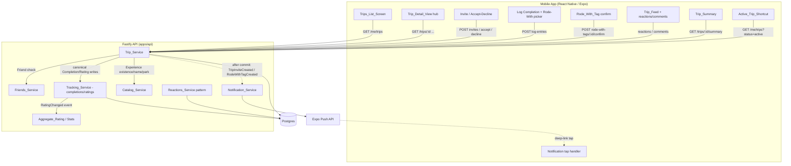
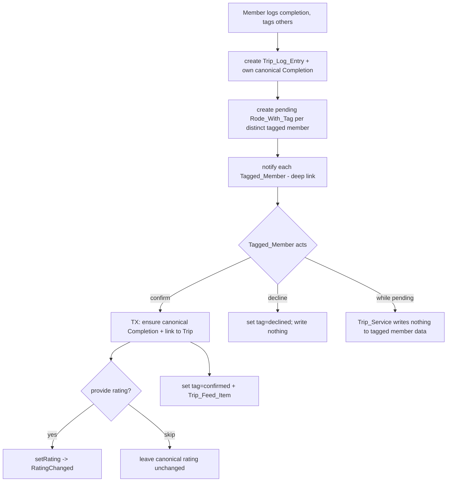

# Design Document

## Overview

The Trips feature adds shared, multi-person Walt Disney World visits to the Disney World Tracker.
A `Trip` groups a set of Friends around a named visit with a start/end date, a shared `Planned_List`,
a single `Trip_Activity` surface — a reverse-chronological feed with reactions and comments that also
hosts logging Completions (the `Shared_Log`'s `Trip_Log_Entries` presented inline) — and a derived
`Trip_Summary`.

The feature is delivered as a new backend service — `Trip_Service` — plus a set of mobile screens and a
bottom-tab navigation change. It deliberately **reuses** existing systems rather than duplicating them:

- **Auth_Service** for the authenticated session (`requireSession` → `request.userId`) and Profiles.
- **Friends_Service** for the "must be a Friend to invite" rule and the accept/decline invite pattern.
- **Tracking_Service** for canonical `Completions`, `Ratings`, and `Notes`. A Trip **references** a
  User's single canonical Rating rather than copying it, so a Rating edited through a Trip updates the
  catalog, personal stats, aggregate ratings, and the leaderboard everywhere at once.
- **Catalog** for `Experiences` and their `Park`.
- **Stats_Service / Aggregate_Rating** which already recompute off the `RatingChanged` event the
  Tracking_Service emits — so a Trip-originated Rating change propagates through the identical path.
- **Notification_Service / Push_Service** for fire-and-forget push with a deep-link target.
- **Reactions_Service** pattern for reactions (a new `trip_reactions` table modeled on `share_reactions`).

The standout mechanic is the **confirmable "rode with" tag**. When a Trip_Member logs a Completion
during a Trip they may tag other Members. Tagging never silently writes to another User's data: each
`Rode_With_Tag` starts `pending`, the Tagged_Member is notified, and only on **confirmation** does the
completion trickle down into the tagged Member's canonical Tracking data (with an optional canonical
Rating add/update). This confirm-before-write invariant is the security core of the feature.

### Guiding constraints from the codebase

The design follows patterns already established in the repository so the feature reads as a natural
extension:

- **Backend** is a Fastify + TypeScript monolith (`apps/api`) organized as
  `src/services/{name}/{repo.ts,routes.ts}` plus focused pure-logic modules. Dependencies are
  constructor-injected through factory functions (`createXRepo(pool)`), assembled in
  `composeServices.ts`, and registered in `server.ts` behind a per-service option block. Every route
  authenticates through the shared `requireSession` pre-handler that assigns `request.userId`.
- **Validation** lives in `@dwt/shared` as Zod primitives and DTOs so the API and the mobile client
  cannot drift. Errors are thrown as `AppError(code, message, { field })` where `code` is a member of
  the closed `ErrorCode` union in `packages/shared/src/errors.ts`, mapped to an HTTP status by
  `errorCodeToHttpStatus`.
- **Persistence** is Postgres with sequentially numbered SQL migrations
  (`apps/api/migrations/000N_*.sql`) using `BEGIN/COMMIT`, `gen_random_uuid()`, `TIMESTAMPTZ`, CHECK
  constraints, and `ON DELETE CASCADE`. The next migration is `0015_trips.sql`. Redis and BullMQ are
  available.
- **Cross-service Rating consistency** already exists: the Tracking_Service rating repo emits a
  `RatingChanged{experienceId, oldValue, newValue}` event on every UPSERT/DELETE, which drives the
  Aggregate_Rating (and Stats) update. The Trip_Service records Ratings **through the same rating repo**
  so the 60-second propagation (R12.3, R12.6) is free.
- **Fire-and-forget notifications** are dispatched on a background `(event) => void` port after the
  originating transaction commits (mirroring `emitShareDelivered` / `emitFriendRequestReceived` in
  `composeServices.ts`); the request returns success regardless of push outcome, and the handler never
  throws.
- **Mobile** is React Native / Expo with React Navigation. The authenticated tree is a root native
  stack (`RootStack`) hosting the bottom-tab navigator (`MainTabs`) plus detail screens as siblings so
  they present from the host stack regardless of the originating tab. Data fetching is TanStack Query;
  UI uses the shared themed components; deep links dispatch through `navigationRef`.

### Key design decisions

1. **Trip_Status is always derived, never stored.** A pure function
   `deriveTripStatus(startDate, endDate, wdwToday)` computes `upcoming | active | past` from the two
   stored dates and the current WDW calendar date (US Eastern). No status column exists, so it can never
   drift (R2.5). A small `wdwClock` utility yields "today" in `America/New_York`.

2. **A Trip references the canonical Rating; it never copies it.** No Trip table stores a rating value.
   Recording/updating a Rating through a Trip calls the existing Tracking_Service rating repo
   (`setRating`), which emits `RatingChanged` and propagates to catalog/stats/aggregate/leaderboard
   (R12.1–R12.3, R12.6). The Trip read paths join `ratings` live at display time (R12.4, R12.8).

3. **Confirm-before-write trickle-down.** A `Rode_With_Tag` is a state machine
   (`pending → confirmed | declined`). While `pending` the Trip_Service writes **nothing** to the
   Tagged_Member's Tracking data (R11.1). Confirmation performs the completion/rating writes inside one
   transaction and then transitions the tag; declining transitions the tag and writes nothing (R11.6).

4. **The confirmed `Rode_With_Tag` is the Trip-link for the tagged Member's completion.** Rather than a
   separate link table, a confirmed tag durably records "this Tagged_Member completed the log entry's
   Experience in the context of this Trip." This makes the Trip_Summary derivable (R14) and lets a
   departed Member's contributions be retained (R8.5).

5. **Authorization is a two-layer gate enforced in one place.** A shared `assertTripMember` /
   `assertTripOrganizer` helper (modeled on `assertOwnerOrFriend`) checks the authenticated session
   first, then membership/role. A non-member and a non-existent Trip collapse to the **same**
   `trip_forbidden` response so the endpoint cannot be used to probe Trip existence (R15.3, R15.4).

6. **Notifications reuse the existing Notification_Service.** Two new events —
   `TripInviteCreated` and `RodeWithTagCreated` — are handled exactly like `FriendRequestReceived`:
   gated by the master push preference, dispatched on a background port, carrying only a routing id for
   deep-linking (R6.6, R6.7, R10.8).

7. **The tab change relocates Stats under Profile.** `MainTabs` becomes Home, Catalog, **Trips**,
   Friends, Profile. The `StatsStack` (today a top-level tab) is re-hosted so it is reachable from the
   Profile tab, coordinating with the in-flight `stats-experience-redesign` (R17).

8. **The Shared_Log and Trip_Feed are one surface — `Trip_Activity` — on the client only.** The two
   overlapping screens are consolidated into a single activity feed that also hosts the "Log a Completion"
   control (R20). This is a **presentation-layer** change: the server data model, endpoints, and
   correctness properties are unchanged. `Trip_Log_Entry` remains the record that backs the `Trip_Summary`
   and the canonical trickle-down; a logged Completion still emits its `completion_logged` `Trip_Feed_Item`.
   The activity feed reads `GET /trips/:id/feed` for the mixed stream; the Completions filter narrows that
   same in-memory stream to `completion_logged` items on the client, so completions remain the identical
   interactive feed cards (keeping their reactions and comments — R20.5) rather than a second, non-reactive
   read. To make a completion item self-contained, the `getFeed` projection is extended to fold each
   completion item's Experience/Park/live canonical Rating and its Rode_With_Tag states into its `metadata`
   (additive; the DTO's `metadata` is already an open `Record`). `GET /trips/:id/log-entries` is retained
   as an API read (it still backs no other client surface once the Shared_Log screen is gone) but is no
   longer consumed by the mobile client. The standalone Shared_Log screen and its `TripSharedLog` route are
   removed (R20.1).

## Architecture

### System context



### Service placement

The `Trip_Service` lives at `apps/api/src/services/trips/` and is split into focused modules so the pure
domain logic (the PBT surface) is isolated from I/O:

```
services/trips/
  tripStatus.ts        # pure: deriveTripStatus(start, end, wdwToday)
  wdwClock.ts          # WDW_Current_Date in America/New_York
  permissions.ts       # pure: role→allowed-action matrix, Last_Organizer_Rule checks
  feedOrder.ts         # pure: deterministic reverse-chron ordering comparator
  summary.ts           # pure: derive Trip_Summary from log entries / tags / ratings
  tripsList.ts         # pure: group + order a User's trips by status
  repo.ts              # Postgres persistence + transactional trickle-down
  routes.ts            # Fastify plugin (all endpoints behind requireSession)
  authz.ts             # assertTripMember / assertTripOrganizer
  events.ts            # TripInviteCreated / RodeWithTagCreated notice types
  __tests__/           # unit + *.prop.test.ts property tests
```

Wiring is added to `composeServices.ts` (build `createTripRepo(pool)`, inject the existing rating repo
for canonical Rating writes, and wire the two background notification dispatches) and to `server.ts`
(a new `trips?: TripRoutesOptions` block registered like every other service).

### Rating consistency flow (reuses the existing RatingChanged path)

```mermaid
sequenceDiagram
  participant M as Trip_Member
  participant TS as Trip_Service
  participant RR as Tracking rating repo
  participant AGG as Aggregate/Stats
  M->>TS: log completion (rating=8) OR confirm tag (rating=8)
  TS->>RR: setRating(userId, experienceId, 8)
  RR->>RR: UPSERT ratings (single canonical row)
  RR-)AGG: RatingChanged{experienceId, old, new}
  Note over AGG: catalog/stats/aggregate/leaderboard update (<=60s, R12.3/R12.6)
  TS-->>M: 201/200 (Trip references canonical rating; no copy)
```

### Rode-With trickle-down (confirm-before-write)



## Components and Interfaces

### Pure domain modules (the PBT surface)

#### `tripStatus.ts`

```ts
export type TripStatus = 'upcoming' | 'active' | 'past';

/** Compare-by-calendar-date. All three are `YYYY-MM-DD` in the WDW zone. */
export function deriveTripStatus(
  startDate: string,   // Trip_Start_Date
  endDate: string,     // Trip_End_Date (>= startDate, enforced on write)
  wdwToday: string,    // WDW_Current_Date
): TripStatus;
```

Rules (R2.1–R2.4): `past` when `wdwToday > endDate`; `upcoming` when `wdwToday < startDate`; otherwise
`active` (covers `startDate <= wdwToday <= endDate`, including the single-day `start == end == today`
case, R2.3). Because it reads only the two dates and `wdwToday`, changing the dates changes the status on
the next read (R2.6) and status is never independently editable (R2.5).

#### `wdwClock.ts`

`wdwToday(now = new Date()): string` returns the current calendar date in `America/New_York` as
`YYYY-MM-DD` using `Intl.DateTimeFormat` with an explicit `timeZone`, so DST is handled by the platform.
Injectable for tests.

#### `permissions.ts`

```ts
export type TripRole = 'organizer' | 'member';
export type TripAction =
  | 'edit_settings' | 'send_invite' | 'cancel_invite' | 'remove_member'
  | 'promote' | 'demote' | 'delete_trip'                       // organizer-only
  | 'add_planned_item' | 'create_log_entry' | 'add_rode_with'
  | 'add_comment' | 'add_reaction' | 'leave_trip';             // member+organizer

export function can(role: TripRole, action: TripAction): boolean;      // R4.2–R4.4, R4.7
```

Also the Last_Organizer_Rule helpers, expressed as pure predicates over the current membership set so
they can be property-tested independently of the database:

```ts
export interface Membership { readonly userId: string; readonly role: TripRole; }

/** Would this mutation leave a non-empty Trip with zero organizers? (R5) */
export function violatesLastOrganizer(
  members: readonly Membership[],
  change:
    | { kind: 'demote'; userId: string }
    | { kind: 'remove'; userId: string }
    | { kind: 'leave'; userId: string },
): boolean;
```

The rule: after applying `change`, if one or more Members remain, at least one must be an `organizer`
(R5.1–R5.6). When the change empties the Trip (the sole Member leaves), it is permitted and the caller
deletes the Trip (R5.6, R5.7).

#### `feedOrder.ts`

`orderFeed(items)` sorts `Trip_Feed_Item`s by `createdAt` descending, breaking ties by `id` descending,
yielding a total, deterministic order (R13.3).

#### `summary.ts`

Pure derivation of the `Trip_Summary` from the Trip's log entries, confirmed rode-with tags, and the
referenced canonical Ratings:

```ts
export interface TripSuperlative {
  readonly id: string;
  readonly title: string;
  readonly description: string;
  readonly icon: string;
  readonly memberId?: string;
  readonly memberDisplayName?: string;
  readonly experienceName?: string;
  readonly value?: string | number;
}
export interface TripSummaryInput {
  readonly logEntries: readonly {
    memberId: string;
    experienceId: string;
    experienceName: string;
    park?: string;
    category?: string;
    imageUrl?: string | null;
  }[];
  readonly confirmedTags: readonly {
    memberId: string;
    experienceId: string;
    experienceName?: string;
    park?: string;
    category?: string;
    imageUrl?: string | null;
  }[];
  readonly ratings: readonly {
    memberId?: string;
    experienceId: string;
    value: number;
  }[]; // canonical, referenced
  readonly plannedItems?: readonly { experienceId: string }[];
}
export interface TripSummary {
  readonly distinctExperienceCount: number;                    // R14.1
  readonly topRated: readonly {
    experienceId: string;
    experienceName: string;
    meanRating: number;
    ratingCount: number;
    park?: string | null;
    category?: string | null;
    imageUrl?: string | null;
  }[]; // <=5, R14.2
  readonly perMember: readonly {
    memberId: string;
    logEntryCount: number;
    confirmedTagCount: number;
    totalCompletedCount?: number;
    topRatedExperienceName?: string | null;
    topRating?: number | null;
  }[]; // R14.4, R14.5, R14.12
  readonly plannedTotalCount: number;
  readonly plannedCompletedCount: number;
  readonly totalCompletionsCount?: number;
  readonly totalRatingsCount?: number;
  readonly parkBreakdown?: readonly { park: string; count: number }[]; // R14.9
  readonly categoryBreakdown?: readonly { category: string; count: number }[]; // R14.10
  readonly superlatives?: readonly TripSuperlative[]; // R14.11
}
export function deriveTripSummary(input: TripSummaryInput): TripSummary;
```

`distinctExperienceCount` counts each Experience completed in the Trip context (via a log entry **or** a
confirmed tag) at most once, `0` when none (R14.1). `topRated` ranks by descending mean of referenced
canonical Ratings, tie-broken by descending rating count then ascending Experience name, capped at 5
(R14.2); empty when no rated Experience exists (R14.3), and enriched with Park, Category, and image URL.
`perMember` counts each Member's log entries and confirmed contributed tags, `0` where none (R14.4, R14.5),
and optionally includes each Member's personal top-rated Experience (R14.12). Additive summary fields include
Park breakdown (R14.9), Category breakdown (R14.10), group superlatives (R14.11), and total completions count.
The shape exposes per-Trip aggregates and per-Member counts so a future trip-to-trip comparison can consume it (R14.7).

#### `tripsList.ts`

`groupTripsByStatus(trips, wdwToday)` returns the `active`, `upcoming`, `past` groups in that order,
ordering `active`/`upcoming` by ascending `startDate` and `past` by descending `endDate`, omitting empty
groups (R16.2–R16.5). Status for each Trip comes from `deriveTripStatus`.

### `Trip_Service` — key endpoints

All routes are registered behind `requireSession`; `assertTripMember` / `assertTripOrganizer` gate the
rest. `:id` params are UUIDs validated by the shared `uuidSchema`.

| Method | Path | Purpose | Requirements |
|---|---|---|---|
| `POST` | `/me/trips` | Create a Trip (creator → first organizer) | R1 |
| `GET` | `/me/trips` | List the caller's Trips grouped by status | R16, R19 |
| `GET` | `/trips/:id` | Trip detail (members, dates, derived status) | R15.1, R18 |
| `PATCH` | `/trips/:id` | Edit name/description/dates (organizer) | R3.1–R3.6, R3.9 |
| `DELETE` | `/trips/:id` | Delete Trip + associated entities (organizer) | R3.7–R3.10 |
| `POST` | `/trips/:id/invites` | Invite a Friend (organizer) | R6.1–R6.7 |
| `POST` | `/trips/:id/invites/:inviteId/cancel` | Cancel a pending invite (organizer) | R6.8, R6.9 |
| `POST` | `/me/trip-invites/:inviteId/accept` | Accept an invite addressed to caller | R7.1, R7.2, R7.6 |
| `POST` | `/me/trip-invites/:inviteId/decline` | Decline an invite addressed to caller | R7.3–R7.5 |
| `GET` | `/me/trip-invites/:inviteId` | Read an invite for the deep-link target | R7.7–R7.9 |
| `POST` | `/trips/:id/members/:userId/promote` | Promote member → organizer | R4.5, R4.8 |
| `POST` | `/trips/:id/members/:userId/demote` | Demote organizer → member | R4.6, R4.8, R5.2 |
| `DELETE` | `/trips/:id/members/:userId` | Remove a member (organizer) | R8.2, R8.3, R8.9, R5.4 |
| `POST` | `/trips/:id/leave` | Leave the Trip | R8.1, R8.8, R5.3, R5.6, R5.7 |
| `POST` | `/trips/:id/planned-items` | Add a Planned_Item | R9.1–R9.5 |
| `DELETE` | `/trips/:id/planned-items/:itemId` | Remove a Planned_Item | R9.6–R9.8 |
| `GET` | `/trips/:id/planned-items` | List Planned_Items (name/park/adder) | R9.9 |
| `POST` | `/trips/:id/log-entries` | Log a Completion + rode-with tags (+optional rating) | R10 |
| `GET` | `/trips/:id/log-entries` | Read logged Completions (retained API read; the mobile Completions filter now narrows the enriched feed client-side) | R15.1, R12.4, R12.8 |
| `POST` | `/me/rode-with-tags/:tagId/confirm` | Confirm a tag (optional rating) | R11.2–R11.5, R11.7–R11.10 |
| `POST` | `/me/rode-with-tags/:tagId/decline` | Decline a tag | R11.6, R11.7, R11.8 |
| `GET` | `/trips/:id/feed` | Read the Trip_Feed (ordered) | R13.1–R13.3, R15.1 |
| `POST` | `/trips/:id/feed/:targetType/:targetId/reactions` | Add a Trip_Reaction | R13.4–R13.6, R13.10 |
| `DELETE` | `/trips/:id/feed/:targetType/:targetId/reactions/:type` | Remove own reaction | R13.7 |
| `POST` | `/trips/:id/feed/:targetType/:targetId/comments` | Add a Trip_Comment | R13.8–R13.10 |
| `DELETE` | `/trips/:id/comments/:commentId` | Remove own comment | R13.11, R13.12 |
| `GET` | `/trips/:id/summary` | Read the derived Trip_Summary | R14 |

Create/edit request bodies are validated by shared Zod schemas (`tripCreateSchema`, `tripEditSchema`)
that enforce: `Trip_Name` present and 1–100 chars after trim (R1.4, R1.5, R3.4); `Trip_Description`
≤2000 chars (R1.6, R3.5); dates are valid calendar dates (R1.7); `end >= start` (R1.8, R3.6). The repo
enforces state that crosses tables (membership, friendship, duplicates, Last_Organizer_Rule) and throws
the mapped `AppError`.

### `repo.ts` — notable transactional operations

- **`createTrip`** inserts the `trips` row (name trimmed, R1.3), the creator's `organizer` membership
  (R1.1), and the `trip_created` feed item (R1.10) in one transaction, returning the Trip with its
  `Trip_Identifier`.
- **`sendInvite`** verifies (in one transaction) the target is a Friend of the organizer (via the
  canonical `friendships` pair, R6.2), is not already a Member (R6.4), and has no `pending` invite
  (R6.5); a partial unique index `(trip_id, invitee_id) WHERE state='pending'` is the race backstop.
- **`acceptInvite`** transitions `pending → accepted`, inserts the `member` membership idempotently
  (`ON CONFLICT DO NOTHING`, R7.2), and adds the `member_joined` feed item (R7.6).
- **`logCompletion`** in one transaction: ensures the logging Member's canonical Completion
  (`INSERT ... ON CONFLICT DO NOTHING`, R10.1, R10.2), inserts the `trip_log_entry`, validates and
  inserts one `pending` `rode_with_tag` per distinct tagged Member (rejecting self-tags R10.5,
  non-members R10.4, and duplicates R10.6), optionally calls the rating repo for the logging Member's
  Rating (R10.10), and adds the `completion_logged` feed item (R10.9). Tag notifications fire on the
  background port after commit (R10.8).
- **`confirmRodeWithTag`** in one transaction: asserts the caller is the Tagged_Member (R11.7) and the
  tag is `pending` (R11.8); ensures the tagged Member's canonical Completion linked to the Trip (R11.2,
  R11.3); optionally applies a canonical Rating via the rating repo when provided and valid (R11.4,
  R11.5, R11.9); sets the tag `confirmed` and writes no feed item — the originating `completion_logged`
  entry already records the rode-with (R11.10).
- **`leaveTrip` / `removeMember`** delete the membership, then cancel every `pending` rode-with tag the
  former Member created or is named in so they can no longer be confirmed (R8.6, R8.7), while retaining
  their log entries and confirmed tags (R8.5). If the departing Member was the sole Member, the Trip is
  deleted (R5.7). Canonical Tracking data is never touched (R3.10, R5.7, R8.4).

### Reactions and comments

`trip_reactions` is modeled on `share_reactions` (composite key gives "at most one reaction of a type per
target per Member", R13.4, R13.5; the reaction type is validated against a closed `Trip_Reaction`
vocabulary, R13.6). Comments are validated for 1–2000 chars after trim (R13.9) and are author-scoped for
deletion (R13.11, R13.12). The reaction/comment target is a `Trip_Feed_Item` or a `Trip_Log_Entry`,
identified by `(target_type, target_id)`; the repo verifies the target belongs to the Trip the caller is
authorized for (R13.10).

### Notification events (`events.ts` + Notification_Service handlers)

Two background dispatch notices mirror `FriendRequestReceivedNotice`:

```ts
export interface TripInviteCreatedNotice { inviteId: string; tripId: string; inviterId: string; inviteeId: string; }
export interface RodeWithTagCreatedNotice { tagId: string; tripLogEntryId: string; taggingMemberId: string; taggedMemberId: string; }
```

The Notification_Service gains `handleTripInviteCreated` (title = inviter display name, deep-link data
`{ tripInviteId }`, R6.6, R6.7) and `handleRodeWithTagCreated` (deep-link data
`{ rodeWithTagId, tripLogEntryId }`, R10.8). Both are gated by the master push preference, never throw,
and are wired in `composeServices.ts` exactly like the existing notice dispatches.

### Mobile components

- **Navigation change (R17):** `MainTabs` becomes Home, Catalog, **Trips**, Friends, Profile. A new
  `TripsStack` hosts `Trips_List_Screen` and `Trip_Detail_View` (with its section screens). The existing
  `StatsStack` is removed as a top-level tab and re-hosted so it is reachable from the Profile tab via a
  navigation control, preserving every previously reachable Stats screen (R17.3–R17.5). This coordinates
  with `stats-experience-redesign`.
- **`Trips_List_Screen`** reads `GET /me/trips`, renders the Active/Upcoming/Past groups (omitting empty
  ones), shows a loading indication under 10s, an error+retry on failure/timeout, and an empty state with
  a create control when the User is in zero Trips (R16).
- **`Trip_Detail_View`** is a hub with distinct controls for Planned_List, **Trip_Activity**, Members, and
  Summary (R18.1, R18.6). The Shared_Log and Trip_Feed no longer appear as separate destinations.
- **`Trip_Activity`** is the single feed screen (R20). It reads `GET /trips/:id/feed` for the mixed
  activity stream (each item carrying its reactions/comments and, for `completion_logged` items, the
  Experience, Park, live canonical Rating, and rode-with tag states), renders a "Log a Completion" control
  at its head, and offers an **All / Completions** filter (R20.4). The Completions filter narrows the same
  loaded stream to `completion_logged` items on the client, so a completion is the same interactive feed
  card — with its rode-with tag states, live Rating (R12.4, R12.8), reactions, and comments — in either
  view (R20.5, R13).
- **Log + Rode-With picker** lives at the head of `Trip_Activity` and builds a `POST /trips/:id/log-entries`
  body; the rode-with picker only lists current Members and excludes the logging Member (R10.4, R10.5).
- **Rode_With_Tag confirmation** offers confirm/decline and a rating add/update pre-filled with the
  current canonical Rating when one exists (R11.4, R11.5).
- **Deep-link tap handler** (via `navigationRef`) routes an invite notification to the invite
  accept/decline view and a rode-with notification to the tag confirm view, requiring auth first when
  unauthenticated, and falling back to the Trips_List_Screen with a "no longer available" message when
  the target is gone or the User is no longer a Member (R7.7–R7.9, R18.2–R18.5, R18.7).
- **`Active_Trip_Shortcut`** appears on surfaces outside the Trips tab while the User is in ≥1 `active`
  Trip; it opens the single active Trip directly or presents a chooser for several (R19).

## Data Models

### Existing tables reused (unchanged)

`users`, `profiles`, `experiences`, `friendships`, `completions`, `ratings`, `notes` are used as-is. Trip
Completions and Ratings are the **same** canonical rows in `completions` / `ratings` (R12.1, R3.10, R8.4).

### New enum — `Trip_Reaction` vocabulary

Added to `packages/shared/src/enums.ts` (mirrors `SHARE_REACTION_VALUES`):

```ts
export const TRIP_REACTION_VALUES = ['like', 'love', 'celebrate', 'wow'] as const;
export type TripReactionValue = (typeof TRIP_REACTION_VALUES)[number];
```

with a matching `tripReactionValueSchema = z.enum(TRIP_REACTION_VALUES)` primitive.

### New migration `0015_trips.sql`

```sql
BEGIN;

-- trips: name trimmed 1..100 and description <=2000 enforced at the app layer;
-- DB CHECKs are defense in depth. end_date >= start_date (R1.8, R3.6). No
-- status column: Trip_Status is always derived (R2.5).
CREATE TABLE trips (
    id           UUID        PRIMARY KEY DEFAULT gen_random_uuid(),
    creator_id   UUID        NOT NULL REFERENCES users(id) ON DELETE CASCADE,
    name         TEXT        NOT NULL,
    description  TEXT        NOT NULL DEFAULT '',
    start_date   DATE        NOT NULL,
    end_date     DATE        NOT NULL,
    created_at   TIMESTAMPTZ NOT NULL DEFAULT now(),
    updated_at   TIMESTAMPTZ NOT NULL DEFAULT now(),
    CONSTRAINT trips_name_length_chk       CHECK (char_length(name) BETWEEN 1 AND 100),
    CONSTRAINT trips_description_length_chk CHECK (char_length(description) BETWEEN 0 AND 2000),
    CONSTRAINT trips_date_order_chk         CHECK (end_date >= start_date)
);

-- trip_memberships: one role per (trip, user) (R4.1).
CREATE TABLE trip_memberships (
    trip_id    UUID        NOT NULL REFERENCES trips(id) ON DELETE CASCADE,
    user_id    UUID        NOT NULL REFERENCES users(id) ON DELETE CASCADE,
    role       TEXT        NOT NULL,
    joined_at  TIMESTAMPTZ NOT NULL DEFAULT now(),
    PRIMARY KEY (trip_id, user_id),
    CONSTRAINT trip_memberships_role_chk CHECK (role IN ('organizer','member'))
);
CREATE INDEX trip_memberships_user_idx ON trip_memberships(user_id);

-- trip_invites: at most one PENDING invite per (trip, invitee) (R6.5);
-- terminal (accepted/declined/cancelled) invites do not block re-invite (R6.8).
CREATE TABLE trip_invites (
    id          UUID        PRIMARY KEY DEFAULT gen_random_uuid(),
    trip_id     UUID        NOT NULL REFERENCES trips(id) ON DELETE CASCADE,
    inviter_id  UUID        NOT NULL REFERENCES users(id) ON DELETE CASCADE,
    invitee_id  UUID        NOT NULL REFERENCES users(id) ON DELETE CASCADE,
    state       TEXT        NOT NULL DEFAULT 'pending',
    created_at  TIMESTAMPTZ NOT NULL DEFAULT now(),
    updated_at  TIMESTAMPTZ NOT NULL DEFAULT now(),
    CONSTRAINT trip_invites_state_chk CHECK (state IN ('pending','accepted','declined','cancelled'))
);
CREATE UNIQUE INDEX trip_invites_one_pending_idx
    ON trip_invites(trip_id, invitee_id) WHERE state = 'pending';
CREATE INDEX trip_invites_invitee_idx ON trip_invites(invitee_id);

-- planned_items: an Experience may appear more than once per Trip (R9.3);
-- adder recorded (R9.1). NOTE: the original `planned_items_unique
-- UNIQUE (trip_id, experience_id)` constraint shown below was dropped in
-- migration 0019 so the same Experience can be planned multiple times (e.g.
-- across days); it is retained here only to document the initial 0015 shape.
CREATE TABLE planned_items (
    id             UUID        PRIMARY KEY DEFAULT gen_random_uuid(),
    trip_id        UUID        NOT NULL REFERENCES trips(id) ON DELETE CASCADE,
    experience_id  UUID        NOT NULL REFERENCES experiences(id),
    added_by       UUID        NOT NULL REFERENCES users(id) ON DELETE CASCADE,
    created_at     TIMESTAMPTZ NOT NULL DEFAULT now()
    -- CONSTRAINT planned_items_unique UNIQUE (trip_id, experience_id)  -- dropped in 0019
);
CREATE INDEX planned_items_trip_idx ON planned_items(trip_id);

-- trip_log_entries: references the logging member's canonical completion
-- (member_id, experience_id) -> completions; linked to the Trip (R10.1, R10.2).
CREATE TABLE trip_log_entries (
    id             UUID        PRIMARY KEY DEFAULT gen_random_uuid(),
    trip_id        UUID        NOT NULL REFERENCES trips(id) ON DELETE CASCADE,
    member_id      UUID        NOT NULL REFERENCES users(id) ON DELETE CASCADE,
    experience_id  UUID        NOT NULL REFERENCES experiences(id),
    created_at     TIMESTAMPTZ NOT NULL DEFAULT now()
);
CREATE INDEX trip_log_entries_trip_idx ON trip_log_entries(trip_id);

-- rode_with_tags: confirm-before-write state machine; a confirmed tag is the
-- durable link of the tagged member's completion to the Trip (R11, R8.5).
CREATE TABLE rode_with_tags (
    id                UUID        PRIMARY KEY DEFAULT gen_random_uuid(),
    log_entry_id      UUID        NOT NULL REFERENCES trip_log_entries(id) ON DELETE CASCADE,
    tagged_member_id  UUID        NOT NULL REFERENCES users(id) ON DELETE CASCADE,
    state             TEXT        NOT NULL DEFAULT 'pending',
    created_at        TIMESTAMPTZ NOT NULL DEFAULT now(),
    updated_at        TIMESTAMPTZ NOT NULL DEFAULT now(),
    CONSTRAINT rode_with_tags_state_chk CHECK (state IN ('pending','confirmed','declined','cancelled')),
    CONSTRAINT rode_with_tags_one_per_member UNIQUE (log_entry_id, tagged_member_id)
);
CREATE INDEX rode_with_tags_tagged_member_idx ON rode_with_tags(tagged_member_id);

-- trip_feed_items: reverse-chron feed; deterministic tie-break by (created_at, id) (R13.3).
CREATE TABLE trip_feed_items (
    id          UUID        PRIMARY KEY DEFAULT gen_random_uuid(),
    trip_id     UUID        NOT NULL REFERENCES trips(id) ON DELETE CASCADE,
    type        TEXT        NOT NULL,
    actor_id    UUID        NOT NULL REFERENCES users(id) ON DELETE CASCADE,
    metadata    JSONB       NOT NULL DEFAULT '{}'::jsonb,
    created_at  TIMESTAMPTZ NOT NULL DEFAULT now(),
    CONSTRAINT trip_feed_items_type_chk CHECK (type IN (
        'trip_created','member_joined','completion_logged','rating_recorded'
    ))
);
CREATE INDEX trip_feed_items_trip_order_idx ON trip_feed_items(trip_id, created_at DESC, id DESC);

-- trip_reactions: at most one reaction of a type per (target, member) (R13.4, R13.5).
CREATE TABLE trip_reactions (
    trip_id      UUID        NOT NULL REFERENCES trips(id) ON DELETE CASCADE,
    target_type  TEXT        NOT NULL,
    target_id    UUID        NOT NULL,
    member_id    UUID        NOT NULL REFERENCES users(id) ON DELETE CASCADE,
    reaction     TEXT        NOT NULL,
    created_at   TIMESTAMPTZ NOT NULL DEFAULT now(),
    PRIMARY KEY (target_type, target_id, member_id, reaction),
    CONSTRAINT trip_reactions_target_chk   CHECK (target_type IN ('feed_item','log_entry')),
    CONSTRAINT trip_reactions_value_chk    CHECK (reaction IN ('like','love','celebrate','wow'))
);
CREATE INDEX trip_reactions_target_idx ON trip_reactions(target_type, target_id);

-- trip_comments: 1..2000 chars after trim enforced at the app layer (R13.9).
CREATE TABLE trip_comments (
    id           UUID        PRIMARY KEY DEFAULT gen_random_uuid(),
    trip_id      UUID        NOT NULL REFERENCES trips(id) ON DELETE CASCADE,
    target_type  TEXT        NOT NULL,
    target_id    UUID        NOT NULL,
    author_id    UUID        NOT NULL REFERENCES users(id) ON DELETE CASCADE,
    body         TEXT        NOT NULL,
    created_at   TIMESTAMPTZ NOT NULL DEFAULT now(),
    CONSTRAINT trip_comments_target_chk CHECK (target_type IN ('feed_item','log_entry')),
    CONSTRAINT trip_comments_body_length_chk CHECK (char_length(body) BETWEEN 1 AND 2000)
);
CREATE INDEX trip_comments_target_idx ON trip_comments(target_type, target_id);

COMMIT;
```

`DELETE FROM trips` cascades to every child table above via `ON DELETE CASCADE`, satisfying the
delete-together requirement (R3.7) while leaving `completions`/`ratings`/`notes` untouched (R3.10) because
those tables are not children of `trips`.

### New migration `0016_trip_resorts.sql`

Records the Resort(s) a Trip's party stayed at (Requirement 21). A Walt Disney World visit can span more
than one hotel (a "split stay"), so the association is many-to-many: a join table linking a Trip to one or
more canonical Catalog Resorts (the `resorts` rows from `0004_disney_sources.sql`). Strictly additive — one
new table and one index; no existing table, column, or constraint is touched. The Trip_Resort_Stay
references Resorts and never copies them (R21.6), so a later Catalog change is reflected wherever the stay
is displayed.

```sql
BEGIN;

-- trip_resorts: the Resort(s) a Trip's party stayed at (R21.1). The composite
-- primary key guarantees at most one link per (trip, resort) (R21.2). The trip
-- FK cascades so a Trip delete fans out to its resort links (R21.3); the resort
-- FK deliberately has no ON DELETE, so a Resort can never be removed while a
-- Trip references it, preserving the recorded stay (R21.3).
CREATE TABLE trip_resorts (
    trip_id    UUID        NOT NULL REFERENCES trips(id) ON DELETE CASCADE,
    resort_id  UUID        NOT NULL REFERENCES resorts(id),
    created_at TIMESTAMPTZ NOT NULL DEFAULT now(),
    PRIMARY KEY (trip_id, resort_id)
);
CREATE INDEX trip_resorts_resort_idx ON trip_resorts(resort_id);

COMMIT;
```

The `Trip_Resort_Stay` is set through the existing create/edit endpoints: `POST /me/trips` and
`PATCH /trips/:id` accept an optional `resortIds` array (validated by the shared `tripResortIdsSchema`,
bounded by `TRIP_RESORT_LIMIT`). The Trip_Service validates every id references an active Catalog Resort
before writing (R21.4), collapses duplicates (R21.2), and on edit replaces the stay wholesale — an empty
array clears it, an omitted field leaves it unchanged (R21.5). Every `TripDTO` read (detail, create/edit
response, and the Trips list) carries the resulting `resorts` projection joined live from `trip_resorts`
(R21.1).

### New DTOs (`@dwt/shared`)

```ts
interface TripResortDTO { id: string; name: string; }   // R21.1: id + display name of a stayed-at Resort
interface TripDTO {
  id: string; name: string; description: string;
  startDate: string; endDate: string;             // YYYY-MM-DD
  status: TripStatus;                              // derived, never persisted
  createdAt: string;
  resorts: readonly TripResortDTO[];               // R21.1: the recorded Resort stay, ordered by name
}
interface TripMemberDTO { userId: string; displayName: string; avatarPreset: string | null; role: TripRole; }
interface TripInviteDTO { id: string; tripId: string; tripName: string; inviterDisplayName: string; state: 'pending'|'accepted'|'declined'|'cancelled'; }
interface PlannedItemDTO { id: string; experienceId: string; experienceName: string; park: Park; addedByDisplayName: string; }
interface TripLogEntryDTO {
  id: string; memberId: string; memberDisplayName: string;
  experienceId: string; experienceName: string;
  rating: number | null;                           // current canonical rating, or null unrated (R12.4, R12.8)
  rodeWith: readonly { taggedMemberId: string; state: string }[];
}
interface TripFeedItemDTO { id: string; type: string; actorDisplayName: string; createdAt: string; metadata: Record<string, unknown>; }
interface TripSummaryDTO {
  distinctExperienceCount: number;
  topRated: readonly { experienceId: string; experienceName: string; meanRating: number; ratingCount: number }[];
  perMember: readonly { memberId: string; displayName: string; logEntryCount: number; confirmedTagCount: number }[];
}
```

### New error codes (`packages/shared/src/errors.ts`)

Added to the closed `ERROR_CODES` union and `errorCodeToHttpStatus`:

| Code | HTTP | Meaning | Requirements |
|---|---|---|---|
| `trip_not_found` | 404 | Trip/invite/tag does not exist (owner-side, non-probing) | R3.9 |
| `trip_forbidden` | 403 | Caller is not a Member / not an Organizer / not the addressee | R3.3, R3.8, R4.7, R6.3, R7.4, R8.3, R11.7, R13.10, R15.2, R15.5, R15.6 |
| `trip_validation_failed` | 400 | Name/description/date/planned/tag/comment validation failed | R1.4–R1.8, R3.4–R3.6, R9.3–R9.5, R10.4–R10.6, R13.6, R13.9 |
| `trip_not_friend` | 400 | Invite target is not a Friend of the organizer | R6.2 |
| `trip_invite_duplicate` | 409 | Target is already a Member or has a pending invite | R6.4, R6.5 |
| `trip_invite_state_invalid` | 409 | Accept/decline/cancel of a non-pending invite | R7.5, R6.8 |
| `trip_last_organizer` | 409 | Demote/leave/remove would leave zero organizers | R5.2–R5.4 |
| `trip_role_invalid` | 400 | Promote an organizer / demote a member (no-op change) | R4.8 |
| `trip_planned_limit` | 400 | Planned_List already holds 500 items | R9.5 |
| `trip_tag_state_invalid` | 409 | Confirm/decline of a non-pending rode-with tag | R11.8 |

The `unauthorized` (401) code already exists and is returned by the session check before any Trip check
so an unauthenticated request never learns whether a Trip exists (R15.3).

## Correctness Properties

*A property is a characteristic or behavior that should hold true across all valid executions of a
system — essentially, a formal statement about what the system should do. Properties serve as the bridge
between human-readable specifications and machine-verifiable correctness guarantees.*

The properties below are derived from the prework analysis and consolidated to remove redundancy. They
target the pure and universal behaviors of the Trip_Service: status derivation, input validation, the
role/permission matrix, the Last_Organizer_Rule invariant, the canonical-tracking-preservation invariant,
the confirm-before-write trickle-down, the canonical-Rating reference, feed ordering, summary derivation,
and Trip authorization. UI navigation/state, cross-service propagation timing, and external-provider
side effects are covered by example, edge-case, and integration tests (see Testing Strategy), not by
properties.

### Property 1: Trip status is derived solely from its dates and the WDW date

*For any* Trip_Start_Date, Trip_End_Date (with `end >= start`), and WDW_Current_Date, `deriveTripStatus`
returns `upcoming` when the WDW date precedes the start, `past` when it follows the end, and `active`
otherwise (including the single-day case where start, end, and the WDW date are equal); the result depends
on nothing else, so recomputing after a date edit yields the status implied by the new dates.

**Validates: Requirements 2.1, 2.2, 2.3, 2.4, 2.5, 2.6**

### Property 2: Trip name/description/date input is validated identically on create and edit

*For any* create or edit input, the request is rejected without persisting or changing any field when a
required field is missing (create), the Trip_Name is empty after trimming or longer than 100 characters,
the Trip_Description exceeds 2000 characters, a date is not a valid calendar date, or the Trip_End_Date is
earlier than the Trip_Start_Date; otherwise it is accepted with the Trip_Name stored trimmed of leading
and trailing whitespace.

**Validates: Requirements 1.3, 1.4, 1.5, 1.6, 1.7, 1.8, 3.2, 3.4, 3.5, 3.6**

### Property 3: Creating a Trip establishes the creator as the sole organizer and returns its identity

*For any* valid creation request, the created Trip records the requester as the Trip_Creator, contains
exactly one Trip_Membership whose Trip_Role is `organizer` for that requester, stores the provided
Trip_Description, and returns a unique Trip_Identifier.

**Validates: Requirements 1.1, 1.2, 1.9**

### Property 4: Every originating event produces its matching Trip_Feed_Item

*For any* originating event — Trip creation, an invited User accepting, a Trip_Log_Entry being created, a
canonical Rating being recorded/updated through the Trip, or a Rode_With_Tag being confirmed — the
Trip_Service creates exactly one corresponding Trip_Feed_Item of the matching type referencing the acting
Trip_Member.

**Validates: Requirements 1.10, 7.6, 10.9, 11.10, 13.1**

### Property 5: Editing a Trip changes only the targeted fields

*For any* Trip and any valid edit touching a subset of `{name, description, start_date, end_date}`, a
subsequent read returns the updated values for the touched fields and identical values for every untouched
field.

**Validates: Requirements 3.1**

### Property 6: The role permission matrix is exactly organizer ⊇ member

*For any* Trip_Role and Trip_Action, an Organizer is permitted every action a Member is permitted plus the
Organizer-only actions (edit settings, send/cancel invites, remove members, promote, demote, delete),
while a Member (and any non-member) is denied every Organizer-only action; a denied action changes no Trip
data.

**Validates: Requirements 4.2, 4.3, 4.4, 4.7, 15.5**

### Property 7: Promotion and demotion set the target role exactly

*For any* Trip_Member, promoting a Member sets their Trip_Role to `organizer` and demoting an Organizer
(when permitted by the Last_Organizer_Rule) sets it to `member`; promoting an existing Organizer or
demoting an existing Member is rejected as a validation error with no role change.

**Validates: Requirements 4.5, 4.6, 4.8**

### Property 8: A non-empty Trip always retains at least one Organizer

*For any* membership set and any demote/remove/leave operation, the operation is rejected when it would
leave one or more remaining Trip_Members with zero Organizers, and is permitted otherwise; equivalently,
after every accepted role-changing operation a Trip with at least one Trip_Member has at least one
Organizer.

**Validates: Requirements 4.1, 5.1, 5.2, 5.3, 5.4, 5.5, 5.6**

### Property 9: Trip lifecycle never mutates canonical Tracking data

*For any* Trip and any Trip-lifecycle operation (delete the Trip, remove a Member, or a Member leaving),
every Trip_Member's canonical Completions, Ratings, and Notes in the Tracking_Service are exactly what they
were before the operation.

**Validates: Requirements 3.10, 8.4, 5.7**

### Property 10: Departure retains contributions and cancels pending tags

*For any* Trip_Member who leaves or is removed, their Trip_Log_Entries and confirmed Rode_With_Tags are
retained on the Trip, every `pending` Rode_With_Tag they created as Tagging_Member and every `pending`
Rode_With_Tag naming them as Tagged_Member is transitioned so it can no longer be confirmed, and when the
departing Member was the Trip's only Member the Trip and its associated entities are deleted.

**Validates: Requirements 8.1, 8.2, 8.5, 8.6, 8.7, 5.7**

### Property 11: Trip data access requires membership and does not disclose existence

*For any* authenticated User and any Trip read or Trip_Summary request, the Trip_Service returns the
requested data scoped to that Trip only when the User is a current Trip_Member, and otherwise denies the
request with an authorization error carrying no Trip data and making no change — and the denial for a Trip
the User is not a member of is byte-for-byte identical to the denial for a Trip that does not exist, so a
former Member and a stranger are both denied and neither can infer whether the Trip exists.

**Validates: Requirements 9.2, 10.7, 12.7, 13.10, 14.8, 15.1, 15.2, 15.4, 15.6**

### Property 12: The authenticated-session check precedes the membership check

*For any* Trip request lacking a valid unexpired session, the Trip_Service denies it with `unauthorized`
before evaluating the Trip_Member_Rule, disclosing nothing about the Trip's existence or the requester's
membership.

**Validates: Requirements 15.3**

### Property 13: Ownership-scoped actions are limited to the owning Trip_Member

*For any* action bound to a specific Trip_Member — accepting/declining a Trip_Invite (only the addressed
invitee), confirming/declining a Rode_With_Tag (only the Tagged_Member), removing a Planned_Item added by a
Member, or removing a Trip_Comment — a caller who is not that owner is rejected with an authorization error
and the target entity is unchanged.

**Validates: Requirements 7.4, 9.8, 11.7, 13.12**

### Property 14: A Trip_Invite follows the pending→terminal state machine

*For any* Trip_Invite, sending creates it in the `pending` state; accepting a `pending` invite addressed to
the caller sets it `accepted` and adds a `member` Trip_Membership (idempotently, never a duplicate);
declining sets it `declined` with no membership; cancelling sets it to a terminal state after which
acceptance is rejected while a fresh invite may be sent; and any accept/decline/cancel of a non-`pending`
invite is rejected with the invite unchanged.

**Validates: Requirements 6.1, 6.8, 7.1, 7.2, 7.3, 7.5**

### Property 15: Invites require the target to be a Friend of the organizer

*For any* invite request, the Trip_Service creates a `pending` Trip_Invite only when the target is a Friend
of the sending Organizer and is neither already a Trip_Member nor the holder of a `pending` invite;
otherwise it is rejected with no invite and no duplicate membership created.

**Validates: Requirements 6.2, 6.4, 6.5**

### Property 16: Planned_List add records the adder and permits duplicates; removal is by adder or organizer

*For any* Trip_Member adding a catalog Experience, a Planned_Item referencing that Experience and
recording the adding Member is created; adding an Experience already in the Planned_List creates an
additional Planned_Item (the same Experience may appear more than once, R9.3); and removing a
Planned_Item succeeds for the Member who added it or for any Organizer.

**Validates: Requirements 9.1, 9.3, 9.6, 9.7**

### Property 17: Read projections carry the required display fields

*For any* Planned_Item the read projection includes the referenced Experience's name, its Park, and the
adding Member's display name; and *for any* Shared_Log or Trip_Summary entry the projection shows the
current canonical Rating as a whole number 1–10 when the Trip_Member has one and an unrated indicator when
they do not.

**Validates: Requirements 9.9, 12.4, 12.8**

### Property 18: Logging a Completion is idempotent on the canonical Completion

*For any* Trip_Member logging an Experience against a Trip, the Trip_Service creates a Trip_Log_Entry
referencing that Member's canonical Completion, creating the canonical Completion when none exists and
reusing the existing one otherwise, and never creates a duplicate canonical Completion.

**Validates: Requirements 10.1, 10.2**

### Property 19: Rode_With_Tag creation is deduplicated and target-validated

*For any* Trip_Log_Entry, the Trip_Service creates at most one `pending` Rode_With_Tag per distinct tagged
Trip_Member, and rejects a tag that names the logging Member themselves, names a User who is not a
Trip_Member, or repeats a Tagged_Member within the same request.

**Validates: Requirements 10.3, 10.4, 10.5, 10.6**

### Property 20: A pending or declined Rode_With_Tag never writes the Tagged_Member's data

*For any* Rode_With_Tag that is `pending` or has been `declined`, the Tagged_Member's canonical
Completions, Ratings, and Notes are exactly what they were before the tag existed — no Completion, Rating,
or Note is created, modified, or linked on the Tagged_Member's behalf.

**Validates: Requirements 11.1, 11.6**

### Property 21: Confirming a Rode_With_Tag links the completion and honors the rating choice

*For any* `pending` Rode_With_Tag confirmed by its Tagged_Member, the Trip_Service ensures the
Tagged_Member has a canonical Completion for the referenced Experience linked to the Trip — creating it
when absent and leaving an existing one (and its Rating) unaltered — sets a provided valid Rating as the
Tagged_Member's single canonical Rating, leaves the canonical Rating unchanged when the update is skipped,
and transitions the tag to `confirmed`.

**Validates: Requirements 11.2, 11.3, 11.4, 11.5**

### Property 22: Ratings recorded through a Trip round-trip to the single canonical Rating

*For any* Trip_Member and Experience, recording or updating a whole-number 1–10 Rating through a Trip
persists exactly that value as the Member's single canonical Rating in the Tracking_Service, so a
subsequent read returns the same value from one canonical row, and no Trip-local copy of the Rating is
stored.

**Validates: Requirements 10.10, 12.1, 12.2**

### Property 23: Trip_Reactions and Trip_Comments follow an add/remove lifecycle with at-most-one reaction per type

*For any* Trip_Member and target Trip_Feed_Item or Trip_Log_Entry, adding a supported Trip_Reaction of a
type persists exactly one reaction for that (member, target, type) and re-adding the same type is
idempotent, removing a reaction the Member added deletes it, adding a valid Trip_Comment (1–2000 characters
after trimming) persists it associated with the author, and removing a Trip_Comment the Member authored
deletes it.

**Validates: Requirements 13.4, 13.5, 13.7, 13.8, 13.9, 13.11**

### Property 24: The Trip_Feed is totally ordered reverse-chronologically with a deterministic tie-break

*For any* set of Trip_Feed_Items, the displayed order is by descending creation timestamp, breaking ties
between identical timestamps by descending Trip_Feed_Item identifier, producing a single deterministic
ordering.

**Validates: Requirements 13.3**

### Property 25: The Trip_Summary is a faithful derivation of the Trip's activity

*For any* Trip's Trip_Log_Entries, confirmed Rode_With_Tags, and referenced canonical Ratings, the
Trip_Summary reports the count of distinct Experiences completed in the Trip context (each counted at most
once, `0` when none), at most 5 top-rated Experiences ranked by descending mean of referenced canonical
Ratings then descending rating count then ascending Experience name, per-Member counts of created
Trip_Log_Entries and contributed confirmed Rode_With_Tags (`0` where none), park and category breakdowns,
group superlatives, and member favorite ratings; recomputing from the same inputs yields the same result.

**Validates: Requirements 14.1, 14.2, 14.4, 14.5, 14.6, 14.9, 14.10, 14.11, 14.12**

### Property 26: The Trips list shows exactly the caller's Trips grouped and ordered by status

*For any* set of Trips and memberships, the Trips_List_Screen data includes exactly the Trips on which the
caller is a Trip_Member, partitioned into the Active, Upcoming, and Past groups in that order, with the
Active and Upcoming groups ordered by ascending Trip_Start_Date, the Past group ordered by descending
Trip_End_Date, and any empty status group omitted.

**Validates: Requirements 16.1, 16.2, 16.3, 16.4, 16.5**

## Error Handling

All errors are thrown as `AppError(code, message, { field? })` with `code` drawn from the closed
`ErrorCode` union and mapped to an HTTP status by `errorCodeToHttpStatus`, so the Trip_Service surfaces the
same uniform `{ error: { code, message, field? } }` envelope as every other service. New codes are listed
in the Data Models section.

- **Validation** (missing/oversized/malformed input) is enforced first by the shared Zod schemas at the
  route boundary and again by DB CHECK constraints as defense in depth, surfacing `trip_validation_failed`
  (or the specific `trip_planned_limit`) with a `field` pointer.
- **Authorization** is layered: `requireSession` yields `unauthorized` (401) for a missing/expired session
  before any Trip lookup (R15.3); then `assertTripMember`/`assertTripOrganizer` yield `trip_forbidden`
  (403). A Trip that does not exist and a Trip the caller cannot access both return the identical
  `trip_forbidden` response so existence cannot be probed (R15.4); owner-side not-found (`trip_not_found`,
  404) is reserved for edit/delete of a genuinely absent Trip surfaced to an authorized-context caller
  (R3.9).
- **State conflicts** (accept/cancel a non-pending invite, confirm/decline a non-pending tag, last
  organizer, no-op role change, duplicate invite) return the specific 409/400 codes
  (`trip_invite_state_invalid`, `trip_tag_state_invalid`, `trip_last_organizer`, `trip_role_invalid`,
  `trip_invite_duplicate`) and leave all data unchanged.
- **Concurrency** is handled by performing check-and-write inside a single transaction and relying on the
  partial unique index for pending invites and the composite keys for memberships/tags/reactions; a race
  that trips a unique violation is translated to the same domain code the pre-check would have produced.
- **Notifications never affect the response.** Invite and rode-with notifications are dispatched on a
  background `(event) => void` port after the originating transaction commits; the handler swallows and
  logs every failure so `POST` returns success regardless of push outcome (R6.6, R6.7, R10.8).
- **Rating writes** delegate to the Tracking_Service rating repo, whose existing `rating_out_of_range`
  path and post-commit `RatingChanged` emission are reused unchanged; a rejected Rating leaves the
  canonical Rating untouched (R11.9, R12.5).

## Testing Strategy

**Dual approach.** Unit tests cover specific examples, edge cases, and error conditions; property-based
tests cover the universal behaviors enumerated in Correctness Properties. Both are necessary — unit tests
catch concrete regressions, property tests verify general correctness across the input space.

**Property-based testing.** PBT applies to this feature because the Trip_Service centers on pure,
universally-quantified logic (status derivation, the permission matrix, the Last_Organizer_Rule invariant,
feed ordering, summary derivation, trips-list grouping, invite/tag state machines, and the
confirm-before-write invariant). Tests use **fast-check** (already the repo's PBT library, e.g.
`services/aggregate/__tests__/aggregate.prop.test.ts`), placed in `services/trips/__tests__/*.prop.test.ts`.

- The pure modules (`tripStatus`, `permissions`, `feedOrder`, `summary`, `tripsList`) are tested directly
  as functions — no I/O — which keeps 100+ iterations cheap.
- The stateful properties (invite/membership/tag lifecycles, Last_Organizer invariant, confirm-before-write
  and tracking-preservation invariants, authorization) are tested against an **in-memory model** of the
  repo the same way `aggregate.prop.test.ts` drives a state-machine arbitrary against a reference model, so
  they run fast and deterministically; a thin set of integration tests then pins the SQL repo to the same
  behavior on a sandbox Postgres.
- Each property test runs a minimum of **100 iterations** and is tagged with a comment referencing its
  design property in the form: **Feature: trips, Property {number}: {property_text}**.
- Each of Properties 1–26 is implemented by a single property-based test.

**Unit and edge-case tests** cover: description/name length boundaries (R1.6, R3.5), the 500-item
Planned_List cap (R9.5), unknown-Experience references (R9.4), non-pending invite/tag transitions (R7.5,
R11.8), invalid rating values on confirm and through the Trip (R11.9, R12.5), duplicate tags in one request
(R10.6), and the empty-summary state (R14.3).

**Integration tests** (1–3 representative examples each, not property tests) cover the external and
cross-service behaviors: the `ON DELETE CASCADE` delete of a Trip and its children while canonical tracking
survives (R3.7); the in-app + push notification dispatch with deep-link targets for invites and rode-with
tags (R6.6, R6.7, R10.8); feed-item immediacy (R13.2); and Rating propagation to stats/catalog/aggregate
via `RatingChanged` within 60 seconds and counting a Trip completion the same as a non-Trip one (R12.3,
R12.6).

**Mobile tests** (React Native Testing Library / navigation tests, mirroring
`apps/mobile/src/__tests__/navigation.test.tsx`) cover the UI navigation and state criteria that are not
properties: the five-tab order with Stats relocated under Profile and every prior Stats screen still
reachable (R17), the Trip_Detail_View section controls and deep-link routing including the auth-required
and stale-target fallbacks (R18), the Trips_List_Screen loading/error/empty states and navigation (R16.6–
R16.10), invite deep-link accept/decline surfaces (R7.7–R7.9), and the Active_Trip_Shortcut visibility and
single/multiple-active behavior (R19).

**Smoke check.** A shape assertion confirms the `TripSummaryDTO` exposes per-Trip aggregate counts and
per-Member contribution counts so a future trip-to-trip comparison has the data it needs (R14.7).
