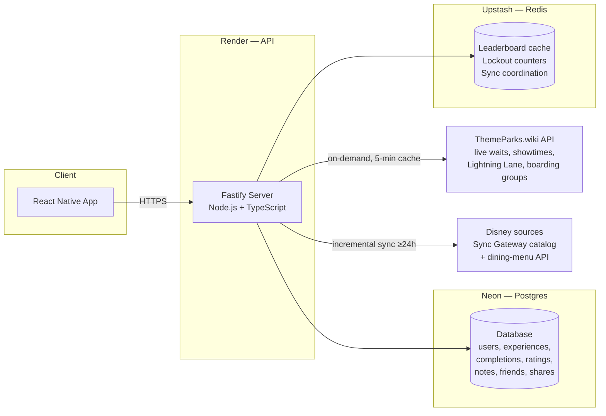
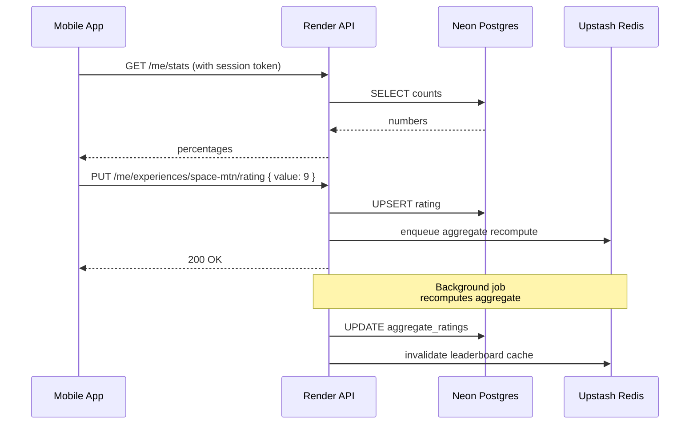

# Hosting Plan

This document explains how the Disney World Tracker backend will be hosted using free-tier services. It is meant for a side-project budget — every piece below has a free tier that does not expire, with no credit card surprises at month 13.

The full architecture from `design.md` calls for three self-hosted moving pieces:

1. A long-running API server (Node.js + Fastify)
2. A relational database (PostgreSQL)
3. A fast in-memory store (Redis)

(Profile avatars are a fixed set of illustrations bundled with the mobile app and referenced by id, so no object storage is needed.)

We map each one to a managed service that gives us a real free tier. Two external data sources sit behind the API and need no hosting of our own — they're consumed over HTTPS server-side (see [Data sources](#data-sources)).

## At a Glance

| Concern | Service | Free tier limit | What happens when exceeded |
| --- | --- | --- | --- |
| API server | **Render** (Web Service) | 750 instance hours/month, sleeps after 15 min idle | First request after sleep takes 30-60s; upgrade to paid ($7/mo) for always-on |
| PostgreSQL | **Neon** | 0.5 GB storage, 1 project, autoscale to 0 when idle | Upgrade plan or migrate; data is portable |
| Redis | **Upstash** | 10,000 commands/day, 256 MB storage, global edge | Per-request pricing kicks in (very cheap); or swap to a different provider |
| Live data source | **ThemeParks.wiki** API | n/a (already free) | Public, no key required | n/a |
| Static catalog source | **Disney** (Sync Gateway + dining-menu API) | n/a (Disney's own endpoints) | Requires Sync Gateway credentials; rate-limited by Disney's edge |

Total monthly cost while the app is small: **$0**. No payment method required to start. The Disney Sync Gateway needs HTTP Basic credentials (a required secret on Render), but there's no fee — it's Disney's own infrastructure.

## Architecture With Hosting Overlaid



Everything talks over HTTPS. The mobile app only ever knows about one URL — the Render API endpoint. Render, Neon, Upstash, and both data sources are all reached server-side. The two external sources are split by change rate: high-change **live** data from ThemeParks.wiki (fetched on demand, cached briefly in Redis) and low-change **static catalog** data from Disney (synced incrementally, no more than once per 24h).

---

## Render — API Hosting

### What it does

Render is a platform that takes a GitHub repository, builds it, and runs it as a long-lived process behind an HTTPS URL. We use it for the Fastify API server.

### How it works

1. You create a Render account and connect your GitHub repo.
2. The service is defined as code in [`render.yaml`](../render.yaml) (a Render Blueprint) — you don't hand-configure it in the dashboard. It pins the runtime, region, build command, start command, health check, and the env vars (secrets are `sync: false`, set once in the dashboard).
3. The build command installs the workspace, builds the shared package, compiles the API, and applies pending migrations in one chain: `npm ci --include=dev && npm run build:shared && npm run build --workspace apps/api && npm run migrate --workspace apps/api`. Migrations live in the build step because the free tier has no separate pre-deploy hook — they're idempotent, so already-applied files are skipped. The start command is `npm start --workspace apps/api`.
4. Render builds a container, deploys it, and gives you a URL like `https://dwt-api.onrender.com`. The health check is `GET /health`.
5. Every push to the **`develop`** branch (the branch pinned in `render.yaml`) triggers an automatic rebuild and deploy.

### The free tier

- **750 instance hours/month**, which is enough for one service running 24/7.
- **Sleeps after 15 minutes of no traffic.** When a request comes in after a quiet period, Render starts the container back up. That first request takes 30-60 seconds to respond. Subsequent requests are fast.
- **512 MB RAM, shared CPU.** Plenty for a Fastify process serving JSON.
- **HTTPS and a custom domain are included.**

### What this means for the design

The `Catalog_Sync` job doesn't fit nicely on a sleeping free instance, so on the hosted deployment it is **not run unattended** — the scheduler isn't started in the boot path, and a cold read only opportunistically refreshes an already-seeded catalog. Instead, the catalog is seeded and refreshed **manually from your machine** against the hosted database:

```bash
npm run migrate:cloud --workspace apps/api   # ensure schema is current
npm run sync:cloud --workspace apps/api      # bootstrap/refresh the hosted catalog
```

`sync:cloud` reads `apps/api/.env.dev` (the hosted `DATABASE_URL` + Disney credentials) and writes into the same Neon database the deployed API reads. The first run is a full bootstrap; later runs are incremental. This keeps the free instance simple (no extra cron service, no `/internal/sync` endpoint to secure) at the cost of the catalog refresh being a deliberate manual step. Live data needs no sync at all — it's fetched on demand from ThemeParks.wiki and cached in Redis.

### Trade-offs

| Pro | Con |
| --- | --- |
| Truly free, no credit card | Cold-start delay on first request after idle |
| Simple GitHub-driven deploys | One service per free instance |
| HTTPS automatic | Build minutes are limited |

### When to upgrade

The first paid tier is **$7/month** for an always-on instance. Worth it as soon as you have any real users; the cold start otherwise frustrates anyone opening the app for the first time that day.

### Keeping it warm for free (scheduled pinger)

You can hide the cold start without paying by pinging the service on a schedule so it never goes idle long enough to sleep. This is the recommended free-tier stopgap until the $7 always-on tier is worth it.

**How it works.** A free external scheduler hits `GET /health` (a static `{ status: 'ok' }` route — no database, no auth, cheap) more often than Render's 15-minute idle window. Every ~10 minutes keeps the container awake, so real requests never pay the 30-60s wake.

**Stay inside the 750 instance-hours.** Free instance-hours are only consumed while the service is awake. Pinging 24/7 keeps it awake ~744 hours in a 31-day month — under the 750 cap, but with only ~6 hours of margin, and it uses nearly the whole budget so you can't also run a second always-on free service.

**Day-only schedule (recommended).** Restrict the pinger to waking hours (e.g. **7am-2am**) and let the service sleep overnight (**2am-7am**). That drops usage to ~589 hours/month — a comfortable cushion against redeploy restarts and clock drift — at the cost of the first request before 7am eating a cold start. For a hobby app this window is genuinely quiet, so it's a good trade.

- **Tool:** [cron-job.org](https://cron-job.org) free plan supports per-hour scheduling, which fits the day-only window. UptimeRobot's free tier pings but doesn't do time-windowed schedules as cleanly.
- **Timezone:** the schedule runs in whatever timezone you configure it in — set it to your users' local time, not UTC, or the overnight window lands in the wrong place.
- **Use the `HEAD` method, not `GET`.** cron-job.org aborts any response larger than **8 KB** with `Failed (output too large)` and, after enough consecutive failures, auto-disables the job (it won't restart itself — you have to re-enable it manually). A healthy `/health` is ~15 bytes so `GET` is normally fine, but Render sits behind Cloudflare: when the service is cold, mid-deploy, or crashed, Cloudflare returns a **branded error/interstitial HTML page that exceeds 8 KB**. Those show up as fast (~200-600 ms) failures rather than the 30-60 s of a real cold start — the tell that the reply came from the edge, not your app. A `HEAD` request has no body by spec (Fastify auto-registers `HEAD` for the `GET /health` route), so it can never trip the 8 KB limit even during an outage, while still waking the container.
- **The pinger is not a health monitor.** With `HEAD` it reports success as long as *something* answers, even Cloudflare's error page while your app is down — that's correct for a keep-alive job, whose only purpose is to prevent sleep. If you want real uptime alerts, set up a separate monitor; don't overload this job with that responsibility.

**Do NOT ping the database to kill the Neon wake.** It's tempting to point a second ping at an endpoint that runs `SELECT 1` so Neon never scales to zero. Don't. Neon's Free plan includes **100 CU-hours per project per month** (~400 hours at the default 0.25 CU). Keeping Neon warm ~19 hours/day is ~580 hours of active compute — well past the 400-hour ceiling. When you hit the 100 CU-hour cap, **Neon suspends your compute until the next month resets**, taking the database offline. That's far worse than a 1-3s wake. Let Neon scale to zero; real daytime traffic keeps it warm on its own between the 5-minute idle gaps, and the occasional first-query wake is a couple of seconds, not a lockout. If you truly want zero database delay for free, the only path is self-hosting Postgres on an always-on VM (see [Honest Caveats](#honest-caveats)) — a Postgres you run yourself never scales to zero, but you own the ops.

---

## Neon — PostgreSQL

### What it does

Neon is a managed Postgres provider built around the idea that databases should scale to zero when nobody's using them. We use it as the single source of truth for users, experiences, completions, ratings, notes, friend graph, and shares.

### How it works

1. You create a Neon project. Neon hands you a connection string.
2. You drop the connection string into Render's environment variables.
3. The Fastify server connects exactly like it would to any other Postgres database.
4. When the app sits idle, Neon pauses the database and stops billing CPU. The next query wakes it up in a couple of seconds.

### The free tier

- **0.5 GB storage** — enough for tens of thousands of users at this app's data shape (text-heavy but small per row).
- **Always-on branch + scale-to-zero compute.** You always have a primary, but it pauses when idle.
- **Postgres extensions available**, including `citext` (case-insensitive text — the design uses this for emails) and `pg_trgm` (substring search — useful for user search).
- **Connection pooling included** via PgBouncer, which matters because Render dynos and Postgres connection counts are otherwise a fight.

### What this means for the design

The schema in `design.md` (users, experiences, completions, ratings, notes, friend_requests, friendships, shares, share_recipients, aggregate_ratings) drops in unchanged. The `friendships` canonical-pair invariant, the per-table `(user_id, experience_id)` primary keys, and the integer `mean_x10` aggregate field all work the same as on any Postgres.

### Trade-offs

| Pro | Con |
| --- | --- |
| Real Postgres, not a Postgres-flavored thing | First query after idle has a 1-3 second wake-up |
| Branching feature is great for trying schema changes | 0.5 GB cap means you'll outgrow it eventually |
| Built-in connection pooling | Free tier is one project at a time |

### When to upgrade

Neon's first paid tier is **$19/month** with 10 GB storage and no scale-to-zero. The migration path is just a `pg_dump`/`pg_restore` if you ever want to move off Neon entirely.

---

## Upstash — Redis

### What it does

Upstash is a serverless Redis provider. You pay per command instead of per server-hour. We use it for:

- Leaderboard cache (5-minute TTL on the highest-rated experiences list)
- Failed-login counters and account lockout windows
- Coordination lock for the 24-hour Catalog_Sync job
- Session token blacklist on logout

### How it works

1. You create an Upstash database. They give you a Redis URL.
2. Render gets the URL via environment variable.
3. The API talks to it with any standard Redis client (`ioredis`, `redis`, etc.).

### The free tier

- **10,000 commands per day.** That sounds small, but most of our writes are on user actions (rating change, login attempt) and most of our reads are cache hits — well under 10K/day for a hobby app.
- **256 MB storage.**
- **Global edge replication available** (low latency reads from anywhere).

### What this means for the design

The leaderboard cache lookup is one Redis read per home-screen load. Lockout counters are a few writes per failed login. Catalog_Sync acquires one lock per 24-hour cycle. We're nowhere near the 10K/day limit at hobby scale.

### Trade-offs

| Pro | Con |
| --- | --- |
| No idle cost, true pay-per-use | Per-command pricing is higher than per-hour at high volumes |
| 256 MB is plenty for cache + counters | The 10K/day cap is a hard limit, not a soft throttle |
| HTTPS REST API option (handy for serverless if we ever go that way) | |

### When to upgrade

The next tier is **$0.20 per 100K commands** (pay-as-you-go). You'd have to be doing real volume to notice it.

---

## Avatars — bundled presets (no storage)

Profile avatars are a fixed set of original, Disney-themed illustrations bundled with the mobile app as `react-native-svg` components (see `apps/mobile/src/avatars/AvatarPresets.tsx`). The Profile stores only the chosen preset *id* in `profiles.avatar_preset`; there is no upload, object storage, or bandwidth cost. Adding a preset is a code change (a new id in the shared allowlist, a matching SVG component, and the migration's CHECK constraint), not an infrastructure change.

---

## Data sources

The app's data is split by change rate across two external sources. Neither is hosted by us — both are HTTPS endpoints reached server-side from the Render API — but they shape the deployment (credentials, sync cadence), so they belong in the hosting picture.

### ThemeParks.wiki — live data (free, no key)

High-change-rate data — status, standby / single-rider waits, forecast, showtimes, operating hours, walk-up dining, Lightning Lane price + coarse state, and boarding groups — comes from the public [ThemeParks.wiki](https://api.themeparks.wiki/v1) API. It's fetched **on demand** (not synced), cached in Upstash Redis for ~5 minutes, and needs no credentials. The live path never touches a Disney source, so it stays fully functional even while Disney is blocked.

### Disney — static catalog (credentialed)

Low-change-rate catalog data — descriptive fields, resorts/hotels, imagery, menus, coordinates, facets, area/park hierarchy — comes from Disney's own sources: the Couchbase **Sync Gateway** (catalog documents) and Disney's public **dining-menu API** (restaurant menus, anonymous). This is what makes the deployment's two Disney secrets necessary:

- **`DISNEY_SYNC_GATEWAY_USERNAME` / `_PASSWORD`** are required env vars on Render (`sync: false`). The API fails fast at startup without them. Obtain them locally with `node tools/pull-disney-creds.mjs` and paste the values into the Render dashboard; re-set them if Disney rotates them.
- All Disney access flows through a single hardened transport (shared rate limit, bounded backoff with jitter, `Retry-After` handling, Akamai/WAF-vs-auth failure classification). A `waf_block` outcome means Disney's edge throttled the shared egress IP (transient); an `auth_failure` means the credentials are invalid — re-pull them.
- The catalog sync is **incremental** (a persisted `_changes` checkpoint + a durable local document store) and runs no more than once per 24h. On the free tier it's triggered manually via `npm run sync:cloud` rather than by an unattended scheduler (see [Render — What this means for the design](#what-this-means-for-the-design)).

### Trade-offs

| Pro | Con |
| --- | --- |
| Both sources are free — no data-provider bill | Disney requires credentials that can rotate (re-pull with the creds tool) |
| Live and static paths are independent — one can degrade without the other | Disney's edge (Akamai) can throttle the shared egress IP; handled as a transient `waf_block` |
| Incremental sync keeps Disney traffic (and cost of a block) low | Hosted catalog refresh is a deliberate manual step, not automatic |

### Push notifications — Expo (free, no server credentials)

Push delivery (Share deliveries, friend-request notifications) is **not a hosted service** and adds nothing to the stack. The mobile app mints an Expo push token via `expo-notifications`, and the API sends through Expo's public push service (`https://exp.host/--/api/v2/push/send`) — no server-side key, secret, or env var, so there's nothing to configure on Render. Expo's service delivers to devices through **FCM** (Android) and **APNs** (iOS) under the hood; those credentials live in the **mobile build**, not the backend — see the EAS build notes in the README, not this document.

---

## How the Pieces Talk

Here's the flow for a user opening the app and rating Space Mountain:



Every box on the left of "Render API" is the mobile app. Everything else is server-side, and the app never directly touches Neon or Upstash.

---

## Setup Order

When the time comes to deploy, the rough order is:

1. **Neon** — create project, copy the pooled connection string. The schema and extensions are created by the migrations (which run in Render's build step), not by hand.
2. **Upstash** — create Redis database, copy the `rediss://` URL.
3. **Disney credentials** — obtain the Sync Gateway HTTP Basic credentials locally with `node tools/pull-disney-creds.mjs`; you'll paste the values into Render. The API fails fast on boot without them.
4. **Render** — create the Blueprint (**New +** → **Blueprint**, point it at the repo). Render reads `render.yaml`; fill in the `sync: false` secrets it prompts for (the two provider connection strings plus the two Disney keys). Push to `develop` to deploy.
6. **Seed the catalog** — after the first deploy, run `npm run sync:cloud` from your machine to bootstrap the hosted catalog (see [Render — What this means for the design](#what-this-means-for-the-design)).

The provider signups are independent. If any single provider goes down or changes their free tier, you swap that one piece without rewriting the others.

---

## Honest Caveats

- **Cold starts** on Render's free tier mean the very first request after a long idle period will be slow. Acceptable for a side project, frustrating for users you want to keep. A free scheduled pinger hides this during waking hours without leaving the free tier — see [Keeping it warm for free](#keeping-it-warm-for-free-scheduled-pinger). Just don't extend the same trick to Neon; that backfires against Neon's compute budget.
- **Free tiers do change.** Fly.io's free tier got removed in 2024. Render, Neon, and Upstash have all been stable, but nothing is forever.
- **Region selection.** Pick the same region across services where possible (US East is the safe default) to keep latency between Render and Neon low.
- **Backups.** Free Neon includes point-in-time recovery on the latest 24 hours. For anything important, take periodic `pg_dump` exports yourself.
- **Secrets.** Connection strings and access keys live as environment variables on Render. Never check them into Git.

---

## What Changes in design.md

The design document is hosting-agnostic on purpose, and nothing in it needs to change to deploy on this stack. The interfaces (Postgres, Redis) are exactly what Neon and Upstash provide, and both data sources (ThemeParks.wiki, Disney) are plain HTTPS endpoints. Render runs the Node process the design assumes. The only deployment-specific decision is how `Catalog_Sync` is triggered: rather than the unattended daily scheduler the design allows, the free-tier deployment runs it manually from a developer machine via `npm run sync:cloud` — an operational detail rather than an architectural one.
